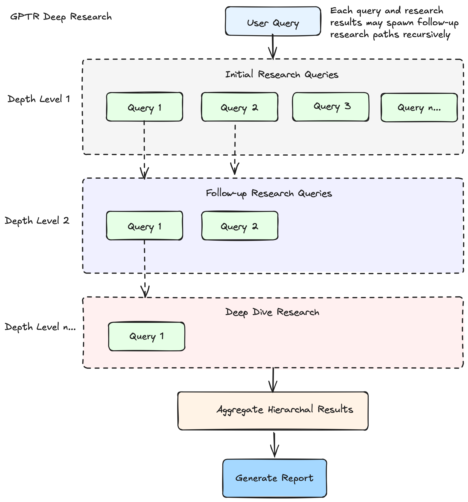
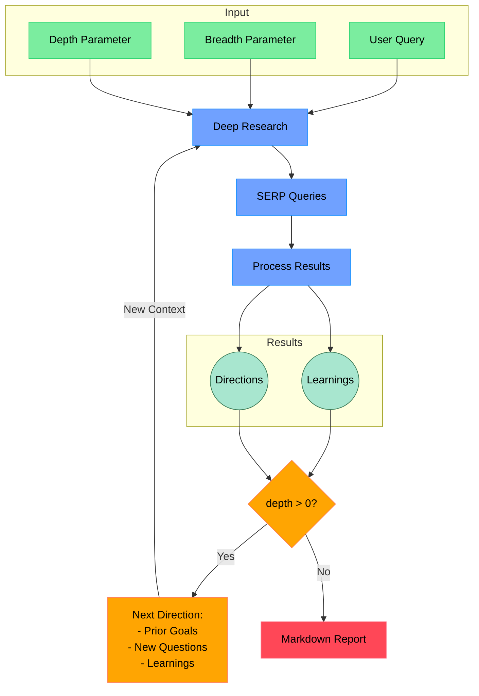
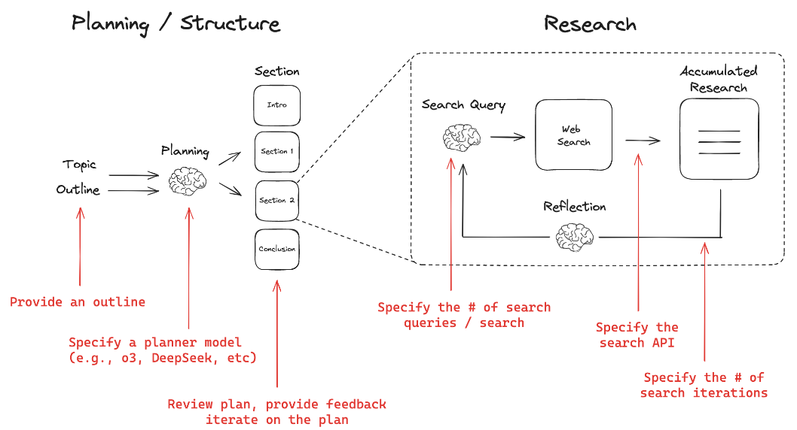

## 1. 什么是DeepResearch

下面开始讨论Deep Research 的定义、目的和预期影响

**什么是 Deep Research？**

Deep Research 是由 OpenAI 开发的一款人工智能智能体（AI Agent），旨在通过多步骤推理、动态信息检索与多模态数据整合，自动化完成复杂研究任务并生成专业级分析报告。其核心目标是为用户提供高效、精准的深度研究支持，适用于学术、商业、政策等领域的高强度知识工作。

Deep Research 的主要目的是**节省用户的时间**，通过代表用户执行深入研究和分析。它旨在通过自动化复杂的、耗时长的网络研究来释放宝贵的时间。
Deep Research 是一种新兴的 AI 工作流程或能力，旨在超越传统的简单网络搜索，提供对复杂主题的深入、全面的研究和分析。它通过模拟人类研究员的工作方式，自主地进行多步骤研究，并生成详细的、带引用的报告。

具体而言，Deep Research 旨在完成需要对在线信息进行大量探索和分析的**复杂、多步研究任务**。它旨在提供**全面、有洞察力的研究报告**，达到研究分析师的水平。它可以帮助用户**快速了解任何主题** 或对复杂主题进行深入研究。

**Deep Research 核心功能**

1. **多步骤自主研究与动态优化**
   - 通过强化学习驱动的推理模型（如 o3、r1），自主规划研究路径、检索信息、分析数据，并根据过程动态调整策略。
   - 支持长时、多步研究任务（5~30 分钟），可自动切换数据源或扩展关键词，提升研究深度和广度。
   - 能处理复杂、多方面的问题，递归探索并合成有深度的解答。

2. **多模态数据处理与融合**
   - 能解析和整合文本、图像、表格、PDF等多种数据格式，包括用户上传的文件。
   - 提取结构化信息，并融合非结构化文本，实现多模态信息的统一分析。
   - 通过语义相关性评分排序检索结果，优先整合权威来源（如学术论文、行业报告）。

3. **强大的推理、分析与知识综合能力**
   - 具备深入思考、分析和自我批判能力，能评估信息质量、识别知识差距，并根据新信息调整研究计划。
   - 将研究发现综合成全面、有洞察力的多页报告，报告水平可达专业分析师标准。

4. **可追溯引用与过程透明**
   - 报告带有详细引用来源（如文献 DOI、网页 URL），可引用具体句子和段落，方便用户验证。
   - 支持过程透明化展示（如侧边栏显示研究步骤），提升研究可追溯性。

5. **多样化输出与可视化**
   - 支持文本、表格、可视化图表等多种输出格式，并能嵌入图片。
   - 一些实现还支持报告的音频概述/播客版本及导出/分享功能。

6. **智能体特性与长时间自主任务**
   - 作为智能体系统，能够长时间自主执行任务，是自动化复杂网络研究的核心能力。
   - 能自主搜索并深度浏览互联网上的海量信息，信息来源广泛，可达数百个网站。

这些核心功能使 Deep Research 能够自动化、系统化地完成复杂、耗时的研究任务，帮助用户高效深入理解任何主题，支持各类知识工作和决策过程。

### 局限性和挑战

综合来看，这些来源指出 Deep Research 作为一个新兴的 AI 工作流程和智能体能力，在带来巨大价值的同时，也面临着一些固有的挑战和局限性。主要可以归纳为以下几个方面：

| 局限性类别                   | 具体表现与挑战                                                                                                                                                                                                                                                                                                                                                 |
|------------------------------|--------------------------------------------------------------------------------------------------------------------------------------------------------------------------------------------------------------------------------------------------------------------------------------------------------------------------------------------------------------|
| 计算资源、成本与时间消耗      | - Deep Research 通常计算密集，需多次并发查询和长时间推理，API 使用量和成本较高。 - 任务耗时较长（如 5~30 分钟），并行处理需更多系统资源。 - 成本和时间消耗随任务复杂度、模型选择和反思循环次数增加。                                                                                                              |
| 信息质量与准确性（幻觉、偏差、权威性） | - 可能产生事实性幻觉或不正确推断，错误在多步推理中易被放大。 - 难以区分权威信息与传闻，模型和搜索索引可能带有偏见。 - 搜索结果质量受限于底层索引和排名算法，存在信息空白、近期偏差等问题。                                                                                                   |
| 技术与工作流程挑战           | - 需处理大量内容，长文档易超出上下文窗口，影响答案生成。 - 多步迭代规划难度大，需在全面性、资源和等待时间间权衡。 - 长时间推理任务需容错，单点失败不应导致整体失败。 - 某些实现难以处理现代网站（如需 JS/cookie），报告和引用可能有格式小错误，任务启动慢。                                     |
| 可用性与互动局限             | - 系统传达不确定性能力弱，缺乏置信度校准。 - 复杂任务需多次澄清用户需求，部分实现难以处理复杂或难获取的信息，需用户多次调整提示，系统难以有效应用这些调整。                                                                                                                    **总结**

总的来说，尽管 Deep Research 在自动化复杂研究任务、节省时间和提供深入报告方面展现出巨大潜力，但计算成本、处理复杂信息的能力（尤其是幻觉、偏差和区分信息来源权威性）、技术实现的鲁棒性（如错误处理、上下文管理和网站浏览能力）以及用户交互的精细度仍然是其面临的关键挑战和正在积极解决的局限性。

### 应用场景

- **学术研究**：自动生成文献综述，对比不同研究结论，标注争议点，支持市场和学术研究。
- **商业分析与竞争情报**：市场趋势预测、竞品分析、竞争对手产品/定价/营销分析，进行尽职调查，帮助企业提升用户留存率等关键指标。
- **政策与法律**：检索判例，生成抗辩策略草案，辅助律师和政策分析师快速微调和决策。
- **消费决策与产品研究**：为高价值商品（如汽车、家电）等提供个性化购买建议，进行产品比较、评估不同模型的特点、性能、价格和评论。
- **知识工作支持**：辅助金融分析师、科学家、工程师等知识工作者进行密集的知识分析和内容组织，如为演示文稿整理内容。
- **复杂问题解答**：回答需要多步推理和整合多个来源信息的复杂问题，寻找特定或非直观的信息，深入理解和比较关键概念、解释基本原理。

通过提供全面、有引用的内容，Deep Research 旨在帮助用户做出更明智的决策。

**Deep Research 的预期影响：**

引入 Deep Research 被视为**改变我们与信息互动方式的根本性转变**。它将**信息检索和分析的边界向前推进**，使以前只有人类研究人员和分析师才能进行的更高推理层级的知识工作成为可能。

Deep Research 代表着 AI 智能体领域的**下一步发展**。它通过使其能够在无人监督的情况下更长时间地执行自主任务，是**AGI（通用人工智能）路线图的核心**。最终的愿望是构建能够为自己发现和创造新知识的模型。Deep Research 的能力，特别是**综合知识的能力，被认为是创造新知识的先决条件**。

OpenAI 认为 Deep Research 能够帮助**企业简化流程，提高工人的生产力**，同时对**消费者**也非常重要。Together AI 认为提供一个可扩展的开源 Deep Research 工具包将有助于社区的进一步构建和实验。Perplexity 致力于让所有人都能使用 Deep Research 这样的强大研究工具。

未来，Deep Research 的能力有望进一步扩展，例如连接到更专业的**数据源**，包括订阅或内部资源。OpenAI 设想 Deep Research 与其他工具（如屏幕操作和文件编辑）相结合，从而能够异步执行更复杂的任务。开源社区也在努力复制和改进 Deep Research 的能力，例如通过构建 GUI 智能体，使其能够像人类一样与屏幕互动。

## 2. 开源Deep Research项目

有来自著名开源组织或项目的，Huggingface的，有来自LangChain的 Open Deep Research，有来自著名大学的，比如Stanford的STORM，还有来自GPT Research.

### Huggingface的Open DeepResearch

开源DeepResearch来自Huggingface的基于Huggingface的MAS开源框架smolagents （一个轻量级的智能代理框架），该项目旨在通过大规模的自动化研究探索，实现深度洞察。smolagents借鉴了微软的[Magentic-One](https://www.microsoft.com/en-us/research/articles/magentic-one-a-generalist-multi-agent-system-for-solving-complex-tasks/)的使用tool的实现。

- 官网：<https://huggingface.co/blog/open-deep-research>
- 代码：<https://github.com/huggingface/smolagents/tree/main/examples/open_deep_research>

#### Deep Research的算法原理

TBD

#### 参考

TBD

### 基于GPT Research的 DeepResearch实现

- 官网：<https://docs.gptr.dev/blog>
- 代码：<https://github.com/assafelovic/gpt-researcher>

### GPT Research的Deep Research实现原理

GPT Research的Deep Research 实现“深度”的主要技术原理

| 技术原理/亮点                                   | 说明                                                                                      | 效果/创新点                                                                                 |
|--------------------------------------------------|-------------------------------------------------------------------------------------------|---------------------------------------------------------------------------------------------|
| 树形递归探索 + 并发异步处理                      | 以树形结构递归展开，每层生成多个子查询，并利用`async/await`等方式并行推进各分支。           | 既能广泛覆盖主题不同面，又能高效深入每条线索，实现“深度”与“效率”兼得。                     |
| 智能上下文聚合与语义归纳                         | 自动聚合各分支成果，通过向量数据库、语义归纳等方式消除冗余，AI自动归纳多分支结果。          | 避免信息孤岛，提升结论质量，类似人类团队“头脑风暴+信息梳理”。                              |
| 实时进度追踪与弹性容错                           | 通过回调实时监控进展，失败查询自动跳过，流程不中断。某些分支失败不会影响整体。              | 系统健壮、可观测，便于调优和定位，提升大规模自动化研究鲁棒性。                              |
| 多参数可调研究策略                               | 灵活设置广度、深度、并发度等参数，支持根据任务复杂度和资源状况动态权衡。                    | 实现定制化深度，满足不同研究需求。                                                          |
| Agent协作与自适应分工                            | 不同特长AI Agent分工协作，动态分配任务。                                                   | 实现“专家小组”式协作研究，提升研究智能化水平。                                              |
| 知识图谱与因果链路自动构建                        | 自动生成知识图谱和因果链，辅助理解多层关系。                                                | 直观理解复杂主题间关系。                                                                    |
| 与真实世界数据流无缝对接                         | 实时抓取API、数据库、IoT等多源动态数据。                                                    | 实现“活数据”驱动的深度研究。                                                               |
| 自我优化与元学习机制                             | 系统根据历史表现自动调整策略，自我发现值得深挖方向。                                        | 持续优化研究效果。                                                                          |
| 多模态深度研究                                   | 支持文本、图片、音频、视频等多模态信息深度分析。                                            | 实现全方位“深度洞察”。                                                                     |

#### 技术亮点与创新

- **递归+并发**：  
  递归树状结构与并发异步执行的结合，是实现“深度”与“效率”兼得的关键。
- **语义归纳与聚合**：  
  类似人类研究团队的“头脑风暴+信息梳理”，AI系统自动归纳多分支结果，提升结论质量。
- **弹性容错**：  
  某些分支失败不会影响整体，提升了大规模自动化研究的鲁棒性。

---

#### 我的思考

1. **引入Agent协作与自适应分工**  
   - 让每个分支由不同特长的AI Agent负责（如检索型、推理型、批判型），并能动态分配任务，实现“专家小组”式协作研究。

2. **知识图谱与因果链路自动构建**  
   - 在深度探索过程中，自动生成知识图谱和因果推理链，帮助用户直观理解复杂主题间的多层关系。

3. **与真实世界数据流无缝对接**  
   - 支持实时抓取外部API、数据库、IoT等多源动态数据，实现“活数据”驱动的深度研究。

4. **自我优化与元学习机制**  
   - 让系统根据历史研究表现自动调整深度、广度、分支策略，甚至自我发现哪些方向最值得深挖。

5. **多模态深度研究**  
   - 不限于文本，还能深度分析图片、音频、视频等多模态信息，真正实现全方位“深度洞察”。

### ByteDance的DeepResearch

- github: <https://github.com/bytedance/deer-flow>
- 官网：<htts://deerflow.tech/>

DeerFlow是一个由社区驱动的深度研究框架，结合语言模型和工具进行任务，如网络搜索、抓取和Python代码执行，旨在为开源社区做出贡献。该项目由字节跳动（Bytedance）维护，拥有模块化多代理系统架构，支持MCP无缝集成、人工协作和文本到语音转换等多项功能。它使用**LangGraph**进行工作流管理，提供丰富的配置选项和交互模式，以实现高效的深度研究流程，并能生成包括播客在内的多种内容。该项目以Python和Node.js开发，支持通过Docker进行部署，并提供详细的安装和配置指南。DeerFlow遵循MIT协议，自豪地基于开源社区的贡献构建。

**架构**
DeerFlow实现了一种模块化的多智能体系统架构，专为自动化研究和代码分析而设计。该系统基于LangGraph构建，支持灵活的基于状态的工作流程，各组件通过定义明确的消息传递系统进行通信。支持搜索引擎：Tavily DuckDuckGo，Brave Search，Arxiv
工作流程： <https://deerflow.tech/#multi-agent-architecture>

### dzhng的DeepResearch

- github: <https://github.com/dzhng/deep-research>
- blog: <https://github.com/dzhng/deep-research>

"deep-research"是一个由dzhng创建的AI驱动的研究助理项目，旨在对任何主题进行迭代的深入研究。该项目结合了搜索引擎、网络爬虫和大型语言模型，其核心目标是提供简化的深度研究代理实现，代码行数控制在500行以内以便于理解和扩展。

主要功能包括生成智能查询、广度和深度控制、并发处理、以及生成包含详细信息和来源的综合报告。用户需配置Node.js环境及相关API密钥（如Firecrawl和OpenAI）进行设置。项目支持Docker运行，并在MIT许可下开放。项目定位于通过递归探索提升研究质量，并最终生成markdown格式的研究报告。

#### 技术实现细节

- 迭代研究：通过迭代生成搜索查询、处理结果并根据发现进一步深入，进行深度研究
- 智能查询生成：利用大语言模型（LLMs），根据研究目标和先前的发现生成有针对性的搜索查询
- 深度与广度控制：可配置参数，用于控制研究的广度（宽度）和深度
- 智能跟进：生成跟进问题，以更好地理解研究需求
- 综合报告：生成包含研究结果和来源的详细Markdown报告

### LangGraph Open Deep Research

- github: <https://github.com/langchain-ai/open_deep_research>
- blog: <https://www.langchain.com/blog/open-deep-research>

### LangGraph Local Deep Research

- github: <https://github.com/langchain-ai/local-deep-researcher>
- youtube: <https://www.youtube.com/watch?v=sGUjmyfof4Q>

### STORM: Stanford Open Virtual Assistant for Research (SOVAR)

- github: <https://github.com/stanford-oval/storm>

### 其他轻量级DeepResearch实现

khoj: <https://khoj.dev/>
github: <https://github.com/khoj-ai/khoj>
blog:<https://blog.khoj.dev/>

#### 效果看起来一般的DeepResearch实现

##### BTAHIR的Open-Deep-Research

github: <https://github.com/btahir/open-deep-research>

Open-Deep-Research是一个开源的强大研究助手，能从网络搜索结果生成基于AI的综合报告。该应用支持与多个AI平台（如Google、OpenAI、Anthropic、DeepSeek及本地模型）的无缝集成，为用户提供自定义AI模型选择和搜索配置的自由。其主要功能包括灵活的网络搜索、内容提取、多平台AI支持、报告生成与多种导出格式、知识库管理以及本地文件支持。此外，该应用还提供“流”特性，支持递归探索和报告整合。技术栈包括Next.js、TypeScript、Tailwind CSS等。通过配置文件，用户可以自定义搜索提供商和AI模型选项。该项目遵循MIT许可证，欢迎贡献和进一步协作。

## OpenAI Deep Research

## Gemini Deep Research

## Perplexity Deep Research

## CoherAI Deep Research

## 其他的Deep Research实现

### 叫DeepResearch名的非DR项目

#### Jina AI的DeepResearch

来自Jina AI的DeepResearch项目：<https://github.com/jina-ai/node-DeepResearch：> 与OpenAI/Gemini/Perplexity的“深度研究”不同，该项目只专注于通过迭代过程找到正确答案。其并不针对长篇文章进行优化，那是完全不同的问题 —— 因此，如果你需要从深度搜索中获得快速、简洁的答案，那你来对地方了。如果要找像 OpenAI/Gemini/Perplexity 那样由人工智能生成的长篇报告，这个项目不适合。

### mshumer的OpenDeepResearcher

<https://github.com/mshumer/OpenDeepResearcher>

### AI scientist

The AI Scientist: Towards Fully Automated Open-Ended Scientific Discovery
<https://github.com/SakanaAI/AI-Scientist>

人工智能面临的重大挑战之一是开发能够开展科学研究并发现新知识的智能体。虽然前沿模型已经被用于协助人类科学家，比如用于头脑风暴想法或编写代码，但它们仍然需要大量人工监督，或者在很大程度上局限于特定任务。
我们很高兴推出人工智能科学家，这是首个用于全自动科学发现的综合系统，使基础模型（如大语言模型（LLMs））能够独立进行研究。
我们在此处提供论文中的所有运行过程和数据，我们在每个模板上对每个基础模型运行约 50 个想法。我们强烈建议阅读一些克劳德（Claude）相关论文，以了解该系统的优缺点。

### zilliztech的deep-searcher

[Zilliz’s Deep Searcher](https://github.com/zilliztech/deep-searcher) 是一个开源的OpenAI的深度研究本地替代品，是一个具代理性RAG框架，重新定义了AI驱动的企业搜索。它结合了先进的推理模型、复杂的搜索功能以及集成的研究助手，使用Milvus高性能向量数据库进行本地数据整合，提供更快更相关的搜索结果，并支持模型切换以定制体验。DeepSearcher通过将查询拆分为多个子问题，进行多轮实时检索，具备主动问题解决、动态自我纠正和复杂推理任务的能力。此外，它全面记录搜索和推理过程，为调试和优化提供透明度，适合构建企业搜索解决方案或为数据密集型项目提供强大的研究助手，代表了开放源代码可定制AI代理的发展趋势。

## 如何评估DeepResearch输出的质量？

## 对自己开发DeepResearch的启发

##

有哪些DeepResearch？各自如何实现，各自优缺点？
如何评估DeepResearch？使用什么数据集来评估？评估标准。
DeepResearch如何处理一些版权问题和网站需要登录信息才能访问，一些网站需要订阅才能阅读的问题。
DeepResearch和DeepThinking的关系。
DeepResearch和Notebook LM，Learn About的关系。
DeepResearch和早期的AutoGPT, AgentGPT等自动化Research是什么关系？
个人收集一些困难的问题来难倒O1或R1模型？社区上贡献的问题。

公众号：<https://mp.weixin.qq.com/s?__biz=Mzg2ODEwNjU0Nw==&mid=2247487014&idx=1&sn=7b4efaff7cce0f18045fbde5433b679a&chksm=cfffebdd182175c80612b299b71d8cac45d2b818e4b8f16b138ddfc84a08e206f1f07cffg工作公众号：>

## TBD

Deep Research 是一个新兴的 AI 工作流程和一种能力。它是一种先进的递归研究系统或智能体，旨在通过深入和广泛地探索主题来进行深入研究。它使用推理来搜索、分析和综合来自互联网的大量在线信息，甚至可以处理图像、表格和 PDF。不同于传统的查询-文档模型，Deep Research 能够接受复杂的多方面问题，并返回全面、合成的报告。它可以自动浏览多达数百个网站，思考其发现，并创建富有洞察力的多页报告。在 OpenAI 的实现中，它由经过微调的 O3 推理模型提供支持，该模型针对网页浏览和数据分析进行了优化。在 Together AI 的实现中，Open Deep Research 是一个 LLM 智能体工作流程，它整合了来自 TogetherAI 云平台的模型，并使用 Tavily 来检索网页信息。Perplexity 的 Deep Research 也会执行数十次搜索，阅读数百个来源，并通过材料进行推理。

Deep Research 的工作方式通常遵循一种递归的树状探索模式 或多步过程。它通常包括规划（将查询转化为研究计划）、搜索和深入浏览网页以查找信息、推理和迭代处理信息，以及将发现综合成全面报告。它能够在探索过程中根据新信息调整计划。这种系统具有智能体特性，可以自主执行多步搜索、评估信息质量、识别知识差距，并将发现综合成连贯的报告。

值得注意的是，Deep Research 可能会花费比标准研究更长的时间，例如 5 分钟甚至 30 分钟才能完成，这被认为是其执行自主任务能力的核心。
