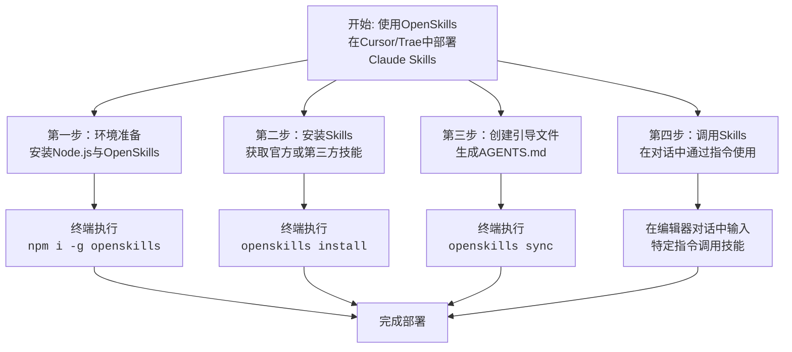

## OpenSkills 使用指南

在 Cursor 和 Trae 这类编辑器中使用 Claude Skills，可以借助一个名为 **OpenSkills** 的开源工具来实现的。下面的流程图清晰地展示了从准备到使用的完整步骤，你可以一目了然地掌握整个过程。



下面，我们来详细讲解每个步骤的具体操作。

### 详细步骤与使用方法

#### 第一步：安装 OpenSkills 工具

OpenSkills 是一个命令行工具，它是让非 Claude 官方环境（如 Cursor、Trae）能够使用 Claude Skills 的关键桥梁。

- **操作**：打开终端（Terminal），输入以下命令进行全局安装：

    ```bash
    npm install -g openskills
    ```

    这只需要执行一次。

#### 第二步：安装所需的 Claude Skills

安装好 OpenSkills 后，下一步是将具体的 Skills 安装到你的项目中。

- **安装官方Skills**：在项目的根目录下，执行以下命令。你可以选择将技能安装到当前项目或全局环境。例如，安装到当前项目：

    ```bash
    openskills install anthropics/skills
    ```

    运行后，会看到一个交互界面，让你选择要安装的特定技能（如 `pdf`, `frontend-design`, `pptx` 等）。默认是全选，你可以用空格键勾选自己需要的。
- **安装第三方Skills**：你也可以安装社区开发的技能，只需要替换掉仓库地址即可：

    ```bash
    openskills install https://github.com/某个技能仓库地址.git
    ```

- **验证**：安装成功后，你的项目文件夹里会出现一个 `.claude/skills` 目录，里面包含了所有安装好的技能文件。

#### 第三步：创建 AGENTS.md 引导文件

这是最关键的一步，前两步只是准备了“工具包”，这一步是创建让 AI 编程助手能发现并使用这些工具包的“说明书”。

- **操作**：
    1. 首先，在项目根目录**手动创建一个名为 `AGENTS.md` 的空文件**。
    2. 然后，在终端运行同步命令：

        ```bash
        openskills sync
        ```

    3. 同样在交互界面中选择你希望写入 `AGENTS.md` 文件的技能，确认后回车。OpenSkills 就会将技能的摘要信息写入该文件，AI 助手（如 Cursor 的 Agent）就能据此识别可用的技能了。

#### 第四步：在对话中调用 Skills

完成以上配置后，你就可以在 Cursor 或 Trae 的聊天窗口中通过特定的指令来调用技能了。

- **自动调用**：当你的需求描述匹配某个已安装技能时，AI 助手可能会自动判断并调用该技能。
- **手动调用**：更可靠的方式是直接在提示词中明确指定。指令格式通常为：“调用 [技能名] skills, [你的具体需求]”。
  - **示例1**（前端设计）：`调用 frontend-design skills，用HTML开发一个视频剪辑软件的SaaS介绍页`。
  - **示例2**（文档处理）：`使用 pdf skills，对2025年11月17日周例会.pdf进行解析，提出要点给我`。

## 高级通用模式（Advanced Universal Mode）

在 `https://github.com/numman-ali/openskills?tab=readme-ov-file#advanced-universal-mode-for-multi-agent-setups` 部分，OpenSkills 文档介绍了 **高级通用模式（Advanced Universal Mode）**，这是一种使用Claude Code配置多代理（Multi-Agent）协作的配置方案。以下是该部分的核心内容解析和注意事项：

### 核心功能：多代理协作模式

该模式允许你在同一项目中使用Claude Code配置多个 Claude 代理（Agents），每个代理专注于不同领域的任务（如代码生成、文档解析、UI设计等），并通过 OpenSkills 实现代理间的协同工作。

#### 配置步骤

1. **创建多代理配置文件**  
   在项目根目录创建 `.claude/agents.json` 文件，定义多个代理及其关联技能：

   ```json
   {
     "agents": [
       {
         "name": "Code Agent",
         "description": "负责代码生成和优化",
         "skills": ["code-optimizer", "debugger"]
       },
       {
         "name": "Doc Agent",
         "description": "处理文档解析与总结",
         "skills": ["pdf", "pptx"]
       }
     ]
   }
   ```

2. **同步代理配置**  
   运行命令同步配置到 `AGENTS.md`：

   ```bash
   openskills sync --multi-agent
   ```

   此时 `AGENTS.md` 会生成多个代理的摘要，供 AI 按需调用。

3. **调用特定代理**  
   在对话中通过代理名指定使用的代理：

   ```markdown
   调用 [Code Agent] 代理：优化这段 Python 代码...
   ```

### **关键注意事项**

1. **代理冲突风险**  
   - 如果多个代理的技能有重叠（例如两个代理都安装了 `pdf` 技能），AI 可能无法确定调用哪个代理。
   - **解决方案**：在 `agents.json` 中明确划分技能归属，或通过提示词指定代理名。

2. **全局代理与项目代理的优先级**  
   - 若同时存在全局安装的代理（通过 `openskills install -g`）和项目本地代理，**项目本地代理优先级更高**。
   - 可通过 `openskills list-agents` 查看当前生效的代理列表。

3. **代理间的上下文隔离**  
   - 每个代理的上下文（记忆、技能状态）是独立的。若需要跨代理共享数据，需手动传递信息（如通过文件或中间变量）。

4. **资源占用问题**  
   - 同时运行多个代理可能显著增加内存/CPU 占用，尤其在处理大文件（如 PDF 解析）时。
   - **建议**：在轻量级任务中启用多代理，复杂任务按需逐个调用。

---

### **典型使用场景**

| 场景                | 配置方案                                  |
|---------------------|------------------------------------------|
| **代码+文档双核协作** | Code Agent（代码技能） + Doc Agent（文档技能） |
| **多语言开发**       | Python Agent + JS Agent + Rust Agent     |
| **设计+前端联动**    | UI Designer Agent + Frontend Dev Agent  |

---

### **故障排查**

若遇到代理未响应：

1. 检查 `agents.json` 语法是否正确（可通过 `JSONLint` 验证）；
2. 运行 `openskills sync --debug` 查看同步日志；
3. 确保 `AGENTS.md` 未被手动修改（否则会覆盖配置）。

通过此模式，你可以构建一个“AI 团队”，让不同代理各司其职，显著提升复杂任务的完成效率。如需进一步优化协作流程，可结合 OpenSkills 的 `hook` 功能（如任务完成后自动触发下一个代理）。

## 总结

希望这份指南能帮助你在 Cursor 和 Trae 中顺利运用 Claude Skills 来提升你的编程效率。如果你在某个具体步骤（比如安装或调用）中遇到问题，可以告诉我，我很乐意提供更详细的帮助。

## 参考文献

- [Github: OpenSkills](https://github.com/numman-ali/openskills)
