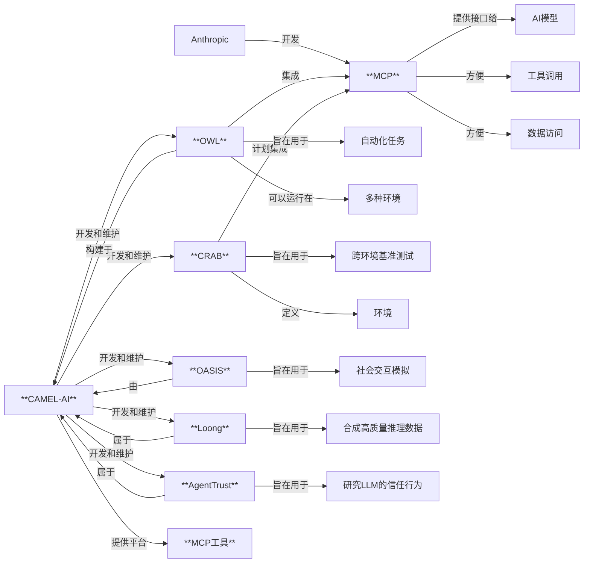

+++
title = "CAMEL子项目介绍"
date = "2025-04-04T23:09:00+08:00"
draft = true
tags = ["CAMEL", "Multi-Agent"]
categories = ["project", "technologies"]
description = "CAMEL项目延伸出来的很多子项目和研究"
+++

CAMEL项目延伸了很多子项目和研究，具体如下

## OWL 项目

**OWL 项目（Optimized Workforce Learning，优化劳动力学习）的主要目的是为了实现真实世界任务的自动化**。它是一个**基于 CAMEL-AI 框架构建的开源多智能体协作框架**。

更具体地说，OWL 项目旨在实现以下目标：

* **自动化复杂的数字任务**：OWL 通过使用浏览器、终端、代码执行、函数调用和 MCP 工具等多种能力来自动化多步骤的数字工作流程。
* **模拟人类协作模式**：OWL 的核心概念是模仿人类的协作方式，将复杂的任务分解为可执行的子步骤，并通过具有不同角色的智能体分工完成。
* **提供一个自主的通用 AI 代理**：OWL 旨在成为一个**完全自主、开源的通用 AI 代理**框架，没有任何付费墙，可以被任何人使用和构建。
* **实现无缝的多智能体编排**：得益于 CAMEL-AI 框架，OWL 可以实现智能体之间的**无缝协作**。
* **简化部署**：OWL 内置 **Docker 支持**，方便在云端或本地进行部署。
* **支持多种先进模型**：OWL 被设计为灵活且可适应，**兼容多种领先的 AI 模型**，包括 GPT-4o、Qwen、Mistral、Claude 3.5 Sonnet 和 DeepSeek 等云端模型，以及 Ollama、vLLM 和 SGLang 等本地部署方案，并支持 Groq 和 SambaNova 后端以实现快速推理。
* **集成丰富的工具集**：OWL 包含 **30 多个工具包**，使其具备广泛的功能。
* **实现标准化和高效的工具调用**：OWL **支持模型上下文协议 (MCP)**，可以调用其生态系统内的 MCPServer，从而实现更标准化和高效的工具调用。
* **提供领先的性能**：OWL 在 GAIA 基准测试中取得了令人瞩目的成绩，在开源通用代理中**排名第一**。
* **促进社区合作与发展**：作为一个开源项目，OWL 旨在建立一个活跃的社区，共同构建、测试和扩展其功能。

总而言之，OWL 项目的目标是打造一个**强大、灵活且易于使用的开源框架**，通过**多智能体的协同工作**和**广泛的工具集成**，实现各种复杂数字任务的自动化，并成为一个领先的**通用人工智能代理**平台。它通过集成 MCP 等先进技术，进一步提升了其在工具调用和跨平台协作方面的能力，旨在解决代理自动化的实际应用难题。

## Loong 项目

Loong 项目的主要目的是**通过验证器大规模合成各种领域的长链思维（CoT）数据**。该项目的目标在于解决许多领域（如逻辑、图论、物理和金融）缺乏高质量数据集的问题，这些数据集对于提升模型在这些领域的推理能力至关重要。

更具体地说，Loong 项目旨在：

* **扩展合成数据生成**：不仅为了填补数据稀疏领域的空白，还为了通过增加数据集的可用性来增强数学和编程等领域的推理能力。
* **弥合合成数据中的验证差距**：由于合成答案的正确性无法天然保证，Loong 项目开发了一个多智能体系统，该系统从**种子数据集**生成合成问题和答案。然后，使用各种领域特定的**验证器**来比较待训练智能体的响应与合成答案，以检查语义上的等效性。
* **创建一个统一的环境**：Loong 将所有组件构建成一个类似 Gym 的**环境**，为强化学习实验提供清晰的接口。这个环境包含**种子数据集**、**合成数据生成器**和**验证器**三个主要组件。
* **提高领域特定的智能体推理能力**：通过强化学习训练生成 CoT 的智能体，只有当其最终答案被验证器语义上确认为与合成答案匹配时，该智能体才会获得正向奖励，从而确保它只从可能是正确的合成数据中学习。
* **促进在数据稀疏领域构建可靠的推理数据集**，通过可验证性来确保数据质量。

总而言之，Loong 项目致力于通过**可验证的合成数据生成**来克服数据限制，从而**提升人工智能在更广泛领域内的推理能力**。

## OASIS 项目

OASIS 项目的主要目的是**构建一个通用且可扩展的社会媒体模拟器**，旨在**更真实地模拟包括 Twitter 和 Reddit 等平台上的大规模用户行为和社交动态**。

更具体地说，OASIS 项目旨在实现以下目标：

* **模拟大规模用户互动**：OASIS 能够支持**高达一百万个智能体**的模拟，使其能够研究与真实世界平台规模相当的社会媒体动态。
* **集成大型语言模型（LLMs）**：OASIS 利用 LLMs 为智能体提供动力，使其能够创建帖子、分享内容、关注其他用户并参与讨论，从而使智能体的行为更加自然和真实。
* **提供动态环境**：OASIS 能够**适应社交网络和内容的实时变化**，镜像 Twitter 和 Reddit 等平台的流动性，以实现真实的模拟体验。
* **支持多样化的行动空间**：智能体可以执行**21 种不同的行动**，例如关注、评论和转发，从而实现丰富、多方面的互动。
* **集成推荐系统**：OASIS 包含基于兴趣和热度的推荐算法，模拟用户如何在社交媒体平台上发现内容并进行互动。
* **复现现实世界的社会现象**：研究人员已成功使用 OASIS **复现了信息传播、群体极化和羊群效应**等主要的社会科学研究结果。
* **研究大规模群体行为**：OASIS 可以轻松扩展到不同的社交媒体平台，以研究大规模的群体现象和行为。
* **为平台设计和政策制定提供见解**：通过模拟社会媒体动态，OASIS 有助于理解错误信息的传播方式、回音室的形成以及集体行为的出现，从而为改进平台设计和制定更有效的在线空间管理策略提供见解。
* **提供可控的研究环境**：与在现实世界中研究社会媒体现象相比，OASIS 提供了一个**受控的环境**，可以降低成本、节省时间并减少伦理问题。
* **作为其他应用的平台**：OASIS 是构建类似 X（Twitter）的社交媒体环境 “Matrix” 的基础，该环境可用于营销策略测试、产品反馈收集等。

总而言之，OASIS 项目旨在通过创建一个**高度可扩展和真实的社交媒体模拟平台**，利用 LLM 驱动的智能体模拟用户行为，从而**深入理解社会媒体的动态和影响**，并为学术研究、平台设计和政策制定提供有价值的工具和见解。

## CRAB 项目

CRAB 项目，全称为 **CR**oss-environment **A**gent **B**enchmark（**跨环境代理基准**），是由 CAMEL-AI 社区开发的**首个支持跨设备任务执行的代理框架和基准**。其主要目的是解决当前图形用户界面（GUI）代理通常只能在单个设备上操作的局限性，从而构建能够**同时在多个不同的操作环境（如电脑和手机）中协同完成任务**的智能代理。

更具体地说，CRAB 项目旨在实现以下目标：

* **构建首个跨环境代理基准**：CRAB 的核心目标是创建一个**标准化的平台**，用于评估和比较不同 AI 代理在跨多个操作环境下的性能。
* **支持多设备协同操作**：CRAB 创新性地实现了代理能够**在多个设备（例如 Ubuntu 电脑和 Android 智能手机）上同步执行任务**，以完成需要跨平台协作的复杂工作流程。
* **提出新的评估方法**：CRAB 不仅是一个基准工具，还提出了**图评估器（graph evaluator）** 和 **任务合成（task synthesis）** 这两项新技术，以更细粒度地评估代理在复杂任务中的进展。图评估器通过将任务分解为多个子目标，并跟踪代理在每个子目标上的完成情况来评估性能。
* **提供交互协议和实现**：CRAB 为环境和代理之间的交互定义了一套**协议**并提供了相应的实现，为未来跨环境代理的研究和应用奠定基础。
* **推动 GUI 代理的标准化评估**：CRAB 的目标是成为未来评估 GUI 代理性能的**重要标准之一**。
* **易于扩展和定制**：CRAB 的**代码库采用模块化设计**，用户可以像搭建积木一样轻松构建和定制自己的多环境基准。
* **提供基准数据集**：基于 CRAB 框架，研究人员开发了 **CRAB Benchmark v0** 数据集，该数据集包含在 Ubuntu 和 Android 环境下执行的 100 个真实世界任务，涵盖了跨平台和单平台任务，用于评估代理的实际应用能力。
* **解决跨环境操作的关键挑战**：CRAB 特别关注并旨在衡量和提升代理在跨环境操作中所需的关键能力，例如**抽象技能、适应机制、迁移学习和元学习**。
* **促进环境驱动的智能发展**：CRAB 项目与 CAMEL-AI 的“代理扩展规律”假说相一致，强调**智能源于代理与其环境的相互作用**，而跨环境的基准测试能够有效拓展和提升代理的能力。
* **为物联网等领域应用带来潜力**：CRAB 的跨环境能力为物联网（IoT）等需要管理多个异构设备的领域提供了新的解决方案思路。

“Environments” 指的是代理执行任务的具体场景。CRAB 项目正是通过构建和标准化**多个不同环境**，并提供相应的评估方法，来推动 AI 代理在更复杂、更贴近现实世界的场景中实现自动化和智能化。CRAB 与 OWL 和 MCP 的结合，旨在解决代理自动化的“最后一公里”问题，使代理能够在不同的平台和设备上无缝协作。

## 正确理解Environment的含义

在所有CAMEL博客中反复提到的 “**Environments**”（环境）一词，在人工智能代理（AI Agents）的语境下，指的是**代理执行任务、进行互动、学习和进化的** **具体场景、平台或系统**。它不仅是代理活动的场所，更是代理获取经验和知识的关键来源，可以被视为代理的“数据”。

更具体地说，“Environments” 可以从以下几个方面来理解：

* **代理操作和交互的场所**：环境是代理实际运行和执行动作的地方。这可以是一个**数字化的空间**，例如一个网页、一个应用程序、一个操作系统，甚至是一个**模拟的世界**，比如 OASIS 模拟的社交媒体平台。
* **定义代理的能力和感知**：一个环境会明确定义代理能够执行的**动作空间**（Action Space），即代理可以采取的所有可能的操作；以及代理能够观察到的**观察空间**（Observation Space），即代理可以从环境中获取的信息。
* **提供学习和反馈机制**：对于需要学习的代理，环境通常会提供一个**奖励结构**（Reward Structure），用于评估代理的行为并给予反馈。这在**强化学习**（Reinforcement Learning, RL）中尤为重要，代理通过与环境的互动和接收奖励来学习最优策略。Loong 项目就将所有组件构建成一个类似 Gym 的环境，为强化学习实验提供接口。
* **模拟真实世界的复杂性**：一些环境旨在**尽可能真实地模拟现实世界的复杂性**，以便训练出能够在真实场景中有效工作的代理。例如，OASIS 项目旨在逼真地模拟社交媒体平台的用户行为和动态。
* **跨环境操作的能力**：正如 CRAB（Cross-environment Agent Benchmark）项目所强调的，“Environment” 也可以指不同的设备、应用程序或更复杂的**多设备系统**。能够**跨越不同环境**执行任务是衡量代理智能水平的一个重要方面。
* **评估和基准测试的平台**：环境可以作为评估代理性能的平台。CRAB 的目标就是构建一个基准，使代理能够在多个环境中执行任务。通过在标准化的环境中测试代理，可以比较不同代理的性能，并推动代理技术的发展。
* **合成数据生成的工具**：环境也可以用于**生成合成数据**，特别是在数据稀疏的领域。Loong 项目就利用环境来生成可验证的合成数据，以提升模型在更广泛领域的推理能力。结合 OWL 和 CRAB，可以创建多样化的场景，捕获代理的交互过程，并利用这些数据来训练新的代理模型。
* **智能涌现的关键**：CAMEL-AI 认为，**智能是从代理与其环境的相互作用中涌现出来的**。环境为代理提供了测试和提升自身能力的关键场所，通过设计越来越复杂的环境，可以驱动更智能代理的诞生。

总而言之，“Environments” 在这些博客中指的是**代理活动、学习和被评估的具体情境和条件**。它们是构建通用人工智能代理，特别是通过强化学习和跨环境操作，以及进行有效评估和合成数据生成**不可或缺的基础**。CAMEL-AI 将环境视为代理扩展规律的三个关键维度之一，足见其重要性。

## CAMEL 在MCP方面的进展

CAMEL-AI.org 已经在 **模型上下文协议 (MCP)** 方面开展了多项工作，并且计划继续深化这方面的整合和应用。以下是 CAMEL-AI.org 准备在 MCP 上进行的一些工作总结：

* **已完成的 MCP 集成：**
  * **在 OWL 框架中集成 MCP：** OWL (Optimized Workforce Learning) 是 CAMEL-AI 社区开发的多智能体协作框架，它已经**支持使用 MCP 协议来调用其生态系统内的 MCPServer**，从而实现更标准化和高效的工具调用。这使得 OWL 能够利用 MCP 提供的统一接口与各种外部工具和数据源进行交互。
  * **在 CAMEL 框架中集成 MCP：** CAMEL 框架本身也**集成了 MCP**，以拥抱 MCP 生态系统。这为构建在 CAMEL 基础上的智能体系统提供了使用 MCP 的能力。
  * **OWL 中 MCP 的应用示例：** 资料中提供了一个详细的演示案例，展示了如何通过 OWL 框架和 MCP 来完成一项复杂的任务，例如搜索 Andrew Ng 的学术信息并整理成报告保存到桌面。这个例子体现了 MCP 在简化工具调用和数据访问方面的优势。
  * **CAMEL-AI MCP 工具集成平台：** CAMEL-AI.org 建立了一个 **MCP 工具集成平台** (<https://www.camel-ai.org/mcp>)，用户可以在该平台上找到各种 MCP 支持的插件。这表明 CAMEL-AI 致力于构建和推广基于 MCP 的工具生态。
  * **OWL 内置 MCP 支持：** OWL 被描述为一个**完全自主的多智能体系统**，其中包含了对 **Anthropic 的模型上下文协议 (MCP) 的内置支持**，以实现无缝的工具互操作性。

* **计划进行的 MCP 相关工作：**
  * **在 CRAB 框架中集成 MCP：** CRAB (Cross-environment Agent Benchmark) 项目计划在未来的更新中**引入 MCP**，以实现与任何模型或框架的**无缝集成**。这意味着 CRAB 将能够利用 MCP 的标准化接口，使其跨环境操作的代理能够更方便地调用各种外部工具和服务。
  * **简化 CRAB 的配置和提高可用性：** 将 MCP 集成到 CRAB 中也是提升框架**可用性**的举措之一。MCP 的标准化特性有望简化跨环境代理与不同工具的连接过程。
  * **构建MCP HUB**，让Agent能理解这些工具，能自动从MCP Hub里面搜索不同task合适的MCP Server，能把更多的tool转换成MCP。

总而言之，CAMEL-AI.org 正在积极拥抱和集成模型上下文协议 (MCP)。他们已经将 MCP 集成到其核心框架 OWL 中，并计划将其引入 CRAB，旨在利用 MCP 提供的**标准化接口、工具生态和安全性**，提升其多智能体系统在**工具调用、数据访问和跨环境协作**方面的能力，从而进一步推动通用人工智能代理的发展和应用。CAMEL-AI.org 还通过建立专门的平台来促进 MCP 工具的发现和使用。

## Agent Trust

根据你提供的新信息和引用的来源 ["Exploring AI and Trust: A Conversation with Groundbreaking Researchers"]，**AgentTrust 项目的主要目的是为了研究大型语言模型（LLMs）代理是否能够模拟人类的信任行为**。

更具体地说，AgentTrust 项目旨在：

* **提供一个平台，用于探索 LLM 代理在模拟信任博弈等经典行为经济学模型中的表现**。研究人员通过这个项目，可以观察和分析 LLM 代理在面对需要信任和合作的场景时，如何做出决策，以及这些决策是否与人类的信任行为模式相一致。
* **促进对 AI 与人类在信任方面的对齐进行研究**。通过比较不同 LLM 模型在相同信任博弈中的表现，研究人员可以发现哪些模型能够更接近地模拟人类的信任水平和行为。这对于理解 AI 代理的局限性和潜力，以及如何设计更值得信赖的 AI 系统至关重要。
* **为设计和部署智能代理框架提供新的思路**。理解 LLM 代理的信任行为，对于开发涉及多代理协作和人机交互的智能系统具有重要意义。研究结果可以为优化这些系统中的信任机制提供理论基础。
* **贡献于人机协作和 AI 安全领域**。研究发现 AI 代理在信任行为上与人类的对齐程度，有助于开发更高效和可靠的人机协作系统，并降低因 AI 行为不一致而可能产生的安全风险。
* **作为一个开源项目，鼓励更广泛的研究和合作**。通过开放源代码（如你提供的 GitHub 链接），AgentTrust 项目旨在吸引更多研究人员参与到 AI 信任行为的研究中，共同推动该领域的发展。

总而言之，AgentTrust 项目是一个**开源的研究项目**，其核心目标是**利用行为经济学模型（特别是信任博弈）来评估和理解大型语言模型代理模拟人类信任行为的能力**，从而为**AI 对齐、人机协作和 AI 安全**等领域提供有价值的见解。该项目的研究成果，如论文 "Can Large Language Model Agents Simulate Human Trust Behaviors?" 所示，旨在揭示不同 LLM 模型在信任方面的表现差异，并探讨其背后的原因。

### 参考

* [Exploring AI and Trust: A Conversation with Groundbreaking Researchers](https://www.camel-ai.org/blogs/exploring-ai-and-trust-a-conversation-with-groundbreaking-researchers)
* [Agent Trust Github](https://github.com/camel-ai/agent-trust)

## 总结

