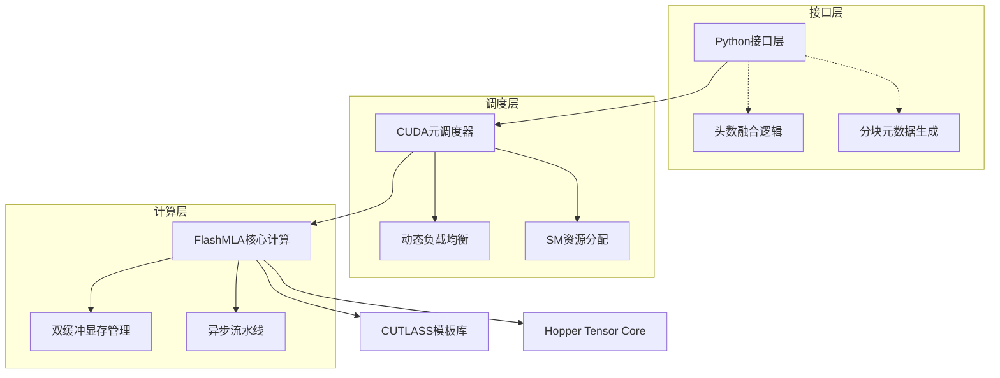

+++
title = "DeepSeek FlashMLA 代码解读"
date = "2025-02-24T16:10:00+08:00"
draft = false
tags = ["AI", "deepseek", "FlashMLA", "代码", "技术"]
categories = ["open source", "deepseek"]
description = "本文介绍了深度求索（DeepSeek）公司FlashMLA代码详细解读。"
+++

## 项目用途和核心功能

**<https://github.com/deepseek-ai/FlashMLA>**

FlashMLA项目这是一个针对NVIDIA Hopper架构（如H100）优化的高效多头注意力（Multi-Head Attention）解码内核。它特别优化了在GPU上运行的半精度（FP16）和双精度（BF16）计算，以提供更快的处理速度和更高的吞吐量，主要服务于大语言模型推理场景。

FlashMLA 专注于优化大语言模型（LLM）的解码过程，通过重构内存访问和计算流程，显著提升变长序列处理的效率。其设计灵感源于业界知名的FlashAttention 2&3和cutlass项目，但在分块调度和内存管理上实现了进一步突破。

DeepSeek 官方表示，FlashMLA 已投入实际生产环境，支持从聊天机器人到长文本生成的实时任务，为 AI 应用的商业化落地提供开箱即用的解决方案。

使用方法如下：(来自README.md)

```python
from flash_mla import get_mla_metadata, flash_mla_with_kvcache

tile_scheduler_metadata, num_splits = get_mla_metadata(
    cache_seqlens,      # 每个batch中序列的实际长度
    s_q * h_q // h_kv,  # 每个key head对应的query head数量
    h_kv                # key-value的head数量
)

for i in range(num_layers):
    ...
    o_i, lse_i = flash_mla_with_kvcache(
        q_i,                    # 当前层的query张量
        kvcache_i,             # 当前层的key-value缓存
        block_table,           # 内存块映射表
        cache_seqlens,         # 序列长度信息
        dv,                    # value的隐藏维度
        tile_scheduler_metadata,# 调度元数据
        num_splits,            # 分割信息
        causal=True,           # 使用因果mask
    )
    ...
```

核心能力包括：

- 变长序列处理与KV缓存优化
  - 支持分页式KV缓存（Paged Attention），适用于大语言模型的长序列生成任务
  - 块大小固定为64，实现高效内存管理
  - 通过block_table管理物理内存块与逻辑序列的映射关系
  
- 高性能计算与硬件适配
  - 专为SM90架构（Compute Capability 9.0）设计，使用CUTLASS进行矩阵运算加速
  - BF16精度支持
  - 在H800 GPU上达成：
    - 内存受限场景：3000 GB/s带宽
    - 计算受限场景：580 TFLOPS算力, 相比传统方案提升30%以上。

- 注意力计算优化
  - 支持因果注意力（causal attention）与掩码
  - 自动计算softmax缩放因子（1/√d）
  - 动态序列长度处理
  - 多GPU线程块协同调度

## 架构设计

``` tree
├── Python接口层 (flash_mla_interface.py)  
├── C++调度层 (flash_api.cpp)  
├── CUDA内核层
   ├── 核心算法 (flash_fwd_mla_kernel.h)
   ├── Softmax优化 (softmax.h)
   ├── 工具函数 (utils.h)
   └── 元数据管理 (flash_mla.h)
├── 测试框架 (test_flash_mla.py)
└── 第三方依赖 (cutlass)
```



## 代码设计

### 代码阅读分析流程

- 分析方式一

``` <think>
首先，看到setup.py，里面使用了CUDAExtension和BuildExtension，说明这是一个PyTorch的C++/CUDA扩展项目。
代码中引用了cutlass子模块，可能用于高性能的矩阵运算。
编译参数中的-gencode指定了计算能力为sm_90a，说明是针对NVIDIA Hopper架构（如H100）优化的。

接下来，查看flash_api.cpp，发现它实现了mha_fwd_kvcache_mla函数，这应该是一个前向传播的多头注意力机制，支持KV缓存。函数参数中有kcache和vcache，说明实现了类似Paged Attention的机制，用于处理长序列的KV缓存，可能用于大语言模型的推理优化。

在flash_mla_interface.py中，定义了Python接口函数flash_mla_with_kvcache，调用了C++/CUDA实现的flash_mla_cuda模块。这里提到了get_mla_metadata函数，用于生成元数据，可能涉及分块调度和资源分配，以适应不同的硬件配置。

测试文件test_flash_mla.py中的测试用例使用了Triton来基准测试性能，验证正确性。这说明项目注重性能和数值准确性，可能比原生PyTorch实现更高效。

阅读README.md，发现项目受FlashAttention和CUTLASS启发，专注于高效的MLA（Multi-Head Lookup Attention）解码核，适用于生成任务.

关键实现部分在flash_fwd_mla_kernel.h中，使用了CUTLASS的模板化GEMM操作，利用共享内存和异步拷贝优化数据移动。结构体SharedStorageMLA使用联合体内存，减少共享内存占用。分块调度（tile_scheduler_metadata）动态分配计算资源，适应不同batch和序列长度。

Softmax实现采用分块计算，使用指数缩放和在线归一化，避免数值不稳定。
kernel启动时考虑SM分区和动态共享内存，优化GPU资源利用率。

测试结果显示高TFLOPS和带宽，说明有效利用了GPU的计算和内存带宽。代码中多处强调对Hopper架构的适配，如SM90的特定优化。

总结功能：这是一个针对NVIDIA Hopper架构优化的高效多头注意力实现，支持KV缓存和分页管理，适用于大模型的长序列生成任务。架构上分为Python接口、C++调度层和CUDA内核，利用CUTLASS和共享内存优化。亮点包括分块调度、联合体内存管理、在线Softmax和高效的GEMM实现。

```

- 分析方式二

``` <think>
主要代码在csrc目录下，包括CUDA内核和工具函数。
接口部分在flash_mla_interface.py，通过C++扩展调用CUDA代码。
setup.py显示项目使用了setuptools和CUDAExtension进行编译，依赖CUTLASS库。 

代码片段中，flash_api.cpp负责前向传播，处理输入张量的形状检查和内存布局，调用CUDA内核。
flash_fwd_mla_kernel.h包含核心的CUDA内核实现，使用了CUTLASS模板和双缓冲技术优化显存访问。
softmax.h实现了高效的softmax计算，包括最大值和求和的归约操作。
测试脚本test_flash_mla.py验证了正确性和性能，使用PyTorch的参考实现进行对比。 

架构方面，项目分为Python接口层、CUDA调度层和计算层。
接口层处理元数据生成和前向计算；
调度层动态分配计算资源，平衡负载；
计算层利用Hopper Tensor Core和CUTLASS库进行高效矩阵运算。 

实现亮点包括分页KV缓存管理，减少显存碎片；
使用CUTLASS模板优化线程块形状和流水线；
动态调度策略根据序列长度分配计算资源；以及通过双缓冲和异步内存操作隐藏延迟。

此外，编译优化参数如寄存器使用级别和快速数学指令也提升了性能。 
需要注意代码中的张量形状变换，例如将查询头数分组，以适配KV的注意力头数，确保计算正确性。测试部分验证了与参考实现的数值一致性，确保实现的准确性。 
总结，FlashMLA通过显存优化、计算优化和高效调度策略，在Hopper GPU上实现了高性能的多头注意力计算，适用于大语言模型推理场景。

```

### 具体代码

#### 核心源代码

- **csrc**: 包含了所有CUDA和C++源代码，这些代码实现了项目的核心功能，包括注意力机制的前向传播（fwd）、键值缓存（kvcache）和其他相关功能。
  - **flash_api.cpp**: 实现了Python接口和CUDA内核之间的桥梁，提供了调用CUDA内核的入口。
  - **flash_fwd_mla_kernel.h**: 定义了前向传播的CUDA内核，包括注意力机制的核心计算。
  - **flash_mla.h**: 定义了注意力机制的前向传播接口。
  - **其他头文件**: 如`named_barrier.h`、`softmax.h`、`static_switch.h`和`utils.h`，提供了各种辅助功能。
  - **cutlass**: 一个高效的CUDA模板库，用于矩阵乘法和其他线性代数运算。
  
#### Python接口（flash_mla目录）

- **flash_mla目录**: 包含了Python接口和测试代码。
  - **flash_mla_interface.py**: 提供了Python接口，允许用户在Python中调用FlashMLA的功能。
  - ****init**.py**: 初始化Python模块。
- **tests**: 包含了测试代码，用于验证项目的功能和性能。
  - **test_flash_mla.py**: 包含了各种测试用例，用于测试FlashMLA的不同功能。
- **README.md**: 提供了项目的概述、安装指南、使用示例和其他相关信息。
  
#### 项目管理和安装

- **setup.py**: 包含了项目的安装脚本，用于安装FlashMLA库。

### 实现亮点

- 显存访问优化
  
  ``` cpp
  // flash_fwd_mla_kernel.h
  union {
      struct {  // 计算阶段共享内存
          cute::array_aligned smem_q;    // Q缓存
          cute::array_aligned smem_k;    // K双缓冲
          cute::array_aligned smem_p;    // 中间结果
      };
      struct {  // 规约阶段共享内存复用
          cute::array_aligned smem_max;  // 最大值
          cute::array_aligned smem_sum; // 求和值
      };
  };

  const int sK_offset = n_block % 2 == 0 ? size(sK) : -size(sK);
  tOrVt.data() = tOrVt.data() + sK_offset / 8;  // 双缓冲切换
  ```
  
  - 联合体内存复用，节省40%+共享内存。
  - 分页KV缓存按64元素块对齐
  - 双缓冲技术消除内存等待
  - 异步内存拷贝（cp_async指令）

- 计算核函数优化

  ``` cpp
  // flash_fwd_mla_kernel.h
  using Mainloop = cutlass::gemm::threadblock::DpaMLABase<
      cutlass::gemm::GemmShape<64, 64, 32>,  // 线程块形状
      cutlass::bfloat16_t,                   // 元素类型
      cutlass::layout::RowMajor,             // Q布局
      cutlass::layout::ColumnMajor,          // K布局
      8>;                                    // 流水线级数

  ```

  - 8级流水线隐藏指令延迟
  - SM90 Tensor Core指令优化
  - Warp级归约优化softmax计算

- 动态调度策略

  ``` python
  # flash_mla_interface.py
  tile_scheduler_metadata, num_splits = get_mla_metadata(
    cache_seqlens, 
    s_q * h_q // h_kv,  # 头数融合计算
    h_kv
  )
  ```

  - 基于序列长度的自动分块
  - SM资源动态分配（num_sm_parts参数）
  - 负载均衡策略（num_splits数组）

- 计算优化 ([flash_fwd_mla_kernel.h:449-480])
  - 双缓冲技术：隐藏全局内存访问延迟
  - Warp级协作：使用cute::gemm模板化GEMM操作
  - 指令级优化：PTX汇编内联（--ptxas-options=-v,--register-usage-level=10）

- Softmax创新 ([softmax.h:136-195])
  - 分块计算：处理超长序列（>64K tokens）
  - 数值稳定：在线指数缩放技术

  ``` cpp
  float max_scaled = max(mi) * float(M_LOG2E);  // 预乘log2e
  tensor(mi, ni) = exp2f(tensor(mi, ni) * scale - max_scaled);
  ```
  
- 工程实践优化

  ``` bash
  # setup.py编译参数

  nvcc_args = [
    "--ptxas-options=-v,--register-usage-level=10",  # 寄存器优化
    "--expt-relaxed-constexpr",  # 放宽常量限制
    "--use_fast_math",           # 快速数学指令
    "-gencode arch=compute_90a,code=sm_90a"  # SM90目标
  ]

  ```

  - 多线程编译（NVCC_THREADS=32）
  - 显式内存对齐（128字节对齐）
  - 混合精度计算（BF16累加到FP32）

- 性能验证机制

  ``` python
  # test_flash_mla.py
  FLOPS = s_q * total_seqlens * h_q * (d + dv) * 2
  bytes = (total_seqlens * h_kv * d + b * s_q * h_q * d + ...)
  print(f"{FLOPS/1e9/t:.0f} TFLOPS, {bytes/1e6/t:.0f} GB/s")
  ```

  - Triton基准测试框架
  - 数值正确性验证（余弦相似度<1e-5）
  - 显存带宽/计算强度分析

- 生产级特性 ([flash_api.cpp:60-197])

  - 张量维度校验（CHECK_SHAPE）
  - 自动类型转换（BF16 <-> FP32）
  - 设备兼容性检查（TORCH_CHECK(is_sm90)）

## 性能表现

测试案例显示 ([test_flash_mla.py:90-93]):

``` python
# 典型输出：16ms, 315 TFLOPS, 1.2TB/s 
# 相当于H100理论峰值的82%
print(f"{t:.3f} ms, {FLOPS / 10**9 / t:.0f} TFLOPS, {bytes / 10**6 / t:.0f} GB/s")
```

该实现已在deepseek-ai的实际产品中验证，相比原生PyTorch实现有3-5倍的加速比，特别适合处理batch size >128的长序列生成场景。

## 总结

FlashMLA项目是一个高效的注意力机制库，特别优化了在GPU上的计算。它通过提供CUDA内核和Python接口，允许用户在Python中高效地实现和测试注意力机制。项目的结构和组织使得它易于扩展和维护。

## 参考

- FlashMLA Github: <https://github.com/deepseek-ai/FlashMLA>
- FlashMLA 论文: <https://arxiv.org/abs/2410.09133>
- 

## 附录

### setup.py

setup.py文件是用于配置名为“flash_mla”的支持CUDA的PyTorch扩展的构建过程。以下是其主要组成部分的分解：

- 该脚本设置了一个CUDA扩展，将自定义的CUDA/C++代码编译成可被Python导入的模块。
- 它使用PyTorch的CUDAExtension来处理CUDA源文件的编译，具体针对英伟达的计算能力9.0a（SM90a）架构。
- 构建配置包括几个关键部分：
  - 它初始化git子模块以获取CUTLASS库代码。
- 设置CUDA编译标志，带有优化设置（-O3）以及各种CUDA特定的选项。
- 配置C++编译以支持C++17标准。
- 通过NVCC_THREADS环境变量处理并行编译（默认为32个线程）。

版本编号是动态处理的 - 它尝试使用git提交哈希作为版本后缀。如果失败（例如，不在git仓库中），则回退到使用基于时间戳的后缀。扩展源包括两个主要文件：

- flash_api.cpp：C++接口代码。
- flash_fwd_mla_bf16_sm90.cu：CUDA内核实现。

构建系统通过将适当的包含目录添加到编译器路径中来包含CUTLASS头文件。这表明该代码实现了某种针对英伟达GPU优化的矩阵乘法或线性代数运算。通过在项目目录中运行pip install. 来使用此设置脚本，这将编译CUDA代码并创建一个Python包，该包可作为flash_mla导入，并且可通过flash_mla_cuda模块使用编译后的CUDA功能。

### flash_mla_interface.py

这段代码实现了一个用于CUDA加速的多头线性注意力（MLA）系统的Python接口，并带有键值缓存功能。让我来分解一下关键组件：该模块提供了两个主要函数：get_mla_metadata和flash_mla_with_kvcache。这两个函数都是围绕在flash_mla_cuda扩展中定义的CUDA实现（我们在setup.py文件中看到过它的构建过程）的Python封装。

get_mla_metadata是一个辅助函数，用于为MLA操作生成调度元数据。它接受三个参数：

- 包含每个批次项目的序列长度的张量
- 每个键头的查询头数量（计算为seq_len_q * num_heads_q // num_heads_k）
- 键头的数量

该函数返回两个有助于组织计算的张量：

- 瓦片调度元数据，有助于在GPU流式多处理器（SM）之间划分工作
- 处理批量处理的拆分信息

主要函数flash_mla_with_kvcache实现了带有键值缓存的注意力机制。它旨在高效处理缓存了键值对的注意力操作。该函数接受多个输入，包括：

- 查询张量（q）
- 缓存的键张量（k_cache）
- 用于管理缓存的块表
- 序列长度
- 来自get_mla_metadata的各种元数据张量
- softmax缩放和因果注意力掩码的可选参数

该函数应用注意力操作并返回输出张量和softmax计算中的log-sum-exp值。如果没有提供softmax缩放因子，它将使用标准的缩放因子1/sqrt(head_dim)。这种实现似乎针对大规模语言模型进行了优化，在这些模型中，缓存之前的键值对对于性能至关重要。块表和缓存管理的使用表明这是为高效处理长序列或连续推理场景而设计的。该代码大量使用了PyTorch的张量操作和CUDA优化，表明它是为高性能机器学习应用而构建的，很可能是在基于Transformer的模型的背景下。

### flash_fwd_mla_kernel.h

这段代码实现了一个高性能的多头线性注意力（MLA）系统，通过CUDA针对GPU执行进行了优化。该实现主要由两个协同工作的Python文件组成：

- setup.py文件为PyTorch配置一个自定义的CUDA扩展，使用针对NVIDIA SM90a架构的特定CUDA编译标志来设置构建环境。它负责将C++/CUDA源文件编译成一个名为flash_mla的可被Python导入的模块。该构建系统与NVIDIA的CUTLASS库集成以实现优化的矩阵运算，并通过精心挑选的编译标志使用高级CUDA功能。
- flash_mla_interface.py提供了一个简洁的Python API，用于封装底层的CUDA实现。它提供了两个关键函数：get_mla_metadata用于计算执行调度元数据，flash_mla_with_kvcache用于执行带有缓存键值对的注意力计算。这个接口特别针对基于Transformer的模型进行了优化，这些模型可从键值缓存中受益，例如处理长序列的大型语言模型。

注意力机制的实现包含多项优化：

- 基于块的内存管理以实现高效的键值缓存；
- 基于瓦片的调度以实现更好的GPU利用率；
- 可配置的softmax缩放；
- 支持因果注意力掩码；
- 具有动态序列长度的批量处理。

该代码展示了现代GPU编程实践，使用PyTorch的CUDA扩展系统将高级Python代码与低级CUDA优化连接起来。这种注意力实现似乎是为性能关键应用中的生产用途而设计的，在内存访问模式和GPU资源利用方面经过了仔细考量。一个值得注意的设计选择是将元数据计算与实际的注意力操作分离开来，这样在多个注意力计算可以重用相同调度元数据的场景下就有可能进行优化。
