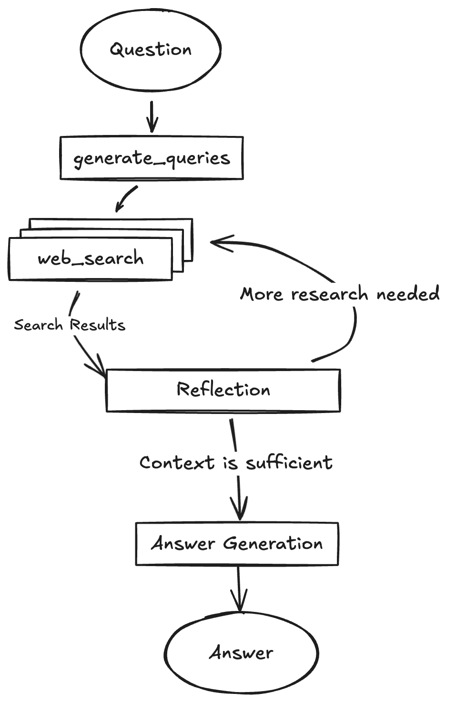

## 1. 什么是DeepResearch

下面开始讨论Deep Research 的定义、目的和预期影响

**什么是 Deep Research？**
来自OpenAI：
深度研究是一种专门的人工智能能力，旨在利用公共网络上的数据进行深入、多步骤的研究。它基于 OpenAI 的 o3 推理模型进行了微调，能够自主地从各种在线来源搜索和阅读信息。这使它能够就复杂主题生成详尽、有记录且引用清晰的报告。
深度研究非常适合在金融、科学和法律等领域从事高强度知识工作的人士，以及需要全面、精确和可靠研究的学者和精明的消费者。每一份输出都有完整的文档记录，并附有清晰的来源引用，便于验证和参考信息。深度研究尤其擅长在多个网站间进行多步骤操作，从而找到小众且非直观的信息。

来自Google：
规划：Deep Research 能够根据你的需求，将简单的提示转化为专属的多维度研究计划
搜索：Deep Research 能够自主完成网络搜索和深度资料挖掘，为你找到最相关、最新的信息
推理：Deep Research 会不断根据收集到的信息进行推理，思考后才进行下一步，并将整个思路呈现在你眼前
报告：Deep Research 可在几分钟内为你生成内容丰富、高度定制的研究报告，其中包含深入的细节和独到的见解，还能转换为音频概览，替你节省数小时的宝贵时间

Deep Research 是由 OpenAI 开发的一款人工智能智能体（AI Agent），旨在通过多步骤推理、动态信息检索与多模态数据整合，自动化完成复杂研究任务并生成专业级分析报告。其核心目标是为用户提供高效、精准的深度研究支持，适用于学术、商业、政策等领域的高强度知识工作。

Deep Research 的主要目的是**节省用户的时间**，通过代表用户执行深入研究和分析。它旨在通过自动化复杂的、耗时长的网络研究来释放宝贵的时间。
Deep Research 是一种新兴的 AI 工作流程或能力，旨在超越传统的简单网络搜索，提供对复杂主题的深入、全面的研究和分析。它通过模拟人类研究员的工作方式，自主地进行多步骤研究，并生成详细的、带引用的报告。

具体而言，Deep Research 旨在完成需要对在线信息进行大量探索和分析的**复杂、多步研究任务**。它旨在提供**全面、有洞察力的研究报告**，达到研究分析师的水平。它可以帮助用户**快速了解任何主题** 或对复杂主题进行深入研究。

**Deep Research 核心功能**

1. **多步骤自主研究与动态优化**
   - 通过强化学习驱动的推理模型（如 o3、r1），自主规划研究路径、检索信息、分析数据，并根据过程动态调整策略。
   - 支持长时、多步研究任务（5~30 分钟），可自动切换数据源或扩展关键词，提升研究深度和广度。
   - 能处理复杂、多方面的问题，递归探索并合成有深度的解答。

2. **多模态数据处理与融合**
   - 能解析和整合文本、图像、表格、PDF等多种数据格式，包括用户上传的文件。
   - 提取结构化信息，并融合非结构化文本，实现多模态信息的统一分析。
   - 通过语义相关性评分排序检索结果，优先整合权威来源（如学术论文、行业报告）。

3. **强大的推理、分析与知识综合能力**
   - 具备深入思考、分析和自我批判能力，能评估信息质量、识别知识差距，并根据新信息调整研究计划。
   - 将研究发现综合成全面、有洞察力的多页报告，报告水平可达专业分析师标准。

4. **可追溯引用与过程透明**
   - 报告带有详细引用来源（如文献 DOI、网页 URL），可引用具体句子和段落，方便用户验证。
   - 支持过程透明化展示（如侧边栏显示研究步骤），提升研究可追溯性。

5. **多样化输出与可视化**
   - 支持文本、表格、可视化图表等多种输出格式，并能嵌入图片。
   - 一些实现还支持报告的音频概述/播客版本及导出/分享功能。

6. **智能体特性与长时间自主任务**
   - 作为智能体系统，能够长时间自主执行任务，是自动化复杂网络研究的核心能力。
   - 能自主搜索并深度浏览互联网上的海量信息，信息来源广泛，可达数百个网站。

这些核心功能使 Deep Research 能够自动化、系统化地完成复杂、耗时的研究任务，帮助用户高效深入理解任何主题，支持各类知识工作和决策过程。

### 局限性和挑战

综合来看，这些来源指出 Deep Research 作为一个新兴的 AI 工作流程和智能体能力，在带来巨大价值的同时，也面临着一些固有的挑战和局限性。主要可以归纳为以下几个方面：

| 局限性类别                   | 具体表现与挑战                                                                                                                                                                                                                                                                                                                                                 |
|------------------------------|--------------------------------------------------------------------------------------------------------------------------------------------------------------------------------------------------------------------------------------------------------------------------------------------------------------------------------------------------------------|
| 计算资源、成本与时间消耗      | - Deep Research 通常计算密集，需多次并发查询和长时间推理，API 使用量和成本较高。 - 任务耗时较长（如 5~30 分钟），并行处理需更多系统资源。 - 成本和时间消耗随任务复杂度、模型选择和反思循环次数增加。                                                                                                              |
| 信息质量与准确性（幻觉、偏差、权威性） | - 可能产生事实性幻觉或不正确推断，错误在多步推理中易被放大。 - 难以区分权威信息与传闻，模型和搜索索引可能带有偏见。 - 搜索结果质量受限于底层索引和排名算法，存在信息空白、近期偏差等问题。                                                                                                   |
| 技术与工作流程挑战           | - 需处理大量内容，长文档易超出上下文窗口，影响答案生成。 - 多步迭代规划难度大，需在全面性、资源和等待时间间权衡。 - 长时间推理任务需容错，单点失败不应导致整体失败。 - 某些实现难以处理现代网站（如需 JS/cookie），报告和引用可能有格式小错误，任务启动慢。                                     |
| 可用性与互动局限             | - 系统传达不确定性能力弱，缺乏置信度校准。 - 复杂任务需多次澄清用户需求，部分实现难以处理复杂或难获取的信息，需用户多次调整提示，系统难以有效应用这些调整。                                                                                                                    **总结**

总的来说，尽管 Deep Research 在自动化复杂研究任务、节省时间和提供深入报告方面展现出巨大潜力，但计算成本、处理复杂信息的能力（尤其是幻觉、偏差和区分信息来源权威性）、技术实现的鲁棒性（如错误处理、上下文管理和网站浏览能力）以及用户交互的精细度仍然是其面临的关键挑战和正在积极解决的局限性。

### 应用场景

- **学术研究**：自动生成文献综述，对比不同研究结论，标注争议点，支持市场和学术研究。
- **商业分析与竞争情报**：市场趋势预测、竞品分析、竞争对手产品/定价/营销分析，进行尽职调查，帮助企业提升用户留存率等关键指标。
- **政策与法律**：检索判例，生成抗辩策略草案，辅助律师和政策分析师快速微调和决策。
- **消费决策与产品研究**：为高价值商品（如汽车、家电）等提供个性化购买建议，进行产品比较、评估不同模型的特点、性能、价格和评论。
- **知识工作支持**：辅助金融分析师、科学家、工程师等知识工作者进行密集的知识分析和内容组织，如为演示文稿整理内容。
- **复杂问题解答**：回答需要多步推理和整合多个来源信息的复杂问题，寻找特定或非直观的信息，深入理解和比较关键概念、解释基本原理。

通过提供全面、有引用的内容，Deep Research 旨在帮助用户做出更明智的决策。

**Deep Research 的预期影响：**

引入 Deep Research 被视为**改变我们与信息互动方式的根本性转变**。它将**信息检索和分析的边界向前推进**，使以前只有人类研究人员和分析师才能进行的更高推理层级的知识工作成为可能。

Deep Research 代表着 AI 智能体领域的**下一步发展**。它通过使其能够在无人监督的情况下更长时间地执行自主任务，是**AGI（通用人工智能）路线图的核心**。最终的愿望是构建能够为自己发现和创造新知识的模型。Deep Research 的能力，特别是**综合知识的能力，被认为是创造新知识的先决条件**。

OpenAI 认为 Deep Research 能够帮助**企业简化流程，提高工人的生产力**，同时对**消费者**也非常重要。Together AI 认为提供一个可扩展的开源 Deep Research 工具包将有助于社区的进一步构建和实验。Perplexity 致力于让所有人都能使用 Deep Research 这样的强大研究工具。

未来，Deep Research 的能力有望进一步扩展，例如连接到更专业的**数据源**，包括订阅或内部资源。OpenAI 设想 Deep Research 与其他工具（如屏幕操作和文件编辑）相结合，从而能够异步执行更复杂的任务。开源社区也在努力复制和改进 Deep Research 的能力，例如通过构建 GUI 智能体，使其能够像人类一样与屏幕互动。

## 2. 开源Deep Research项目

有来自著名开源组织或项目的，Huggingface的，有来自LangChain的 Open Deep Research，有来自著名大学的，比如Stanford的STORM，还有来自GPT Research.
更多的开源Deep Research项目，请参考[awesome-deep-research-agent](https://github.com/ai-agents-2030/awesome-deep-research-agent)和[awesome-deep-research](https://github.com/DavidZWZ/Awesome-Deep-Research)
更多的论文可以参考：<https://arxiv.org/search/?query=deep+research+agents&searchtype=all&source=header&start=50> 和我的[NotebookLM](https://notebooklm.google.com/notebook/ce8efe5d-ed28-4895-8095-97181260cf10)

### Huggingface的Open DeepResearch

开源DeepResearch来自Huggingface的基于Huggingface的MAS开源框架smolagents （一个轻量级的智能代理框架），该项目旨在通过大规模的自动化研究探索，实现深度洞察。smolagents借鉴了微软的[Magentic-One](https://www.microsoft.com/en-us/research/articles/magentic-one-a-generalist-multi-agent-system-for-solving-complex-tasks/)的使用tool的实现。

- 官网：<https://huggingface.co/blog/open-deep-research>
- 代码：<https://github.com/huggingface/smolagents/tree/main/examples/open_deep_research>

#### Deep Research的算法原理

TBD

#### 参考

TBD

### 基于GPT Research的 DeepResearch实现

- 官网：<https://docs.gptr.dev/blog>
- 代码：<https://github.com/assafelovic/gpt-researcher>

#### GPT Research的Deep Research实现原理

GPT Research的Deep Research 实现“深度”的主要技术原理

| 技术原理/亮点                                   | 说明                                                                                      | 效果/创新点                                                                                 |
|--------------------------------------------------|-------------------------------------------------------------------------------------------|---------------------------------------------------------------------------------------------|
| 树形递归探索 + 并发异步处理                      | 以树形结构递归展开，每层生成多个子查询，并利用`async/await`等方式并行推进各分支。           | 既能广泛覆盖主题不同面，又能高效深入每条线索，实现“深度”与“效率”兼得。                     |
| 智能上下文聚合与语义归纳                         | 自动聚合各分支成果，通过向量数据库、语义归纳等方式消除冗余，AI自动归纳多分支结果。          | 避免信息孤岛，提升结论质量，类似人类团队“头脑风暴+信息梳理”。                              |
| 实时进度追踪与弹性容错                           | 通过回调实时监控进展，失败查询自动跳过，流程不中断。某些分支失败不会影响整体。              | 系统健壮、可观测，便于调优和定位，提升大规模自动化研究鲁棒性。                              |
| 多参数可调研究策略                               | 灵活设置广度、深度、并发度等参数，支持根据任务复杂度和资源状况动态权衡。                    | 实现定制化深度，满足不同研究需求。                                                          |
| Agent协作与自适应分工                            | 不同特长AI Agent分工协作，动态分配任务。                                                   | 实现“专家小组”式协作研究，提升研究智能化水平。                                              |
| 知识图谱与因果链路自动构建                        | 自动生成知识图谱和因果链，辅助理解多层关系。                                                | 直观理解复杂主题间关系。                                                                    |
| 与真实世界数据流无缝对接                         | 实时抓取API、数据库、IoT等多源动态数据。                                                    | 实现“活数据”驱动的深度研究。                                                               |
| 自我优化与元学习机制                             | 系统根据历史表现自动调整策略，自我发现值得深挖方向。                                        | 持续优化研究效果。                                                                          |
| 多模态深度研究                                   | 支持文本、图片、音频、视频等多模态信息深度分析。                                            | 实现全方位“深度洞察”。                                                                     |

#### 技术亮点与创新

- **递归+并发**：  
  递归树状结构与并发异步执行的结合，是实现“深度”与“效率”兼得的关键。
- **语义归纳与聚合**：  
  类似人类研究团队的“头脑风暴+信息梳理”，AI系统自动归纳多分支结果，提升结论质量。
- **弹性容错**：  
  某些分支失败不会影响整体，提升了大规模自动化研究的鲁棒性。

---

#### 我的思考

1. **引入Agent协作与自适应分工**  
   - 让每个分支由不同特长的AI Agent负责（如检索型、推理型、批判型），并能动态分配任务，实现“专家小组”式协作研究。

2. **知识图谱与因果链路自动构建**  
   - 在深度探索过程中，自动生成知识图谱和因果推理链，帮助用户直观理解复杂主题间的多层关系。

3. **与真实世界数据流无缝对接**  
   - 支持实时抓取外部API、数据库、IoT等多源动态数据，实现“活数据”驱动的深度研究。

4. **自我优化与元学习机制**  
   - 让系统根据历史研究表现自动调整深度、广度、分支策略，甚至自我发现哪些方向最值得深挖。

5. **多模态深度研究**  
   - 不限于文本，还能深度分析图片、音频、视频等多模态信息，真正实现全方位“深度洞察”。

#### 如何实现研究的"Deep"？

参考 <https://deepwiki.com/search/gptresearcherdeepresearchdeep_2bb033b2-7cc3-42c7-9729-842adf97288a>

gpt-researcher通过以下几个核心机制实现DeepResearch中的"Deep"（深度洞见发现）：

##### 1. 递归树状探索结构

DeepResearch采用树状递归探索模式，通过`breadth`（广度）和`depth`（深度）参数控制研究的覆盖范围和深入程度。 [1](#0-0) 当研究深度大于1时，系统会自动为每个研究分支创建更深层次的查询，通过递归调用实现多层次探索。 [2](#0-1)

##### 2. 多维度搜索策略

系统首先为原始查询生成多个不同角度的搜索查询，每个查询都有明确的研究目标。 [3](#0-2) 这些查询会并发处理，通过信号量机制控制并发数量以优化性能。 [4](#0-3)

##### 3. 智能洞察提取与分析

DeepResearch使用专门的分析方法从研究结果中提取关键学习点（learnings）和后续探索问题（followUpQuestions）。 [5](#0-4) 系统会解析研究结果，提取深刻洞见，并为每个洞见维护引用信息以确保可追溯性。

##### 4. 推理模型的高级分析

系统使用推理大模型（如o3-mini）进行深度分析，并设置高推理努力等级来获得更深入的洞见。 [6](#0-5) 和 [7](#0-6) 这确保了系统能够从复杂信息中提炼出有价值的深层认知。

##### 5. 研究计划生成与时间感知

系统会基于初始搜索结果和当前时间生成有针对性的研究问题，确保研究覆盖不同方面和时间段。 [8](#0-7) 这种方法帮助发现最新发展和历史趋势中的深刻洞见。

##### 6. 智能上下文管理

系统通过上下文词数限制和智能修剪机制确保研究质量，同时聚合所有研究分支的结果。 [9](#0-8) 和 [10](#0-9)

##### Notes

DeepResearch的"Deep"本质在于它的**递归探索能力**、**多角度分析**、**智能洞察提取**以及**推理模型的深度思考**。它不是简单的信息搜集，而是一个能够从多个维度、多个层次深入探索主题的智能研究系统。默认配置为广度3、深度2、并发4， [11](#0-10) 用户可以根据需要调整这些参数来控制研究的深度和广度。

### ByteDance的DeepResearch

- github: <https://github.com/bytedance/deer-flow>
- 官网：<htts://deerflow.tech/>

DeerFlow是一个由社区驱动的深度研究框架，结合语言模型和工具进行任务，如网络搜索、抓取和Python代码执行，旨在为开源社区做出贡献。该项目由字节跳动（Bytedance）维护，拥有模块化多代理系统架构，支持MCP无缝集成、人工协作和文本到语音转换等多项功能。它使用**LangGraph**进行工作流管理，提供丰富的配置选项和交互模式，以实现高效的深度研究流程，并能生成包括播客在内的多种内容。该项目以Python和Node.js开发，支持通过Docker进行部署，并提供详细的安装和配置指南。DeerFlow遵循MIT协议，自豪地基于开源社区的贡献构建。

**架构**
DeerFlow实现了一种模块化的多智能体系统架构，专为自动化研究和代码分析而设计。该系统基于LangGraph构建，支持灵活的基于状态的工作流程，各组件通过定义明确的消息传递系统进行通信。支持搜索引擎：Tavily DuckDuckGo，Brave Search，Arxiv
工作流程： <https://deerflow.tech/#multi-agent-architecture>

#### 如何实现研究的"Deep"？

参考：<https://deepwiki.com/search/deerflowdeepresearchdeep_66dd4eac-520b-4f81-9e74-b9efd9e71dc8>

deer-flow通过以下几个核心机制实现深度研究中的"深度"洞察发现：

##### 1. 严格的深度标准和评估机制

deer-flow在规划阶段设置了非常严格的信息充分性标准。系统明确定义了什么是"充分的上下文"，要求信息必须全面回答用户问题的所有方面，包含具体细节，来自可靠来源，没有重大缺口或矛盾，并且数据量足够支撑综合报告。 [1](#0-0)

更重要的是，系统采用了"宁可过度收集也不不足"的原则：即使90%确定信息充分，也会选择收集更多信息。这确保了研究的深度和全面性。 [2](#0-1)

##### 2. 多维度分析框架

系统使用了8个关键维度来确保信息收集的全面性和深度：历史背景、当前状态、未来指标、利益相关者数据、定量数据、定性数据、比较数据和风险数据。 [3](#0-2)

每个维度都要求收集"全面"和"详细"的信息，而不是表面层次的数据。这种结构化的分析框架确保了洞察的深度和广度。

##### 3. 多智能体专业分工协作

deer-flow采用了多智能体架构，包括协调器、规划器、研究团队（研究员和编程员）和报告员。 [4](#0-3)

研究员专门负责深度信息收集，配备了网络搜索、爬虫等工具，并要求"忘记以前的知识"，完全依靠工具检索最新信息。 [5](#0-4)

编程员则负责数据处理和分析，使用Python进行复杂计算和统计分析。 [6](#0-5)

##### 4. 背景调查机制

在正式规划之前，系统会进行背景调查，通过搜索引擎收集用户查询的初步信息。 [7](#0-6)

这个机制为后续的深度规划提供了基础上下文，避免了盲目规划，确保研究方向的准确性。

##### 5. 迭代式深化研究

系统支持多轮规划迭代，当信息不充分时会自动进入下一轮研究。 [8](#0-7)

每个研究步骤完成后，系统会评估是否需要进一步深化，形成了一个持续深化的研究循环。 [9](#0-8)

##### 6. 工具链的深度集成

系统集成了多种专业工具，包括Tavily、Brave Search、DuckDuckGo等搜索引擎，以及网页爬虫和Python执行环境。 [10](#0-9)

还支持通过MCP（模型上下文协议）动态加载更多专业工具，扩展系统的深度分析能力。 [11](#0-10)

##### 7. 信息质量和数量标准

系统明确要求信息必须具备"综合覆盖"、"充分深度"和"足够数量"三个标准。表面层次的信息被明确定义为不可接受，系统要求收集丰富的相关信息，因为"高质量信息越多越好"。 [12](#0-11)

#### Notes

deer-flow的"深度"实现不是单一机制，而是通过严格的标准设定、多智能体协作、迭代式规划、工具链集成等多重机制的有机结合。系统的核心哲学是"宁可过度收集也不信息不足"，通过结构化的分析框架和专业分工，确保能够发现深刻的洞见而不是停留在表面信息。这种设计使得deer-flow能够产生真正有价值的深度研究报告。

### 天工的DeepResearchAgent

- 官网：<https://tiangong.ai/>
- 外网链接：<https://skywork.ai/>  #我使用这个，送token
- 代码：<https://github.com/SkyworkAI/DeepResearchAgent>

#### 如何实现研究的"Deep"？

参考 <https://deepwiki.com/search/deepresearchagentdeepresearchd_4ef378dd-c116-4feb-9454-b7922f6f2a44>
DeepResearchAgent通过多层次的分析和研究机制来实现"Deep"（深度）洞见发现，主要体现在以下几个方面：

##### 分层架构实现深度分析

DeepResearchAgent采用两层架构来实现深度研究：顶层规划代理协调多个专业化的底层代理，每个代理都专注于特定类型的深度分析。

##### 专业化代理的深度能力

###### Deep Analyzer Agent

专门进行深度分析，能够提取关键洞见和潜在需求，支持多种数据类型的分析 [2](#0-1) 。其提示配置要求进行详细推理和分析 [3](#0-2) 。

###### Deep Researcher Agent  

进行彻底的主题研究，检索和综合高质量信息，能够自动生成研究报告或知识摘要 [4](#0-3) 。其核心工具`deep_researcher`专门用于网络搜索和答案发现 [5](#0-4) 。

##### 洞见提取机制

系统通过`_analyze_content`方法从内容中提取基于查询相关性的洞见。该方法使用专门的提示模板来分析内容，并通过结构化的JSON响应处理来提取洞见 [6](#0-5) 。

##### ReAct框架的深度思考

所有代理都基于ReAct（推理和行动）框架，通过Action/Observation循环进行多步骤深度思考。系统提示要求代理"逐步思考解决任务" [7](#0-6) 。

##### 多维度信息整合

通过分层代理协作，系统能够从多个角度和维度收集信息：

- 网络搜索和实时信息获取
- 文档分析和结构化数据处理  
- 浏览器自动化进行深度网页交互
- 计算和统计分析

##### Notes

"Deep"的实现主要通过专业化分工、多步骤推理、结构化洞见提取和分层协作来达成。系统的深度不仅体现在单个代理的专业能力上，更体现在整个多代理系统的协同工作中，能够从不同角度深入分析问题并发现深刻洞见。

Wiki pages you might want to explore:

- [System Architecture (SkyworkAI/DeepResearchAgent)](/wiki/SkyworkAI/DeepResearchAgent#3)
- [Prompt System (SkyworkAI/DeepResearchAgent)](/wiki/SkyworkAI/DeepResearchAgent#4.6)

### dzhng的DeepResearch

- github: <https://github.com/dzhng/deep-research>
- blog: <https://github.com/dzhng/deep-research>

"deep-research"是一个由dzhng创建的AI驱动的研究助理项目，旨在对任何主题进行迭代的深入研究。该项目结合了搜索引擎、网络爬虫和大型语言模型，其核心目标是提供简化的深度研究代理实现，代码行数控制在500行以内以便于理解和扩展。

主要功能包括生成智能查询、广度和深度控制、并发处理、以及生成包含详细信息和来源的综合报告。用户需配置Node.js环境及相关API密钥（如Firecrawl和OpenAI）进行设置。项目支持Docker运行，并在MIT许可下开放。项目定位于通过递归探索提升研究质量，并最终生成markdown格式的研究报告。

#### 技术实现细节

- 迭代研究：通过迭代生成搜索查询、处理结果并根据发现进一步深入，进行深度研究
- 智能查询生成：利用大语言模型（LLMs），根据研究目标和先前的发现生成有针对性的搜索查询
- 深度与广度控制：可配置参数，用于控制研究的广度（宽度）和深度
- 智能跟进：生成跟进问题，以更好地理解研究需求
- 综合报告：生成包含研究结果和来源的详细Markdown报告

#### 如何实现研究的"Deep"？

参考：<https://deepwiki.com/search/deepresearchdeep_625085b6-6135-431e-a384-1f562f2ce46a>

DeepResearch中的"Deep"功能通过以下几个核心机制实现深刻洞见的发现：

##### 1. 递归搜索机制

DeepResearch的核心是一个递归调用机制，通过控制深度参数来实现层层深入的研究。 [1](#0-0)

当深度大于0时，系统会基于当前的研究目标和新发现的后续问题构建新的查询，然后递归调用deepResearch函数进行更深层次的研究。

##### 2. 动态查询生成

系统能够基于已有的学习成果生成更有针对性的搜索查询。 [2](#0-1)

这个机制使得每次搜索都能建立在前面发现的基础上，避免重复性搜索，而是朝着更深入、更具体的方向发展。

##### 3. 智能学习提取

系统从搜索结果中提取关键学习点和后续研究方向。 [3](#0-2)

这个处理过程不仅提取信息密集的学习点，还生成后续研究问题，为下一轮深入研究提供方向。

##### 4. 专家级系统提示

系统使用专门设计的提示来引导AI进行深度分析。 [4](#0-3)

这个系统提示要求AI作为专家研究员，提供详细分析、考虑新技术和反传统观念，并进行高层次的推测和预测。

##### 5. 模型选择和优化

系统优先使用高级推理模型如DeepSeek R1和OpenAI o3-mini来支持深度分析。 [5](#0-4)

##### 6. 迭代参数控制

系统通过调整广度和深度参数来控制每轮搜索的范围和深度。 [6](#0-5)

每次深入时，广度会减半，深度减一，这样既保证了深度探索，又避免了指数级的搜索爆炸。

##### Notes

DeepResearch的"Deep"功能本质上是一个**迭代深化的知识发现过程**。它不是简单的关键词搜索，而是通过AI驱动的智能查询生成、结果分析和方向规划来实现层层递进的深入研究。每一轮搜索都建立在前面发现的基础上，形成了一个螺旋式上升的知识发现模式。

这种设计使得系统能够从表面信息逐步深入到核心洞见，发现那些通过单次搜索难以获得的深层次联系和见解。整个过程类似于专业研究员的工作方式：先获得基础信息，然后基于初步发现提出更深入的问题，再进行针对性的深入研究。

### LangGraph Open Deep Research

- github: <https://github.com/langchain-ai/open_deep_research>
- blog: <https://www.langchain.com/blog/open-deep-research>

#### 如何实现研究的"Deep"？

参考：<https://deepwiki.com/search/deepresearchdeep_6805e5e8-0065-45b4-9102-993c51e5cb49>

### LangGraph Local Deep Research

- github: <https://github.com/langchain-ai/local-deep-researcher>
- youtube: <https://www.youtube.com/watch?v=sGUjmyfof4Q>

#### 如何实现研究的"Deep"？

### STORM: Stanford Open Virtual Assistant for Research (SOVAR)

- github: <https://github.com/stanford-oval/storm>

### u14app的DeepResearch

- 使用任何LLM（大型语言模型）进行深入研究。支持SSE API和MCP服务器。Hobby: 这个效果貌似不错，和天工的类似。
- Demo: <https://research.u14.app/>
- github: <https://github.com/u14app/deep-research>
- Deepwiki: <https://deepwiki.com/u14app/deep-research>
- 角色Prompt: <https://github.com/u14app/deep-research/blob/main/src/constants/prompts.ts>
-

**功能**：

- 极速深度调研: 约2分钟内生成全面的研究报告，大幅加速你的调研流程。
- 多平台支持: 支持快速部署至 Vercel、Cloudflare 等多个平台。
- AI驱动: 利用先进的AI模型，提供准确且有洞见的分析。
- 注重隐私: 你的数据始终本地存储于浏览器，确保隐私与安全。
- 多大模型兼容: 支持多种主流大语言模型，包括 Gemini、OpenAI、Anthropic、Deepseek、Grok、Mistral、Azure OpenAI、所有兼容 OpenAI 的 LLM、OpenRouter、Ollama 等。
- 支持网页搜索: 支持 Searxng、Tavily、Firecrawl、Exa、Bocha 等搜索引擎，让不自带搜索能力的 LLM 也能便捷使用网页搜索功能。
- 思维与任务模型: 采用先进的“思维”和“任务”模型，兼顾深度与速度，确保高质量、快速输出。支持切换不同调研模型。
- 支持进一步调研: 在项目任意阶段均可细化或调整调研内容，并支持从该阶段重新调研。
- 本地知识库: 支持上传和处理文本、Office、PDF 等资源文件，生成本地知识库。
- 成果编辑: 支持对调研内容进行编辑，提供 WYSIWYM 和 Markdown 两种编辑模式，可调整阅读难度、文章长度及全文翻译。
- 知识图谱: 支持一键生成知识图谱，系统化理解报告内容。
- 调研历史: 支持保存调研历史，随时回顾以往成果，并可进行二次深度研究。
- 本地与服务器API: 支持本地和服务器API调用方式，灵活满足不同需求。
- 支持SaaS与MCP: 可通过 SSE API 作为深度调研服务（SaaS）使用，也可通过 MCP 服务集成至其他AI服务。
- 支持PWA: 采用渐进式Web应用（PWA）技术，可像软件一样使用本项目。
- 多密钥并发: 支持多密钥并发调用，提升API响应效率。
- 多语言支持: 支持英语、简体中文、西班牙语等多语言。
- 现代技术栈: 基于 Next.js 15 和 Shadcn UI 开发，带来现代、高性能和美观的用户体验。
- MIT开源协议: 开源且免费，可自由用于个人和商业用途，遵循 MIT 许可证。

#### 如何实现研究的"Deep"？

参考：<https://deepwiki.com/search/deepresearchdeep_03884d01-480f-4cf5-ae52-36de564b696d>

DeepResearch实现"Deep"（深刻洞见）的核心机制包括以下几个关键方面：

##### 多阶段深度研究流程

DeepResearch通过一个精心设计的多阶段工作流实现深度研究。首先将用户的初始查询转化为具体的研究问题 [1](#0-0) ，然后生成结构化的搜索查询 [2](#0-1) ，最后将所有研究成果综合成完整报告 [3](#0-2) 。

##### AI模型角色专门化

系统采用双模型架构来实现深度分析：

- **Thinking Models**：负责复杂推理任务，如问题生成、结果分析和报告写作
- **Networking Models**：专门处理信息检索和搜索结果处理

这种分工确保了分析深度与执行效率的平衡 [4](#0-3) 。

##### 迭代式研究深化

系统具备自动评估研究完整性的能力。当完成初始搜索后，AI会分析现有发现并判断是否需要进一步研究。如果需要，会自动生成新的搜索查询，实现研究的迭代深化 [5](#0-4) 。

##### 精心设计的提示工程

系统通过专门的提示词来指导AI模型进行深度分析：

- **系统提示词**定义了专业研究者的角色，强调准确性、详细性和前瞻性思维 [6](#0-5)
- **搜索结果处理提示词**指导AI从搜索结果中提取深度洞见，包括具体的实体、指标、数字和日期等详细信息 [7](#0-6)
- **最终报告生成提示词**确保输出全面详细的研究报告，包含所有研究发现 [8](#0-7)

##### 并行搜索与综合分析

系统支持并行执行多个搜索任务，显著提高研究效率 [9](#0-8) 。每个搜索任务都有明确的研究目标，AI会根据这些目标从搜索结果中提取相关洞见。

##### 多维度信息整合

系统整合多种搜索引擎的结果，并支持AI模型的内置搜索功能，确保信息来源的多样性和全面性。所有搜索结果都会被AI模型处理，提取出与研究目标相关的深度学习成果 [10](#0-9) 。

##### 结构化输出与质量保证

系统使用结构化的JSON架构来确保搜索查询的质量和一致性 [11](#0-10) ，并通过输出指导原则确保最终报告的格式化和可读性 [12](#0-11) 。

##### Notes

DeepResearch的"Deep"不仅体现在技术架构上，更体现在整个研究方法论上。它模拟了人类研究者的思维过程：从提出问题开始，逐步深入探索，不断迭代和完善研究方向，最终形成全面深入的洞见。通过AI的加速处理能力，原本需要数小时或数天的深度研究工作可以在几分钟内完成，同时保持了研究的深度和质量。

### Jina AI的DeepResearch

来自Jina AI的DeepResearch项目：<https://github.com/jina-ai/node-DeepResearch> 与OpenAI/Gemini/Perplexity的“深度研究”不同，该项目只专注于通过迭代过程找到正确答案。其并不针对长篇文章进行优化，那是完全不同的问题 —— 因此，如果你需要从深度搜索中获得快速、简洁的答案，那你来对地方了。如果要找像 OpenAI/Gemini/Perplexity 那样由人工智能生成的长篇报告，这个项目不适合。
Demo: <https://search.jina.ai/>
<b>注意: </b>他们提供了两篇非常优秀的公众号文章，值得阅读：

- [DeepSearch 与 DeepResearch 的设计和实现](https://mp.weixin.qq.com/s/-pPhHDi2nz8hp5R3Lm_mww)
- [DeepSearch/DeepResearch中最优文本段选择和URL重排](https://mp.weixin.qq.com/s/apnorBj4TZs3-Mo23xUReQ)

下面的流程图是根据上面第一篇公众号文章中的描述信息而自动绘制的。

### Onyx Deep Research 实现原理

Onyx 的 Deep Research 是一个基于 LangGraph 的多步骤研究系统，通过智能编排和迭代执行来实现深度研究功能。

Onyx 定义了三种研究类型，其中 `DEEP` 是深度研究模式： [1](#0-0) 

**时间预算机制**

DEEP 模式拥有最高的时间预算（12.0 单位），是 THOUGHTFUL 模式的 4 倍，FAST 模式的 24 倍： [2](#0-1) 

每个工具调用都有相应的成本，系统会根据剩余预算决定是否继续研究： [3](#0-2) 

**澄清节点（Clarifier）**

这是流程的入口点，对于 DEEP 模式，会首先生成澄清问题： [4](#0-3) 

**编排器节点（Orchestrator）**

这是 Deep Research 的核心决策节点。对于 DEEP 模式，它的工作流程包括：

**a) 初始规划（第一次迭代）**

在第一次迭代时，生成一个高层次的研究计划： [5](#0-4) 

系统会将这个计划流式输出给用户： [6](#0-5) 

**b) 迭代决策**

在后续迭代中，根据计划、已有答案和剩余时间预算决定下一步： [7](#0-6) 

系统会生成推理结果并流式输出： [8](#0-7) 

**结束节点（Closer）**

当研究完成后，Closer 节点会根据研究类型选择不同的提示模板来综合最终答案： [9](#0-8) 

对于 DEEP 模式，使用包含子答案的提示模板，以便更全面地综合信息： [10](#0-9) 

**图结构**

整个流程通过 LangGraph 构建为一个状态图，包含所有节点和条件边： [11](#0-10) 

**可用工具**

Deep Research 可以调用多种工具来收集信息：

- **INTERNAL_SEARCH**：内部文档搜索
- **WEB_SEARCH**：网络搜索  
- **KNOWLEDGE_GRAPH**：知识图谱查询
- **IMAGE_GENERATION**：图像生成
- **GENERIC_TOOL**：自定义工具
- **CLOSER**：最终答案生成

每个工具都支持并行调用（最多 4 个并行查询）： [12](#0-11) 

## Notes

**Deep Research 的核心特点：**

1. **计划驱动**：在第一次迭代生成高层次计划，后续迭代基于计划执行
2. **澄清优先**：会主动生成澄清问题以确保理解用户需求
3. **充足预算**：12.0 的时间预算允许多次工具调用和深度探索
4. **推理透明**：每步推理都会流式输出给用户，提高透明度
5. **综合答案**：使用专门的提示模板，基于所有子答案生成全面的最终回答
6. **迭代优化**：Closer 节点可以评估信息完整性，必要时返回 Orchestrator 继续研究

与 THOUGHTFUL 和 FAST 模式相比，DEEP 模式更注重深度和广度，适合需要全面研究的复杂问题。

### 其他轻量级DeepResearch实现

khoj: <https://khoj.dev/>
github: <https://github.com/khoj-ai/khoj>
blog:<https://blog.khoj.dev/>

#### 效果看起来一般的DeepResearch实现

##### BTAHIR的Open-Deep-Research

github: <https://github.com/btahir/open-deep-research>

Open-Deep-Research是一个开源的强大研究助手，能从网络搜索结果生成基于AI的综合报告。该应用支持与多个AI平台（如Google、OpenAI、Anthropic、DeepSeek及本地模型）的无缝集成，为用户提供自定义AI模型选择和搜索配置的自由。其主要功能包括灵活的网络搜索、内容提取、多平台AI支持、报告生成与多种导出格式、知识库管理以及本地文件支持。此外，该应用还提供“流”特性，支持递归探索和报告整合。技术栈包括Next.js、TypeScript、Tailwind CSS等。通过配置文件，用户可以自定义搜索提供商和AI模型选项。该项目遵循MIT许可证，欢迎贡献和进一步协作。

### Google Gemini Fullstack LangGraph Quickstart

注意这个不是在Gemini页面上的那个Deep Research。
github: <https://github.com/google-gemini/gemini-fullstack-langgraph-quickstart>

该项目名为 **Gemini Fullstack LangGraph Quickstart**，展示了一个完整的全栈应用，前端使用 React 和 Vite，后端基于 LangGraph 和 Google's Gemini 模型，旨在构建支持增强型研究和对话式 AI 的应用。

#### 核心功能

- 💬 使用 React 前端和 LangGraph 后端的完整全栈应用。
- 🧠 支持高阶搜索与对话式 AI 的 LangGraph 智能代理。
- 🔍 利用 Google Gemini 模型动态生成搜索查询。
- 🌐 集成 Google 搜索 API 进行网络数据检索。
- 🤔 自动反思及知识差距分析，优化迭代查询。
- 📄 生成带引用来源的详细答案。
- 🔄 热更新开发环境支持前后端开发。

#### 核心流程

#### 项目结构

1. **frontend/**: 基于 Vite 构建的 React 应用。
2. **backend/**: 使用 LangGraph 和 FastAPI 的后端逻辑。

#### 快速启动步骤

1. 安装依赖：需安装 Node.js、npm (或 yarn/pnpm)、Python 3.8+，以及配置 Google Gemini API 密钥。
2. 启动开发环境：运行 `make dev` 启动前后端服务器，或者分别单独运行前后端开发服务器。
   - 前端地址：<http://localhost:5173/app>
   - 后端地址：<http://127.0.0.1:2024> (提供 LangGraph UI)

#### 后端智能代理逻辑

1. **生成初始查询**：基于用户输入生成搜索关键词。
2. **网络研究**：通过 Google 搜索 API 获取相关网络内容。
3. **反思分析**：利用 Gemini 模型评估知识完整性并定位知识差距。
4. **迭代优化**：根据反思结果生成改进后的查询。
5. **生成答案**：在信息充分后，整合结果并生成包含引用的答案。

#### 部署

- 支持 Docker 部署，需 Redis 和 Postgres 支持。
- 使用 `docker-compose up` 启动生产环境服务，访问地址为 <http://localhost:8123>

#### 核心技术

- **前端**: React (Vite)、Tailwind CSS、Shadcn UI。
- **后端**: LangGraph、FastAPI、Google Gemini 模型。

#### 开源协议

项目基于 Apache-2.0 许可证发布。
此项目非常适合作为**研究增强型对话式应用**开发的学习和参考案例，目前在 GitHub 上拥有 **5.9k 个 Star** 和 **714 个 Fork**(到2025-06-05)。

## 其他的Deep Research实现

### 叫DeepResearch名的非DR项目

### mshumer的OpenDeepResearcher

<https://github.com/mshumer/OpenDeepResearcher>

### AI scientist

人工智能面临的重大挑战之一是开发能够开展科学研究并发现新知识的智能体。虽然前沿模型已经被用于协助人类科学家，比如用于头脑风暴想法或编写代码，但它们仍然需要大量人工监督，或者在很大程度上局限于特定任务。
我们很高兴推出人工智能科学家，这是首个用于全自动科学发现的综合系统，使基础模型（如大语言模型（LLMs））能够独立进行研究。
我们在此处提供论文中的所有运行过程和数据，我们在每个模板上对每个基础模型运行约 50 个想法。我们强烈建议阅读一些克劳德（Claude）相关论文，以了解该系统的优缺点。

#### v1

[The AI Scientist-v1: Towards Fully Automated Open-Ended Scientific Discovery](https://github.com/SakanaAI/AI-Scientist)

#### v2

[The AI Scientist-v2: Workshop-Level Automated Scientific Discovery via Agentic Tree Search](https://github.com/SakanaAI/AI-Scientist-v2)

AI-Scientist-v2 是一个自动化科学发现的工具，通过代理性树搜索实现从研究假设生成到实验执行、结果分析和论文撰写的全流程支持。与前一版本相比，v2 不再依赖模板化设计，支持更广泛的机器学习领域探索，但对于明确目标的任务，v1 的成功率仍更高。

功能亮点：

1. 自动生成研究假设，进行实验并撰写文章。
2. 使用支持 CUDA 的 PyTorch GPU 环境运行，支持 OpenAI、Gemini 和 Claude 等 LLM 模型。
3. 包含实验树搜索配置（例如并行路径和节点优化）。
4. 生成的论文已通过同行评审并发表在研讨会上。

使用注意事项：

- 确保使用环境为受控的沙箱（如 Docker），以避免自动代码执行带来的安全问题。
- 使用者需提供像 OpenAI API Key 和 Semantic Scholar Key 等必要凭据。
- 系统依赖较大的模型，可能会有显著成本和计算需求。

适用场景：支持开放性科学研究，用于生成研究想法和探索学术可能性。

项目代码以 Apache-2.0 许可开源。

### zilliztech的deep-searcher

[Zilliz’s Deep Searcher](https://github.com/zilliztech/deep-searcher) 是一个开源的OpenAI的深度研究本地替代品，是一个具代理性RAG框架，重新定义了AI驱动的企业搜索。它结合了先进的推理模型、复杂的搜索功能以及集成的研究助手，使用Milvus高性能向量数据库进行本地数据整合，提供更快更相关的搜索结果，并支持模型切换以定制体验。DeepSearcher通过将查询拆分为多个子问题，进行多轮实时检索，具备主动问题解决、动态自我纠正和复杂推理任务的能力。此外，它全面记录搜索和推理过程，为调试和优化提供透明度，适合构建企业搜索解决方案或为数据密集型项目提供强大的研究助手，代表了开放源代码可定制AI代理的发展趋势。

### 上海交大GAIR-NLP的DeepResearcher

github: <https://github.com/GAIR-NLP/DeepResearcher>

DeepResearcher是一个通过在真实网络环境中扩展强化学习（RL）来训练基于大语言模型（LLM）的深度研究代理的综合框架。其主要特点包括计划制定、多源信息交叉验证、自省以调整研究方向，以及在无法找到明确答案时保持诚实的能力。  

框架的具体表现：  

1. 部署了DeepResearcher-7b模型（可在Huggingface获取）。  
2. 实验结果表明，相较于基于提示的基线模型和RAG基RL代理，性能分别提升了28.9分和7.2分。  

主要功能包括：  

- 支持真实网络搜索交互的端到端深度学习训练。  
- 使用Ray进行模型训练。  
- 提供训练、评估、生成回合展开等使用脚本。  

安装和运行：  

- 包括环境依赖配置、Ray服务端以及后端handler的运行指导。  

贡献和引用：  
该项目受到Deepseek-R1的启发，技术实现基于veRL和Search-r1。如项目相关内容对你有帮助，请引用此仓库。  

仓库信息：  

- Star：417  
- Fork：32  
- 开发语言：Python (97.3%)  

许可证：Apache-2.0  

完整代码和更多细节参见官方Github页面：<https://github.com/GAIR-NLP/DeepResearcher>  

### OpenAI Deep Research

### Gemini Deep Research

### Perplexity Deep Research

### CoherAI Deep Research

## 如何评估DeepResearch输出的质量？

## 相关技术

TBD

## 对自己开发DeepResearch的启发

### deep search vs. deep research

**DeepSearch** 是一个集成了多种网络工具（如搜索引擎、网页阅读器）的 LLM Agent，它通过分析当前获得的信息和历史操作记录，动态决策下一步是直接回答还是继续检索信息。这一过程本质上是一种状态机架构，由 LLM 控制状态的切换。
在每个决策点，有两种实现方式：一是通过精心设计的提示词让基础生成模型输出操作指令，二是用如 Deepseek-r1 这样的推理模型自动推导下一步行动。即便用推理模型，也需要定期中断生成，把工具的新输出注入上下文，再继续推理。
无论采用哪种方式，DeepSearch 的核心原则始终是：不断循环“搜索—阅读—推理”这三个步骤。
**DeepResearch** 是在 DeepSearch 的基础上，增加了一个结构化的框架，用于生成长篇的研究报告。它的工作流程一般从创建目录开始，然后系统性地将 DeepSearch 应用于报告的每一个所需部分：从引言到相关工作、再到方法论，直至最后的结论。报告的每个章节都是通过将特定的研究问题输入到 DeepSearch 中来生成的。最后将所有章节整合到一个提示词中，以提高报告整体叙述的连贯性。

### 如何评估DeepResearch？使用什么数据集来评估？评估标准

DeepResearch如何处理一些版权问题和网站需要登录信息才能访问，一些网站需要订阅才能阅读的问题。
DeepResearch和DeepThinking的关系。
DeepResearch和Notebook LM，Learn About的关系。
DeepResearch和早期的AutoGPT, AgentGPT等自动化Research是什么关系？
个人收集一些困难的问题来难倒O1或R1模型？社区上贡献的问题。

公众号：<https://mp.weixin.qq.com/s?__biz=Mzg2ODEwNjU0Nw==&mid=2247487014&idx=1&sn=7b4efaff7cce0f18045fbde5433b679a&chksm=cfffebdd182175c80612b299b71d8cac45d2b818e4b8f16b138ddfc84a08e206f1f07cffg工作公众号：>

## TBD

Deep Research 是一个新兴的 AI 工作流程和一种能力。它是一种先进的递归研究系统或智能体，旨在通过深入和广泛地探索主题来进行深入研究。它使用推理来搜索、分析和综合来自互联网的大量在线信息，甚至可以处理图像、表格和 PDF。不同于传统的查询-文档模型，Deep Research 能够接受复杂的多方面问题，并返回全面、合成的报告。它可以自动浏览多达数百个网站，思考其发现，并创建富有洞察力的多页报告。在 OpenAI 的实现中，它由经过微调的 O3 推理模型提供支持，该模型针对网页浏览和数据分析进行了优化。在 Together AI 的实现中，Open Deep Research 是一个 LLM 智能体工作流程，它整合了来自 TogetherAI 云平台的模型，并使用 Tavily 来检索网页信息。Perplexity 的 Deep Research 也会执行数十次搜索，阅读数百个来源，并通过材料进行推理。

Deep Research 的工作方式通常遵循一种递归的树状探索模式 或多步过程。它通常包括规划（将查询转化为研究计划）、搜索和深入浏览网页以查找信息、推理和迭代处理信息，以及将发现综合成全面报告。它能够在探索过程中根据新信息调整计划。这种系统具有智能体特性，可以自主执行多步搜索、评估信息质量、识别知识差距，并将发现综合成连贯的报告。

值得注意的是，Deep Research 可能会花费比标准研究更长的时间，例如 5 分钟甚至 30 分钟才能完成，这被认为是其执行自主任务能力的核心。

## 参考

### 论文

### 公众号文章

- [DeepSearch 与 DeepResearch 的设计和实现](https://mp.weixin.qq.com/s/-pPhHDi2nz8hp5R3Lm_mww)
- [DeepSearch/DeepResearch中最优文本段选择和URL重排](https://mp.weixin.qq.com/s/apnorBj4TZs3-Mo23xUReQ)
