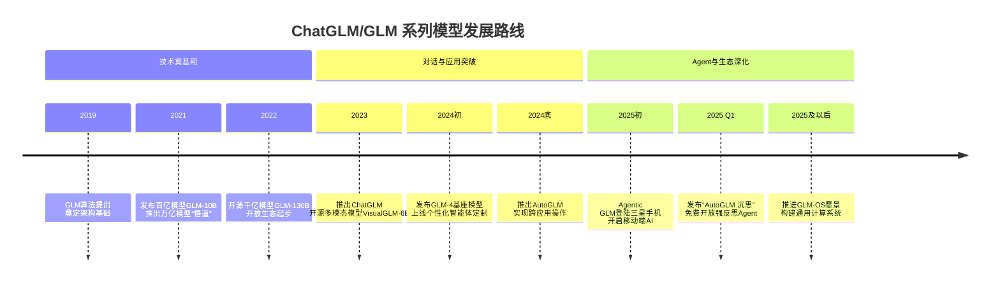

智谱AI（北京智谱华章科技有限公司）是一家源自清华大学知识工程实验室（KEG）的领先人工智能公司，专注于研发大规模预训练模型，致力于实现“让机器像人一样思考”的愿景。

## 创始团队

智谱AI的创始团队是一支**深耕人工智能领域多年的清华学霸队伍**，核心成员包括**张鹏、唐杰、刘德兵和王绍兰**。他们共同将清华大学实验室的前沿研究成果转化为具有市场竞争力的产品，带领智谱AI成长为国内大模型领域的重要企业。

下表为您清晰地列出了核心创始团队成员及其角色。

| 姓名   | 在智谱AI的角色                                  | 背景与贡献简介                                                                 |
| :----- | :----------------------------------------------- | :----------------------------------------------------------------------------- |
| 张鹏   | 首席执行官（CEO）                                | 清华大学计算机博士，负责公司整体战略、产品研发和商业化落地，是公司的对外代表。 |
| 唐杰   | 首席科学家、创始人，曾任清华大学计算机系教授、系副主任 | 清华大学教授背景，在数据挖掘和机器学习领域发表过多篇论文，是团队的技术领军人物。       |
| 刘德兵 | 董事长                                         | 清华校友，与张鹏、王绍兰共同作为合伙人创立了控股平台。                    |
| 王绍兰 | 总裁                                           | 清华校友，与张鹏、刘德兵共同创业。                                  |

### 🚀 从实验室到市场的征程

智谱AI的故事始于**清华大学计算机系的知识工程实验室（KEG实验室）**。创始团队在实验室期间，便长期专注于人工智能、数据挖掘和知识图谱等领域的研究。2019年6月，为了将多年的技术积累转化为能够创造实际价值的产品，他们共同创立了智谱AI。因此，公司从诞生之初就带有深厚的**技术基因和“产学研”紧密结合的特色**。

### 💡 创始团队的技术远见

在技术路线上，创始团队很早就确立了发展**通用大模型**的方向。他们并未满足于在单一垂直领域应用小模型，而是坚信一定规模的大模型是实现类人认知能力涌现的关键。这一理念驱动他们先后研发了GLM-10B、千亿开源的GLM-130B以及新一代基座大模型GLM-4等一系列产品，逐步构建起完整的大模型生态体系。

## 🔬 技术发展历程

智谱AI的核心竞争力在于其全链路自主可控的技术体系。下表概述了其关键发展节点：

| 时间节点 | 技术里程碑 | 意义 |
| :--- | :--- | :--- |
| **2021年** | 发布自研**GLM预训练框架**及百亿参数模型**GLM-10B** | 奠定了自主技术路线的基础 |
| **2022年** | 开源千亿双语模型**GLM-130B** | 成为亚洲唯一入选斯坦福评测的模型，对标GPT-3 |
| **2023年** | 发布对话模型**ChatGLM**并开源**ChatGLM-6B** | 极大降低了开发者的使用门槛，推动普及 |
| **2024年至今**| 推出**GLM-4**系列模型，并重点发展**智能体（Agent）** 能力（如AutoGLM） | 整体性能大幅提升，支持更长上下文，增强多模态和复杂任务规划能力 |

### 💼 主要产品与商业模式

智谱AI构建了完整的产品矩阵和商业模式，以推动技术落地：

- **核心产品矩阵**：包括**智谱清言**（面向普通用户的AI助手）、**CodeGeeX**（代码生成模型）、**CogVLM**（多模态理解模型）和**CogView**（文生图模型）等。
- **商业模式 - MaaS（模型即服务）**：通过其开放平台（bigmodel.cn），为企业和开发者提供API调用、云端私有化部署、完全私有化部署等多种服务模式。截至2024年，其平台已吸引超过70万企业和开发者用户。

### 🚀 最新动态与展望

智谱AI正处于快速发展阶段，近期有两个重要动向值得关注：

1. **启动上市进程**：2025年4月，智谱AI在北京证监局办理了IPO辅导备案，成为国内“AI六小龙”中首家启动上市的公司，这标志着其发展进入新阶段。
2. **深化产业生态**：公司积极与各地政府（如珠海市）和产业龙头合作，围绕AI算力建设、场景应用和生态孵化展开深度合作，助力区域经济发展和产业升级。

总而言之，智谱AI凭借其扎实的技术根基、清晰的产品战略和积极的商业化探索，已成为中国大模型领域的重要力量。

## 🔬 技术架构的演进

下面这张时间线图可以快速把握其关键演进节点：

ChatGLM系列模型的核心在于其**通用语言模型（GLM）架构**，它巧妙地融合了自回归生成和双向理解的优势，通过统一的预训练框架支持多样化的模型与应用，旨在实现高效的推理、代码生成与智能体任务协同。其核心架构思想、训练方法、模型矩阵与部署方式可概括如下：

### 🧠 核心架构思想

智谱AI自研的**GLM预训练框架**是其技术体系的基石。其核心创新在于**自回归空白填充技术**。简单来说，模型通过在文本中随机掩码部分连续片段（即制造“空白”），然后学习预测并填充这些被掩码的内容。这种方法巧妙地将语言理解（判断哪里需要填充）和生成（具体填充什么）统一在了一个框架内。与BERT、T5等传统架构相比，GLM能更好地处理掩码片段之间的依赖关系，并在自然语言理解和生成任务上表现出更高的参数效率。

### 🛠️ 训练优化方法

为了提升模型性能与效率，智谱AI在训练过程中采用了多项关键技术：

- **混合专家架构**：在GLM-4.5等大型模型中采用了MoE架构，通过“瘦高型”设计（增加网络层数，减少单个专家的参数），在保持庞大总参数量的同时，每次推理仅激活少量参数（如3550B总参数，仅激活32B），显著提升了计算效率。
- **注意力机制优化**：引入了**分组查询注意力** 和**部分旋转位置编码**，增强了模型处理长上下文的能力（最高支持128K上下文窗口）和多模态信息的融合能力。
- **多阶段训练策略**：训练过程分为预训练和多个专项后训练阶段。预训练使用海量通用文本和垂直领域数据打下基础；后续阶段则针对代码、推理、智能体调用等特定任务进行强化训练，避免能力稀释。同时，通过**强化学习来自执行反馈**（例如使用自研的Slime框架）进一步优化模型的工具调用和复杂任务规划能力。

### 📦 模型产品矩阵和生态布局

基于GLM架构，智谱AI构建了覆盖不同能力和应用场景的模型家族：

| 模型类型 | 代表产品 | 主要特点与应用 |
| :--- | :--- | :--- |
| **通用对话模型** | ChatGLM系列 (如ChatGLM-6B, ChatGLM3) | 面向智能问答、内容创作，开源版本极大促进了开发者生态繁荣。 |
| **新一代基座模型** | GLM-4系列 (包括GLM-4, GLM-4-Air，GLM-4.6等) | 整体性能大幅提升，支持长上下文，强化了多模态和智能体能力，是当前的主力模型。 |
| **代码模型** | CodeGeeX | 专精于代码生成、理解与调试，支持多种编程语言。 |
| **多模态模型** | CogVLM (视觉理解), CogView (文生图) | 实现图像与文本的深度融合理解，或根据文本描述生成图像。多模态模型VisualGLM-6B则开启了图像理解与对话结合的能力。|
| **推理与智能体模型** | GLM-Z1系列 (如具备“沉思”能力的Rumination模型) | 专为复杂数学推理、逻辑分析和需要多步规划的智能体任务设计。 |
| **Agent** | AutoGLM | 这是技术发展的重点方向。以2025年发布的**AutoGLM 沉思**为代表，它具备了“深度思考”和“动手执行”的能力，能够自主规划任务、调用工具（如浏览器、软件）并完成复杂流程，标志着从“对话式AI”向“自主式AI”的转变。 |

**智能体平台（AutoGLM）**：

### 🌐 部署与服务模式

在技术落地方面，智谱AI践行 **Model as a Service (MaaS)** 理念，通过多种方式提供服务：

- **开源共享**：将ChatGLM-6B、GLM-4-9B等众多模型开源，遵循友好协议（如MIT），吸引全球开发者使用和贡献，构建活跃生态。
- **API服务**：通过其开放平台提供灵活的API调用，按使用量计费，方便开发者快速集成AI能力。
- **私有化部署**：为企业提供从云端专区到完全本地化部署的解决方案，满足数据安全与定制化需求。

总而言之，智谱AI的技术架构是一个从底层预训练框架、训练优化技术，到上层多样化模型产品，并通过灵活的MaaS模式进行部署的完整体系。其核心优势在于通过统一的GLM架构高效地支撑了从理解、生成到推理和执行的各类AI任务。

### 🌐 商业化与开源战略

智谱AI采取了“开源与商业双轮驱动”的策略，快速构建开发者生态和商业落地。

- **开源战略**：智谱是国内最早开源千亿级大模型的公司之一，先后开源了GLM-130B、ChatGLM3-6B、GLM-4-9B等关键模型。2025年更是宣布其Agent相关技术全面开源，遵循友好的MIT协议，这极大地吸引了开发者并促进了技术的快速普及和迭代。

- **商业化路径**：商业化方面，智谱主要通过**MaaS（模型即服务）平台**向企业和开发者提供API服务；同时为特定行业提供**私有化部署**解决方案，例如在电力行业用于智能问答和文件审核。在消费端，通过“智谱清言”App直接向用户提供服务。其推出的**Coding Plan**等套餐，以极具竞争力的价格（如宣称其推理API价格仅为同类产品的1/30）抢占市场。

### 🧭 未来方向：通向AGI之路

根据智谱AI在ICLR 2024上的分享，其未来技术路线主要围绕三个核心方向展开：

1. **超级认知与超级对齐**：研发更强大的“超级认知”能力，并确保模型行为与人类价值观和安全需求高度一致的“超级对齐”技术。
2. **GLM-OS构想**：旨在构建一个以大模型为核心的通用计算操作系统，实现更高级别的自主规划、执行和反思循环。
3. **无意识学习机制**：探索类似人类睡眠中无意识学习的机制，使模型具备自我学习、自我反思和自我批评的能力，这被认为是通向AGI的必经之路。

## 参考文献

- [智谱chat官网](https://chat.z.ai/)
- [智谱AI官方飞书文档](https://zhipu-ai.feishu.cn/wiki/YInmwPmyii67VRkzU3BchPNzncg)
- [GLM4.5 Tech Report](https://arxiv.org/abs/2508.06471)
- [GLM4.5 技术博客](https://z.ai/blog/glm-4.5)
- [GLM4.5 GitHub](https://github.com/zai-org/GLM-4.5)
