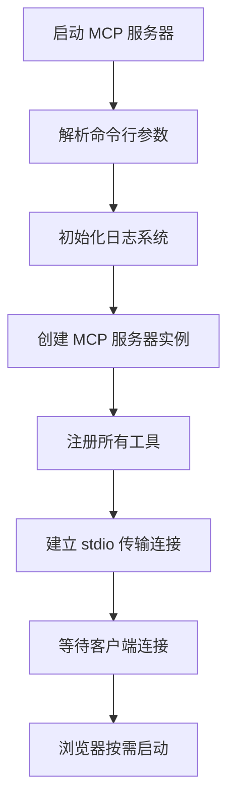
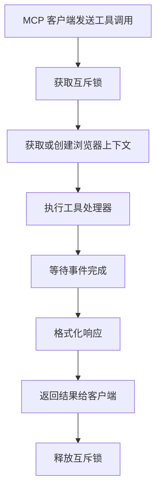
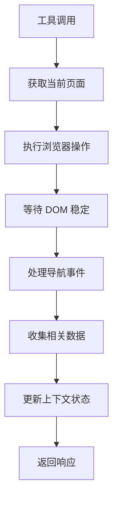
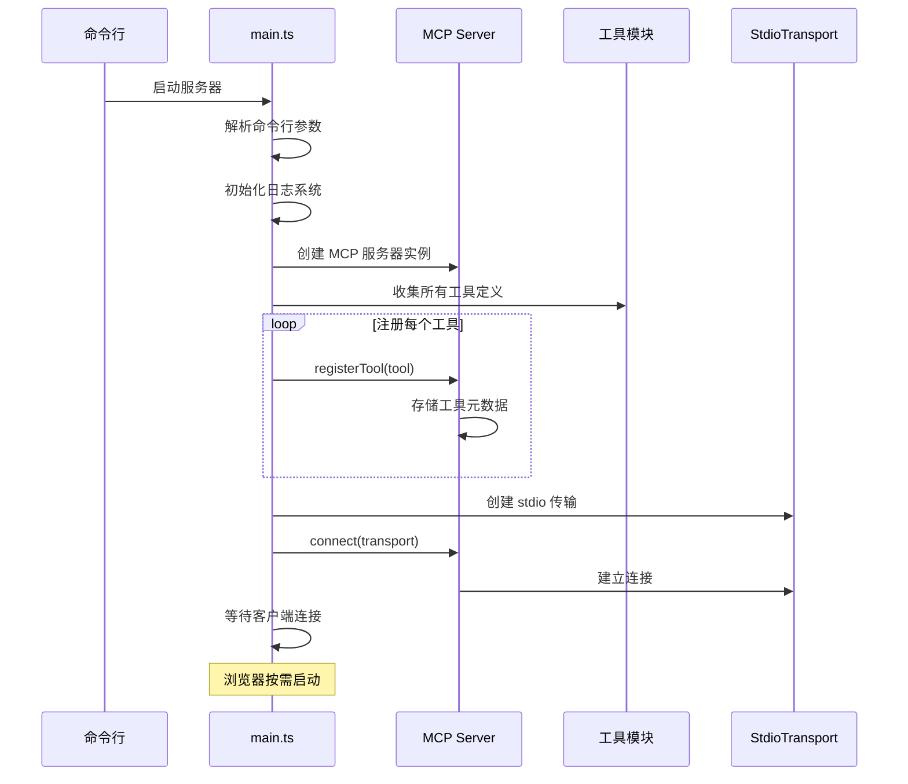
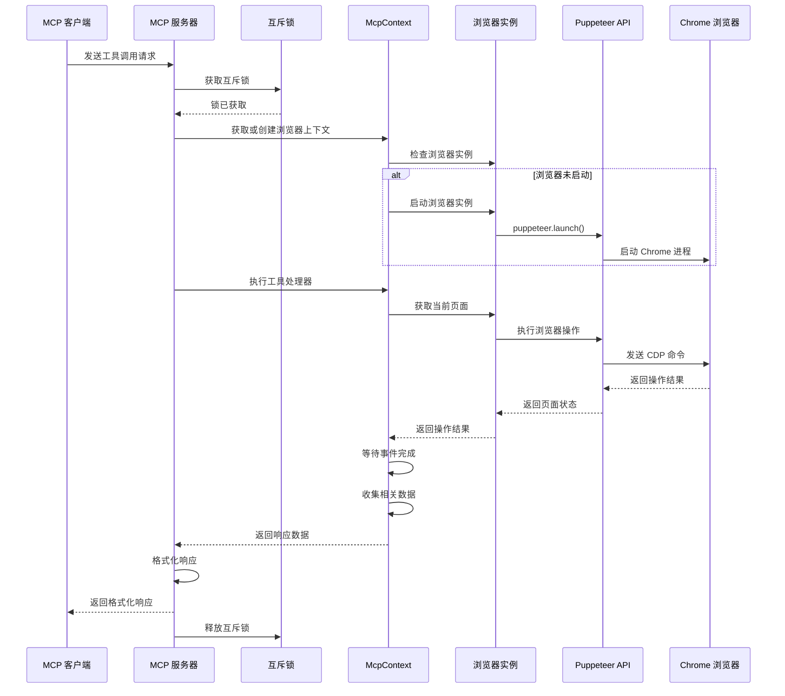
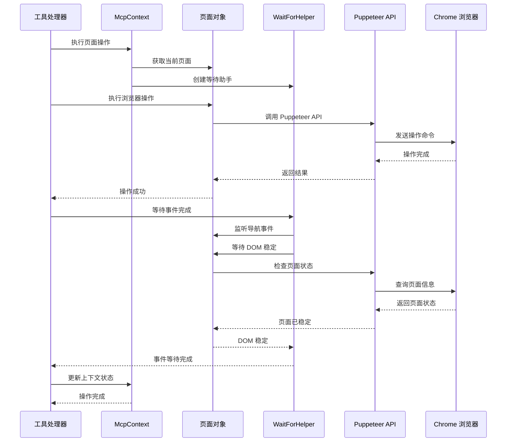
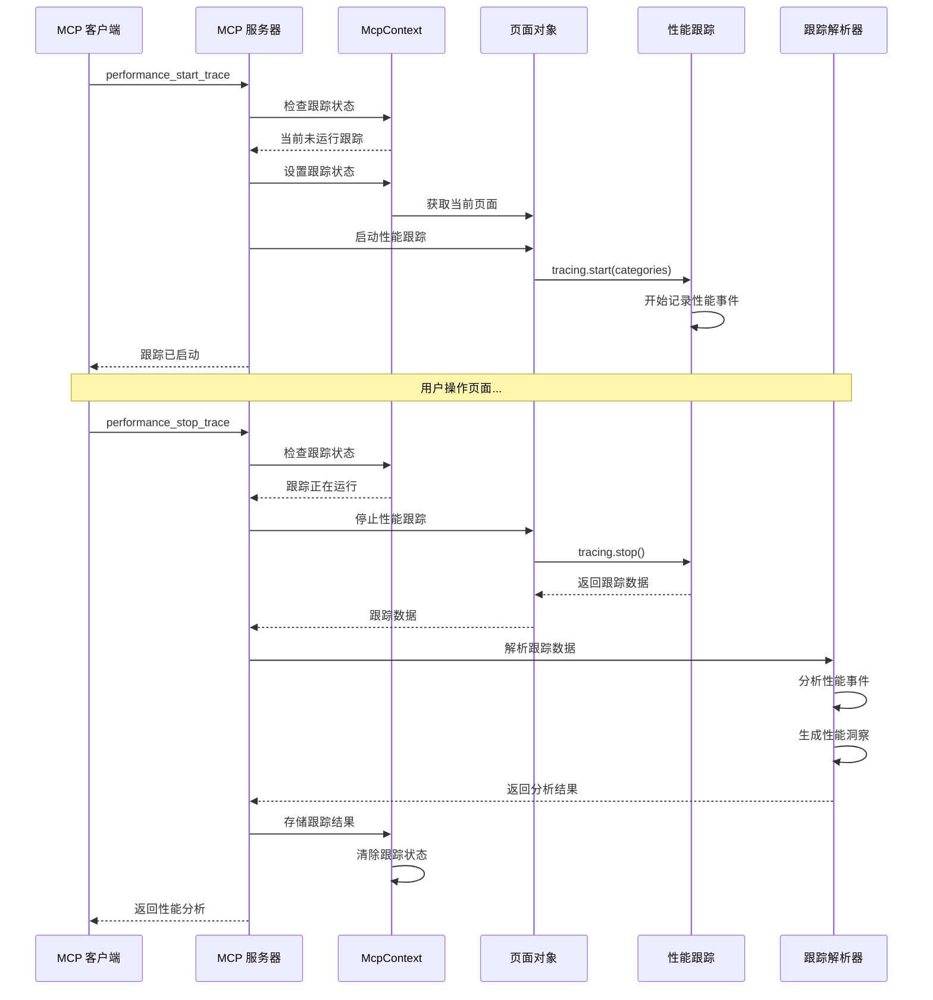
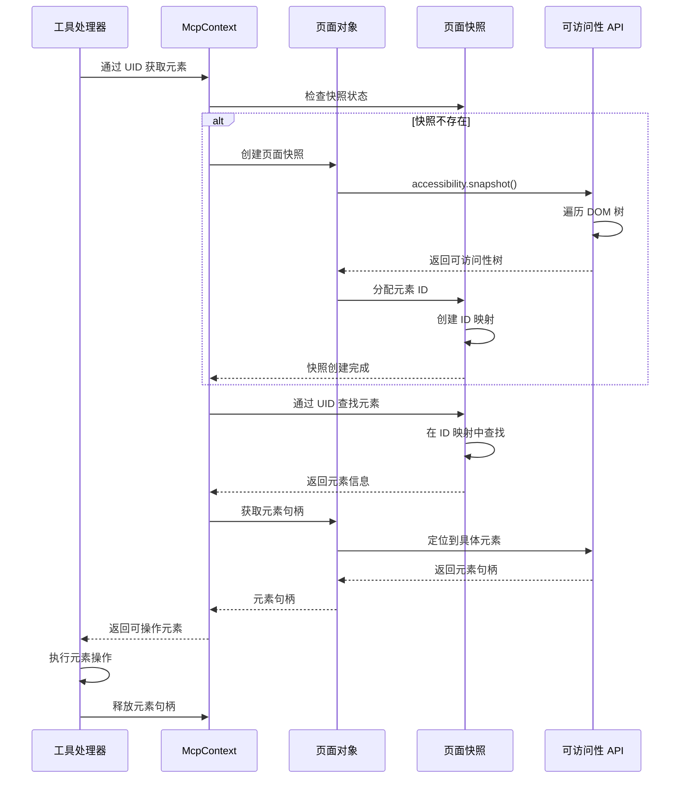

> 前端调试的新纪元，AI不再“蒙眼编程”

## 简介：打破AI编码的“盲区”

对于每一位与AI编码助手打交道的开发者来说，一个普遍的痛点是：AI能生成代码，却无法“看见”代码在浏览器中的实际运行效果，也无法进行调试。这无异于戴着眼罩编程——AI生成的代码可能看起来完美，但一旦出现渲染问题、网络错误或性能瓶颈，它就束手无策了。开发者不得不回到传统的手动调试流程，AI助手的价值也因此大打折扣。
然而，Chrome团队最近发布的一项名为Chrome DevTools MCP服务器的新工具，正致力于解决这个核心难题。它的核心承诺是：赋予AI代理直接使用Chrome开发者工具（DevTools）的能力，让它们能够直接调试网页。这听起来像是一个革命性的进步，意味着AI终于可以摘下眼罩，真正地“看到”并理解它所编写的代码的运行结果。
尽管这一前景无比激动人心，但早期尝鲜者的实际体验揭示了一些意想不到的重要教训。这篇文章将为你梳理出我们在探索这一前沿工具时，总结出的五个最关键、最令人意外的发现。

### 一、什么是Chrome DevTools MCP？

Chrome DevTools MCP是谷歌基于**模型上下文协议**（Model Context Protocol）开发的服务器，它将Chrome浏览器的开发者工具能力开放给AI编码助手。

简单来说，它让AI助手如Gemini、Claude、Cursor和Copilot等能够控制和检查真实的Chrome浏览器实例。

**传统AI编程的局限性**在于，它们无法观察所创建或修改页面的运行时行为。AI生成代码后，无法看到代码在浏览器中的实际运行效果，这就像“蒙着眼睛”写代码。Chrome DevTools MCP的出现，将静态建议引擎转变为能够在浏览器中运行测量并提出修复建议的**闭环调试器**。

### 二、核心功能与技术架构

#### 强大的功能集

Chrome DevTools MCP为AI代理带来了全面的浏览器级调试能力：

- **性能分析与追踪**：启动性能跟踪（如`performance_start_trace`），分析LCP（最大内容绘制）、CLS（累积布局偏移）等核心Web指标
- **网络监控与诊断**：查看网络请求、监控网络错误、分析资源加载情况
- **DOM/样式调试**：检查页面元素、样式和布局问题，实时连接页面获取CSS状态
- **用户行为模拟**：自动化页面导航、点击、填写表单等操作，复现用户流程
- **控制台错误分析**：读取浏览器控制台输出，捕获脚本异常

#### 分层架构设计

Chrome DevTools MCP采用优雅的分层架构设计：

1. **MCP协议层**：负责AI助手与服务器之间的标准化通信，使用JSON-RPC 2.0作为通信协议
2. **工具抽象层**：将功能抽象为26个独立工具，分为输入自动化、导航、性能、调试等6大类别
3. **浏览器控制层**：基于Puppeteer实现与Chrome DevTools协议的深度集成

这种架构确保了灵活性——上层代理无需了解复杂的CDP（Chrome DevTools Protocol）细节即可利用强大的调试数据。

### 三、实际应用场景

#### 性能优化自动化

传统性能优化需要手动操作多个步骤：打开DevTools、切换到Performance面板、开始录制、刷新页面、停止录制并分析结果。使用Chrome DevTools MCP，只需向AI助手提示：“帮我分析example.com的首页性能，找出加载缓慢的原因”。

AI助手会自动：

1. 启动浏览器并导航到目标页面
2. 开始性能追踪
3. 等待页面完全加载
4. 停止追踪并分析数据
5. 识别性能瓶颈（如大图片、阻塞脚本）
6. 提供具体的优化建议

#### 复杂表单测试

对于多步骤表单，可以描述测试场景：“帮我测试用户注册流程：填写用户名、邮箱、密码，同意条款，提交表单，然后验证是否跳转到欢迎页面”。

AI助手会通过Chrome DevTools MCP自动执行一系列操作，并生成详细的测试报告。

#### 网络故障诊断

当页面出现资源加载问题时，可以提示AI：“localhost:8080上有几张图片加载不出来，检查是什么问题”。AI助手会检查网络请求和控制台日志，快速定位CORS或404错误等常见问题。

### 四、安装与配置

配置Chrome DevTools MCP非常简单。在主流的MCP客户端（如VS Code/Copilot、Claude Desktop、Cursor）中，只需添加以下配置段：

```json
{
  "mcpServers": {
    "chrome-devtools": {
      "command": "npx",
      "args": ["chrome-devtools-mcp@latest"]
    }
  }
}
```

对于VS Code/Copilot，可以通过命令面板打开MCP配置，添加上述内容。配置完成后，即可在AI对话中使用诸如“检查web.dev的LCP指标”这样的提示。

### 五、意义与未来展望

Chrome DevTools MCP的推出标志着**前端开发自动化进入新阶段**。它填补了自动化脚本控制与深层调试之间的空白，使AI助手从“代码生成器”升级为“**全栈调试伙伴**”。

对于开发团队而言，这一技术带来直接价值：

- **自动化性能审计**：在CI流程中自动生成性能回归报告
- **精准问题定位**：结合追踪数据与堆快照，缩短问题发现到修复的周期
- **可解释的调试数据**：AI代理可获取底层数据，生成更可靠的修复建议

目前该工具处于公开预览阶段，需要Node.js 22+和当前版本的Chrome。随着技术的发展，我们可以期待更丰富的工具生态，包括移动端支持、多浏览器集成等增强功能。

**综上所述**

Chrome DevTools MCP让AI编程助手真正走出“盲区”，完成了从代码生成到浏览器验证的闭环。无论是排查CORS错误、调试布局问题，还是进行性能优化，它都将成为现代Web开发团队不可或缺的生产力工具。

尝试配置Chrome DevTools MCP，体验AI助手直接调试浏览器的强大能力，告别“蒙眼编程”的时代已经到来。

---

## Chrome DevTools MCP 实现原理与架构文档

### 概述

Chrome DevTools MCP (Model Context Protocol) 是一个基于 MCP 协议的服务器，它允许 AI 编程助手通过 Chrome DevTools 来控制、检查和调试实时 Chrome 浏览器。该项目将 Chrome DevTools 的强大功能暴露给 MCP 客户端，实现可靠的自动化、深度调试和性能分析。

### 核心架构

#### 1. 整体架构图

```
┌─────────────────┐    ┌─────────────────┐    ┌─────────────────┐
│   MCP Client    │◄──►│  MCP Server     │◄──►│  Chrome Browser │
│  (AI Assistant) │    │ (chrome-devtools│    │   (Puppeteer)   │
│                 │    │     -mcp)       │    │                 │
└─────────────────┘    └─────────────────┘    └─────────────────┘
                              │
                              ▼
                       ┌─────────────────┐
                       │  DevTools API  │
                       │   (CDP)        │
                       └─────────────────┘
```

#### 2. 核心组件

##### 2.1 主服务器 (main.ts)

- **职责**: MCP 服务器的入口点，负责初始化和配置
- **关键功能**:
  - 解析命令行参数
  - 初始化 MCP 服务器
  - 注册所有工具（将服务器提供的功能暴露给MCP客户端（如 AI 助手）的过程）
  - 管理浏览器连接
  - 处理工具调用

##### 2.2 浏览器管理 (browser.ts)

- **职责**: 管理 Chrome 浏览器实例的生命周期
- **关键功能**:
  - 启动或连接到现有浏览器实例
  - 配置浏览器参数（无头模式、用户数据目录等）
  - 处理不同 Chrome 渠道（stable, canary, beta, dev）
  - 管理浏览器连接状态

##### 2.3 上下文管理 (McpContext.ts)

- **职责**: 维护浏览器状态和页面信息
- **关键功能**:
  - 管理多个页面实例
  - 维护当前选中的页面
  - 收集网络请求和控制台消息
  - 管理性能跟踪状态
  - 处理页面快照和元素定位

##### 2.4 响应处理 (McpResponse.ts)

- **职责**: 格式化工具调用的响应数据
- **关键功能**:
  - 格式化文本响应
  - 处理图片附件
  - 包含页面信息、网络请求、控制台数据
  - 生成结构化的 MCP 响应

### 主要工作流程

#### 1. 服务器启动流程



#### 2. 工具调用流程



#### 3. 浏览器交互流程



#### 4. 详细交互序列图

##### 4.1 服务器启动序列图



##### 4.2 工具调用序列图



##### 4.3 页面操作序列图



##### 4.4 性能跟踪序列图



##### 4.5 元素定位序列图



### 核心设计模式

#### 1. 工具定义模式

每个工具都遵循统一的定义模式：

```typescript
export const toolName = defineTool({
  name: 'tool_name',
  description: '工具描述',
  annotations: {
    category: ToolCategories.CATEGORY,
    readOnlyHint: boolean,
  },
  schema: {
    // Zod 模式定义
  },
  handler: async (request, response, context) => {
    // 工具逻辑
  },
});
```

#### 2. 响应构建模式

使用建造者模式构建响应：

```typescript
response.appendResponseLine("文本内容");
response.setIncludePages(true);
response.setIncludeSnapshot(true);
response.attachImage(imageData);
```

#### 3. 上下文管理模式

通过 McpContext 集中管理浏览器状态：

```typescript
// 页面管理
const page = context.getSelectedPage();
await context.newPage();
context.setSelectedPageIdx(index);

// 元素定位
const element = await context.getElementByUid(uid);

// 事件等待
await context.waitForEventsAfterAction(action);
```

### 工具分类与功能

#### 1. 输入自动化 (Input Automation)

- **click**: 点击页面元素
- **drag**: 拖拽操作
- **fill**: 填写表单
- **fill_form**: 批量填写表单
- **handle_dialog**: 处理浏览器对话框
- **hover**: 悬停操作
- **upload_file**: 文件上传

#### 2. 导航自动化 (Navigation Automation)

- **list_pages**: 列出所有页面
- **select_page**: 选择当前页面
- **navigate_page**: 页面导航
- **new_page**: 创建新页面
- **close_page**: 关闭页面
- **navigate_page_history**: 历史导航
- **wait_for**: 等待特定条件

#### 3. 模拟 (Emulation)

- **emulate_cpu**: CPU 节流模拟
- **emulate_network**: 网络条件模拟
- **resize_page**: 调整页面尺寸

#### 4. 性能分析 (Performance)

- **performance_start_trace**: 开始性能跟踪
- **performance_stop_trace**: 停止性能跟踪
- **performance_analyze_insight**: 分析性能洞察

#### 5. 网络调试 (Network)

- **list_network_requests**: 列出网络请求
- **get_network_request**: 获取特定网络请求

#### 6. 调试 (Debugging)

- **take_screenshot**: 截图
- **take_snapshot**: 页面快照
- **evaluate_script**: 执行 JavaScript
- **list_console_messages**: 获取控制台消息

### 关键技术实现

#### 1. 页面状态管理

使用 `PageCollector` 类来收集和管理页面相关数据：

```typescript
export class PageCollector<T> {
  protected storage = new WeakMap<Page, T[]>();
  
  // 初始化页面监听器
  #initializePage(page: Page) {
    this.#initializer(page, value => {
      const stored = this.storage.get(page) ?? [];
      stored.push(value);
      this.storage.set(page, stored);
    });
  }
}
```

#### 2. 事件等待机制

使用 `WaitForHelper` 类来处理复杂的等待逻辑：

```typescript
export class WaitForHelper {
  async waitForEventsAfterAction(action: () => Promise<unknown>) {
    // 监听导航开始
    const navigationFinished = this.waitForNavigationStarted()
      .then(navigationStarted => {
        if (navigationStarted) {
          return this.#page.waitForNavigation();
        }
      });

    // 执行操作
    await action();
    
    // 等待导航完成
    await navigationFinished;
    
    // 等待 DOM 稳定
    await this.waitForStableDom();
  }
}
```

#### 3. 性能跟踪处理

集成 Chrome DevTools 的性能跟踪功能：

```typescript
// 启动跟踪
await page.tracing.start({
  categories: [
    'blink.console',
    'devtools.timeline',
    'loading',
    'v8.execute',
    // ... 更多类别
  ],
});

// 停止跟踪并解析结果
const traceEventsBuffer = await page.tracing.stop();
const result = await parseRawTraceBuffer(traceEventsBuffer);
```

#### 4. 元素定位系统

通过可访问性快照实现精确的元素定位：

```typescript
async createTextSnapshot(): Promise<void> {
  const rootNode = await page.accessibility.snapshot();
  
  // 为每个节点分配唯一 ID
  const assignIds = (node: SerializedAXNode): TextSnapshotNode => {
    const nodeWithId: TextSnapshotNode = {
      ...node,
      id: `${snapshotId}_${idCounter++}`,
      children: node.children?.map(child => assignIds(child)) || [],
    };
    idToNode.set(nodeWithId.id, nodeWithId);
    return nodeWithId;
  };
}
```

### 数据流架构

#### 1. 请求处理流程

```
MCP Client → MCP Server → Tool Handler → Browser Context → Puppeteer → Chrome
```

#### 2. 响应生成流程

```
Chrome → Puppeteer → Browser Context → Response Builder → MCP Server → MCP Client
```

#### 3. 状态同步机制

- 使用 `Mutex` 确保工具调用的原子性
- 通过 `McpContext` 维护全局状态
- 使用 `PageCollector` 收集页面数据
- 通过事件监听器同步浏览器状态

### 错误处理与容错

#### 1. 超时处理

- 默认操作超时：5秒
- 导航超时：10秒
- 根据 CPU 和网络模拟调整超时时间

#### 2. 页面状态检查

- 检查页面是否已关闭
- 验证元素是否仍然存在
- 处理导航中断

#### 3. 资源清理

- 自动释放元素句柄
- 清理事件监听器
- 管理临时文件

### 性能优化策略

#### 1. 懒加载浏览器

- 仅在需要时启动浏览器
- 复用现有浏览器实例
- 智能管理用户数据目录

#### 2. 数据收集优化

- 使用 WeakMap 存储页面数据
- 按需收集网络请求和控制台消息
- 智能清理过期数据

#### 3. 响应格式化

- 分页处理大量数据
- 按资源类型过滤网络请求
- 压缩图片数据

### 安全考虑

#### 1. 数据隔离

- 使用独立的用户数据目录
- 支持隔离模式运行
- 限制敏感 URL 访问

#### 2. 权限控制

- 明确的安全警告
- 限制文件系统访问
- 控制网络请求范围

### 扩展性设计

#### 1. 工具系统

- 模块化的工具定义
- 统一的工具接口
- 易于添加新工具

#### 2. 格式化系统

- 可插拔的格式化器
- 支持多种输出格式
- 自定义响应构建

#### 3. 浏览器集成

- 支持多种 Chrome 渠道
- 可配置的浏览器参数
- 灵活的连接方式

### 总结

Chrome DevTools MCP 通过精心设计的架构，将 Chrome DevTools 的强大功能暴露给 AI 编程助手。其核心优势包括：

1. **统一的工具接口**: 通过 MCP 协议提供标准化的工具调用
2. **强大的浏览器控制**: 基于 Puppeteer 的可靠浏览器自动化
3. **智能的状态管理**: 通过 McpContext 维护复杂的浏览器状态
4. **丰富的调试功能**: 集成性能分析、网络监控、控制台调试等
5. **灵活的扩展性**: 模块化设计便于添加新功能和工具

该架构为 AI 编程助手提供了与真实浏览器交互的完整能力，使得自动化测试、性能分析和 Web 开发调试变得更加高效和可靠。

## 参考

- [Chrome DevTools MCP GitHub](https://github.com/ChromeDevTools/chrome-devtools-mcp)
- [Chrome DevTools (MCP) for your AI agent](https://developer.chrome.com/blog/chrome-devtools-mcp)
