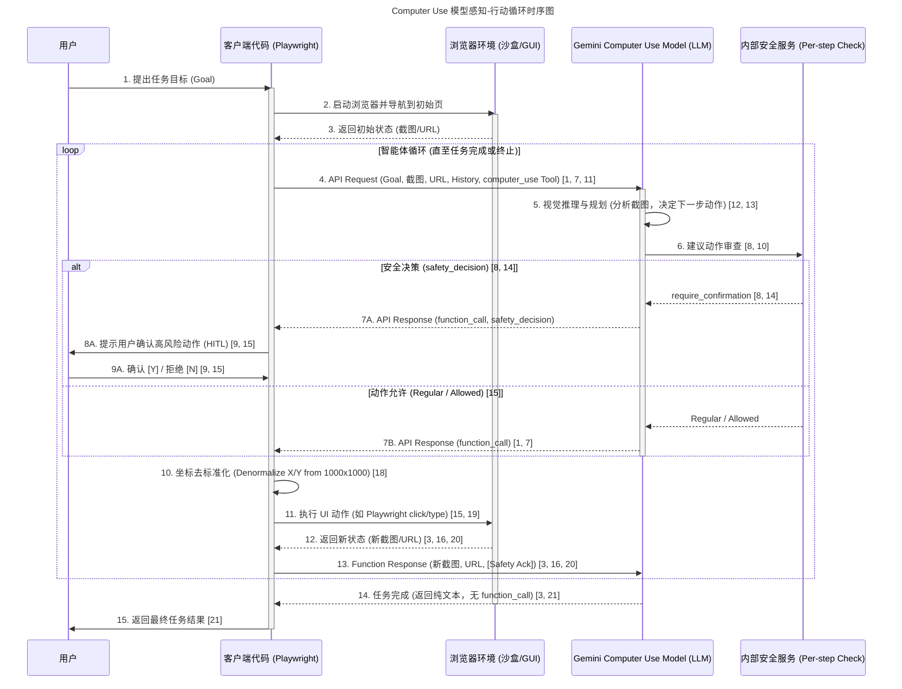

## Gemini 2.5 Computer Use Model （2025-10-07）

[Gemini 2.5 Computer Use Model](https://blog.google/technology/google-deepmind/gemini-computer-use-model/)：把“看屏幕、点鼠标、填表单”这类人机操作，交给模型来做。它通过 Gemini API 提供一个 computer_use 工具，循环式执行：输入用户意图、当前界面截图与历史动作，模型产出结构化的UI指令（点击、输入、滚动、拖拽、选择下拉等），客户端执行后回传新截图与URL，直至任务完成或被安全策略中断。核心价值在两点：一是对网页/移动端UI的强鲁棒理解与低延迟控制（Browserbase基准表现领先，在线Mind2Web场景延迟更低）；二是可在登录态、复杂表单、拖拽归类等真实工作流里稳定跑通。

它解决的痛点：传统RPA/脚本在DOM变化、非结构化界面、意外弹窗下脆弱，维护成本高；而通用LLM虽能调API，却难以处理“只有UI”的末梢任务。Gemini 2.5 以视觉-推理一体的闭环，直接对屏幕做决策，显著提升容错与恢复（谷歌内测用于脆弱E2E UI测试，自动“自愈”超60%失败）。安全侧提供逐步审查服务与高风险操作确认，覆盖绕过验证码、敏感系统修改等场景。

开发者路径清晰：Google AI Studio/Vertex AI 即刻预览，参考实现支持本地 Playwright 或 Browserbase 云端沙箱。适合个人助手、工作流自动化、UI测试等场景，尤其是“无API、界面频繁变动”的长尾流程。脑洞升级：把它接入多代理协同，前台UI执行+后台检索/结构化解析分工，叠加人类在环批注数据，做自监督式恢复策略学习，冲刺真实世界自治代理。

目前主要支持浏览器，但是未来的方向是支持更多UI场景，从而达到“Computer Use”的效果。

### 技术原理

---

#### TLDR

**核心机制：**
Gemini 2.5 Computer Use Model 是一个**基于视觉理解的 AI 代理**，它通过一个**持续的“感知-行动循环”**（Agent Loop）来自动化任务。它能够“像人类一样”查看屏幕截图，并基于此进行决策。

**工作循环：**

1. **感知 (输入):** 客户端向模型发送**用户目标**、**当前屏幕截图**（GUI 状态）和**操作历史记录**。
2. **决策 (输出):** Computer Use模型分析截图和目标，输出一个或多个结构化的 `function_call`，代表下一步的 UI 动作（如 `click_at`, `type_text_at`）。
3. **执行 (客户端):** 客户端代码（如 Playwright）接收动作指令，将模型输出的**归一化坐标**（基于 1000x1000 网格的 0-999 值） 转换为实际像素，并在浏览器中执行操作。
4. **反馈 (循环):** 执行后，客户端捕获**新的屏幕截图**和 URL 作为 `function_response`，再次发送给模型，循环往复直到任务完成。

---

#### 1. 模型基础与核心能力

Gemini 2.5 Computer Use Model 是基于 **Gemini 2.5 Pro** 的**可视化理解和推理能力**构建的专用模型。它被设计为一个**以浏览器为中心**的代理能力（browser-focused, agentic capability）。

它的主要功能是通过一个新的 API 工具，即 `computer_use` 工具，使 AI 代理能够：

1. **“看”屏幕状态：** 通过屏幕截图（Image）来“感知”当前的计算机屏幕状态。
2. **“行动”决策：** 分析屏幕截图和用户目标，生成类似人类的 UI 动作指令（Text）。

这种方法与传统的基于 DOM 元素选择器（如 Selenium）的自动化工具不同，Gemini 2.5 依靠**视觉感知**来适应 UI 的微小变化和动态元素，因此更具弹性。

#### 2. 感知-行动循环 (The Perception-Action Loop)

Gemini 2.5 Computer Use 的自动化任务是通过一个持续的、迭代的循环（Agent Loop）实现的：

##### 步骤 I：模型输入和请求发送

开发者（或客户端应用）向模型发送请求，其中包含关键的上下文信息：

* **用户目标：** 用户的任务请求（文本）。
* **当前环境状态：** GUI 的屏幕截图（Image）和当前的 URL。
* **历史记录：** 最近的动作历史。
* **工具配置：** 必须包含 `Computer Use` 工具。开发者可以额外指定要**排除**的预定义 UI 动作（`excluded_predefined_functions`）或添加**自定义用户定义函数**（`User-defined functions`），以扩展模型的功能，例如适应 Android 环境的 `open_app` 或 `long_press_at`。

##### 步骤 II：模型推理与动作生成

模型（Gemini 2.5 Computer Use）分析这些输入，并在其响应中生成下一步的行动计划：

* **功能调用输出：** 模型输出一个或多个 `function_call`，代表建议的 UI 动作，例如 `click_at`、`type_text_at` 或 `drag_and_drop`。模型支持**并行函数调用**（Parallel Function Calling），即在单个回合中可以返回多个动作。
* **坐标标准化：** 模型在内部预测像素坐标，但它在输出 `function_call` 时使用的是**归一化坐标** (Normalized Coordinates)，通常基于 1000x1000 的网格，范围是 0 到 999。

##### 步骤 III：客户端执行动作和去归一化

这一步是**客户端代码**（Client-side code）的职责，将模型的意图转化为实际的操作：

* **动作执行：** 客户端代码接收 `function_call`，然后将其转化为在目标环境（通常是 Web 浏览器，使用 Playwright 或Gemini Chrome DevTools MCP 等工具实现）中执行的实际操作。
* **坐标转换：** 客户端必须将模型输出的归一化坐标（0-999）根据实际屏幕尺寸（例如推荐的 1440x900）**去归一化**（denormalize），以确定精确的像素位置进行点击或输入。

##### 步骤 IV：捕获新状态并循环反馈

* **状态捕获：** 执行动作后，客户端立即捕获 GUI 的**新屏幕截图**和当前 URL。
* **反馈给模型：** 这些新状态信息作为 `function_response` 发送回模型，重新开始循环。如果执行了多个并行动作，则必须为每个动作发送一个 `FunctionResponse`。

这个迭代过程会一直持续，直到模型完成任务、发生错误或被安全协议终止。

#### 3. 感知-行动循环时序图

以下是一个客户端使用Playwright操作浏览器的时序图，展示了从用户发出请求到最终完成任务的流程：

#### 4. 安全与风险缓解架构

由于 AI 代理控制计算机带来了独特的风险（如意外动作、恶意注入、政策违规），Gemini 2.5 Computer Use 采用了**分层安全架构**：

1. **训练时缓解 (Post-training Mitigations):** 模型被训练来识别高风险动作（如进行购买、下载文件）。
2. **推断时安全服务 (Inference-time Safety Service):** 这是一个**模型外部的、每一步的**安全服务。它在模型建议的动作被执行前进行评估。
3. **用户确认机制 (Human-in-the-Loop):** 如果安全服务认为动作存在较高风险，模型响应会包含 `safety_decision`，分类为 `require_confirmation`。对于涉及金融交易、发送通信、访问敏感数据等高风险行为，**必须**要求终端用户确认。开发者必须实现用户确认逻辑，并且禁止绕过人类确认的要求。
4. **开发者自定义系统指令：** 开发者可以通过自定义 `system_instruction` 来实施额外的安全策略，例如在执行特定的最终不可逆动作（如点击“提交”或“确认购买”）前寻求用户明确许可。
5. **安全执行环境：** 架构建议代理必须在**安全且沙盒化的环境**中运行（例如沙盒虚拟机、容器或具有受限权限的专用浏览器配置文件），以限制其潜在影响。

总而言之，Gemini 2.5 Computer Use Model 的核心在于其基于 **Gemini 2.5 Pro 视觉理解能力**的 **迭代感知-行动闭环**，并辅以强大的**客户端执行逻辑**和**内置安全服务**，实现了对数字界面的高精度、类似人类的控制。

## 相关链接

* [Gemini 2.5 Computer Use Model Card](https://storage.googleapis.com/deepmind-media/Model-Cards/Gemini-2-5-Computer-Use-Model-Card.pdf)
* [NotebookLM 相关链接](https://notebooklm.google.com/notebook/fce960ac-dd55-49d7-8883-755246b88ad7)
* [Gemini 2.5 Computer Use Model](https://blog.google/technology/google-deepmind/gemini-computer-use-model/)
* [Introducing the Gemini 2.5 Computer Use model](https://blog.google/technology/google-deepmind/gemini-computer-use-model/)
