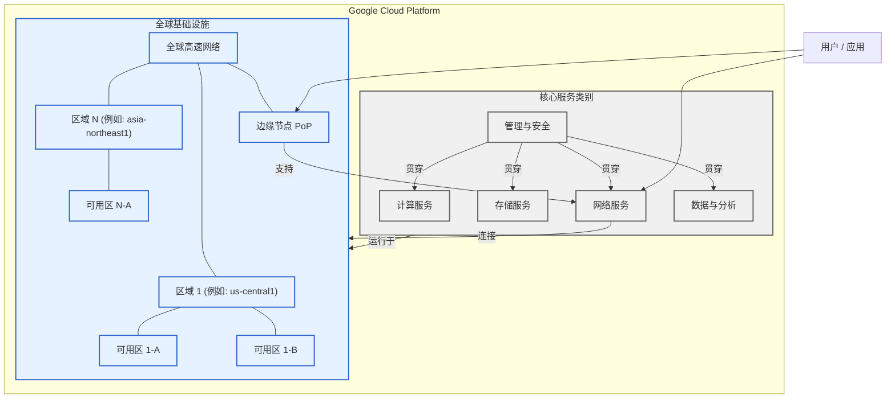
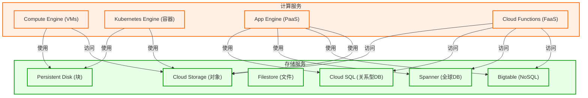
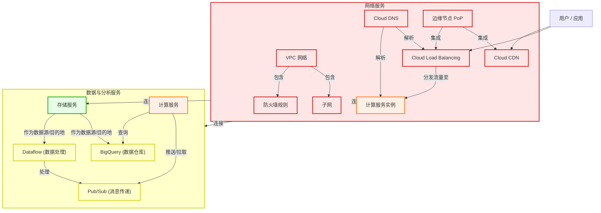
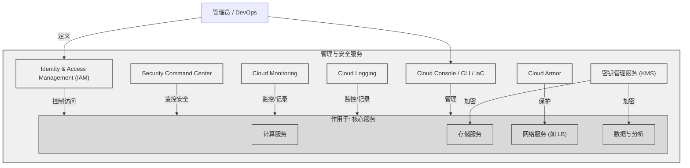

```mermaid
graph TD
    subgraph GCP ["Google Cloud Platform"]
        direction LR

        subgraph GlobalInfrastructure ["全球基础设施"]
            direction TB
            Region1["区域 1 (例如: us-central1)"]
            Region2["区域 N (例如: asia-northeast1)"]
            Zone1A["可用区 1-A"]
            Zone1B["可用区 1-B"]
            ZoneNA["可用区 N-A"]
            PoP["边缘节点 PoP"]

            Region1 --- Zone1A & Zone1B
            Region2 --- ZoneNA
            GlobalNetwork["全球高速网络"] --- Region1 & Region2 & PoP
        end

        subgraph CoreServices ["核心服务"]
            direction TB

            subgraph Compute ["计算服务"]
                GCE["Compute Engine (VMs)"]
                GKE["Kubernetes Engine (容器)"]
                AppEngine["App Engine (PaaS)"]
                CloudFunctions["Cloud Functions (FaaS)"]
            end

            subgraph Storage ["存储服务"]
                CloudStorage["Cloud Storage (对象)"]
                PersistentDisk["Persistent Disk (块)"]
                Filestore["Filestore (文件)"]
                CloudSQL["Cloud SQL (关系型DB)"]
                Spanner["Spanner (全球DB)"]
                Bigtable["Bigtable (NoSQL)"]
            end

            subgraph Networking ["网络服务"]
                VPC["VPC 网络"]
                LoadBalancing["Cloud Load Balancing"]
                CloudDNS["Cloud DNS"]
                CloudCDN["Cloud CDN"]
            end

            subgraph DataAnalytics ["数据与分析"]
                BigQuery["BigQuery (数据仓库)"]
                Dataflow["Dataflow (数据处理)"]
                PubSub["Pub/Sub (消息传递)"]
            end

            %% 连接关系 (高层次示意)
            Compute -- 使用 --> Storage
            Compute -- 连接 --> Networking
            Networking -- 连接 --> GlobalInfrastructure
            PoP -- 集成 --> CloudCDN
            DataAnalytics -- 处理 --> Storage
            DataAnalytics -- 交互 --> PubSub
            AppEngine & CloudFunctions -- 触发 --> PubSub
        end

        subgraph ManagementSecurity ["管理与安全 (贯穿各层)"]
            direction TB
            IAM["Identity & Access Management (IAM)"]
            SecurityCommand["Security Command Center"]
            CloudArmor["Cloud Armor"]
            Monitoring["Cloud Monitoring"]
            Logging["Cloud Logging"]
            Console["Cloud Console / CLI"]
        end

        %% 整体关系
        CoreServices -- 运行于 --> GlobalInfrastructure
        ManagementSecurity -- 管理与保护 --> CoreServices & GlobalInfrastructure

    end

    User["用户 / 应用"] --> LoadBalancing
    User --> CloudCDN
    User --> Console

    %% 样式 (可选)
    classDef default fill:#f9f,stroke:#333,stroke-width:2px;
    classDef infra fill:#e6f2ff,stroke:#36c,stroke-width:2px;
    classDef compute fill:#fff0e6,stroke:#f60,stroke-width:2px;
    classDef storage fill:#e6ffe6,stroke:#090,stroke-width:2px;
    classDef network fill:#ffe6e6,stroke:#c00,stroke-width:2px;
    classDef data fill:#ffffcc,stroke:#cc0,stroke-width:2px;
    classDef mgmt fill:#f0f0f0,stroke:#666,stroke-width:2px;

    class GlobalInfrastructure,Region1,Region2,Zone1A,Zone1B,ZoneNA,PoP,GlobalNetwork infra;
    class Compute,GCE,GKE,AppEngine,CloudFunctions compute;
    class Storage,CloudStorage,PersistentDisk,Filestore,CloudSQL,Spanner,Bigtable storage;
    class Networking,VPC,LoadBalancing,CloudDNS,CloudCDN network;
    class DataAnalytics,BigQuery,Dataflow,PubSub data;
    class ManagementSecurity,IAM,SecurityCommand,CloudArmor,Monitoring,Logging,Console mgmt;

```

## Google Cloud Platform (GCP) 核心基础设施详解

**全球基础设施与核心服务概览**

**计算与存储服务详解**

**网络与数据分析服务详解**

**管理与安全服务详解**

Google Cloud Platform 提供了一整套强大的云计算服务，其核心基础设施是构建和运行各种应用程序和工作负载的基础。以下是 GCP 的一些关键核心基础设施组件及其作用：

1. **全球网络 (Global Network)**
   - 作用: 这是 GCP 的骨干，连接着全球各地的数据中心。它由大量的区域 (Regions) 和可用区 (Zones) 组成，并通过高速的光纤网络互连。
   - 组件:
     - **区域 (Regions):** 独立的地理区域，例如 us-central1 (爱荷华州) 或 asia-northeast1 (东京)。每个区域包含多个可用区。选择区域可以优化延迟、满足数据驻留要求。
     - **可用区 (Zones):** 区域内物理上隔离的位置，例如 us-central1-a。可用区之间具有高带宽、低延迟的网络连接。将应用部署在多个可用区可以提高容错能力。
     - **网络边缘节点 (Points of Presence - PoPs):** 分布在全球各地，用于缓存内容 (Cloud CDN) 和提供更靠近用户的网络接入点，减少延迟。
  
2. **计算 (Compute)**
   - 作用: 提供运行应用程序和工作负载所需的计算能力。
   - 核心服务:
     - **Compute Engine (GCE):** 提供可定制的虚拟机 (VM)，用户可以完全控制操作系统和环境。适用于需要高度控制或迁移现有应用场景。
     - **Google Kubernetes Engine (GKE):** 用于大规模部署、管理和扩展容器化应用程序的托管式 Kubernetes 服务。适用于微服务架构和容器化工作负载。
     - **App Engine:** 一个完全托管的平台，用于构建和部署可扩展的 Web 应用程序和移动后端，无需管理底层基础设施。分为标准环境和灵活环境。
     - **Cloud Functions:** 事件驱动的无服务器计算平台，用于运行响应事件的代码片段，无需预配或管理服务器。适用于处理异步任务、API 后端等。

3. **存储 (Storage)**
   - 作用: 提供可扩展、持久且安全的数据存储解决方案。
   - 核心服务:
     - **Cloud Storage:** 高度可扩展的对象存储服务，适用于存储非结构化数据，如图片、视频、备份文件等。提供不同的存储类别以优化成本和访问速度。
     - **Persistent Disk:** 为 Compute Engine 虚拟机提供高性能、可靠的块存储（类似硬盘）。
     - **Filestore:** 完全托管的 NFS 文件存储服务，适用于需要共享文件系统的应用。
     - **Cloud SQL:** 完全托管的关系型数据库服务 (MySQL, PostgreSQL, SQL Server)。
     - **Cloud Spanner:** 全球分布式、强一致性的关系型数据库，具有高可用性和水平扩展能力。
     - **Cloud Bigtable:** 高性能、完全托管的 NoSQL 宽列数据库，适用于大规模分析和操作性工作负载。

4. **网络 (Networking)**
   - 作用: 定义和管理云资源之间的网络连接以及与外部网络的连接。
   - 核心服务:
     - **Virtual Private Cloud (VPC):** 在 GCP 内创建的隔离的私有网络环境，可以控制 IP 地址范围、子网、路由和防火墙规则。
     - **Cloud Load Balancing:** 将流量分发到多个后端实例（虚拟机、容器等），提高应用的可用性和可扩展性。提供多种类型的负载均衡器（全局、区域、HTTP(S)、TCP/UDP）。
     - **Cloud DNS:** 可靠、低延迟的托管式 DNS 服务，将域名解析为 IP 地址。
     - **Cloud CDN (Content Delivery Network):** 利用 Google 的全球边缘网络缓存内容，加速内容分发，降低源站负载。

5. **安全 (Security)**
   - 作用: 保护 GCP 资源和数据的安全。
   - 核心服务:
     - **Identity and Access Management (IAM):** 精细控制谁（用户、服务账号）可以对哪些资源执行什么操作。
     - **Cloud Armor:** 提供针对 DDoS 攻击和 Web 应用攻击（如 SQL 注入、跨站脚本）的防护。
     - **Security Command Center:** 集中式的安全和风险管理平台，提供资产发现、漏洞检测、威胁防护等功能。
     - **密钥管理服务 (KMS):** 管理加密密钥。
  
6. **数据与分析 (Data & Analytics)**
   - 作用: 提供处理、分析和可视化大规模数据集的工具。
   - 核心服务:
     - **BigQuery:** 完全托管、PB 级数据仓库，支持快速 SQL 查询和分析。
     - **Dataflow:** 用于流式和批处理数据处理的统一编程模型和托管服务。
     - **Pub/Sub:** 全球性的实时消息传递服务，用于解耦服务和处理事件流。
  
7. **管理工具 (Management Tools)**
   - 作用: 提供监控、日志记录、部署和管理 GCP 资源的工具。
   - 核心服务:
     - **Google Cloud Console:** 基于 Web 的图形用户界面，用于管理 GCP 资源。
     - **Cloud Monitoring:** 收集指标、设置告警、创建仪表板，监控云资源和应用的性能。
     - **Cloud Logging:** 集中存储、查看、搜索和分析来自 GCP 资源和应用的日志数据。
     - **Cloud Deployment Manager / Terraform:** 用于以代码形式定义和部署基础设施 (Infrastructure as Code)。

  这些核心基础设施组件共同构成了 Google Cloud Platform 的基础，使用户能够构建、部署和扩展各种规模和复杂性的应用程序。
