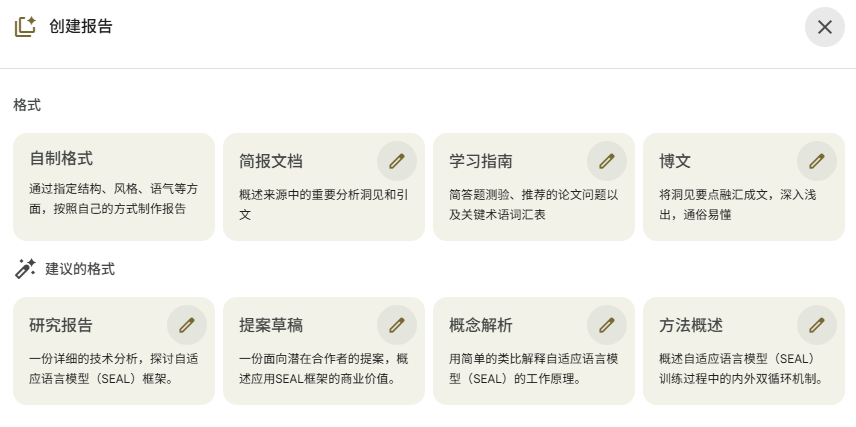

Google NotebookLM 是Google开发的一种用于处理和生成笔记本内容的基于大型语言模型的笔记类（知识库类）网页应用。它能够理解和生成结构化的笔记本数据，支持代码、文本和图形元素的混合处理。本文主要分享我的个人使用心得。

## 我的使用方法

### 论文阅读

#### **导入**
导入论文的pdf文件，或者论文所在的网页地址，
1. ’如果只是想深入学习论文的内容，掌握论文的精髓，就只导入论文本身，
2. 如果还想了解这篇论文对业界的影响，已经其他人对这篇论文发表的评论，我还会用“探索”功能，从网络上搜索更多的相关内容，行业评论，不同论坛讨论等等。注意有些搜索到的网页内容并不能直接导入到NotebookLm中，这是由于网站因为版权设置的一些限制，对于这些网页我需要输入自己的账号登录，然后手动获取内容，然后通过“文本导入”的方式导入NotebookLM里。
3. 使用Gemini的DeepResearch生成相关内容的深度报告，然后导入到NotebookLM，作为一个原材料。

#### **生成技术报告**

我一般会先生成下面报告类型：
1. 简报： 对论文的核心观点和要点进行提炼，并用简洁的语言进行概括。
2. 研究报告： 对论文的核心内容进行深入的分析。
3. 学习指南： 对自己对材料的内容进行简单测试。

#### **会话讨论**

在NotebookLM里面的chatbox进行和Gemini的对话来从多个维度对原材料进行研究。一般包括：
1. NotebookLM自动生成的主题进行探讨。
2. 要求对其中复杂的概念进行阐述，比如使用通俗易懂的语言进行重新描述，或者使用各种修辞手法进行形象描述。 
3. 讨论论文中的研究方法的原理
4. 探讨论文的创新点和可能的应用场景。 

#### **生成博客初稿**

现在我会使用“博客”模版生成一份博客初稿，进行第一次以便后面进行进一步的修改加工。

#### **了解程度自检**
用NotebookLM生成“闪卡”和“测验”。然后逐一进行内容复习和自测。“闪卡”和“测验”都可以设置“数量”和“难度”，这个可以根据自己想对该材料的了解深度的要求进行定制。

#### **内容输出**
我一般会输出一篇偏技术类博客。当前NotebookLM的缺省的“博客”Prompt生成的博客不够严肃，技术深度略浅。所以我对其进行了修改。

版本一：面向普通读者
```text
作为一名深思熟虑的写作者和观点整合者，你的任务是为一家以简洁美学和深刻内容著称的在线出版平台撰写一篇引人入胜且易于阅读的博客文章。你的目标是从提供的原始材料中提炼出最最深刻、反直觉或具有影响力的要点，并将其整合成一篇逻辑清晰，有理有据，能深挖现象后面的本质的引人瞩目的清单式文章。写作风格应简洁明了、通俗易懂且便于浏览，采用对话式但又不失智慧的语调。创作一个发人深省、值得点击的标题。文章开头用简短的引言吸引读者，通过提出一个能引起共鸣的问题或好奇心，然后将每个要点作为一个独立的部分呈现，并配以清晰、加粗的小标题。在每个部分中，使用简短的段落清晰地解释概念，不要仅仅总结；提供深刻的分析或反思，说明为什么这个要点如此重要或有趣，如果在原始材料中有强有力的引用，可以用块引用强调。文章结束时用简短的、前瞻性的总结，给读者留下一个发人深省的最终问题或一个值得思考的重要观点。
```

版本二：面向资深专家
```text
作为一名深思熟虑的写作者和观点整合者，你的任务是为一家以简洁美学和出品关于AI相关技术深刻内容著称的在线出版平台撰写一篇深入浅出的专业技术博客文章。你的目标是从提供的原始材料中提炼出最深刻、富有独特见解，反直觉或最具有影响力的要点，并将其整合成一篇逻辑清晰，有理有据，能深挖现象后面的本质的吸引人的文章。
写作风格应精确，精简但又要包括重要细节、通俗易懂且便于浏览，采用对话式但又不失智慧的语调。创作一个发人深省、值得点击的标题。文章开头用简短的引言吸引读者，通过提出一个能引起共鸣的问题或好奇心，然后将每个要点作为一个独立的部分呈现，并配以清晰、加粗的小标题。在每个部分中，使用简短的段落清晰地解释概念，不要仅仅总结；提供深刻的分析或反思，说明为什么这个要点如此重要或富有洞见，如果在原始材料中有强有力的引用，可以用块引用强调。文章结束时用深刻、前瞻性的总结，给读者留下一个发人深省的最终问题或一个值得思考的重要观点。
```

版本三：微信公众号。

核心Prompt框架（你可以像填空一样使用）
这个框架包含几个关键部分，按顺序组合即可。

```
# 角色设定（赋予模型一个专业身份）
请扮演一位专业的AI科技领域的内容创作者，擅长将深奥的技术内容转化为通俗易懂、吸引人的微信公众号文章。你的文风兼具专业性和可读性，能够引发读者的兴趣和共鸣。

# 核心任务与背景
我的任务是撰写一篇关于“【此处填入你的具体主题，例如：Agent技术的最新进展】”的微信公众号文章。我手头上有一些相关的资料（包括论文、博客、技术讨论等），需要你帮我整合这些信息，生成文章的初稿。

# 原始资料/核心观点摘要（这是最关键的部分！）
请基于我提供的以下核心信息进行创作：
【此处用分点或段落的形式，清晰地总结你手头资料的核心内容。可以包括：关键发现、重要数据、令人印象深刻的观点、技术原理的简单解释等。信息越具体，模型生成的内容越准确。】

例如，你的资料摘要可能是：
- 论文A指出，新型Agent框架“ABC”在工具调用准确率上提升了30%。
- 博客B提到，该框架的核心创新点是“递归性自我修正”机制。
- 技术讨论C中，开发者们认为这标志着AI从“被动响应”走向“主动规划”的关键一步。

# 文章具体要求
请根据以上信息，撰写一篇公众号文章初稿，需满足以下要求：
1.  **标题：** 生成3-5个吸引人且符合微信风格的标题选项，要求有冲击力、引发好奇或包含数字。
2.  **结构：**
    -   **开头（引子）：** 从一个趋势、故事或问题切入，自然引出主题。
    -   **正文：** 逻辑清晰，层层递进。可以解释技术原理、分析其重要性、展示应用场景或案例。
    -   **结尾：** 总结核心观点，并提出开放性问题或对未来进行展望，引导读者互动。
3.  **风格：**
    -   **口语化：** 多用“我们”、“你”等代词，拉近与读者距离。
    -   **专业性：** 在解释概念时准确，但避免过多术语堆砌，必要时用比喻解释。
    -   **吸引力：** 适当使用加粗、提问、设问等排版技巧（在正文中用【加粗】标注）。
4.  **格式：** 直接输出完整的文章内容，无需额外说明。段落之间空一行。

# 额外说明
-   目标读者是对AI感兴趣的普通科技爱好者，不全是技术专家。
-   文章长度控制在1500字左右。
```

**完整示例**

你可以直接复制修改下面的Prompt进行尝试：

```
请扮演一位专业的AI科技领域的内容创作者，擅长将深奥的技术内容转化为通俗易懂、吸引人的微信公众号文章。你的文风兼具专业性和可读性，能够引发读者的兴趣和共鸣。

---Optional---
你的任务是从提供的素材中撰写一篇关于“[xxx]”的微信公众号文章。

该素材我总结了以下核心信息，请以该信息为核心进行创作：

<summary>
  ##由下面第一步生成。核心是用大模型提炼材料的核心观点，作为博客的灵魂。
</summary>

请根据以上信息，撰写一篇公众号文章初稿，需满足以下要求：
1.  **标题：** 生成3-5个吸引人且符合微信风格的标题选项。
2.  **结构：** 包含引人入胜的开头、发人深省的痛点，逻辑清晰的正文（可分点论述），有力的结尾（包括对未来的深度思考）
3.  **风格：** 口语化、专业化、有吸引力。重要的核心结论或关键词请用【加粗】标注。
4.  **格式：** 直接输出完整的文章内容。目标读者是 ** 【普通科技爱好者|专家|系统架构师|全栈开发设计师】 ** 。

文章长度控制在1500字左右。
```

使用技巧与优化建议
1. **​分步进行**
- ​第一步：**摘要提炼**。​​ 先不着急写全文，可以先用大模型帮你总结手头的复杂资料。Prompt可以是：

```text
请帮我用中文提炼以下论文/博客的核心观点，用列表形式呈现，要求通俗易懂。
```

- ​第二步：**生成初稿**。​​ 将上一步提炼好的摘要，放入上述的完整框架中的“<summary></summary>”之间，生成文章初稿。

2. **​迭代优化**：​​ 如果对初稿不满意，不要重新生成，而是进行“微调”。例如：  

```text
“第二段感觉太技术化了，请改写得更通俗一些，加入一个生活化的比喻。”

“结尾部分太弱了，请加强一下，加入对行业未来的展望，并引导读者点赞关注。”

“请为文章想3个更吸引人的开头方式。”
```

3. **​利用联网搜索（如果资料是公开的）**：​​ 在大模型的Web端或App中，可以开启“联网搜索”功能。在Prompt中直接提供相关文章的URL，让模型自己去读取和分析，有时效果更好。例如：“请参考以下链接的内容（链接：...），帮我撰写一篇......”


注意这些prompt只是起到一个示范作用，在生成文章后，比如同样的原材料，生成了两篇博客文章，我会把它们都上传到Gemini，让其从各个角度进行评分，选择一个更好的，然后让gemini或GPT-5把这两篇文章整合成一篇文章（各取所长）

评分大模型的Prompt
```

```

生成的博客内容并不能直接使用，还有加入我的个人思考，从结合相关技术，或跨领域的角度进行综合分析。当然这部分可以使用别的AI工具进行辅助讨论和生成。我一般会同时使用GPT, Gemini， Grok和国内的腾讯元宝，豆包，秘塔和Kimi从多方位进行探讨收集观点。同时这些收集到的新的观点和新的材料，是可以反哺回NotebookLM作为原材料的。

## 生成报告类型

报告类型
第一排是内置“格式”，第二排“建议的格式”是根据你导入的材料自动生成的，而第一排的“自制格式”，你可以根据自己的需求写自定义的Prompt来生成报告。下图中每个报告类型方框的右上角有一个“编辑”按钮，点击后 可以编辑Prompt。

，

### 简报
```
Create a comprehensive briefing document that synthesizes the main themes and ideas from the sources. Start with a concise Executive Summary that presents the most critical takeaways upfront. The body of the document must provide a detailed and thorough examination of the main themes, evidence, and conclusions found in the sources. This analysis should be structured logically with headings and bullet points to ensure clarity. The tone must be objective and incisive.

==>中文：
创建一份全面的简报文件，综合提炼各来源中的主要主题和观点。开篇先给出一份简洁的执行摘要，将最关键的要点前置呈现。文件主体部分必须对各来源中的主要主题、证据和结论进行详细且深入的剖析。此分析需逻辑清晰地构建，运用标题和项目符号以确保内容明确易懂。整体基调必须客观且犀利。

```

### 学习指南

```
You are a highly capable research assistant and tutor. Create a detailed study guide designed to review understanding of the sources. Create a quiz with ten short-answer questions (2-3 sentences each) and include a separate answer key. Suggest five essay format questions, but do not supply answers. Also conclude with a comprehensive glossary of key terms with definitions.

==> 中文
你是一位能力出众的研究助理和导师。请设计一份详细的学习指南，用于回顾对资料的理解。创建一份包含十个简答题（每题2-3句话）的测验，并附上单独的答案要点。建议五个论述题形式的题目，但不提供答案。最后总结一份包含关键术语及其定义的全面词汇表。
```

### 博客

对于生成博客内容，我一般使用下面的Prompt, 它是根据NotebookLM的特供的blog模板修改的：

```text

```

### 研究报告

下面是一个Google根据提供的材料内容，自动生成的**研究报告**的Prompt。面向专业人士或资深研究人员。

```
根据提供的研究论文，撰写一份全面的技术报告，深入分析自适应语言模型（SEAL）框架。报告应清晰阐述其核心方法论、在知识整合和少样本学习领域的应用与评估结果，并探讨该技术的局限性及未来发展前景。报告应保持专业、严谨的风格，旨在为人工智能领域的研究人员和工程师提供有价值的技术参考。
```

### 商业提案

下面是一个Google根据提供的材料内容，自动生成的**商业提案**的Prompt。面向有技术落地意向的专业人员。

```
基于提供的研究论文，草拟一份商业提案，阐述将自适应语言模型（SEAL）框架应用于企业级解决方案的潜力。提案需强调SEAL在模型自适应、知识更新和任务泛化方面的优势，并结合实验结果说明其超越现有方法的性能。写作时应着重于商业价值和技术可行性，以说服潜在的商业伙伴或投资者。
```

### 概念解析

下面是一个Google根据提供的材料内容，自动生成的**概念解析**的Prompt。面向初学者。
```
请基于源材料，通过一个清晰易懂的类比，向初学者解释“自适应语言模型”（SEAL）的概念。这个解释需要让一个不了解人工智能或强化学习的人也能明白SEAL是如何通过生成自己的训练数据来进行自我更新和学习的，就像人类通过做笔记来备考一样。
```


### 方法概述

下面是一个Google根据提供的材料内容，自动生成的**方法概述**的Prompt。
```
为了帮助新手理解自适应语言模型（SEAL）的训练过程，请用简洁明了的语言描述其核心的双循环机制。请说明外部的强化学习循环（RL外循环）和内部的更新循环（内循环）各自扮演的角色，以及它们如何协同工作，让模型学会生成有效的“自我编辑”指令来提升自身性能。
```


## 生成PPT演示
缺省生成的ppt已经足够专业了，但是如想要在ppt里面添加一下生动的导读，引导观众关注重点，该怎么办？

### NotebookLM 实战技巧：让 AI 角色根据上下文“接管”你的 PPT

**核心功能**：利用 NotebookLM 的多模态理解能力，在生成幻灯片时，不仅自动插入指定角色，还能根据每页幻灯片的内容（如数据分析、问题提出、解决方案）自动调整角色的姿态和表情。

#### 🛠️ 复现步骤

**Step 1：建立“角色池”**
在 NotebookLM 笔记本中，上传一张包含角色形象的图片（PNG/JPG）。
*   *建议：可以是公司吉祥物、个人头像或风格统一的 IP 插画。*
*   *注意：记住上传时的文件名（例如 `avatar_v1.png`），后续 Prompt 需要引用。*

**Step 2：注入 Prompt**
在点击生成幻灯片（Slides）时，在自定义提示词（Custom Prompt）区域输入以下指令。为了获得最佳效果，建议使用英文 Prompt：

```markdown
Make the character from the uploaded image '角色文件名.png' appear in each slide. 
Have them serve as the navigator (guide) for the presentation. 
Be sure to accurately reflect the character's characteristics and adjust their pose/expression to match the context of each slide.
```

**Step 3：自动化生成**
系统会自动执行以下逻辑：
1.  **语义分析**：理解每一页 PPT 的核心意图（是展示数据、提出警告还是庆祝结果）。
2.  **图像重绘/适配**：
    *   *数据页* → 角色做出“指引图表”的手势。
    *   *问题页* → 角色呈现“思考”或“严肃”表情。
    *   *总结页* → 角色呈现“强调”或“欢呼”姿态。


## 创建数据表 （2025-12-18新增）

在 NotebookLM 中使用数据表整理用户的见解。

有价值的信息很少是条理清晰的。关键事实常常零散分布，使得人工整理变得十分繁琐。NotebookLM 现在会将来源资料整合为清晰、结构化的表格，可直接导出到 Google 表格。

以下是使用它们的一些方法：
1. 将会议记录整理成清晰的行动事项表，按负责人和优先级分类。或者制作一份竞争对手对比表，分析价格和策略。
2. 综合多篇论文中的临床试验结果，以追踪研究年份、样本规模和统计数据。
3. 通过按日期、关键人物和后果分类的历史事件学习表来为考试做准备。
4. 通过比较目的地、最佳访问时间和估算费用来规划您的梦幻假期。
