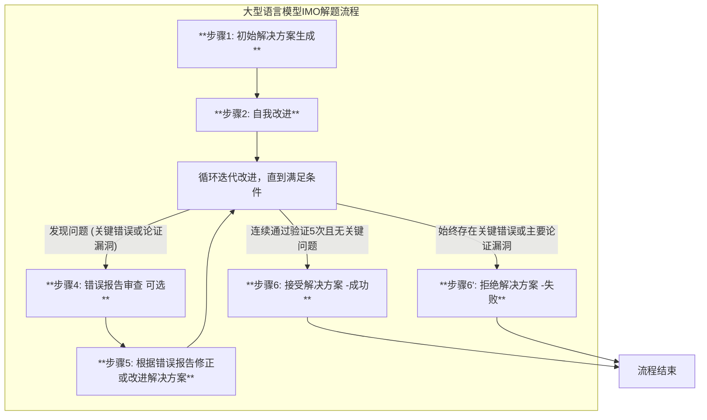

发布日期： 2025 年 7 月 28 日 作者： Yichen Huang (黄溢辰), Lin F. Yang (杨林) (UCLA)

## 摘要

本简报总结了最新研究论文《Gemini 2.5 Pro Capable of Winning Gold at IMO 2025∗》的关键发现，该论文评估了大型语言模型（LLM）在国际数学奥林匹克（IMO）问题上的高级推理能力。**注意**：该论文不是来自Google的。

## 1. 简介与背景

国际数学奥林匹克（IMO）是一项享有盛誉的年度竞赛，旨在挑战参赛者在代数、几何、数论和组合数学等领域的问题，这些问题需要深刻的洞察力、创造力和严格的形式推理。传统的数学基准测试，如 GSM8K 和 MATH，通过模式识别和训练数据检索可以实现 LLM 的高水平表现。然而，IMO 问题超越了这些基准的复杂性，需要多步骤推理、抽象和创新，这些能力更接近人类专家级的认知，因此暴露了 LLM 在泛化能力、幻觉和肤浅启发式方面的局限性。

以往的研究表明，即使是最先进的 LLM 在奥林匹克级别的问题上也存在显著局限性，难以产生严谨的证明，并且无法达到人类奖牌获得者的分数，常常陷入逻辑谬误和缺乏创造性洞察。

本研究旨在评估 Google 的 Gemini 2.5 Pro 模型在最新发布的 IMO 2025 问题上的表现。为了确保评估的严谨性和未受污染，本研究仅使用 IMO 2025 竞赛的问题，这些问题在评估前几天才发布，从而降低了数据泄露的风险。

## 2. 核心发现

通过采用“**自我验证流水线**”和精心设计的提示，Gemini 2.5 Pro 模型成功解决了 IMO 2025 年六个问题中的 5 个。这一成果表明，强大的现有模型已经能够解决困难的数学推理问题，但直接使用它们可能会导致不佳结果，因此开发最佳策略以充分发挥其潜力至关重要。

该研究还指出，与本工作同期，其他团队（如 OpenAI、Google DeepMind 和 ByteDance）也报告了在 IMO 2025 问题上的高水平表现。

## 3. 方法论：自验证管道

Google 的 Gemini 2.5 Pro 模型通过一个精心设计的自验证管道，成功解决了 IMO 2025 的六个问题中的五个。该方法强调了利用强大 LLM 的全部潜力来解决复杂推理任务的最佳策略。

### 核心步骤

研究团队构建了一个迭代的自我验证流水线，以引导模型生成和完善解决方案。该流水线主要包括以下步骤：



#### 步骤 1：初步解决方案生成

- 使用专门设计的提示（强调严谨性而非仅仅找到最终答案）
- 生成初始解决方案（质量通常较低，符合最近研究发现）

#### 步骤 2：自我改进

- 模型被提示审查并尝试改进其工作
- 有效注入额外的思考预算，克服 token 限制（Gemini 2.5 Pro 最大推理令牌为 32768）
- 显著提高输出质量

#### 步骤 3：验证与错误报告生成

- 使用"验证器"组件逐步审查解决方案的每一步
- 识别问题并分类：
  - **关键错误**：逻辑链断裂或存在明显逻辑谬误
  - **证明空白**：结论可能正确，但论证不完整、模糊或缺乏严谨性

#### 步骤 4：错误报告审查（可选）

- 人工审查验证器生成的错误报告
- 删除并非真正问题的报告，提高错误报告可靠性

#### 步骤 5：基于错误报告进行修正/改进

- 模型根据错误报告尝试改进解决方案

#### 步骤 6：接受或拒绝

- 如果解决方案连续通过验证过程 5 次，则被接受
- 如果持续存在关键错误或主要证明空白，则被拒绝
- 该流水线被并行或串行运行多次，直到获得正确解决方案或模型声称无法识别解决方案

### 验证器的关键作用

验证器在流水线中扮演着重要角色，负责逐步审查解决方案并找出问题。研究发现：

- **关键错误**很少被验证器遗漏，即使遗漏，多次运行也很可能捕捉到
- 如果验证器报告了关键错误，它可能并非总是"关键"，但几乎总是需要修改
- 验证器可能会报告一些对数学家而言微不足道的"证明空白"

### 方法优势

这种迭代式精炼过程系统地克服了单次生成方法的局限性：

- 有限的推理预算
- 初始草稿中经常出现的关键错误和论证空白

特别是，验证器引导的循环对于从模型中引出严谨、可靠和完整的数学论证至关重要。

---

## 4. 实验设置

- 模型： Gemini 2.5 Pro。
- 温度（Temperature）： 0.1（较低的温度旨在减少随机错误）。
- 思考预算（Thinking Budget）： 使用 Gemini 2.5 Pro 的最大思考预算（32768 推理 token）。
- 工具： 未使用网页搜索、代码或其他工具。
具体Agent对应的Prompt: 参考代码<https://github.com/lyang36/IMO25/blob/main/code/agent.py>

## 5. IMO 2025 问题解决方案摘要与分析

研究结果展示了模型对 IMO 2025 问题的解决方案，其中 5 个问题得到了完整且严格的数学证明。

问题 1、2、3、4、5 成功解决：问题 1（几何）： 模型在没有提示的情况下成功解决了该问题，但提供“尝试归纳法”的提示也生成了另一个有效解决方案。这支持了模型能力本身就存在，提示只是提高了效率的假设。
问题 2（几何）： 模型在没有提示的情况下成功解决了该问题，但提供“尝试解析几何”的提示也生成了另一个有效解决方案。
问题 3（数论）： 模型在没有提示的情况下成功解决了该问题，确定了常数 c 的最小值是 4。
问题 4（数论）： 模型在没有提示的情况下成功解决了该问题，确定了 a1 的所有可能值。
问题 5（博弈论）： 模型在没有提示的情况下成功解决了该问题，确定了 Alice 和 Bazza 拥有致胜策略的 λ 值以及平局的情况。
问题 6 失败：模型成功识别了 4048 的微不足道的上限，但其证明一个匹配的下限是基于一个有缺陷的前提。核心错误是断言任何瓦片必须完全位于两个不相交区域之一：未覆盖方块的左侧（CL）或右侧（CR）。
该假设是错误的，因为一个瓦片可以跨越某些行中未覆盖方块的左侧列和另一些行中未覆盖方块的右侧列。这导致了后续证明的无效。
6. 讨论与展望
流水线的重要性： 高成功率验证了本研究的核心论点：结构化、迭代的流水线对于将大型模型的潜在能力转化为严格的数学证明至关重要。这种方法直接解决了仅仅依靠原始模型能力不足以完成此类任务的挑战。
迭代细化过程： 研究表明，迭代细化过程系统地克服了单次生成（例如有限推理预算、初始草稿中常见的关键错误和证明空白）的局限性。特别是，验证器引导的循环对于从模型中提取严谨、可信和完整的数学论证至关重要。
未来工作：期望使用更多样化的领先模型（例如 Grok 4、OpenAI-o 系列）将产生更强的数学能力。
在流水线中，解决方案是单独采样的。多智能体系统（类似于 Grok 4 heavy），可以结合不同解决方案的优势，预计将带来更强的数学能力。

## 参考

- 论文：<https://arxiv.org/pdf/2507.15855>
- github: <https://github.com/lyang36/IMO25>
- [相应NotebookLM](https://notebooklm.google.com/notebook/28367be8-fb7d-444b-bad1-d31e87ee961b)
- [通义千问论文翻译](https://www.tongyi.com/efficiency/doc/read?taskId=10583274)
- [IMO官网](http://www.imo-official.org/year_info.aspx?year=2025)
- [google blog](https://blog.google/machine-learning/model-advanced-mathematical-reasoning/)
- [DeepMind DeepThink IMO 2025](https://deepmind.google/discover/blog/advanced-version-of-gemini-with-deep-think-officially-achieves-gold-medal-standard-at-the-international-mathematical-olympiad/)
  - [Deepmind DeepThink IMO 2025 解题步骤](https://storage.googleapis.com/deepmind-media/gemini/IMO_2025.pdf) ==>只专注于提供每个问题的完整数学证明和解题步骤，例如结构引理、归约定理、案例分析、辅助点引入以及代数计算等. 展示的是**“Gemini Deep Think”解决数学奥林匹克问题的结果和推导过程，而非其作为大型语言模型进行推理或解题的具体内部机制、算法或方法论**。换句话说，它呈现的是解决方案本身，而不是生成这些解决方案的AI的工作原理。

## Prompt附录

来自github代码：<https://github.com/lyang36/IMO25/blob/main/code/agent.py>

```python
step1_prompt = """

### Core Instructions ###

- **Rigor is Paramount:** Your primary goal is to produce a complete and rigorously justified solution. Every step in your solution must be logically sound and clearly explained. A correct final answer derived from flawed or incomplete reasoning is considered a failure.
- **Honesty About Completeness:** If you cannot find a complete solution, you must **not** guess or create a solution that appears correct but contains hidden flaws or justification gaps. Instead, you should present only significant partial results that you can rigorously prove. A partial result is considered significant if it represents a substantial advancement toward a full solution. Examples include:
  - Proving a key lemma.
  - Fully resolving one or more cases within a logically sound case-based proof.
  - Establishing a critical property of the mathematical objects in the problem.
  - For an optimization problem, proving an upper or lower bound without proving that this bound is achievable.
- **Use TeX for All Mathematics:** All mathematical variables, expressions, and relations must be enclosed in TeX delimiters (e.g., `Let $n$ be an integer.`).

### Output Format ###

Your response MUST be structured into the following sections, in this exact order.

**1. Summary**

Provide a concise overview of your findings. This section must contain two parts:

- **a. Verdict:** State clearly whether you have found a complete solution or a partial solution.
  - **For a complete solution:** State the final answer, e.g., "I have successfully solved the problem. The final answer is..."
  - **For a partial solution:** State the main rigorous conclusion(s) you were able to prove, e.g., "I have not found a complete solution, but I have rigorously proven that..."
- **b. Method Sketch:** Present a high-level, conceptual outline of your solution. This sketch should allow an expert to understand the logical flow of your argument without reading the full detail. It should include:
  - A narrative of your overall strategy.
  - The full and precise mathematical statements of any key lemmas or major intermediate results.
  - If applicable, describe any key constructions or case splits that form the backbone of your argument.

**2. Detailed Solution**

Present the full, step-by-step mathematical proof. Each step must be logically justified and clearly explained. The level of detail should be sufficient for an expert to verify the correctness of your reasoning without needing to fill in any gaps. This section must contain ONLY the complete, rigorous proof, free of any internal commentary, alternative approaches, or failed attempts.

### Self-Correction Instruction ###

Before finalizing your output, carefully review your "Method Sketch" and "Detailed Solution" to ensure they are clean, rigorous, and strictly adhere to all instructions provided above. Verify that every statement contributes directly to the final, coherent mathematical argument.

"""

self_improvement_prompt = """
You have an opportunity to improve your solution. Please review your solution carefully. Correct errors and fill justification gaps if any. Your second round of output should strictly follow the instructions in the system prompt.
"""

correction_prompt = """
Below is the bug report. If you agree with certain item in it, can you improve your solution so that it is complete and rigorous? Note that the evaluator who generates the bug report can misunderstand your solution and thus make mistakes. If you do not agree with certain item in the bug report, please add some detailed explanations to avoid such misunderstanding. Your new solution should strictly follow the instructions in the system prompt.
"""

verification_system_prompt = """
"""

verification_remider = """

### Verification Task Reminder ###

Your task is to act as an IMO grader. Now, generate the **summary** and the **step-by-step verification log** for the solution above. In your log, justify each correct step and explain in detail any errors or justification gaps you find, as specified in the instructions above.
"""
```
