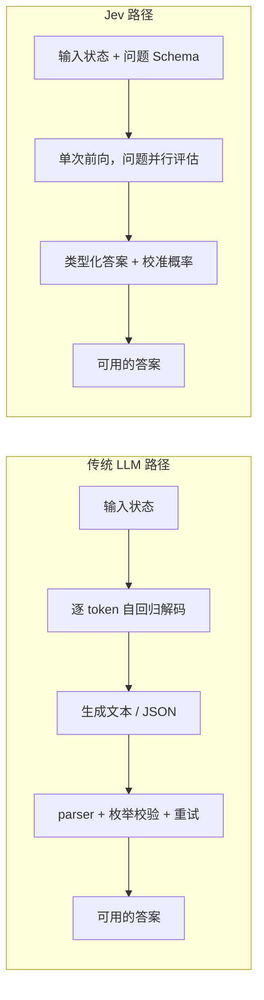

---  
title: "Jev 深度解析：TypeSafe AI 那个「不做聊天、只做判断」的系统一模型"  
date: "2026-10-03T10:30:00+08:00"  
draft: false  
tags: ["AI", "TypeSafe", "Jev", "System One", "决策模型", "RLCD", "Agent", "Kev", "Laya", "开源"]  
categories: ["large_models"]  
description: "TypeSafe AI 于 2026 年 9 月发布的 Jev 是一个不生成文本、只返回带概率的类型化决策的「系统一」（System One）模型。本文系统梳理它走红的背景与动因、核心实现原理、主要功能、现存局限、典型应用场景、开源竞品对比、业界专家评价与未来趋势。"  
wordCount: 6783  
readingTime: 18  
---

## 目录

- [术语澄清](#术语澄清)
- [一、走红的背景与动因](#一走红的背景与动因)
- [二、核心实现原理](#二核心实现原理)
- [三、主要功能与能力边界](#三主要功能与能力边界)
- [四、现存局限与争议](#四现存局限与争议)
- [五、典型应用场景](#五典型应用场景)
- [六、开源竞品对比](#六开源竞品对比)
- [七、业界专家评价](#七业界专家评价)
- [八、未来发展趋势](#八未来发展趋势)
- [结语](#结语)
- [参考资料](#参考资料)

## 一、走红的背景与动因

### 1.1 一个"不聪明"的卖点

Jev 最反常的地方在于，它的卖点恰恰是"不聪明"。它不写句子、不解释内容、不生成图片，也不做长链条推理。你给它一段状态（state，可以是文本或 JSON）和一组带固定选项的问题，它在一次调用中返回所有问题的**类型化答案（typed answers）**&#x4EE5;及每个答案的**校准概率（calibrated probability）**。

TypeSafe AI 把这类模型称为 **System One Model（系统一模型）**，概念借自丹尼尔·卡尼曼《思考，快与慢》中对"快、直觉、自动"的系统一与"慢、审慎、推理"的系统二的区分。Jev 是这一模型类别的首个公开实例。

### 1.2 公司背景：从 OpenAI 出来的创始人

| 项目    | 事实                                                                                                                                                        | 来源                           |
| ----- | --------------------------------------------------------------------------------------------------------------------------------------------------------- | ---------------------------- |
| 公司    | TypeSafe AI，旧金山初创，成立于 2024 年                                                                                                                              | AI Wiki，2026-09              |
| 创始人   | Diogo Almeida（前 OpenAI 研究员），联合创始人 Erik Gafni、Sasha Sheng                                                                                                  | AI Wiki，2026-09              |
| 创始人背景 | Almeida 是 2022 年 InstructGPT 论文《Training language models to follow instructions with human feedback》（Ouyang et al.）的第四作者；TypeSafe 团队页称其此前任职于 Google Brain | 官方团队页；InstructGPT 论文         |
| 融资    | 2026-09-15 宣布结束隐身状态，完成 4000 万美元种子轮，DCVC 领投，DCVC 普通合伙人 James Hardiman 参与                                                                                   | Business Wire 新闻稿，2026-09-15 |

需要说明的是，"ChatGPT 共同发明人""RLHF 共同发明人"是公司与 Almeida 本人的自我描述。可独立核实的是他在 InstructGPT 论文中的作者位次，而 RLHF 技术本身早于该论文。这一点在评估其技术权威性时值得注意。

### 1.3 核心洞察：AI 到底是给谁用的

Almeida 对 Jev 的动机有一个清晰的表述。他回忆自己在 OpenAI 期间思考的问题：如果一场基于 AI 的经济革命真的发生，那么所有调用 AI 的请求中，有多少是供人类消费的，又有多少实际上是供计算机消费的？

他的判断是：**绝大多数是给机器用的，而大语言模型（LLM）最初是为与人交流而设计的，并不适合程序化、重复、高频的任务。** 他直言："ChatGPT 比我聪明得多。但奇怪的是，那些具有巨大经济激励、最值得自动化的工作，现在却没有被自动化，因为目前 AI 在这些方面表现很差。"（来源：新浪财经编译，2026-09-25）

这构成了 Jev 的产品哲学：**代码掌控流程，AI 只处理那些狭窄、结构化的判断**。TypeSafe 在自己的博客中把这套思路称为"造产品，不造神"（来源：TypeSafe 官方博客）。

### 1.4 走红时间线

| 时间              | 事件                                                                                    | 来源                                                    |
| --------------- | ------------------------------------------------------------------------------------- | ----------------------------------------------------- |
| 2026-09-15      | TypeSafe AI 结束隐身状态，发布 Jev 与 System One Models 概念，完成 4000 万美元种子轮                       | 官方发布帖；Business Wire                                   |
| 2026-09-16      | The Register 报道；Hacker News 讨论帖达 1901 分、约 500 条评论                                     | The Register，2026-09-16；Hacker News                   |
| 2026-09-18      | TechCrunch 报道：需求过大导致 API 一度无法对外服务                                                     | TechCrunch，2026-09-18                                 |
| 2026-09-20 前后   | 清除 waitlist，向所有开发者开放，赠送 5 美元额度                                                        | VentureBeat；AI Wiki                                   |
| 2026-09-24 至 25 | The Information、Financial Times 先后报道：TypeSafe AI 正洽谈 10 亿美元或更高规模融资，部分投资者估值报价超 100 亿美元 | The Information，2026-09-24；Financial Times，2026-09-25 |

关于开放日期，不同来源存在分歧：Gate News 记为 9 月 16 日取消 waitlist 限制，而 VentureBeat 与 AI Wiki 记为 9 月 20 日。本文采用后者，并标注该分歧。

**市场反响的四个数据点**（来源：新浪财经，2026-09-25；网易科技转载 DeepTech，2026-09-26）：

- 产品介绍视频在 X 平台不到一周获得 **4000 万次播放**；
- AI 开发平台 **Vercel** 表示，Jev 上线后 24 小时内，其付费开发者账户产生的兴趣超过此前任何模型发布，包括 OpenAI 与 Anthropic 的旗舰模型；
- 模型聚合平台 **OpenRouter** 表示，仅一个周末，发往 Jev 的 token 数量增长超过 **3 倍**；
- VentureBeat 报道，据 Almeida 称，TypeSafe 在发布后 **36 小时内清出了 14 万人的 waitlist**。

## 二、核心实现原理

### 2.1 从"生成文本再解析"到"直接返回类型化决策"

传统 LLM 的工作方式是自回归的：逐 token 生成，即使最终输出只是一个小的 JSON 对象，每个 token 也依赖于此前生成的 token。应用侧为了拿到一个可用判断，往往需要额外编写三样东西——解析 JSON 的 parser、校验选项是否在枚举内的检查、失败重试逻辑。

TypeSafe 把这一问题归结为"解析脆弱性"：**大模型应用中最脆弱的一环，是把模型生成的文本解析回程序可用的决策**。

Jev 的路径完全不同。它不维护"已生成序列"，而是把当前环境状态直接映射到动作空间中的一个分布。用一句话概括：

> LLM 在答案空间开放时生成新语言；Jev 在答案空间有界时评估已知路径。

两条路径的差异可以用下面这张图概括：

需要说明的是，**TypeSafe 并未公开 Jev 的具体模型架构**。图中"单次前向、问题并行评估"是基于官方文档描述的行为特征（并行采样器、问题之间相互隔离），而非对内部实现的重建。社区开源复刻项目（如 Kev）通过逆向分析给出了"隐状态打分 + softmax"的一种可能实现，但这属于第三方推断，不等同于官方架构。

### 2.2 三个决策原语（Primitives）

Jev 的 API 以三种原语组织问题（来源：TypeSafe 官方文档；The Next Gen Tech Insider，2026-09-28）：

| 原语         | 作用                           | 返回              |
| ---------- | ---------------------------- | --------------- |
| **Choice** | 从预先定义的最多 **255** 个选项中选一个（分类） | 每个选项的概率 + 总体置信度 |
| **Score**  | 将状态映射到有序的评分等级（2 至 10 级）      | 各等级概率 + 置信度     |
| **Noul**   | 判断一个 yes/no 命题是否为真           | 0 到 1 之间的概率     |

所有问题在**同一次请求中并行评估同一份状态**，返回结构化答案。输入上下文约为 **32,000 个共享 token**（来源：Experiential Labs 文档，经 The Next Gen Tech Insider 转引）。

### 2.3 并行采样器与类型安全

| 机制                      | 说明                                | 结果                           |
| ----------------------- | --------------------------------- | ---------------------------- |
| 并行采样器（Parallel Sampler） | 非自回归，一次前向即可产出全部答案，问题之间相互隔离、不能互相窥探 | 增加问题数量带来的延迟增长很小              |
| 输出 Schema 预定义           | 有效输出由 schema 提前确定                 | 模型在数学上**不可能**返回 schema 之外的取值 |
| 零类型错误                   | 由上一条直接推出                          | TypeSafe 声称类型错误率为 0          |

这里有一个必须厘清的边界：**类型安全保证的是"答案的形状"，不是"答案的正确性"。** Jev 不会返回一个不在你选项列表里的字符串，但它完全可能在你给定的选项里选错那个正确的。官方文档也明确区分了这两层——输出结构上的零幻觉，与判断意义上的准确性，是两件事。

### 2.4 训练方法：RLCD

Jev 使用 TypeSafe 自研的训练方法 **RLCD（Reinforcement Learning for Calibrated Decisions，面向校准决策的强化学习）**。其目标不是优化"人类偏好"，而是优化**认知上诚实的概率**——让模型给出的高置信度，真正与更高的准确率相关，而不是仅仅表示"模型自己很确定"。

这与标准 LLM 输出置信度的常见问题形成对照：常规 LLM 的 token 概率描述的是"生成某个字符串的可能性"，而不是"这个答案正确的概率"，且往往过度自信、前后不一致。

**关于"苦涩的教训"的再排序。** Rich Sutton 在《The Bitter Lesson》中的著名论断是：长期看，利用更多算力的通用方法终将胜过研究者精心设计的算法。TypeSafe 在 2026-09-10 的博客《the bitterest lesson》中给出了一个直接的修正排序：**选对任务 > 数据 > 算力 > 算法**——算力与算法固然重要，但排在最前面的仍然是"把模型用在正确的任务上"。他们以 InstructGPT 为例：在正确的任务上训练后，一个规模仅为 GPT-3 百分之一的模型也能明显胜过 GPT-3（来源：TypeSafe 官方博客，2026-09-10，经 DeepTech 转引）。这既是对原命题的回应，也是 TypeSafe 自我叙事的基础。

关于 RLCD 的具体奖励设计（是否以校准误差或 Brier 分数作为惩罚项）、训练是 on-policy 还是 off-policy，**官方均未公开细节**，本文不做推测。

## 三、主要功能与能力边界

### 3.1 性能与成本数据

以下数据来自 TypeSafe 官方评测（发布于 2026-09-15），**均为公司自测**：

| 指标          | Jev               | 对照（前沿模型）                                                      |
| ----------- | ----------------- | ------------------------------------------------------------- |
| 端到端响应时间     | 70 ms – 500 ms    | 3 s – 329 s                                                   |
| 系统一查询速度     | 快 40x – 200x      | 同等级前沿智能                                                       |
| 工作流评测：单任务耗时 | 0.114 s           | 8.566 s（LLM），慢 193.6x                                         |
| 工作流评测：单任务成本 | $0.000081         | $0.013880（LLM），贵 444.6x                                       |
| 准确性（四工作流平均） | 67.8%，$0.0004/工作流 | GPT-5.6 Terra 67.9% @ $0.0304；Claude Sonnet 5 67.8% @ $0.1174 |
| 输入 token 价格 | **$0.042 / 百万**   | $0.20 – $10 / 百万                                              |
| 输出 token 价格 | **免费**            | 约为输入价的 5 倍                                                    |
| 类型错误 / 结构幻觉 | 由输出 schema 保证为零   | LLM 会产生                                                       |
| 置信度         | 每个答案附带校准概率        | 过度自信且不一致                                                      |

> 表中"对照（前沿模型）"的基准，按 TypeSafe 发布材料，主要指 **GPT-6 Astra** 与 **Claude Fable 5.1**；准确性一行另引 GPT-5.6 Terra、Claude Sonnet 5；响应时间上限与错误率数据取自 OpenRouter 流量。不同行采用的对照对象并不完全一致，因此本表不宜横向叠加解读。

**关键免责说明**：TypeSafe 自己在发布帖中承认，193.6x 与 444.6x 是真实世界收益的**上限值**而非典型结果；"零幻觉"结论由输出 schema 推出而非实测；对照 LLM 的错误率数据来自 OpenRouter 流量；公司还表示其公开评测"大多是从我们位于美国西海岸的笔记本电脑上跑的"，且无法证明其定价没有补贴，所用工作流由自家模型能力团队编写。这些自证局限是理解上述数字时必须纳入的前提。

### 3.2 置信度级联（Confidence-Based Cascade）

Jev 最具工程价值的用法之一，是**置信度级联**：高置信（例如概率高于 0.9）的判断直接采纳，不确定的样本再升级给前沿模型处理。有评测数据显示，这种策略可在约 **57% 的成本**下保留前沿模型约 **99% 的准确率**（来源：The Next Gen Tech Insider，2026-09-28，转引评测数据）。

这实际上定义了 Jev 的定位：它不是要替代推理模型，而是要**包裹**推理模型——负责路由与把关，让昂贵的模型只在必要时被触发。

### 3.3 生态接入

| 维度  | 支持情况                                                            |
| --- | --------------------------------------------------------------- |
| SDK | 官方 Python、TypeScript SDK（2026-09-11 起公开 v0.5.7，09-15 升至 v0.6.0） |
| 接口  | 直接 POST 至 `/v1/systemone`                                       |
| 平台  | OpenRouter、Vercel AI Gateway、Cloudflare Workers AI              |
| 框架  | LangChain / LangGraph 的路由与护栏节点、Pydantic AI                      |
| 演示  | "Doom demo"：约 10 次查询/秒，成本约 7 美元/小时                              |

## 四、现存局限与争议

Jev 的局限与其设计是一体两面。诚实地看，边界同样清晰。

### 4.1 能力边界（官方与文档层面）

- **不能做算术**：数学运算需要在代码里完成；
- **不能做日期比较与"日精确度"的日期运算**；
- **不能做多跳/依赖推理**：相互独立的判断可以并行，但依赖前序结果的决策必须顺序执行；
- **不擅长写作、摘要、代码生成**；
- **不能返回 schema 之外的选项**，但**可以选错有效选项**——类型安全防的是格式，不是判断错误；
- **准确性依赖输入 state 的质量**：它保证答案的形状，不保证答案的绝对正确。

### 4.2 概率校准的普适性质疑

质疑的核心不在速度与价格，而在**校准是否能泛化**。Ground Truth 于 2026-09 报道了两组评测：

- **Jevals 评测**：在 Banking77（77 分类）、HelpSteer2（5 级评分）、PubMedQA（yes/no）三个公开数据集上进行，每个任务 300 条、每条重复 5 次，共 31,500 次判断。结果显示：在 PubMedQA 上 Jev 与 Gemini 3.8 Flash 统计上不可区分；Gemini 在 Banking77 上领先；HelpSteer2 上几乎没有系统显著优于标签先验基线。**需要注意评测设计的重大局限**：Jev 直接返回原生概率分布，而通用模型是被提示"用自然语言表述概率"（例如在回答中写出某类别的百分比）之后再被读取，两者并非同一测量口径——把"说出来的概率"当作模型的原始输出分布来比较校准曲线，存在系统性偏差。
- **独立校准审计**：在 3,721 条公开基准条目与 900 条合成客服工单上测试。在一个**刻意缺失决定性规则**的人工优先级任务上，Jev 的准确率为 44.7%，期望校准误差（ECE）为 0.325，平均自报概率为 0.74。用文章自己的比喻：这好比让一位有经验的调度员在不告知公司升级政策的情况下选择升级等级——流畅的模式识别无法恢复一个文本中并不存在的规则。

结论：**Jev 式置信度不是普适属性，校准会随任务显著变化。** 这一结论不应被简化为"通用语言模型更好"，但它确实戳破了"专用决策系统具备模型级校准优势"这类营销叙事。

### 4.3 官方评测的自证问题

如前文 3.1 所述，TypeSafe 主动承认了评测的多项局限（自跑、可能补贴定价、自写工作流）。这种坦率值得肯定，但也意味着这些数字应被视为**天花板**而非典型值。

### 4.4 "这不过是个零样本分类器"？

模型评测平台 Arena 的联合创始人兼 CEO Anastasios Angelopoulos 表示："我不清楚这些模型与传统的『零样本分类器』（zero-shot classifier）有什么区别，而后者其实已经是一项相当成熟的技术。"（来源：新浪财经编译，2026-09-25）

这一质疑有现实基础：Meta、谷歌和 Hugging Face 都提供能够对未明确训练过的数据进行分类的 AI 工具。TypeSafe 对训练方法保持保密，仅表示使用了开放权重模型与计算机生成的合成数据，未说明具体是哪个模型、以何种方式使用。

### 4.5 保密性是护城河还是遮羞布

TypeSafe 认定的核心资产是**任务定义与数据**（即"让模型只做结构化判断"的产品选择，以及对应的合成数据管线与 RLCD 训练方法）。但任务定义一经公开，竞争对手即可跟进，能够沉淀的只剩数据能力与迭代速度。Almeida 称公司内部有一半实验室专门研究合成数据，并称"自己生成全部训练数据"是他做过的最好的决定——甚至胜过他参与开创的 RLHF（来源：DeepTech 转引，2026-09-26）。

## 五、典型应用场景

Jev 面向的核心是**智能体循环中那几百个微小判断**——真正拖慢或搞崩一个 agent 的，往往不是困难推理，而是步骤之间的琐碎决策。

| 决策类型  | 具体问题             | 原语             |
| ----- | ---------------- | -------------- |
| 工具路由  | 下一步该调用哪个工具？      | Choice         |
| 安全护栏  | 这条用户命令是否安全、可否执行？ | Noul           |
| 检索相关性 | 检索到的段落是否真的相关？    | Noul / Score   |
| 停止条件  | 任务是否已完成？         | Noul           |
| 工单分流  | 这条消息该进哪个队列？      | Choice         |
| 风险核保  | 保险/信贷风险等级评估      | Score / Choice |
| 数据标记  | PII 检测、内容审核、分类打标 | Noul / Choice  |

**真实落地案例**（来源：madewithjev.com 资源库，2026-09；Gate News，2026-09-16）：

| 项目                         | 说明                                                      | 可量化指标 / 状态                             |
| -------------------------- | ------------------------------------------------------- | -------------------------------------- |
| jev-trader（jarrodwatts）    | Monad 首席 AI 工程师用 Jev 结合价格数据，每约 300 ms 在 Kuru 链上订单簿提交限价单 | 300 ms 决策窗口，已开源                        |
| jev-ultrafast（browser-use） | 浏览器 agent 的"下一步点击哪个元素"决策改由 Jev 完成                       | 约 2.1 万 star                           |
| DocJev（jerryjliu）          | 文档分类与拆分                                                 | 比 gpt-5.6-luna 快 6 倍                   |
| fast-jev-compaction        | Claude Code 上下文压缩：由 Jev 给"已耗尽的对话轮次"打分后删除，而非摘要           | 约 6100 star                            |
| jev-codex-router           | 每一轮 Codex 调用前，由 Jev 决定用哪个模型、多少思考强度                      | 约 200 star                             |
| typesafe-computer-use      | macOS 计算机使用，每一步一次 Jev 决策                                | 单步约 $0.0002                            |
| jev-review                 | 代码评审工作流：用 Jev 给 diff 打分                                 | 本地看板展示                                 |
| Jev-Mem（论文项目）              | 用 Jev 做记忆分类、检索预算、查询路由与停止条件，复杂推理仍交给 LLM                  | LoCoMo 上记忆构建时间降至 158 秒，较最快对照系统加速 6.6 倍 |

一个值得注意的共性：这些项目**都是把某个已有工具中"答案固定的重复决策"抽出来交给 Jev**，把需要成文的内容留给语言模型，或者干脆不留。这是"AI-to-software"范式的一个具体注脚。

## 六、开源竞品对比

Jev 发布后，开源社区在极短时间内涌现出多个复刻与替代实现。以下为可核实的三个主要项目。

| 维度         | Jev（官方托管）    | Kev                                                       | Laya                                     |
| ---------- | ------------ | --------------------------------------------------------- | ---------------------------------------- |
| 主体         | TypeSafe AI  | Jared Palmer                                              | NandhaKishorM                            |
| 许可         | 闭源托管         | Apache-2.0                                                | Apache-2.0                               |
| 底座         | 未公开          | Qwen3.5（+ 少量 Qwen2.5-0.5B 版本）                             | 421M 双向编码器                               |
| 结构         | 未公开          | rank-16 LoRA + pointer head，冻结底座权重                        | 非自回归编码器                                  |
| 规模         | —            | 0.5B / 0.8B / 4B / 9B / 27B                               | 421M                                     |
| 发布         | 2026-09-15   | 2026-09-20                                                | 2026-09                                  |
| 兼容性        | 官方 SDK       | 服务端实现与 System One API 字段级一致，官方 Python SDK 改 base_url 即可直连 | 提供 `/v1/systemone` 兼容 HTTP 服务、MCP server |
| 精度对照       | 新源 dev 0.857 | Kev-27B 新源 dev 0.848；Kev-9B 0.822                         | 零样本接近随机，需微调                              |
| MMLU 4 选 1 | 0.90         | Kev-27B 0.84；Kev-9B 0.74                                  | —                                        |

此外，社区还出现了若干从接口类型反推架构、可自行训练的实现（如 vinnylarouge 的 jevlike），由于公开信息有限，未纳入上表对比。

**Kev 的细节**（来源：explainx.ai，2026-09；AI/TLDR，2026-09；AlphaSignal）：

- 每个 checkpoint 是 rank-16 LoRA adapter + 小 pointer head，叠加在**冻结**的 Qwen3.5 底座之上，训练时底座权重不动；
- 推理时把 state 文本与每个问题 tokenize 成一个序列，pointer head 对每个选项的隐状态与问题的隐状态打分，softmax 产出答案概率；
- 问题隔离在纯注意力模型与混合架构（Qwen3.5 的 Gated DeltaNet 层）上采用不同方案，二者产出的概率差异在 4e-6 以内；
- README 明确标注 "No Jev outputs were used for training"（未用 Jev 输出训练）。这一点值得留意：TypeSafe 的客户协议禁止蒸馏与基于服务输出训练竞品，但公开材料并未证实存在违约；
- Kev-0.5B 版本仅 38 MB adapter，在 Apple M5 笔记本上训练约 1 小时 45 分钟。

**Laya 的细节**（来源：robotworld.top 编译 ModelScope 社区文章，2026-09-21；NandhaKishorM/laya）：

- 421M 双向编码器，单次前向约 33 ms，MCP server、ONNX、TileLang 快速路径齐备；
- 提供与 Jev 同格式的免费托管端点；
- 在 browser-use/jev-ultrafast 中作为操作决策头，元素 top-1 从零样本的 0.10 提升到微调后的 0.66，真实任务成功率从 0% 提升到 62%（每步 17–23 ms）；
- 官方 README 提示：**应把 Laya 当作"可微调的快速底座"而非开箱即用的决策器**——零样本接近随机，高基数标签集需要先用 embedding 做短名单筛选。

## 七、业界专家评价

| 评价者                     | 身份                          | 观点                                                                        | 来源                         |
| ----------------------- | --------------------------- | ------------------------------------------------------------------------- | -------------------------- |
| Andrej Karpathy         | OpenAI 联合创始人，近期加入 Anthropic | Jev 似乎抓住了市场对"简单、便宜、快速决策模型"的潜在需求；前沿 AI 公司长期专注追求更高智能，这一领域"投入不足"             | 社交平台，经新浪财经转引，2026-09-25    |
| Armin Ronacher          | 开源模型工具公司 Earendil CTO       | 行业早该想到这类方案，但由于前沿大模型价格低廉且有补贴，开发者一直没动力另寻出路；Jev 的用处显现后，竞争者会很快出现              | DeepTech 转引，2026-09-26     |
| Anastasios Angelopoulos | 模型评测平台 Arena 联合创始人兼 CEO     | "看不出 Jev 与标准零样本分类器有何不同"，后者已是成熟技术，Meta/谷歌/HuggingFace 都有                   | 新浪财经编译，2026-09-25          |
| James Hardiman          | DCVC 普通合伙人（种子轮领投方）          | 由于 Jev 大幅降低了计算成本，公司目前**已实现盈利**（公司未公开收入或利润数据，该说法暂无法核实）；Jev 让"AI 末日"讨论变得更理性 | Financial Times，2026-09-25 |
| Diogo Almeida           | TypeSafe AI 联合创始人兼 CEO      | "ChatGPT 比我聪明得多，但那些最该自动化的工作现在没有被自动化"；"前沿实验室的主要产品是恐惧或炒作"，公司不打算"在数据中心里造神"   | 新浪财经编译，2026-09-25          |

## 八、未来发展趋势

### 8.1 判断层正在成为智能体架构的标准件

Jev 揭示的问题具有普遍性：**智能体在编排层累积的成本与延迟问题，与推理层同样真实。** 每一次"要不要继续"的判断，目前大多被路由给一个完整的语言模型。把这类决策下沉到一个专用、廉价、可并行的决策层，是架构演进的自然方向。这也是为什么 Jev 与 LangGraph 的图结构、与各类路由/护栏节点能迅速结合。

### 8.2 开源与闭源的竞合将快速升温

Kev、Laya 等开源实现在一周内成形，且都做到了 API 级兼容——官方 Python SDK 改个 base_url 即可切换。这意味着**接口正在成为事实标准，而模型本身正在被商品化**。对需要数据不出域的场景（机器人、工业、金融），本地可部署的 Laya/Kev 类方案往往是刚性需求而非成本考量。

### 8.3 商业模式面临的第一组检验

100 亿美元的估值，本质上是在为"大规模调用量从前沿模型迁移到低价决策模型"这一可能定价。但真正的检验在于留存与付费转化：Jev 在 Vercel AI Gateway 上的免费期已于 **2026-09-25 结束**（来源：DeepTech，2026-09-26）。后续真实留存率与付费转化，将成为检验这一定价的第一组数据。同时，领投方"已盈利"的说法目前无法核实。

### 8.4 技术演进方向

- **模态扩展**：Almeida 表示公司会继续开发更多模型版本，并扩展到新的模态；
- **合成数据**：TypeSafe 将合成数据视为核心资产，一半实验室专注于此；
- **专用化微调**：从 Laya 的案例看，"通用决策底座 + 自有状态与选项集微调"可能是这类模型在真实控制回路中落地的标准路径；
- **校准工具链**：随着校准的任务相关性被反复验证，按 (问题类型, 选项数量) 拟合温度、在自有数据上重新标定阈值，将成为部署前的必要工序。

## 结语

Jev 的价值不在于它有多聪明，而在于它提出了一个尖锐的问题：**当绝大多数 AI 调用是给机器而非给人消费时，我们是否还需要为此支付通用智能的价格？**

它给出的答案很克制——只做判断，不做生成；只返回有界答案，不生成开放文本；只保证答案的形状，不承诺答案的正确。这种克制本身构成了一种工程上的诚实：把不确定性量化成概率，把阈值与后果留给代码。

但克制也意味着边界。校准是否泛化、判断是否会选错、置信度阈值是否可靠，这些都需要使用者**在自有数据上**验证，而不能依赖别人的评测数字。就目前证据看，Jev 更像是一块可靠的架构拼图，而不是一个可以盲信的判断者。

更深远的意义或许在于，这类模型的出现预示着 AI 基础设施正在走向分层：通用推理留给前沿大模型，结构化判断交给专用决策层，两者各司其职，共同构成完整的智能体架构。Jev 是否会是这一层的最终形态尚不确定，但它让"这一层应当存在"变成了一个难以回避的工程问题。

---

## 参考资料

**一级信源（官方）**

- TypeSafe AI 官方发布帖《Introducing System One Models & Jev》，2026-09-15：<https://typesafe.ai/blog/introducing-system-one-models-and-jev>
- TypeSafe AI 官方文档（Models / Primitives / Confidence）：<https://docs.typesafe.ai>
- TypeSafe AI 博客《关于苦涩的教训》（the bitterest lesson），2026-09-10
- Business Wire 新闻稿（结束隐身状态、4000 万美元种子轮），2026-09-15
- Kev 仓库：<https://github.com/jaredpalmer/kev>
- Laya 仓库：<https://github.com/NandhaKishorM/laya>
- jev-cookbook（中文教程，Datawhale）：<https://github.com/datawhalechina/jev-cookbook>
- awesome-jev（资源列表）：<https://github.com/kraayenjon/awesome-jev>
- Jev-Mem 论文：<https://arxiv.org/abs/2609.23986；仓库> <https://github.com/libingzheren/Jev-Mem>

**二级信源（权威媒体）**

- The Register，2026-09-16：<https://www.theregister.com/ai-and-ml/2026/09/16/typesafe-ai-debuts-model-for-machines-that-plays-doom/5296711>
- TechCrunch，2026-09-18：<https://techcrunch.com/2026/09/18/a-new-kind-of-ai-model-from-a-chatgpt-inventor-is-thrilling-developers/>
- The Information，2026-09-24：<https://www.theinformation.com/newsletters/dealmaker/jev-fervor-leads-talk-big-valuation-boost>
- Financial Times，2026-09-25：<https://www.ft.com/content/456884ea-2558-4648-8036-a77b73733430>
- Bloomberg，2026-09-25：<https://www.bloomberg.com/news/articles/2026-09-25/jev-an-ai-model-that-can-t-chat-takes-on-bigger-rivals>
- 新浪财经（编译报道），2026-09-25
- 网易科技 / DeepTech 深科技，2026-09-26
- Ground Truth（校准审计报道），2026-09

