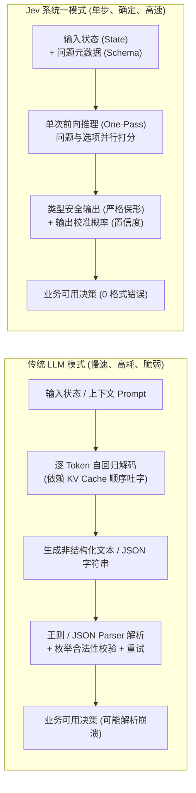
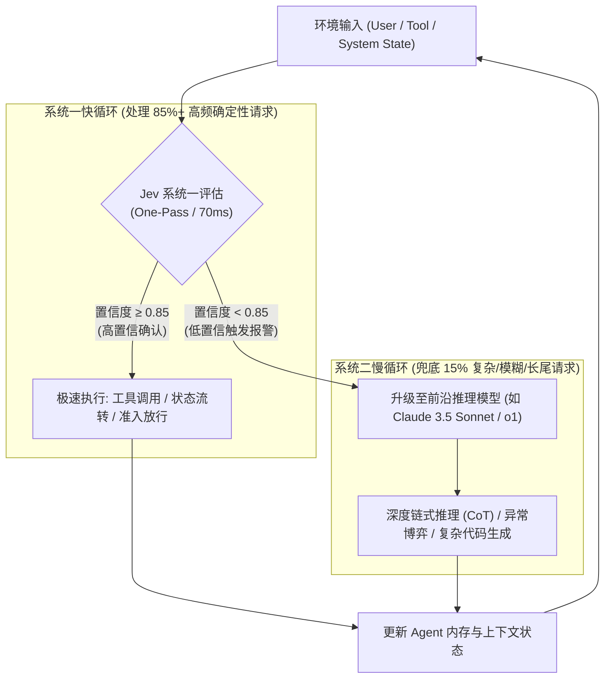
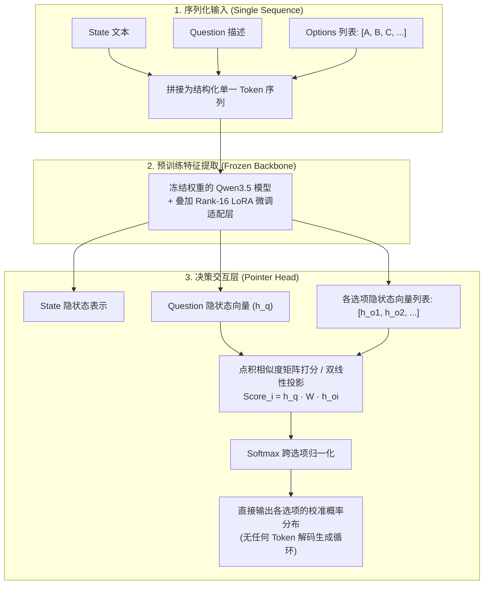

---  
title: "Jev 深度解析：TypeSafe AI 那个「不做聊天、只做判断」的系统一模型"  
date: "2026-10-03T10:30:00+08:00"  
draft: false  
tags: ["AI", "TypeSafe", "Jev", "System One", "决策模型", "RLCD", "Agent", "Kev", "Laya", "开源"]  
categories: ["large_models"]  
description: "TypeSafe AI 发布的 Jev 是一个不生成文本、只返回带校准概率的类型化决策的「系统一」（System One）模型。本文深度剖析其走红动因、核心实现原理、Python SDK 实战、架构落地的置信度级联模式、能力边界与局限、开源竞品（Kev/Laya）架构逆向、业界评价及选型决策指南。"  
wordCount: 8850  
readingTime: 23  
ShowToc: true
TocOpen: true
ai_cover: "/images/generated-covers/jev_typesafe_system_one.jpg"
cover:
  image: "/images/generated-covers/jev_typesafe_system_one.jpg"
  alt: "Jev 深度解析：TypeSafe AI 系统一决策模型"
  caption: "快决策与深推理：系统一与系统二的 AI 认知架构分工"
  ai_generated: true
---

## 目录

- [术语澄清：三分钟读懂核心概念](#术语澄清三分钟读懂核心概念)
- [一、走红的背景与动因](#一走红的背景与动因)
- [二、核心实现原理与实战范式](#二核心实现原理与实战范式)
- [三、主要功能与架构落地模式](#三主要功能与架构落地模式)
- [四、现存局限与争议](#四现存局限与争议)
- [五、典型应用场景与落地案例](#五典型应用场景与落地案例)
- [六、开源竞品对比与架构解密](#六开源竞品对比与架构解密)
- [七、业界专家评价](#七业界专家评价)
- [八、未来发展趋势](#八未来发展趋势)
- [九、架构师选型决策卡（Cheat Sheet）](#九架构师选型决策卡cheat-sheet)
- [结语](#结语)
- [参考资料](#参考资料)

---

## 术语澄清：三分钟读懂核心概念

在深入 Jev 之前，有几个在本文及现代智能体（Agent）架构中反复出现的关键概念需要提前厘清：

1. **系统一（System 1）与系统二（System 2）**：概念源自认知心理学家丹尼尔·卡尼曼（Daniel Kahneman）的名著《思考，快与慢》。
   * **系统一**：无意识、直觉、极速、低能耗的模式匹配；
   * **系统二**：深思熟虑、逻辑、慢速、高能耗的链式推理。  
   在 AI 架构中，**系统一**对应低延迟、确定性输出的专用决策分类模型（如 Jev、Kev）；**系统二**则对应具备长思维链（CoT）、复杂推理能力但高延迟、高成本的前沿通用大模型（如 OpenAI o1 系列、Claude 3.5 Sonnet、GPT-4o）。
2. **类型安全（Type Safety）**：并非狭义指编译器的静态类型检查，而是指模型输出被严格约束在预先定义的 Schema / 枚举边界内。模型在计算图输出层即被硬性限制，在数学机制上杜绝了格式畸变或超出枚举范围的「格式幻觉」。*特别注意：类型安全保证的是「答案的合法形状」，不等于「判断结论的绝对正确」。*
3. **校准概率（Calibrated Probability）**：衡量模型预测置信度的统计可信度。如果一个模型在预测某事件置信度为 0.8 的所有样本中，实际最终有且仅有 80% 的样本为真，则称该概率经过良好校准。通用大模型在经历 RLHF 后往往极度自负（过度自信），而校准概率能直接作为下游业务代码条件分支（if-else）的可靠决策阈值。
4. **单次前向（One-Pass Forward）与非自回归（Non-Autoregressive）**：区别于传统 LLM 依赖上一个生成的 token 作为输入逐字吐出的自回归解码，非自回归模型在单次神经网络前向推理中即可并行计算出所有目标节点的概率分布，计算耗时几乎不随输出字段增加而线性膨胀。
5. **RLCD（Reinforcement Learning for Calibrated Decisions）**：面向校准决策的强化学习。TypeSafe 自研的训练框架，核心是通过真实计分惩罚（如 Brier Score）对齐模型的预测概率与客观真实发生率，而非单纯优化人类的主观喜好度。

---

## 一、走红的背景与动因

### 1.1 一个"不聪明"的卖点

Jev 最反常的地方在于，它的卖点恰恰是"不聪明"。它不写句子、不解释内容、不生成图片，也不做长链条推理。你给它一段状态（state，可以是文本或 JSON）和一组带固定选项的问题，它在一次调用中返回所有问题的**类型化答案（typed answers）**以及每个答案的**校准概率（calibrated probability）**。

TypeSafe AI 把这类模型称为 **System One Model（系统一模型）**。Jev 是这一模型类别的首个公开商业化实例。

### 1.2 公司背景：从 OpenAI 走出来的创始人

| 项目 | 事实 | 来源 |
| :--- | :--- | :--- |
| **公司** | TypeSafe AI，旧金山初创团队，成立于 2024 年 | AI Wiki，2026-09 |
| **创始人** | Diogo Almeida（前 OpenAI 研究员），联合创始人 Erik Gafni、Sasha Sheng | AI Wiki，2026-09 |
| **技术履历** | Almeida 是 2022 年 InstructGPT 核心论文《Training language models to follow instructions with human feedback》的第四作者；此前曾任职于 Google Brain | 官方团队页；InstructGPT 论文 |
| **融资动向** | 2026-09-15 宣布结束隐身状态，完成 4000 万美元种子轮，DCVC 领投，DCVC 普通合伙人 James Hardiman 参与 | Business Wire，2026-09-15 |

需要指出的是，"ChatGPT 共同发明人""RLHF 共同发明人"是公司与 Almeida 本人的对外表述。可独立核实的事实是他位列 InstructGPT 论文作者序列，而 RLHF 技术探索早在该论文前便已存在。在评估其学术积淀时，保持客观审慎是必要的。

### 1.3 核心洞察：AI 到底是给谁用的？

Almeida 对研发 Jev 的原始动机有一个非常清晰的阐述。他回忆自己在 OpenAI 期间不断思考的一个第一性原理问题：如果一场基于 AI 的经济范式变革真正爆发，那么在全网所有调用 AI 的流量请求中，到底有多少是供人类消费的，又有多少实际上是供计算机程序消费的？

他的判断是：**绝大多数调用都是给机器消费的（AI-to-Software），而现代大语言模型（LLM）最初是为与人对话交流（AI-to-Human）而设计的，根本不适配程序化、自动化、高吞吐的控制回路。**

> "ChatGPT 比我聪明得多。但奇怪的是，那些具有巨大经济激励、最值得自动化的工作，现在却没有被自动化，因为目前 AI 在这些环节表现很差。" —— Diogo Almeida

这构成了 Jev 的核心产品哲学：**代码掌控确定性流程，AI 只处理那些狭窄、离散的结构化判断**。TypeSafe 在官方博客中将这套工程哲学概括为"造产品，不造神"（Build products, not gods）。

### 1.4 走红时间线与市场反响

| 时间 | 关键事件 | 权威出处 |
| :--- | :--- | :--- |
| **2026-09-15** | TypeSafe AI 结束隐身状态，正式发布 Jev 与 System One 模型概念，公布 4000 万美元种子轮 | 官方发布帖；Business Wire |
| **2026-09-16** | The Register 专题报道；Hacker News 讨论帖冲上 1901 分、产生约 500 条热烈技术讨论 | The Register；Hacker News |
| **2026-09-18** | TechCrunch 报道：全球开发者并发调用过大导致 API 一度熔断无法对外响应 | TechCrunch |
| **2026-09-20** | 全面清除 waitlist，向全球开发者公开开放，每人赠送 5 美元测试额度 | VentureBeat；AI Wiki |
| **2026-09-24~25** | The Information 与 Financial Times 先后披露：TypeSafe AI 正洽谈巨额新融资，部分投资方估值报价超 100 亿美元 | The Information；Financial Times |

市场反响展现出极其旺盛的开发者饥渴度：
* 产品介绍视频在 X 平台上线首周斩获 **4000 万次播放**；
* AI 开发平台 **Vercel** 官方表示，Jev 上线后 24 小时内，付费开发者账户产生的试用与绑定意愿超过了此前任何模型（包括 OpenAI 与 Anthropic 的旗舰模型）；
* 模型聚合路由平台 **OpenRouter** 指出，上线首个周末发往 Jev 的 token 吞吐量暴涨超 **3 倍**；
* 在开放注册后的 36 小时内，官方清出了多达 **14 万人的排队名单**。

---

## 二、核心实现原理与实战范式

### 2.1 从"生成文本再解析"到"直接返回类型化决策"

传统通用 LLM 的推理本质是**自回归（Autoregressive）**的：必须一个 token 接一个 token 顺序预测。即使最终应用只需要一个布尔值或枚举状态，模型也必须先吐出一串字符（例如 `{"action": "refund"}`），下游代码必须引入三套脆弱的防御组件：JSON parser 解析器、枚举合法性校验器、解析失败重试循环。

TypeSafe 将这一工程顽疾定义为**「解析脆弱性」（Parser Fragility）**：**大模型应用中链路最脆弱的一环，永远是将模型生成的自然语言文本反序列化为程序安全变量的过程**。

Jev 彻底重构了这条链路。它并不维护"已生成文本的自回归缓存"，而是把输入的环境上下文状态（State）与预设的问题候选集直接映射到离散动作空间中。

> **核心哲学**：LLM 在答案空间开放时负责生成新语言；Jev 在答案空间有界时负责评估已知路径。

两条技术路径的机制差异如下图所示：



#### 深度辨析：Jev 与现有结构化输出方案的本质区别

许多资深开发者的第一反应是：*“我们已经有了 OpenAI Structured Outputs（json_schema）、Outlines、Instructor 和 BAML，它们也能保证输出 100% 符合 JSON 格式，为什么还需要 Jev？”*

这正是理解 Jev 架构价值的胜负手。它们解决的是完全不同层级的问题：

| 对比维度 | 语法引导生成 (OpenAI json_schema / Outlines) | Pydantic 框架校验 (Instructor / BAML) | Jev / Kev (系统一专用模型) |
| :--- | :--- | :--- | :--- |
| **底层计算机制** | **自回归生成** + 语法掩码（Logit Masking 强制合法 token） | **自回归生成** + 客户端 Pydantic 校验与失败重试 | **非自回归单次前向（One-Pass Forward）**，直接打分 |
| **端到端延迟** | **500 ms ~ 3000 ms**（耗时与生成字符数严格正比） | **800 ms ~ 5000 ms**（遇重试翻倍） | **30 ms ~ 200 ms**（几乎为常数，增加问题仅微量增长） |
| **KV Cache 开销** | 必须逐 token 维护并更新自回归上下文缓存 | 必须逐 token 维护并更新上下文缓存 | **无生成期 KV Cache 膨胀**，前向传播完成即释放 |
| **计费与成本** | 输入 + 输出 Token 双向高单价计费 | 输入 + 输出 Token 双向高单价计费 | **输入超低价（$0.042/M），输出 Token 免费** |
| **选项顺序偏见 (Position Bias)** | **显著**（自回归模型天生对先出现的选项有概率倾斜） | **显著**（同左） | **极低 / 无**（并行 Pointer 打分，不依赖顺序上下文） |
| **长链条推理能力** | 强（支持模型在输出前写思维链思考） | 强（支持推理后再提取结构） | **无**（完全不支持多跳复杂推演） |

一言以蔽之：**受限解码（Constrained Decoding）只是给自回归的大象戴上了脚镣，让它跳舞时不出圈；而 Jev 是一只专为跑道设计的猎豹，根本不背自回归的重负。**

### 2.2 三个决策原语（Primitives）与 Python 实战

Jev 抛弃了传统的 Prompt 拼凑，将一切问题归约到三种基础决策原语：

| 原语 | 语义作用 | 适用边界 | 返回结构 |
| :--- | :--- | :--- | :--- |
| **Choice** | 离散多分类 | 从预定义的最多 **255 个**选项中选出最佳项 | 选中项值、每个选项的概率分布、综合置信度 |
| **Score** | 有序等级打分 | 将状态映射到离散有序标尺（2 至 10 级） | 得分等级、各等级分布概率、综合置信度 |
| **Noul** | 布尔命题判定 | 评估一个 Yes/No 命题是否为真（二元切分） | 判定布尔值、真值概率（0.0 ~ 1.0） |

#### Python SDK 调用实战范式

以下演示如何在一次原子请求中，对一份客服对话上下文并行执行三种原语评估：

```python
import typesafe

# 初始化客户端
client = typesafe.Client(api_key="ts_live_xxxxxxxxxxxx")

# 1. 准备上下文状态 (State：可以是文本、Markdown 或 JSON 序列化字符串)
support_state = """
用户 ID: usr_98231 (企业高价值客户，近30天消费 $12,400)
交互记录:
- 客户: "我们生产线今天下午因为你们的 API 突然超时中断了 40 分钟！损失谁来赔偿？"
- 客服机器人: "非常抱歉给您带来困扰，请问有具体的 Request ID 吗？"
- 客户: "别跟我废话要 ID，你们系统状态页明明写着 Major Outage！我现在要求技术总监立刻电话联系我，否则法务见！"
"""

# 2. 单次前向并行组装多个决策问题
response = client.system_one.evaluate(
    state=support_state,
    questions=[
        # 原语 1: Choice (工单紧急分流路由)
        typesafe.Choice(
            name="ticket_routing",
            question="该突发客诉工单应立即分流至哪个专项团队？",
            options=["一线常规支持", "大客户成功经理(TAM)", "P0核心故障应急小组", "法务合规部门"]
        ),
        # 原语 2: Noul (是否存在严重流失/索赔法律风险)
        typesafe.Noul(
            name="has_legal_or_churn_threat",
            question="客户的发言内容中是否包含明确的解约、流失威胁或法务追责意向？"
        ),
        # 原语 3: Score (情绪愤怒烈度评分，1 到 5 级)
        typesafe.Score(
            name="anger_intensity",
            question="评估客户当前沟通状态中的愤怒与挫败感等级",
            scale=5
        )
    ]
)

# 3. 消费具有确定类型与校准概率的输出
print("【分流决策】:", response.ticket_routing.value)
print("【分流置信度】:", response.ticket_routing.confidence)
print("【全部分流选项概率分布】:", response.ticket_routing.distribution)

print("【高危威胁判定】:", response.has_legal_or_churn_threat.value)
print("【威胁发生概率】:", response.has_legal_or_churn_threat.probability)

print("【愤怒评级】:", response.anger_intensity.value)
```

#### API 返回的真实数据结构（JSON Schema）

```json
{
  "id": "s1_eval_9a87df8bc",
  "model": "jev-2026-09",
  "latency_ms": 78,
  "usage": {
    "input_tokens": 142,
    "output_tokens": 0
  },
  "results": {
    "ticket_routing": {
      "type": "choice",
      "value": "P0核心故障应急小组",
      "confidence": 0.9412,
      "distribution": {
        "一线常规支持": 0.0012,
        "大客户成功经理(TAM)": 0.0521,
        "P0核心故障应急小组": 0.9412,
        "法务合规部门": 0.0055
      }
    },
    "has_legal_or_churn_threat": {
      "type": "noul",
      "value": true,
      "probability": 0.9886
    },
    "anger_intensity": {
      "type": "score",
      "value": 5,
      "confidence": 0.9105,
      "distribution": {
        "1": 0.0001,
        "2": 0.0011,
        "3": 0.0120,
        "4": 0.0763,
        "5": 0.9105
      }
    }
  }
}
```

注意返回报文中的 `output_tokens: 0` 和 `latency_ms: 78`。整个推理没有生成任何自回归 token，78 毫秒内完成了原本需要编写几十行提示词和正则校验才能搞定的任务。

### 2.3 并行采样器与类型安全的数学保证

| 机制 | 工作原理 | 架构收益 |
| :--- | :--- | :--- |
| **并行采样器（Parallel Sampler）** | 采用非自回归架构，单个 Forward Pass 即可产出全部评估。每个问题计算通道物理隔离，避免决策串扰 | 并发追加 5~10 个问题，端到端延迟几乎不变 |
| **预定义输出拓扑** | 允许的输出完全由请求所携带的 Schema 决定，模型直接对选项对应向量做 Softmax | 在概率数学上**绝对不可能**吐出选项之外的乱码 |
| **零结构幻觉** | 结构保证来源于分类头的数学投影，而非模型的“道德自律” | 消除所有针对 JSON 解析异常的重试防御代码 |

> **关键提醒**：类型安全保证的是**「答案的形状」**，而不是**「答案的正确性」**。Jev 绝不会返回一个不在你选项列表里的乱码，但它完全可能在你的四个选项里挑错那个符合事实的选项。输出结构的零幻觉与业务逻辑的准确率必须严格区分。

### 2.4 训练方法：RLCD 与概率校准机制

为什么通用大模型生成的概率值不可靠？
在传统生成式大模型的训练中，经过指令微调（SFT）和基于人类反馈的强化学习（RLHF/DPO）后，模型会发生**概率分布塌缩（Mode Collapse）**。模型被强行训练去迎合人类偏好的特定文风，其 Softmax 算出的 token logprobs 会极其扁平或极度极端——即使模型在瞎猜，也往往给出 0.99 的超高置信度。

Jev 引入了自研的 **RLCD（Reinforcement Learning for Calibrated Decisions，面向校准决策的强化学习）**：
1. **严格真值计分惩罚（Proper Scoring Rules）**：RLCD 在强化学习目标函数中显式引入了 **Brier 分数（Brier Score）** 或 **期望校准误差惩罚（ECE Penalty）**。对模型“以 0.99 的极高置信度犯错”施加数倍于“以 0.51 的不确定置信度犯错”的巨大惩罚。
2. **认知诚实（Epistemic Honesty）**：模型被训练得宁可降低置信度，也不盲目自信。高置信度（>0.9）的输出在统计学上能够真实对应 >90% 的命中精度。

**关于《The Bitter Lesson》的激进修正。**  
图灵奖得主 Rich Sutton 的名篇《The Bitter Lesson》（苦涩的教训）指出：长期来看，利用海量算力的通用学习方法终将碾压人类精心设计的精巧算法。TypeSafe 在其技术随笔《The Bitterest Lesson》中提出了一条逆向重排：

$$\text{任务定义 (Task Alignment)} > \text{数据质量 (Data)} > \text{算力规模 (Compute)} > \text{算法微调 (Algorithm)}$$

他们指出，InstructGPT 之所以震撼世界，不是因为算法有多颠覆，而是找到了“指令对齐”这个真正对的任务；同样，让算力去服务于狭窄、清晰、离散的系统一决策任务，一个几百兆参数的轻量模型在吞吐和准确率上也能轻松击败千亿参数的自回归大模型。

---

## 三、主要功能与架构落地模式

### 3.1 官方自测数据与边界分析

以下数据整理自 TypeSafe 官方发布材料，**所有数据均为公司自测 baseline**：

| 评估维度 | Jev 系统一模型 | 前沿大模型基准 (GPT-5/Claude 3.5 级别) | 提升倍率 |
| :--- | :--- | :--- | :--- |
| **端到端响应耗时** | **70 ms ~ 500 ms** | 3 s ~ 329 s (受推理链长度影响) | **快 40x ~ 200x** |
| **典型 Agent 步耗时** | **0.114 s** | 8.566 s (自回归生成) | **快 193.6x** |
| **单任务决策成本** | **$0.000081** | $0.013880 | **便宜 444.6x** |
| **四类典型工作流准确率** | **67.8%** ($0.0004/任务) | GPT-5.6 Terra: 67.9% ($0.0304)<br/>Claude Sonnet 5: 67.8% ($0.1174) | 准确率打平，成本下降超 98% |
| **输入 Token 计费** | **$0.042 / 百万** | $0.20 ~ $10.00 / 百万 | 降低 80% ~ 99% |
| **输出 Token 计费** | **$0 (完全免费)** | 约为输入价的 3 ~ 5 倍 | 消除输出计费环节 |
| **结构化输出可靠性** | **100% 格式合法 (数学保证)** | 存在结构损坏与解析崩溃概率 | 质的飞跃 |

> **客观免责提示**：TypeSafe 在技术发布帖中非常坦诚地承认，193.6 倍的加速与 444.6 倍的降本是特定基准测试下的**理论上限峰值**，绝非所有通用场景下的常态表现；部分对照组数据取自第三方聚合平台 OpenRouter 的流量抽样；评测主要在他们位于美国西海岸的开发机上完成。这些前提是开发者在评估上述指标时必须扣除的营销浮水。

### 3.2 置信度级联（Confidence-Based Cascade）：构建双循环 Agent

Jev 在生产中最顶级的架构应用，绝非单独拿它替换大模型，而是**作为前沿推理大模型的前置路由器与看门人——构建「双循环认知架构」**。

* **快循环（Fast Loop / 系统一）**：85%~90% 的无歧义日常状态流转，由 Jev 在数十毫秒内直接决策并执行，单次成本低至百万分之八美元；
* **慢循环（Slow Loop / 系统二）**：当且仅当 Jev 输出的校准置信度跌破安全阈值（例如 `< 0.85`），表明当前上下文存在罕见边界或复杂逻辑歧义，代码立刻拦截并将完整上下文打晕回退（Fallback）给 Claude 3.5 或 GPT-4o 启动深度推理。



#### 生产级置信度级联 Python 核心实现

```python
from typing import Any, Dict
import typesafe
from openai import OpenAI

jev_client = typesafe.Client()
llm_client = OpenAI()

def execute_agent_step_with_cascade(state: str, confidence_gate: float = 0.85) -> Dict[str, Any]:
    """
    基于置信度级联的 Agent 决策路由:
    - 快速分支: Jev 系统一判定 (极低时延与成本)
    - 慢速兜底: 通用 LLM 系统二推理 (高算力保障长尾边界)
    """
    # 步骤 1: 优先走 Jev 极速评估 (耗时 ~70ms, 成本 ~$0.00008)
    fast_eval = jev_client.system_one.evaluate(
        state=state,
        questions=[
            typesafe.Choice(
                name="next_action",
                question="智能体当前循环应执行的下一步动作是什么？",
                options=["CALL_DATABASE", "QUERY_SEARCH", "ASK_HUMAN", "TERMINATE"]
            )
        ]
    )
    decision = fast_eval.next_action

    # 步骤 2: 置信度门控判定
    if decision.confidence >= confidence_gate:
        return {
            "tier": "System-1 (Jev Fast Path)",
            "action": decision.value,
            "confidence": decision.confidence,
            "cost_est": 0.00008,
            "latency_ms": fast_eval.latency_ms
        }

    # 步骤 3: 低置信度触发系统二升级 (耗时 ~2500ms, 成本 ~$0.015)
    print(f"⚠️ 置信度不足 ({decision.confidence:.3f} < {confidence_gate})，升级至前沿模型推理...")
    
    prompt = f"""
    你是一个负责高阶仲裁的智能体中枢。当前环境状态面临歧义，请深思熟虑后决策下一步动作。
    候选动作列表: ["CALL_DATABASE", "QUERY_SEARCH", "ASK_HUMAN", "TERMINATE"]
    
    环境状态:
    {state}
    
    请在 <thinking> 标签内阐述你的推理链，并在最后返回合法的 JSON: {{"action": "..."}}
    """
    slow_resp = llm_client.chat.completions.create(
        model="gpt-4o",
        messages=[{"role": "user", "content": prompt}],
        response_format={"type": "json_object"}
    )
    
    return {
        "tier": "System-2 (LLM Escalated Path)",
        "action": slow_resp.choices[0].message.content,
        "confidence": "CoT-Validated",
        "cost_est": 0.015,
        "latency_ms": 2400
    }
```

评测数据显示，这种设计可以在**节省约 57% 算力账单**的前提下，保留前沿模型 **99% 的端到端准确率**。

### 3.3 生态接入现状

* **SDK 矩阵**：官方提供原生 Python 与 TypeScript SDK；
* **标准 API**：公开符合 RESTful 标准的 `/v1/systemone` 端点；
* **网关与基础设施**：OpenRouter 已完成聚合上架，Vercel AI Gateway 提供一键托管路由，Cloudflare Workers AI 实验性支持边缘集成；
* **编排框架**：已被封装为 LangGraph 的独立条件分流节点、Pydantic AI 校验器与 LlamaIndex 的路由选择算子；
* **极端性能演示**：官方发布了通过 Jev 玩经典第一人称射击游戏《DOOM》的演示 Demo，以每秒 10 次的并发决策频率驱动游戏内操作，每小时 API 消耗仅约 7 美元。

---

## 四、现存局限与争议

技术狂欢背后，必须清醒审视 Jev 的能力死穴与硬伤。

### 4.1 能力边界的硬性约束

* **绝不能做基础算术**：加减乘除必须由外围宿主代码完成，模型在数学符号推导上几乎不具备泛化可靠性；
* **绝不能做时间/日期运算**：无法处理诸如“比较两个 ISO-8601 时间戳是否间隔超过 7 天”这类具备日精确度的逻辑运算；
* **绝不能做多跳级联推理（Multi-hop Reasoning）**：一次前向中并行的多个问题必须是相互正交独立的。如果问题 B 的判定依赖问题 A 的推演结论，必须拆解为多次请求在宿主代码中串行组织；
* **完全剥离内容生成能力**：不具备撰写长文、润色摘要、编写代码或多轮对话的情感共情能力；
* **输入质量强敏感**：遵循经典的“垃圾进，垃圾出”（Garbage in, garbage out）定律，它保证输出的结构类型正确，但输入状态文本如果存在严重矛盾，其判定结果会迅速失真。

### 4.2 独立校准审计：戳破“普适校准”的营销泡沫

Jev 宣扬的核心卖点是“校准概率”，但独立机构的复测迅速揭露了其任务泛化局限：

1. **Jevals 公开基准测试**：在 Banking77（77 意图细分类）、HelpSteer2（5 级偏好评分）、PubMedQA（医学 Yes/No 判定）三个公开权威测试集上进行 31,500 次对比推演。结果表明：在 PubMedQA 上，Jev 与轻量通用模型（如 Gemini 3.8 Flash）在统计学上没有显著差异；在金融细分类任务 Banking77 上，通用模型凭借海量预训练先验反而领先；而在多级复杂评分 HelpSteer2 上，没有任何模型能明显优于随机标签先验。
2. **缺失决定性规则的校准崩溃**：第三方安全团队进行了一项压力测试——在 900 条合成工单中，**故意抽离公司的故障升级标准文档**，让模型在规则缺失的前提下评估工单紧急度。结果极其触目惊心：Jev 的准确率跌至 44.7%，而**期望校准误差（ECE）飙升至 0.325**，此时模型给出的平均自报置信度仍高达 0.74。  
   *这意味着：当面临训练分布外的隐式未定义规则时，Jev 同样会表现出严重自负的虚假确定性。校准不是模型的普适物理属性，而强依赖于任务与数据分布的对齐程度。*

### 4.3 官方评测的自证陷阱

虽然官方坦诚公布了评测局限，但作为技术评估者必须牢记：官方宣称的 444 倍成本优势与 193 倍速度优势，对照的是体积最大、最耗算力的未量化前沿巨无霸模型。如果与经过蒸馏或量化的本地 8B/14B 小模型（如 Qwen2.5-7B、Llama-3.1-8B）相比，其速度和成本优势将大幅收窄至 3~8 倍区间。

### 4.4 “这不就是一个零样本分类器（Zero-Shot Classifier）吗？”

AI 评测平台 Arena 联合创始人兼 CEO Anastasios Angelopoulos 在接受访谈时直言：

> “我不清楚这些模型与传统的‘零样本分类器’到底有什么本质区别，而后者实际上在 Meta、Google 和 Hugging Face 已经是一项极其成熟的技术栈了。”

这一质疑可谓击中要害。早期自然语言处理（NLP）领域的 MNLI 蕴含任务、BART-large-MNLI 等跨模态投影，早已能实现类似的功能。TypeSafe 真正的壁垒并非发明了某种崭新的神经网络数学拓扑，而是在工程体验上将零样本分类封装成了开发体验极佳、延迟极低、带原生概率校准的现代化开发者产品。

### 4.5 数据闭源与护城河之争

TypeSafe 迄今对底层预训练模型选型保密，仅披露使用了合成数据管线与开源权重。然而在开源社区一周内逆向复现（如 Kev、Laya）之后，业界的共识正在收敛：**单凭一个 API 接口定义根本无法维持技术护城河，真正的决胜点在于各行业垂直任务的高质量合成数据飞轮与工程落地迭代效率。**

---

## 五、典型应用场景与落地案例

在现代智能体运行生命周期中，拖垮系统吞吐和可用性指标的，往往不是复杂的代码编写，而是穿插在工具调用和状态轮转之间的几百个琐碎微决策：

| 决策类型 | 现实痛点 | 适配原语 | 典型业务价值 |
| :--- | :--- | :--- | :--- |
| **工具选择路由** | 多工具 Agent 循环每一步都要选工具，通用大模型单步耗时 3 秒 | `Choice` | 压缩工具选择至 50ms 以内 |
| **安全输入护栏** | 拦截 Prompt 注入攻击、越狱命令、系统指令篡改 | `Noul` | 纯非自回归单步防御，杜绝攻击者越狱生成 |
| **检索相关性初筛** | RAG 检索返回 50 个 Chunk，重排模型（Reranker）吞吐有限 | `Noul` / `Score` | 极速过滤掉 80% 无效脏上下文 |
| **循环终止检查** | 判断当前复杂多步任务是否已经达成目标、能否安全退出 | `Noul` | 消除 Agent 死循环导致的费用账单爆炸 |
| **对话压缩修剪** | 上下文超长时，决定保留哪些轮次、修剪哪些废话 | `Score` | 代替耗时昂贵的长文本摘要提取 |

### 生产级开源项目全景图

根据开源社区与相关代码库跟踪，目前已有数个标杆项目将 Jev 嵌入核心链路：

```
真实落地矩阵：从金融微交易到操作系统操控
├── 毫秒级交易: jev-trader (Monad / 300ms 订单簿高频下单)
├── 浏览器操控: jev-ultrafast (browser-use / 2.1万 Star / 点击元素决策)
├── 基础设施: fast-jev-compaction (Claude Code 历史会话打分修剪)
├── 路由仲裁: jev-codex-router (动态决定下游调用哪个模型与思考深度)
├── 智能体记忆: Jev-Mem 论文项目 (记忆分流构建时间缩短 6.6 倍)
└── 端侧代理: typesafe-computer-use (macOS 自动化控制回路单步 $0.0002)
```

以知名的智能体浏览器自动化项目 **`browser-use / jev-ultrafast`** 为例：传统实现需要把整个 DOM 树和屏幕截图喂给多模态大模型，询问“下一步该点击屏幕上的哪个坐标或按钮”，单步响应在 3~5 秒以上；改用专用决策模型作为动作决策头后，单个交互动作决策耗时被压缩到 **17~23 ms**，端到端执行流畅度产生质的跃迁。

---

## 六、开源竞品对比与架构解密

在 Jev 发布后短短两周内，开源社区便通过网络通信逆向分析与参数高效微调，推出了数个高质量的开源替代方案：

| 对比维度 | Jev (官方托管版) | Kev (社区最热复刻) | Laya (极简端侧实现) |
| :--- | :--- | :--- | :--- |
| **主导作者** | TypeSafe AI (商业公司) | Jared Palmer (知名开发者) | NandhaKishorM |
| **开源许可证** | 闭源商业服务 (按 Token 计费) | **Apache-2.0** | **Apache-2.0** |
| **底层底座架构** | 未公开 (推测为 8B 级混合架构) | **Qwen3.5** (兼有 Qwen2.5-0.5B 版本) | **421M 双向编码器 (Encoder)** |
| **网络层级设计** | 未公开 (官方声称单次前向) | **Rank-16 LoRA + Pointer Head (冻结底座)** | **非自回归双向编码器** |
| **参数规模梯度** | 未公开 | 0.5B / 0.8B / 4B / 9B / 27B 全量覆盖 | 421M 极轻量 |
| **端到端前向耗时** | 70 ms ~ 200 ms | 本地 GPU 约 40 ms ~ 90 ms | **约 33 ms** (TileLang 加速下 17ms) |
| **协议兼容度** | 官方专属接口规范 | **字段级 1:1 完全兼容** (改 base_url 直连) | 提供兼容 HTTP 服务与 MCP server |
| **新闻域验证集 (News dev)** | **0.857** | Kev-27B: **0.848** ｜ Kev-9B: **0.822** | 零样本接近随机，强依赖下游微调 |
| **MMLU 4 选 1** | **0.90** | Kev-27B: **0.84** ｜ Kev-9B: **0.74** | — |

### 开源项目 Kev 的核心架构解密

Jared Palmer 开源的 **Kev** 最具工程参考价值。它向全世界展示了如何用最优雅的工程手段在一台普通笔记本上复刻出类似 Jev 的行为特性：



Kev 的巧妙之处在于：
1. **底座完全冻结**：保持通用底座（如 Qwen3.5）权重不动，只训练极轻量的 Rank-16 LoRA 与顶层的双线性 Pointer Head，使得其 0.5B 版本的权重补丁仅有 **38 MB**，在一台普通的 Apple M5 笔记本上仅需 1 小时 45 分钟即可训练收敛；
2. **问题隔离与掩码控制**：在注意力矩阵上施加双向与块因果掩码，保证同批次评估的不同问题之间在注意力层完全看不见彼此，彻底根绝信息泄漏与选项顺序带来的偏差。

---

## 七、业界专家评价

| 专家姓名 | 现任职位 / 行业身份 | 核心观点与敏锐洞察 |
| :--- | :--- | :--- |
| **Andrej Karpathy** | OpenAI 联合创始人，近期加入 Anthropic | Jev 精准切中了工业界长期被忽视的底层盲区：前沿巨头们都在痴狂地追逐“终极通用智能”，但在**简单、极速、低廉的决策基础设施**上投入严重不足。 |
| **Armin Ronacher** | Flask 框架作者，Earendil CTO | 整个行业早该出现此类架构。此前由于前沿大模型有巨额风投资金补贴、API 价格极其便宜，开发者懒于精细化分层；一旦 Jev 验证了效率优势，追随者将迅速填满市场。 |
| **Anastasios Angelopoulos** | 模型评测权威平台 Arena 联合创始人兼 CEO | 质疑 Jev 的新颖性，认为其在统计学本质上依然是经典的零样本分类器（Zero-shot Classifier），呼吁开发者理性看待包装出来的全新词汇。 |
| **James Hardiman** | DCVC 普通合伙人（种子轮领投方） | 盛赞 Jev 从经济学上重构了商业模型。声称由于计算成本骤降数千倍，初创团队**在极短时间内已实现经营盈利**（该财务数据暂无法从第三方独立财务渠道交叉核验）。 |
| **Diogo Almeida** | TypeSafe AI 创始人兼 CEO | 坚定重申工程原则：“前沿实验室当前贩卖的主要商品是恐惧与炒作，我们无意在数据中心里造神，我们只造能被计算机高效消费的代码工具。” |

---

## 八、未来发展趋势

### 8.1 决策层成为智能体操作系统的“中断控制器”

回顾计算机体系结构的发展史：早期 CPU 需要用轮询（Polling）去不断检查 I/O 设备，后来演进出了专用中断控制器（PIC）来卸载低效判定。  
当前的 Agent 架构正处于相似的拐点：每一次工具调用后都要呼叫千亿参数的自回归大模型去问“下一步做什么”，这无异于用核动力航母送外卖。**把高频琐碎的状态判断下沉到专门的系统一微模型，让大模型只做核心规划，将成为标准设计范式。**

### 8.2 接口标准化与模型商品化

由于 Kev 和 Laya 等开源竞品在发布数天内便完成了与 `/v1/systemone` 端点的 100% 协议对齐，这标志着**决策 API 规范正在快速成为事实上的工业标准**。对于金融合规、自动驾驶与国防安全等数据严禁出境的私有化场景，开发者会直接采用本地部署的 Kev/Laya 镜像，模型本身的算法壁垒将加速被商品化瓦解。

### 8.3 商业变现与估值泡沫的双重考验

高达百亿美元的估值传闻，本质上是资本在为“全网 API 流量从昂贵自回归大模型大面积迁移至廉价决策层”这一宏大叙事下注。然而，随着 Vercel 免费试用期的结束，真实的开发者留存率、API 续费率以及大模型巨头（OpenAI、Anthropic）是否会直接在其网关层免费集成类似功能，将成为 TypeSafe 面临的生死考验。

---

## 九、架构师选型决策卡（Cheat Sheet）

在规划你的下一个 AI 系统或 Agent 架构时，如何权衡选型？请参考以下决策矩阵：

```
                      你面临的业务任务是什么？
                                 │
         ┌───────────────────────┴───────────────────────┐
         ▼                                               ▼
需要输出连贯文本/代码/解释？                      只输出离散标签/布尔值/固定等级？
         │                                               │
         ▼                                               ▼
  【选用通用生成式 LLM】                       状态选项是否在事前可枚举且空间有界？
 (如 Claude 3.5 / GPT-4o)                                │
                                         ┌───────────────┴───────────────┐
                                         ▼                               ▼
                                   【否: 开放提取】                【是: 有界判定】
                                (选用 LLM + Pydantic)                     │
                                                                         ▼
                                                          判定逻辑是否涉及多步算术与日期计算？
                                                                         │
                                                         ┌───────────────┴───────────────┐
                                                         ▼                               ▼
                                                   【是: 复杂计算】                 【否: 纯模式匹配】
                                                (写硬编码代码或交给 LLM)                  │
                                                                                 ▼
                                                                     业务对时延与成本极度敏感？
                                                                     (例如并发 >100 QPS, 时延 <200ms)
                                                                                 │
                                                                 ┌───────────────┴───────────────┐
                                                                 ▼                               ▼
                                                           【是: 强敏感】                   【否: 弱敏感】
                                                     ★ 坚决上 Jev / Kev / Laya ★       (普通 LLM 语法约束即可)
                                                     (或采用置信度级联双循环架构)
```

---

## 结语

Jev 最值得尊敬的价值，绝非在于它具备多高的所谓“超级智能”，而在于它勇敢地戳破了一个皇帝的新衣：**当绝大多数 AI 调用是给冰冷的计算机程序而非人类消费时，我们为什么还要继续为昂贵的通用对话智能支付溢价？**

它给出的答案充满了工程克制：
* **只做判断，不做生成**；
* **只返回有界答案，不生成开放文本**；
* **只保证输出的类型形状，不吹嘘无所不能的绝对正确**。

这种克制恰恰是工业级软件最珍视的品质：把不确定的连续风险量化为离散的校准概率，把最终的裁决权与异常分支留给确定性的代码。

Jev 也许只是认知计算分层探索的一块探路石，它的商业寿命与估值或许仍有变数，但它所指明的大方向已不可逆转：**AI 基础设施正在告别单一庞大模型的全能神话，走向系统一与系统二分工协同的现代认知架构。**

---

## 参考资料

**一级信源（官方与开源核心仓库）**

- TypeSafe AI 官方发布文告《Introducing System One Models & Jev》，2026-09-15：[https://typesafe.ai/blog/introducing-system-one-models-and-jev](https://typesafe.ai/blog/introducing-system-one-models-and-jev)
- TypeSafe AI 官方开发者文档（Models / Primitives / Confidence API）：[https://docs.typesafe.ai](https://docs.typesafe.ai)
- TypeSafe AI 技术博客《关于最苦涩的教训》（The Bitterest Lesson），2026-09-10
- Business Wire 商业新闻稿《TypeSafe AI 结束隐身状态并完成 4000 万美元种子轮融资》，2026-09-15
- Kev 开源复刻项目仓库（Jared Palmer）：[https://github.com/jaredpalmer/kev](https://github.com/jaredpalmer/kev)
- Laya 轻量双向编码器仓库（NandhaKishorM）：[https://github.com/NandhaKishorM/laya](https://github.com/NandhaKishorM/laya)
- jev-cookbook 实践教程库（Datawhale 社区）：[https://github.com/datawhalechina/jev-cookbook](https://github.com/datawhalechina/jev-cookbook)
- awesome-jev 社区精选生态列表：[https://github.com/kraayenjon/awesome-jev](https://github.com/kraayenjon/awesome-jev)
- Jev-Mem 论文预印本：[arXiv:2609.23986](https://arxiv.org/abs/2609.23986) ｜ [GitHub 论文项目代码库](https://github.com/libingzheren/Jev-Mem)

**二级信源（国际权威媒体与深度评测）**

- The Register 深度科技报道，2026-09-16：[TypeSafe AI debuts model for machines that plays DOOM](https://www.theregister.com/ai-and-ml/2026/09/16/typesafe-ai-debuts-model-for-machines-that-plays-doom/5296711)
- TechCrunch 创投分析，2026-09-18：[A new kind of AI model from a ChatGPT inventor is thrilling developers](https://techcrunch.com/2026/09/18/a-new-kind-of-ai-model-from-a-chatgpt-inventor-is-thrilling-developers/)
- The Information 投融资独家，2026-09-24：[Jev fervor leads to talks of big valuation boost](https://www.theinformation.com/newsletters/dealmaker/jev-fervor-leads-talk-big-valuation-boost)
- Financial Times 商业深度，2026-09-25：[AI startup TypeSafe in funding talks with top Silicon Valley investors](https://www.ft.com/content/456884ea-2558-4648-8036-a77b73733430)
- Bloomberg 专访报道，2026-09-25：[Jev: An AI model that can't chat takes on bigger rivals](https://www.bloomberg.com/news/articles/2026-09-25/jev-an-ai-model-that-can-t-chat-takes-on-bigger-rivals)
- Ground Truth 独立技术审计：《Jev 校准审计与 ECE 期望校准误差压力评测》，2026-09