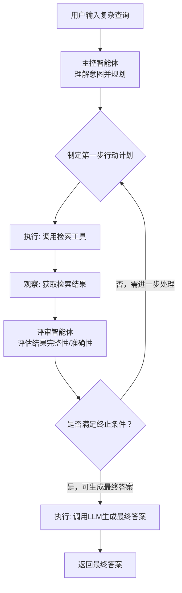

## Agentic RAG

**Agentic RAG** 模式是基础检索增强生成（RAG）模式的**高级演进**，它在传统的检索-生成流程中**嵌入了推理和决策层**（即智能体），从而将 RAG 从一个被动的数据管道转变为一个**主动的问题解决框架**。它显著提升了信息提取的**可靠性和深度**。

### Pattern Card

| Name | Agentic RAG (智能体检索增强生成) |
| :--- | :--- |

```yaml
One-liner: 智能体主动分解查询、迭代检索、验证与综合外部知识，确保生成答案的准确性与完整性
Problem-Solution Fit: 解决传统RAG检索到的知识块不完整、包含冲突或不相关、以及缺乏多步推理验证的问题
Key Value: 智能体作为主动的把关者和知识精炼者，通过多步推理和动态验证，大幅提升基于事实的输出可信度
Complexity: ⭐⭐⭐⭐☆
When to Use: 
  - 任务需要高准确性和多源知识综合的场景
  - 存在知识冲突或需要进行知识空缺检测的问题
  - 需要多步推理、复杂问题分解的场景
  - 医疗、法律、金融等高风险决策领域
When NOT to Use: 
  - 任务简单、实时性要求极高的场景（多步推理会增加延迟）
  - 仅需单次LLM推理和简单事实查询的场景
  - 成本极其敏感的环境
```

**比喻：Agentic RAG 模式**

如果将基础 RAG 模式比作一个**快速的图书馆管理员**，他根据你的关键词迅速递给你一叠相关的书籍片段；那么 **Agentic RAG** 模式就是一个**资深的研究总监**。他不仅接收这些片段，还会：

1. **（推理）** 审视这些片段，判断哪些是过时的或相互矛盾的。
2. **（行动）** 如果发现信息不全，主动去查阅新的来源（调用 Web 搜索）。
3. **（验证）** 确保最终报告（答案）中的每个结论都来自**最权威、最新的**资料。

这份报告不仅内容翔实，而且经过了严格的事实验证。

### I. 概述、背景与核心问题（Context & Problem）

**1. 核心概念与定义**

Agentic RAG（智能体 RAG）是 RAG 的进化版，引入了推理和决策层，**显著提升了信息提取的可靠性**。它不是简单地检索和增强，而是让智能体作为**关键把关者**和**知识精炼者**主动参与其中。

传统 RAG 系统通常采用线性的“检索-然后-生成”管道，对于简单、事实性问题表现良好。然而，当面对复杂、多步骤或需要深度推理的查询时，其局限性凸显：

* **​单步失败风险​：** 一次检索不成功或生成不准确，整个流程就会失败，缺乏纠正机制。
* **​无法处理模糊或动态目标​：** 对于需要多角度信息整合、比较、验证或需要根据初步结果进行后续探索的查询（例如，“比较 A 和 B 的最新研究进展，并指出未来趋势”），线性流程无能为力。
* **​被动性与缺乏规划​：** 传统 RAG 被动地响应用户查询，而无法主动规划解决问题的最佳路径，例如决定检索的顺序、广度与深度。
  
Agentic RAG 旨在通过引入智能体（Agent）的自主性、推理能力和工具使用能力来解决这些复杂性问题。

**2. 解决的问题**

虽然基础的 RAG 模式解决了 LLM **知识截止**和容易产生**事实幻觉**的问题，但它仍面临挑战：

* **信息碎片化和冲突**：答案所需信息可能分散在多个知识块中，或检索到相互矛盾的信息。
* **噪声干扰**：检索器可能获取无关知识块，将噪声引入 LLM 的推理。
* **知识空缺**：如果内部知识库信息不足，基础 RAG 无法动态调用外部工具。

Agentic RAG 通过**主动审查**检索结果、**识别知识空缺**，并使用**推理层**来精炼和综合信息，解决了这些可靠性问题。

### II. 核心思想、角色与机制（Core Concept & Workflow）

Agentic RAG 的核心机制在于智能体在传统 RAG 流程的检索和生成阶段，**插入了智能体主导的自主推理和动态决策的循环**。

**1. 智能查询重构与分解：**
智能体能够将复杂的查询**分解为多个子查询**，或在初始查询模糊不清时将其重写，以实现更精确的检索。

**2. 知识来源验证与反思：**
智能体对检索到的知识块进行**主动审查**，判断其**质量、相关性和完整性**。例如，智能体可以分析文档元数据，**识别并优先采用最新的或最权威的政策**，并丢弃过时或不相关的知识，确保答案的准确性。

**3. 知识冲突调和：**
当检索到多份有矛盾的数据时（例如不同的预算数字），Agentic RAG 智能体能够**识别矛盾**，并通过推理**优先采用最可靠的来源**（例如最终财务报告）。

**4. 迭代检索与工具调用：**
智能体可以执行**多跳问题**所需的**迭代检索**。此外，如果内部知识库无法找到所需信息，智能体可以**识别知识空缺**后，调用外部工具（如实时 Web 搜索 API）获取最新信息，突破静态数据库的限制。

#### ​核心机制与工作流​

其工作流通常遵循 **​ReAct（Reasoning-Acting）循环​**的变体：

1. **​推理（Reason）** ​​：主控智能体分析当前状态（用户问题、已有信息）并决定下一步行动（例如，“我需要先查找公司A的2023年财报”）。
2. **​行动（Act）** ​​：调用相应的工具（如检索工具、计算器、代码解释器）执行行动。在RAG场景下，主要是执行向量检索。
3. **​观察（Observe）** ​​：获取行动的结果（检索到的文档片段、工具执行结果）。
4. **​循环判断（Loop）** ​​：智能体基于观察结果进行反思：“信息是否足够？是否存在矛盾？是否需要从另一个角度检索？” 如果未达到终止条件（如答案已完备），则回到步骤1继续循环。

### III. 架构蓝图与可视化（Architecture & Visualization）

Agentic RAG 的架构是在传统 RAG 管道中嵌入一个 **ReAct 式的推理智能体**。

* **结构元素：** 流程不再是线性的，而是包含了**条件分支、迭代循环和决策节点**。它由 RAG 检索器、LLM 推理核心和**一个额外的 Agent 决策层**组成。
* **流程流向：** 用户查询 $\rightarrow$ Agent 决策 (分解/路由) $\rightarrow$ 检索器 $\rightarrow$ Agent 验证 (反思/冲突调和) $\rightarrow$ （如果需要）循环/工具调用 $\rightarrow$ 增强提示 $\rightarrow$ LLM 生成 $\rightarrow$ 最终答案。
* **核心关联：** 智能体 RAG 引入推理 Agent，**主动评估、整合和精炼检索信息**，确保最终响应更准确可信。它利用了 **ReAct 循环**来决定何时检索、何时调用工具和何时结束流程。

下图描绘了一个典型的 Agentic RAG 系统的控制流与数据流，突出了其循环和条件判断的特性。



图解​：
• ​节点​：代表处理步骤（智能体推理、工具调用）或数据状态。
• ​边​：代表控制流和数据流。
• ​条件边（菱形）​​：体现了智能体的决策点，是系统智能性的核心，使流程从线性变为循环。

### IV. 优势、价值与设计权衡（Value & Trade-offs）

**1. 价值与优势**

* **显著提升答案质量和可靠性**：智能体主动评估来源和调和冲突，通过多步检索与自我验证，减少幻觉，应对复杂问题能力更强。**大幅提升了答案的可靠性和深度**。
* **增强透明性与可解释性**​：完整的“思考-行动”链可以被记录，方便追溯答案来源和决策过程。
* **处理问题的广度与深度**​：能够自主探索解决方案路径，处理开放式、研究型问题。
* **动态适应性**：智能体能够识别知识空缺并调用外部工具，突破了 LLM 静态知识的限制。
* **多步推理能力**：能够将复杂查询拆分为多个子查询，并综合结构化的对比内容，实现全面响应。

**2. 局限性与设计权衡**

* **成本与延迟**：引入智能体决策逻辑、工具集成和多步推理，会**大幅增加系统复杂度、计算开销和开发投入**。智能体的反思和多步推理比直接检索**耗时更多**，可能增加延迟。
* **架构与调试复杂性**​：需要管理智能体的状态、工具调用和循环逻辑，系统更复杂，调试难度更大。
* **错误源**：智能体本身也可能成为新的错误源，例如推理失误可能导致**陷入无用循环**、误解任务或错误丢弃相关信息。
* **对底层 LLM 的依赖**：智能体自身的推理能力如果较弱，仍可能导致流程失败。

### V. 适用场景与选择标准（Use Cases & Selection Criteria）

Agentic RAG 模式适用于对**事实准确性、可追溯性以及处理复杂多源信息**有高要求的任务。

**适用场景**：​​
• ​复杂研究与分析​：如文献综述、竞争产品深度分析、市场研究报告生成。
• ​多步骤问题求解​：如需要先检索数据、再进行计算、最后总结的问题。
• ​需要对答案进行验证的场景​：如医疗、法律、金融等高风险领域，要求答案必须有多源信息交叉验证。
• ​开放式、目标模糊的探索​：如“帮我研究一下量子计算对加密技术的影响，并预测未来五年的发展”。

**​选择标准**（何时使用Agentic RAG？）：​​
• ​任务特性​：任务本质上是动态的、探索性的、需要推理的，而非确定的、事实性的简单查询。
• ​质量要求​：对答案的准确性、深度和可靠性要求极高，愿意为此牺牲响应速度。
• ​延迟要求​：​能接受数秒甚至数十秒的响应时间。对于需要亚秒级响应的场景，应选择传统RAG或更简单的模式。

**例子**：

* **医疗诊断**：需要综合多份医疗报告、临床数据和临床经验，以确定患者的诊断。
* **企业知识库问答**：构建一个能够回答关于公司内部政策、产品文档或历史记录问题的聊天机器人。
* **金融与法律分析**：在需要整合多份相互矛盾或高度专业化报告的场景。
* **研究助手**：帮助研究人员快速从大量学术论文中找到相关信息并生成文献综述，同时提供引文来源。
* **需要迭代检索的多跳问题**：适用于无法通过单次查询解决的复杂问题。

**选择决策：**
当任务要求**输出质量、准确性和可信度显著高于速度和成本**时，应选择 Agentic RAG。如果任务只是简单的单次信息查询且知识库可信度高，基础 RAG 可能更具成本效益。

### VI. 实现、框架支持与关联模式（Implementation & Relations）

**1. 框架支持**

* **Coze 平台**：Coze 通过 **Knowledge Base 节点**实现了 Agentic RAG 功能。
* **LangChain/LangGraph**：这些框架支持通过组合 ReAct 模式和 RAG 工具（如 `VertexAiRagMemoryService`）来实现 Agentic RAG 架构。
* **AutoGen**：支持工具使用和 RAG 模式的实现。
* **​CrewAI**​：专为多智能体协作设计，非常适合实现具有明确角色分工（如研究员、分析师、写作员）的Agentic RAG系统。

**2. 核心实现与关联模式**

​简要代码逻辑（LangGraph 风格伪代码）​:

```python
# 定义图的状态
class State(TypedDict):
    question: str
    search_queries: list
    documents: list
    answer: str

# 定义节点函数
def plan_step(state):
    # 主控智能体: 分析问题，决定下一步检索query
    new_query = llm.invoke(f"Based on {state}, what to search next?")
    return {"search_queries": state[“search_queries”] + [new_query]}

def retrieve_step(state):
    # 执行者: 进行检索
    docs = retriever.invoke(state[“search_queries”][-1])
    return {"documents": state[“documents”] + docs}

def evaluate_step(state):
    # 评审者: 判断是否可以回答
    judgment = llm.invoke(f"Can you answer {state[‘question’]} based on {state[‘documents’]}?")
    if "yes" in judgment.lower():
        return {"continue": False} # 终止循环，进入生成环节
    else:
        return {"continue": True} # 继续循环

# 构建图
workflow = StateGraph(State)
workflow.add_node("plan", plan_step)
workflow.add_node("retrieve", retrieve_step)
workflow.add_node("evaluate", evaluate_step)

# 定义边，包含循环
workflow.set_entry_point("plan")
workflow.add_edge("plan", "retrieve")
workflow.add_edge("retrieve", "evaluate")
workflow.add_conditional_edges(
    "evaluate",
    # 根据evaluate_step的结果决定下一步
    lambda x: "final" if not x["continue"] else "plan"
)
workflow.add_edge("final", END)
```

Agentic RAG 是多种设计模式的复杂组合，其关键在于将**推理能力**融入检索流程：

* **RAG (知识检索)**：作为基础模式，Agentic RAG 依赖于 RAG 的索引、检索和增强流程。
* **ReAct (推理与行动)**：Agentic RAG 智能体常采用 ReAct 式循环，通过“思考-行动-观察”来执行动态查询、工具调用和信息验证步骤。
* **Reflection (反思)**：智能体在检索阶段进行**自我评估和批判**，即反思检索结果的相关性、冲突和准确性，然后指导下一步行动（如修正查询或丢弃不相关块）。
* **Tool Use (工具使用)**：智能体需要调用外部工具（如 Web 搜索 API）来获取实时信息或弥补知识空缺。
* **规划 (Planning)**：对于多步查询（多跳问题），智能体需要先制定计划，将复杂问题拆解为多个子查询序列。

**3. 模式组合策略**

Agentic RAG 的强大之处在于其复合性：它融合了 **Agentic RAG** + **Reflection Loop**，使智能体能动态检索知识，并评估检索结果的准确性。
