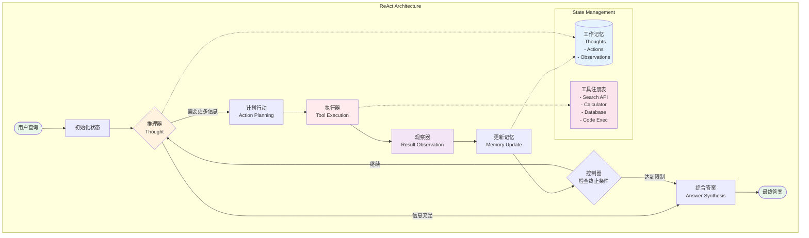
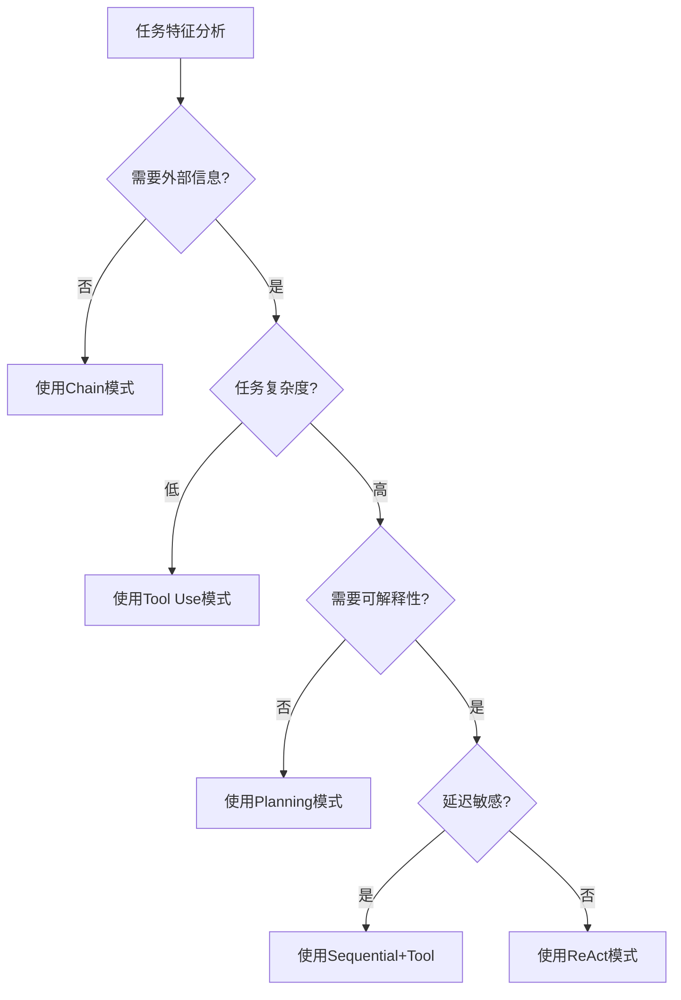
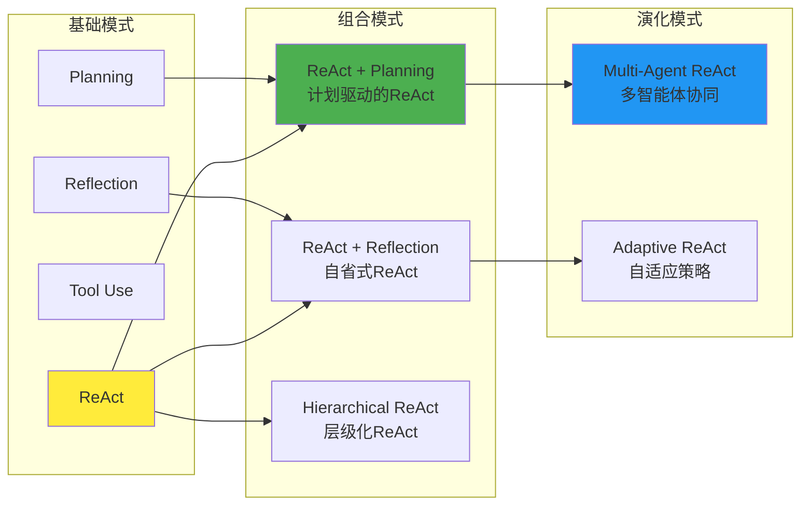

## ReAct

**ReAct**（Reason and Act，推理与行动）模式是一种**核心智能体逻辑模式**，它将智能体的行为结构化为**显式的推理循环**。它的出现是为了克服单一 LLM 推理的局限性，将 **思维链（CoT）推理**与智能体的**工具交互**结合起来，让智能体在思考和行动之间交替进行，从而实现复杂、自适应的问题求解。它属于**高级提示工程技术**，通过结构化其决策过程，使其能够应对复杂的、不可预测的任务。

### Pattern Card

```yaml
Name: ReAct (Reasoning and Acting)
One-liner: 让智能体像人类一样"思考-行动-观察"循环迭代解决复杂任务
Problem-Solution Fit: 解决LLM幻觉和缺乏外部交互能力的问题
Key Value: 将内部推理与外部行动紧密结合，实现可解释的任务执行
Complexity: ⭐⭐⭐☆☆
When to Use: 
  - 需要多步推理的复杂任务
  - 需要与外部工具/API交互的场景
  - 需要可解释决策过程的应用
When NOT to Use: 
  - 简单的单轮问答任务
  - 实时性要求极高的场景（推理链会增加延迟）
```

**比喻：ReAct 模式**

如果将一个智能体比作一个**数字侦探**，那么 **ReAct 模式**就是这位侦探的**工作日志和工具箱**。他不会凭空猜出答案（单一 CoT），而是：

1. **（思考）** 翻开日志写下：“我需要知道嫌疑人的不在场证明。”
2. **（行动）** 掏出电话呼叫证人（工具调用）。
3. **（观察）** 听完证人的回答（工具结果）。
4. 然后基于这个新信息，**（再次思考）**，继续下一步行动。

这份日志（推理链）保证了每一步都是有据可查的，确保他不会过早下结论或陷入幻觉。

### I. 概述、背景与核心问题（Context & Problem）

1. 核心概念与定义
ReAct 模式（Reason and Act）通过将智能体的思维过程和行动结构化为显式的推理循环来指导其行为。它将智能体的思考过程和行动构架为一系列自然语言交互的序列。

2. 解决的问题
在复杂的任务中，单体智能体可能会面临延迟增加、工具选择或使用不正确或未能完成任务等问题。ReAct 通过以下方式应对这些挑战：
• 克服单次推理的局限： 它通过迭代循环，允许智能体动态地构建计划，收集证据，并随着任务的进展调整其方法。
• 弥补推理空白： 它通过迫使智能体在每一步都基于可观察的结果进行决策，有效减少了事实幻觉和过早得出结论的风险。
• 增强能力边界： 它赋予智能体实际执行步骤并与动态环境互动的能力，突破了 LLM 静态知识的限制。

### II. 核心思想、角色与机制（Core Concept & Workflow）

ReAct 模式的核心是**迭代循环**，智能体在以下**三个阶段中交替运行**，直到达到终止条件（例如，找到确切答案，或达到最大迭代次数）：

1. **思考/推理 (Thought/Reasoning)：** 智能体首先对当前任务进行推理，分析现有信息，识别知识差距，并决定下一步行动。模型对任务进行推理，以决定下一步做什么。
2. **行动 (Action)：** 根据思考结果，智能体执行一个具体的行动，例如调用一个外部工具或查询。模型根据计划执行下一个步骤。
3. **观察 (Observation)：** 智能体接收并评估行动产生的结果（例如，工具的返回值或环境的新状态）。观察结果将作为下一次“思考”环节的输入。

这个循环会重复进行，使智能体能够根据最新的观察动态调整计划。

### III. 架构蓝图与可视化（Architecture & Visualization）

ReAct 模式在图形上通常表示为一个闭环结构。
• 结构元素： 循环由“思考”节点（如云朵图标）、“行动”节点（如机器人图标）和“观察”节点（如眼睛图标）构成。
• 流程流向： 思考 → 行动 → 观察 → （回到）思考。
• 核心关联： 该模式是一种单智能体架构，其有效性高度依赖于工具使用（函数调用）能力，使其能够与外部环境互动。



### IV. 优势、价值与设计权衡（Value & Trade-offs）

1. 价值与优势
• **提高透明度与可审计性**： 推理过程是外化的，每个决策步骤都可见，这创建了一个清晰的审计追踪。当智能体失败时，开发者能精确地定位到逻辑断裂点。模型思维提供了推理记录，有助于调试。
• **减少幻觉**： ReAct 通过强制每一步决策都基于可观察的结果，防止智能体过早结论，有效减少了幻觉（虚假信息）的产生。AutoGPT 在此模式下的幻觉率显著低于 CoT 方法。

2. 局限性与设计权衡
• 成本与延迟： ReAct 牺牲速度来换取深思熟虑。每次推理循环都需要额外的模型调用，这会显著增加延迟和计算成本。
• 错误传播： 如果某个观察步骤中工具返回了错误或误导性结果，该错误可以传播到后续的推理步骤中，导致最终答案不正确。
• 依赖基础模型能力： ReAct 模式的有效性高度依赖于底层 LLM 的推理能力；弱模型会产生弱推理链。

### V. 适用场景与选择标准（Use Cases & Selection Criteria）

ReAct 模式适用于复杂且解决方案路径未预先确定的任务，是处理复杂、不可预测任务的默认起点。
• 研究与调查： 适用于需要在多个来源之间追踪证据链的研究型智能体。
• 诊断与调试： 适用于通过迭代的假设-验证循环来诊断问题的调试助手。
• 动态环境适应： 适用于需要不断基于新观察动态调整计划的场景，例如机器人规划路径以避免新障碍物。
• 非标请求处理： 适用于处理需要调查才能解决的非标准客户支持请求。

**选择决策树**



另外，成本敏感场景，ReAct的token消耗过高，可以考虑使用Sequential+Tool模式。需要确定性输出，ReAct的动态性不适合。

### VI. 实现、框架支持与关联模式（Implementation & Relations）

#### 核心实现

```python
class ReActAgent:
    def __init__(self):
        self.llm = LLMEngine()
        self.tools = ToolRegistry()
        self.memory = WorkingMemory()
        self.max_iterations = 5
    
    def run(self, query: str) -> str:
        self.memory.add_user_query(query)
        
        for i in range(self.max_iterations):
            # Thought: 推理当前状态和下一步
            thought = self.think()
            self.memory.add_thought(thought)
            
            # 判断是否需要行动
            if self.should_act(thought):
                # Action: 执行工具调用
                action = self.plan_action(thought)
                observation = self.execute_action(action)
                self.memory.add_observation(observation)
            else:
                # 生成最终答案
                return self.generate_answer()
        
        return self.handle_max_iterations()
```

#### 代码蓝图

**最小可运行示例：**

```python
# 简化版ReAct实现
class SimpleReActAgent:
    def __init__(self, llm, tools):
        self.llm = llm
        self.tools = tools
        self.prompt_template = """
You are an AI assistant using the ReAct framework.
Current Query: {query}
Previous Steps: {history}

Think step by step:
1. Thought: What should I do next?
2. Action: [ToolName: parameters] or [Finish: final answer]
"""
    
    def process(self, query):
        history = []
        
        while True:
            # 生成思考和行动
            prompt = self.prompt_template.format(
                query=query, 
                history='\n'.join(history)
            )
            response = self.llm.generate(prompt)
            
            # 解析响应
            thought, action = self.parse_response(response)
            history.append(f"Thought: {thought}")
            
            if action.startswith("Finish:"):
                return action.split("Finish:")[1].strip()
            
            # 执行工具调用
            tool_name, params = self.parse_action(action)
            result = self.tools[tool_name].run(params)
            history.append(f"Action: {action}")
            history.append(f"Observation: {result}")
```

**可配置点：**

```yaml
Configuration:
  max_iterations: 5-10
  temperature: 0.3-0.7  # 推理时的创造性
  tool_timeout: 30s
  memory_window: 10  # 保留最近N轮交互
  parallel_actions: false  # 是否支持并行执行
```

#### 性能分析

```python
# 性能基准测试
class ReActBenchmark:
    metrics = {
        "success_rate": 0.85,  # 任务完成率
        "avg_steps": 3.2,      # 平均步骤数
        "token_efficiency": 0.73,  # Token利用率
        "error_recovery": 0.91,    # 错误恢复率
    }
    
    def compare_variants():
        return {
            "Vanilla ReAct": {"speed": 1.0, "accuracy": 0.85},
            "ReAct-EM": {"speed": 0.9, "accuracy": 0.92},
            "Multi-ReAct": {"speed": 0.7, "accuracy": 0.95},
        }
```

#### 模式变体

1. **ReAct-EM (Error Mitigation)**

   ```python
   class ReActEM(ReActAgent):
       def execute_action_with_retry(self, action):
           try:
               return super().execute_action(action)
           except Exception as e:
               # 生成错误处理思考
               error_thought = self.think_about_error(e)
               return self.plan_alternative_action(error_thought)
   ```

2. **Multi-Agent ReAct**

   ```python
   class MultiReAct:
       def collaborate(self, agents, query):
           # 专家agent负责不同工具
           thoughts = [agent.think(query) for agent in agents]
           consensus = self.reach_consensus(thoughts)
           return self.coordinate_actions(consensus)
   ```

3. **模式组合策略**

3.1. **ReAct + Planning**

```python
class ReActPlusPlanning:
    """ReAct与Planning模式的组合"""
    
    def execute(self, query):
        # 1. 使用Planning生成高层计划
        plan = self.planner.create_plan(query)
        
        # 2. 对每个计划步骤使用ReAct
        results = []
        for step in plan.steps:
            result = self.react_agent.execute(step)
            results.append(result)
            
            # 3. 根据结果调整后续计划
            if self.should_replan(result):
                plan = self.planner.revise_plan(plan, results)
        
        return self.synthesize_results(results)
```

3.2. **ReAct + Reflection**

- 每N步进行自我反思
- 评估当前路径是否正确
- 必要时回溯或改变策略

3.3. Future Directions

**1. 神经符号结合**

- 将ReAct与知识图谱结合
- 使用符号推理增强逻辑能力

**2. 自适应ReAct**

```python
class AdaptiveReAct:
    def adapt_strategy(self, task_complexity):
        if task_complexity < 0.3:
            return "direct_answer"
        elif task_complexity < 0.7:
            return "shallow_react"  # 1-2步
        else:
            return "deep_react"     # 多步推理
```

#### 框架支持

**LangGraph 实现示例**
LangGraph： LangGraph 框架原生支持 ReAct，并提供了预构建方法 create_react_agent 来简化实现。

```python
from langchain.agents import create_react_agent
from langchain.tools import Tool

agent = create_react_agent(
    llm=llm,
    tools=[search_tool, calculator_tool],
    prompt=ReActPromptTemplate,
    max_iterations=5,
    early_stopping_method="generate"
)

```

**LlamaIndex 实现示例**

```python
from llama_index.agent import ReActAgent

agent = ReActAgent.from_tools(
    tools=[query_engine_tool, summary_tool],
    llm=llm,
    verbose=True,
    max_iterations=7
)

```

**AutoGPT的任务分解**
• AutoGPT： AutoGPT 架构采用了 ReAct 风格的推理-行动循环。

- 使用ReAct进行长期目标规划
- 递归式任务分解
- 持久化中间状态

**AutoGen**
AutoGen 框架支持工具使用和 ReAct 模式的实现。

#### 关联模式

• 工具使用（Tool Use）： ReAct 是工具使用模式的高级形式，它通过工具调用实现“行动”步骤，使其能够与外部世界交互。
• 思维链（CoT）： ReAct 将 CoT 推理与工具使用结合起来，形成动态的循环。
• TAO： ReAct 在功能上等同于 TAO (Thought, Action, Observation) 框架。
• 反思（Reflection）： ReAct 可以与反思模式组合，例如 Reflexion 框架便是在 ReAct 循环中加入了反思和记忆组件，以实现自我修正和迭代优化。

**与其他模式的关系**


