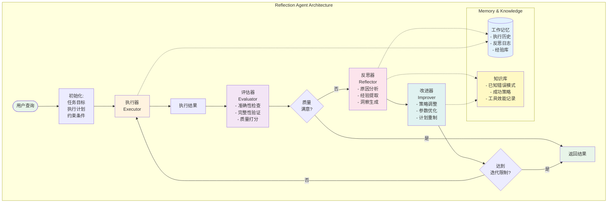
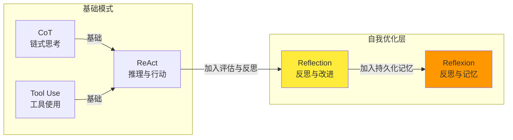

## 智能体 Reflection 设计模式详解

**Reflection**（反思）模式为智能体增加了一个**自我评估和迭代改进的层次**，使其能够对其自身的工作、输出或内部状态进行批判性审查，并利用评估结果来提升性能或优化响应。

该模式的核心在于**自我纠错机制**，它使智能体具备根据内部批判或与目标标准的对比，反复优化输出或调整策略的能力。它也被称为**生成者-批评家模式**（Generator-Critic）或**多智能体审查与批判模式**（Multi-agent Review and Critique Pattern）。

### Pattern Card

```yaml
Name: Reflection (反思/自我修正)
One-liner: 让智能体主动自我评估输出，通过迭代反馈循环修正错误，直到达到预设质量标准
Problem-Solution Fit: 解决单一LLM输出质量不高、存在逻辑或事实错误，以及缺乏自我修正能力的问题
Key Value: 提高输出质量、准确性和可靠性，特别适用于高风险、高要求任务
Complexity: ⭐⭐⭐⭐
When to Use: 
  - 输出质量显著重要于速度的场景
  - 错误会带来严重后果的高风险任务
  - 需要事实验证或合规检查的内容生成
  - 金融、医疗、法律等专业领域的分析与决策
When NOT to Use: 
  - 实时性要求极高的场景（迭代修正会显著增加延迟和成本）
  - 简单的单轮问答任务
  - 成本极其敏感的场景
```

### 比喻：Reflection 模式

如果将智能体比作一个**数字作家**，那么 **Reflection 模式**就是这位作家雇佣的**专业编辑和事实核查团队**。

1. **（生成者）** 作家写完初稿。
2. **（批评者）** 编辑团队根据严苛的标准（如事实、风格、逻辑）对初稿进行批判。
3. **（优化）** 作家根据编辑的反馈进行修订。

这个过程重复进行，确保最终交付的作品是高质量、无懈可击的，而不是一气呵成的草率初稿。

### I. 概述、背景与核心问题（Context & Problem）

**1. 核心概念与定义**

反思模式是一种**自我纠错或自我改进机制**，要求智能体在生成初始结果后，**明确地进入批判模式**来评估自身的工作。如果自我评估揭示了问题，智能体会修正其输出并重复该过程，直到满足质量阈值。

**2. 解决的问题**

即使采用复杂的 ReAct 或 Planning 模式，智能体的初始输出或计划仍可能存在不准确、不完整或未满足复杂约束的问题。基础工作流缺乏智能体**自我识别和修正错误**的机制。

反思模式通过引入一个元认知层，解决了以下问题：

* **减少认知偏差：** 通过强制智能体“退一步”评估其自身工作，而不是为第一个答案辩护，从而减少确认偏差。
* **确保质量和合规：** 尤其在错误成本高的领域，该模式通过专门的验证步骤，确保输出符合事实、安全性或特定的约束条件。

### II. 核心思想、角色与机制（Core Concept & Workflow）

反思模式的核心工作流程是一个**反馈循环**，通常涉及**角色分离**：

**1. 生成（Generation）/ 执行：**
智能体（作为**生产者**或行动者）完成任务或生成初始输出，例如代码块或文档摘要。

**2. 评估/批判（Critique）：**
智能体**切换到批评者角色**（或由一个独立的**批评者智能体**执行），审视上一步结果。它根据预定义的标准（如事实准确性、连贯性、完整性、遵循指令情况）进行评估，并给出**结构化反馈**。

**3. 反思/优化（Reflection / Refinement）：**
智能体（或生产者）根据批判结果，决定如何改进，生成优化后的输出，或调整后续行为。AutoGPT 的**自我修正与反思模式**会在任务执行出现问题时，分析错误反馈、诊断失败点、更新策略并重新尝试，形成迭代循环。

**4. 迭代（Iteration）：**
优化后的输出或方案再次进入循环，反思过程可重复，直到达到满意结果或满足终止条件。

这种分工能有效避免智能体自我评审时的“认知偏差”。在 LangGraph 中，该机制被称为 **Evaluator-Optimizer** 模式。

### III. 架构蓝图与可视化（Architecture & Visualization）

反思模式在图形上表示为一个**迭代循环结构**，它是一种**循环智能体模式**（loop agent pattern）的实现。

* **结构元素：** 主要由**生成器（Producer）**节点和**批评器（Critic）**节点组成，并通过**条件边**连接，实现反馈回路。
* **流程流向：** 生成器 $\rightarrow$ 批评器（评估） $\rightarrow$ 条件判断 $\rightarrow$ （不满足条件）返回生成器 $\rightarrow$ （满足条件）结束/交付。
* **核心关联：** 真正的迭代反思需要支持**状态管理和条件跳转**的框架，如 LangGraph。批评者提供的反馈（如“CODE\_IS\_PERFECT”）是触发循环终止的关键条件。

### Reflection 架构的核心组件



### Reflection 与其他模式的关系



### IV. 优势、价值与设计权衡（Value & Trade-offs）

**1. 价值与优势**

* **提升输出质量和准确性：** 反思模式增加了**专门的验证步骤**，显著提升生成内容的准确性、完整性、风格和指令遵循度。
* **减少确认偏差：** 通过角色分离（生成者 vs. 批评者），迫使智能体以客观视角审查自身工作，避免自我辩护。
* **可编程的质量标准：** 适用于那些存在**明确且可编程验证的质量标准**的领域。
* **增强学习与适应性：** 智能体能从过去的批判中学习，避免重复错误，实现**累积性的改进**。

**2. 局限性与设计权衡**

* **成本与延迟显著增加：** 每次反思循环都至少需要**一次额外的模型调用**。如果涉及多次修订，延迟和运营成本会**累积**。ReAct 和 Reflection 都以牺牲速度来换取深思熟虑。
* **循环风险：** 如果**退出条件定义不当**，智能体可能会不必要地陷入循环，浪费资源。
* **对指令的依赖：** 批评标准必须**具体且可衡量**；模糊的指令（如“检查这是否足够好”）会导致结果不一致。

### V. 适用场景与选择标准（Use Cases & Selection Criteria）

反思模式适用于对最终输出质量有最高要求的场景，即**错误成本高于处理成本**时。

* **代码生成与调试：** 智能体编写代码后，运行测试或静态分析，发现错误或低效之处，然后根据反馈修改代码，生成**更健壮、功能更完善**的代码。
* **内容创作与事实核查：** 在发布前进行事实核查、风格一致性检查，尤其适用于内容创作需要**事实验证**或**合规检查**的场景。
* **金融与复杂分析：** 在提交金融分析报告前，检查计算错误和逻辑漏洞，因为**错误的结论风险极高**。
* **规划与策略制定：** 评估制定的计划并发现潜在缺陷或改进点，从而制定**更有效、现实的方案**。
* **高质量长文生成：** 在 DeepLearning.AI 的课程示例中，反思模式被用于**高质量博文生成**。

* **自主代理任务规划:** 制定计划 → 执行步骤 → 监测进度 → 反思偏差 → 重新规划, 适用于：机器人路径规划、多步骤任务执行

* **对话系统的长期学习:** 每轮交互后反思对话质量 → 调整回应策略 → 下轮改进。适用于：个性化助手、客服系统

**选择决策：** 如果任务对**准确性、安全性或专业性**要求极高，且愿意接受更高的延迟和成本来确保质量，应优先采用 Reflection 模式。

### VI. 实现、框架支持与关联模式（Implementation & Relations）

### 核心实现

```python
class ReflectionAgent:
    """基于反思机制的智能体"""
    
    def __init__(self, llm, tools, max_iterations=3):
        self.llm = llm
        self.tools = tools
        self.max_iterations = max_iterations
        self.execution_history = []
        self.reflection_log = []
    
    def execute_task(self, task: str) -> str:
        """主执行流程"""
        current_plan = task
        
        for iteration in range(self.max_iterations):
            # 阶段 1：执行
            result = self.execute_plan(current_plan)
            self.execution_history.append({
                'iteration': iteration,
                'plan': current_plan,
                'result': result
            })
            
            # 阶段 2：评估
            quality_score = self.evaluate_result(result, task)
            
            if quality_score >= 0.9:  # 满意则返回
                return result
            
            # 阶段 3：反思
            reflection = self.reflect(result, task, quality_score)
            self.reflection_log.append({
                'iteration': iteration,
                'quality_score': quality_score,
                'reflection': reflection
            })
            
            # 阶段 4：改进
            current_plan = self.improve_plan(current_plan, reflection)
        
        return result
```

---

## VII. 模式变体与进阶应用（Pattern Variants）

### 变体 1：Reflexion（反思 + 记忆）

```python
class ReflexionAgent(ReflectionAgent):
    """Reflexion = Reflection + 持久化记忆"""
    
    def __init__(self, llm, tools, max_iterations=5):
        super().__init__(llm, tools, max_iterations)
        self.episodic_memory = []  # 长期记忆
        self.semantic_memory = {}  # 语义记忆
    
    def store_episode(self, task: str, success: bool, reflection: str):
        """存储一个情节到记忆"""
        self.episodic_memory.append({
            'task': task,
            'success': success,
            'reflection': reflection
        })
```

### 变体 2：Self-Critique 自我批评

```python
class SelfCritiqueAgent:
    """自我批评变体"""
    
    def solve_with_critique(self, problem: str):
        # 生成初步答案
        answer = self.llm.generate(f"解决：{problem}")
        
        # 自我批评
        critique_prompt = f"""
        问题：{problem}
        我的答案：{answer}
        
        请批评这个答案并改进它。
        """
        
        improved = self.llm.generate(critique_prompt)
        return improved
```

---

**1. 框架支持**

* **LangGraph：** LangGraph 的图结构非常适合构建这种循环逻辑。它支持**基本型反思架构**（Basic Reflection），通过提示 LLM 回顾历史行为，实现持续学习改进。
* **AutoGen：** AutoGen 通过 **Reviewer Agent**（评审智能体）和**嵌套聊天**（Nested Chats）来实现反思模式。
* **AutoGPT：** AutoGPT 架构内置了**错误处理与反思循环**，用于诊断失败点并更新策略。
* **Azure/Google ADK：** **Review and Critique Pattern** 是多智能体协作模式的一种实现，通常在顺序工作流中由一个生成者智能体和一个批评者智能体配合完成。
* **CrewAI：** 可通过定义一个 Agent 作为 Critic，并将其任务设置为审查前一个 Agent 的输出来实现审阅流程。

**2. 关联模式**

* **ReAct（推理与行动）：** 反思模式可以与 ReAct 模式组合。例如，**Reflexion 框架**便是在 ReAct 循环中加入了反思和记忆组件，以实现自我修正和迭代优化。
* **Evaluator-Optimizer（评估器-优化器）：** 这是 LangGraph 对反思模式的一种表述，生成器创建输出，评估器给出反馈，形成迭代循环直到达到满意的结果。
* **Maker-Checker Loops：** 这是群组对话编排的一种特定类型，其中一个智能体（*maker*）创建提案，另一个智能体（*checker*）提供批判和反馈，要求正式的轮流顺序。
* **学习与适应：** 反思是智能体实现**学习与适应**的关键机制，它利用反馈循环来调整其未来决策逻辑。

**3. 高级变体**

* **Reflexion：** 通过整合**自反思能力**、**外部评估器**（如代码编译步骤）和**存储反思结果的情景记忆**，进一步提升输出质量。
* **思维树（Tree of Thoughts, ToT）：** 通过反思评估结合搜索机制（如广度优先搜索）来优化 LLM 智能体决策，通过生成、评分和剪枝多个候选方案来实现。

## VIII. 最佳实践与注意事项（Best Practices）

### 最佳实践

1. **设置合理的迭代限制**
   * 避免无限循环；通常 3-5 次迭代是最优的成本收益点

2. **多维度评估**
   * 不仅看结果是否正确，还要评估过程、效率、创新性等

3. **记忆管理**
   * 定期压缩或遗忘旧的反思记录，防止内存膨胀

4. **监督与审计**
   * 记录所有反思日志，便于事后分析与改进评估器本身

5. **渐进式深化**
   * 初次尝试用"浅层反思"（快速），如未成功再用"深层反思"

### 常见陷阱

1. **过度反思**
   * 无限增加迭代，最终陷入局部最优或成本爆炸

2. **弱评估器**
   * 如果评估不准，反思的方向也会错误，造成恶化

3. **忽视多样性**
   * 反思往往导向同一种改进方向，容易陷入局部最优

4. **记忆污染**
   * 存储错误的经验或过时的策略，反而误导未来的决策

## IX. 总结与展望（Summary & Future Directions）

### 核心要点

* **Reflection 模式**通过"执行-评估-反思-改进"的循环，赋予智能体自我优化的能力
* **优势**：提高成功率、改进质量、增强学习能力
* **代价**：成本与延迟显著增加，依赖于高质量的评估器
* **适用场景**：复杂任务、迭代式优化、长期学习

### 未来方向

1. **更智能的评估器**
   * 使用多模态评估（代码、逻辑、语义等）
   * 引入外部验证（单元测试、数据库查询等）

2. **自适应反思深度**
   * 根据任务复杂度动态调整反思强度

3. **集合方法**
   * 结合多个智能体的反思，形成共识

4. **长期记忆与知识蒸馏**
   * 将反思经验蒸馏为通用规则，加速后续任务

5. **与人类反馈的融合**
   * 人类评估者提供高质量的反馈，指导反思方向

**总结类比：**

Reflection 模式就像软件开发中的**代码评审流程**。**生成者**是开发者，编写代码；**批评者**是代码审查员，根据规范清单严格检查代码；只有当审查员给出“通过”（`CODE_IS_PERFECT`）信号时，代码才能合并（任务终止），确保了代码质量优先于开发速度。

## 参考与延伸阅读

* Reflexion: Language Agents with Verbal Reinforcement Learning (2023)
* Self-Refine: Iterative Refinement with Self-Feedback (2023)
* AutoGen: Enabling Next-Gen LLM Applications via Multi-Agent Conversation (2023)

<https://medium.com/fundamentals-of-artificial-intelligence/agentic-design-patterns-reflection-f8a17fd8153d>
