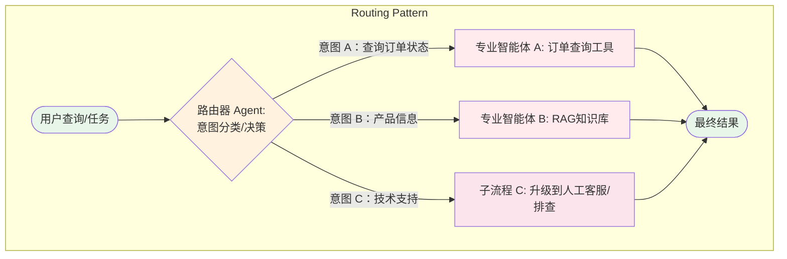

## Router设计模式

**Router**（路由）模式是一种**工作流编排与控制模式**，它为智能体操作框架引入了**条件逻辑**，使其能够根据**环境状态、用户输入或前序操作结果**等因素，在多个潜在的专用函数、工具或子流程之间进行**仲裁和动态决策**。路由模式解决了线性工作流在自适应场景下适用性有限的问题，使智能体系统从固定执行路径转变为**动态评估、自主选择行动路径**的自适应系统。

### Pattern Card

```yaml
Name: Routing (路由)
One-liner: 智能体根据特定条件动态评估输入或状态，将控制流导向最合适的专用智能体、工具或子流程。
Problem-Solution Fit: 解决了线性工作流在自适应响应场景下的局限性，实现了在多个潜在行动之间进行仲裁。
Key Value: 为智能体操作框架引入**条件逻辑**和**动态决策能力**，使其能处理多样化输入，并自适应行为。
Complexity: ⭐⭐⭐☆☆
When to Use: 
  - 智能体需要处理**多样化输入**并根据意图进行分类时。
  - 需要将任务分派给**多个专业化智能体**或工具链时,。
  - 需要在**不同模型（如高成本/高精度模型与低成本/快速模型）**之间进行**动态切换**以优化资源和成本时。
  - 任务流需要**灵活、具备上下文感知**的工作流时。
When NOT to Use: 
  - 任务流程**固定且线性**，无需条件分支时（**提示链**或**顺序执行**更高效）,。
  - 对性能要求极高，且模型推理时间可能造成瓶颈时（路由决策本身需要LLM调用）。
```

**比喻：Router模式**

如果将一个智能体系统比作一个**大型邮政分拣中心**，那么 **路由模式**就是**智能分拣机**。当包裹（用户请求）到达时，分拣机（路由器）不会将所有包裹都送往同一条固定的传送带（线性流程）。相反，它会：

1. **（分析）** 扫描包裹上的标签（分析用户意图和关键词）。
2. **（决策）** 立即决定包裹是应该送往“国际邮件部门”（专业智能体 A）、“特快专递部门”（高性能工具 B），还是“退件处理流程”（异常处理子流程）。
3. **（引导）** 确保每个包裹都能动态、快速地被导向**最合适的处理路径**，从而实现了高效、灵活且专业的服务。

### I. 概述、背景与核心问题（Context & Problem）

1. **核心概念与定义**
    路由模式为智能体操作框架引入了**条件逻辑**，使其能够在**多个潜在动作之间进行仲裁**。它是一种工作流编排与控制模式，使得智能体系统能够从固定的执行路径转变为动态评估特定标准、自主选择行动路径的自适应系统。路由机制通常通过 **图结构** 中的**条件边**来实现动态决策。

2. **解决的问题**
    该模式解决了传统**提示链**（Prompt Chaining）或**顺序处理**在需要自适应响应场景下适用性有限的挑战。现实中的智能体系统不能始终采用单一、预设的响应路径，路由机制使得智能体能够根据用户查询意图、内部状态或前序操作结果，动态地将控制流导向不同的**专用函数、工具或子流程**。

### II. 核心思想、角色与机制（Core Concept & Workflow）

路由模式的核心思想是**动态评估和委派**，它依赖于一个中央“协调者”来做出关键的分派决策。

1. **分析输入**：智能体首先接收用户查询，并对意图和上下文进行分析。
2. **决策评估**：路由模式的核心组件——路由器（或协调器智能体）执行评估，判断输入应该导向哪条路径。例如，判断查询是“查询订单状态”还是“技术支持”。
3. **分派控制流**：根据决策结果，路由器将控制流**动态地导向**到对应的**子智能体、工具链或升级流程**。
4. **执行**：被选中的下游组件执行任务，并将结果返回（可选）。
5. **动态模型选择**：路由模式还可以实现**动态模型切换**，将简单查询路由到**低成本、快速的模型**，将复杂推理查询路由到**高精度、高成本的模型**，以优化成本与性能,。

**LangGraph中的实现**

在像 LangGraph 这样的框架中，路由是通过**条件边（Conditional Edges）** 来实现的。图的拓扑结构被设计为多个节点，而连接这些节点的边是条件性的，根据 LLM 的输出或业务逻辑动态确定下一个执行节点,。

### III. 架构蓝图与可视化（Architecture & Visualization）

路由模式在架构上通常表现为一个**决策节点**，它将输入流分裂为多个可能的输出流，并根据条件进行选择。

* **结构元素**：路由器智能体（Coordinator Agent）、LLM推理引擎、多个下游的专业智能体/工具（如 `booking_handler`、`info_handler`、`unclear_handler`）。
* **核心关联**：路由模式常与**多智能体协作**结合，通过路由机制将任务分配给**专业智能体**，采用**分治法**处理复杂任务,,。它也与**资源感知优化**模式直接相关，通过动态模型选择平衡成本和性能。



### IV. 优势、价值与设计权衡（Value & Trade-offs）

1. 价值与优势

* **提升灵活性与自适应性**：路由为智能体引入了条件逻辑，使其能从固定的执行路径转变为动态评估、自主选择行动路径的模式。
* **优化资源和成本**：智能体可以根据任务复杂度和查询长度，将任务路由到**最经济、最合适的模型**，实现**动态模型切换**，例如在 **Gemini Pro** 与 **Gemini Flash** 之间进行选择,。
* **模块化与专业化**：路由支持将任务分派给具备特定技能的**专业智能体**，使得系统可以针对不同输入类型构建专门的提示词和处理流程，避免了单一智能体试图解决所有问题,。

2. 局限性与设计权衡

* **决策成本与延迟**：基于 LLM 的路由需要额外的模型调用来分析输入和输出路由指令。这会增加系统的**延迟和计算成本**，不适合对实时性要求极高的场景。
* **路由准确性**：路由的有效性取决于底层 LLM 的推理能力，如果 LLM 未能正确识别用户意图或选择错误的路径，则会导致后续流程错误。

### V. 适用场景与选择标准（Use Cases & Selection Criteria）

路由模式在需要**根据输入类型或系统状态动态分派任务**的场景中非常适用。

* **智能客服与支持**：智能体可对用户查询进行分类，并根据意图（如“查询订单状态”、“产品信息”、“技术支持”）路由到不同的专业处理链或人工升级流程,。
* **资源调度与优化**：根据查询长度或复杂度动态选择 LLM 模型，以平衡准确性和成本,。
* **企业工作流**：将请求路由给具有不同专业技能的团队，例如“财务审批”或“法律合规”团队。

**选择决策树**

当任务需要根据输入进行分支选择时，路由是理想选择：

| 维度 | 决策点 | 推荐模式 | 来源 |
| :--- | :--- | :--- | :--- |
| **流程结构** | **任务流程是固定线性的吗？** | 否 → 考虑 **路由** | |
| **输入变异性** | **智能体需要根据用户的意图或类型将任务分派给不同专家吗？** | 是 → 选择 **路由模式** |, |
| **资源约束** | **你需要动态平衡成本和性能吗？** | 是 → 结合 **路由** 实现动态模型选择 |, |

### VI. 实现、框架支持与关联模式（Implementation & Relations）

路由模式是现代智能体系统实现模块化和弹性的基础。

#### 核心实现

路由机制的核心实现是利用 LLM 的推理能力，通过提示工程（Prompting）要求其生成一个**结构化输出**（如 JSON 或特定标识符），这个输出随后被系统**作为条件**来引导控制流。

路由的实现方式包括：

* **基于 LLM 的路由**：通过提示模型输出指示下一步或目标的**标识符或指令**，系统读取该输出并据此引导工作流。
* **基于嵌入的路由**：将输入查询转换为向量嵌入，再与代表不同路由或能力的嵌入进行比对，路由到**语义最相似的路径**。
* **基于规则的路由**：使用预定义规则或逻辑（如 `if-else`），根据关键词或结构化数据进行路由。
* **基于机器学习模型的路由**：采用如分类器等判别模型，在小规模标注数据集上专门训练实现路由任务。

#### 框架支持

* **LangGraph**：原生支持通过**条件边**实现路由，这是其图结构中的核心功能。可以利用 LLM 或自定义函数来确定下一个执行节点,。
* **AutoGen**：通过 **GroupChatManager** 实现 **自适应协调模式**，使用 LLM 智能选择下一发言者，本质上是一种路由,。
* **Coze**：在多智能体场景中，通过 **Condition 节点**进行**动态路由**，实现任务分派。
* **Google ADK**：通过 **Coordinator Agent** 实现路由，该协调者智能体负责分析用户请求并委托给合适的专用子智能体。

#### 关联模式

* **多智能体协作（Multi-Agent Collaboration）**：路由常用于多智能体系统，用于将任务分配给不同的专业智能体,,。
* **资源感知优化（Resource-Aware Optimization）**：路由是实现动态模型选择（如在不同 LLM 之间切换）以优化成本和延迟的核心机制。
* **规划（Planning）**：路由可以在计划执行前或计划执行过程中，根据步骤需求或当前环境动态决定下一步的工具调用或子任务的委派。
* **异常处理与恢复（Exception Handling and Recovery）**：当遇到无法处理的异常时，路由可用于将问题升级至备用方案或人工干预（Human-in-the-Loop）。
