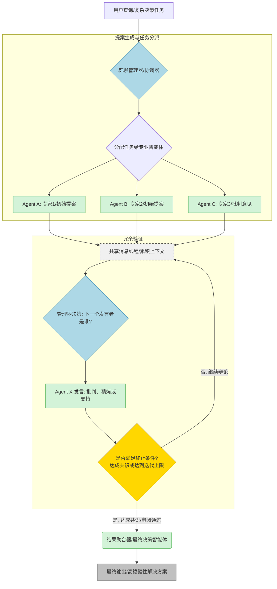

## **多智能体群组对话与辩论模式 (Group Chat & Debate-Based Cooperation)**

**群组对话与辩论模式**（Group Chat Orchestration / Debate-Based Cooperation）旨在通过模拟人类团队的讨论和辩论过程，利用多个专业智能体之间的相互批判和协作，共同解决复杂问题或达成高置信度的决策。该模式的核心价值在于**冗余验证**和**多角度论证**，从而显著提升最终输出的质量和可靠性。

### Pattern Card

```yaml
Name: Group Chat & Debate (群组对话与辩论)
One-liner: 多个智能体在共享对话线程中提出、批判并辩护各自的方案，最终通过共识或聚合得出最佳解决方案。
Problem-Solution Fit: 解决单一智能体视角局限、高风险决策准确性不足、以及缺乏同行评审验证机制的问题。
Key Value: **通过多元视角和同行审视，提升解决方案的质量、事实准确性和稳健性**。
Complexity: ⭐⭐⭐⭐⭐ (设计和协调多个智能体间的交互结构和通信机制非常复杂)
When to Use:
- 任务需要多方专业技能和观点（如法律、金融、政策分析）。
- 质量和稳健性要求高于速度，需要通过迭代辩论或同行评审达成共识。
- 复杂问题需要冗余验证以提高事实准确性和推理能力。
When NOT to Use:
- 简单的单步或可预测的线性任务（ReAct或Planning模式可能更高效）。
- 对延迟（Latency）要求极高的场景（辩论会增加多轮模型调用，显著增加延迟和成本）。
```

**比喻：群组对话与辩论模式**

如果将智能体比作一个**数字团队**，那么**群组对话与辩论模式**就是一场**高层圆桌会议或模拟法庭辩论**。

1. **议题发起人/法院** 提出一个问题或提案。
2. **各领域的专家（智能体）** 独立分析问题，并提出各自的方案或论点（如法律智能体、财务智能体）。
3. **辩论环节** 中，专家们轮流对彼此的方案进行**批判、质疑和辩护**。
4. **会议主席（Chat Manager）** 负责维持秩序，指示谁可以发言，并确保讨论沿着既定目标推进。

最终，只有经过这种多轮、严格论证的“压力测试”后的方案，才能被采纳为**团队的最终共识**。

---

### I. 概述、背景与核心问题（Context & Problem）

#### 1. 核心概念与定义

**群组对话编排**模式（Group Chat Orchestration Pattern）的核心思想是让多个智能体在**共享的对话线程**中协同工作，以解决问题、制定决策或验证工作。它模拟了人类团队的协作形式。

**辩论模式**（Debate Mode）是群组对话的一种高级应用，它利用**冗余验证**机制，让多个智能体**独立**解决同一问题，然后**互相批判**，通过迭代讨论和精炼，最终达成共识或找到最可靠的答案。

#### 2. 解决的问题

虽然 ReAct 等模式解决了单一智能体的工具交互和推理透明度问题，但面对**高风险、复杂且需要多方输入**的决策场景时，单一推理路径仍有局限性：

* **视角单一：** 即使是强大的 ReAct 智能体，其推理链和最终结论仍可能受限于其角色设定和当前观察，缺乏多元视角的验证。
* **可靠性挑战：** 在数学、法律分析或代码生成等领域，单一模型的输出可能存在隐蔽的错误或幻觉。辩论模式通过**多智能体辩论（Multi-Agent Debate）**，能够**提高事实准确性并改进模型推理**。
* **缺乏共识机制：** 任务结果的质量需要经过严格审查和验证，尤其在企业应用中（例如，法律或财务分析）。辩论机制通过集体评估，保证了最终输出的健壮性。

---

### II. 核心思想、角色与机制（Core Concept & Workflow）

辩论模式的核心是通过结构化的**对话流**和**角色分工**来实现高效率的批判性协作。

#### 1. 结构化辩论流程

辩论协作遵循结构化的循环流程，通常由以下步骤组成：

1. **提出问题（Pose the Problem）：** 向一组专门智能体引入一个复杂的问题或提案。
2. **初始方案阶段（Initial Proposal）：** 每个智能体独立提出自己的解决方案、观点或论点。
3. **辩论回合（Debate Rounds）：** 智能体轮流发言，**批判、捍卫或质疑**其他人的提案。这可能涉及强调弱点、提出改进或反驳论点。
4. **迭代精炼（Iterative Refinement）：** 基于辩论中的论据和反论，智能体修改他们的提案，加强理由，并逐渐趋向一致。
5. **聚合与共识（Aggregate or Select Final Result）：** 最终，精炼后的方案可能通过**投票**、**聚合**或由一个**最终裁决者（Aggregator Agent）**选择出最优解。

#### 2. 核心角色与职能

* **群聊管理器（Group Chat Manager）/ 协调器（Orchestrator）：** 这是控制流的核心。它不参与辩论内容，而是**协调对话流**，决定**哪个智能体可以下一步响应**，并管理不同的互动模式（从协作式头脑风暴到结构化的质量控制）。在 AutoGen 中，这通常由管理器智能体通过 `auto` 策略实现，该策略让 LLM 根据当前对话状态智能选择下一位发言者。
* **专业辩论智能体（Debating Agents）：** 这些是具有特定角色（如法律专家、财务分析师、工程师）和专业知识的 LLM。他们负责独立生成解决方案、在辩论中为自己的论点辩护，并根据同行反馈更新其答案。
* **人类参与者（Human Participant）：** 在高风险场景中，人类可以实时参与聊天线程，提供洞察或响应智能体的知识请求。

---

### III. 架构蓝图与可视化（Architecture & Visualization）

辩论模式通常采用**网络架构**或**群组对话架构**。

#### 1. 结构元素

* **共享消息线程：** 所有智能体的输入和输出都记录在一个**累积对话**中。
* **多智能体连接：** 智能体之间通常是**多对多连接**，但由群聊管理器协调，形成一个**中心化的控制点**。

#### 2. 流程流向（以城市公园提案评估为例）

1. **输入触发：** 公园开发提案被提交给**群聊管理器**。
2. **管理启动：** 群聊管理器根据预设指令或模型推理，启动多个专业智能体（例如，**社区参与智能体、环境规划智能体、预算与运营智能体**）。
3. **结构化辩论：** 群聊管理器促进**结构化辩论**，智能体互相挑战推荐意见并捍卫自己的理由。
4. **上下文积累：** 智能体之间的所有讨论、知识引用和观点形成**累积对话**。
5. **人类介入：** 公园部门的员工可以参与聊天，添加洞察或响应智能体的知识请求。
6. **共识输出：** 讨论结束后，系统输出**公园提案共识**或精炼后的提案，为社区评审做准备。

#### 流程图可视化

多智能体群组对话与辩论模式的核心在于**控制流的动态协调和批判性的反馈循环**，Mermaid 图可以非常直观地展示这一迭代过程和角色间的交互。
以下是“多智能体群组对话与辩论模式”的 Mermaid 流程图，该图借鉴了 AutoGen 等框架的群聊编排机制：该模式的核心在于群聊管理器（Group Chat Manager）专业智能体的发言，并在共享消息线程中通过互相批判（Cross-Reflection）迭代优化解决方案，直到达成共识。



该图清晰地展示了多智能体协作中群组对话的关键机制：

1. **角色专门化与提案**（Agent Specialization）:
    ◦ Agent A, B, C 代表具有明确专业角色和职责的智能体。它们**基于自己的知识库和专业视角，对问题提出初始提案或解决方案**    ◦ 这种分工提高了系统的模块化和可靠性。
2. **协调与控制流**（Manager/Coordinator）:
    ◦ 群聊管理器（Manager）（节点 B 和 F）是整个流程的中心控制点。它不参与内容生成，而是协调对话流，决定 哪个智能体可以下一步响应，以实现自适应协调。
3. **辩论与迭代循环**（Debate Loop）:
    ◦ 这是模式的核心价值所在。在 共享消息线程（节点 E）中，所有智能体的输出（提案、批判、论据）都作为上下文积累起来。
    ◦ Agent X 的发言（节点 G）会基于积累的上下文，对其他智能体的方案进行批判、质疑或精炼，这与单一智能体的自我反思（Self-Reflection）不同，是一种 **Cross-Reflection（交叉反思）**机制，能显著提高最终结果的稳健性和准确性。
    ◦ 条件终止（节点 H）决定流程是否结束。如果共识未达成或质量未达标，控制流返回到共享线程，管理器选择下一个智能体继续辩论。
4. **最终输出**（Final Output）:
    ◦ 流程结束时，聚合器智能体（节点 I）负责综合所有辩论后的精炼方案，最终得出高可信度的解决方案（节点 J）。
在 AutoGen 等框架中，这种模式通过 **群聊（Group Chat）**功能实现，允许多个智能体通过对话式协作流模拟团队解决问题。

#### 3. 关联的推理模式

辩论模式本质上是 **CoD（辩论链）** 或 **GoD（辩论图）** 等高级推理技术的体现，这些技术超越了单一 LLM 的链式思维。它通过让多个模型协作辩论来解决问题，从而提升准确性和可信度。

---

### IV. 优势、价值与设计权衡（Value & Trade-offs）

#### 1. 价值与优势

* **提升稳健性和准确性：** 通过冗余验证，多智能体辩论被证明可以**提高事实准确性**并**改进模型推理**。与自我一致性（Self-Consistency）模式类似，它有助于找到最一致的答案。
* **多样化的解决方案：** 通过鼓励智能体提出和探索多元的思维，特别是 **Cross-Reflection（交叉反思）**（即智能体互相审查和批评彼此的方案），可以增强最终解决方案的质量。
* **透明度与可解释性：** 辩论过程的**完整记录**为人类决策者提供了**论证记录（debate transcript）**，这有助于解释和建立信任。
* **自适应协调：** 像 AutoGen 这样的框架通过 LLM 智能选择下一位发言者，实现了更自然、灵活的任务分配，而非依赖固定规则。

#### 2. 局限性与设计权衡

* **高成本与延迟：** 辩论模式需要**多轮模型调用**（例如，一个 3 个智能体、3 轮辩论的任务至少需要 10 次调用）。这会显著增加延迟和 Token 成本。
* **流程复杂性：** 协调多个智能体的发言和信息流增加了系统的**整体设计和维护复杂度**。
* **偏差和收敛问题：** 如果智能体在辩论中未能收敛，或者管理器的协调逻辑设计不当，系统可能会陷入无效的循环或辩论，甚至可能出现**多数投票偏差**。
* **上下文过载：** 在群聊模式中，累积的对话历史（包括所有的思考、批判和提案）如果不进行有效管理（如通过摘要或 RAG），可能导致**上下文窗口爆炸**。

---

### V. 适用场景与选择标准（Use Cases & Selection Criteria）

辩论模式适用于那些结果难以预测、需要多方验证且错误代价高昂的复杂协作场景。

* **政策制定与评估：** 城市公园部门利用该模式评估新的公园开发提案，让不同专业智能体（环境、社区、预算）辩论，以预先识别和解决问题。
* **高风险分析（法律/金融）：** 政策推荐系统汇集法律、金融和伦理智能体，对拟议监管变更的优缺点和风险进行辩论，以达成经受多角度压力测试的推荐意见。
* **协作内容生成：** 法律团队使用该模式协作起草复杂的合同文本，通过 **Cross-Reflection（交叉反思）**和辩论来提升合同的严谨性和准确性。
* **知识密集型问答：** 在知识库检索中，如果检索结果存在冲突或模棱两可，多个分析智能体可辩论哪个信息源更可靠或哪个解释更合理。

**选择决策树**

当任务需要高度专业化的分工且**不需要动态适应性，但需要最终结果的质量和多方验证**时，应考虑辩论模式。

| 任务特性 | 模式选择建议 |
| :--- | :--- |
| **需要多方验证，高风险，结果质量优先于速度。** | **群组对话与辩论模式**。 |
| **需要多步工具交互，但单体可完成，需透明度。** | ReAct 模式。 |
| **需要分解为独立子任务，追求执行效率。** | 并行化协作模式。 |
| **任务步骤固定，严格按顺序交付。** | 顺序协作模式。 |

---

### VI. 实现、框架支持与关联模式（Implementation & Relations）

#### 核心框架支持

* **AutoGen：** AutoGen 是群组对话和辩论模式的典型代表，它基于 **Agent Dialogue（智能体对话）**构建。其 **Group Chat** 功能和 `auto` 协调策略使得智能体能够通过对话协作解决复杂任务。
* **Azure/Microsoft：** 将该模式定义为**Group Chat Orchestration（群聊编排）**，强调 Chat Manager 在协调对话流中的核心作用。
* **LangGraph：** 虽然没有预构建的辩论组件，但其**图结构**和**条件边**能够灵活地构建复杂的辩论流程（例如，建模 CoD 或 GoD），通过状态管理和节点间的消息传递来实现迭代的批判和共识。

#### 关联模式与组合策略

1. **辩论 + 反思（Reflection）：** 辩论模式与**反思模式** 紧密相关。在辩论模式中，智能体对**其他智能体**的输出进行批判，这被称为 **Cross-Reflection（交叉反思）**，而单一智能体评估自己的输出则是 **Self-Reflection（自我反思）**。
2. **辩论 + 聚合（Aggregate）：** 辩论流程的最后一步通常是**聚合**。聚合智能体（Aggregator Agent）或最终裁决者（Final Decision Agent）负责收集所有辩论过的方案，并运用共识或多数投票（Majority Vote）机制来得出最终结论。
3. **辩论 + 规划：** 在复杂的**自我设计多智能体系统（SELF-MAS）**中，元智能体（Meta-agent）可能会在推理时动态生成包含辩论环节的 MAS 配置，并根据辩论结果来改进任务分解和代理结构。

辩论和群组对话模式是构建**协作型多智能体系统**（Level 3：Collaborative Multi-Agent Systems）的关键，它代表了 AI 系统向更复杂、更像人类团队协作模式的演进。
