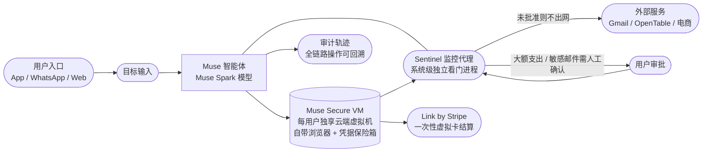
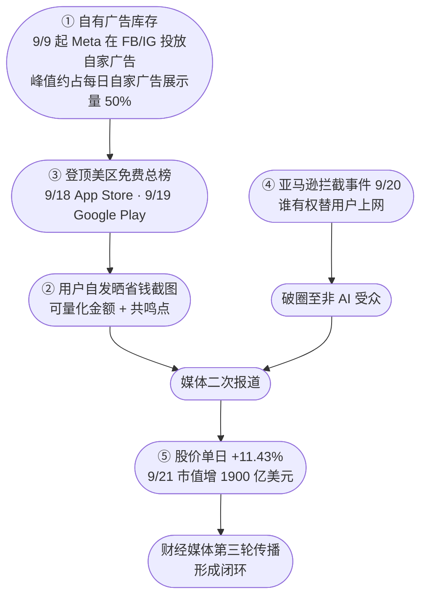

## 目录

- [TL;DR](#tldr)
- [术语与事实澄清](#术语与事实澄清)
- [一、产品定位：从「答得对」到「办得成」](#一产品定位从答得对到办得成)
- [二、技术架构：为什么它需要一台「云端电脑」](#二技术架构为什么它需要一台云端电脑)
- [三、真实能力边界：官方叙事与实测之间](#三真实能力边界官方叙事与实测之间)
- [四、目标用户：被「伪决策」榨干注意力的普通人](#四目标用户被伪决策榨干注意力的普通人)
- [五、数据全景：四个机构的四组数字](#五数据全景四个机构的四组数字)
- [六、传播机制：五次叠加的放大器](#六传播机制五次叠加的放大器)
- [七、竞品格局与商业模式](#七竞品格局与商业模式)
- [八、热度归因：五条曲线相加还是相乘](#八热度归因五条曲线相加还是相乘)
- [九、风险清单：四个尚未被证伪的隐忧](#九风险清单四个尚未被证伪的隐忧)
- [结语](#结语)
- [参考资料](#参考资料)

## TL;DR

Meta 于 2026-09-08 在美国推出个人 AI 智能体 **Muse**，两周内登顶美区 App Store 免费榜。它不是聊天机器人，而是跑在**每用户独享云端虚拟机（Muse Secure VM）**里的「数字仆人」，交付的是任务结果而非答案：取消订阅、申请退款、填表下单、规划行程。

技术上真正值得关注的有三点：**①** 每个用户独享一台云端 VM，Muse 可用凭据但看不到密码与支付信息；**②** 同一台机器上跑着系统级隔离的看门进程 **Sentinel**，任何出网动作需它放行；**③** 付款走 **Link by Stripe 一次性卡号**，真实卡号不外泄。这套结构把「Agent 的执行权限」变成了可定义、可回收、可审计的东西——这是它区别于 RPA 脚本的关键。

它为什么火？我的判断是**分发存量是乘数，动手能力是被乘数**：Apptopia 数据显示 >95% 的 Muse 用户同时是 Facebook 用户；而省钱类任务的结果可以用钱计量，天然适合晒单传播。二者缺一不可，但存量决定了天花板。

它为什么可能留不住？三个未解决项：**留存没有可验证数据**（沿用习惯的高频场景尚未出现）、**复杂跨平台任务完成率明显下降**、以及**平台开放度**——亚马逊已在 9 月 20 日依据《使用条件》把 Muse 挡在门外。此外还有一笔容易被忽略的账：**每个活跃用户长期占用一台云端 VM**，而 Meta 计划靠交易抽佣而非广告或订阅变现，这条单位经济账目前**没有任何公开数据**可推算。

一句话：渠道决定了它能多大，能力决定了它能多快，**留存取决于亚马逊那道弹窗背后的整个行业是否愿意开门**。

---

## 术语与事实澄清

在讨论之前必须先校正一个常见混淆：**Muse 不是 Meta 在 2025 年 10 月发布的 AI 视频创作应用**。Meta 的 AI 视频产品是 **Vibes**（AI 视频信息流，2025 年 9 月随 Meta AI 应用推出），与 Muse 是两个不同的产品。

**Muse 的准确事实基础**（来源：Meta Newsroom 官方公告《Introducing Muse: The World's First Personal AI Agent Built for Everyone》，2026-09-08）：

| 项目 | 事实                                                                                  |
| -- | ----------------------------------------------------------------------------------- |
| 产品 | 个人 AI 智能体（Personal AI Agent），不是聊天机器人，也不是视频工具                                        |
| 上线 | 2026-09-08，美国，iOS / Android / 网页版 muse.ai，18 岁以上                                    |
| 模型 | Muse Spark（Meta Superintelligence Labs 出品，Meta 称其为「迄今能力最强的模型」，专为真实世界的 agentic 任务构建） |
| 入口 | 独立 App、WhatsApp、muse.ai；Meta Connect 2026 后扩展至 Mac 与 AI 眼镜                          |
| 价格 | 多数功能免费，进阶有订阅计划（**官方未公布完整价目表**）                                                      |

需要说明：网络流传的定价档位（Free / Power $20 每月 / Maximum $100 每月）来自媒体转述，**Meta 未在 Connect 材料中正式发布该表格**，本文按待核实项处理。

---

## 一、产品定位：从「答得对」到「办得成」

过去两年消费级大模型的竞争焦点是「答得对」。Muse 的卖点是「办得成」。

产品形态上有三个关键选择：

| 维度   | Muse 的选择             | 意义                 |
| ---- | -------------------- | ------------------ |
| 交付物  | 任务结果（取消订阅、退款到账、机票出票） | 价值可验证、可晒、可复述       |
| 运行位置 | 云端独立安全虚拟机 + 自带浏览器    | 不依赖用户终端常驻，可后台长跑    |
| 权限模型 | 敏感操作逐笔申请批准           | 把「信任」从抽象承诺变成可感知的交互 |

Meta 的表述是「个人超级智能的入口」，但产品语言实际上是「数字仆人」——这个自我降格很重要：**它放弃了「最聪明」的竞赛，改打「最省事」的竞赛**。

官方举例的两种「代理式收益」很能说明这条路线：把车卖得更高、把账单压得更低。这两件事的共同点是**结果可以用钱计量**，而不需要用户理解中间过程。

这种转向带来一个被低估的后果：**失败代价从「答案错了」升级为「真的扣钱了」**。这是热度的来源，也是留存的最大风险（见第九节）。

需要先明确一点：这里的模型层不是从零训练的，而是 Meta Superintelligence Labs 的 **Muse Spark 系列**。该系列的信息（来源：ai.meta.com 模型页）：

| 版本             | 时间         | 特性                                              |
| -------------- | ---------- | ----------------------------------------------- |
| Muse Spark 1.2 | 未公布具体日期    | 引入终端编码智能体 **Muse Code**，可规划、实施并验证跨大仓库的多文件改动     |
| Muse Spark 1.3 | 2026-09-02 | 强化 agentic 与 coding 任务表现，上线仅 6 天后即作为 Muse 的底座发布 |
| Muse Image     | 未公布具体日期    | Meta 的图像生成模型，支持指令编辑与多参考图合成                      |

也就是说，Muse 并不是一个孤立 App，而是 Meta 把**自研模型、执行环境、支付通道、社交分发**四项资产打包后的产物。理解这一点，后面讨论它的护城河才不会跑偏。

---

## 二、技术架构：为什么它需要一台「云端电脑」

这是 Muse 与普通 chatbot 最本质的技术差别，也是多数中文报道语焉不详的部分。官方给了两篇专门的材料：《How We Built Safety Into Muse》与《How We Designed Muse》（均 2026-09-08）。

### 2.1 四层结构

四个组件的作用如下：

**① Muse Secure VM（专用安全虚拟机）**
每个用户拥有一台**独享的**云端虚拟机，智能体和数据都住在这台机器里。其他用户的智能体无法触达。用户连接的第三方服务凭据（密码、登录态）存放在该 VM 的安全存储中——关键设计是：**Muse 可以用这些凭据，但看不到它们**，包括用户在浏览器里亲手输入的密码。Muse 对支付凭据同样不可见。

**② Sentinel（独立的看门智能体）**
这是架构里最值得注意的一环。Sentinel 是跑在**同一台 VM 上、但在系统层面与 Muse 隔离**的独立进程。任何 Muse 的动作要出网，必须先过 Sentinel；敏感动作（发邮件、付款）则由 Sentinel 向用户请求确认。

> 换言之，Muse 的执行能力被一个同源但不同权限的进程约束住了。这不是「提示词层面的自我约束」，而是**进程级的权限分离**——这是它能被主流媒体严肃评测、而非被直接定性为「高风险 RPA」的技术前提。

**③ Link by Stripe（支付层）**
付款走 Stripe 的 Link 钱包，为智能体生成**一次性卡号**，真实卡号不暴露。官方称 Muse 是首个被 Link 购买保护覆盖的 AI 智能体（覆盖损坏/丢失、降价、无手续费退货与退货保障）。Shop Pay 与 1Password（复用已有登录）已在路线图中。

**④ 权限与审计粒度**
用户逐个服务授权并可随时断开；对邮箱这类敏感服务还可以细到「只读」还是「也能代为发送」。官方称 Muse **不与 Meta 广告系统共享用户对话与 VM 数据**，用户可选择退出训练。完整审计轨迹会展示 Muse 已做和计划做的事。

路线图上还有一项 **Muse Confidential VM**：整个 VM（含数据与对话）用只有用户持有的密钥加密，连 Meta 也无法访问。按官方表述于「今年晚些时候」推出——**尚未落地，属承诺而非交付**。

**但外界并不完全买账。** 网络安全顾问 **Tate Jarrow**（受访于 ABC News）明确表示，不愿信任 Meta 掌握这一层个人信息；安全非营利组织 Objective-See 联合创始人 **Patrick Wardle** 则指出了一个更结构性的隐患：Muse 运行所必需的那部分个人信息访问权，「可能让本地恶意软件 / 攻击者无形劫持用户的数字生活」，因此建议暂不安装。

面对这些质疑，Meta 给出的正是上述这一整套回应——最高 30 万美元漏洞悬赏、独享 VM、Sentinel 进程级看门，以及「Muse 看不到密码与支付凭据」。这套组合拳值得肯定，但结论仍然只能到这一步：**它们是必要的，尚未被证明是充分的。**

### 2.2 这套架构真正解决了什么

把四层放在一起看，Meta 实际上是在回答一个此前没人回答好的问题：**如何让一个 Agent 拥有足够的执行权，同时让这个执行权可被收回、可被审计、可被解释**。

对比一下就知道它的位置在哪：传统 RPA 工具是有权限、无智能、无颗粒度的权限回收；浏览器插件型 Agent 是有智能、但权限寄生在用户本机，一旦被劫持影响面就是整台设备。Muse 的做法是把执行面搬到云端隔离 Sandbox，再配一个专门看门的进程——**牺牲了「本地资源可访问性」，换来了权限边界的可定义性**。

代价也很清楚：**它天然看不到用户本地文件**，所以那些「帮我整理本地文档」的场景从架构上就被排除了。这不是版本没做完，是设计选择的必然结果。

### 2.3 一个被忽略的体验悖论：确认疲劳

这套逐笔审批的安全模型有个内生矛盾，**Meta 官方材料并未讨论，以下为本文推演**：

安全设计增加了信任，但每一次弹窗都在消耗自动化带来的「省心感」。一笔退款如果需要在三个环节（确认金额、确认发送邮件、确认账户操作）分别点击批准，那么「让 AI 替我办」与「我自己点三下」之间的感知差距会被迅速抹平。极端情况下，用户从「委托者」退化成「流水线上的确认按钮」——这是不少早期 RPA 类产品在实战中被弃用的真实原因。

业界可能的演进路线是**按额度与场景分级的渐进式授权（tiered risk delegation）**：例如小额支出静默执行、中等额度事后通知、大额与不可逆操作强校验；对已重复验证过的白名单商户逐步放宽。**这属于合理的行业推演，Meta 目前公布的材料中尚未出现分级授权机制**，不应计入其现有能力。

值得记录的是，这条路径与 Meta 的商业结构存在张力：**授权越宽松，转化率与抽佣越高，但一旦误操作造成真实损失，责任主体是 Meta 还是用户，目前没有公开的界定口径**。这是一个尚未被回答的产品问题。

---

## 三、真实能力边界：官方叙事与实测之间

官方演示与主流媒体实测之间存在可观察的落差。这部分必须写清楚，否则整篇文章会退化成公关稿复述。

**CNN 的实操测试**（据 CNN 报道，2026 年 9 月下旬）给出了三类典型失效：

1. **信息陈旧**：推荐的两家约会餐厅已关闭多年。这是 grounding 问题，与网站限制无关。
2. **平台级拦截**：Amazon 阻止 Muse 浏览（但可通过搜索引擎找到商品链接）；Target 允许浏览但**阻止自动结账**，评测者不得不手动录入个人信息。
3. **流程性卡死**：购买一瓶洗发水时，卖家要求提供专业执照编号，任务中断。

Meta 官方宣传的 Facebook Marketplace 议价能力，在 CNN 测试中表现为「起草一条消息」而非完成议价。Meta 回应称在用户设定范围内支持议价。

**400 条近期 App Store 评论的编码统计**（来源：第三方 [sanbi.ai](https://sanbi.ai/blog/meta-muse-controversy-privacy-security) 于 2026-09-27 至 09-30 收集，非官方）：

| 分类                                                 | 条数（1–3 星评价中，共 49 条） |
| -------------------------------------------------- | ------------------- |
| 可靠性 / 速度 / 准确性                                     | 13                  |
| 开通与账户接入（信用卡年龄校验卡住、邮箱无法绑定、登录循环）                     | 12                  |
| **动作出错或谎报完成**（误删 15,200 封邮件、保险未实际投保、宣称删除的垃圾邮件其实没删） | 4                   |
| 图片相关任务失败或过慢                                        | 3                   |
| 无法注销账户                                             | 2                   |
| 隐私担忧                                               | 2                   |
| 无具体问题 / 实际正面                                       | 13                  |

同一份统计显示，整体评价并不差：**83.5% 给出五星，9.3% 给出一至二星**。另外一个反差值得记录：媒体讨论几乎被隐私议题占满，但 49 条差评里**只有 2 条**抱怨隐私——**媒体议程与用户实际痛点存在明显错位**。

中文报道反映的问题同样一致：**高峰期服务不稳定、任务执行失败、响应延迟**，且在复杂多步骤跨平台任务上**完成率明显下降**。

---

## 四、目标用户：被「伪决策」榨干注意力的普通人

真实付费意愿强的场景，**不在办公，而在省钱**。

据公开调研口径，Muse 的高频使用场景集中在三类：

1. **省钱类**——扫描邮箱揪出遗忘的自动续费、取消订阅、申请退款；全网比价手机套餐、房屋保险、车险并自动填写询价表；机票酒店降价提醒、球鞋补货监控、下单自动套折扣码
2. **长链路消费采购**——多步表单填写、订单跟踪
3. **生活代办与信息过滤**——日历管理、重要通知主动筛选

App Store 评论中的正面反馈也集中在**日程安排、提醒、收件箱清理、购物比价、拨打电话、旅行安排**。

值得注意的是：**办公类替代 Copilot 的场景使用率反而较低**。多位评测者指出 Muse 不擅长处理文档与专业上下文，不适合作为深度写作或内容策略伙伴——这类需求仍是 ChatGPT / Claude 的地盘。**这条很重要：它说明 Muse 的用户画像与 ChatGPT/Claude 的重合度比想象中低。** 用户是被「搜索、比价、凑满减、填地址、找折扣码」这类界面之下的机械劳动逼到疲惫的人，而不是要找更聪明写作助手的人。

渠道侧交叉验证了这一点。据 Apptopia 数据（经 TechCrunch 报道，2026-09-22）：

**>95% 的 Muse 用户同时也是 Facebook 用户，63% 使用 Instagram。**

也就是说，Muse 的用户池基本等于 Meta 的存量社交用户池被**重新激活**，而不是从别处抢来的 AI 尝鲜人群。

---

## 五、数据全景：四个机构的四组数字

关于下载量，公开数据存在**显著分歧**。先看数据，再解释分歧。

| 机构              | 口径            | 数字                                        | 时点         |
| --------------- | ------------- | ----------------------------------------- | ---------- |
| Sensor Tower    | 美国（第三方估算）     | 上线 5 天 >73 万                              | 2026-09-13 |
| Sensor Tower    | 全网累计          | >250 万（iOS 约 150 万 / Android 约 110 万）     | 上线 13 天    |
| Sensor Tower    | 全网累计          | 突破 500 万（22 天，对比 ChatGPT 的 56 天）          | 上线 22 天    |
| Apptopia        | 美国+加拿大 iOS 对比 | Muse 180 万 vs ChatGPT 同期 130 万            | 前 12 天     |
| Apptopia        | 全平台全区域        | 280 万次安装                                  | 前 12 天     |
| Apptopia        | 美国日活          | 64.2 万（其中 iOS 35.9 万）vs ChatGPT 同期 23.1 万 | 同期对比       |
| Appfigures      | 安装量约 230 万    | iOS / Android 接近均分                        | 截至周四       |
| The Information | 每周至少提问一次的用户   | >300 万                                    | 报道时点       |

**分歧原因不是谁错了，而是口径不同**：抽样面板、去重方法与平台范围各不相同；Meta 自身**从未公布官方下载或用户数据**，所以上表全部是第三方估算，不能横向叠加引用。

增长斜率数据（TechCrunch）：**9 月 8—17 日 Muse 日均环比增长 55%，ChatGPT 初期为 24%**；Connect 大会后单日 DAU 再涨 **27%**（Sensor Tower）。

用户侧口碑（截至 2026-10-01）：App Store 4.9 分 / 约 11.9 万条评分；Google Play 4.8 分 / 约 4.2 万条评论（Google Play 显示安装量突破 100 万）。

**必须点破的一点**：榜单位置与评分衡量的是**首次触达与初次体验**，它们与留存是两个不同的量。目前**没有可验证的 30 日 / 90 日留存数据**，也没有官方任务成功率。

---

## 六、传播机制：五次叠加的放大器

Meta 并未使用产品内病毒邀请机制，传播链条的实际构成是五次叠加：

**① 自有广告库存的直接灌入。** Sensor Tower 数据显示，上线次日（9 月 9 日）Meta 就在 Facebook / Instagram 投放自家广告推广 Muse；据 Sanbi 汇总，两周内 Muse 一度占据 Meta 每日自家广告展示量的**最高约 50%**。这是把获客成本压到极低的直接手段——已有账户体系的登录会话，不需要重新教育注册流程。

**② 晒省钱截图。** 大量用户主动晒出「帮我砍掉的订阅 / 退回的钱」的实际案例。这是最强的一环——它同时满足「具体金额」和「别人的痛苦我也有」两个转发条件。

**③ 榜单效应自证。** 9 月 18 日登顶美区 App Store 免费总榜并保持至 9 月 25 日，Google Play 自 9 月 19 日起登顶。榜单本身是结果，但会反向成为增长因。

**④ 戏剧性冲突事件。** 9 月 20 日晚，用户指令 Muse 去 Amazon.com 下单，页面弹出：

> Continued access by an unauthorized AI agent violates Amazon's Conditions of Use, to which our customers have agreed.

亚马逊发言人 Lara Hendrickson 的表态是：第三方应用替平台客户买东西，**应当公开运营，并尊重服务商「参不参与」的决定**。

冲突把产品从「工具评测」抬升到「谁有权替用户上网」的公共议题，覆盖了大量原本不关心 AI 应用的媒体版面。亚马逊给出的三条理由是：Meta 未提前通知、Muse 浏览时不亮明 AI 身份、它像真人一样登录读订单碰凭证。

**⑤ 资本市场放大器。** 9 月 21 日 Meta 股价单日大涨 **11.43%**，创一年多来最大单日涨幅，单日市值增加逾 1900 亿美元；截至 9 月 24 日，自发布以来累计涨超 25%，收报 777.59 美元，市值逼近 2 万亿美元。同日 AMD 涨约 10%（收盘市值破万亿）、英特尔涨逾 12%、ARM 涨约 17%。股价本身又成为新闻，形成第二轮传播闭环。

需要客观指出：**这里的传播结构是单次事件驱动型，而非关系链自扩散型。** 爆红速度极快，但也缺乏产品内置的复访钩子。

---

## 七、竞品格局与商业模式

### 7.1 结构差异

| 产品            | 主要落地形态                          | 场景重心              | 内置支付              | 目标人群     |
| ------------- | ------------------------------- | ----------------- | ----------------- | -------- |
| **Meta Muse** | 独立 App + WhatsApp 分发 + Mac + 眼镜 | 日常生活（邮件、购物、旅行、表单） | **有**（Link 一次性卡号） | 普通消费者    |
| ChatGPT agent | ChatGPT App / API               | 通用推理、研究、办公        | 有限                | 通用 + 开发者 |
| Gemini agent  | Workspace / Android / Chrome    | 生产力与 Google 生态内部  | 无                 | 生产力用户    |
| Claude 类能力    | Claude App / Claude Code        | 复杂电脑操作、专业与研发工作流   | 无                 | 开发者 / 企业 |

三个结构性差异：

- **分发是数量级差别，不是倍数差别。** 竞品需要用户下载 App 或迁移数据；Muse 直接长在用户已每日打开的社交产品里，WhatsApp 更以对话为原生形态。
- **支付能力内置**，使其成为唯一能真正闭环完成交易的主流消费级 Agent。
- **数据上下文优势**：Facebook / Instagram / Threads 的账户上下文——比如把 Instagram 收藏的菜谱视频转成购物清单——是其余三家无法复制的。

反过来说，**Muse 也是最容易被质疑的一家**：长期营收依赖广告的公司，来索要用户的邮箱与支付权限，信任成本天然高于同行。官方承诺「Muse 对话与 VM 数据不与广告系统共享」，但这是**声明而非结构保证**；而浏览与购物行为仍可能通过常规追踪机制影响广告投放。

### 7.2 商业模式：抽佣而非订阅

这是与同行最实质的分野。Meta 明确表示 Muse **不含广告**，扎克伯格在 Connect 上表示长期商业模式的计划是**对通过 Muse 完成的交易抽取小额佣金**，现阶段提供大量免费 token。

这条路的商业含义很重：**Muse 会自然地流向能完成交易的地方**。接入成功的零售商（Walmart、Best Buy、Sephora、Ulta、Gap、Wayfair，以及整个 Shopify 目录，配 Shop Pay 与 PayPal）是被促成的一笔成交加一笔抽成；未接入的可能只是浏览器会话，甚至直接失败。**Shopify 商家默认在池子里，而自建技术栈的大型零售商未必**——这会在实践中形成流量倾斜，即使没有付费排名。

Meta Connect 2026（9 月 23 日）公布的扩展清单：

| 项目                                                                                          | 状态                  |
| ------------------------------------------------------------------------------------------- | ------------------- |
| 零售与支付连接器（Walmart / Best Buy / Sephora / Ulta / Gap / Wayfair / Shopify 全目录，Shop Pay、PayPal） | 已公布                 |
| Mac 电脑操作（经用户同意可驱动任意 Mac App）                                                                | 已公布，即日起             |
| Muse 专属邮箱地址                                                                                 | 已公布                 |
| Realtime Voice / Realtime Avatar（长时对话 + 背景执行 + 情绪化虚拟形象）                                     | 已公布                 |
| AI 眼镜集成（呼喊名字唤醒、可基于注视对象行动）                                                                   | 未来数月                |
| **Muse Charm**（随身钥匙扣设备）                                                                     | 已发布，扎克伯格称 12 月假期前出货 |
| Muse Confidential VM（端到端加密，密钥仅用户持有）                                                         | 路线图，未落地             |

**风险提示**：上表除 Mac 与连接器之外多为**路线图而非已交付能力**，不应按现状能力计入评估。

---

## 八、热度归因：五条曲线相加还是相乘

按贡献度排序：

| 排序 | 要素              | 促成机制                                               | 可复制性   |
| -- | --------------- | -------------------------------------------------- | ------ |
| 1  | **分发渠道与账号体系存量** | 上线即触达十亿级存量用户，获客成本压到近零；>95% Facebook 重合度直接证明用户池来自存量 | 极低     |
| 2  | **「替你动手」的能力形态** | 提供此前无人交付的价值，且结果可量化、可展示                             | 中      |
| 3  | **省钱类场景与晒图传播**  | 价值可验证 → 用户自发晒单 → 低成本传播循环                           | 中      |
| 4  | **发布时机的空档**     | 能力成熟度达标 + 竞品未覆盖消费级支付闭环                             | 低      |
| 5  | **冲突事件的媒体放大**   | 亚马逊拦截使话题破圈至非 AI 受众                                 | 低（不可控） |

**最关键的成功要素是第 1 项：分发与账号体系的存量。**

判断依据有三条：

1. **它解释了指数的量级，其他因素只解释曲线形状。** 同期具备执行型 Agent 能力的竞品在技术上并不落后，但下载量级相差一个数量级。差值的来源只能是分发。
2. **它与其他因素构成乘法关系，而非加法关系。** 省钱场景、晒图传播、冲突事件都需要足够大的初始用户基数才能形成可见的公共信号；没有存量，这些因素会退化为小圈层讨论。反之，有存量但没有执行能力，Muse 就只是又一个 Meta AI 入口。二者缺一不可，但**存量决定了上限**。
3. **它是唯一不可被竞品在短期内补齐的要素。** 模型能力可以追平，支付集成可以补做，场景设计可以模仿，但「十亿级用户已登录、已绑定社交关系的产品矩阵」无法被复制。

**必要条件是第 2 项。** 渠道决定放大倍数，能力决定分子是否为正。Meta 在 Meta AI 上已经验证过：**有渠道、无差异化交付，渠道并不会自动转化成热度。**

---

## 九、风险清单：四个尚未被证伪的隐忧

### 9.1 留存没有被验证

公开数据中 30 日 / 90 日留存与任务成功率尚未形成可验证结论。已有的反向信号足够提醒冷静：

- 复杂跨平台任务**完成率明显下降**，高峰期服务不稳定、偶发降级
- 差评集中在可靠性与开通链路，而非隐私
- 有评测指出省钱类「一次性惊喜」（例如找回未认领资金）**天然低频**，不足以构成日常习惯

CNN 测试的结论一针见血：**能力是真实的，但最后一公里不在它手里**——Muse 能规划出一整天的搬家日程，却在结账环节被平台拦下。从「有用的计划」到「完成的差事」，中间还差着一整个开放协议的距离。

**更值得担心的是「第二核心场景」缺失。** 退款、取消订阅、比价退差价属于**高爽感但极低频**的单次触发任务：用户在上手第一周把过去几年的流媒体和软件订阅清完之后，第二周拿什么回来？已有评测注意到这个结构性问题——找回一笔未认领资金是极强的首日惊喜，但它**天然不可重复**，不足以构成日常习惯。

这就把 Muse 推到一个明确的产品命题上：**它必须证明自己能从「一次性清理工具」演进为「高频生活伴侣」**，否则下载曲线很可能重复 Clubhouse 式的形态——爆发极快，然后迅速沉寂。这里的高频候选并不需要凭空设想，现有证据里已经能看到雏形：日程与提醒、收件箱持续清理、账单与保险的周期性复价比价、以及「带着眼镜看到什么就让 Agent 处理什么」这种把触发点从「打开 App」变成「现实世界触发」的形态。后两条恰好对应 Connect 已公布但未落地的粘合剂（AI 眼镜集成、Muse Charm 随身设备）——**它们的战略意义正在于此，而不是多了个入口**。

**这一点目前无法被数据证实或证伪**：Meta 没有公布留存曲线，第三方也没有可靠的长期面板。它是本文认定的**最大单点风险**。

### 9.2 人工兜底的存在

据媒体报道（路透口径），现阶段部分高难度、强沟通、需要实时协商的任务，AI 无法独立完成，平台会将相关需求**转接给人工外包团队处理，由真人兜底执行**。

这一条此前较少被讨论，但它对「自动化率」这个核心指标的含义是实质性的：**如果评测中刷出来的成功订单有人工参与，那么据此推算的单位任务成本模型就不成立。** 方正证券提出的四项评估指标——真实任务完成率、人工介入率、持续授权留存、单位成功任务成本——是评估这类产品更稳健的框架。

### 9.3 平台开放度才是真正的天花板

**先说动机：这不是合规之争，是营收结构之争。** 电商、OTA 与本地生活平台的营收建立在「用户留在站内逛推荐流、看广告、产生冲动消费」之上。以亚马逊为例，其广告业务 2025 财年收入约 **686 亿美元**（来源：界面财经综述）。而一个在外部完成比价、只在最后一步回来履约的 Agent，恰好抽掉了这个模式最赚钱的部分——**用户时长、广告曝光与加购路径**。

理解了这一点，9 月 20 日的拦截就不是偶发事件，而是结构性反应。亚马逊给出的三条技术性理由（未提前通知、Muse 浏览时不亮明 AI 身份、像真人一样登录读订单碰凭证）可以看作表层表述，深层是三笔账：**流量主权**（前台关系归 Meta，亚马逊退化为仓库）、**数据主权**（用户意图与比价历史进了 Agent 的上下文，商家只看到「Meta 帮我卖了一单」）、**利润模型**（扎克伯格明确要从交易抽佣，平台当然不愿让别人在自己的货架上抽成）。

由此可以推出一个判断：**只要 Agent 的运行方式仍然是「开浏览器伪装真人 + 数据中心 IP」，那么数据中心 IP 识别、验证码、登录风控这些反制手段的升级就是必然的博弈升级**，而非可被沟通解决的技术误会。真正有解的路径只有一条——把「爬虫层」变成「协议层」：平台开放 API 与经营范围，Agent 亮明身份，每笔操作可审计，平台可随时吊销。这条路 Shopify 已经走了一半（Shop Pay 接入 + 全目录开放），而超级平台的态度仍然是把前台握在自己手里。

亚马逊诉讼的完整脉络值得复盘：

| 时间         | 事件                                                                          |
| ---------- | --------------------------------------------------------------------------- |
| 2025-11    | 亚马逊起诉 Perplexity 的 Comet 浏览器购物智能体                                           |
| 2026-03    | 亚马逊获初步禁令                                                                    |
| 2026-08-04 | 第九巡回上诉法院**撤销**初步禁令，认定「用户使用 Comet 浏览器访问亚马逊网站，Perplexity 助手只是帮助用户执行请求任务的软件工具」 |
| 2026-09-20 | 亚马逊转而依据**平台《使用条件》**拦截 Muse                                           |

法院留下了两个未决口子：合同与 ToS 主张未决；法院**明确未就「独立性更强、不那么依赖用户的智能体」如何适用给出结论**。

而 Muse 与 Comet 有一个关键技术差异：**Comet 跑在用户本机的浏览器里，Muse 的浏览器跑在 Meta 运营的云端虚拟机上**，抵达亚马逊的请求来自 Meta 基础设施而非用户电脑。这一改变是否影响法律结论，**尚未被检验过**——而这一点恰恰最可能决定这场仗的走向，也解释了为什么亚马逊把防线放在《使用条件》而非 CFAA。

### 9.4 单位经济：一笔没有任何公开数据的账

这是本文最想提醒、但**最无法量化**的一项。先看结构上确定的事实：

- 每个用户拥有一台**独享的、持久的**云端虚拟机，内含长期驻留的无头浏览器；任务在用户关闭 App 后仍继续消耗计算资源（均为官方确认的架构事实）
- 官方商业规划是**不做广告、而靠交易抽佣**（扎克伯格在 Connect 上的表述），现阶段提供大量免费 token
- 有报道称免费用户存在每日约 75 条消息的上限（媒体口径，未经官方确认）

把三者放在一起，问题就清楚了：**收入侧依赖交易转化率与抽佣比例，成本侧却是与用户活跃时长正相关的常驻算力。** 这与传统 SaaS「边际成本趋近于零」的模型完全不同——它更接近云计算而非软件。

几个加重压力的变量：
- **任务失败不产生收入，但照常消耗算力。** 在复杂跨平台任务完成率明显下降的前提下，单位成功任务成本会被失败任务持续抬高。
- **人工兜底进一步改写了成本模型。** 若确有任务转接真人执行（见 9.2），那么这部分成本是人工而非 GPU。
- **抽佣率有天然上限。** 零售 affiliate 与支付通道的分成比例通常远低于平台自营毛利，用小额抽佣覆盖长期算力开支是否成立，目前公开信息无法判断。

已经有投行把这一点列为分歧核心：Oppenheimer 分析师 Jason Helfstein 对 Muse 能否带来足够显著的盈利增量提出质疑，担忧集中在付费意愿、竞争与用户信任；而摩根大通、Jefferies 则上调了目标价。方正证券提出的四项指标——**真实任务完成率、人工介入率、持续授权留存、单位成功任务成本**——是评估这类产品相对稳健的框架。

**明确标注**：网络上流传的「云桌面 / 沙盒每小时 $0.5–2」一类数字，无法与 Muse 的实际部署成本建立对应关系（地域、规格、是否常驻、批处理与否差异极大），本文**不采用任何推算后的单用户成本数字**。这笔账的可信答案，要等 Meta 首次在财报或监管文件中披露单位运营成本。

---

## 结语

**Muse 的热度 = 一个终于能「替你办成事」的能力形态，被投放到了一个不需要新增习惯就能触达十亿人的渠道里，恰好又碰上通胀背景下「省钱」这个最容易量化和转发的价值支点。**

从架构角度看，Muse 真正的贡献不在模型跑分，而在于它把「Agent 的执行权限」做成了一套可定义、可回收、可审计的工程结构：独享 VM 划定边界，Sentinel 在系统层把关，一次性卡号隔离资金，审计轨迹回应追责。这套设计让 Muse 得以被主流媒体**严肃评测**，而不是被轻易定性为「又一个危险的自动化脚本」。这是 Agent 工程化的一次实质推进。

但渠道决定了它能多大，能力决定了它能多快——**留存，取决于亚马逊那道弹窗背后的整个行业是否愿意开门。**

对话式大模型的核心考验是「回答得对不对」，这是产品问题；执行型 Agent 的核心博弈是「平台愿不愿意开放交易权限」，这是权力问题。前者可以靠工程迭代收敛，后者需要整个商业互联网重写它的前台协议。

**Muse 已经被亚马逊教了第一课：底层互联网协议是开放的，但商业平台的前台流量与交易权限不是。过去看似开放，只是因为大厂还没觉得你威胁到它的核心结账单。**

最后留一句给正在评估这类产品的人：**下载榜首衡量的是获客能力，不是产品价值。** 真正值得盯的下一个数据是——90 日留存与真实任务完成率。在它公布之前，任何「杀手级应用」的定性都还只是定性。

---

## 参考资料

**一手来源（官方）**

- Meta Newsroom：《Introducing Muse: The World's First Personal AI Agent Built for Everyone》，2026-09-08 — [about.fb.com](https://about.fb.com/news/2026/09/introducing-muse-personal-ai-agent/)
- Meta Newsroom 配套：《How We Built Safety Into Muse》《How We Designed Muse》，2026-09-08
- Meta AI 模型页（Muse Spark 1.3 / 1.2 / Muse Code / Muse Image） — [ai.meta.com](https://ai.meta.com/)

**权威媒体（英文）**

- ABC News: What to know about Meta's Muse AI agent — [abcnews.com](https://abcnews.com/Business/metas-muse-ai-agent/story?id=136680507)
- CGTN: Meta shares jump, AI agent Muse tops US App Store — [news.cgtn.com](https://news.cgtn.com/news/2026-09-22/Meta-shares-jump-AI-agent-Muse-tops-US-App-Store-1QE25fHh2rC/share_amp.html)
- TechCrunch / Apptopia：Muse 与 ChatGPT 初期下载与日活对比（转引见网易、Livemint）
- CNN 实操测试：有用计划但结账卡住 — 转引见 [superpowerdaily.com](https://superpowerdaily.com/posts/cnn-tries-meta-s-muse-agent-and-finds-useful-plans-but-stalled-purchases)
- Presenc AI: Meta Muse: The Personal AI Agent and What It Means for Brands (2026) — [presenc.ai](https://presenc.ai/research/meta-muse-agent-brand-visibility-2026)
- Sanbi: Meta Muse 争议、隐私与 400 条评论编码统计 — [sanbi.ai](https://sanbi.ai/blog/meta-muse-controversy-privacy-security)
- The Brief: Muse 维持榜首与分发作用 — [thebrief.news](https://www.thebrief.news/en/detailed/article/24099/metas-muse-tops-us-app-charts-with-fast-early-downloads)

**中文来源**

- 界面新闻：《Muse 能买机票，却买不动亚马逊》，2026-10-03 — [jiemian.com](https://www.jiemian.com/article/15160317.html)
- 中国证券报 / 新浪财经：《火遍全球的 Muse，点燃 AI 投资新热情？》，2026-09-25 — [cj.sina.cn](https://cj.sina.cn/article/norm_detail?url=https%3A%2F%2Ffinance.sina.com.cn%2Fstock%2F2026-09-25%2Fdoc-initaaiv4385547.shtml)
- 中小企业 IT 网：《Meta Muse 快速走红：消费级 AI 智能体迎来规模化普及》，含 15 个月研发与稳定性问题 — [cbismb.com](https://www.cbismb.com/AI_IM/62464)
- INSIDE：《Meta 把 AI 代理装进钥匙圈！Muse Charm》，Connect 2026 报道 — [inside.com.tw](https://www.inside.com.tw/article/42473-meta-muse-ai-agent-charm-device)

**待核实项（本文未能取得一手确认，读者请勿据此决策）**

1. 订阅价格档位（Free / $20 / $100）——为媒体转述，Meta 未正式公布价目表
2. 15 个月专项开发——来自「内部研发信息」类报道，无官方口径
3. 路透关于「人工外包兜底」的具体披露原文与适用任务比例——本文依据中文二手转述
4. Vibes 相关背景——Muse 非视频应用，此处仅用于术语区分
5. 30 日 / 90 日留存与官方任务成功率——截至发稿未见可验证数据
