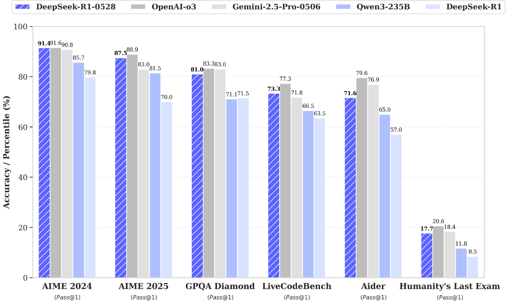

这里随手记下当天对看到的新闻、文章、视频等的想法。

## 2025 July

### 2025-07-20

- 今天写了[Claude Code 介绍](https://hobbytp.github.io/zh/claude/claude_code/)，并把它和Kimi K2模型关联了起来，准备关联更多的MCP server，然后对比一下Claude Code，Cursor，Gemini Code的优劣。

### 2025-07-04

- 今天读了[Reflect, Retry, Reward: 大型语言模型的自我进化新范式](https://hobbytp.github.io/zh/papers/Reflect_Retry_Reward_RL_Finetunning/)，这篇论文的结论是：通过“反思、重试、奖励”方法在微调过程中通过自我反思和强化学习，实现LLM在缺乏外部监督和特定任务数据情况下的自我改进。

### 2025-07-01

- 今天读了[深度研究智能体：系统性审查与路线图](https://hobbytp.github.io/zh/papers/deep_research_agents_sys_exam_roadmap/)，这篇论文的结论是：**深度研究智能体（DR）是基于大型语言模型（LLMs）的智能体，能够通过结合动态推理、自适应长时规划、多跳信息检索、迭代工具使用以及生成结构化分析报告来处理复杂的、多轮的信息研究任务**。

## 2025 June

### 2025-06-30

百度开源了他的第一个开源大模型ERNIE4.5。Tech Report: [我对百度开源500B大模型ERNIE4.5的技术报告的解读](https://hobbytp.github.io/zh/baidu/ernie4.5_open_now/)

### 2025-06-29

以下是当前业界对Claude Code、OpenAI CodeX和Gemini CLI三大AI编程工具的评价对比，综合技术能力、用户口碑、性价比及适用场景分析：

**技术能力与核心优势对比**

| **工具**       | **技术亮点**                                                                 | **主要短板**                               |
|----------------|-----------------------------------------------------------------------------|------------------------------------------|
| **Claude Code** | - 深度代码库理解能力，支持跨文件协调修改和复杂重构<br>- 终端原生集成，自动化Git操作（提交、PR、冲突解决）<br>- 混合推理模式（快速响应+深度思考），SWE-bench测试解决率70.3% | 学习曲线陡峭，订阅成本高（Max套餐约¥1600/月） |
| **OpenAI CodeX** | - 代码生成质量稳定，GitHub Copilot的底层引擎<br>- 支持多种审批模式，代码可控性强 | 功能创新不足，缺乏多模态和终端深度集成 |
| **Gemini CLI**  | - **100万Token上下文窗口**，支持多模态输入（图像、PDF）<br>- **开源免费**（Apache 2.0），每分钟60次，每日1000次免费请求<br>- 原生支持Windows，集成MCP协议扩展功能 | 早期版本稳定性不足（内存泄漏问题），没有cursor好用。但是前景光明。 |

### 2025-06-17

AI的越来越强大，将成为越来越大的杠杆，想不被拉下，需要尽早使用AI，并不断提升自己的技能水平。

### 2025-06-16

MiniMax 推出了他们的首个推理模型：MiniMax M1，这是继 DeepSeek R1 之后第二款最智能的开放权重模型，拥有更长的 100 万个标记的上下文窗口。

- M1 基于其于 2025 年 1 月 14 日发布的 Text-01 模型——这是一个拥有总计 4560 亿参数和 459 亿活跃参数的混合专家模型。这使得 M1 的总参数数量小于 DeepSeek R1 的 6710 亿参数，但大于 Qwen3 的 2350 亿 - 220 亿。Text-01 和 M1 均仅支持文本输入和输出。
- MiniMax M1 80K 在人工智能分析指数上得分为 63 分。这落后于 DeepSeek R1 0528，但略高于阿里巴巴的 Qwen3 235B-A22B 和 NVIDIA 的 Llama 3.1 Nemotron Ultra。MiniMax M1 提供两个版本：M1 40K 和 M1 80K，分别提供 40k 和 80k 的令牌思考预算。
- MiniMax 披露，他们使用 512 块 H800 GPU 对 Text-01 进行了为期三周的完整强化学习训练（非预训练）以创建 M1，这相当于 53 万美元的租赁成本。

### 2025-06-12

- 今天读了[阿里云AI搜索Agentic RAG技术实践](https://mp.weixin.qq.com/s/QmvhG__82zhlAHvjRKkLrg)，这篇论文描述的RAG技术演进之路具有普遍性。而我认为，Agentic RAG 2.0 虽然和Deep Research有一定相似之处，但是前者是“工程驱动的智能协作”，而后者的目标“智能驱动的自我进化”，目标上有差异，但技术上有相互借鉴之处。

### 2025-06-11

今天找了一题给不同的推理模型做，答案是D是酸，A是碱。只有Gemini 2.5 pro, Cloud 3.7 Sonnet Thinking, 元宝R1 答对.奇怪的是DS R1在推理了非常非常非常久后，得出了错误答案，但是元宝R1却答对了。

```note
实验室中有五种无色液体：A、B、C、D、E。已知条件：

    ​A 和 B 混合​ → 产生蓝色沉淀；
    ​B 和 C 混合​ → 无反应；
    ​C 和 D 混合​ → 溶液变红色；
    ​D 和 E 混合​ → 生成无色气体；
    ​A 和 E 混合​ → 无反应。

其中一种液体是酸，一种是碱，其余三种为中性物质。

​问题​：请推断哪种液体是酸？哪种是碱？并解释推理过程。
```

| 模型 | 酸 | 碱 |
|------|----|----|
| O3/4O | D | E |
| G-2.5p | D | A |
| Claud-37T | D | A |
| Grok3 | D | B |
| R1 | D | B |
| 元宝R1 | D | A |

### 2025-06-10

互联网女王”Mary Meeker的AI趋势报告，<https://www.bondcap.com/reports/tai>

### 2025-06-05

- 今天读了[General agents need world models](https://hobbytp.github.io/zh/papers/agents_need_world_models/)，这篇论文的结论是：**智能体本身就是世界模型**。

### 2025-06-04

- 今天读了[OmniThink: Expanding Knowledge Boundaries in Machine Writing through Thinking](https://hobbytp.github.io/zh/papers/OmniThink/)，这篇论文的结论是：**OmniThink 是一个基于信息树和概念池的“慢思考”方法，旨在解决机器写作中的知识边界扩展问题**。

### 2025-06-03

- 最近一直在对比各种DeepResearch开源项目实现是如何实现“Deep”和“Research”的。

## 2025 May

### 2025-05-31

通义灵码 AI IDE 正式上线，深度适配千问3大模型，集成智能编码助手功能，支持自动记忆和工程感知，提升开发者编程效率和体验。支持 MCP 协议，覆盖 3000 多个 MCP 服务，满足多场景开发需求，如快速创建地图类应用。[link](https://mp.weixin.qq.com/s/hpIWifxXo-UfxvtqboNmpw)

### 2025-05-30

最新公布的DeepSeek R1-0528 非常不错。


| Category | Benchmark (Metric)                       | DeepSeek R1 | DeepSeek R1 0528 |
|----------|------------------------------------------|-------------|------------------|
| General  | MMLU-Redux (EM)                         | 92.9        | 93.4             |
|          | MMLU-Pro (EM)                           | 84.0        | 85.0             |
|          | GPQA-Diamond (Pass@1)                   | 71.5        | 81.0             |
|          | SimpleQA (Correct)                      | 30.1        | 27.8             |
|          | FRAMES (Acc.)                           | 82.5        | 83.0             |
|          | Humanity's Last Exam (Pass@1)           | 8.5         | 17.7             |
| Code     | LiveCodeBench (2408-2505) (Pass@1)      | 63.5        | 73.3             |
|          | Codeforces-Div1 (Rating)                | 1530        | 1930             |
|          | SWE Verified (Resolved)                 | 49.2        | 57.6             |
|          | Aider-Polyglot (Acc.)                   | 53.3        | 71.6             |
| Math     | AIME 2024 (Pass@1)                      | 79.8        | 91.4             |
|          | AIME 2025 (Pass@1)                      | 70.0        | 87.5             |
|          | HMMT 2025 (Pass@1)                      | 41.7        | 79.4             |
|          | CNMO 2024 (Pass@1)                      | 78.8        | 86.9             |
| Tools    | BFCL_v3_MultiTurn (Acc)                 | -           | 37.0             |
|          | Tau-Bench (Pass@1)                      | -           | 53.5(Airline)/63.9(Retail) |

| Model                         | AIME 24 | AIME 25 | HMMT Feb 25 | GPQA Diamond | LiveCodeBench (2408-2505) |
|-------------------------------|---------|---------|-------------|--------------|---------------------------|
| Qwen3-235B-A22B               | 85.7    | 81.5    | 62.5        | 71.1         | 66.5                      |
| Qwen3-32B                     | 81.4    | 72.9    | -           | 68.4         | -                         |
| Qwen3-8B                      | 76.0    | 67.3    | -           | 62.0         | -                         |
| Phi-4-Reasoning-Plus-14B      | 81.3    | 78.0    | 53.6        | 69.3         | -                         |
| Gemini-2.5-Flash-Thinking-0520| 82.3    | 72.0    | 64.2        | 82.8         | 62.3                      |
| o3-mini (medium)              | 79.6    | 76.7    | 53.3        | 76.8         | 65.9                      |
| DeepSeek-R1-0528-Qwen3-8B     | 86.0    | 76.3    | 61.5        | 61.1         | 60.5                      |

### 2025-05-29

学习需要结合从上到下的整体理解和从下到上的基础夯实，是一个动态的过程，在不同场景中灵活切换——有时先从上到下（如程序员熟悉新开源代码），有时先从下到上（如学生掌握相对论），有时是以一个为主，另一为辅等等，以实现更有效的知识掌握和应用。

### 2025-05-27

- 微软/Meta/OpenAI Distinguished Engineer- Philip Su访谈, 可以看[这里](https://hobbytp.github.io/zh/interviews/Philip_Su/)
-

### 2025-05-22

- 我给Google IO 2025做了个[总结](https://hobbytp.github.io/zh/google/google_io_2025/)
- Google Deep Research新提供了几个功能：用户可以将自己的文件上传到DR平台，并通过在 Canvas 中将它们转化为互动内容、测验、音频概述等，让你的报告更具沉浸感。后面考虑写一篇使用Deep Research的教程。

### 2025-05-21

“Vibe Coding”（“氛围编程”）指的是一种使用 AI 模型进行软件开发的方式，在这种方式下，开发者更关注高层级的需求和意图，而不太关心底层的技术实现细节。与传统的编程相比，Vibe Coding 更侧重于通过自然语言与 AI 交流，让模型生成大部分代码，开发者主要关注结果是否符合预期。这使得非专业开发者也能参与软件创建，实现个人实用程序。然而，这种方式也存在挑战，因为生成的代码可能对 Vibe Coder 来说是黑箱，难以理解和修改底层逻辑。

### 2025-05-20

### 2025-05-18

对于动物图片的识别，AI为什么需要大量的数据才能学会，而不像人一样通过少量的数据就能学会？比如你教小baby认猫，只需要给他看几张图片，听你说，他就学会了，下次见到即使不一样的猫，他也能认出来。但是AI必须通过大量的数据（大量的猫的照片）才能学会。我今天的一个想法是，深度模型的参数很多，所以它对一个事物所能提供的“Feature（特征）”也多，这些特征往往是人类不可知的，但是它却能通过这些“暗”特征来识别事物，大模型能把整个人类知识囊括到大模型这个超大“函数”里，这个“暗feature解构能力功不可没，但也从另一方面导致了，它想认识一个事物，仅凭几张图片是不行的，因为不足以生成“暗”特征。也就是说，它缺少了“归纳”的能力，它只能根据已有的数据来识别事物，而不能根据事物之间的关联来识别。人类的大脑经过多年的进化，已经具备了“归纳”，也就是浓缩主要信息，并根据主要信息来在不同的对象之间快速建立联系来达到认识相似的事物的能力，所以人类只需要少量的数据就能学会一个新事物。

### 2025-05-17

### 2025-05-16

### 2025-05-15

Grok告诉我：“微软近期裁员 6000 人的最根本原因在于通过裁员来控制成本、提高运营效率，同时继续在人工智能领域大力投入。”

### 2025-05-14

Devin 的 [deepwiki](https://deepwiki.com/) 是一款非常出色的 AI 网页工具，它能够根据 GitHub 仓库自动生成相关的知识库文档，并为用户提供一个名为 “DeepResearch” 的问答窗口，方便高效地检索和交流技术内容。

### 2025-05-13

在2025年4月的最新模型（o3、GPT-4.1）上，医生参考AI输出后，已无法进一步提升AI答案，在医疗安全场景下，“最差表现”比“平均表现”更关键。提升极端case下的稳健性，将是下阶段AI医疗模型优化的重心。(参考[OpenAI HealthBench](https://openai.com/index/healthbench/))

### 2025-05-12

从红杉资本2025 年 AI 峰会的上获得的一些思考

- Agent经济：Agent as a Service将替代SaaS。软件的合作将变成Agent之间的合作。Agent不仅在软件层面，更会在物理层面操作现实世界的设备。商业模式从卖“工具”转向卖“成果”,卖“Agent”劳动力。物理层面也需要“图灵测试”和“物理API”，具身智能的标准化需要提到日程。
- Agent技术：RL将在Agent的世界继续发扬光大，Deep Research的下一步是科学原创，比如发现广义相对论级别的科学理论。另外多Agent的协作和安全需要新技术的加持。
- 基础模型：当前的pre-train模型在数据用尽的情况下基本到头，需要新的模型技术突破。
- 基础设施加大投资：在Agent经济不断扩大的前提下，推理需要的硬件将继续增长。
