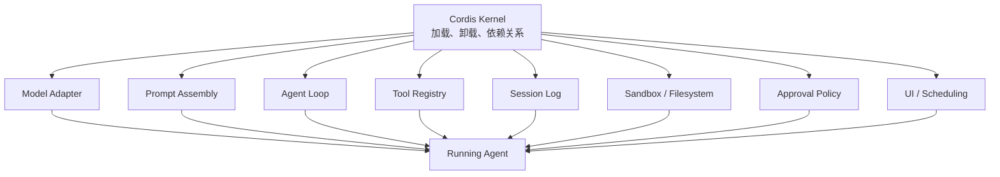
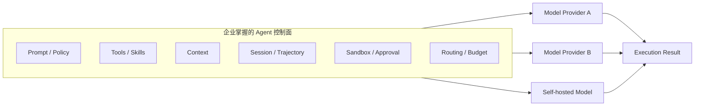

> **摘要：**当 Harness 变成可冻结、可替换、可追踪的实验变量，AI Agent 行业的记分牌可能必须重写。
>
> **事实截止日期：2026 年 8 月 20 日**
>
> **源码快照：**[`deepseek-ai/deepseek-harness@141eb6fef83422698aef7a981029e843e8161534`](https://github.com/deepseek-ai/deepseek-harness/tree/141eb6fef83422698aef7a981029e843e8161534)
>
> **项目版本：**`0.1.0-rc.8`
>
> **证据边界：**本文基于官方文档、固定 commit 源码、竞争产品官方材料和两篇 2026 年预印本研究完成。本文没有执行 DeepSeek Harness 运行实验，因此所有涉及实际性能、可靠性和企业采用的内容均不声称为作者实测。项目仍处于 developer preview，官方明确提示将出现兼容性破坏。

---

## 引入：我们可能一直把 Agent 的成绩记错了账

DeepSeek Harness 发布后，最容易出现的讨论是：

- 它会不会取代 Claude Code？
- 它是不是 DeepSeek 版 Codex？
- “Everything is a Plugin”到底先进在哪里？
- 短时间内极高的 GitHub 热度是否意味着新的行业标准已经诞生？

这些问题都没有完全抓住重点。

截至本文事实截止时间，[DeepSeek Harness 的 GitHub 仓库](https://github.com/deepseek-ai/deepseek-harness)已经显示出极高的关注度。但 Star 和 Fork 只能说明传播速度与开发者注意力，不能证明持续使用、生产可用、企业采用或插件生态已经成熟。

我认为，DeepSeek Harness 更值得关注的地方，不是它增加了多少工具，也不是它能否立即在产品体验上战胜 Claude Code 或 Codex，而是它可能动摇了 AI 行业长期以来的一种默认“记账方式”：

> **我们习惯把一个 Agent 系统完成任务的成绩，主要记在模型名下；但真正执行任务的，始终是 Model 与 Harness 共同组成的系统。**

DeepSeek Harness 将模型适配器、系统提示词、工具注册、Agent Loop、会话状态、沙箱、上下文注入、调度和 UI 都放进同一套可组合插件体系，并用会话事件流记录模型实际看到的上下文和工具交互。这使得 Harness 不再只是产品内部难以观察的实现细节，而开始成为一个可以声明、冻结、替换、比较和审计的工程变量。

如果这条路线能够走向稳定，DeepSeek Harness 最深远的影响可能不是诞生一个新的 Coding Agent，而是推动行业完成三次转变：

1. 评测单位从“模型”转向“模型 × Harness 配置”；
2. 企业采购对象从单一模型 API 转向自己掌握的 Agent 控制面；
3. 厂商竞争从单纯争夺模型能力，转向模型与 Harness 的协同优化、运行轨迹和生态控制权。

这是一场关于**能力归因权**的竞争。

---

## 一、先纠正一个误区：DeepSeek 并没有发明 Harness

Harness 并不是 DeepSeek 首次提出的概念。

OpenAI [公开说明](https://openai.com/index/unlocking-the-codex-harness/)，Codex 的 Web、CLI、IDE 和 macOS 等不同入口，底层使用的是同一套 Codex Harness。其 Harness 不只是调用模型的循环，还负责线程生命周期与持久化、配置与认证、工具执行、沙箱、MCP 和 Skills 等能力。Codex App Server 则通过双向 JSON-RPC，把这套 Harness 暴露给不同客户端。

Anthropic 也[明确表示](https://www.anthropic.com/news/apple-xcode-claude-agent-sdk)，Claude Agent SDK 暴露的是 Claude Code 使用的同一套底层 Harness；Xcode 26.3 的 Claude 集成因此能够获得子 Agent、后台任务和插件等完整能力。

Google 早在 2025 年就[开源了 Agent Development Kit](https://developers.googleblog.com/agent-development-kit-easy-to-build-multi-agent-applications/)。ADK 覆盖工具、状态、工作流、多 Agent 编排、轨迹检查、评测和部署，并支持多种模型。

因此，将 DeepSeek Harness 描述成“第一个开源 Agent Harness”，在事实层面并不成立。

它真正不同的地方，是**开放边界和内部拆分粒度**。

| 系统 | 官方材料重点开放了什么 | 主要组织方式 |
|---|---|---|
| OpenAI Codex | 同一套成熟 Harness 的客户端接入面和 SDK | 统一 Harness，通过 App Server、SDK、CLI 等入口复用 |
| Claude Agent SDK | Claude Code 的底层 Agent 能力 | 将成熟的 Claude Code Harness 嵌入其他产品 |
| Google ADK | Agent 和多 Agent 应用开发框架 | 以代码定义 Agent、工具、编排、评测和部署 |
| DeepSeek Harness | 模型、Loop、工具、会话、沙箱、存储、调度和 UI 的内部组合边界 | Cordis 插件树、Profile、Bundle、Patch 和事件流 |

上表并不代表 DeepSeek Harness 已经优于其他系统。它说明的是：Codex 和 Claude Agent SDK 更强调把一套经过协同优化的 Harness 复用到多个产品中；Google ADK 更接近应用开发框架；DeepSeek Harness 则试图把 Harness 自身进一步拆成可声明、可动态组合的能力树。

这不是 Harness 类别的发明，而是对 Harness **内部可分解性**的一次更激进表达。

---

## 二、AI Agent 行业长期存在一笔“错账”

一个模型能回答问题，并不意味着它能够稳定地完成工程任务。

一个 Coding Agent 的实际输出至少同时受到以下变量影响：

```text
Outcome = f(Model, Prompt, Tools, Loop, Context, Sandbox, Policy, Budget, Environment)
```

其中：

- **Model** 决定推理、编码和工具调用的基础能力；
- **Prompt** 决定角色、约束和工具使用策略；
- **Tools** 决定 Agent 能看到什么、修改什么；
- **Loop** 决定何时继续、重试、验证或停止；
- **Context** 决定历史消息、文件、摘要和运行信息如何进入模型；
- **Sandbox** 决定命令执行环境、权限和依赖；
- **Policy** 决定审批、拦截和风险控制；
- **Budget** 决定最大步骤、Token、超时和成本；
- **Environment** 决定仓库状态、网络、操作系统和测试条件。

过去，这些变量通常被封装在产品内部。榜单上最终展示的却往往只是一个模型名称和一个通过率。

这会产生三个问题。

### 1. 模型获得了不完全属于它的功劳

当某个 Agent 更善于搜索文件、控制上下文、调用测试、识别失败并及时停止时，成绩可能主要来自 Harness，但外部用户仍然倾向于把结果理解为“某模型更聪明”。

### 2. 模型也可能承担不完全属于它的责任

一个模型在 Harness A 中不断重复读取文件、浪费上下文，在 Harness B 中却可以快速完成任务。若评测只报告模型名称，Harness 的空转、错误重试或上下文膨胀就会被错误归因给模型。

### 3. 企业无法知道自己真正应该购买什么

企业看到的可能是“模型 A 比模型 B 高五个百分点”，却不知道：

- 模型 A 是否消耗了数倍 Token；
- 是否依赖特殊系统提示词；
- 是否有更强的测试与验证 Loop；
- 是否使用了更多工具或私有索引；
- 是否需要更高的人工监督成本；
- 换一个 Harness 后优势是否仍然存在。

2026 年的两项早期研究已经开始量化这种影响。

[《The Scaffold Effect in Coding Agents》](https://arxiv.org/abs/2607.22585)在两个模型、三个开源 Harness 和 50 个 Terminal-Bench Pro 任务上进行对照，报告不同 Harness 在每个已解决任务的 Token 消耗上最高相差约 40 倍，而同一模型的通过率差异为 0—8 个百分点。论文同时指出，Harness 会形成相对稳定的失败模式，例如空转、超时、验证失败或过早停止。不过，该研究样本仅有 50 个任务，部分通过率差异的置信区间包含零，不能外推到所有模型和商业 Agent。

另一篇预印本 [Harness-Bench](https://arxiv.org/abs/2605.27922) 使用 106 个离线任务和 5,194 条执行轨迹，也观察到不同 Model-Harness 组合在完成率、过程质量、效率和失败行为方面存在明显差异，并建议在配置级别报告 Agent 能力，而不是只把结果归因给基础模型。

这些研究尚不能证明 DeepSeek Harness 本身一定会提高性能，但它们支持了一个更基础的判断：

> **模型名称不是 Agent 能力的完整计量单位。**

DeepSeek Harness 的行业意义，正是在这个时间点把 Harness 这个长期被忽略的变量，完整地摆到了桌面上。

---

## 三、DeepSeek Harness 如何把“隐形变量”变成显式变量

DeepSeek Harness 官方提出“Agent = Model + Harness”和“Everything is a Plugin”。单看口号并不足以得出行业结论，真正重要的是这些口号在实现层面对应了什么。

### 1. Cordis 内核不承载具体 Agent 能力

按照[固定 commit 的官方架构文档](https://github.com/deepseek-ai/deepseek-harness/blob/141eb6fef83422698aef7a981029e843e8161534/docs/architecture.md)，Cordis 提供服务、类型化事件和可回收注册等基础机制。模型适配器、工具注册表、会话日志和 Agent Loop 本身都作为插件挂载；扩展系统时，原则上不需要修改一个承载全部业务能力的特权核心。

这使系统结构更接近：



这张图的重点不是“插件很多”，而是模型、Loop、工具和会话不再天然绑定为一个不可拆分的产品黑盒。

### 2. 运行中的 Agent 是一棵可导出的插件树

DeepSeek Harness 使用 Profile、Bundle 和 Patch 组合运行时：

- Profile 定义一个命名组合；
- Bundle 分发一组 Cordis 配置和相应代码；
- Patch 覆盖或插入具体配置行；
- 多个层按顺序合成为最终插件树。

官方文档给出了导出实际启动配置的命令：

```bash
dsh --profile web --dump-config
```

该命令的价值不只是排障。它意味着一个 Agent 的实际 Harness 有机会被固化为可比较的配置产物：使用了什么模型适配器、什么工具、什么沙箱、什么审批策略、什么 Loop，可以在原则上被明确登记，而不是只写一句“使用某模型完成测试”。

### 3. 模型上下文和执行轨迹来自同一份事件流

DeepSeek Harness 把 `SessionEvent` 日志作为生成模型上下文的来源。Turn、Step、用户消息、模型输出、工具调用和结果等持久事件被记录下来；Resume、Fork、Trajectory、Telemetry 和 Replay 等能力也建立在这条事件流之上。

这带来了一个关键能力：评测者不仅能看最终答案，还能观察 Agent **如何到达这个答案**。

例如：

- 模型在第几步获得了哪个文件；
- 系统提示词和工具 Schema 是什么；
- Agent 是否重复调用无效工具；
- 测试失败后是否真正读取了错误输出；
- 上下文压缩是否丢失了关键约束；
- Agent 是主动验证后停止，还是达到预算后被迫终止。

这里必须明确一个边界：

> **仅追加的会话日志不等于不可篡改的安全审计日志。**

它有利于重放和分析，但若要满足企业合规审计，还需要签名、访问控制、外部存证、保留策略和敏感信息治理。官方目前证明的是事件组织和可追踪机制，不是完整的安全审计体系。

### 4. Minimal Mode 提供了一个接近“实验对照组”的配置

DeepSeek Harness 的 Minimal Mode 不是简单的“精简界面”。其[固定配置](https://github.com/deepseek-ai/deepseek-harness/blob/141eb6fef83422698aef7a981029e843e8161534/apps/cli/config/agent-presets/minimal/agent.cordis.yml)使用完整系统提示词，只保留持久 Shell 和 `str_replace_editor` 两个工具，不加入运行时上下文快照，也不进行上下文压缩。

这意味着 DeepSeek Harness 已经隐含了一种值得行业重视的设计思想：

> **复杂 Agent 用于完成任务，最小 Agent 用于识别变量。**

Standard、PTC、Minimal 和 Creator 不是单纯的功能套餐。它们使同一个模型可以在不同 Harness 组合下运行，从而观察工具数量、执行方式、上下文策略和 Agent Loop 对结果的影响。

至此，DeepSeek Harness 的技术路径与行业影响之间才真正形成因果联系：

```text
Harness 能力插件化
        ↓
运行配置可以显式导出
        ↓
会话轨迹可以重放和分析
        ↓
同模型、不同 Harness 更容易进行受控比较
        ↓
模型成绩与 Harness 成绩开始被分别归因
        ↓
评测、采购和厂商竞争方式发生变化
```

---

## 四、第一重冲击：模型排行榜需要升级为 Model × Harness 账本

当前很多 Agent 榜单的典型行结构是：

| 模型 | 任务通过率 |
|---|---:|
| Model A | 62% |
| Model B | 58% |

这类表格隐含了一个假设：除了模型之外，其他变量相同，或者其他变量不重要。

对于真实 Agent 系统，这个假设经常不成立。

更合理的评测单元应当是：

```text
Evaluation Unit = Model × Harness × Environment × Budget
```

评测至少应公开：

- 模型及其精确版本；
- Harness 项目、版本和 commit；
- Profile 或 Agent preset；
- 系统提示词摘要或哈希；
- 工具列表与 Schema；
- 沙箱镜像和权限；
- 上下文压缩策略；
- 最大步骤、超时和 Token 预算；
- 网络状态；
- 会话轨迹或可验证摘要；
- 成功率、成本、延迟、失败类型和人工监督量。

下面是一份概念性的评测清单。它不是 DeepSeek Harness 官方配置格式，而是基于其可导出配置和会话轨迹能力提出的实验记录建议：

```yaml
# 概念性评测清单，不是 DeepSeek Harness 官方 API 或配置格式
experiment:
  task_set: terminal-bench-pro
  task_set_version: "<fixed-version>"

  model:
    provider: "<provider>"
    name: "<exact-model-id>"
    sampling_digest: "<sha256>"

  harness:
    project: deepseek-harness
    commit: "141eb6fef83422698aef7a981029e843e8161534"
    profile: minimal
    config_digest: "<sha256-of-dumped-config>"

  environment:
    image_digest: "<container-image-digest>"
    network: disabled
    workspace_digest: "<sha256>"

  budget:
    timeout_seconds: 900
    max_steps: 40
    token_limit: "<declared-limit>"

  evidence:
    session_log_digest: "<sha256>"
    final_artifact_digest: "<sha256>"
    validator_output: "<path>"
```

评测设计也应该从一维排行榜改成二维矩阵：

|  | Harness A | Harness B | Harness C |
|---|---:|---:|---:|
| Model 1 | 结果 | 结果 | 结果 |
| Model 2 | 结果 | 结果 | 结果 |
| Model 3 | 结果 | 结果 | 结果 |

这样可以分别观察：

- **固定 Harness，替换 Model**：主要测模型差异；
- **固定 Model，替换 Harness**：主要测 Harness 差异；
- **Model 与 Harness 一起变化**：测完整产品系统；
- **交互项**：识别某个模型是否特别适合某种工具、Prompt 或 Loop。

可以把这种关系概念化为：

```text
Performance = α(Model) + β(Harness) + γ(Model × Harness) + ε
```

其中最容易被行业忽略的，恰恰是 `γ(Model × Harness)`：模型与 Harness 之间的协同效应。

DeepSeek Harness 不会自动解决评测公平性问题，但它提供了一种更容易冻结和检查 Harness 配置的架构。这可能迫使 Agent 榜单回答一个过去经常被回避的问题：

> 这究竟是模型的成绩、Harness 的成绩，还是特定组合的成绩？

---

## 五、第二重冲击：企业真正需要拥有的，可能不是模型，而是 Agent 控制面

在传统模型 API 使用方式中，企业主要选择：

- 哪个模型；
- 什么价格；
- 多长上下文；
- 多快的响应；
- 数据是否合规。

进入 Agent 阶段后，真正决定系统能否生产落地的内容变得更多：

- Agent 可以调用哪些工具；
- 工具运行在哪里；
- 哪些操作需要审批；
- 文件、网络和 Shell 有什么权限；
- 上下文如何构建和压缩；
- 任务失败如何恢复；
- 会话如何持久化；
- 执行轨迹如何记录；
- 模型供应商如何替换；
- 成本和延迟如何控制。

这些能力可以统称为企业的 **Agent Control Plane——Agent 控制面**。

它并不是 DeepSeek 官方术语，而是本文对产业层次的抽象：



DeepSeek Harness 的 capability seam 将一种能力拆成接口定义、Provider 和 Consumer。官方文档举例说明，文件系统和子进程 Provider 可以共享一个执行环境；将它们指向远程沙箱后，Shell、PTY 和 LSP 等消费者可以随之迁移，而不需要分别 Fork 每个消费者。

这类边界设计对企业的潜在意义不是“少写几行代码”，而是让企业有机会掌握以下资产：

1. **工具和业务系统接入层**
   企业内部 API、数据库、CI/CD、工单和运维系统不必完全绑定某个模型产品。

2. **执行与权限策略**
   模型负责提出动作，但权限、审批、沙箱和命令执行仍由企业控制。

3. **会话和运行轨迹**
   企业可以积累哪些任务容易失败、哪些工具经常误用、哪些 Prompt 和 Loop 更有效。

4. **模型路由权**
   不同任务可以根据能力、成本、延迟和数据要求选择不同模型。

从价值链角度看，这可能把企业的采购对象从：

```text
购买一个更强的模型 API
```

逐步转变为：

```text
建设一个自己掌握的 Agent 控制面
+
按任务采购模型能力
```

这将削弱模型厂商对 Agent 运行时的完全控制，但不意味着模型会变成毫无差异的商品。

因为“技术上可以替换”不等于“语义上可以零成本替换”。

不同模型可能需要不同的：

- 系统提示词结构；
- Tool Schema；
- 推理内容传递方式；
- 并发策略；
- 上下文压缩方式；
- 错误恢复机制；
- 最大步骤和停止条件。

因此，DeepSeek Harness 最多降低**基础设施层面的替换阻力**，不能自动消除模型与 Harness 的协同适配成本。

---

## 六、第三重冲击：开放 Harness 不一定削弱垂直整合，反而可能证明它的价值

这里存在一个容易被忽略的反直觉结论：

> **Harness 越透明，行业越可能发现某些模型只有在特定 Harness 中才能发挥最佳能力。**

OpenAI [公开说明](https://openai.com/index/gpt-5-system-card-addendum-gpt-5-codex/)，GPT‑5‑Codex 针对 Codex 中的 agentic coding 做了优化；其后续材料又把模型、推理系统与 agentic harness 的共同改进列为效率来源。这些材料支持“完整系统需要协同优化”的判断，但不能证明某一种开放或封闭路线天然更优。

这说明先进 Agent 的竞争已经不是：

```text
模型 A 对模型 B
```

而更接近：

```text
模型 A × Harness A
对
模型 B × Harness B
```

DeepSeek Harness 通过开放和分解变量，可能产生两种相反的产业力量。

### 力量一：推动横向开放

企业和开发者可以尝试：

- 在同一 Harness 中切换不同模型；
- 替换 Agent Loop；
- 替换沙箱；
- 比较不同上下文策略；
- 自己积累会话轨迹；
- 将业务插件保留在企业控制范围内。

这有利于形成开放的 Agent 基础设施层。

### 力量二：强化纵向协同优化

当 Harness 变量被显式测量后，厂商可能更容易证明：

- 自家模型和自家工具 Schema 配合更好；
- 自家上下文管理能显著降低 Token；
- 自家 Loop 对特定失败模式有专门训练；
- 自家沙箱和验证系统能够提高任务完成率；
- 自家模型经过了针对 Harness 行为的强化学习。

结果未必是所有模型都运行在同一套通用 Harness 上。

更可能出现的是一个双轨市场：

| 市场路线 | 核心价值 | 典型用户 |
|---|---|---|
| 开放、可组合 Harness | 控制权、可审计、多模型、深度定制 | 企业平台团队、基础设施团队、研究机构 |
| 模型与 Harness 垂直整合 | 体验、协同优化、低运维、快速交付 | 普通开发者、追求生产效率的团队 |

因此，DeepSeek Harness 对 Codex 和 Claude Code 的真正压力，可能不是“立即替代”，而是迫使闭源或半开放系统更清楚地回答：

- 哪些能力可以通过 SDK 或协议暴露？
- 哪些轨迹可以导出？
- 模型能否在其他 Harness 中运行？
- Harness 能否连接其他模型？
- 企业如何保留自己的工具、策略和数据？
- 客户被锁定的是模型、运行时，还是整个工作流？

[Codex App Server](https://openai.com/index/unlocking-the-codex-harness/) 已经通过稳定的双向协议暴露完整 Harness，[Claude Agent SDK](https://www.anthropic.com/news/apple-xcode-claude-agent-sdk) 也把 Claude Code 的 Harness 带入 Xcode。这说明 Harness 开放并非 DeepSeek 单方面推动的趋势，而是多个厂商已经进入的竞争层。DeepSeek Harness 的作用更像是将这种竞争进一步推进到内部组件和插件树层面。

---

## 七、真正可能形成护城河的，不只是插件，而是运行轨迹

“Everything is a Plugin”很容易让人把关注点放在插件市场上。

但插件通常可以被复制。更难复制的，是长期积累的运行轨迹：

- 哪种任务在哪一步最容易失败；
- 哪些工具调用顺序更有效；
- 哪类错误应该继续重试；
- 哪类错误应该及时停止；
- 哪些文件和日志对特定任务最有信息量；
- 哪种上下文压缩会丢失关键约束；
- 哪些操作需要人工审批；
- 哪个模型适合哪个任务和预算。

这些数据可以反过来用于：

- 优化 Agent Loop；
- 调整系统提示词；
- 改进工具 Schema；
- 训练路由器；
- 建立失败分类器；
- 设计验证器；
- 构造强化学习和微调数据。

DeepSeek Harness 将模型可见上下文和工具交互放入统一会话事件流，使轨迹分析成为架构的核心组成部分，而不是后期附加的日志功能。

由此可以得到本文最重要的产业判断之一：

> **下一阶段 Agent 平台的核心资产，可能不是“接入了多少模型”，而是谁掌握了真实任务中的高质量运行轨迹，以及谁能据此持续优化 Model-Harness 组合。**

这也意味着，企业采用 Harness 时不应只比较功能列表，而应重点判断：

- 轨迹是否完整；
- 事件语义是否稳定；
- 是否能安全导出；
- 是否能跨版本回放；
- 是否能关联成本和成功标准；
- 是否支持敏感信息脱敏；
- 是否能形成组织级的失败知识库。

DeepSeek Harness 在架构上提供了有价值的起点，但 developer preview 阶段还不足以证明它已经具备完整的企业轨迹治理能力。

---

## 八、为什么这场冲击可能最终没有发生

任何“行业冲击”论证都必须同时解释它为什么可能失败。

### 1. API 不稳定可能抵消开放收益

官方明确说明 DeepSeek Harness 仍处于 developer preview，存在兼容性破坏。企业真正关心的不只是能否扩展，还包括升级成本、长期维护、版本迁移和插件兼容。

### 2. 插件化不等于互操作标准

两个插件都叫“模型适配器”，并不意味着它们具有相同的推理内容、工具调用、缓存和错误语义。DeepSeek Harness 首先是自己的插件体系，不是跨 Harness 的行业标准。

### 3. 可替换不等于替换后效果不变

配置层能够切换 Model Provider，只能证明替换路径存在，不能证明：

- Prompt 无需修改；
- 工具调用仍然稳定；
- 成本不变；
- 通过率不变；
- 风险策略不变。

### 4. 开放插件生态会扩大供应链攻击面

插件可能接触文件系统、Shell、网络、凭据和模型上下文。若缺少签名、权限清单、隔离、来源验证和安全更新机制，“Everything is a Plugin”也可能变成“每个插件都是潜在高权限依赖”。

### 5. 用户可能更在意完整体验，而不是架构纯度

多数开发者并不想自己维护模型路由、沙箱、Prompt、上下文和插件兼容。他们愿意为成熟、稳定、低配置的垂直产品付费。

### 6. 极高热度可能只是品牌与发布效应

Star、Fork 和社交讨论可以证明项目迅速吸引了注意力，却不能证明：

- 活跃安装量；
- 持续贡献者数量；
- 独立插件维护质量；
- 企业生产部署；
- 安全响应能力；
- 长期生态网络效应。

因此，当前最准确的表述不是“DeepSeek Harness 已经重构行业”，而是：

> **它提出了一种足以挑战模型中心叙事的架构，但这场挑战是否成功，要由版本稳定性、真实采用、受控评测和插件治理共同决定。**

---

## 九、三种可能的未来情景

| 情景 | 可能结果 | 成立条件 | 当前判断 |
|---|---|---|---|
| 低影响 | 成为有影响力的 Agent 架构参考项目，但 API 变化和生态碎片化限制生产采用 | 插件缺少长期维护；企业案例稀少；跨模型适配成本高 | 完全可能 |
| 基准情景 | 成为研究、评测和企业 AI 平台常用的开放 Harness 之一，与 Codex、Claude Agent SDK、ADK 等长期并存 | API 逐步稳定；出现高质量第三方插件；轨迹和配置工具成熟 | 最值得观察 |
| 高影响 | 其配置、事件流或能力边界成为事实标准之一，推动榜单按 Model-Harness 配置报告结果 | 大量非 DeepSeek 参与者采用；厂商发布官方适配；出现跨平台规范 | 目前证据不足 |

### 低影响情景

DeepSeek Harness 的思想被其他项目吸收，但项目自身没有形成稳定生态。它的主要贡献变成一套架构语言：让业界更认真地讨论 Harness、轨迹和插件边界。

### 基准情景

DeepSeek Harness 成为企业和研究团队构建自有 Agent 控制面的重要选择。普通开发者继续使用 Codex、Claude Code 等完整产品，而平台团队使用开放 Harness 进行模型路由、权限治理、内部工具接入和可复现实验。

### 高影响情景

第三方模型厂商主动提供 DeepSeek Harness 适配，插件作者围绕统一能力接口构建生态，评测机构开始要求提交 Harness 配置摘要和轨迹证据。此时，DeepSeek Harness 或其设计语义才可能成为事实标准的一部分。

---

## 十、未来 24 个月最值得观察的指标

### 未来 3—6 个月

- 是否从 `0.1.0-rc` 走向更稳定的版本契约；
- Profile、Bundle、Patch 和事件 Schema 是否保持兼容；
- 是否出现由独立组织长期维护的插件；
- 非 DeepSeek 模型适配是否能够持续通过测试；
- 是否发布插件权限、签名和安全治理机制；
- 是否出现公开、可复现的 Minimal Mode 对照实验。

### 未来 6—12 个月

- 是否有同一模型在不同 Harness 上的系统性受控评测；
- 是否有企业公开自托管或内部平台案例；
- 是否出现配置迁移工具和版本兼容策略；
- 是否有模型厂商提供官方 Provider；
- 是否出现基于 SessionEvent 的成熟轨迹分析、成本分析和失败分类工具；
- 是否能证明开放组合并未带来不可接受的运维负担。

### 未来 12—24 个月

- 主流 Agent 榜单是否开始报告 Model-Harness 组合；
- 是否要求提供 Harness commit、配置摘要和执行环境；
- 是否形成跨 Harness 的会话、工具或轨迹互操作格式；
- 模型厂商是否因为开放 Harness 压力而提供更完整的运行时接口；
- 企业是否把 Harness 纳入正式的 AI 平台架构和采购评估；
- DeepSeek Harness 的外部贡献者、插件维护者和治理结构是否足够分散。

这些指标比 GitHub Star 更能判断项目是否真正改变行业。

---

## 总结

DeepSeek Harness 不是第一个 Agent Harness，也没有证据表明它已经能够取代 Codex、Claude Code 或 Google ADK。

它目前最值得关注的贡献，是把模型、Prompt、工具、Agent Loop、会话、沙箱和运行轨迹放入同一套可配置插件结构，使 Harness 有机会从产品内部的隐形实现，变成可以冻结、比较和审计的显式变量。

这可能带来四个长期变化：

1. **Agent 评测的单位从模型变成 Model × Harness 配置。**
2. **企业开始建设自己掌握的 Agent 控制面，而不是只采购模型 API。**
3. **厂商竞争从单模型能力，扩展到模型与 Harness 的协同优化。**
4. **运行轨迹成为改进 Agent 和形成企业知识壁垒的重要资产。**

但目前证据只能支持“存在技术机制与早期研究信号”的行业推断，尚不能证明厂商竞争结构已经改变，更不能宣称产业重构已经完成。

因此，对 DeepSeek Harness 最准确的判断不是“它已经颠覆 AI 行业”，而是：

> **它迫使 AI 行业重新回答一个基础问题：当 Agent 完成一项任务时，成绩究竟应该记在模型、Harness，还是两者的组合名下？**

一旦行业开始认真回答这个问题，模型排行榜、Agent 采购、平台架构和厂商护城河，都可能随之改变。

---

## 附录一：技术证据与结论边界

| 文章结论 | 主要证据 | 能证明什么 | 不能证明什么 |
|---|---|---|---|
| 具体 Agent 能力采用插件组织 | 官方架构文档和源码快照 | 模型适配器、工具、会话、Loop 等处于 Cordis 插件树中 | 不能证明所有插件都成熟、稳定或安全 |
| Harness 配置可以显式导出 | Profile、Bundle、Patch 和 `--dump-config` | 运行结构可以被检查和冻结 | 不能保证跨版本完全可复现 |
| 会话事件流支持轨迹重建 | `SessionEvent`、Trajectory、Resume、Fork、Replay | 模型上下文与执行过程具有统一事件来源 | 不能证明日志防篡改或满足监管审计 |
| Minimal Mode 可用于控制 Harness 复杂度 | 固定 Prompt、双工具、无上下文压缩配置 | 提供更简单的实验基线 | 不能证明它是最公平或最优的基准 Harness |
| Harness 会影响结果和成本 | 两篇 2026 年预印本 | 提供 Harness 影响的早期定量证据 | 不能直接外推到 DeepSeek Harness 或所有商业 Agent |
| 项目受到高度关注 | GitHub 元数据 | 说明传播和开发者关注度高 | 不能证明生产采用和生态成熟 |

---

## 附录二：主要方案的开放边界对比

| 维度 | DeepSeek Harness | OpenAI Codex | Claude Agent SDK | Google ADK |
|---|---|---|---|---|
| 主要定位 | 可组合 Agent Harness | 完整 Coding Agent 与可嵌入 Harness | 将 Claude Code Harness 嵌入其他产品 | Agent 和多 Agent 应用开发框架 |
| 模型开放程度 | 模型适配器作为插件边界 | 主要围绕 Codex 和 OpenAI 模型协同优化 | 主要围绕 Claude 能力 | 支持 Gemini 及其他模型 |
| Harness 内部可替换性 | 官方重点强调所有能力插件化 | 重点强调统一 Harness 和稳定客户端协议 | 重点强调复用 Claude Code 底层能力 | 通过代码定义 Agent、工具和编排 |
| 会话与轨迹 | 统一追加式 SessionEvent 流 | Thread 生命周期、持久化和事件历史 | SDK 提供 Agent 生命周期和工具能力 | 支持状态、事件检查和轨迹评测 |
| 当前成熟度 | Developer preview | 已形成产品、SDK 和稳定 App Server 路线 | 已进入 Xcode 等产品集成 | 开源并面向生产开发 |
| 最大潜在优势 | 控制面开放与内部可组合性 | 模型-Harness 协同优化和完整体验 | Claude Code 能力复用 | 多 Agent 开发和 Google Cloud 集成 |
| 主要风险 | API 稳定性、插件治理和运维复杂度 | 供应商与完整工作流绑定 | 模型和 Harness 绑定较深 | 云生态倾向与框架复杂度 |

该表比较的是各厂商官方材料明确强调的产品边界，而不是完整功能评分。

---

## 研究方法与局限

- 本文没有实际运行 DeepSeek Harness；
- 尚无长期版本兼容数据；
- 尚无足够公开企业生产案例；
- 尚未系统统计第三方插件数量、质量和维护活跃度；
- 尚未验证不同模型在相同 DSH Profile 下的迁移成本；
- 尚未验证 SessionEvent 跨版本重放的稳定性；
- 两篇 Harness 影响研究均为 2026 年预印本；
- 竞争厂商未来可能迅速吸收类似架构能力；
- DeepSeek Harness 的社区治理和长期资源投入仍需观察。

---

## 参考来源

### DeepSeek Harness 官方项目与源码

- [DeepSeek Harness 仓库固定快照](https://github.com/deepseek-ai/deepseek-harness/tree/141eb6fef83422698aef7a981029e843e8161534)：本文分析使用的源码边界。
- [DeepSeek Harness Architecture](https://github.com/deepseek-ai/deepseek-harness/blob/141eb6fef83422698aef7a981029e843e8161534/docs/architecture.md)：Cordis、插件树、Profile、Bundle、Patch、事件流和 capability seam。
- [DeepSeek Harness `package.json`](https://github.com/deepseek-ai/deepseek-harness/blob/141eb6fef83422698aef7a981029e843e8161534/package.json)：`0.1.0-rc.8`、MIT、Node.js 与 pnpm 要求。
- [Minimal Agent Preset](https://github.com/deepseek-ai/deepseek-harness/blob/141eb6fef83422698aef7a981029e843e8161534/apps/cli/config/agent-presets/minimal/agent.cordis.yml)：固定提示词、双工具和上下文策略。
- [CLI Reference](https://github.com/deepseek-ai/deepseek-harness/blob/141eb6fef83422698aef7a981029e843e8161534/apps/cli/reference/README.md)：Profile 启动、配置层叠与 `--dump-config` 行为。

### 竞争方案官方材料

- [OpenAI：Unlocking the Codex harness](https://openai.com/index/unlocking-the-codex-harness/)：Codex Harness 与 App Server 架构。
- [OpenAI：GPT‑5‑Codex System Card Addendum](https://openai.com/index/gpt-5-system-card-addendum-gpt-5-codex/)：GPT‑5‑Codex 针对 Codex 中 agentic coding 的优化边界。
- [Anthropic：Apple’s Xcode now supports the Claude Agent SDK](https://www.anthropic.com/news/apple-xcode-claude-agent-sdk)：Claude Agent SDK 与 Claude Code 共用底层 Harness。
- [Google：Agent Development Kit](https://developers.googleblog.com/agent-development-kit-easy-to-build-multi-agent-applications/)：ADK 的开源、多模型、编排、评测与部署能力。

### 早期研究证据

- [*The Scaffold Effect in Coding Agents: Harness Choice as a Hidden Variable in Coding-Agent Evaluation*](https://arxiv.org/abs/2607.22585)，2026 年预印本。
- [*Harness-Bench: Measuring Harness Effects across Models in Realistic Agent Workflows*](https://arxiv.org/abs/2605.27922)，2026 年预印本。

> 以上网页和源码均按 2026 年 8 月 20 日的事实截止日期核对。预印本尚未经过正式同行评审，文中只将其作为“Harness 值得独立测量”的早期证据。
