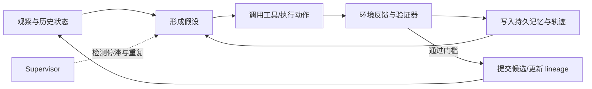

> **摘要：**NVIDIA AVO 的 100 分没有证明“模型不重要”，更没有证明 ARC-AGI-3 已被攻克。它真正揭示的是：当记忆、反馈、恢复和监督能够跨越单次上下文持续运转时，AI 能力的计量单位已经不再是一次模型调用，而是一个会积累证据的闭环系统。
>
> **事实截止日期：2026 年 8 月 23 日**
>
> **证据边界：**本文分析的是 NVIDIA 公布的 ARC-AGI-3 **25 个公开演示环境**结果和相关一手材料。该结果不属于半私有集或完全私有竞赛集；NVIDIA 也明确说明，30.16% 的模型基线与 AVO 的 100 分并非受控消融实验。

---

## 引入：100 分不是这条新闻里最重要的数字

2026 年 8 月 21 日，NVIDIA 宣布其 Agentic Variation Operators（AVO）系统使用 Claude Opus 5，在 ARC-AGI-3 的 25 个公开环境中完成全部 183 个关卡，取得 100.00 RHAE，总计使用 6,624 次环境动作。

这个结果很容易被压缩成一句极具传播力的话：

> 同一个模型裸跑只有约 30%，套上一个 Harness 就变成了 100%。

但这句话同时做了三次不严谨的跳跃：

1. 把公开演示集的满分写成了整个 ARC-AGI-3 被攻克；
2. 把不同推理设置、观察表示和评测流程下的结果当成同一实验的前后对照；
3. 把完整 Agent 系统的能力增益全部归因给 Harness，并由此推出模型 Scaling 已经失去意义。

NVIDIA 的[官方技术文章](https://developer.nvidia.com/blog/nvidia-avo-reaches-100-on-arc-agi-3-demonstrating-a-frontier-level-general-purpose-architecture-for-long-horizon-autonomous-agents/)其实比很多二次传播更克制：它明确称这不是受控消融，明确限定为 public set，也明确指出 AVO 和模型基线使用了不同 reasoning setting 与 substantially different evaluation setup。

因此，这个事件真正值得讨论的问题不是“Harness 是否战胜了大模型”，而是：

> **为什么同一个基础模型，一旦被放进能够持久积累状态的执行系统，就会表现得像另一种能力等级的机器？**

我的判断是，AVO 暴露了一条正在形成的新 Scaling 路线：

> **模型参数扩展决定一次推理能走多远；Harness 决定已经走过的路会不会在下一次推理中消失。**

这不是模型 Scaling 的终结，而是 AI 系统第一次开始系统性地扩展“推理可以积累多久”。

---

## 一、先校准事实：哪些结论成立，哪些还不能成立

| 流行说法 | 更准确的表述 | 证据边界 |
|---|---|---|
| AVO 攻克了 ARC-AGI-3 | AVO 在 25 个**公开演示环境**、183 个关卡上取得 100.00 RHAE | 未覆盖半私有和完全私有集 |
| AVO 是第一个公开集满分系统 | 不是。Tycho 已于 7 月 29 日在 ARC Prize 社区榜报告 100%，VISTA 也于 8 月 5 日报告 100% | AVO 的新增点是 6,624 个环境动作，比 VISTA 报告的 7,542 少约 12% |
| Agent 没有收到任何指令 | 环境不提供游戏规则、物体语义和获胜条件；但 Agent 仍有任务接口、可用动作、系统级工作方式和 Harness | “没有游戏规则”不等于“没有 Prompt” |
| Claude Opus 5 从 30% 被 Harness 提升到 100% | 30.16% 是 ARC Prize 在 High effort 下的模型评测；AVO 使用不同推理设置、文本观察表示和完整 Agent 系统 | NVIDIA 明确说这不是对 Harness 单变量贡献的直接测量 |
| AVO 比 VISTA 高效 12% | AVO 使用的**环境动作**少约 12% | 两套系统的观察、记忆和后端不同；不是受控对比 |
| Harness 已经比模型更重要 | Harness 已成为独立且可能决定性的变量 | 没有跨模型、跨 Harness 的完整因子实验，不能给出普遍排序 |

这里还有一个常被忽略的计量细节。

[ARC-AGI-3 的官方计分说明](https://docs.arcprize.org/methodology)规定，只有改变游戏状态的离散交互才算 action；内部推理、重试、读取记忆和只读工具调用都不进入动作数。也就是说：

```text
RHAE efficiency ≠ total inference efficiency
```

AVO 的 6,624 次动作说明它更少地向环境“交学费”，但不能单独告诉我们：

- 消耗了多少输入和输出 Token；
- 调用了多少次模型；
- 使用了多少只读检查或内部工具；
- 花费了多少墙钟时间；
- Supervisor 介入了多少次；
- 产生 1 分 RHAE 的总成本是多少。

因此，“动作效率更高”是成立的；“总计算成本更低”则尚无公开证据。

---

## 二、AVO 不是一个普通 Wrapper：它原本是对进化搜索算子的重写

如果只把 AVO 理解成“给 Claude 加记忆和重试”，会漏掉它最有价值的设计。

AVO 最初不是为 ARC-AGI-3 设计的。它来自 NVIDIA 的论文 [*AVO: Agentic Variation Operators for Autonomous Evolutionary Search*](https://arxiv.org/abs/2603.24517)。论文研究的是一个非常具体的问题：如何让 Agent 持续优化 NVIDIA B200 上的 Attention Kernel。

传统的 LLM 辅助进化搜索通常是：

```text
选择父代 → 调用 LLM 生成候选 → 外部程序评测 → 更新种群
```

在这个结构中，LLM 只是 `Generate` 函数。它不能自己决定：

- 先读哪份硬件文档；
- 比较哪些历史实现；
- 何时跑 profiler；
- 正确性失败后如何修复；
- 当前方向是否已经耗尽；
- 是否应该退回旧版本换一条路线。

AVO 改写的是整个 variation operator：

```text
Vary(P_t) = Agent(P_t, K, f)
```

其中：

- `P_t` 是所有已提交候选及其分数构成的 lineage；
- `K` 是领域知识库；
- `f` 是可执行的正确性与性能评测函数；
- `Agent` 自主决定读取、编辑、测试、诊断和提交的顺序。

这意味着 AVO 不是“LLM 生成器的外壳”，而是把原先写死在算法里的搜索控制权部分交给了 Agent。

### 1. 候选不是回答，而是可恢复的系统状态

AVO 的成功版本以 Git commit 持久化，连同评测分数一起形成 lineage。失败尝试虽然不进入已提交 lineage，但仍保留在内部搜索轨迹中。

这使一次模型调用不再承担“从零理解全部历史”的任务。新的调用接手的是：

```text
当前最佳实现
+ 历史候选及分数
+ 编译器和 profiler 反馈
+ 已验证的领域知识
+ 过去失败方向
```

模型仍然会遗忘，但系统不再把遗忘等同于历史消失。

### 2. 反馈不是提示词评价，而是来自真实环境的硬信号

在 Kernel 优化中，评测函数同时检查数值正确性和吞吐量。一个更快但算错的 Kernel 直接得到零分。

这是 AVO 能够持续搜索的关键：模型负责提出假设，环境负责否决幻觉。

```text
语言假设 → 可执行修改 → 硬件测量 → 证据回写
```

只靠“让模型反思一下”无法替代这个闭环。没有外部验证器，重试通常只是让同一种错误换一种措辞再次发生。

### 3. Supervisor 不是另一个答案生成器，而是搜索停滞探测器

AVO 会检测长时间停滞和重复的无效编辑循环。一旦触发，Supervisor 回看更长的进化轨迹，并把主 Agent 引向其他候选方向。

这里的分工很重要：

- 主 Agent 优化局部下一步；
- Supervisor 判断局部搜索是否仍值得继续；
- lineage 保存已经获得的成果；
- evaluator 决定成果是否真实。

它更像一个搜索系统，而不是简单的多 Agent 聊天室。



NVIDIA 报告的七天 Kernel 优化过程探索了 500 多个方向，形成 40 个已提交版本，并在所测配置上最高超过 cuDNN 3.5%、超过 FlashAttention-4 10.5%。无论是否接受“通用 Agent 架构”的更大叙事，这个实验至少说明：持久状态、可执行验证和停滞恢复可以把模型的局部推理组织成多日搜索。

---

## 三、为什么同一套循环能从 CUDA Kernel 迁移到陌生游戏

Kernel 优化与 ARC-AGI-3 看起来毫不相干：前者涉及 PTX、寄存器、流水线和吞吐量，后者是一组没有文字规则的抽象回合制环境。

真正相同的是它们的计算结构：

```text
不完整证据
  ↓
提出一个可证伪的世界模型
  ↓
采取成本受限的动作
  ↓
观察状态变化
  ↓
修正模型并保留有效知识
  ↓
在长时间尺度上继续搜索
```

AVO 迁移的不是 CUDA 知识，而是**让反馈能够跨时间复利的机制**。

这比“会不会玩游戏”更接近真实 Agent 的核心困难。例如在一个大型代码库中：

- 文件和调用关系是未知环境；
- 测试、编译器和线上指标是反馈通道；
- commit、实验记录和诊断笔记是持久状态；
- 修复 Bug 或完成需求是逐步发现的目标状态；
- 每次修改都会改变后续可见状态。

因此，ARC-AGI-3 对 Agent 工程的意义，不是它像电子游戏，而是它把**探索—建模—行动—恢复**这条链变成了可观察对象。

### ARC-AGI-3 到底测什么

[ARC-AGI-3 技术报告](https://arxiv.org/abs/2603.24621)将目标概括为四类能力：

1. **探索**：主动采取动作获得信息；
2. **建模**：从状态变化推断对象、规则和隐藏变量；
3. **目标发现**：在没有明确获胜说明时识别值得达到的状态；
4. **计划与执行**：形成行动序列，并在证据反驳时修正。

其核心计分 RHAE 不是单纯通关率。每一关的基础分近似为：

```text
level_score = (human_baseline_actions / ai_actions)²
```

之后再施加单关上限、按关卡序号加权，并在游戏和全部环境上聚合。要拿到某个游戏的满分，必须完成包括最后一关在内的全部关卡，同时总体动作效率达到要求。

因此，AVO 的 100.00 不只是“最终找到了答案”，而是说明它没有用无限制的环境试错把任务暴力磨穿。

但请注意：RHAE 惩罚的是**对环境的低效探索**，不是系统内部的总计算。

这正是 AVO 事件留下的一个重要评测问题：

> 如果 Agent 可以在每次环境动作前做大量免费推理、读取完整历史并运行复杂工具，那么我们测到的是世界交互效率，还是智能系统的整体资源效率？

答案是前者。这个指标有价值，但并不完整。

---

## 四、“没有指令”是环境属性，不是 Harness 属性

“无需额外指令、规则或明确目标”是这条新闻中最容易被误读的部分。

ARC-AGI-3 的确不会告诉 Agent：

- 某个图形是什么；
- 某个动作会产生什么效果；
- 关卡规则是什么；
- 怎样算赢。

但 Agent 仍然知道自己处于一个要探索并完成的评测流程中，也会收到当前观察、可用动作以及 Harness 的系统级工作协议。

作为对照，[VISTA 的公开实现说明](https://vista-research.github.io/)给出了其通用 Agent Prompt：要求完成游戏、尽量减少游戏动作、维护可修订的世界模型，并把持久理解写进 `GUIDE.md`。它没有泄露某个游戏的具体规则，但绝不是“没有任务指令”。

NVIDIA 对 AVO 的描述也同样谨慎：模型收到可用动作，但没有动作对应的游戏规则或目标说明；其观察被转换为精确的 64×64 文本网格，而不是 VISTA 使用的 512×512 PNG。

准确的层次应该是：

| 层次 | 是否提供 |
|---|---|
| 游戏专属规则 | 不提供 |
| 游戏对象语义 | 不提供 |
| 明确获胜条件 | 不提供 |
| 当前环境观察 | 提供 |
| 当前可用动作 | 提供 |
| 通用任务方向 | 存在 |
| Harness 的记忆、工具和循环策略 | 存在 |

这种区分非常重要。否则，“目标发现能力”很容易被夸张成“AI 在完全没有任何方向的情况下自发产生了目的”。

AVO 证明的是：Agent 可以从环境反馈中推断**局部操作目标和获胜条件**。它没有证明系统产生了独立于外部任务设置的自主意图。

---

## 五、为什么 30.16% 到 100% 不能写成 Harness 的净增益

[ARC Prize 对 Claude Opus 5 的官方结果页](https://arcprize.org/results/anthropic-claude-opus-5)记录了 30.16% 的 ARC-AGI-3 Public Demo 分数，测试使用 High reasoning effort。

NVIDIA 的 AVO 结果则改变了多个变量：

- 推理设置不同；
- Agent backend 不同；
- 观察表示被转换成 64×64 文本网格；
- 存在持久记忆；
- 存在 Supervisor；
- 上下文管理与恢复方式不同；
- 工具接口和执行循环不同。

因此，下面这个减法没有实验意义：

```text
Harness contribution = 100.00 - 30.16
```

它混合了模型推理预算、输入表示、工具、记忆和控制策略的共同变化。

要真正回答“AVO 的哪一部分贡献最大”，至少需要下面的因子实验：

| 实验 | 模型 | 观察表示 | 持久记忆 | Supervisor | Loop | 目的 |
|---|---|---|---|---|---|---|
| A | 固定 | 固定 | 无 | 无 | 基线 | 测模型基线 |
| B | 固定 | 固定 | 有 | 无 | 基线 | 测记忆增益 |
| C | 固定 | 固定 | 有 | 有 | 基线 | 测监督增益 |
| D | 固定 | 固定 | 有 | 有 | AVO | 测 Loop 增益 |
| E | 固定 | 图像/文本 | 固定 | 固定 | 固定 | 测表示增益 |

同时还要报告多次运行的方差、Token、模型调用次数、墙钟时间和环境动作。

NVIDIA 目前没有发布这样一套完整消融。因此，客观结论只能到这里：

> **完整 AVO 系统显著改变了 Claude Opus 5 在公开环境上的表现，但公开材料不能把增益精确分摊给记忆、Supervisor、观察表示或其他单一组件。**

这并不削弱结果，反而说明今天的 Agent 评测单位已经不能只写模型名称。

---

## 六、公开集满分为何重要，又为何远远不等于 ARC-AGI-3 被攻克

ARC-AGI-3 的公开部分被官方称为 **Public Demonstration Set**。[官方技术报告](https://arcprize.org/media/ARC_AGI_3_Technical_Report.pdf)明确说明，这部分更易于人类和 AI 上手，强调清晰、趣味和环境格式展示；它并不完整代表私有集中的机制。报告甚至强调，公开集成绩不是衡量 AGI 进展的有效指标，因为研究者可以反复观察、调试并针对公开分布优化 Harness。

真正用于检验泛化的私有环境：

- 对人类和 AI 都更难；
- 相对公开集呈分布外特征；
- 机制更广、更深；
- 分为可供 API 模型测试的半私有集和严格保密的完全私有竞赛集。

这意味着公开集 100% 有两种完全不同的解释：

### 解释 A：系统已经掌握通用交互推理

如果 AVO 在未见私有环境中仍能保持高完成率和行动效率，那么持久记忆、监督与反馈循环很可能具备真实迁移能力。

### 解释 B：系统深度适配了公开环境的共同结构

公开环境、工具包、回放和运行接口可以被反复研究。一个强 Harness 可能积累了对公开分布非常有效的表示、操作经验和恢复策略，却未必能迁移到私有机制。

现在的证据无法排除任何一种解释。

此外，AVO 并不是第一个在公开集报告满分的系统。[ARC Prize 社区榜](https://arcprize.org/leaderboard/community)记录 Tycho 于 2026 年 7 月 29 日报告 100%；MIT 团队的 [VISTA](https://vista-research.github.io/)也于 8 月 5 日宣布使用 Claude Opus 5 完成全部 183 关并取得 100.00 RHAE。ARC Prize 同时说明，ARC-AGI-3 公开集社区成绩通常属于自报结果；截至本文截止时间，社区榜未列出 AVO，也没有公开可直接核验的 AVO scorecard 或完整 replay。因此本文始终使用“NVIDIA 报告”，而不写成“ARC Prize 已独立验证”。

AVO 的差异在于：它报告的 6,624 个环境动作比 VISTA 的 7,542 少约 12%，并强调同一长程架构从 Kernel 优化迁移到交互推理。

但 NVIDIA 同样明确提示，这不是受控对比。VISTA 使用 PNG 视觉输入和可回看的无损视觉记忆；AVO 使用精确文本网格和自己的执行循环。动作差异可能来自 Harness、表示、推理设置以及其他实现因素的共同作用。

所以，正确的标题不是“AVO 首次攻克 ARC-AGI-3”，而应该是：

> **公开演示集已经开始被多个强 Harness 饱和，下一阶段真正有区分度的是私有泛化、总成本与可复现性。**

---

## 七、比“模型 Scaling 对 Harness”更准确的框架：三种 Scaling 正在叠加

把行业争论写成“堆参数已经不行了，未来只看 Harness”，仍然是一种过度简化。

更准确的看法是，AI 能力正在同时沿三条轴扩展。

### 1. Parameter-time Scaling：把更多能力压进权重

增加参数、数据与训练计算，使单次前向计算拥有更强的表示、推理和先验知识。

它主要回答：

```text
一次调用能够提出多好的下一步？
```

### 2. Inference-time Scaling：让一次问题获得更多思考预算

增加 reasoning effort、采样、搜索、验证或并行候选，使模型在一次任务中投入更多计算。

它主要回答：

```text
在当前上下文和当前问题上，可以搜索多深？
```

### 3. System-time Scaling：让成果跨上下文、跨失败、跨阶段保留下来

持久记忆、artifact、checkpoint、lineage、Supervisor 与恢复机制，使一次调用的发现成为后续调用的起点。

它主要回答：

```text
已经付出的推理成本，能否成为下一轮搜索的资产？
```

AVO 最有价值的地方，在于它展示了第三条轴。

可以把长程 Agent 的有效能力粗略写成：

```text
Long-horizon capability
  = Local reasoning quality
  × State retention fidelity
  × Feedback quality
  × Recovery effectiveness
  × Available horizon
```

这里是乘法，而不是加法。任何一项接近零，系统都会在长程任务上崩溃：

- 模型太弱，无法从反馈中形成正确假设；
- 记忆失真，错误结论被永久带入后续阶段；
- 验证器太弱，系统会奖励错误结果；
- 无恢复机制，局部死循环耗尽全部预算；
- 运行时间太短，搜索无法跨越平台期。

因此，Harness 不是模型的替代品。它是一台**能力复利器**：强模型能被放大，弱模型的错误也可能被持续放大。

这就是为什么“模型是否足够好”和“Harness 是否足够好”都不是可省略的问题。

---

## 八、行业影响：Agent 竞争正在从智力产品变成系统工程

### 1. 排行榜的最小记录单位必须改变

未来有意义的 Agent 成绩至少应该登记：

```text
Model
× Model configuration
× Harness commit
× Observation representation
× Tools and permissions
× Memory policy
× Recovery policy
× Environment version
× Compute and action budget
```

只写“Claude Opus 5：100%”，其信息量类似于只写“用了某款 CPU，所以数据库吞吐是某个数字”，却省略内存、索引、查询计划和数据分布。

NVIDIA 的结果尤其说明，模型榜和 Agent 榜应该分离：

- **模型榜**固定最小 Harness，测局部推理能力；
- **系统榜**允许完整 Harness，测任务完成能力；
- **效率榜**同时计环境动作、Token、延迟、成本和人工介入；
- **泛化榜**必须依赖未公开环境。

### 2. Harness 会成为推理时代的“状态操作系统”

模型 API 天生接近无状态函数。真实工作却包含数小时乃至数天的连续变化。

Harness 负责把无状态推理变成有状态行动：

- 决定什么进入上下文；
- 决定什么写入长期记忆；
- 决定哪个结果可以成为 checkpoint；
- 决定失败后重试、回滚还是分叉；
- 决定何时调用验证器；
- 决定何时停止。

这使未来 Agent 平台的核心竞争力从“接入了多少模型”转向：

> **谁能以更低的错误累积率，把模型调用组织成稳定的状态转换。**

### 3. 推理成本会从 Token 账单变成系统账单

AVO 的 ARC 结果用环境动作计效率；Kernel 实验则跨越七天、500 多个方向和大量编译/性能测试。

真实企业 Agent 的成本也不会只有 Token：

- 模型推理费用；
- 工具和搜索调用；
- 沙箱、CPU、GPU 与存储；
- 验证和回归测试；
- 失败重试；
- 人工审批与恢复；
- 错误动作造成的业务损失。

未来采购 Agent 时，“每百万 Token 价格”可能像云时代只比较 CPU 单价一样片面。更重要的指标会是：

```text
Cost per verified outcome
```

### 4. 模型厂商不会消失，反而会更强调 Model-Harness 协同优化

当 Harness 的影响变得可测量，模型厂商会更主动地围绕特定工具 Schema、上下文压缩、错误恢复和停止策略训练模型。

市场可能分化成两条路线：

| 路线 | 优势 | 代价 |
|---|---|---|
| 开放可组合 Harness | 控制权、可审计、多模型、可深度定制 | 集成和运维成本高 |
| 模型与 Harness 垂直整合 | 端到端体验与协同优化 | 锁定更深、变量更不透明 |

所以 AVO 并不意味着基础模型会商品化。更可能的未来是：模型差异继续存在，但用户开始要求厂商同时公开 Harness 条件和系统成本。

### 5. 长程能力越强，安全边界越不能放在 Prompt 里

持久记忆、自动恢复和 Supervisor 可以帮助系统完成任务，也可以让错误目标活得更久、重试得更聪明。

NVIDIA 在另一篇[Agent 安全架构文章](https://developer.nvidia.com/blog/where-security-fits-in-an-ai-agent-stack/)中做了一个关键区分：Harness 引导 Agent 尝试什么，运行环境决定 Agent 能做什么。

因此：

- Harness 可以提示“不要删除生产数据”；
- 运行时必须从权限上让它无法绕过审批删除生产数据；
- 记忆可以记录授权；
- 身份与策略系统必须验证授权是否仍然有效。

一个可修改、可自我恢复的 Harness 不应该同时充当最终安全边界。

---

## 九、对 AI 深度使用者的直接冲击：从 Prompt Engineering 转向 State Engineering

如果你每天使用 Coding Agent，AVO 最值得借鉴的不是多加几个 Agent，而是改变工作资产的组织方式。

### 1. 不要把聊天记录当记忆

长上下文只是一个较大的工作台，不是可靠记忆系统。

真正可用的持久状态应该区分：

| 状态 | 内容 | 更新规则 |
|---|---|---|
| 任务契约 | 目标、范围、不可违反的约束 | 只有需求变化时更新 |
| 事实账本 | 已验证的代码事实、环境事实 | 必须附证据 |
| 决策记录 | 采用与拒绝的方案及原因 | 发生不可逆选择时更新 |
| 尝试日志 | 做过什么、为什么失败 | 每次实验追加 |
| 当前 checkpoint | 可恢复的代码与验证状态 | 通过最小门槛后生成 |
| 下一步队列 | 尚未验证的假设 | 随证据调整 |

聊天历史容易混合事实、猜测、废弃方案和旧约束。把它全部塞回上下文，只是在放大噪声。

### 2. 把每一次工具调用变成实验，而不是动作

低质量 Agent Loop 通常是：

```text
想到什么 → 改代码 → 再想到什么 → 再改代码
```

更可靠的循环是：

```text
假设 → 预测可观察结果 → 最小动作 → 获取证据 → 更新状态
```

例如修复一个 Bug 时，不应只记录“修改了函数 A”，而应记录：

```yaml
hypothesis: 缓存键缺少 tenant_id，导致跨租户命中
probe: 运行 TestCacheIsolation
expected: 修复前失败，修复后通过
evidence: test-output/cache-isolation.txt
decision: 将 tenant_id 纳入 key；不改变淘汰策略
```

这就是把 Coding Agent 从文本生成器变成实验执行器。

### 3. 恢复能力比无限上下文更重要

长任务真正的问题不是上下文最终会满，而是：

- 中途进程会退出；
- 工具会超时；
- 用户会补充新约束；
- 分支会前进；
- 某条路线会被证伪；
- 摘要会丢失细节。

一个合格的 checkpoint 至少要让新会话回答五个问题：

1. 最终目标是什么？
2. 哪些约束不能破坏？
3. 当前工作区真实状态是什么？
4. 哪些结论已经被证据证明？
5. 下一项最小可验证动作是什么？

能回答这五个问题的 2 KB 状态文件，通常比无法区分新旧事实的 200K Token 历史更有用。

### 4. Supervisor 应该看“搜索健康度”，而不是重复写答案

很多多 Agent 系统只是让多个模型生成多个答案，再投票选一个。这种结构未必能解决长程停滞。

更有价值的 Supervisor 监控：

- 同一错误是否连续出现；
- 是否重复读取同一批文件却没有新证据；
- 验证器是否长期没有进展；
- 修改范围是否持续膨胀；
- 当前路线是否已经违反任务约束；
- 成本是否超过预设预算；
- 是否应该回到最近 checkpoint。

Supervisor 的输出最好不是代码，而是搜索控制信号：

```text
CONTINUE | BRANCH | ROLLBACK | REPLAN | ESCALATE | STOP
```

### 5. 给 Coding Agent 增加一个最小双循环

一个不依赖特定框架的最小实现可以是：

```text
workspace/
├── TASK.md              # 目标、范围、验收标准
├── STATE.md             # 当前事实与下一步
├── DECISIONS.md         # 关键决策及理由
├── evidence/            # 测试、日志、截图、基准结果
├── attempts.jsonl       # 追加式尝试记录
└── checkpoints/         # 通过门槛的可恢复状态
```

主循环：

```text
while not verified:
    read(TASK, STATE, latest_checkpoint)
    hypothesis = choose_smallest_unverified_hypothesis()
    result = act_and_collect_evidence(hypothesis)
    update_state(result)

    if validator_passes():
        checkpoint()
```

监督循环：

```text
if repeated_failure or no_progress or budget_pressure:
    review_trajectory()
    choose(CONTINUE, BRANCH, ROLLBACK, REPLAN, ESCALATE, STOP)
```

这里没有复杂的多 Agent 框架。真正重要的是：

- 状态可恢复；
- 结论有证据；
- 失败可分类；
- checkpoint 有门槛；
- 停滞会触发策略变化。

这比给 Agent 再写一段“请认真反思”的 Prompt 更接近 AVO 的核心。

---

## 十、不要盲目复制 AVO：长程 Harness 有自己的系统性风险

### 1. 记忆污染会让错误获得复利

持久记忆既能保存正确知识，也能保存错误假设。错误一旦被写成“已知事实”，后续模型可能不再重新验证。

因此，记忆项应该携带：

- 来源；
- 时间；
- 置信度；
- 适用范围；
- 失效条件；
- 复核方式。

### 2. 验证器定义了系统真正优化的目标

AVO 的 Kernel 评测把错误结果归零，这是很强的目标约束。但现实任务的验证器通常不完备。

如果只测单元测试，Agent 可能破坏集成行为；如果只测吞吐量，可能牺牲尾延迟、显存或可维护性；如果只测任务完成率，可能忽略安全和成本。

Harness 越会搜索，越可能找到验证器的漏洞。

### 3. Supervisor 也可能和主 Agent 共享盲点

如果主 Agent 与 Supervisor 使用相同模型、相同上下文来源和相同错误前提，所谓监督可能只是同一种偏差的第二次表达。

关键任务需要异质证据：静态分析、独立测试、权限系统、人工审批或不同实现的验证器，而不是只增加一次语言判断。

### 4. “免费思考”会制造错误的效率叙事

ARC-AGI-3 不把内部推理和只读操作计入 action，这对于测量环境探索效率是合理的。但在生产系统中，这些都要付费。

建议至少同时报告：

| 指标 | 回答的问题 |
|---|---|
| Task success | 最终是否完成 |
| Environment actions | 向外部世界试错多少次 |
| Model calls / Tokens | 推理消耗多少 |
| Wall-clock time | 用户等了多久 |
| Tool compute | 编译、测试、检索用了多少资源 |
| Human interventions | 需要多少人工救援 |
| Recovery rate | 失败后能否继续 |
| Side-effect severity | 错误动作造成多大损失 |

### 5. Public-set Success 容易被误写成 General Intelligence

公开环境可以反复运行、观察和优化。即使没有把游戏规则硬编码进系统，Harness 设计者也可能根据失败轨迹逐步塑造通用策略。

这并非作弊，而是工程进步；但它测到的是“在这个公开分布上经过系统设计后的能力”。只有私有分布上的表现，才能更强地支持泛化结论。

---

## 十一、未来真正值得看的不是下一个 100%，而是四份账

### 1. 泛化账

- 半私有和完全私有环境能达到多少？
- 公开集形成的记忆与策略是否会过拟合？
- 遇到全新机制时，恢复成本是多少？

### 2. 归因账

- 去掉持久记忆后下降多少？
- 去掉 Supervisor 后下降多少？
- 图像与文本观察分别贡献多少？
- 更换模型后架构收益是否仍然存在？

### 3. 成本账

- 每个成功关卡需要多少 Token、调用和墙钟时间？
- 6,624 个环境动作背后有多少内部操作？
- 与 VISTA、Tycho 等系统相比，总成本和方差如何？

### 4. 可复现账

- AVO 的 ARC 适配代码、Prompt、配置和完整轨迹是否公开？
- 第三方能否在同一环境版本上重放？
- Scorecard、日志和系统版本能否互相对应？

截至事实截止日期，NVIDIA 的公开文章提供了结果数字和高层架构说明，但没有给出足以让第三方完整复现 ARC-AGI-3 运行的全部实现细节。因此，这个结果应当被认真对待，也应当保持可验证性上的保留。

---

## 总结：我们没有让一次推理变成永恒，而是让有价值的推理不再白费

NVIDIA AVO 在 ARC-AGI-3 公开演示集上的 100 分是一个重要结果，但它不是“AGI 已解决”的证据，也不是“模型 Scaling 已经过时”的证据。

它更像一条系统工程分界线：

> **过去我们主要扩展模型一次能想多深；现在我们开始扩展一个系统能够连续积累多久。**

AVO 的底层逻辑可以归纳为四件事：

1. 把任务变成可执行、可证伪的反馈循环；
2. 把成功候选、失败轨迹和环境证据变成持久状态；
3. 在局部搜索停滞时切换方向，而不是无限重复；
4. 让新的模型调用从已验证成果继续，而不是反复从零开始。

对行业而言，这意味着模型排行榜必须升级为 Model × Harness × Environment × Budget 的系统账本；企业采购要从 Token 单价转向每个可验证结果的总成本；安全控制则必须下沉到 Agent 无法绕过的运行时边界。

对 AI 深度使用者而言，真正的冲击更加直接：

> **未来拉开差距的可能不是谁写出了最漂亮的 Prompt，而是谁能把任务契约、记忆、证据、checkpoint、恢复和验证组织成一台不会反复失忆的机器。**

模型仍然提供智力。Harness 开始决定这种智力能否形成复利。

AVO 的 100 分最值得记住的，不是终点，而是一次计量单位的变化：我们正在从评测一个会回答问题的模型，转向评测一个能够保留历史、修正自己并持续行动的系统。

---

## 研究方法与局限

- 本文没有独立复现 AVO 的 ARC-AGI-3 运行；
- NVIDIA 尚未公开足以完整复现该结果的全部 ARC 适配实现、配置和轨迹；
- 公开结果不代表半私有或完全私有竞赛结果；
- 6,624 与 7,542 的对比不是受控消融；
- RHAE 不计内部推理和只读工具操作，不能代表总成本；
- AVO 论文的主要正式实验是 B200 Attention Kernel 优化，ARC-AGI-3 结果来自后续官方技术文章；
- 行业影响部分是基于系统机制的推断，不是已经发生的市场事实。

---

## 主要参考来源

### NVIDIA AVO

- [NVIDIA：AVO Reaches 100% on ARC-AGI-3](https://developer.nvidia.com/blog/nvidia-avo-reaches-100-on-arc-agi-3-demonstrating-a-frontier-level-general-purpose-architecture-for-long-horizon-autonomous-agents/)：183 关、6,624 次环境动作、架构说明和官方限制。
- [AVO: Agentic Variation Operators for Autonomous Evolutionary Search](https://arxiv.org/abs/2603.24517)：AVO 的原始定义、lineage、评测函数、持久记忆、Supervisor 和七天 Kernel 优化实验。
- [NVIDIA：Where Security Fits in an AI Agent Stack](https://developer.nvidia.com/blog/where-security-fits-in-an-ai-agent-stack/)：Harness 行为控制与运行时基础设施控制的边界。

### ARC-AGI-3

- [ARC-AGI-3 Technical Report](https://arcprize.org/media/ARC_AGI_3_Technical_Report.pdf)：环境设计、四类 Agent 能力、公开与私有数据集的设计目标，以及公开集的解释边界。
- [ARC-AGI-3 Scoring Methodology](https://docs.arcprize.org/methodology)：RHAE、环境动作定义、人类基线、平方计分和聚合规则。
- [ARC Prize：Claude Opus 5 Results](https://arcprize.org/results/anthropic-claude-opus-5)：30.16% High-effort 模型结果及 25 个公开环境明细。
- [ARC Prize Community Leaderboard](https://arcprize.org/leaderboard/community)：公开集结果的验证边界、Tycho 等既有系统成绩。

### 相关 Harness

- [VISTA: A Visual Harness for Reasoning in an Interactive World](https://vista-research.github.io/)：100.00 RHAE、7,542 次环境动作、视觉记忆、Prompt 和完整流水线说明。
- [Anthropic：Introducing Claude Opus 5](https://www.anthropic.com/news/claude-opus-5)：模型能力、effort 设置和官方 ARC-AGI-3 说明。

> 延伸阅读：[《DeepSeek Harness 真正冲击的不是 Coding Agent，而是“模型能力”这笔账》](/zh/my_insights/deepseek_harness/)。那篇文章讨论 Harness 如何成为可声明、可替换的工程变量；本文进一步讨论它如何改变长程能力和评测计量。
