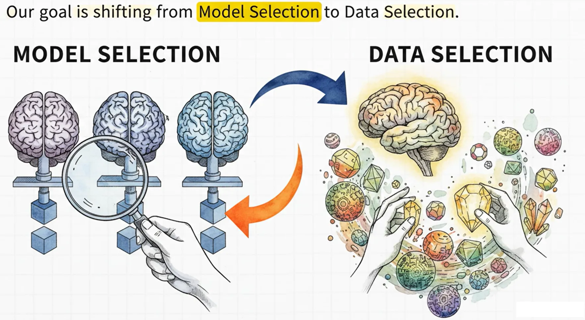

## 1. 范式转移：从无限算力假设到计算受限现实

在万亿参数模型（Trillion-parameter scaling）时代，AI 研究正经历从模型驱动（Model-centric）向数据驱动（Data-centric）的根本性转型。然而，我们赖以生存的理论基石——基于香农（Shannon）与柯尔莫哥洛夫（Kolmogorov）的经典信息论——在处理现代预训练现象时已显露颓势。这些理论核心假设观测者拥有无限的计算能力，忽略了从原始字节中提取“有用信息”的工程成本。

我们正处于香农范式的边缘。在无限算力视角下，π 的每一位数字都不包含新信息，加密数据与其背后的明文在信息量上等效。但在现实的计算受限环境中，提取信息的计算开销（Compute cost）决定了信息的实际价值。为了实现计算最优的数据策应（Compute-optimal data curation），我们必须引入“计算受限观测者”视角。本报告将通过 Epiplexity（认识复杂度） 这一核心指标，重新定义信息的本质：信息不仅是数据本身的静态属性，更是观测者算力与数据交互后，将其**内部化为结构化不变性（Internalizing structural invariants）**的结果。

## 2. 传统理论的局限性：信息论的三大理论悖论

传统框架在解释现代 AI 涌现现象时，存在三个由于忽略计算约束而产生的核心悖论：

### 悖论一：确定性变换的信息增益

经典信息论受制于数据处理不等式（DPI），认为任何确定性变换都无法增加信息量。

* 现实矛盾： AlphaZero 仅依靠简单的确定性游戏规则（极低 K 复杂度），通过大规模自博弈产生的模型权重（数 MB 的结构化信息）却能获得超越人类的洞见。
* 架构师评论： DPI 假设观测者能瞬间看透所有计算路径。在现实中，算力正是产生新信息的必要条件。计算过程本身就在为受限观测者创造“新”的、可利用的结构。

### 悖论二：因子化顺序的独立性

传统理论认为 H(X,Y) = H(Y,X)，即观测顺序不影响总信息量。

* 数学修正： 根据 Theorem 13，如果存在单向置换（One-way permutation） f 使得 Y = f(X)，则对受限观测者而言： H_{Poly}(X|Y) + H_{Poly}(Y) > H_{Poly}(Y|X) + H_{Poly}(X) + \omega(\log n)
* 工程意义： 这在数学上证明了“时间之箭”的影响。LLM 学习正向文本序列的效率远高于反向序列，是因为反向预测涉及更复杂的逆向推导，即计算上的“单向性”。

### 悖论三：似然建模的分布匹配

传统观点认为最大似然估计（MLE）仅仅是匹配数据生成器的分布。

* 现实矛盾： 在复杂系统（如康威生命游戏）中，模型通过计算约束学习到的“滑翔机”等高层抽象，比生成器的底层规则更复杂、更具预测价值。
* 评价： 模型不仅仅是模拟器，它在为了预测而强行归纳出生成器本身并未显式包含的复杂逻辑。

## 3. Epiplexity：结构化信息的度量核心

为了量化受限观测者眼中的价值，我们基于**最小描述长度（MDL）**原则，将总描述长度分离为两个维度：

定义与数学内涵

在计算约束 T 下，最优程序 P^* 最小化模型长度与预测损失之和。我们定义： MDL_T(X) = ST(X) + HT(X) 其中，ST(X) 即为 Epiplexity，代表模型程序 P^* 的比特长度 |P^*|；HT(X) 为时间受限熵，代表给定模型后剩余的随机性。

结构化信息 vs. 随机信息

| 指标 | 名称 | 描述 | 典型场景 |
| :--- | :--- | :--- | :--- |
| ST (Epiplexity) | 结构化信息 | 必须内化到权重中的规律。 | 逻辑推理、语法、物理定律。 |
| HT (Entropy) | 随机信息 | 受限算力下无法预测的噪声。 | 加密流、传感器噪声。 |

关键定理（Theorem 9）： 对于伪随机数生成器（CSPRNG），在受限观测者眼中，其 ST \approx 0（无提取结构），而 HT 接近极大值（不可区分于噪声）。这揭示了加密数据对模型学习而言是零价值的。

## 4. 测量程序：基于损失曲线的实操指南

在工程中，我们通过神经网络的训练行为来量化这两个指标。

### 方法一：前序编码（Prequential Coding）

* 原理： 估算为损失曲线下方超出最终稳定损失（Final Loss）的部分的积分面积。
* 可视化： 在 Loss-Step 图中，最终达到的 Baseline 以下的面积为 Entropy (HT)（灰色区域），代表数据本原的随机性；而曲线下降所包围的 Baseline 以上区域为 Epiplexity (ST)（绿色区域）。

### 方法二：再序编码（Requential Coding）

这是更严谨的度量方式，基于“教师-学生”框架。

* 数学表达： |P_{req}| \approx \sum KL(P^t_i || P^s_i)。
* 评价： 再序编码通过衡量学生模型吸收教师知识时的累积 KL 散度，能够精确过滤掉训练数据本身的熵噪声。这种方法对采样点不敏感，允许我们仅为模型结构付费，而非为数据随机性付费，是目前最高级的工程度量手段。

## 5. 深入探索：归纳、涌现与合成数据的价值

归纳缝隙（Induction Gap）

正如 Ilya Sutskever 的“谋杀悬案”隐喻：作者设定凶手（生成）只需简单声明，但读者推断凶手（预测）必须通过证据进行复杂的逻辑归纳。这种从数据生成到数据预测的复杂度跳跃，即为 Induction Gap。

* Rule 30 vs. Rule 54： Rule 30 产生的是纯粹的随机性（高 HT, 低 ST）；而 Rule 54 产生了可学习的涌现结构（中 HT, 高 ST），后者才是预训练的黄金数据。

涌现与“U型”复杂度曲线

在康威生命游戏中，受限观测者无法进行暴力模拟，被迫识别“滑翔机”等高层模式。

* Looped Transformer 实验： 研究发现，对于复杂规则，非循环模型（直接预测）最初拥有较高的 Epiplexity，因为它必须学习复杂的快捷方式（Shortcuts）。然而，当算力跨越阈值，循环模型（暴力模拟底层规则）变得更高效，Epiplexity 反而会骤降。这揭示了结构化信息价值随计算能力提升呈现出的“U型”演化特征。

战略性合成数据

Limited Epiplexity Increase Property 指出：在计算受限世界中，ST(G(Z)) 并不受限于生成程序 |G|。这意味着高质量合成数据（如包含详细思维链的推理过程）能够将隐藏的逻辑显性化，强制模型学习更复杂的内部电路，从而在受限算力下实现能力的飞跃。

## 6. 战略应用：跨模态预训练与 OOD 泛化

模态效率：VQ Tokenizer 的本质

图像数据中超过 99% 的信息是像素级的随机噪声（高 HT）。

* 战略建议： 使用 VQ 分词器。其本质是通过预先丢弃高 HT 的噪声，从而相对提升数据集的 Epiplexity 占比。这解释了为什么离散化表示能让模型更有效地捕捉语义结构。

自动化数据优化 (ADO)

基于 ADO (Automated Data Optimization) 策略，我们通过测量 Epiplexity 来筛选数据。

* 核心发现： 筛选高 ST 数据能促使模型学习“通用子程序”（如博弈中的局势理解电路）。这些电路在面对分布外（OOD）任务时具有极高的复用率。
* 数据选择指南： 知识工作者应优先选择那些能让模型在训练中经历“顿悟”（即损失曲线持续下降）的高 Epiplexity 数据，而非单纯增加样本量。

## 7. 结论：通往计算智能的统一信息论

信息不是死板的字节，而是算力对数据的征服率。Epiplexity 为我们提供了一个衡量“结构化信息价值”的统一尺度，解决了经典理论无法解释的 AlphaZero 增益、单向函数学习及涌现现象。

未来愿景：

1. 课程学习自动化： 利用 Epiplexity 实时评估数据的“学习回报率”，动态调整训练混合比例。
2. 解决数据墙： 通过生产高 ST 的逻辑合成数据，我们将跨越自然语言枯竭的瓶颈，推动 Scaling Laws 向更高维度的结构化智能演进。

量化并内化“结构化信息”，是解决 AI 扩展律瓶颈、通往 AGI 的唯一理论路径。

## 参考文献

* [From Entropy to Epiplexity](https://arxiv.org/pdf/2601.03220)

