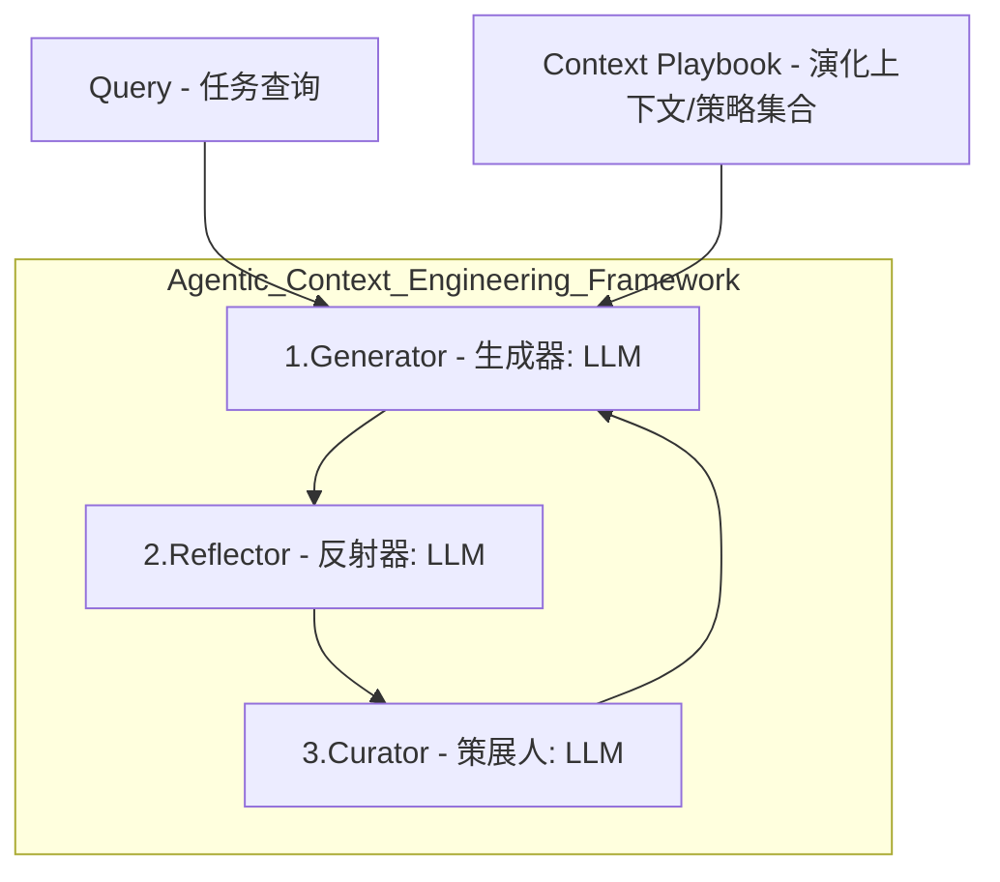

## TLDR

该论文介绍了一个名为 **ACE**(Agentic Context Engineering，代理上下文工程) 的框架，该框架旨在**通过演化上下文而非微调模型权重的方式，实现大型语言模型（LLMs）的自我改进**。ACE将上下文视为不断累积、提炼和组织策略的 **“演化剧本”**，从而克服了现有上下文适应方法中存在的**简洁性偏差和上下文崩溃等主要限制**。通过使用 **生成器(Generator)、反射器(Reflector)和策展器(Curator)** 这三个代理组件，ACE实现了**增量更新和“增长与提炼”机制**，以保持详细的领域知识并提高可扩展性。实验结果表明，ACE在代理基准测试和金融等领域特定任务中显著优于现有基线方法，同时还能大幅降低适应的延迟和成本。

## 背景

我们通常认为，要让AI发挥最佳性能，指令就必须清晰、简单、扼要。这是“提示工程”（Prompt Engineering）的核心原则之一，也是我们与AI互动时的直觉。

但如果说，解锁AI更高层次能力的关键，不是简化，而是为其打造一本内容丰富、全面且能不断成长的“行动剧本”呢？

来自斯坦福大学和SambaNova Systems的一项新研究提出了一个名为ACE的框架，它彻底挑战了这一传统观念。该框架旨在通过一种反直觉的方式，让AI智能体变得更聪明、更高效，甚至能自我完善。

## 抛弃“简洁至上”：揭秘LLM为何偏爱详尽的“行动剧本”

研究指出，当前优化LLM输入（即“上下文”）的方法存在两个致命缺陷：**“简洁性偏见”**（brevity bias）和 **“上下文崩溃”**（context collapse）。许多优化工具倾向于生成简短、通用的指令，但这往往会丢弃掉特定领域里至关重要的策略和技巧。更严重的是，当AI被要求在迭代中不断重写其学到的知识时，灾难就会发生。

ACE框架反其道而行之，它不追求压缩信息，而是将上下文视为一个全面且不断演进的“剧本”（playbook）。研究人员提出了一个关键论点：

与人类通常受益于简洁的归纳不同，大语言模型在被提供长而详细的上下文时更为有效，它们能够自主地提炼出相关信息。因此，上下文不应压缩掉特定领域的启发式方法和策略，而应予以保留，让模型在推理时自行决定哪些内容是重要的。

这种“剧本”不是一堆杂乱的信息，而是结构清晰的知识库。例如，在AppWorld基准测试中，ACE生成的剧本包含了明确的章节，如：

* 策略与硬性规则 (STRATEGIES AND HARD RULES)：提供高级别的行动指南和必须遵守的规则。
* 有用的代码片段与模板 (USEFUL CODE SNIPPETS AND TEMPLATES)：提供可直接复用的代码，提高效率。
* 故障排除与陷阱 (TROUBLESHOOTING AND PITFALLS)：记录过去的失败经验，帮助AI避免重蹈覆辙。

## 核心原理与实现

以下是 ACE 框架如何通过演化上下文实现 LLM 自优化的具体机制、角色和核心创新：

### 1. 核心机制：演化的“剧本” (Evolving Playbook)

ACE 框架的关键在于将上下文视为一个全面的、不断演化的剧本，该剧本能够随着时间积累、提炼和组织策略。它通过一个模块化的工作流程实现上下文的持续适应。

ACE 通过采用“增长与完善”（grow-and-refine）的原则，并使用结构化、增量的更新来防止上下文崩溃，从而保留了详细的知识并与长上下文模型一起扩展。

### 2. 三个智能体角色 (Three Agentic Roles)

ACE 基于 **Dynamic Cheatsheet** 的智能体架构，引入了 **生成（generation）、反思（reflection）和策划（curation）** 的模块化工作流程，并明确划分了三类专门的角色来执行上下文演化：

| 角色名称 (Role) | 职责 (Function) |
|---|---|
| 生成器 (Generator) | 根据查询和当前的"上下文剧本"生成推理轨迹（trajectory）。它在推理过程中会突出显示哪些"子弹"（即上下文条目）是有用或具有误导性的，为反思者提供反馈。 |
| 反思者 (Reflector) | 负责提炼具体的见解。它根据执行轨迹、环境信号和反馈（例如，代码执行成功或失败），批判性地分析轨迹，从而提取出成功和错误的具体经验教训,例如根本原因分析或改进建议。 |
| 策划者 (Curator) | 负责整合见解。它将反思者提炼出的经验教训合成为紧凑的"增量条目"（delta entries），并将其整合到现有的上下文中。 |

这种分工模仿了人类学习过程——即“实验、反思和巩固”——同时避免了让单个模型承担所有责任而导致的瓶颈。

### 3. 实现上下文演化的核心创新

ACE 引入了结构化的、增量式的更新机制，这是实现可扩展、高效自优化的关键：

#### A. 增量增量更新 (Incremental Delta Updates)

ACE 的核心设计原则是：将上下文表示为结构化、项目化的“子弹”（bullets）集合，而不是一个单一的整体提示。
• 避免整体重写： ACE 避免了成本高昂的整体上下文重写，而是增量地生成紧凑的增量上下文（delta contexts）。
• 子弹结构： 每个“子弹”都是一个小单元，包含可重用的策略、领域概念或常见故障模式，并附带元数据，如唯一标识符和跟踪其有用性/危害性的计数器。
• 效率和可扩展性： 由于更新是局部化的、项目化的，多个增量可以并行合并，从而实现大规模的批处理适应，并避免了完整重写的计算成本和延迟。这种方法显著降低了适应延迟，平均降低了 86.9%。

#### B. 增长与完善机制 (Grow-and-Refine)

为了确保上下文在扩展的同时保持紧凑和相关性，ACE 采用了“增长与完善”机制：
• 持续增长： 具有新标识符的“子弹”会被添加到上下文末尾，而现有“子弹”则会在原地更新（例如，增加计数器）。
• 冗余控制： 机制中包含一个去重（de-duplication）步骤，通过语义嵌入（semantic embeddings）比较“子弹”来消除冗余。
• 适应性扩展： 这种机制确保了上下文能够适应性地扩展，同时保持可解释性，并避免了整体上下文重写带来的潜在差异。

#### C. 利用执行反馈进行自学习 (Self-Learning via Execution Feedback)

ACE 能够有效地进行自优化，即使没有标记监督（labeled supervision）。它通过利用在执行过程中自然获得的信号，例如代码执行的成功或失败、环境信号，来指导反思者和策划者形成结构化的经验教训。这使得 LLM 系统能够基于实际操作的反馈进行自我提升。

### 4. 优化效果

通过这种演化的上下文方法，ACE 在性能和效率方面均表现出色：
• **性能提升**： 在 AppWorld 智能体任务中，ACE 平均提升了 10.6% 的性能，在金融推理基准测试中提升了 8.6% 的性能。
• **匹配顶尖智能体**： 在 AppWorld 排行榜上（截至 2025 年 9 月 20 日），使用 DeepSeek-V3.1 这一较小开源模型的 ReAct + ACE（59.4%）的平均得分，与顶级的 GPT-4.1 驱动的生产级智能体 IBM CUGA（60.3%）相当。
• **效率大幅提高**： ACE 将平均适应延迟降低了 86.9%，并且需要的运行次数和 token 成本也更低。例如，在 FiNER 的在线适应中，ACE 相比 Dynamic Cheatsheet（DC），适应延迟降低了 91.5%，token 成本降低了 83.6%。

## 小模型的“逆袭”：智能上下文工程如何抹平与更大模型的性能鸿沟

这项研究最令人惊讶的成果来自于AppWorld基准测试的排行榜。AppWorld是一个模拟真实世界应用交互的复杂测试，对AI智能体的综合能力要求极高。

研究明确指出，通过使用ACE框架，一个相对较小的开源模型取得了与行业巨头相媲美的成绩。

关键数据对比：

* 在AppWorld排行榜上，使用相对较小的开源模型 DeepSeek-V3.1 并由ACE赋能的智能体，取得了59.4%60.3%）。
* 更引人注目的是，在难度更高的“测试挑战”（test-challenge）部分，使用在线自适应的ACE智能体在所有关键指标上都超越了IBM的代理。

这一结果意义重大。它证明了，更智能的上下文工程（Context Engineering）可能比单纯使用更大、更强的基础模型更为重要。通过精心构建和维护一个知识丰富的“剧本”，我们能够显著缩小甚至抹平基础模型之间的性能差距。

## 更广泛的影响与未来展望

ACE框架的意义超越了单纯的性能提升，它为我们构建更高效、更负责任的AI系统提供了新的思路和方向。

* **长上下文与服务成本**：虽然ACE倾向于生成比传统方法更长的上下文，但这并不等同于线性的推理成本增加。现代AI服务架构正通过**KV缓存的复用、压缩和卸载**等先进技术，持续优化长上下文工作负载的处理效率。这些技术使得频繁使用的上下文片段可以被高效缓存，避免了重复计算。随着相关技术的不断进步，处理长上下文的摊销成本将持续下降，使ACE这类方法在实际部署中变得越来越经济可行。
* **对在线与持续学习的启示**：对于需要持续学习和适应新环境的系统而言，ACE提供了一种比模型微调更灵活、成本更低的替代方案。上下文的适应通常比更新模型权重的计算开销小得多。更重要的是，由于ACE生成的 **“策略手册”** 是人类可解释的，它为 **“选择性遗忘”**（selective unlearning）提供了可能。当某些信息因隐私、法律约束或内容过时而需要被移除时，可以直接从上下文中删除相关条目，而无需对模型本身进行复杂的操作。这一特性在构建负责任的AI系统中具有巨大的应用潜力。

ACE为未来持续和负责任的学习模型研究指明了一个极具前景的方向，即通过智能体工程化的方式来动态管理和演进模型的知识。

## 结论：从“提示工程师”到“AI图书管理员”

ACE框架的出现，标志着我们与AI协作方式的一次重要思维转变。我们的角色正在从简单地向AI下达指令，转变为精心为其策划、构建和维护一个动态的知识库。

这引出了一个发人深省的问题：随着我们构建日益复杂的AI系统，人类最关键的技能是否将从“提示工程师”转变为“AI图书管理员”，负责细致地管理和扩充这些系统赖以学习的知识宝库？

## 术语

ACE 旨在解决现有上下文适应方法面临的两大限制：

1. **简洁偏见**（Brevity Bias）：现有的提示优化器常倾向于简短、通用的指令，从而忽略了在实际应用（如复杂智能体或知识密集型应用）中至关重要的特定领域启发式规则、工具使用指南或常见故障模式。

2. **上下文崩溃**（Context Collapse）：依赖 LLM 进行整体重写的上下文方法，往往会随着时间的推移退化为更短、信息量更少的摘要，导致性能急剧下降。
   1. 研究人员观察到一个戏剧性案例：一个拥有18,282个词元（token）、准确率达到66.7%的上下文，在下一次迭代中突然“崩溃”，被压缩到仅剩122个词元，准确率骤降至57.1%——这甚至比没有任何上下文时的基准准确率（63.7%）还要糟糕。下图清晰地展示了在第60步左右发生的这次信息断崖式下跌。

## 参考

论文：

* <https://www.alphaxiv.org/abs/2510.04618>
* <https://papers-pdfs.assets.alphaxiv.org/2510.04618v1.pdf>

Github：

* <https://github.com/suzgunmirac/dynamic-cheatsheet>
