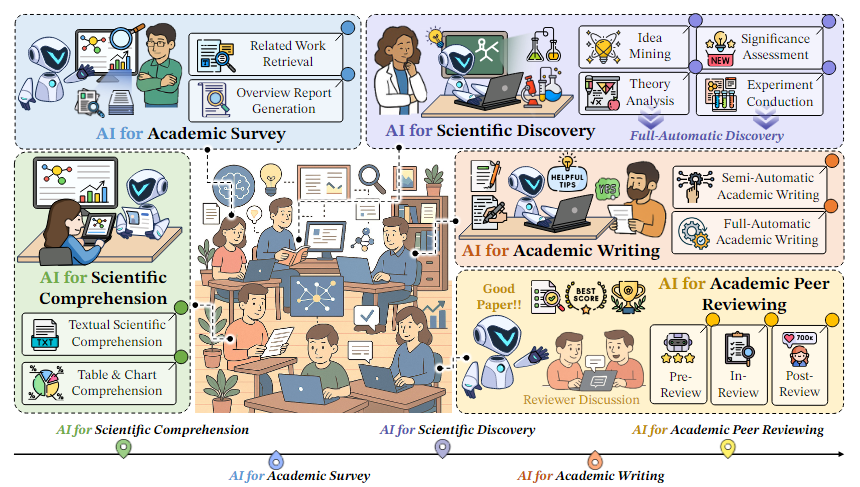
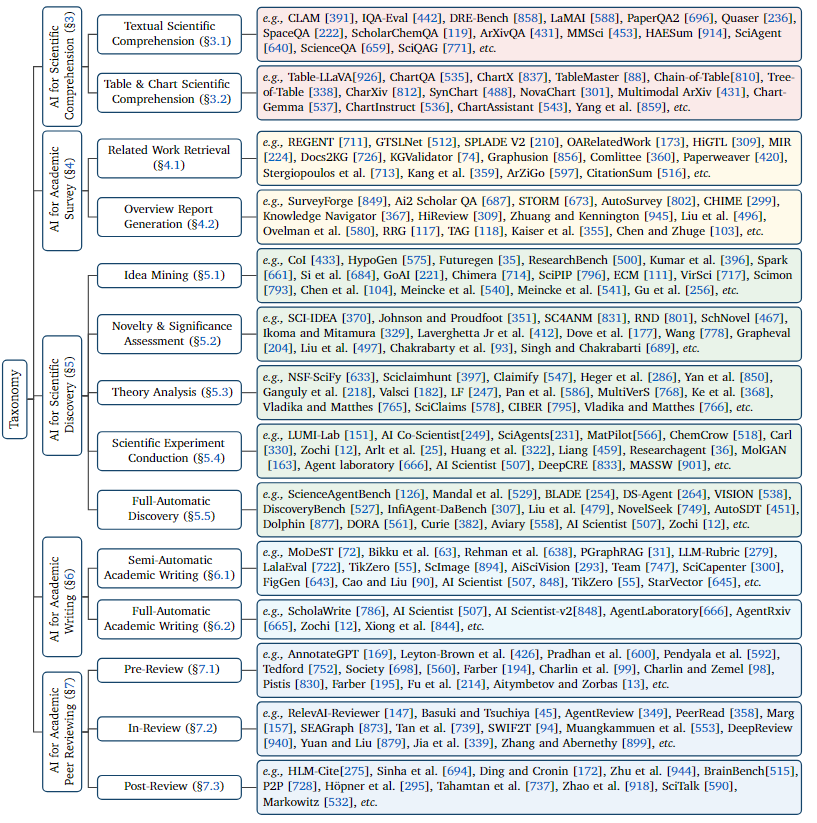
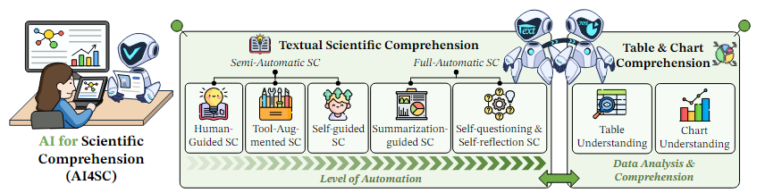
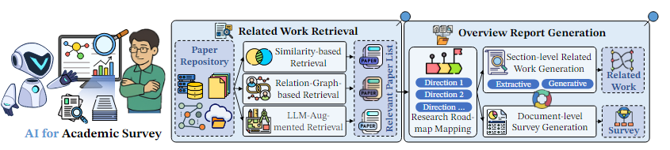
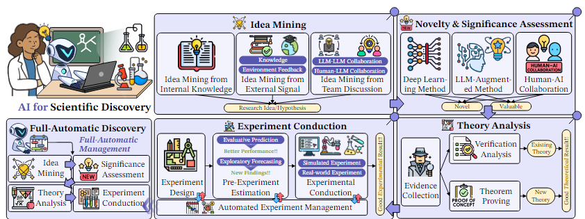
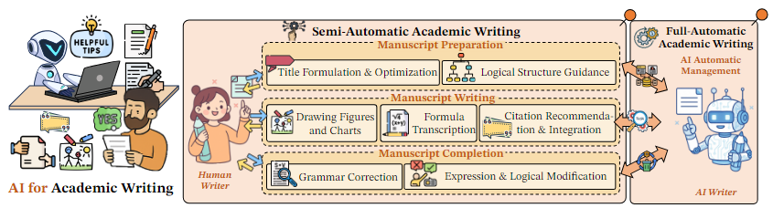
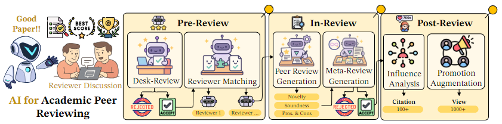

这是一篇论文综述，参考了差不多1000篇论文和项目。本综述文章概述了**人工智能在科学研究（AI4Research）中的应用**，强调了大型语言模型（LLMs）在促进科学发现各个阶段的潜力。它建立了一个**系统的分类体系**，将AI4Research分解为**科学理解、学术调查、科学发现、学术写作和学术同行评审**五个主要任务。文章详细介绍了AI在这些领域中的具体应用，例如辅助**思想挖掘、实验设计、数据分析、论文撰写和同行评审**。此外，该综述还**识别了未来的研究方向**，包括**跨学科AI模型、伦理考量以及多模态和多语言集成**，旨在为研究界提供资源并激发AI驱动的科学创新。

Date: July 02, 2025
Paper:<https://arxiv.org/pdf/2507.01903>
Projects: <https://ai-4-research.github.io>
Code Repository: <https://github.com/LightChen233/Awesome-AI4Research>

## 1. 引言与定义

AI4Research 是一个新兴且快速发展的领域，旨在利用人工智能（特别是大语言模型LLMs）来增强和自动化科学研究的各个阶段。这份调查旨在全面概述AI在科学研究生命周期中的应用，从科学理解到最终的同行评审。

- **现存问题**：缺乏对 AI4Research（人工智能研究）的全面调研，这制约了对该领域的理解及进一步发展。
- **研究聚焦**：众多研究探索 AI 在科学研究创新过程中的应用，目标是开发能自主完成多学科研究过程的系统。
- **系统分类法**：对 AI4Research 六大主流任务进行分类。
- **新前沿探索**：明确关键研究差距，强调自动化实验的严格性、可扩展性及社会影响等未来方向。
- **丰富资源汇编**：整理开源资源，包含相关论文、数据语料库和排行榜，助力研究社区快速获取资源，推动 AI4Research 领域创新突破。
  
AI4Research 的定义被细分为以下核心组成部分：

- AI for Scientific Comprehension (科学理解)： 利用AI工具帮助研究人员理解复杂的科学文本、图表和表格, 包括半自动化和全自动化地从文献中提取关键信息、概念和数据。

- AI for Academic Survey (学术调查)： 应用AI进行文献检索和综述报告生成，以帮助研究人员快速了解研究现状和绘制研究路线图。

- AI for Scientific Discovery (科学发现)： AI在科学研究过程中的核心应用，包括想法挖掘、新颖性和重要性评估、理论分析以及科学实验的执行与分析。

- AI for Academic Writing (学术写作)： AI辅助甚至自动化学术论文的撰写，涵盖手稿准备、内容生成和后期修正。

- AI for Academic Peer Reviewing (学术同行评审)： AI在同行评审过程中的应用，包括预审、审稿和审后分析。

（AI4Research）可划分为五个关键领域。每个领域又细分为具体任务，这凸显了人工智能在整个研究过程中所扮演的多样化角色:

## 2. 科学理解 (AI for Scientific Comprehension)

AI在科学理解方面的应用，旨在帮助研究人员有效地处理和吸收大量信息。

- 文本科学理解 (§3.1): 包括半自动和全自动的文本理解。半自动系统如 LaMAI [588] 和 PaperQA2 [696] 辅助用户理解文本，而全自动系统则能自主进行理解。
- 表格与图表科学理解 (§3.2): AI能够理解并从表格和图表中提取信息，例如 Table-LLaVA [926] 和 ChartQA [535]。这对于从非结构化或半结构化数据中获取洞察至关重要。
- 相关基准与数据集: 评估科学问答系统的基准包括 ScienceQA [659]、LitQA [405]、SciBench [798] 等，这些数据集有助于提升AI在科学推理和内容理解方面的能力。

## 3. 学术调查 (AI for Academic Survey)

AI在学术调查中的应用，旨在简化和加速文献综述和相关工作检索的过程。

- 相关工作检索 (§4.1): AI能够通过图谱检索（如 Personalized graph-based retrieval [31]）和语义检索（如 LitLLM [7]）来查找相关文献。
  - 综述报告生成 (§4.2): 研究路线图绘制 (§4.2.1): AI可以识别研究趋势和热点，例如 AutoSurvey [802] 和 SurveyForge [849]。
  - 章节级相关工作生成 (§4.2.2): AI可以为论文的特定章节生成相关工作部分。
  - 文档级综述生成 (§4.2.3): AI甚至可以生成完整的综述文档。
- AI生成综述的质量评估: 论文中提到 SurveyForge [849] 在“模型质量”、“大纲质量”和“内容质量”方面表现优于 AutoSurvey [802]，特别是在使用 DeepSeek-v3 [477] 时，“模型质量”达到了0.2554，“大纲质量”达到了0.4553。这表明AI在生成高质量综述方面取得了显著进展。

## 4. 科学发现 (AI for Scientific Discovery)

科学发现是AI4Research的核心和最具挑战性的环节，它涵盖了从想法产生到实验执行的全过程。作者提出了科学发现的AI函数表示：ASD(I) = fSD(I|KSD, RSD, ΦSD) = fED ◦ fTA ◦ fNSA ◦ fIM(I|KSD, RSD, ΦSD) (8)。

- 想法挖掘 (Idea Mining) (§5.1):从内部知识挖掘 (§5.1.1): LLM可以利用其预训练参数和定制提示来发现新概念，无需外部数据。Meincke et al. [541] 通过调整解码温度和基于约束的提示，引导LLMs探索不同的“想法空间”。
- 从外部信号挖掘 (§5.1.2): 结合外部知识（如知识图谱）来生成新想法。
- 从团队讨论中挖掘 (§5.1.3): AI可以分析团队讨论，提取和扩展有价值的想法。
- LLM在想法生成中的表现: 表格数据显示，DeepSeek-R1 [263] 在“清晰度”和“原创性”评分上表现突出（分别为8.10和7.84），而 Claude-3.7-Sonnet [24] 在“流畅性”上得分最高（7.80）。这表明不同的LLMs在生成想法的不同维度上具有优势。

- 新颖性与重要性评估 (§5.2): AI系统（如 SchNovel [467] 和 NoveltyDetection [497]）可以评估研究的创新性，旨在“促进科学工作流程中研究原创性的自动化评估”。
- 理论分析 (§5.3): 涉及科学主张的形式化 (Scientific Claim Formalization)、科学证据收集 (Scientific Evidence Collection) 和科学验证分析 (Scientific Verification Analysis)。例如，MultiVerS [768] 旨在改进科学主张的验证。TheoremExplainBench [390] 用于评估LLMs在定理理解方面的能力。
  - 科学实验执行 (§5.4):实验设计 (§5.4.1): AI可以设计实验，如 CRISPR-GPT [314] 用于基因编辑实验设计。
  - 实验前估算 (§5.4.2): 预测实验结果或优化参数。
  - 实验管理 (§5.4.3): 监督实验流程。
  - 实验执行 (§5.4.4): 自动化实验操作，如 LUMI-Lab [151] 和 ChemCrow [518]。
  - 实验分析 (§5.4.5): AI分析实验数据并得出结论。
  - LLM在实验执行中的性能: 在“实验执行”部分的表格中，“带有知识”的模型通常在“成功率”（SR）、“完整性”（CBS）和“验证准确性”（VER）方面表现更优，而成本（Cost）也能保持较低。例如，o1-preview [334] 在“带有知识”时，成功率高达35.3，验证准确性达到91.5。这突出了外部知识增强LLM在实际实验中的重要性。

## 5. 学术写作 (AI for Academic Writing)

AI在学术写作中的应用，旨在提高写作效率和质量。作者提出了学术写作的AI函数表示：M̂ = AAW(M) = fAW(M|KAS, InfoI , ΦAW) = fDWP ◦ fDMW ◦ fAWC(M|KAS, InfoI , ΦAW) (10)。

- 半自动学术写作 (§6.1):手稿准备辅助 (§6.1.1): 如 Modest [72] 用于多领域科学标题生成，Scholawrite [786] 提供了端到端学术写作过程数据集。
  - 手稿写作辅助 (§6.1.2): 包括内容生成、引用生成（如 ILCiter [653]）、图表和图像生成（如 Figgen [643]）。
  - 手稿完成辅助 (§6.1.3): 语法修正、表达优化和逻辑修改。
  - 全自动学术写作 (§6.2): 展望了AI完全自动化生成学术论文的潜力。论文指出，使用LLM进行写作可能会“降低内容多样性” (Does writing with language models reduce content diversity? [583])，这是一个重要的伦理和质量考量。

## 6. 学术同行评审 (AI for Academic Peer Reviewing)

AI在同行评审中的应用，旨在提高评审效率和质量，解决审稿人不足的问题。

- 预审 (Pre-Review) (§7.1):初审 (Desk-Review) (§7.1.1): AI可以进行初步筛选。
- 审稿人匹配 (Reviewer Matching) (§7.1.2): AI可以根据论文内容和审稿人专长进行匹配。
- 审稿中 (In-Review) (§7.2): 涉及生成或支持评审报告。
  - 同行评审 (Peer-Review) (§7.2.1): AI可以自动生成评审意见。论文中比较了不同LLM在生成同行评审意见方面的表现，GPT-4o-mini [641] 和 GPT-4o [641] 在“焦点相似度”和“文本相似度”指标（如ROUGE-L、BERTScore）上表现较好，而 Llama-3.1-405B [250] 在“文本相似度”指标（ROUGE-L为0.218，BERTScore为0.884）上表现出色。GPT-4o-Finetuned [641] 在“焦点相似度”的KL散度指标上表现最佳（0.022），表明微调可以显著提升AI生成评审意见的质量和与人类评审的匹配度。
- 元评审 (Meta-Review) (§7.2.2): AI可以汇总多个评审意见。
- 审后 (Post-Review) (§7.3):影响力分析 (§7.3.1): 分析论文发表后的影响力。
- 推广增强 (§7.3.2): 帮助推广已发表的研究。

## 7. AI for Research 的应用领域

AI4Research 的应用涵盖了广泛的科学领域：

- 自然科学研究 (§8.1):物理研究 (§8.1.1): 例如 Lagrangian Neural Networks [149]。
- 生物与医学研究 (§8.1.2): 如 BioMedLM [71] 用于生物医学文本，CRISPR-GPT [314] 用于基因编辑。CellAgent [840] 用于单细胞数据分析。
- 化学与材料研究 (§8.1.3): 如 ChemCrow [518] 增强LLM的化学工具应用，MolGAN [163] 用于小分子图生成。BatGPT-Chem [857] 作为一个化学工程基础模型。
- 应用科学与工程研究 (§8.2):机器人与控制研究 (§8.2.1): AI用于机器人控制任务 (Value Iteration for Learning Concurrently Executable Robotic Control Tasks [738])。
- 软件工程 (§8.2.2): AI用于代码生成、调试和评估。
- 社会科学研究 (§8.3):社会学研究 (§8.3.1): LLMs可以进行社会媒体语料库的归纳主题分析 (Large language models can enable inductive thematic analysis of a social media corpus in a single prompt: Human validation study [165])。
- 心理学研究 (§8.3.2): AI用于心理评估 (Psyche [414])。

## 8. 前沿与未来方向

论文也展望了AI4Research 的未来发展方向：

- 跨学科AI模型 (§10.1): 强调开发能够处理不同科学领域知识的通用AI模型。
- AI4Research 的伦理与安全 (§10.2): 讨论了AI在科学研究中可能带来的伦理问题，例如 Considering the ethics of large machine learning models in the chemical sciences [707]。
- AI用于协同研究 (§10.3): 促进AI在多方协作研究中的应用。
- AI4Research 的可解释性与透明度 (§10.4): 确保AI决策过程的透明和可解释性。
- AI用于动态实时优化科学实验 (§10.5): 实时调整和优化实验参数。
- 多模态集成在AI4Research中 (§10.6): 结合文本、图像、图表等多种模态数据，如 Multimodal ArXiv [431] 和 CharXiv [812]。
- 多语言集成在AI4Research中 (§10.7): 促进跨语言的科学研究。

## 9. 总结

这份调查详细描绘了AI在科学研究生命周期中的广泛应用，从信息摄取、知识发现、成果产出到质量评估。大语言模型（LLMs）在其中扮演了关键角色，不仅能够辅助人类研究人员，还在一些任务中展现出自动化甚至超越人类的能力。然而，报告也指出了AI4Research的挑战和未来方向，如伦理、可解释性、多模态集成和跨学科应用，这些都是未来需要深入探索的领域。总的来说，AI正在深刻地改变科学研究的范式，并有望加速未来的科学发现。
