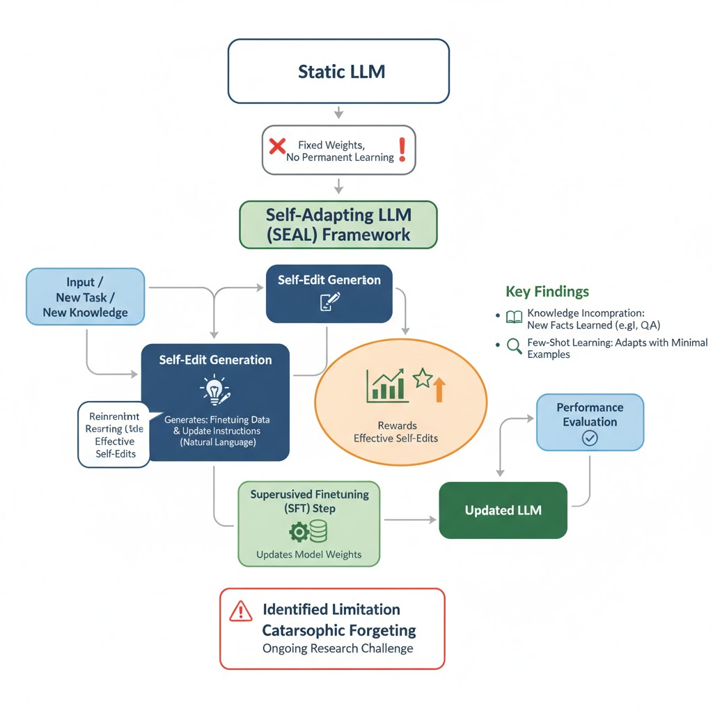

## 引言：当AI学会了“自己划重点”

人类学习时，很少会直接逐字逐句地背诵课本。更高效的方式是提炼、重组知识，制作自己的学习笔记——这个过程本身就是一种深度学习。相比之下，传统的人工智能模型更像一个只能被动阅读的学生，其知识库一旦形成便难以改变。这种从被动接收到主动学习的转变，正是AI领域一场根本性的进化。

最近，麻省理工学院（MIT）的一项开创性研究，为我们揭示了这场进化的具体路径。他们推出了一个名为 **SEAL (Self-Adapting Large Language Models，自适应大语言模型)** 的框架。这套框架首次赋予了AI模型一种前所未有的能力：它们可以“自己教自己”，通过生成和应用自己的学习材料，来持续进化其内部的知识体系。

但为什么这种“自我教学”的能力，对AI的未来如此关键？

## AI的“知识僵化症”：当前大模型的隐藏痛点

尽管当前的大语言模型（LLM）能力强大，但它们普遍存在一个战略性的痛点：知识的 **“静态” (static)** 特性。绝大多数模型就像一张在某个时间点拍摄的互联网快照，其核心知识被永久“冻结”在了训练完成的那一刻。这意味着它们无法自然地吸收新知识、学习新技能或适应新任务。

传统的模型更新方法，如**微调（fine-tuning）**或**上下文学习（in-context learning）**，要么效率低下，需要大量特定数据；要么效果短暂，知识无法被模型真正“内化”。一旦上下文信息消失，模型很快就会忘记刚刚“学到”的内容。这种无法持久、高效地更新自身知识库的局限，研究人员称之为模型的“知识僵化症”，而SEAL框架的提出，正是为了根治这一痛点。麻省理工学院的研究人员受到人类学习方式的启发，设计出了一套优雅的解决方案。

## 核心揭秘：SEAL如何让大模型“自己教自己”？

SEAL的精妙之处在于其看似简单却异常强大的自我提升机制。它没有引入复杂的外部模块，而是直接利用模型自身的能力来驱动进化。接下来，我们将深入剖析这一机制的运作原理。

### 核心机制：自我编辑与两大应用

SEAL的核心是 **“自我编辑” (Self-Edits)** 的概念。这并非复杂的代码或参数调整，而是模型针对新数据或新任务，用自然语言为自己生成的 **“学习指令”**。这些指令可以是对新知识的总结、推断，也可以是学习新任务的最佳策略配置。其重大意义在于，模型不再被动地接收“投喂”的数据，而是像一个聪明的学生，能够自主地为自己创建最高效的学习计划和定制化的学习材料。

“自我编辑”指令主要通过以下两种方式，实现模型的持久性知识更新：

* **生成合成数据** (Generating Synthetic Data): 当需要学习新知识时（例如一篇新的文章），SEAL不会直接"硬啃"原文。相反，它会生成一系列针对自身学习特点优化的 **"合成数据"**，比如将原文<b>改写为逻辑推论、关键摘要或问答（Q&A）对</b> 。这些数据比原始文本更利于模型吸收和内化。
* **配置适应流程** (Configuring Adaptation): 当面对新任务时，SEAL可以通过“自我编辑”指令，自动选择最优的数据增强方法和训练超参数（如学习率、训练周期等）。这相当于模型拥有了一位内置的 **“性能工程师”**，能够为不同的任务量身定制最高效的学习流程。

### 质量控制：强化学习的“奖惩循环”

为了确保自我学习不是盲目和随机的，SEAL引入了一套基于强化学习 (Reinforcement Learning) 的**双循环优化系统**。这个过程可以被通俗地理解为一个“试错-学习”的循环：

1. **生成指令**： 模型针对新信息生成一个“自我编辑”指令（一份学习笔记）。
2. **自我更新**： 模型使用这份笔记对自己进行一次轻量化的权重更新。
3. **接受测试**： 更新后的模型立即接受一项下游任务的测试（例如回答相关问题）。
4. **获得奖励**： 根据测试表现，系统会给出一个“奖励”信号。如果表现提升，指令就获得正奖励。
5. **优化策略**： 这个奖励信号会反过来训练模型，使其未来能够生成更有效、更高质量的“学习笔记”。

通过这个闭环，SEAL确保了每一次自我学习都是有方向、有目标的，持续朝着性能提升的方向进化。然而，需要指出的是，这种强大的自我优化机制也伴随着显著的计算成本。研究人员在论文中坦言，由于每生成一条“自我编辑”指令都需要对模型进行一次微调和评估来计算奖励，单次评估就需要大约30-45秒，这为实际应用带来了不可忽视的开销。

### 效果惊人：数据证明SEAL的自我进化能力

关于SEAL的强大能力并非空谈，而是经过了严格的实验验证。其结果清晰地展示了AI在学习和适应能力上的巨大飞跃。

以下是该研究中最具代表性的几项成果：

1. **知识整合能力大幅提升** 在知识问答任务中，研究人员使用Qwen2.5-7B模型进行测试。实验发现，仅仅在原始文章文本上进行微调的基线方法，准确率仅为33.5%，效果甚微。而经过SEAL的自我教学后，准确率飙升至 47.0%。这表明模型并非简单地记忆信息，而是真正将新知识有机地整合进了自身的知识体系中。
2. **自创数据质量反超大模型** 实验中最令人惊讶的发现是关于训练数据的质量：使用SEAL框架自创学习材料的7B参数Qwen模型，其训练效果甚至优于使用更强大的 GPT-4.1 (一个版本的GPT-4模型) 为其生成的合成数据进行训练时的效果。这一结果有力地证明了，学习材料的“质量”远比“数量”更重要，而为自己量身定制的学习材料效率最高。
3. **少样本学习实现“从0到1”的突破** 在一项使用Llama-3.2-1B-Instruct模型进行的抽象推理任务中，面对极少量的示例，基线模型的成功率仅为0%或20%。而SEAL通过自动配置学习策略，将成功率提升到了惊人的 72.5%。这展示了SEAL不仅能学习知识，更能“学会如何学习”，能够从极少的样本中快速掌握全新的、复杂的任务范式。

值得一提的是，研究还揭示了提示工程（prompt engineering）的深远影响。实验表明，仅仅通过更详细地提示模型生成更长的内容，就能显著提升基线性能，而SEAL的强化学习过程能够在这些已经很强大的基准之上，实现进一步的性能飞跃。

这些强有力的数据，为我们描绘了AI能力的新蓝图，并引发了对未来更深远的思考。

## 结语：迈向真正“会学习”的通用人工智能

SEAL的诞生，标志着人工智能领域的一个关键转折点：我们正从开发静态的、预训练的模型，转向构建动态的、自适应的智能系统。这不仅仅是一次技术迭代，更可能开启通往真正通用人工智能的新路径。

基于这项研究，我们可以预见其在未来的深远影响：

* 突破“数据墙”： 随着高质量的人类数据日益枯竭，AI的持续进步面临着“数据墙”的挑战。能够自我生成高质量训练数据的自适应模型，可能是打破这一瓶颈、实现持续扩展的关键。
* 构建智能体： 未来的AI智能体（Agent）需要在与世界的持续互动中学习和成长。SEAL提供的“自我编辑”机制，为智能体将其经验内化为永久知识提供了可能，使其能够不断进化，而无需反复依赖外部监督。
* 实现持续学习： 这是AI领域最经典的难题之一。理想的持续学习要求模型在学习新知识时不能忘记旧知识。然而，“灾难性遗忘”（catastrophic forgetting） 始终是一个巨大挑战。作为一个负责任的分析，我们必须指出，SEAL虽然是充满希望的一步，但尚未完全解决此问题。研究人员的测试表明，随着模型不断吸收新知识，其在早期任务上的表现会逐渐下降。

SEAL证明了，大语言模型不必在预训练后就停止成长。通过学会为自己生成学习材料并进行自我更新，它们可以自主地走向更广博、更强大的未来。一个AI能够自我进化的新时代，或许已经拉开了序幕。

## 参考

* [论文：SEAL: Self-Adaptive Large Language Models](https://arxiv.org/pdf/2510.13668)
* [SEAL Github](https://github.com/Continual-Intelligence/SEAL)
* [我的NotebookLM](https://notebooklm.google.com/notebook/dccd1d51-26f3-4369-be9a-ca2a82e83bd3)
