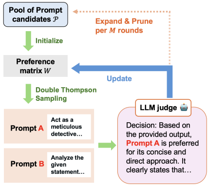

## TL;DR

该文介绍了一种名为**Prompt Duel Optimizer (PDO)**的自动提示优化框架，旨在解决大型语言模型 (LLMs) 在缺乏标注数据时进行提示设计这一核心挑战。PDO将提示优化问题建模为**决斗赌博机（dueling-bandit）**设置，其中监督信号来自于LLM评估器提供的成对偏好反馈。该框架通过结合**双重汤普森采样 (D-TS)** 来高效选择信息量大的提示对进行比较，并通过**顶级表现者引导的变异**来扩展候选提示池。实验结果表明，PDO在无需地面实况标签的情况下，在多个基准测试上始终优于基线方法，并且在部分有标签的情况下也能与有监督的优化方法竞争。

## 论文核心信息

- **核心问题**：大语言模型的表现高度依赖于提示词，但自动提示优化方法通常需要大量带有真实标签的验证数据来进行监督，这在实际应用中成本高昂且缓慢。
- **解决方案**：提出了**提示词对决优化器（Prompt Duel Optimizer, PDO）**，一个**无需真实标签**的、高效的提示词优化框架。

## PDO 的核心思想与方法

PDO的核心洞察是：**即使没有真实答案，也可以通过让LLM比较两个提示词生成的回答哪个更好，来获得优化信号**。它将提示词优化问题建模为一个**“对决赌博问题”**。

1. **对决赌博设定**：
    - **提示词即“武器”**：将每个待优化的提示词视为一个“武器”。
    - **对决**：在每一轮优化中，选择两个提示词（例如，提示词A和提示词B）对同一问题生成回答。
    - **LLM作为裁判**：由一个LLM扮演裁判，判断哪个回答更好，从而决定哪个提示词在本次“对决”中胜出。这提供了优化的信号。

2. **两大关键技术**：
    - **双 Thompson 采样**：这是一种贝叶斯选择策略。它会优先选择那些“不确定性高”的对决组合（例如，两个实力看似接近的提示词），从而用最少的对比次数，高效地找出最优提示词。
    - **顶级表现者引导变异**：定期对当前表现最好的提示词进行微调、改写，生成新的候选提示词，从而探索更优的提示词空间，避免搜索陷入局部最优。

## 实验结果与优势

论文在BIG-bench Hard（BBH）和MS MARCO等多个基准任务上进行了验证：

1. **高效且有效**：在大多数任务上，PDO优化出的提示词性能超过了Chain-of-Thought等人工设计的基线方法，甚至与需要真实标签的监督式优化方法性能相当。
2. **样本效率高**：得益于双Thompson采样，PDO能用比其他对决策略（如随机选择）少得多的对比次数，快速找到高性能提示词。

3. **对噪声鲁棒**：研究还发现，即使LLM裁判的判断存在噪声，**pairwise偏好判断**（A比B好）也比**点式评分**（给A打4分，给B打3分）更可靠。当有少量真实标签可用时，PDO可以灵活融入这些信息，进一步减轻裁判噪声，加速收敛。

## 总结

这篇论文的PDO框架为提示词优化提供了一个非常实用且强大的新范式。其主要优势在于：

- **标签自由**：摆脱了对昂贵人工标注数据的依赖。
- **样本高效**：智能选择对比对，降低了计算和API调用成本。
- **实用性强**：为在实际应用中快速部署和优化LLM提供了可行的自动化工具。

如果你正在寻找一种能够在缺乏标注数据的情况下自动改进提示词的方法，PDO无疑是一个值得重点关注和尝试的方向。

## 参考文献

- [论文](https://arxiv.org/abs/2510.13907)
