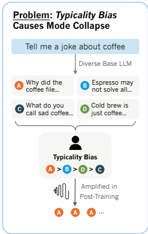

## TL;DR

这篇论文提出了一种名为**口头化采样（Verbalized Sampling, VS）** 的推理时提示方法，该方法通过明确要求模型输出多个可能的响应及其对应的概率分布，有效地恢复了LLM在预训练阶段所学的内在多样性。实验证明，VS显著提升了模型在创意写作、对话模拟、开放式问答和合成数据生成等任务中的输出多样性，同时保持了事实准确性和安全性。

## 摘要

这篇论文探讨了大型语言模型（LLMs）在对齐训练后普遍存在的**模式坍缩（mode collapse）问题**，即模型倾向于生成少数重复性的、缺乏多样性的输出。研究人员将这一现象归因于人类偏好数据中存在的**典型性偏差（typicality bias）**，即评估者偏爱基础模型中更常见的响应。为解决此问题，论文提出了一种名为**口头化采样（Verbalized Sampling, VS）** 的推理时提示方法，该方法通过明确要求模型输出响应及其对应的概率分布，有效地恢复了LLM在预训练阶段所学的内在多样性。实验证明，VS显著提升了模型在创意写作、对话模拟、开放式问答和合成数据生成等任务中的输出多样性，同时保持了事实准确性和安全性。

## 核心问题：模式崩溃(Mode Collapse)的根源

这个过程旨在让模型的回答更安全、更符合人类价值观。然而，这种训练方式也带来了一个意想不到的副作用：模型开始过度偏爱那些在训练数据中被频繁标记为“好”的常见回答，从而扼杀了其他同样有效甚至更具创意的可能性。
这种“模式坍塌”极大地限制了AI在许多领域的应用潜力，包括需要高度创造力的诗歌和故事写作、需要模拟复杂人类行为的社会科学研究，以及需要生成多样化数据的模型训练（即合成数据生成）等。

论文发现后训练对齐过程（如RLHF）会显著降低LLM的输出多样性，导致**模式崩溃**现象。这个过程旨在让模型的回答更安全、更符合人类价值观。然而，这种训练方式也带来了一个意想不到的副作用：模型开始过度偏爱那些在训练数据中被频繁标记为“好”的常见回答，从而扼杀了其他同样有效甚至更具创意的可能性。这种“模式坍塌”极大地限制了AI在许多领域的应用潜力，包括需要高度创造力的诗歌和故事写作、需要模拟复杂人类行为的社会科学研究，以及需要生成多样化数据的模型训练（即合成数据生成）等。

过去，研究者们普遍认为“模式坍塌”是算法本身的局限性造成的。但最近的一项研究提出了一个颠覆性的观点：问题的根源并非算法，而是用于训练AI的人类偏好数据中普遍存在的一种“典型性偏见”（typicality bias）。

这个概念源于**认知心理学**。人类大脑在处理信息时，会不自觉地依赖一系列认知捷径。例如，可用性启发（availability heuristic）让我们更偏爱那些容易想到的信息；处理流畅性（processing fluency）让我们觉得内容越容易理解，其质量就越高、也越真实；而图式一致性（schema congruity）则让我们更容易接受那些符合现有思维框架的信息。这些认知捷径汇集在一起，导致了“典型性偏见”的产生：当人类标注员在评估AI生成的多个回答时，即使这些回答在质量和正确性上不相上下，他们也会无意识地偏爱那些更“典型”、更符合常规思维的选项。
研究人员不只是提出了这一假说，他们还通过实证数据验证了它的存在。通过分析一个大型人类偏好数据集（HELPSTEER），他们发现，在控制了回答正确性的情况下，人类标注员仍然存在一种具有统计显著性的倾向，更喜欢那些在语言上更“典型”的AI回答。
这种偏见就像一个“决胜局”，在多个高质量答案之间，它促使模型最终选择了最平庸、最不出错的那一个。这也就意味着，即便我们拥有完美的对齐算法，只要训练数据中存在这种根深蒂固的人类偏见，“模式坍塌”的现象就依然无法避免。

## 简单的解决方案：言语化采样(Verbalized Sampling, VS)

既然问题出在训练数据中的人类偏见，那么解决方案或许不必修改复杂的算法。研究人员提出了一种无需重新训练、仅通过改变提问方式就能解决问题的技巧,一种**简单无需训练的策略**：——“言语化采样”（Verbalized Sampling, VS）。

### 核心方法

• 传统提示："讲一个关于咖啡的笑话"（直接生成单个实例）

• VS提示："生成5个关于咖啡的笑话及其对应概率"（要求模型言语化概率分布）

### 工作原理

不同提示会崩溃到不同的模式：
• 实例级提示→崩溃到基础模型的模式实例

• 列表级提示→崩溃到均匀分布

• 分布级提示(VS)→近似基础模型预训练期间学到的真实分布

## 实验验证与效果

论文在多个任务上进行了全面实验：

1. 创意写作（诗歌、故事、笑话）

• VS将多样性提高1.6-2.1倍

• 恢复基础模型66.8%的多样性

• 人类评估分数提高25.7%

2. 对话模拟

• VS生成更接近人类行为的捐赠分布

• 模拟更现实的抵抗和改变主意行为

3. 开放式问答

• 显著降低与预训练分布的KL散度

• 提高答案覆盖率而不牺牲准确性

4. 合成数据生成

• 生成更多样化的数学问题

• 下游数学任务性能提升

VS之所以有效，其背后的直觉非常巧妙。本质上，直接提问是在要求模型根据其对齐训练，找到那个单一最可能的“正确”答案。相比之下，要求模型生成一个分布，则是在引导它产出对其预训练阶段所学的整个答案可能性图景的最准确描述。正是这种任务本身的微妙转变，重新打开了通往多样性的大门。

## 重要发现

1. 能力越强的模型从VS中获益越多
2. VS保持事实准确性和安全性
3. 可通过概率阈值调节多样性水平
4. 与温度调节等解码策略正交，可结合使用

## 理论贡献

1. 新模式崩溃理论框架：从数据角度理解对齐模型行为
2. 无需训练的解决方案：仅通过提示即可系统改善质量-多样性权衡
3. 实证验证：跨任务和模型系列的全面实验证明有效性

这项研究为理解和对齐LLM的行为提供了新的视角，特别是在需要创造性和多样输出的应用场景中具有重要价值。代码已开源在：<https://github.com/CHATS-lab/verbalize-sampling>

## 参考文献

- [论文](https://arxiv.org/abs/2510.04618)
- [代码](https://github.com/CHATS-lab/verbalize-sampling)
