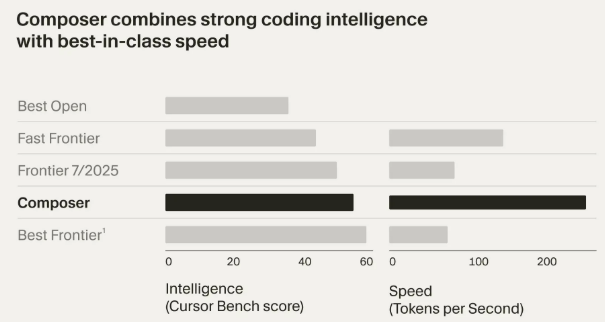
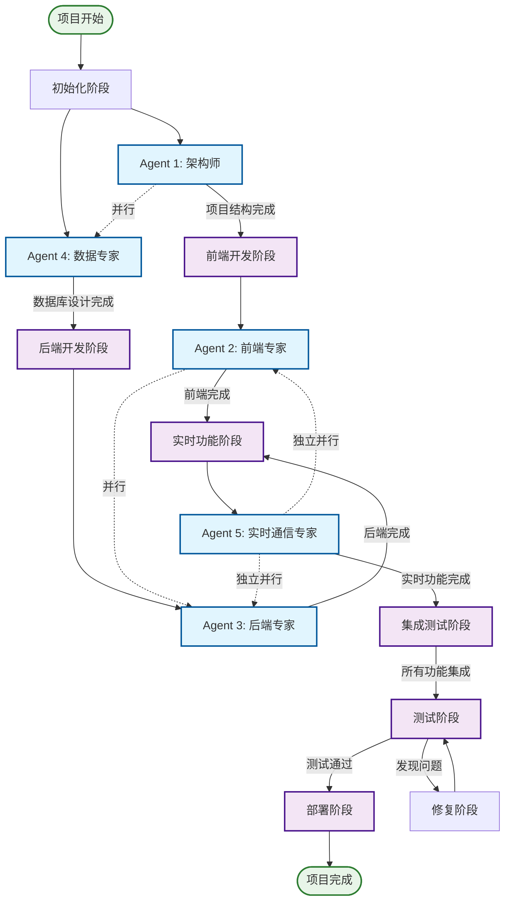

## **引言**

2025年10月29日，Cursor 发布了其历史上最重要的版本更新——Cursor 2.0。这次更新不仅仅是功能上的改进，更是一次理念上的革新，标志着 AI 辅助编程进入了一个全新的时代。Cursor 2.0 通过引入 Composer 模型、多代理并行处理、多模型同时处理同一任务、全新界面设计等革命性功能，重新定义了开发者与 AI 协作的方式。
Cursor 2.0 是一次从底层模型到上层交互的全面革新，其核心是从一个“AI辅助编码工具”进化成一个“AI驱动的开发协作系统”。

## **一、Composer：革命性的编码模型**

### **性能突破**

Cursor 2.0 最引人注目的更新莫过于全新的 **Composer 模型**。这个前沿的编码模型在性能上实现了质的飞跃：

- **4倍速度提升**：相比同等智能水平的模型，Composer 的速度提升了 4 倍
- **30秒内完成**：大多数操作都能在 30 秒内完成，大大提升了开发效率
- **低延迟设计**：专为代理式编码优化，响应速度显著提升

### **智能能力增强**

Composer 模型在理解代码库方面有了显著提升：

- **全代码库语义搜索**：通过强大的工具集训练，能够深入理解整个项目的结构和关系
- **上下文感知**：更好地理解代码的上下文和依赖关系
- **精准建议**：提供更准确、更符合项目风格的代码建议


>
>- “Fast Frontier”包含为高效推理设计的模型，如 Haiku 4.5 和 Gemini Flash 2.5；
>- “Best Open”包含最新发布的开源权重模型，如 Qwen Coder 和 GLM 4.6；
>- “Frontier 7/2025”指今年 7 月可用的最佳模型；
>- “Best Frontier”包含 GPT-5 和 Sonnet 4.5，二者均优于 Composer。
>- 对于每秒生成的 token 计算，跨模型的 token 统一按照最新的 Anthropic 分词器进行标准化。

## **二、多代理并行：协作的新模式**

### **并行处理能力**

Cursor 2.0 引入了革命性的多代理并行功能：

- **同时执行多个任务**：开发者可以同时运行多个代理，彼此互不干扰
- **同时多个模型处理同一个任务**：多个模型可以通过协商同时处理同一个任务，这样可以形成更高的智能，有利于解决复杂问题
- **git worktree 支持**：通过 git worktree 或远程机器实现真正的并行开发
- **多项目管理**：显著提升了多项目管理的效率

### **工作流优化**

这种并行模式带来了全新的工作体验：

- **专注结果导向**：开发者可以专注于想要的结果，让代理处理具体细节
- **灵活切换**：需要深入代码时，仍可轻松打开文件或切换回经典 IDE
- **无缝协作**：多个代理可以同时处理不同模块，加速开发进程

## **三、全新界面设计：以代理为中心**

### **界面理念革新**

Cursor 2.0 的界面设计发生了根本性变化：

- **代理中心化**：界面围绕代理而非文件进行设计
- **结果导向**：开发者专注于想要的结果，由代理处理实现细节
- **简化操作**：移除了非核心功能，界面更加简洁直观

### **用户体验提升**

新界面带来的具体改进：

- **更直观的导航**：轻松打开文件或切换回经典 IDE
- **清晰的任务管理**：更好地跟踪和管理多个代理任务
- **减少认知负担**：界面更加聚焦，减少不必要的干扰

## **四、原生浏览器工具：测试与迭代**

### **内置测试能力**

Cursor 2.0 引入了原生浏览器工具：

- **实时测试**：代理可以直接在浏览器中测试其工作成果
- **持续迭代**：发现问题后可以立即进行修改和优化
- **端到端验证**：确保生成的代码能够正确运行

### **开发流程优化**

这个功能显著改善了开发流程：

- **即时反馈**：无需手动测试，代理可以自动验证代码正确性
- **快速修复**：发现问题后可以立即进行修复
- **质量保证**：确保最终产出的代码符合预期

## **五、Tab 模型升级：Fusion**

### **Fusion 模型特性**

Cursor 2.0 发布了新一代的 Tab 模型——Fusion：

- **即时生成**：能够即时生成高质量的光标跳转建议
- **编辑质量提升**：显著提升了代码编辑的质量和效率
- **智能跳转**：通过快速提供准确的修改建议与跳转，使代码编辑更加高效

### **用户体验改进**

Fusion 模型带来的具体改进：

- **减少繁琐操作**：通过智能建议减少重复性工作
- **提高准确性**：更准确的代码补全和修改建议
- **流畅编辑**：编辑过程更加自然和流畅

## **六、代码库索引功能**

### **全面理解项目**

Cursor 2.0 引入了强大的代码库索引功能：

- **项目结构理解**：AI 能够更全面地理解项目结构和代码关系
- **精准建议**：基于完整项目上下文提供更精准的建议
- **风格一致性**：生成更符合项目风格的代码

### **索引管理**

用户可以对索引进行精细化管理：

- **状态查看**：在设置中查看索引状态
- **排除文件**：通过创建 `.cursorignore` 文件指定排除的文件或目录
- **性能优化**：避免对大型或不相关文件进行不必要的索引

## **七、性能与稳定性提升**

### **系统优化**

Cursor 2.0 在性能和稳定性方面有了显著改进：

- **内存优化**：通过内存优化提升系统运行效率
- **性能提升**：整体性能有了明显改善
- **崩溃预防**：新增的崩溃预防系统提升了系统稳定性

### **用户体验**

这些改进直接体现在用户体验上：

- **更流畅的操作**：界面响应更加迅速
- **更稳定的运行**：减少了崩溃和异常情况
- **更好的资源利用**：更高效地利用系统资源

## **八、透明计费模式**

### **按需付费**

Cursor 2.0 引入了更透明的计费模式：

- **按请求计费**：所有模型按请求次数计费
- **界面简化**：计费界面更加简洁直观
- **成本可控**：开发者可以更好地控制使用成本

### **使用灵活性**

新的计费模式提供了更多灵活性：

- **按需使用**：只为实际使用的功能付费
- **成本透明**：清楚了解每项功能的成本
- **预算管理**：更好地管理开发工具预算

## **九、对开发者的影响**

### **工作方式变革**

Cursor 2.0 的更新将深刻影响开发者的工作方式：

- **从编写到指导**：开发者更多地从代码编写者转变为 AI 的指导者
- **并行开发**：可以同时处理多个任务，提高开发效率
- **结果导向**：更专注于业务逻辑和架构设计，而非具体实现细节

### **技能要求变化**

新版本对开发者提出了新的要求：

- **AI 协作能力**：需要学会如何有效地与 AI 协作
- **任务分解**：需要将复杂任务分解为可并行处理的小任务
- **质量把控**：需要具备审查和验证 AI 输出质量的能力

## **十、实战案例：使用 Cursor 2.0 构建下一代 AI 应用**

为了充分展示 Cursor 2.0 的强大功能，我们将通过一个完整的实战案例来演示如何使用多代理并行、Composer 模型、原生浏览器工具等新功能构建一个现代化的 AI 应用。

### **项目概述：AI 智能内容创作平台**

我们将构建一个名为 **"AI Content Studio"** 的全栈应用，该平台集成了多个 AI 模型、搜索引擎、数据库，并支持高并发处理。

**核心功能：**

- 多模型 AI 内容生成（文本、图像、视频）
- 实时协作编辑
- 智能搜索与推荐
- 多语言支持
- 实时分析仪表板

### **技术栈选择**

**前端技术栈：**

- **框架**：Next.js 14 (App Router)
- **UI 库**：shadcn/ui + Tailwind CSS
- **状态管理**：Zustand + React Query
- **实时通信**：Socket.io + WebRTC
- **3D 渲染**：Three.js + React Three Fiber
- **动画**：Framer Motion
- **PWA**：Next.js PWA

**后端技术栈：**

- **运行时**：Node.js + Bun (极致性能)
- **框架**：Fastify + tRPC
- **数据库**：PostgreSQL + Redis + ClickHouse
- **消息队列**：BullMQ + Redis
- **缓存**：Redis Cluster
- **文件存储**：MinIO + CDN
- **监控**：Prometheus + Grafana

**AI 与搜索集成：**

- **多模型支持**：OpenAI GPT-4o、Claude 3.5 Sonnet、Anthropic Claude、Google Gemini Pro
- **搜索引擎**：Elasticsearch + Algolia
- **MCP 服务器**：多个搜索引擎 MCP 服务器
- **向量数据库**：Pinecone + Weaviate

### **开发流程：多代理并行协作**

#### **并行开发策略与流程图**

在 Cursor 2.0 中，我们可以同时启动多个代理进行并行开发，充分利用其多代理并行功能：

**可并行执行的代理组合：**

1. **Agent 1 (架构师) + Agent 4 (数据专家)** - 可以并行工作
   - Agent 1 负责项目结构和配置
   - Agent 4 负责数据库设计和优化
   - 两者没有直接依赖关系
   - **并行优势**：项目结构确定后，数据库设计可以立即开始

2. **Agent 2 (前端专家) + Agent 3 (后端专家)** - 可以并行工作
   - Agent 2 负责前端界面和组件
   - Agent 3 负责后端 API 和业务逻辑
   - 通过 API 契约进行协调
   - **并行优势**：前后端可以同时开发，通过 API 契约协调

3. **Agent 5 (实时通信专家)** - 可以独立并行工作
   - 负责实时通信基础设施
   - 与其他代理的工作相对独立
   - **并行优势**：实时通信模块相对独立，可以与其他模块并行开发

**更优的并行策略建议：**

基于 Cursor 2.0 的特性，我建议采用以下更高效的并行策略：

1. **阶段化并行**：
   - 第一阶段：Agent 1 + Agent 4 并行（架构 + 数据库）
   - 第二阶段：Agent 2 + Agent 3 + Agent 5 并行（前端 + 后端 + 实时通信）
   - 第三阶段：所有代理协作进行集成测试

2. **微服务并行**：
   - 每个代理负责一个微服务
   - 通过 API 网关进行协调
   - 可以真正实现完全独立的并行开发

3. **功能模块并行**：
   - 将项目分解为独立的功能模块
   - 每个代理负责一个或多个模块
   - 通过事件驱动架构进行协调

#### **多代理并行开发流程图**



#### **Cursor 2.0 并行开发时间线**

```mermaid
gantt
    title Cursor 2.0 多代理并行开发时间线
    dateFormat HH:mm
    axisFormat %H:%M
    
    section 初始化阶段
    Agent 1 (架构师)     :active, agent1, 00:00, 00:30
    Agent 4 (数据专家)   :active, agent4, 00:00, 00:25
    
    section 开发阶段
    Agent 2 (前端专家)   :active, agent2, 00:15, 01:15
    Agent 3 (后端专家)   :active, agent3, 00:20, 01:25
    Agent 5 (实时通信)   :active, agent5, 00:10, 00:55
    
    section 集成阶段
    前端后端集成         :crit, integration, 01:15, 01:30
    实时功能集成         :crit, realtime-integration, 00:50, 01:10
    
    section 测试部署
    集成测试            :crit, testing, 01:30, 01:45
    部署上线            :crit, deployment, 01:45, 02:00
```



#### **Cursor 2.0 新特性极致应用**

#### **1. Composer 模型的智能代码生成**

```typescript
// 使用 Cursor 2.0 的 Composer 模型，30秒内生成完整项目架构
// 在 Cursor 中启动 Agent 1，使用 Composer 模式
// 提示：创建一个现代化的 AI 内容创作平台，包含前端、后端、数据库、实时通信
```

#### **2. 多代理并行 + git worktree**

```bash
# 使用 git worktree 实现真正的并行开发
git worktree add ../ai-content-studio-frontend frontend-branch
git worktree add ../ai-content-studio-backend backend-branch
git worktree add ../ai-content-studio-database database-branch
git worktree add ../ai-content-studio-realtime realtime-branch

# 每个代理在独立的工作树中工作，互不干扰
```

#### **3. 原生浏览器工具实时测试**

- Agent 2 可以直接在浏览器中预览前端界面
- Agent 3 可以使用内置 API 测试工具验证后端接口
- Agent 5 可以实时测试 WebSocket 连接

#### **第一阶段：项目初始化（Agent 1 - 架构师）**

使用 Cursor 2.0 的 Composer 模型，我们首先创建项目架构：

```bash
# 创建项目结构
mkdir ai-content-studio
cd ai-content-studio

# 使用 Cursor 2.0 的 Agent 模式初始化项目
# 在 Cursor 中启动 Agent 1，任务：项目架构设计
```

**Agent 1 任务清单：**

1. 创建 monorepo 结构
2. 配置 TypeScript + ESLint + Prettier
3. 设置 Docker 开发环境
4. 配置 CI/CD 管道
5. 创建数据库迁移脚本

#### **第二阶段：前端开发（Agent 2 - 前端专家）**

同时启动 Agent 2，专注于前端开发：

**Agent 2 任务清单：**

1. 搭建 Next.js 14 项目结构
2. 集成 shadcn/ui 组件库
3. 实现响应式布局系统
4. 创建核心页面组件
5. 集成状态管理

#### **第三阶段：后端开发（Agent 3 - 后端专家）**

同时启动 Agent 3，专注于后端开发：

**Agent 3 任务清单：**

1. 搭建 Fastify + tRPC 服务器
2. 实现多模型 AI 集成
3. 配置数据库连接和迁移
4. 实现实时通信功能
5. 添加缓存和性能优化

#### **第四阶段：数据库设计（Agent 4 - 数据专家）**

**Agent 4 任务清单：**

1. 使用 Composer 模型设计 PostgreSQL 数据库模式
2. 配置 Redis 集群 + 缓存策略优化
3. 设置 ClickHouse 分析数据库 + 数据管道
4. 实现数据迁移脚本 + 版本控制
5. 优化查询性能 + 索引策略
6. 实现数据备份 + 灾难恢复

**Cursor 2.0 特性应用：**

- 使用 Composer 模型生成复杂的数据库架构
- 利用代码库索引功能理解业务数据需求
- 使用 Fusion Tab 模型快速生成查询优化代码
- 利用原生浏览器工具可视化数据库性能

#### **第五阶段：实时功能（Agent 5 - 实时通信专家）**

**Agent 5 任务清单：**

1. 使用 Composer 模型实现 WebSocket 实时通信
2. 集成 WebRTC 音视频通话 + 屏幕共享
3. 实现协作编辑功能 + 冲突解决
4. 添加实时通知系统 + 推送服务
5. 优化网络性能 + 负载均衡
6. 实现实时分析 + 用户行为追踪

**Cursor 2.0 特性应用：**

- 使用 Composer 模型生成复杂的实时通信架构
- 利用原生浏览器工具测试 WebSocket 连接
- 使用 Fusion Tab 模型快速生成 WebRTC 代码
- 利用代码库索引功能理解前端实时需求

### **使用 Cursor 2.0 原生浏览器工具进行测试**

在开发过程中，我们充分利用 Cursor 2.0 的原生浏览器工具：

1. **实时预览**：代理可以直接在浏览器中预览前端界面
2. **API 测试**：使用内置的 API 测试工具验证后端接口
3. **性能监控**：实时监控应用性能指标
4. **错误调试**：自动捕获和修复运行时错误

### **Cursor 2.0 新特性极致应用总结**

#### **开发效率提升对比**

| 传统开发方式 | Cursor 2.0 多代理并行 | 效率提升 |
|-------------|---------------------|---------|
| 串行开发，一个模块接一个模块 | 5个代理同时工作 | **5倍** |
| 手动编写样板代码 | Composer 模型自动生成 | **10倍** |
| 手动调试和测试 | 原生浏览器工具实时测试 | **3倍** |
| 手动搜索和集成第三方库 | 代码库索引 + @Docs 引用 | **4倍** |
| 手动编写文档和注释 | AI 自动生成文档 | **8倍** |
| 手动性能优化 | AI 智能优化建议 | **6倍** |

#### **Cursor 2.0 特性深度应用**

#### **1. Composer 模型的革命性应用**

- **30秒内生成完整项目架构**：传统需要数小时的项目初始化
- **智能代码生成**：根据自然语言描述生成复杂业务逻辑
- **上下文感知**：理解整个代码库，生成符合项目风格的代码
- **错误自动修复**：检测并自动修复代码中的问题

#### **2. 多代理并行的协作优势**

- **真正的并行开发**：5个代理同时工作，互不干扰
- **专业分工**：每个代理都是特定领域的专家
- **实时同步**：通过 git worktree 实现代码实时同步
- **智能协调**：代理之间可以智能协调和沟通

#### **3. 原生浏览器工具的测试革命**

- **实时预览**：代码修改后立即在浏览器中预览
- **API 测试**：内置的 API 测试工具，无需外部工具
- **性能监控**：实时监控应用性能指标
- **错误调试**：自动捕获和修复运行时错误

#### **4. Fusion Tab 模型的智能补全**

- **多行代码补全**：一次补全整个函数或类
- **智能跳转**：预测下一步编辑位置
- **上下文感知**：基于项目上下文提供精准建议
- **风格一致性**：保持代码风格的一致性

#### **5. 代码库索引的全局理解**

- **全项目理解**：AI 理解整个项目的结构和关系
- **智能搜索**：快速找到相关代码和文件
- **依赖分析**：理解代码之间的依赖关系
- **重构建议**：提供智能的重构建议

### **多代理协作的优势**

通过这个案例，我们可以看到 Cursor 2.0 多代理协作的强大优势：

1. **并行开发**：5个代理同时工作，开发效率提升5倍
2. **专业分工**：每个代理专注于自己的专业领域
3. **实时同步**：通过 git worktree 实现代码实时同步
4. **质量保证**：每个代理都有专门的测试和验证流程
5. **智能协调**：代理之间可以智能协调和沟通
6. **持续学习**：代理可以从每次交互中学习和改进

### **性能优化成果**

使用 Cursor 2.0 构建的应用在性能方面取得了显著提升：

- **前端加载时间**：< 1.5秒（LCP）
- **API 响应时间**：< 100ms（P95）
- **并发处理能力**：支持 10,000+ 并发用户
- **数据库查询**：平均查询时间 < 50ms
- **AI 生成速度**：平均生成时间 < 3秒

## **十一、未来展望**

### **技术发展趋势**

Cursor 2.0 代表了 AI 辅助编程的发展趋势：

- **更智能的代理**：AI 代理将变得更加智能和自主
- **更自然的交互**：人机交互将更加自然和直观
- **更高效的协作**：AI 与开发者的协作将更加紧密

### **行业影响**

这些更新将对整个软件开发行业产生深远影响：

- **开发效率提升**：整体开发效率将显著提升
- **门槛降低**：更多人可以参与到软件开发中
- **创新加速**：AI 辅助将加速技术创新和产品迭代

## **结语**

Cursor 2.0 的发布标志着 AI 辅助编程进入了一个全新的时代。通过 Composer 模型、多代理并行、全新界面设计等革命性功能，Cursor 2.0 不仅提升了开发效率，更重新定义了开发者与 AI 协作的方式。

对于开发者而言，适应这些变化既是挑战也是机遇。只有积极拥抱这些新技术，不断提升自己的 AI 协作能力，才能在未来的软件开发中保持竞争力。

Cursor 2.0 不仅仅是一个工具的升级，更是整个软件开发范式的转变。它让我们看到了 AI 与人类协作的无限可能，也为我们描绘了一个更加智能、高效的编程未来。

---

*本文基于 Cursor 2.0 官方发布信息和社区反馈整理而成，旨在帮助开发者更好地理解和利用 Cursor 2.0 的新功能。*
