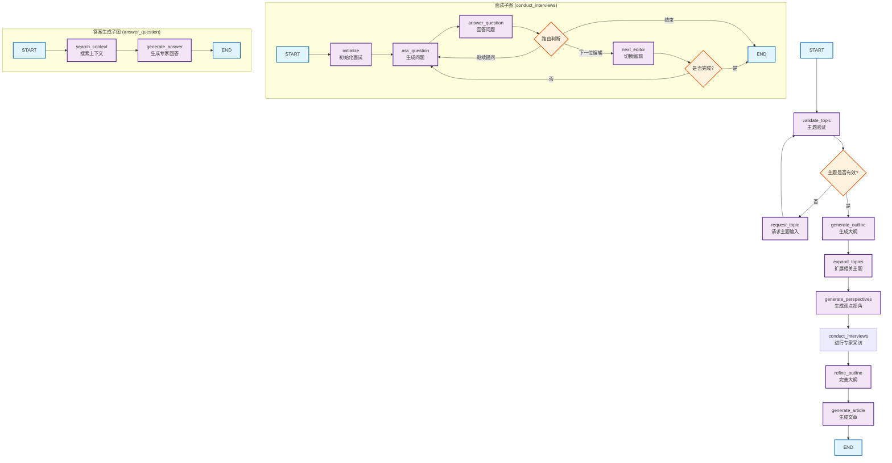

1. STORM 是什么？它的主要目标是什么？
STORM（通过检索和多视角提问来合成主题大纲）是一个基于大型语言模型（LLM）的写作系统，旨在从零开始编写结构良好、内容丰富的长篇文章，其广度和深度可与维基百科页面媲美。它的主要目标是自动化文章写作的“预写作阶段”，这包括研究给定主题和在开始写作之前准备大纲。

2. STORM 如何处理预写作阶段？
STORM 通过以下几个关键步骤来处理预写作阶段：

- 发现不同视角： 它通过考察与给定主题相关的现有维基百科文章，识别研究该主题的不同视角。
- 模拟对话： 它模拟不同视角的写作者与一个主题专家（基于可信互联网来源）之间的对话。在这些多轮对话中，写作者（LLM）根据当前主题、其特定视角和对话历史提问，而专家（LLM与检索系统结合）则根据搜索到的信息回答问题。
- 策划信息并创建大纲： 基于收集到的信息和 LLM 的内在知识，STORM 策划这些信息并创建一个详细的大纲。这个大纲随后可以逐节扩展，形成一篇完整的文章。

3. STORM 系统在生成文章时采用了哪些核心技术或方法？
STORM 系统核心采用了检索增强生成（RAG）方法，特别是通过“多视角提问”和“模拟对话”来增强检索过程。它不像传统的 RAG 系统可能只进行一次检索，而是通过模拟专家访谈式的多轮对话来引导信息检索和知识收集。此外，它利用 LLM 的能力从相关文章中识别视角并根据这些视角生成有针对性的问题，从而确保收集到更全面和深入的信息。

4. 为什么 STORM 强调“预写作阶段”？这个阶段为何重要？
预写作阶段在人类写作过程中至关重要，它涉及信息收集和整理（即研究）。研究表明，成功的学术写作很大程度上依赖于大纲的规划、起草和校对。STORM 强调预写作是因为高质量的长篇文章需要基于扎实的、有条理的研究。通过自动化这个阶段，STORM 可以帮助写作者克服从零开始研究一个新主题的挑战，确保文章的 groundedness（基于事实）和全面性。

5. STORM 如何利用“视角”来指导信息收集？
STORM 利用“视角”作为先验知识来引导 LLM 提出更有深度的问题。就像商业中的利益相关者理論认为不同利益相关者关注公司不同方面一样，拥有不同视角的人们在研究同一主题时会关注不同的方面。STORM 通过考察相关维基百科文章识别出潜在的视角，然后分配这些视角给模拟的写作者。这些写作者会根据其特定视角提出问题，从而确保信息收集的广度，覆盖主题的多个方面。例如，研究奥运会开幕式，事件策划者会关注交通安排和预算，而普通人可能只关心基本信息。

6. STORM 如何评估其生成的文章和预写作阶段的质量？
STORM 使用专门策划的 FreshWiki 数据集进行评估，该数据集包含最近的高质量维基百科文章，以避免训练数据泄露。它针对文章和预写作阶段（大纲）都建立了评估标准。评估包括自动指标（如 ROUGE 分数、实体召回率）和人工评估。人工评估由经验丰富的维基百科编辑进行，他们评估文章的兴趣水平、组织结构、相关性、覆盖度和可验证性。实验结果表明，STORM 在多项自动和人工评估指标上优于基线方法。

7. Co-STORM 是什么？它与 STORM 有何不同？
Co-STORM 是 STORM 的一个增强版本，它支持人与 LLM 系统的协作知识策展。虽然 STORM 自动化了整个过程，但 Co-STORM 允许用户观察并偶尔引导多个 LLM 代理之间的讨论。用户可以“参与”到模拟对话中，从而发现他们可能不知道的“未知未知”信息。Co-STORM 还维护一个动态更新的“思维导图”，帮助用户追踪讨论并组织收集到的信息，最终生成一份全面的报告。这使得信息获取过程更符合人类学习和信息探索的方式。

8. 维基百科编辑对 STORM 的看法如何？
根据对经验丰富的维基百科编辑的人工评估，所有参与者都认为 STORM 对他们的预写作阶段很有帮助。70% 的编辑认为它对于编辑新主题的维基百科文章很有用，而 70% 的编辑也认为它对维基百科社区是一个潜在的有用的工具。这表明 STORM 的方法论和产出得到了目标用户群体的积极反馈，尤其是在协助研究和组织信息方面。

## STORM工作流程

基于我对STORM代码的深入分析，创建一个详细的STORM工作流程的Mermaid图表。

```mermaid
graph TD
    A["开始: STORM 系统"] --> B["初始化配置"]
    B --> B1["配置多层次LM模型<br/>- 对话模拟器LM<br/>- 问题提问LM<br/>- 大纲生成LM<br/>- 文章生成LM<br/>- 文章润色LM"]
    B --> B2["配置检索模块<br/>- YouRM, BingSearch<br/>- VectorRM, SerperRM等"]
    B --> B3["设置运行参数<br/>- 最大对话轮数<br/>- 最大视角数<br/>- 搜索top-k<br/>- 并发线程数等"]
    
    B1 --> C["预写作阶段 (Pre-writing Stage)"]
    B2 --> C
    B3 --> C
    
    subgraph "预写作阶段: 知识管理"
        C --> C1["视角发现"]
        C1 --> C1a["查找相关主题<br/>搜索相关Wikipedia页面"]
        C1a --> C1b["分析相关页面大纲<br/>提取目录结构"]
        C1b --> C1c["生成多视角人物角色<br/>例: 基础事实写手、专业研究者、产业专家"]
        C1c --> C2["多视角对话模拟"]
        
        C2 --> C2a["为每个视角创建Wikipedia写手"]
        C2a --> C2b["并行启动多个对话"]
        C2b --> C3["单个对话流程"]
        
        C3 --> C3a["Wikipedia写手提问<br/>基于角色视角生成问题"]
        C3a --> C3b["主题专家回答"]
        C3b --> C3c["专家生成搜索查询<br/>查询分解: 问题→多个搜索查询"]
        C3c --> C3d["并行信息检索<br/>多线程搜索外部知识源"]
        C3d --> C3e["信息过滤<br/>排除不可靠来源"]
        C3e --> C3f["基于检索信息生成答案<br/>包含内联引用"]
        
        C3f --> C3g{"对话是否继续?<br/>检查最大轮数"}
        C3g --> |"是"| C3a
        C3g --> |"否"| C4["对话记录存储"]
        
        C4 --> C4a["存储对话历史<br/>DialogueTurn对象"]
        C4a --> C4b["构建信息表<br/>URL到信息映射"]
        C4b --> C4c["收集所有搜索结果<br/>去重和整理"]
        C4c --> D["写作阶段 (Writing Stage)"]
    end
    
    subgraph "写作阶段: 文章生成"
        D --> D1["大纲生成模块"]
        D1 --> D1a["初步大纲生成<br/>基于LM参数知识"]
        D1a --> D1b["对话历史处理<br/>清理和截断对话内容"]
        D1b --> D1c["大纲优化<br/>基于对话信息改进大纲"]
        D1c --> D1d["生成层次化大纲<br/># ## ### 表示层级"]
        
        D1d --> D2["文章生成模块"]
        D2 --> D2a["准备信息表<br/>编码片段用于检索"]
        D2a --> D2b["获取一级章节列表"]
        D2b --> D2c["并行章节生成"]
        
        D2c --> D2d["单个章节生成流程"]
        D2d --> D2e["章节查询构建<br/>基于大纲生成搜索查询"]
        D2e --> D2f["信息检索<br/>从信息表中检索相关内容"]
        D2f --> D2g["章节内容生成<br/>基于检索信息写作"]
        D2g --> D2h["内联引用处理<br/>添加[1][2]格式引用"]
        
        D2h --> D3["文章组装"]
        D3 --> D3a["合并所有章节"]
        D3a --> D3b["引用索引统一<br/>重新排序引用编号"]
        D3b --> D3c["文章后处理<br/>格式化和清理"]
        
        D3c --> D4["文章润色模块"]
        D4 --> D4a["生成引言章节<br/>概述性导言"]
        D4a --> D4b{"是否去重?"}
        D4b --> |"是"| D4c["重复内容检测<br/>删除冗余信息"]
        D4b --> |"否"| D5
        D4c --> D5["最终文章输出"]
    end
    
    D5 --> E["后处理阶段"]
    E --> E1["保存配置日志<br/>run_config.json"]
    E --> E2["保存LLM调用历史<br/>llm_call_history.jsonl"]
    E --> E3["保存中间结果<br/>- conversation_log.json<br/>- storm_gen_outline.txt<br/>- storm_gen_article.txt<br/>- storm_gen_article_polished.txt"]
    E --> F["完成"]
    
    subgraph "核心数据结构"
        DS1["DialogueTurn<br/>- 用户问题<br/>- 专家回答<br/>- 搜索查询<br/>- 搜索结果"]
        DS2["StormInformationTable<br/>- 对话集合<br/>- URL到信息映射<br/>- 检索功能"]
        DS3["StormArticle<br/>- 主题名称<br/>- 层次化章节结构<br/>- 引用管理"]
    end
    
    subgraph "关键算法组件"
        ALG1["视角引导的问题提问<br/>Perspective-Guided Question Asking"]
        ALG2["模拟对话<br/>Simulated Conversation"]
        ALG3["多线程并行处理<br/>Multi-threading Processing"]
        ALG4["信息检索与过滤<br/>Information Retrieval & Filtering"]
    end
    
    subgraph "LLM模型专业化分工"
        LLM1["对话模拟器LM<br/>gpt-4o-mini<br/>处理对话历史和答案合成"]
        LLM2["问题提问LM<br/>gpt-4o-mini<br/>基于视角生成问题"]
        LLM3["大纲生成LM<br/>gpt-4-0125-preview<br/>结构化大纲生成"]
        LLM4["文章生成LM<br/>gpt-4o<br/>高质量内容生成"]
        LLM5["文章润色LM<br/>gpt-4o<br/>引言写作和内容优化"]
    end
    
    style A fill:#e1f5fe
    style C fill:#f3e5f5
    style D fill:#e8f5e8
    style E fill:#fff3e0
    style F fill:#ffebee
    
    classDef processBox fill:#ffffff,stroke:#333,stroke-width:2px
    classDef dataBox fill:#f0f0f0,stroke:#666,stroke-width:1px
    classDef algBox fill:#e3f2fd,stroke:#1976d2,stroke-width:2px
    classDef llmBox fill:#f1f8e9,stroke:#689f38,stroke-width:2px
    
    class DS1,DS2,DS3 dataBox
    class ALG1,ALG2,ALG3,ALG4 algBox
    class LLM1,LLM2,LLM3,LLM4,LLM5 llmBox
```



## STORM 工作流程详解

### **两个核心阶段**

#### **1. 预写作阶段 (Pre-writing Stage) - 知识管理**

**视角发现策略**：

- **相关主题发现**: 通过LLM查找与主题相关的Wikipedia页面
- **页面结构分析**: 解析相关页面的目录结构，提取常见的章节组织方式
- **多视角人物生成**: 基于分析结果生成不同视角的Wikipedia写手角色

**模拟对话机制**：

- **角色设定**: 每个写手都有特定的专业视角和关注重点
- **对话流程**: Wikipedia写手提问 → 主题专家基于检索回答 → 迭代进行
- **问题生成**: 基于角色视角和对话历史生成有深度的后续问题
- **信息检索**: 专家将问题分解为多个搜索查询，并行检索外部知识

#### **2. 写作阶段 (Writing Stage) - 文章生成**

**大纲生成**：

- **双层大纲策略**: 先生成基础大纲，再基于对话信息优化
- **层次化结构**: 使用 `#` `##` `###` 表示不同层级的章节

**并行文章生成**：

- **章节级并行**: 每个一级章节独立并行生成
- **信息检索**: 为每个章节从信息表中检索最相关的内容
- **引用管理**: 自动处理内联引用的编号和统一

**文章润色**：

- **引言生成**: 专门的LLM生成概述性的引言章节
- **去重处理**: 可选的重复内容检测和删除
- **格式优化**: 统一引用格式和文章结构

### **核心创新点**

1. **视角引导的问题提问 (Perspective-Guided Question Asking)**
   - 不是直接让LLM提问，而是先发现不同视角，再从这些视角出发提问
   - 确保问题的深度和广度

2. **模拟对话 (Simulated Conversation)**
   - Wikipedia写手和主题专家之间的多轮对话
   - 让LLM能够基于先前回答更新理解，提出更深入的后续问题

3. **多层次LLM专业化**
   - 不同复杂度的任务使用不同能力的模型
   - 在成本和质量之间达到平衡

4. **信息表检索机制**
   - 将对话中收集的所有信息构建成可检索的表格
   - 支持章节级别的精确信息检索

### **与Co-STORM的区别**

- **STORM**: 完全自动化的两阶段流程，无人类参与
- **Co-STORM**: 在STORM基础上增加了人机协作和实时知识库管理

**STORM的设计哲学**是将长文档生成分解为**结构化的信息收集**和**有组织的内容生成**两个阶段，通过多视角对话模拟来提高信息收集的质量，再通过专业化的LLM分工来提高文章生成的效率和质量。

这个工作流程体现了STORM作为一个**自动化维基百科式文章生成系统**的核心特点，它能够从零开始，仅基于主题名称就生成结构完整、引用充分的长篇文章。

## CO-STORM工作流程

基于我对Co-STORM代码的深入分析，创建一个详细的Mermaid流程图来描述Co-STORM的工作流程。

```mermaid
graph TD
    A["开始: Co-STORM 系统"] --> B["初始化配置"]
    B --> B1["配置LM模型<br/>- 问答模型<br/>- 话语管理模型<br/>- 话语润色模型<br/>- 热启动大纲生成模型<br/>- 问题提问模型<br/>- 知识库模型"]
    B --> B2["配置检索模块<br/>- BingSearch<br/>- YouRM<br/>- VectorRM等"]
    B --> B3["设置运行参数<br/>- 主题<br/>- 检索数量<br/>- 最大对话轮数<br/>- 专家数量等"]
    
    B1 --> C["热启动阶段 (Warm Start)"]
    B2 --> C
    B3 --> C
    
    C --> C1["背景信息收集"]
    C1 --> C1a["生成背景问题"]
    C1a --> C1b["基于检索的问答<br/>收集主题背景信息"]
    C1b --> C2["专家生成模块"]
    
    C2 --> C2a["分析背景信息"]
    C2a --> C2b["生成多视角专家<br/>例: AI研究员、产业专家、伦理学家"]
    C2b --> C3["热启动多轮对话"]
    
    C3 --> C3a["为每个专家分配角色"]
    C3a --> C3b["并行专家对话<br/>每个专家2轮对话"]
    C3b --> C3c["收集专家问答内容"]
    C3c --> C4["初始化知识库"]
    
    C4 --> C4a["信息插入模块<br/>构建层次化知识树"]
    C4a --> C4b["生成初始大纲"]
    C4b --> C4c["转换为对话记录<br/>供用户快速了解"]
    C4c --> D["主对话阶段"]
    
    D --> D1["话语管理器 (Discourse Manager)"]
    D1 --> D2{"确定下一轮策略"}
    
    D2 --> |"用户输入"| E["用户话语处理"]
    D2 --> |"系统生成"| F["系统话语生成"]
    
    E --> E1["解析用户输入"]
    E1 --> E2["添加到对话历史"]
    E2 --> H["知识库更新"]
    
    F --> F1{"选择代理类型"}
    F1 --> |"专家回答"| G1["Co-STORM专家代理"]
    F1 --> |"主持人提问"| G2["主持人代理"]
    F1 --> |"模拟用户"| G3["模拟用户代理"]
    F1 --> |"纯RAG模式"| G4["纯RAG代理"]
    
    G1 --> G1a["行动规划<br/>确定回答策略"]
    G1a --> G1b["基于检索的问答<br/>收集相关信息"]
    G1b --> G1c["生成专家回答"]
    G1c --> G1d["话语润色"]
    G1d --> G1e["引用信息处理"]
    G1e --> H
    
    G2 --> G2a["分析未使用信息片段"]
    G2a --> G2b["基于相似度排序"]
    G2b --> G2c["生成基于事实的问题"]
    G2c --> H
    
    G3 --> G3a["基于意图生成<br/>模拟用户话语"]
    G3a --> H
    
    G4 --> G4a["直接RAG问答<br/>无协作对话"]
    G4a --> H
    
    H --> H1["信息插入模块"]
    H1 --> H1a["层级导航<br/>确定信息位置"]
    H1a --> H1b["树结构插入<br/>- insert: 当前节点<br/>- step: 子节点<br/>- create: 新节点"]
    H1b --> H2["知识库重组"]
    
    H2 --> H2a["节点扩展<br/>当节点信息过多时"]
    H2a --> H2b["层次化组织<br/>维护思维导图结构"]
    H2b --> I{"对话是否继续?"}
    
    I --> |"是"| J["专家列表更新"]
    J --> J1["基于新信息<br/>动态调整专家"]
    J1 --> D1
    
    I --> |"否"| K["报告生成阶段"]
    K --> K1["遍历知识库节点"]
    K1 --> K2["按层次结构组织"]
    K2 --> K3["生成带引用的报告<br/>格式: # ## ### 表示层级<br/>[1][2] 表示引用"]
    K3 --> L["输出最终报告"]
    
    subgraph "知识库管理 (Knowledge Base)"
        KB1["层次化知识节点"]
        KB2["信息片段存储"]
        KB3["引用关系管理"]
        KB4["思维导图维护"]
        KB5["动态重组机制"]
    end
    
    subgraph "多智能体协作 (Multi-Agent Collaboration)"
        MA1["专家代理<br/>Co-STORM Expert"]
        MA2["主持人<br/>Moderator"]
        MA3["话语管理器<br/>Discourse Manager"]
        MA4["模拟用户<br/>Simulated User"]
    end
    
    subgraph "检索增强 (Retrieval Augmentation)"
        RA1["查询生成"]
        RA2["信息检索"]
        RA3["结果过滤"]
        RA4["引用处理"]
    end
    
    style A fill:#e1f5fe
    style C fill:#f3e5f5
    style D fill:#e8f5e8
    style K fill:#fff3e0
    style L fill:#ffebee

```



**Co-STORM 工作流程详解**

### 1. **初始化阶段**

- **多模型配置**: Co-STORM使用多个专门的LLM模型来处理不同任务，包括问答、话语管理、话语润色等
- **检索模块设置**: 集成多种搜索引擎（Bing、You.com、向量检索等）
- **参数配置**: 设置对话轮数、专家数量、检索深度等关键参数

### 2. **热启动阶段 (Warm Start)**

- **背景研究**: 系统首先进行主题背景信息收集
- **多视角专家生成**: 基于背景信息自动生成具有不同专业视角的虚拟专家
- **并行专家对话**: 每个专家进行多轮对话，从不同角度探讨主题
- **知识库初始化**: 将收集的信息组织成层次化的思维导图结构

### 3. **主对话阶段**

- **协作式话语协议**: 实现了一套完整的轮次管理策略
- **多智能体协作**:
  - **Co-STORM专家**: 基于检索信息生成专业回答
  - **主持人**: 基于未使用信息生成启发性问题
  - **用户**: 可以观察或主动参与对话
- **动态知识管理**: 实时更新和重组知识库结构

### 4. **知识库管理**

- **层次化信息组织**: 使用树状结构组织信息
- **智能信息插入**: 通过导航算法确定新信息的最佳位置
- **动态重组**: 当信息过多时自动扩展节点结构
- **思维导图维护**: 保持信息的逻辑层次关系

### 5. **报告生成**

- **结构化输出**: 基于知识库的层次结构生成报告
- **完整引用**: 每个信息点都有对应的来源引用
- **Wiki风格**: 采用Wikipedia式的文章结构

### 核心创新点

1. **协作式对话协议**: 不同于传统的单轮问答，Co-STORM实现了多智能体的协作对话
2. **动态思维导图**: 实时构建和维护知识的层次化结构
3. **基于检索的专家系统**: 每个专家都能基于实时检索信息进行回答
4. **人机协作**: 用户可以在任何时候介入对话，引导讨论方向

这个工作流程体现了Co-STORM作为一个**协作式知识管理系统**的核心特点，它不仅能够自动收集和组织信息，还能通过多智能体协作产生更深入和全面的知识理解。

## LangGraph STORM实现分析

LangGraph里面有个基于STORM论文和LangGraph实现，我基于这个实现，创建了一个详细的STORM工作流程图。这个流程图展示了STORM（Synthesis of Topic Outline through Retrieval and Multi-perspective question asking）系统的完整工作流程，包括以下关键阶段：


**STORM工作流程详解**

### 1. **初始化阶段**

- 用户输入研究主题（topic，也就是我们说的研究主题，query等等）
- 使用快速LLM（GPT-4o-mini）生成初始大纲（outline）
- 从Wikipedia搜索相关主题（subjects）作为参考（perspective）

### 2. **多视角编辑者生成**

- 基于相关主题生成N个不同视角的编辑者（editor）
- 每个编辑者代表不同的专业背景和关注点（perspective）
- 例如：技术实现专家、商业应用专家、学术研究专家等（role）

### 3. **专家访谈阶段（核心创新）**

- **并行执行**：多个编辑者同时进行访谈（parallel）
- **角色扮演**：编辑者（editor）提出问题，专家（expert）通过搜索引擎查询回答（role-play）
- **引用追踪**：专家回答时保存引用来源（reference）
- **轮次限制**：每次访谈最多M轮（默认5轮）（max_num_turns）
- **自然结束**：编辑者说"感谢"时结束访谈（natural end）

### 4. **大纲优化阶段**

- 收集所有访谈结果（collect_results）
- 使用长上下文LLM（GPT-4o）分析访谈内容（analyze_results）
- 基于新获得的信息优化初始大纲（refine_outline）

### 5. **参考文档索引**

- 将所有访谈中收集的引用文档进行向量嵌入（vector_embed）
- 建立向量数据库用于后续RAG检索（vector_store）

### 6. **分章节写作**

- **并行执行**：同时写作多个章节（parallel）
- **RAG检索**：每个章节写作时检索相关参考文档（rag_retrieval）
- **引用整合**：确保内容有据可查（reference_integration）

### 7. **最终文章生成**

- 合并所有章节（combine_sections）
- 使用长上下文LLM进行最终优化（final_optimization）
- 输出Wikipedia风格的完整文章（final_article）

### 关键特性

1. **多视角研究**：通过不同角色的编辑者确保内容全面性（multi-perspective）
2. **搜索增强**：每个问答都通过实时搜索获取最新信息（search_enhancement）
3. **并行处理**：访谈和写作阶段都采用并行处理提高效率（parallel_processing）
4. **引用追踪**：全程跟踪信息来源，确保内容可信度（reference_tracking）
5. **两阶段LLM**：快速LLM处理大量任务，长上下文LLM处理复杂分析（two-stage_llm）

这个工作流程的核心创新在于通过多视角的"模拟专家访谈"来获取更全面、更深入的信息，从而生成高质量的研究文章。

## Breeze-Agent (LangGraph-based STORM)

**注意：** <https://github.com/hobbytp/breeze-agent> forked自 <https://github.com/andrestorres123/breeze-agent> 并做了相应的修改。

BREEZE (Balanced Research and Expert Engagement for Zonal Exploration) 是一个用于生成类似维基百科文章的精简研究系统，通过多视角专家互动和专题探索，实现高质量的文章输出。其主要功能包括：  

- **多视角研究**：通过模拟主题专家的对话，保证内容的全面性和中立性。  
- **专家访谈系统**：与 AI 专家进行聚焦式对话，并实现信息验证和引用管理。  
- **结构化文章生成**：提供清晰的章节结构、规范的引用和一致的写作风格。  
- **专题探索**：高效定义研究边界，确保主题的深度和专注。  

本系统适合生成基于多方观点的专题文章，如技术（例如大型语言模型对软件开发的影响）、商业（如 AI 客服的崛起）和通用话题（如电动车历史与演变）。

需注意，文章质量依赖于在线信息来源，可能需要对广义主题进行细化研究。此项目基于 STORM 框架，并进行了针对维基百科风格文章生成的改进，使用 Python 开发，遵循 MIT 许可协议。

### 整体架构分析

这是一个智能的网络研究和文章生成系统，主要包含以下组件：

#### 核心组件

1. **主工作流图** (`web_research_graph/graph.py`) - 协调整个研究和文章生成过程
2. **面试子图** (`interviews_graph/`) - 模拟专家采访过程
3. **答案生成子图** (`answers_graph/`) - 处理专家问答

#### 状态管理

- **State** - 主要状态，包含主题、大纲、观点、文章等
- **InterviewState** - 面试过程的状态管理
- **TopicValidation** - 主题验证结构

#### 主要节点功能

1. **主题处理**: `validate_topic`, `request_topic`
2. **内容规划**: `generate_outline`, `expand_topics`, `generate_perspectives`
3. **专家采访**: `conduct_interviews` (子图)
4. **内容生成**: `refine_outline`, `generate_article`



### 代码整体架构详细说明

#### 1. **主要架构特点**

这个项目是一个基于**LangGraph**的智能网络研究代理，采用**多层级工作流**设计：

- **主工作流**：负责整个研究和文章生成流程
- **面试子图**：模拟多个编辑与专家的对话过程  
- **答案生成子图**：处理专家对编辑问题的回答

#### 2. **核心工作流程**

##### **阶段一：主题验证与准备**

- `validate_topic`：验证用户输入的研究主题
- `request_topic`：如果主题无效，请求用户重新输入
- `generate_outline`：基于有效主题生成初始大纲

##### **阶段二：研究扩展与观点生成**

- `expand_topics`：扩展相关研究主题
- `generate_perspectives`：生成不同视角的编辑角色

##### **阶段三：专家采访过程**

- `conduct_interviews`：执行面试子图
  - `initialize`：初始化面试环境和编辑列表
  - `ask_question`：编辑向专家提问
  - `answer_question`：专家搜索并回答（调用答案生成子图）
  - `next_editor`：切换到下一位编辑
  - **路由逻辑**：最多3轮对话，智能判断何时结束

##### **阶段四：内容完善与生成**

- `refine_outline`：基于采访结果完善大纲
- `generate_article`：生成最终文章

#### 3. **状态管理架构**

##### **主状态 (State)**

```python
- topic: TopicValidation  # 主题验证信息
- outline: Outline        # 文章大纲
- related_topics: RelatedTopics  # 相关主题
- perspectives: Perspectives     # 编辑观点
- article: str           # 最终文章
- references: dict       # 参考资料
```

##### **面试状态 (InterviewState)**

```python  
- messages: List[AnyMessage]     # 对话消息
- editor: Editor                 # 当前编辑
- editors: List[Editor]          # 所有编辑列表
- current_editor_index: int      # 当前编辑索引
- is_complete: bool             # 是否完成
```

#### 4. **关键设计特色**

1. **中断机制**：在`request_topic`节点后设置中断，允许人工干预
2. **重试策略**：面试节点配置最多5次重试
3. **智能路由**：基于对话轮数和内容判断流程走向
4. **模块化设计**：清晰的职责分离，易于维护和扩展

#### 5. **技术栈**

- **LangGraph**：工作流编排
- **LangChain**：LLM集成和消息处理
- **Pydantic**：数据结构验证
- **Python dataclasses**：状态管理

这个架构实现了一个完整的AI驱动的研究和写作流水线，能够自动进行主题研究、专家访谈、内容组织和文章生成，体现了现代AI工作流设计的最佳实践。

## 参考

- [Storm UI](https://storm.genie.stanford.edu/)
- [Storm github](https://github.com/stanfordnlp/storm)
