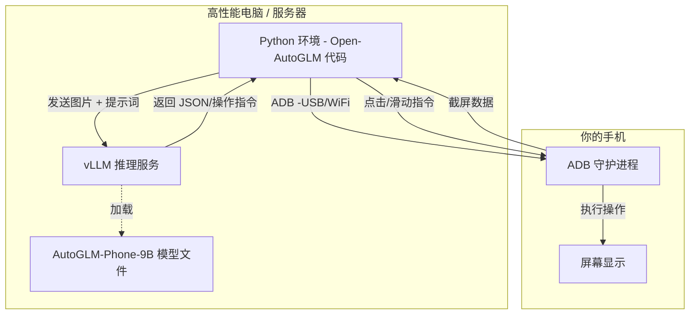

Open-AutoGLM 是一个基于 AutoGLM 构建的手机端智能助手框架，旨在通过多模态技术理解手机屏幕内容，并结合自动化操作帮助用户完成各类任务。它通过 ADB（Android Debug Bridge）控制设备，使用视觉语言模型进行屏幕感知，并结合智能规划能力生成并执行操作。用户只需用自然语言描述需求，系统即可解析意图并完成任务，如“打开小红书搜索美食”等。

核心功能包括：
- 与 50+ 主流中文手机应用的交互支持，如微信、淘宝、抖音等。
- 提供命令行与 Python API 接口，支持本地和远程的设备控制。
- 支持敏感操作确认和人工接管，确保操作安全性。
- 配置灵活，支持自定义 SYSTEM PROMPT 和调用回调函数。
- 提供详细的 Verbose 模式，展示每一步推理和执行过程。

主要技术依赖 Python 和 Android Debug Bridge，适用于 Android 7.0+ 的设备，并支持 vLLM 模型部署服务。项目代码为 Python 编写，开源于 GitHub，采用 Apache-2.0 许可证，仅供研究与学习用途。

这个项目本质上是在解决 GUI Agent（图形界面智能体） 的落地问题。简单来说：这个项目的主体程序（大脑）并不是运行在 Android 手机里的，而是运行在电脑（或服务器）上的。手机只是作为一个“执行终端”（手和眼），通过 ADB 接口被电脑上的 Python 程序接管。

## 详细技术拆解

### 1. 运行架构：Host-Device 模式
Open-AutoGLM 采用的是经典的 Client-Server（控制端-被控端） 架构，而不是我们在手机上安装一个 APK 那么简单。

* **控制端（电脑/服务器）**： 运行 Python 代码、运行大模型（或连接大模型 API）、进行逻辑判断。这是系统的“大脑”。
* **被控端（Android 手机）**： 只需要开启 开发者模式 和 ADB调试。它负责把屏幕截图传给电脑，并接收电脑发来的点击、滑动指令。这是系统的“手脚”。

### 2. Python 环境需求

需要一台安装了 Python 3.10+ 的电脑。

作用： 运行 PhoneAgent 核心逻辑，通过 adb 库与手机通信，同时负责向大模型发送请求并解析返回的坐标和操作指令。
代码示例： 文档中提到的 agent.run("打开淘宝...") 这段代码是在电脑的 Python 环境中执行的。

### 3. 关于大模型与 vLLM（关键误区澄清）

需要的模型： 项目指定使用 autoglm-phone-9b。这是一个 90 亿参数的视觉语言模型（VLM），专门针对手机 GUI 界面（图标、按钮、布局）进行了微调。 手机目前的 NPU 和内存带宽很难流畅运行 9B 规模且未经量化的模型。所以需要vLLM或SGLangl来部署模型。
流程是： 电脑（运行 vLLM）加载模型 -> 暴露 API 端口（如 localhost:8000） -> Open-AutoGLM 的 Python 脚本调用这个 API 进行推理。

4. 技术栈拓扑图
为了让你一目了然，我梳理了一个逻辑拓扑：

## 脑洞时刻

基于这个架构，我有几个比较“野”的想法，或许能激发你在全栈开发上的灵感：

1. AI“影子测试员”（Shadow QA）  
概念：把 Open-AutoGLM 变成 7×24 小时在线的“千人千面”测试军团。  
脑洞：  
- 零脚本启动：给 Agent 一个全新 APK，无需用例，它先像第一次下载的真人那样乱点，自动沉淀“最可能的用户路径热力图”。  
- 人格面具：内置 12 种用户画像（急躁白领、银发族、极客少年……），同一功能让不同人格各跑一遍，记录情绪曲线。  
- 体验黑匣子：当 Agent 在结账页卡住 5 秒，自动输出“情绪崩溃指数 87%，预计 34% 真实用户会怒卸 App”。  
价值：把“功能通过”升级为“体验通过”，让 PM 在版本发布前就拿到“用户情绪审计报告”。

2. 云手机·RPAF（Robotic Process Automation Farm）  
概念：用 Kubernetes 养一千台“Docker 安卓羊”，Open-AutoGLM 当牧羊犬。  
脑洞：  
- 秒级伸缩：一条 YAML 声明“给我 500 台抖音 9.0 环境”，30 秒后羊群就位。  
- 数据牧场：Agent 边刷视频边自动写“行为-屏幕-语音”三元组，傍晚归拢成 10 GB 高质量合成数据，当晚就能蒸馏出 3B 端侧小模型。  
- 黑产克星：同一套集群反向运行“合规巡检”任务，一旦发现 App 有诱导下载，立刻截图+录屏+生成公证报告，供监管直接采信。  
价值：把“买真机、雇测试”变成“按需租羊、数据自给”。

3. 物理世界通用接口适配器  
概念：给任何带屏幕/按键的“哑巴设备”插上 AI 声带和机械手。  
脑洞：  
- 树莓派+工业相机+AutoGLM，化身“最小可插拔智能模块”。  
- 老设备零改造：90 年代示波器、数控车床、医院血球仪，只要还有像素或实体键，就能听懂“把触发调到 50 Hz”。  
- 安全双闭环：视觉闭环确认“旋钮已旋转 37°”，力矩闭环保证“按键行程 0.8 mm”，误差超过阈值自动急停。  
价值：让“工业遗产”直接说人话，省下千万级换机成本。
