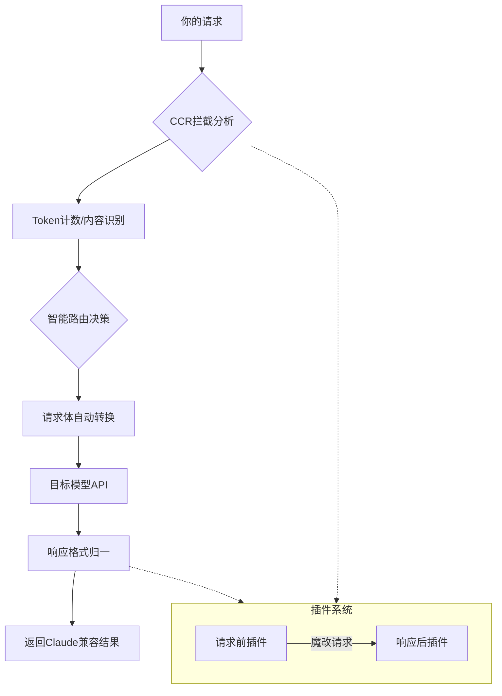
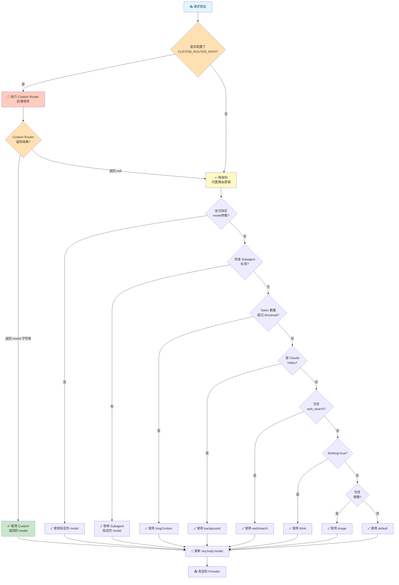

目录

- [1. 引言：AI 服务智能路由的新范式](#1-引言ai-服务智能路由的新范式)
- [2. Claude-Code-Router 核心机制总览](#2-claude-code-router-核心机制总览)
- [3. 智能路由决策机制详解](#3-智能路由决策机制详解)
- [4. 请求转换与转发机制](#4-请求转换与转发机制)
- [5. 错误处理与降级策略](#5-错误处理与降级策略)
- [6. 插件系统与扩展性](#6-插件系统与扩展性)
- [7. 性能优化与监控](#7-性能优化与监控)
- [8. 未来展望与技术挑战](#8-未来展望与技术挑战)
  
Claude-Code-Router (CCR) 是一款创新的AI模型智能路由工具，它通过拦截Claude Code 应用对Anthropic Claude模型的请求，进行多维度分析（如Token数量、用户指令、任务类型），然后依据动态路由规则和配置，将请求智能地导向最合适的AI模型（来自如Gemini、DeepSeek、本地Ollama模型等不同的模型服务提供商）。CCR的核心机制包括API格式的自动转换与适配、基于Express.js的中间件架构、异步请求处理，以及完善的错误检测、自动降级到兜底模型和潜在的重试策略，旨在提升AI服务调用的效率、灵活性和成本效益。

# 深入解析 Claude-Code-Router：AI 时代的智能路由中枢

## 1. 引言：AI 服务智能路由的新范式

在人工智能（AI）技术飞速发展的今天，大语言模型（LLM）已成为推动各行各业变革的核心引擎。然而，随着模型数量的激增以及它们在能力、性能和成本上的显著差异，如何高效、智能地管理和调度这些模型，以最大化其价值并满足多样化的应用需求，成为了一个亟待解决的关键问题。传统的单一模型服务模式已难以适应日益复杂的应用场景，开发者常常需要在不同模型的 API 之间进行繁琐的切换和适配，这不仅增加了开发成本，也限制了应用的整体性能和灵活性。正是在这样的背景下，**Claude-Code-Router (CCR)** 应运而生，它代表了一种全新的 AI 服务智能路由范式。CCR 通过其精心设计的核心算法与架构，特别是其智能路由决策机制、请求转换与转发策略以及错误处理与降级策略，为多模型的高效协作与按需调度提供了强大的技术支撑。本文将深入探讨 CCR 的这些核心技术，旨在为资深技术专家和架构师提供一个全面而深入的理解，以便更好地评估和应用此类智能路由解决方案，从而在 AI 时代构建更强大、更灵活、更经济的应用系统。

## 2. Claude-Code-Router 核心机制总览

Claude-Code-Router (CCR) 的核心机制围绕着如何智能地拦截、分析、路由、转换和转发用户请求到最合适的 AI 模型，并将模型的响应有效地返回给用户。这一过程可以概括为一个精细化的处理流水线，确保了请求在整个生命周期中得到高效和准确的处理。CCR 的设计理念在于解耦用户请求与具体模型服务，通过一个中间层来动态管理请求的流向，从而实现模型选择的灵活性、成本的可控性以及服务的鲁棒性。这个中间层，即 CCR 本身，扮演着 AI 服务智能交通枢纽的角色，根据实时的请求特性和预设的策略，将任务分配给最匹配的模型实例。

### 2.1. 请求拦截与预处理

CCR 的首要步骤是有效地拦截来自客户端（例如 Claude Code 工具）的 API 请求。这是通过一种巧妙的环境变量劫持机制实现的。具体而言，CCR 利用了 Claude Code 工具本身支持通过环境变量 `ANTHROPIC_BASE_URL` 来覆盖其默认 API 端点地址的特性 。通过设置此环境变量，可以将原本直接发送给 Anthropic 官方 API 的请求，重定向到 CCR 本地运行的服务器地址（例如 `http://localhost:3456` ）。这种拦截方式无需修改 Claude Code 工具的源代码，实现了对请求流的无侵入式接管，极大地简化了部署和集成过程。一旦请求被成功拦截到 CCR 的本地服务，预处理阶段随即开始。这个阶段主要包括对传入请求的初步校验、日志记录以及为后续的智能路由决策准备必要的上下文信息。例如，CCR 可能会提取请求头中的关键信息，或者对请求体进行初步解析，以确保请求的完整性和有效性，并为后续的分析步骤提供基础数据。

### 2.2. 核心处理流程：分析、路由、转换、转发、响应

在成功拦截并完成预处理后，CCR 的核心处理流程正式启动。这个流程可以细化为以下几个关键阶段，确保用户请求能够被智能地路由到最合适的 AI 模型，并将模型的响应有效地返回给用户 ：

1. **请求分析 (Analysis)**：在此阶段，CCR 对拦截到的请求进行深度解析。这包括提取用户指令、分析请求的 Token 数量、识别请求中可能包含的特定标记或模型名称等 。例如，CCR 会检查请求是否明确指定了目标模型，或者请求的上下文长度是否超出了某些模型的处理能力。此外，CCR 还会关注请求中是否包含如 `thinking` 这样的特殊标记，这可能指示该请求需要较强的推理能力 。这一阶段的目标是全面理解请求的特性和需求，为后续的路由决策提供充分的依据。

2. **智能路由 (Routing)**：基于请求分析阶段收集到的信息，CCR 的智能路由决策机制开始工作。它会根据预设的路由规则和策略，从可用的模型池中选择一个或多个最合适的 AI 模型来处理当前请求。这些规则可能基于模型的性能特点（如处理速度、上下文窗口大小、特定任务擅长领域）、成本考量（如不同模型的 API 调用费用）、以及当前的系统负载情况。例如，如果一个请求被识别为需要处理超长上下文，CCR 可能会将其路由到如 Gemini 这样支持百万 Token 级别的模型 。如果请求包含 `haiku` 模型名，则可能被导向处理后台任务的轻量级模型 。

3. **请求转换 (Transformation)**：一旦目标模型被选定，CCR 需要确保请求的格式与目标模型 API 所期望的格式兼容。由于不同的 AI 模型提供商（如 Anthropic, OpenAI, DeepSeek 等）可能采用不同的 API 接口规范和请求/响应数据结构，因此请求转换成为一个必不可少的环节。CCR 的核心功能之一就是实现一个 Express.js 服务，该服务提供一个 `/v1/messages` 端点，专门负责将接收到的 OpenAI 兼容格式的 API 请求，转换为目标模型（例如 Anthropic 模型）所要求的格式 。这个过程可能涉及到请求体中字段的映射、重组，以及必要的参数调整。

4. **请求转发 (Forwarding)**：在完成请求格式转换后，CCR 会将修改后的请求转发给选定的目标模型 API 端点。这个转发过程通常是异步的，以确保 CCR 本身不会被阻塞，能够继续处理其他传入的请求。CCR 会维护与各个模型 API 的连接，并负责管理这些连接的生命周期，包括超时设置、重试逻辑等。

5. **响应处理与返回 (Response Handling and Returning)**：当目标模型处理完请求并返回结果后，CCR 会接收到模型的原始响应。与请求转换类似，CCR 可能还需要对模型的响应进行格式转换，使其与客户端最初期望的响应格式（例如 OpenAI 格式）保持一致。此外，CCR 还会在此阶段进行错误处理，例如检查模型 API 返回的错误码，并根据预设的错误处理策略采取相应措施。最终，经过处理的响应会被返回给原始的客户端，完成整个请求-响应循环。

此外，CCR 还设计了一个“插件系统”，允许开发者在请求转发前或响应返回后介入处理流程，对请求或响应内容进行自定义的修改或增强，这为 CCR 提供了高度的灵活性和可扩展性 。整个流程如下图所示：



*CCR 核心处理流程及插件系统示意图*

通过这一系列精心设计的处理阶段，CCR 实现了对 AI 模型请求的智能调度和管理，为用户提供了一个统一、灵活且高效的 AI 服务接入点。

## 3. 智能路由决策机制详解

Claude-Code-Router (CCR) 的智能路由决策机制是其核心价值所在，它使得系统能够根据多种因素动态选择最合适的 AI 模型来处理用户请求。这一机制不仅仅是一个简单的负载均衡器，更是一个具备一定“智慧”的调度系统。它综合考虑了用户意图、请求特性、模型能力以及预设的优化目标（如成本、速度、效果）。通过精细化的路由策略，CCR 旨在打破单一模型在处理所有类型任务时的局限性，充分发挥不同模型的优势，从而为用户提供更优的 AI 服务体验。例如，对于需要深度推理的复杂任务，CCR 可能会将其导向能力更强但成本也可能更高的模型；而对于简单的背景任务或对成本敏感的场景，则可以选择性价比更高的模型。这种精细化的调度能力，使得 AI 资源的利用更加高效和合理。

### 3.1. 多维度请求分析

Claude-Code-Router (CCR) 的智能路由决策始于对用户请求的多维度分析。这个分析阶段的目标是全面理解请求的属性和需求，为后续的路由选择提供精确的输入。CCR 主要从以下几个方面对请求进行剖析：

1. **Token 数量分析**：这是 CCR 进行请求分类和路由决策的关键依据之一。CCR 会使用如 `tiktoken` 这样的工具来精确计算每次请求消耗的 Token 总数 。这个总数不仅包括用户直接输入的消息内容，还涵盖了系统提示（System Prompt）、工具定义（Tool Definitions）、函数调用（Function Calls）等所有在 API 交互中会计入 Token 消耗的部分 。通过精确的 Token 计数，CCR 能够判断请求的规模，例如是属于短对话、中等长度的文档处理，还是超长上下文的复杂任务。例如，如果 Token 数量超过 60,000，CCR 会将其识别为超长上下文任务，从而可能将其路由到专门为此优化的模型，如 Gemini 。

2. **请求内容识别**：除了 Token 数量，CCR 还会分析请求的具体内容，以识别其潜在的任务类型或特殊需求。这可能包括对请求文本进行关键词提取、意图识别或模式匹配。例如，如果请求中包含特定的指令或标记，如 `thinking` 标记，CCR 会将其识别为需要深度推理的任务 。同样，如果模型名称中包含了如 `haiku` 这样的标识，CCR 可能会将其视为后台任务，从而采用相应的路由策略 。

3. **用户指令与偏好**：CCR 尊重用户的显式指令。如果用户在请求中通过特定的命令（如 `/model` 命令）强制指定了希望使用的模型，CCR 会优先遵循用户的意愿 。这种机制保证了用户在特定场景下对模型选择的控制权。

4. **系统与工具定义分析**：CCR 还会关注请求中是否涉及特定的系统提示或工具定义。这些信息往往暗示了任务的复杂度和对模型能力的要求。例如，如果一个请求中定义了复杂的工具调用流程，那么 CCR 可能会倾向于选择一个在工具使用方面表现更佳的模型。

通过对这些维度的综合分析，CCR 能够构建一个关于当前请求的详细画像，从而为后续的智能路由决策提供坚实的基础。这种精细化的分析能力是 CCR 实现高效、精准模型调度的前提。

### 3.2. 动态路由规则与调度算法

Claude-Code-Router (CCR) 的动态路由规则与调度算法是其智能决策的核心，它基于对请求的多维度分析结果，并结合预设的规则集，来决定将请求导向哪个具体的 AI 模型。根据现有资料，CCR 的调度算法主要遵循一套优先级规则，具体如下 ：

1. **用户强制指定 (User Force-Specified Model)**：这是最高优先级的规则。如果用户在发起请求时，通过特定的命令（例如 `/model` 命令）明确指定了希望使用的模型，CCR 会优先遵从用户的指令，将请求路由到用户指定的模型 。这条规则确保了用户在需要精确控制模型选择时的主导权。

2. **超长上下文处理 (Long Context Handling)**：如果请求的 Token 数量超过一个预设的阈值（例如，资料中提及的 60,000 Tokens），CCR 会自动将该请求识别为超长上下文任务，并将其路由到专门为此类任务优化的模型，例如 Google 的 Gemini 模型 。这种规则确保了处理大规模文本输入时的效率和效果。

3. **后台任务路由 (Background Task Routing)**：如果请求中涉及的模型名称包含特定的标识符（例如，资料中提及的 `haiku`），CCR 会将该请求识别为后台任务，并将其路由到预设的后台任务处理模型或路由策略 。这通常用于处理对实时性要求不高，或者可以容忍较低响应优先级的任务，可能选择成本更低或资源占用更少的模型。

4. **推理任务路由 (Reasoning Task Routing)**：如果请求中包含特定的标记（例如，资料中提及的 `thinking` 标记），CCR 会将其识别为需要进行复杂逻辑推理的任务，并将其路由到预设的推理任务处理模型或路由策略，例如专门针对推理能力优化的模型 。

5. **默认路由 (Default Routing)**：如果以上所有特定规则都不满足，即请求不属于用户强制指定、超长上下文、后台任务或推理任务中的任何一种，那么 CCR 会采用默认的路由策略，将请求发送到预设的默认模型进行处理 。

这种基于优先级和条件判断的调度算法，虽然可能不像一些复杂的机器学习驱动的调度器那样具备自学习和自适应能力，但它提供了一种清晰、可控且易于配置的路由机制。它允许用户和管理员通过配置文件（如 `~/.claude-code-router/config.json` ）来定义不同路由策略（如 `background`, `think`, `longContext`, `image`，`default` ）所对应的具体模型和提供商。例如，在配置文件中，可以为 `longContext` 策略指定 `openrouter,google/gemini-2.5-pro-preview`，为 `think` 策略指定 `deepseek,deepseek-reasoner` 。这种配置化的方式使得路由策略可以根据实际需求灵活调整，平衡性能、成本和任务特性。

**Router 配置项及调用逻辑**
📋 所有支持的 Router 配置选项
根据源码 (types.ts) 和 router.ts 的分析，Router 支持以下配置：

| 配置项 | 类型 | 说明 | 触发条件 |
|--------|------|------|--------|
| default | string | 默认模型 | 其他规则都不匹配时 |
| think | string | 思考/推理模型 | thinking: true 参数 |
| background | string | 后台任务模型 | Claude Haiku 变种 |
| webSearch | string | 网页搜索模型 | 包含 web_search 工具时 |
| longContext | string | 长文本模型 | Token 超过阈值 |
| longContextThreshold | number | 长文本阈值（默认60000） | 用于判断是否启用 longContext |
| image | string | ✨ 图像处理模型 | 包含图像内容时 |
| custom | any | 自定义扩展 | 用户自定义 |

🔄 完整的路由决策流程图



此外，一些社区贡献的增强版本，如 `@jasonzhangf/claude-code-router-enhanced`，还增加了重试机制 ，这可以视为对调度算法在容错性和鲁棒性方面的补充。未来，CCR 的调度算法可能会朝着更智能化的方向发展，例如引入基于模型实时负载、响应速度、Token 余额等因素的动态分流策略 。

### 3.3. 路由配置与模型分工

Claude-Code-Router (CCR) 的路由配置与模型分工是其实现多模型协同工作的核心机制，它允许用户根据任务类型和模型能力，将请求智能地路由到最合适的模型，从而优化成本、性能和任务完成质量。这一切主要通过一个核心的配置文件 `~/.claude-code-router/config.json` 来实现 。

在这个配置文件中，用户可以定义多个 AI 模型提供商（Providers）以及每个提供商下的具体模型。例如，一个典型的配置可能包含 OpenRouter、DeepSeek、Ollama (本地模型) 等提供商，并为每个提供商指定其 API 的基础地址 (`api_base_url`)、API 密钥 (`api_key`)，以及该提供商支持的可选模型列表 (`models`) 。例如，可以为 OpenRouter 配置 `google/gemini-2.5-pro-preview` 和 `anthropic/claude-3.5-sonnet` 等模型；为 DeepSeek 配置 `deepseek-coder` 和 `deepseek-reasoner`；为 Ollama 配置本地运行的 `qwen2.5-coder:latest` 或 `llama3:8b` 等模型 。

接下来，在配置文件的 `Router` 部分，用户可以定义具体的路由策略，将不同的任务类型映射到之前定义的提供商和模型组合上。CCR 预设了几种常见的路由策略类型 ：

- **`default`**: 这是当没有其他特定规则匹配时使用的默认模型。
- **`background`**: 用于处理后台任务的模型，通常选择成本较低或对实时性要求不高的模型，例如本地运行的 Ollama 模型 `qwen2.5-coder:latest` 。
- **`think`**: 用于处理需要深度思考或规划的推理任务的模型，例如 DeepSeek 的 `deepseek-reasoner` 模型 。
- **`longContext`**: 用于处理超长上下文任务的模型，例如通过 OpenRouter 访问的 Google Gemini 2.5 Pro Preview 模型 。
- **`websearch`**: 用于调用支持web search的大模型（比如Gemini Flash）来实现web search。

通过这种配置方式，CCR 实现了清晰的模型分工。例如，用户可以将计算量小、不那么紧急的后台任务路由到成本较低的本地模型；将需要深度思考的推理任务发送给推理能力更强的云端模型；而将处理超长文档的任务交给支持大上下文的模型 。这种分工不仅有助于降低成本（例如，使用 DeepSeek API 可大幅降低成本 ），还能提升特定任务的执行效率和质量。社区也提供了一些模型选择策略的建议，例如，对于代码解释，推荐使用 Claude Sonnet；对于长文档处理，推荐 Gemini Pro；对于快速原型构建，推荐 DeepSeek 。CCR 的配置系统使得这些策略能够被灵活地实施和调整。

## 4. 请求转换与转发策略

Claude-Code-Router (CCR) 的请求转换与转发策略是其能够无缝集成和利用多种不同 AI 模型的关键技术环节。由于不同的 AI 模型提供商（如 Anthropic, OpenAI, Google, DeepSeek 等）通常拥有各自独特的 API 接口规范、请求参数格式、认证方式以及响应结构，CCR 必须充当一个智能的适配器和代理，确保来自 `claude-code` 客户端的、符合 Anthropic API 格式的请求能够被正确地转换并发送到目标模型，同时目标模型的响应也能被转换回 Anthropic 兼容的格式，从而对客户端透明。这一过程不仅涉及到数据格式的映射，还可能包括认证信息的转换、错误处理以及流式传输的支持。CCR 的设计目标之一是简化用户与多种模型交互的复杂性，而请求转换与转发策略正是实现这一目标的核心。

### 4.1. API 格式转换与适配

Claude-Code-Router (CCR) 的核心功能之一是实现不同大型语言模型 (LLM) API 格式之间的转换与适配，确保来自 `claude-code` 客户端的、符合 Anthropic API 规范的请求能够被正确地发送到各种目标模型，并将目标模型的响应转换回 Anthropic 兼容的格式。这个过程是 CCR 实现多模型支持的关键。

具体来说，当 CCR 根据其智能路由决策机制选定了一个目标模型后，它需要处理以下转换步骤：

1. **请求体转换 (Request Body Transformation)**：Anthropic 的 Claude 系列模型有其特定的 API 请求参数，例如 `model`, `messages`, `max_tokens`, `temperature`, `stream` 等。而其他模型，如 Google 的 Gemini 或 OpenAI 的 GPT 系列，其 API 参数名称、结构、甚至支持的参数类型都可能存在差异 。CCR 内部需要包含一个转换层，能够将 Anthropic 格式的请求体准确地映射到目标模型的 API 所期望的格式。这可能涉及到字段名的重映射、数据类型的转换、默认值的填充，以及某些 Anthropic 特有参数到目标模型等效参数的转换（如果存在）。

2. **响应体转换 (Response Body Transformation)**：同样地，目标模型返回的响应也具有其特定的格式。CCR 需要能够解析这种响应，提取出关键信息（如生成的文本、完成状态、Token 使用量等），并将其重新组织成 Anthropic API 客户端所期望的响应结构 。这确保了 `claude-code` 客户端可以像直接与 Claude 模型交互一样处理来自任何被路由模型的响应。

3. **流式传输支持 (Streaming Support)**：许多现代 LLM API 支持流式传输（Server-Sent Events, SSE），允许响应内容分块返回，从而提升用户体验，尤其是在处理较长生成内容时。CCR 需要能够处理 Anthropic 格式的流式请求，并将其转换为目标模型的流式请求（如果目标模型支持），同时将目标模型的流式响应转换回 Anthropic 的 SSE 格式回传给 `claude-code` 。这使得 `claude-code` 能够以流式方式接收来自不同模型的响应，保持交互的流畅性。

4. **认证与头部信息适配 (Authentication and Header Adaptation)**：不同的 API 提供商通常有不同的认证机制（如 API Key 的位置、认证头的名称）。CCR 的配置文件中会为每个提供商配置相应的 API Key ，CCR 需要确保在转发请求时，使用正确的认证方式向目标 API 发起请求。

一个名为 `claude-bridge` 的实验性工具，其工作原理与 CCR 类似，也强调了请求转换的重要性。它通过 Node.js 实现自定义加载器，拦截发往 `api.anthropic.com/v1/messages` 的请求，将原始 Anthropic 请求格式转换为统一的中间格式（称为 *lemmy*），然后再根据配置将请求转发给对应的 LLM 提供商 。这种引入中间格式的思路，可能也是 CCR 在内部实现多模型适配时采用的一种策略，通过一个统一的内部表示来简化对不同外部 API 的适配逻辑。

此外，一些开发者也在致力于开发通用的 LLM API 格式转换库，例如 `musistudio/llms` 项目，旨在转换不同 LLM API 的格式 。CCR 可能直接或间接地利用了这类库，或者实现了类似的转换逻辑，以确保 Anthropic 的请求能够被各种不同的模型（如 DeepSeek, Gemini, Ollama 等）正确理解并处理。

### 4.2. 中间件架构与异步处理

Claude-Code-Router (CCR) 在处理请求转换与转发时，采用了中间件 (Middleware) 架构和异步处理机制，这两者共同构成了其高效、灵活和可扩展的技术基础。中间件架构使得 CCR 能够以模块化和可组合的方式处理请求生命周期的各个阶段，而异步处理则确保了系统在高并发场景下的响应能力和资源利用率。

**中间件架构**：
Express.js 是 CCR 实现其核心服务的底层框架 ，而 Express.js 的核心特性之一就是其强大的中间件系统。中间件本质上是函数，它们可以访问请求对象 (`req`)、响应对象 (`res`) 以及应用程序的请求-响应循环中的下一个中间件函数 (`next`)。CCR 利用这一特性，将复杂的请求处理流程分解为一系列小而专注的中间件。每个中间件负责一项特定的任务，例如：

- **请求日志记录**：记录所有传入请求的详细信息，用于监控和调试。
- **请求解析**：解析请求体、查询参数、头部信息等。
- **认证与授权**：验证客户端身份，检查其是否有权限访问特定资源或模型。
- **智能路由决策**：根据请求内容决定目标模型。
- **API 格式转换**：如前所述，将请求从 OpenAI 格式转换为目标模型 API 格式。
- **请求转发**：将转换后的请求发送给目标模型 API。
- **响应转换**：将目标模型的响应转换回客户端期望的格式。
- **错误处理**：捕获和处理在处理过程中可能发生的错误。
- **响应发送**：将最终的响应发送回客户端。

通过将这些功能模块化为中间件，CCR 的代码结构更加清晰，易于理解和维护。开发者可以方便地添加、移除或替换中间件来扩展或修改 CCR 的行为，而无需触及核心逻辑。例如，如果需要支持一种新的 AI 模型 API，只需开发一个新的 API 转换中间件并将其插入到处理链中即可。这种松耦合的设计也使得不同功能的中间件可以由不同的开发者并行开发。

**异步处理**：
AI 模型的 API 调用通常是 I/O 密集型的操作，即 CCR 向模型 API 发送请求后，需要等待模型处理完成并返回响应，这个等待时间可能从几百毫秒到数秒甚至更长。如果采用同步处理方式，即 CCR 在处理一个请求时阻塞等待模型响应，那么 CCR 的服务器线程或进程将被占用，无法处理其他并发请求，这将导致极低的吞吐量和糟糕的响应性能。

为了避免这种情况，CCR 必然采用异步处理机制。在 Node.js (Express.js 的运行环境) 中，异步操作通常通过回调函数、Promise 或 async/await 语法来实现。当 CCR 需要向目标模型 API 转发请求时，它会发起一个非阻塞的 HTTP 调用。这意味着它不会等待响应，而是立即继续执行后续代码或处理其他传入的请求。当模型 API 的响应返回时，Node.js 的事件循环会接收到通知，并触发相应的回调函数或解析相关的 Promise，从而继续处理该请求的后续步骤（如响应转换和发送）。

这种异步非阻塞的 I/O 模型使得 CCR 能够以少量的线程高效地处理大量并发请求。单个 CCR 实例可以同时管理多个到不同 AI 模型 API 的连接，并在它们之间复用资源。这不仅提高了系统的吞吐量和响应速度，也降低了资源消耗。例如，当 CCR 在等待一个耗时较长的模型响应时，它可以同时处理数十甚至数百个其他请求，从而最大限度地利用服务器资源。

综上所述，中间件架构为 CCR 提供了模块化和可扩展性，而异步处理则保障了其在高并发场景下的性能和效率。这两者共同构成了 CCR 稳健处理请求转换与转发的基石。

## 5. 错误处理与降级策略

在任何复杂的分布式系统中，错误和异常都是不可避免的。对于 Claude-Code-Router (CCR) 这样一个作为 AI 服务调用链路中关键一环的组件，其错误处理与降级策略的健壮性直接关系到整个应用系统的可用性和用户体验。CCR 的设计必须能够妥善处理各种可能发生的错误情况，从轻微的网络波动到严重的模型服务故障，并确保在出现问题时能够最大限度地维持服务功能或优雅地降级，而不是完全崩溃。

### 5.1. 错误检测与自动降级机制

CCR 的错误检测机制贯穿于其核心处理流程的各个阶段。它需要能够识别来自不同源的错误，并采取相应的应对措施。

**错误来源与检测**：

1. **路由决策错误**：在智能路由阶段，如果分析请求或应用路由规则时发生错误（例如，无法识别合适的模型，或者配置的路由规则存在冲突），CCR 需要能够捕获这些逻辑错误。
2. **Token 分析错误**：在分析请求的 Token 数量或内容时，如果发生解析错误或超出系统处理能力，这也需要被检测到 。
3. **API 转换错误**：在将请求从一种 API 格式转换为另一种格式时，可能会因为字段不匹配、数据类型错误或转换逻辑缺陷而导致错误。
4. **模型 API 调用错误**：这是最常见的错误来源。当 CCR 向目标 AI 模型的 API 端点转发请求时，可能会遇到多种问题，例如：
    - **网络错误**：连接超时、DNS 解析失败、连接被拒绝等。
    - **认证错误**：API Key 无效或过期。
    - **限流错误**：API 调用频率超出配额。
    - **模型服务错误**：模型本身处理请求时发生内部错误，返回 5xx 系列状态码。
    - **无效请求错误**：发送给模型 API 的请求参数不正确或不完整，返回 4xx 系列状态码。
5. **响应处理错误**：在接收到模型 API 的响应后，如果响应格式不符合预期，或者在将响应转换回客户端格式时发生错误。

**自动降级机制**：
当 CCR 检测到上述错误时，其核心的自动降级策略是**回退到默认模型** 。这意味着如果智能路由逻辑本身出现问题，或者目标模型 API 调用失败，CCR 会尝试将请求发送给配置文件中定义的 `default` 路由所指向的模型。这个默认模型通常是一个相对稳定、通用性较强的模型，作为整个系统的安全网。例如，如果 CCR 尝试将一个复杂推理任务路由到专门的 `think` 模型时失败，它会自动将这个请求转而发送给 `default` 模型。虽然 `default` 模型在处理特定类型任务上的性能可能不如特化模型，但这种降级确保了服务的基本可用性，用户仍然能够得到响应。

这种自动降级机制的设计考虑到了以下几个关键点：

- **快速失败与回退**：当检测到主要处理路径上的错误时，CCR 会尽快中断当前流程，并切换到降级路径。
- **服务连续性**：通过降级到默认模型，CCR 最大限度地保证了核心服务的连续性。
- **可配置性**：虽然资料中明确提到降级到“默认模型”，但在实际实现中，降级策略本身也可能是可配置的。
- **错误隔离**：CCR 的插件机制也具有一定的错误隔离能力。资料提到，插件“出错也不会影响主流程，安全可靠” 。

此外，详细的日志记录也是错误处理的重要组成部分。CCR 会记录下发生的错误、降级决策以及相关的上下文信息 。这些日志对于后续的问题排查、系统监控和性能优化至关重要。

### 5.2. 兜底模型与重试策略

Claude-Code-Router (CCR) 的稳定性和可靠性在一定程度上依赖于其兜底模型机制和潜在的重试策略。这些策略共同构成了 CCR 在遇到非预期情况时的最后一道防线，确保用户请求至少能够得到一个响应，即使不是最优的。

**兜底模型机制**：
CCR 的核心设计原则之一是在其智能路由决策的关键环节发生错误时，能够自动降级到预设的默认模型 。这个“默认模型”在 CCR 的配置文件 `~/.claude-code-router/config.json` 的 `Router` 部分通常被定义为 `default` 路由策略所指向的模型 。例如，配置文件中可能会有如下设置：

```json
"Router": {
  "default": "openai,deepseek-chat",
  "background": "ollama,qwen2.5-coder:latest",
  "think": "deepseek,deepseek-reasoner",
  "longContext": "openrouter,google/gemini-2.5-pro-preview"
}
```

在这个例子中，如果 CCR 在 Token 分析或路由匹配过程中遇到无法处理的错误，或者没有任何其他特定路由规则（如 `background`, `think`, `longContext`）被触发，那么请求将被发送到 `openai,deepseek-chat` 这个模型组合（具体指向哪个，可能还取决于提供商内部的负载均衡或优先级）。这个 `default` 模型充当了系统的安全网，保证了即使智能路由功能部分失效，CCR 依然能够作为一个有效的 API 网关，将请求代理到一个可用的后端服务。选择哪个模型作为默认模型，通常需要权衡其通用性、可用性、成本以及处理一般性任务的能力。

**重试策略**：
关于 CCR 本身内置的重试策略，在基础版本的资料中提及不多，但错误处理和系统鲁棒性的需求使得重试成为一个重要的考量点。一些由社区贡献的增强版本，例如 `@jasonzhangf/claude-code-router-enhanced`，明确增加了重试机制 。这种重试机制通常用于处理临时性的故障，例如网络波动、目标模型 API 的瞬时高负载或短暂的不可用。

一个典型的 HTTP 请求重试策略可能包括以下要素：

- **重试条件**：并非所有错误都应该被重试。例如，对于因无效请求参数导致的 400 Bad Request 错误，重试通常没有意义。重试通常适用于服务器错误（5xx 系列）或特定的客户端错误，如请求超时或速率限制（429 Too Many Requests）。
- **重试次数**：通常会设置一个最大重试次数。
- **重试间隔**：重试之间的时间间隔可以是固定的，也可以是递增的（例如，指数退避算法）。
- **幂等性考虑**：如果请求不是幂等的，重试需要特别小心。

对于 CCR 而言，如果其转发请求到目标模型 API 时遇到可重试的错误，一个合理的重试策略可以帮助提高请求的最终成功率。例如，如果目标模型返回 `524` 错误（通常表示网关超时）或 `503` 错误（服务不可用），CCR 可以选择在短暂延迟后重试该请求 。如果多次重试后仍然失败，CCR 可能会选择降级到兜底模型，或者最终向用户返回一个错误信息。

此外，Claude Code 本身（作为 CCR 的客户端或上游）在处理其内部操作时，也可能有自己的重试逻辑。例如，当遇到 `tool_call_error` 或 `request_timeout` 时，用户可以尝试回退到上一条消息进行重试，或者重启 Claude Code 。CCR 作为其代理，需要能够妥善处理上游可能触发的重试或错误状态。

综上所述，CCR 通过明确的兜底模型机制和可能通过社区扩展实现的重试策略，增强了其在面对错误和临时故障时的韧性，致力于为用户提供一个相对稳定和可靠的多模型路由服务。

## 6. 架构设计与技术实现

Claude-Code-Router (CCR) 的架构设计充分考虑了灵活性、可扩展性和易用性，使其能够作为一个强大的 AI 模型调度中枢。其核心基于 Node.js 的 Express.js 框架，并采用了模块化设计和配置驱动的理念，使得用户可以根据自身需求轻松定制和扩展其功能。插件机制的引入进一步增强了 CCR 的灵活性，允许开发者通过编写简单的中间件来干预请求处理流程，实现更复杂的定制化需求。这种架构不仅使得 CCR 能够高效地处理路由逻辑，还为其未来的功能迭代和社区贡献奠定了坚实的基础。

### 6.1. Express.js 核心与模块化设计

Claude-Code-Router (CCR) 的核心服务是构建在 **Node.js** 平台之上的，并选择了 **Express.js** 作为其主要的 Web 应用框架 。Express.js 以其轻量级、高性能和灵活的中间件架构而闻名，非常适合构建 API 服务和处理 HTTP 请求/响应循环。CCR 利用 Express.js 来创建 HTTP 服务器，监听特定的端口（如 `localhost:3456`），并定义路由端点（如 `/v1/messages`）来接收来自 Claude Code 客户端或其他兼容客户端的请求 。

**模块化设计**是 CCR 架构的另一个显著特点。通过将不同的功能职责划分到独立的模块或中间件中，CCR 的代码结构保持了清晰和可维护性。例如，请求拦截、Token 分析、路由决策逻辑、API 格式转换、模型适配器、错误处理等都可以作为独立的模块或一系列中间件来实现。这种模块化的方式不仅使得各个功能单元易于理解和测试，也降低了模块间的耦合度，便于团队协作开发和后续的功能迭代。例如，如果需要支持一个新的 AI 模型 API，开发者只需要关注实现该模型特定的请求转换和响应转换模块，而无需改动核心的路由逻辑。Express.js 的中间件机制天然支持这种模块化的组织方式，每个中间件处理请求-响应循环中的一个特定阶段，并通过 `next()` 函数将控制权传递给下一个中间件。

### 6.2. 配置驱动与插件机制

Claude-Code-Router (CCR) 的设计哲学之一是**配置驱动**，这意味着大部分路由规则和模型映射都可以通过配置文件进行管理，而无需修改核心代码 。例如，用户可以在配置文件（通常是 `~/.claude-code-router/config.json`）中定义不同路由（如 `think`, `longContext`, `default`）对应的目标模型或模型列表 。这种配置驱动的方式降低了使用门槛，使得非开发者也能根据业务需求调整路由策略。更重要的是，CCR 引入了一个强大的**插件机制**，允许开发者通过编写自定义插件来扩展其功能 。这些插件遵循 Express.js 中间件的风格，通常是一个导出 `function(req, res, next)` 的模块 。CCR 会自动加载放置在指定插件目录（通常是 `~/.claude-code-router/plugins/`）下的插件，并在请求处理流程的特定阶段调用它们。插件可以用于实现各种功能，例如动态修改请求体（如过滤不支持的参数、调整工具定义格式）、实现更复杂的路由策略（如按时间段、Token 消耗、用户 ID 分流）、接入自定义的日志、监控、限流等功能 。插件机制的另一个关键优势在于其健壮性：即使某个插件发生错误，也不会影响 CCR 主流程的正常运行，系统会自动捕获插件错误并进行降级处理，确保服务的稳定性 。这种设计使得 CCR 成为一个高度可定制和可扩展的平台，能够适应各种复杂的应用场景。

### 6.3. 性能优化与资源管理

Claude-Code-Router (CCR) 在架构设计和技术实现上考虑了多方面的性能优化与资源管理策略，以确保其作为AI模型路由中枢的高效与稳定。首先，**异步非阻塞I/O**是其核心性能保障。基于Node.js的Express.js框架，CCR在处理耗时的AI模型API调用时，能够通过异步机制避免阻塞主线程，从而高效地并发处理大量用户请求，显著提升系统的吞吐量和响应速度 。其次，**模块化设计与中间件架构**不仅提升了代码的可维护性和可扩展性，也间接优化了性能。通过将功能分解为独立的中间件，可以针对性地对性能瓶颈进行优化，并且可以方便地集成高效的第三方库或自定义优化逻辑。例如，Token分析模块可以使用高效的`tiktoken`库进行快速计算 。

在资源管理方面，CCR通过**智能路由决策**实现了计算资源的优化分配。通过将不同类型的任务（如后台任务、推理任务、长上下文任务）路由到最合适的、成本效益最优的模型，CCR能够避免对高性能高成本模型的过度依赖，从而在满足任务需求的前提下，有效控制API调用成本 。此外，**错误处理与自动降级机制**也是资源管理的重要一环。当某个模型API发生故障或不可用时，CCR能够快速切换到备用或默认模型，避免了因单个依赖服务问题导致整个系统瘫痪，从而保障了服务的可用性和资源的有效利用 。CCR的**插件机制**也允许开发者集成自定义的监控和限流插件，进一步细粒度地控制资源使用，防止系统过载。例如，可以开发插件来监控各个模型API的响应时间和错误率，并根据实时负载情况动态调整路由策略或实施请求限流。

## 7. 结论与展望

Claude-Code-Router (CCR) 作为一款创新的AI模型智能路由工具，通过其精心的架构设计和核心算法，为多模型协同工作提供了强大的技术支撑。它不仅简化了与异构AI模型API的交互复杂性，还通过智能调度优化了服务性能和成本效益。然而，随着AI技术的不断发展，CCR也面临着新的机遇与挑战。

### 7.1. CCR 的技术优势与价值

Claude-Code-Router (CCR) 的技术优势与核心价值主要体现在以下几个方面：

1. **智能化的多模型调度**：CCR 的核心价值在于其**智能路由决策机制**。它能够根据请求的Token数量、内容特征、用户指令等多维度信息，动态选择最合适的AI模型进行处理 。这种精细化的调度能力，使得开发者可以充分发挥不同模型的优势，例如将长上下文任务交给Gemini，将推理任务交给DeepSeek Reasoner，将后台任务交给本地Ollama模型，从而在整体上提升任务处理效率和质量。

2. **API异构性的屏蔽与统一**：CCR 通过内置的**API格式转换与适配**能力，有效地屏蔽了不同AI模型提供商API接口的差异性 。用户或客户端可以主要与一种相对统一的API格式（如Anthropic格式或OpenAI兼容格式）进行交互，而CCR则负责底层的请求和响应转换，这极大地简化了多模型应用的开发集成工作。

3. **成本优化与资源效率**：通过将任务按需分配给不同成本和能力的模型，CCR 能够显著**优化AI服务的调用成本**。例如，对于非关键性或计算量较小的任务，可以路由到成本较低的模型（如Haiku或本地模型），而对于复杂任务则调用高性能模型，从而在保证效果的前提下实现成本效益的最大化 。

4. **高度的灵活性与可扩展性**：CCR 的**配置驱动**和**插件机制**是其灵活性的重要体现 。用户可以通过配置文件轻松定义路由规则和模型映射，而开发者则可以通过编写插件来扩展CCR的功能，实现自定义的路由逻辑、请求/响应改写、监控、限流等，这使得CCR能够适应各种复杂和特定的应用场景。

5. **服务鲁棒性与可用性**：CCR 内置了**错误处理与自动降级策略**，当路由决策出错或目标模型API不可用时，能够自动降级到预设的兜底模型，保证了服务的连续性和基本可用性 。结合潜在的社区贡献的重试机制，进一步增强了系统的容错能力。

6. **提升开发者体验与生产力**：对于使用Claude Code等工具的开发者而言，CCR 提供了一个无缝的、增强的AI助手体验。开发者无需手动切换模型或关心底层API的差异，CCR会自动为其选择并调用最合适的模型，从而让开发者更专注于核心的编程和创作任务。

### 7.2. 未来发展方向与挑战

尽管 Claude-Code-Router (CCR) 已经展现出强大的功能和潜力，但在快速发展的AI时代，其未来仍面临一些发展方向和挑战：

1. **更智能的调度算法**：目前的调度算法主要基于预设规则和优先级 。未来可以考虑引入更高级的调度策略，例如基于**机器学习**的调度器，通过分析历史请求数据、模型性能指标（如实时延迟、吞吐量、错误率）、Token消耗成本等因素，动态学习和优化路由决策，实现更精细化、自适应的资源分配。例如，可以借鉴Router-R1系统将模型调度视为序列决策问题的思路 。

2. **更广泛的模型与提供商支持**：虽然CCR已经支持多种主流模型和提供商，但AI模型生态仍在不断涌现新的参与者和技术。CCR需要持续扩展其支持的模型范围，并简化新模型API的集成流程，例如通过提供更通用的适配器模板或工具。

3. **增强的监控、诊断与管理能力**：随着CCR在生产环境中的部署规模扩大，对其自身的监控、诊断和管理能力提出了更高要求。未来可以增强内置的日志记录、指标收集和可视化功能，提供更全面的系统洞察，帮助管理员及时发现和解决问题。集成更强大的配置管理和版本控制机制也将是重要方向。

4. **安全性与合规性考量**：作为AI服务的中间层，CCR需要更加关注数据安全、隐私保护以及合规性问题。未来可能需要增强对请求和响应内容的审计、过滤和脱敏能力，确保符合相关法律法规和行业标准。

5. **社区生态的培育与发展**：CCR的插件机制为社区贡献打开了大门 。未来需要积极培育社区生态，鼓励开发者贡献更多高质量的插件、适配器和配置模板，形成围绕CCR的活跃社区，共同推动其功能的丰富和完善。

6. **处理更复杂的交互模式**：除了简单的请求-响应模式，未来的AI应用可能涉及更复杂的交互，如多轮对话管理、流式处理优化、以及与其他工具和服务的深度集成。CCR需要不断演进以支持这些更高级的交互模式。

7. **性能与可伸缩性的持续优化**：随着请求量的增长和模型复杂度的提升，CCR自身也需要在性能和可伸缩性方面进行持续优化，例如通过更高效的数据处理管道、更优的并发控制策略以及支持分布式部署等。

面对这些挑战和机遇，CCR作为一个开源项目，其未来的发展将依赖于核心团队的持续投入和广大社区用户的积极参与。通过不断的技术创新和生态建设，CCR有望成为AI时代不可或缺的智能路由基础设施。

## 8. Demo

### 安装Claude-Code-Router

### 配置LLM Provider

```json
cat ~/.claude-code-router/config.json 
{
  "LOG": true,
  "PROXY_URL": "http://127.0.0.1:33210",
  "Providers": [
    {
      "name": "deepseek",
      "api_base_url": "https://api.deepseek.com",
      "api_key": "sk-xxx",
      "models": ["deepseek-r1", "deepseek-chat"]
    },
    {
      "name": "modelscope",
      "api_base_url": "https://api-inference.modelscope.cn/v1/",
      "api_key": "ms-xxx",
      "models": ["Qwen/Qwen3-Coder-480B-A35B-Instruct"]
    },
    {
      "name": "volcengine",
      "api_base_url": "https://ark.cn-beijing.volces.com/api/v3",
      "api_key": "xxx",
      "models": ["kimi-k2-250711","doubao-seed-1-6-thinking-250715","deepseek-r1-250528","deepseek-v3-250324"]
    },
    {
      "name": "openrouter",
      "api_base_url": "https://openrouter.ai/api/v1",
      "api_key": "sk-or-v1-xxx",
      "models": ["moonshotai/kimi-k2","google/gemini-2.5-pro"],
      "transformer": {
        "use": ["openrouter"]
      }
    },
    {
      "name": "gemini",
      "api_base_url": "https://generativelanguage.googleapis.com/v1beta/models/",
      "api_key": "xxx",
      "models": ["gemini-2.5-flash", "gemini-2.5-pro"],
      "transformer": {
        "use": ["gemini"]
      }
    }
  ],
  "Router": {
    "default": "volcengine,deepseek-v3-250324",
    "think": "volcengine,deepseek-r1-250528",
    "background": "modelscope,Qwen/Qwen3-Coder-480B-A35B-Instruct",
    "longContext": "openrouter,google/gemini-2.5-pro",
    "webSearch": "gemini,gemini-2.5-flash",
    "image": "gemini,gemini-2.5-flash-image"
  }
}


```

### 实际应用场景

场景1: 编写代码（普通请求）
  → 检查 token → 未超 longContextThreshold
  → 不是 Haiku → 无 web_search 工具 → 无 thinking
  → 无图像 → ✓ 使用 default 模型

场景2: 使用 Claude Thinking Mode
  → 显式设置 thinking: true
  → ✓ 路由到 think 模型（deepseek-reasoner）

场景3: 处理大型项目文件（超过60000 token）
  → Token 计数 > 60000
  → ✓ 路由到 longContext 模型（gemini-2.5-pro）

场景4: 网页搜索任务
  → 请求包含 web_search 工具
  → ✓ 路由到 webSearch 模型（优先于 thinking）

场景5: 处理本地小任务
  → 请求 claude-3.5-haiku
  → ✓ 路由到 background 模型（节省成本）

### 启动Claude-Code-Router

```bash
ccr start
```

当~/.claude-code-router/config.json变化时，需要重启,如果config.json格式不对，restart会失败，但是不会在界面上显示。
```bash
ccr restart
```

### 启动Claude-Code

```bash
ccr code
```


## 高级特性：如何加入自己的路由

### Custom Router 工作原理  

源码中的核心逻辑（router.ts 第 204-211 行）：
```ts
let model;
if (config.CUSTOM_ROUTER_PATH) {
  try {
    const customRouter = require(config.CUSTOM_ROUTER_PATH);
    req.tokenCount = tokenCount; // 传递 token 计数
    model = await customRouter(req, config, {
      event,
    });
  } catch (e: any) {
    req.log.error(`failed to load custom router: ${e.message}`);
  }
}
if (!model) {
  // 如果 custom router 返回 null，使用默认路由
  model = await getUseModel(req, tokenCount, config, lastMessageUsage);
}
```

关键点：

✅ Custom router 可以完全接管路由逻辑
✅ 返回 null 可以降级到内置路由
✅ 可以访问 token 计数 (req.tokenCount)
✅ 有 错误处理机制，异常会被捕获并记录

🛠️ 如何编写 Custom Router
基础模板
```js
// ~/.claude-code-router/custom-router.js

/**
 * Custom Router 函数
 * @param {Object} req - 请求对象，包含：
 *   - req.body.messages: 消息列表
 *   - req.body.model: 显式指定的 model（可能）
 *   - req.body.thinking: 是否启用 thinking 模式
 *   - req.body.tools: 工具列表
 *   - req.body.system: 系统提示
 *   - req.tokenCount: 计算出的 token 数
 *   - req.sessionId: 会话 ID
 *
 * @param {Object} config - 配置对象，包含：
 *   - config.Router: 路由配置
 *   - config.Providers: 提供商列表
 *   - config 的所有其他配置
 *
 * @returns {Promise<string|null>} 
 *   - 返回 "provider,model" 格式的字符串来使用指定模型
 *   - 返回 null 来降级到内置路由
 */
module.exports = async function router(req, config) {
  // 您的自定义逻辑
  return null; // 使用内置路由
};
```

实用示例

```js
// ~/.claude-code-router/custom-router.js

module.exports = async function router(req, config) {
  const userMessage = req.body.messages
    .find(m => m.role === 'user')
    ?.content;

  // 示例 1: 根据关键字路由
  if (typeof userMessage === 'string') {
    if (userMessage.includes('分析代码')) {
      // 代码分析用强大模型
      return 'deepseek,deepseek-reasoner';
    }
    
    if (userMessage.includes('写个脚本')) {
      // 脚本生成用 Claude
      return 'openrouter,anthropic/claude-3.5-sonnet';
    }

    if (userMessage.includes('本地')) {
      // 本地任务用本地模型
      return 'ollama,qwen2.5-coder:latest';
    }
  }

  // 示例 2: 根据 token 数量路由
  if (req.tokenCount > 100000) {
    // 超大 token 用 Gemini
    return 'openrouter,google/gemini-2.5-pro-preview';
  }

  // 示例 3: 根据时间路由（工作时间用本地，非工作时间用云端）
  const hour = new Date().getHours();
  if (hour >= 9 && hour <= 17) {
    // 工作时间用本地模型节省成本
    return 'ollama,qwen2.5-coder:latest';
  } else {
    // 非工作时间用云端强力模型
    return 'deepseek,deepseek-chat';
  }

  // 示例 4: 根据工具检测路由
  if (req.body.tools?.some(t => t.name === 'image_analysis')) {
    // 图像分析用支持视觉的模型
    return 'openrouter,google/gemini-2.5-pro-preview';
  }

  // 示例 5: 根据 thinking 模式路由
  if (req.body.thinking) {
    // 思考模式用推理模型
    return 'deepseek,deepseek-reasoner';
  }

  // 都不匹配就降级到内置路由
  return null;
};
```

高级示例 - 配合项目特定配置

```js
// ~/.claude-code-router/custom-router.js

const fs = require('fs').promises;
const path = require('path');

module.exports = async function router(req, config) {
  // 尝试读取项目特定的路由规则
  if (req.sessionId) {
    try {
      const projectConfigPath = path.join(
        process.env.HOME || process.env.USERPROFILE,
        '.claude',
        'projects',
        req.sessionId.split('/')[0],
        'routing-rules.json'
      );
      
      const rulesContent = await fs.readFile(projectConfigPath, 'utf-8');
      const rules = JSON.parse(rulesContent);
      
      // 应用项目特定的规则
      for (const rule of rules) {
        if (matchesCondition(req.body.messages, rule.condition)) {
          return rule.model;
        }
      }
    } catch (e) {
      // 文件不存在或解析失败，继续
    }
  }

  // 基础路由逻辑
  const userMessage = req.body.messages
    .find(m => m.role === 'user')
    ?.content;

  if (typeof userMessage === 'string') {
    // Token 消耗计算
    if (req.tokenCount > 80000) {
      return 'openrouter,google/gemini-2.5-pro-preview';
    }

    // 基于内容的路由
    if (userMessage.match(/debug|fix|error|bug/i)) {
      return 'deepseek,deepseek-reasoner';
    }
  }

  return null; // 降级到内置路由
};

function matchesCondition(messages, condition) {
  const userMessage = messages
    .find(m => m.role === 'user')
    ?.content;
  
  if (typeof userMessage === 'string') {
    return userMessage.includes(condition);
  }
  return false;
}
```

⚙️ 如何配置 Custom Router  

方式 1: 在 ~/.claude-code-router/config.json 中配置

关键在**CUSTOM_ROUTER_PATH**，其他不变。
```json
{
  "CUSTOM_ROUTER_PATH": "/Users/username/.claude-code-router/custom-router.js",
  "Providers": [
    {
      "name": "deepseek",
      "api_base_url": "https://api.deepseek.com/chat/completions",
      "api_key": "$DEEPSEEK_API_KEY",
      "models": ["deepseek-chat", "deepseek-reasoner"]
    },
    {
      "name": "openrouter",
      "api_base_url": "https://openrouter.ai/api/v1/chat/completions",
      "api_key": "$OPENROUTER_API_KEY",
      "models": ["anthropic/claude-3.5-sonnet", "google/gemini-2.5-pro-preview"]
    }
  ],
  "Router": {
    "default": "deepseek,deepseek-chat"
  }
}
```

方式 2: 使用 UI 配置

# 启动 UI
ccr ui

# 在 Web 界面中找到 "Advanced Settings" 或配置字段
# 填入 CUSTOM_ROUTER_PATH 的完整路径

方式 3: 环境变量

```bash
export CUSTOM_ROUTER_PATH="/Users/username/.claude-code-router/custom-router.js"
ccr restart
```

🚀 最佳实践
始终考虑降级 - 在不确定时返回 null 让系统使用内置路由
记录日志 - 使用 req.log.info() 或 console.log() 来调试
错误处理 - 使用 try-catch 捕获异常
性能考虑 - 避免复杂的异步操作，因为每次请求都会执行
路径一致性 - 使用绝对路径，支持环境变量扩展

```ts
module.exports = async function router(req, config) {
  try {
    console.log('Custom router: 处理请求', {
      model: req.body.model,
      tokenCount: req.tokenCount,
      hasThinking: req.body.thinking
    });

    // 您的逻辑...

    return null; // 或返回 "provider,model"
  } catch (error) {
    console.error('Custom router 出错:', error);
    return null; // 异常时降级
  }
};
```

module.exports = async function router(req, config) {
  try {
    console.log('Custom router: 处理请求', {
      model: req.body.model,
      tokenCount: req.tokenCount,
      hasThinking: req.body.thinking
    });

    // 你的逻辑...

    return null; // 或返回 "provider,model"
  } catch (error) {
    console.error('Custom router 出错:', error);
    return null; // 异常时降级
  }
};