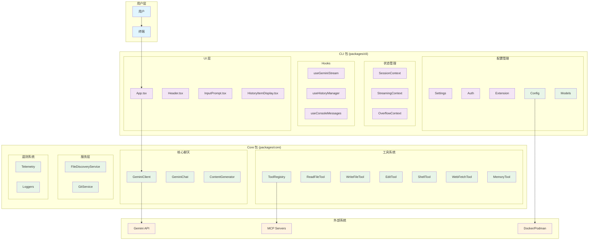
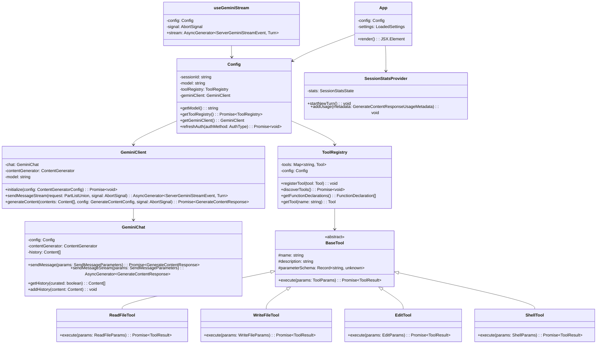
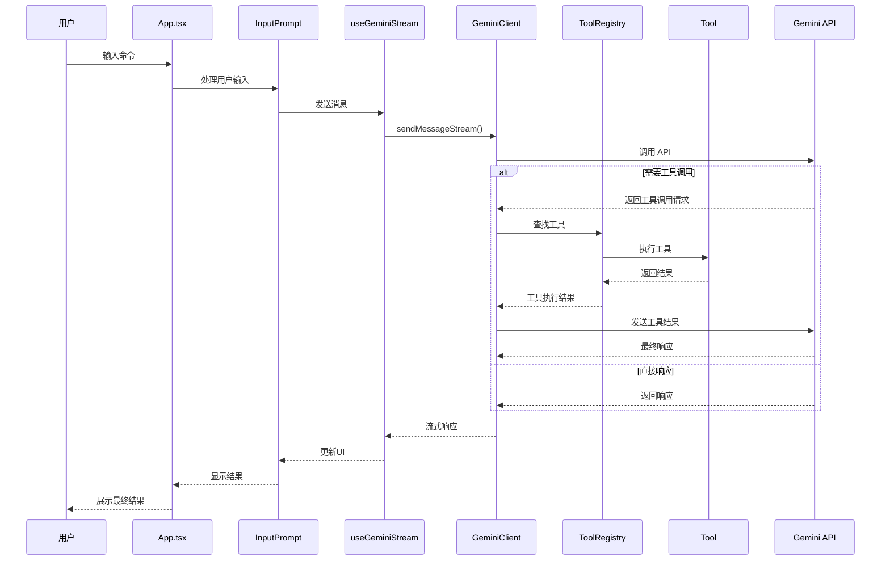
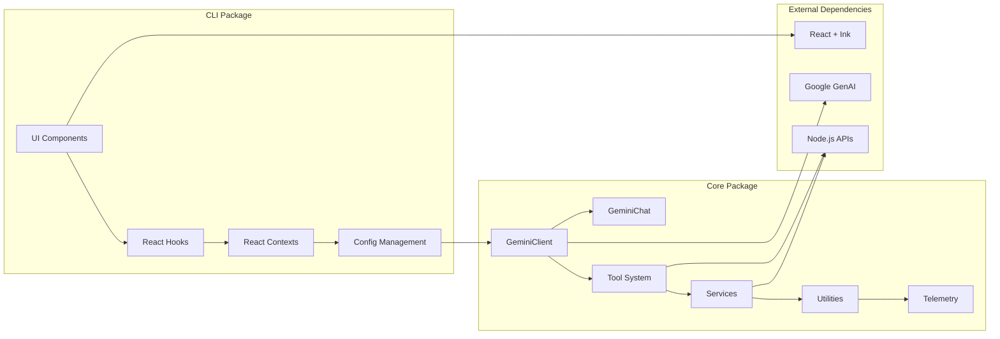
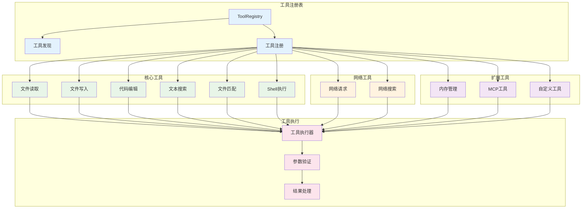
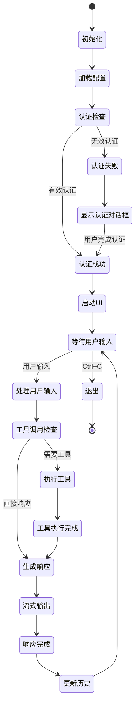
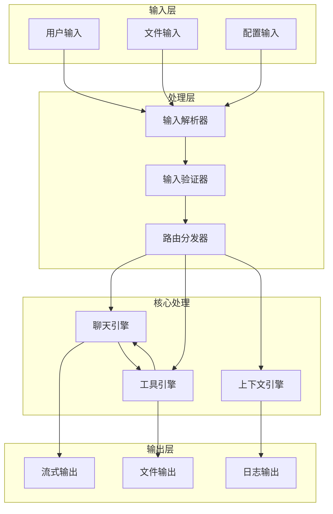

## 项目简介

Gemini CLI 是一个开源的 AI 命令行工具，旨在加速开发者的工作流程并增强代码和工具的交互能力。
对标openai CodeX和Claude Code.
主要功能包括：

1. 查询和编辑大型代码库，超出 1M token 上下文窗口。
2. 利用多模态功能生成应用（通过 PDF 或草图）。
3. 自动化操作任务，如 pull request 查询或复杂 rebase 处理。
4. 借助 MCP 服务器连接更多能力，如媒体生成（Imagen、Veo 或 Lyria）。
5. 集成谷歌搜索工具以支持查询。

快速开始：

- 要求安装 Node.js 18 或更高版本。
- 可通过 npx 或 npm 安装运行。
- 使用 Google 账户认证获取免费配额（每分钟 60 次请求，每天 1,000 次请求）。
- 可通过 Google AI Studio 生成 API 密钥以获取更多配额。

应用场景示例包括：探索新代码库、处理现有项目、自动化工作流程及系统交互等。支持 TypeScript 和 JavaScript。

仓库未发布正式版本，使用 Apache-2.0 许可证。

这里使用cursor创建多种 UML 图表来展示 Gemini CLI 系统的架构。先深入分析一些关键组件，然后生成清晰的架构图。

主要代码：

- packages/core/src/core/geminiChat.ts
- packages/cli/src/ui/contexts/SessionContext.tsx

现在我来为你创建多种 UML 图表来展示 Gemini CLI 系统的架构：

## 各种系统架构图

### 1. 系统整体架构图 (Mermaid)



### 2. 类图 (Mermaid)



### 3. 组件交互时序图 (Mermaid)



### 4. 包依赖关系图 (Mermaid)



### 5. 工具系统架构图 (Mermaid)



### 6. 状态管理流程图 (Mermaid)



### 7. 数据流图 (Mermaid)



这些图表从不同角度展示了 Gemini CLI 系统的架构：

1. **系统整体架构图** - 展示各层之间的关系
2. **类图** - 显示核心类的结构和关系
3. **时序图** - 展示组件间的交互流程
4. **包依赖关系图** - 显示模块间的依赖
5. **工具系统架构图** - 详细展示工具系统的设计
6. **状态管理流程图** - 展示应用的状态转换
7. **数据流图** - 展示数据在系统中的流动

这些图表帮助从多个维度理解系统的架构设计，包括静态结构、动态交互、数据流向等各个方面。

## 整体架构概览

基于对代码的分析，详细解析 Gemini CLI 项目的代码架构：
Read file: packages/core/src/index.ts
Read file: packages/cli/src/gemini.tsx
Read file: packages/core/src/core/client.ts
Read file: packages/cli/src/ui/App.tsx
Read file: packages/core/src/tools/tool-registry.ts
Read file: package.json
Read file: packages/core/src/config/config.ts

Gemini CLI 是一个基于 Node.js 的命令行工具，采用**模块化设计**和**分层架构**，主要分为两个核心包：

### 1. 包结构设计

```
gemini-cli/
├── packages/
│   ├── core/          # 核心业务逻辑
│   └── cli/           # 命令行界面和用户交互
├── scripts/           # 构建和部署脚本
├── docs/             # 文档
└── integration-tests/ # 集成测试
```

## 2. 核心包 (packages/core)

### 主要模块

#### **核心聊天模块** (`core/`)

- `client.ts` - Gemini API 客户端，处理与 Gemini 模型的通信

- `geminiChat.ts` - 聊天会话管理
- `contentGenerator.ts` - 内容生成器，处理不同类型的认证
- `turn.ts` - 对话轮次管理
- `prompts.ts` - 系统提示词管理

#### **工具系统** (`tools/`)

- `tool-registry.ts` - 工具注册表，管理所有可用工具

- `tools.ts` - 基础工具接口定义
- 具体工具实现：
  - `read-file.ts` / `read-many-files.ts` - 文件读取
  - `write-file.ts` - 文件写入
  - `edit.ts` - 代码编辑
  - `grep.ts` - 文本搜索
  - `shell.ts` - Shell 命令执行
  - `web-fetch.ts` / `web-search.ts` - 网络请求和搜索
  - `memoryTool.ts` - 内存管理
  - `mcp-client.ts` / `mcp-tool.ts` - MCP 协议支持

#### **配置管理** (`config/`)

- `config.ts` - 主配置类，管理所有设置

- `models.ts` - 模型配置
- `flashFallback.ts` - 模型回退机制

#### **服务层** (`services/`)

- `fileDiscoveryService.ts` - 文件发现服务

- `gitService.ts` - Git 集成服务

#### **工具类** (`utils/`)

- `paths.ts` - 路径处理

- `errors.ts` - 错误处理
- `gitUtils.ts` - Git 工具
- `fileUtils.ts` - 文件操作工具

#### **遥测系统** (`telemetry/`)

- 支持多种遥测目标（GCP、本地等）

- 用户行为统计和错误报告

## 3. CLI 包 (packages/cli)

### 主要模块

#### **用户界面** (`ui/`)

- `App.tsx` - 主应用组件

- `components/` - React 组件库
  - `Header.tsx` - 头部组件
  - `InputPrompt.tsx` - 输入提示
  - `HistoryItemDisplay.tsx` - 历史记录显示
  - `DetailedMessagesDisplay.tsx` - 详细消息显示
- `hooks/` - 自定义 React Hooks
- `contexts/` - React Context 状态管理
- `themes/` - 主题系统

#### **配置管理** (`config/`)

- `settings.ts` - 设置管理

- `auth.ts` - 认证配置
- `extension.ts` - 扩展系统

#### **工具类** (`utils/`)

- `sandbox.ts` - 沙箱环境管理

- `startupWarnings.ts` - 启动警告

## 4. 架构特点

### **分层设计**

1. **表示层** - CLI 包负责用户界面和交互
2. **业务逻辑层** - Core 包处理核心业务逻辑
3. **数据访问层** - 工具系统提供各种数据访问能力

### **模块化设计**

- 工具系统采用插件化架构，可以动态注册和发现工具

- 配置系统支持分层配置（用户、项目、全局）
- 主题系统支持多种主题切换

### **扩展性**

- **MCP 协议支持** - 可以集成外部工具服务器

- **扩展系统** - 支持自定义扩展
- **工具发现** - 支持动态发现项目中的工具

### **安全性**

- **沙箱环境** - 支持 Docker/Podman 沙箱隔离

- **权限控制** - 工具执行需要用户确认
- **代理支持** - 支持网络代理配置

### **可观测性**

- **遥测系统** - 完整的用户行为跟踪

- **日志系统** - 详细的调试和错误日志
- **统计信息** - 会话统计和性能指标

## 5. 核心工作流程

1. **启动阶段** - 加载配置、初始化工具、启动沙箱
2. **交互阶段** - 用户输入 → 工具执行 → AI 响应 → 结果展示
3. **工具执行** - 通过工具注册表查找和执行相应工具
4. **状态管理** - 通过 React Context 管理应用状态

这个架构设计非常现代化，采用了 React + TypeScript 的技术栈，具有良好的可维护性和扩展性。

## 使用Gemini CLI创建一个项目

使用~/.gemini/settings.json来管理该项目的Gemini CLI的配置，包括mcp server的配置，以及用户设置等。
使用GEMINI.md来管理该项目的Gemini CLI的memory，
在gemini cli的界面中使用命令“/mcp”来查看mcp server的列表.

### 例子

例子一：
> 使用context7搜索Autogen最新版本新增的新特性。

例子二：
> 使用context7搜索Autogen最新版本新增的新特性，并为我开发一个能够根据需求编写代码的agent，编写的代码由第二个agent给出优化建议，再由第三个agent根据第一个agent写的代码和第二个agent的建议，写成最终的代码。最后提供相关的文档。

>
### 问题

gemini CLI运行过程中的memory是如何管理的，我能把memory保存到本地吗？比如把对最新AutoGen的文档（从context7获取的）保存到某个地方之类的。

## 快速掌握Gemini CLI核心用法

参考： <https://www.aivi.fyi/aiagents/introduce-Gemini-CLI>

步骤一：快速安装

```bash
# 直接运行（推荐）
npx https://github.com/google-gemini/gemini-cli

# 或全局安装
npm install -g @google/gemini-cli
```

步骤二：配置

- 配置settings.json (包括MCP server的配置)
- 配置Memory: GEMINI.md （架构，开发环境，编程规范（代码风格，导入约定，基本模式（样板代码）），项目结构， 开发要点（最佳实践，）， 文档和资源获取（使用context7获取文档，使用context7搜索相关知识） ）

步骤三：使用

### 配置

- 项目级别配置： .gemini/settings.json within your project's root directory.
- 用户全局配置： ~/.gemini/settings.json

**settings.json配置项**
**注意**：settings.json里面可以使用环境变量，比如 "apiKey": "$MY_API_TOKEN".

- contextFileName： 指定上下文文件的文件名（例如，GEMINI.md（缺省）），可以是单个文件名或被接受的文件名列表。
- fileFiltering: 控制 @命令和文件发现工具的 Git 感知文件过滤行为。

```json
"fileFiltering": {
  "respectGitIgnore": true,                # 在发现文件时是否遵循.gitignore 模式。当设置为 true 时，被 git 忽略的文件（如 node_modules/、dist/
  "enableRecursiveFileSearch": false   #在提示符中完成 @前缀时，是否启用在当前目录树中递归搜索文件名。
}
```

- **coreTools**: 可以指定一组核心工具名称，使模型可用，并可用于限制[内置工具](https://github.com/hobbytp/gemini-cli/blob/main/docs/core/tools-api.md#built-in-tools)的集合。还可以为支持的工具指定命令特定的限制，例如，"coreTools": ["ShellTool(ls -l)"]仅允许执行ls -l命令。

- **excludeTools**:允许你指定一组应从模型中排除的核心工具名称。出现在excludeTools和coreTools中的工具会被排除。你还可以为支持的工具指定特定命令的限制，例如ShellTool。例如，"excludeTools": ["ShellTool(rm -rf)"]将阻止rm -rf命令。

- **autoAccept (false)**: 控制 CLI 是否自动接受并执行被认为是安全的（例如只读操作）工具调用，而无需用户明确确认。如果设置为 true，CLI 将绕过对被认为安全的工具的确认提示。

- **sandbox(false)**: 用于控制工具执行时的沙盒使用方式。如果设置为真，Gemini CLI将使用预构建的gemini-cli-sandbox Docker镜像。

- **toolDiscoveryCommand**: 定义一个自定义的shell命令，用于发现项目中的工具。该命令必须在标准输出上返回一个包含函数声明的JSON数组。工具包装器是可选的。Example: "toolDiscoveryCommand": "bin/get_tools"

- **toolCallCommand**: (Example: "toolCallCommand": "bin/call_
定义了一个自定义的 shell 命令，用于调用通过 toolDiscoveryCommand 发现的特定工具。这个 shell 命令必须符合以下标准：
程序需接收函数名称作为第一个命令行参数，从标准输入读取函数参数的JSON格式，并以JSON格式将函数输出返回到标准输出。

- **mcpServers (object)**:
 <SERVER_NAME> (object): The server parameters for the named server.

  - command (string, required): The command to execute to start the MCP server.
  - args (array of strings, optional): Arguments to pass to the command.
  - env (object, optional): Environment variables to set for the server process.
  - cwd (string, optional): The working directory in which to start the server.
  - timeout (number, optional): Timeout in milliseconds for requests to this MCP server.
  - trust (boolean, optional): Trust this server and bypass all tool call confirmations.

```json
"mcpServers": {
  "myPythonServer": {
    "command": "python",
    "args": ["mcp_server.py", "--port", "8080"],
    "cwd": "./mcp_tools/python",
    "timeout": 5000
  },
  "myNodeServer": {
    "command": "node",
    "args": ["mcp_server.js"],
    "cwd": "./mcp_tools/node"
  },
  "myDockerServer": {
    "command": "docker",
    "args": ["run", "i", "--rm", "-e", "API_KEY", "ghcr.io/foo/bar"],
    "env": {
      "API_KEY": "$MY_API_TOKEN"
    }
  },
}
```

- **checkpointing {"enabled": false}**: 配置检查点功能，可保存和恢复对话及文件状态，详细信息请参见检查点文档。 当true时，/restore命令可用。参考[checkpoint doc](https://github.com/hobbytp/gemini-cli/blob/main/docs/checkpointing.md)

- **preferredEditor ("vscode")**: Example: "preferredEditor": "vscode"

- **telemetry**:

```json
"telemetry": {
  "enabled": true,
  "target": "local", # or "gcp"
  "otlpEndpoint": "http://localhost:16686",  #OTLP 导出器的端点。
  "logPrompts": false  #是否在日志中包含用户提示的内容。
}
```

**settings.json例子**

```json
{
  "theme": "GitHub",
  "sandbox": "docker",
  "toolDiscoveryCommand": "bin/get_tools",
  "toolCallCommand": "bin/call_tool",
  "mcpServers": {
    "mainServer": {
      "command": "bin/mcp_server.py"
    },
    "anotherServer": {
      "command": "node",
      "args": ["mcp_server.js", "--verbose"]
    },
    "chrome-devtools": {
      "command": "npx",
      "args": ["chrome-devtools-mcp@latest"]
    }
  },
  "telemetry": {
    "enabled": true,
    "target": "local",
    "otlpEndpoint": "http://localhost:4317",
    "logPrompts": true
  },
  "usageStatisticsEnabled": true,
  "hideTips": false
}

```

### 设置环境变量

 you can add the environment variable to your .env file (located in the project directory or user home directory) or your shell's configuration file (like ~/.bashrc, ~/.zshrc, or ~/.profile)

### 配置沙箱

### 常用命令

**chat命令**

- /chat ==> 进入聊天模式
- /chat save <tag>   ==>后面可以使用/chat resume <tag>来从之前的保存点恢复对话。
- /chat list  ==> 罗列之前的session，以便恢复某个对话

**compress命令**

- /compress： 用摘要替换整个聊天上下文。这既能节省未来任务使用的令牌，又能保留所发生事情的高级摘要。

**memory命令**

- /memory: 从GEMINI.md文件加载的分层记忆
- /memory add <text to remember>
- /memory show ==> 显示当前从所有GEMINI.md文件加载的层次记忆的完整内容，以便检查提供给Gemini模型的指令上下文
- /memory refresh ==> 重新加载所有配置位置（全局、项目/祖先和子目录）中找到的GEMINI.md文件的层次教学记忆，该命令将模型更新为最新的GEMINI.md内容。

**editor命令**

- /editor： 比如可以使用cursor或VS code来当缺省的编辑器

**mcp命令**

- /mcp  ==>罗列配置的mcp server。
- /mcp desc <mcp>
- /mcp nodesc 只罗列tool names: 注意： 随时按下Ctrl+T组合键，在显示和隐藏工具说明之间进行切换。
- /mcp schema: 显示该工具已配置参数的完整 JSON 模式。

**添加MCP Server**

- `gemini mcp add <name> <command>` - 添加MCP server
- `gemini mcp remove <name>` - 移除MCP server  
- `gemini mcp list` - 列出所有配置的MCP servers

**Chrome DevTools MCP示例**

```bash
# 添加chrome-devtools MCP server
gemini mcp add chrome-devtools npx chrome-devtools-mcp@latest

# 查看配置的MCP servers
gemini mcp list
```

Chrome DevTools MCP提供以下功能：

- 浏览器自动化控制
- 网页截图和性能分析
- 元素交互和调试
- 网络请求监控

## 其他用法

**stats命令: 看token使用量**

- /stats ==> 看token使用数量，token caching only available when using API key authentication (Gemini API key or Vertex AI).

**checkpoint命令**
当配置里面有下面的配置时
  "checkpointing": {
    "enabled": true
  },
“/restore ”可以罗列checkpoint 文件，“/restore <checkpoint_file>”可以回滚到某个checkpoint 文件。比如：/restore 2025-06-22T10-00-00_000Z-my-file.txt-write_file
