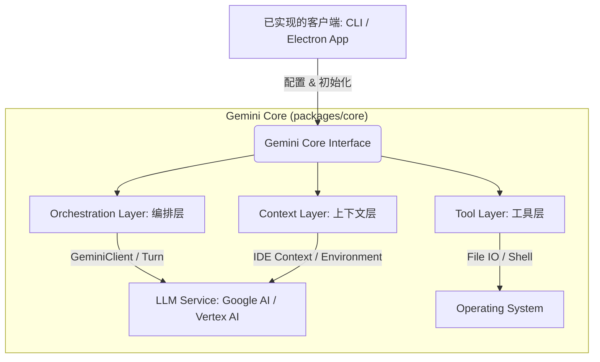
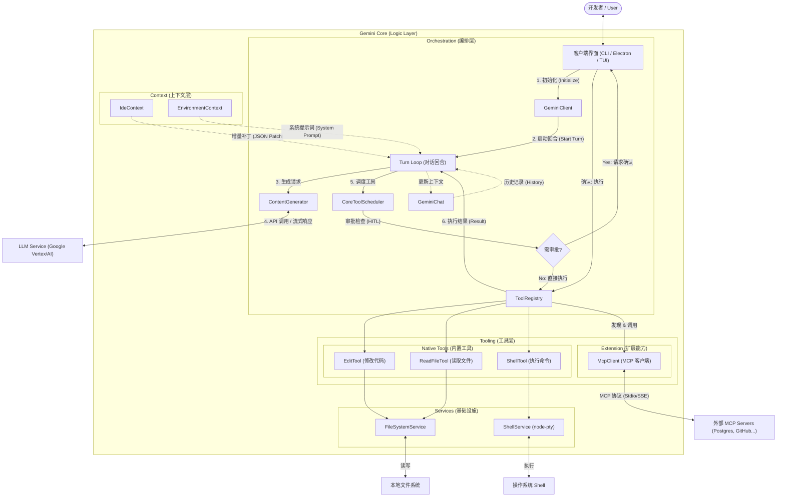

本篇文章深入剖析了 Gemini CLI (`gemini-cli-core`) 的内部架构、核心机制及设计原则。

## 第一章：总体架构与核心组件 (High-Level Architecture)

Gemini CLI 的设计遵循 **"Core Separation" (核心分离)** 原则，将智能代理的核心逻辑 (`packages/core`) 与具体的交互界面（如 CLI, TUI, 或未来的 GUI/IDE 插件）完全解耦。这种架构使得核心能力的复用和移植成为可能。

### 1.1 顶层架构图

逻辑上，系统可以划分为以下四层：



### 1.2 核心模块详解

`packages/core` 是整个系统的“大脑”，其源码目录结构清晰地反映了功能划分：

*   **`src/core/` (核心编排)**:
    *   **`GeminiClient`**: 系统的总入口。负责生命周期管理、配置加载、以及与 IDE/环境的顶层集成。它不直接处理每轮对话的细节，而是将其委托给 `Turn`。
    *   **`GeminiChat`**: 负责维护对话历史 (Chat History) 和会话状态。它管理着发往 LLM 的消息队列，并处理历史记录的压缩 (Compression)。
    *   **`ContentGenerator`**: 定义了与 LLM 交互的抽象接口。`CodeAssistServer` 是其具体实现，负责处理认证 (OAuth) 和 API 调用。

*   **`src/ide/` (上下文感知)**:
    *   **`IdeContext`**: 维护代码编辑器的状态快照（打开的文件、光标位置、选区）。核心创新在于实现了 **Delta Updates (增量更新)** 机制，仅向 LLM 发送状态变更的 Diff，从而大幅节省 Context Window。

*   **`src/tools/` (能力/工具)**:
    *   **`ToolRegistry`**: 工具注册中心。所有的能力（读写文件、执行命令）都封装为 `BaseDeclarativeTool` 的子类并在此注册。
    *   **`McpClient`**: 实现了 **Model Context Protocol (MCP)** 客户端，允许 Gemini CLI 动态加载和调用外部 MCP Server 提供的工具，极大地扩展了能力边界。

*   **`src/services/` (基础设施抽象)**:
    *   为了保证 Core 的纯净性，所有涉及副作用 (Side Effects) 的操作都通过 Service 接口定义：
        *   `FileSystemService`: 文件读写抽象。
        *   `ShellExecutionService`: 包含 `node-pty` 的终端执行服务，支持交互式命令和流式输出。

### 1.3 技术栈决策

*   **Language**: TypeScript。利用静态类型系统确保大规模重构的安全性，特别是在处理复杂的 LLM 响应结构和工具参数定义时。
*   **Runtime**: Node.js。依赖其强大的文件系统访问能力和子进程管理 (`child_process`, `node-pty`) 能力，这是实现 "AI Coder" 必不可少的基础。
*   **Protocol**: 内部通信主要依赖简单的异步事件流 (Async Generators)，外部扩展依赖 MCP 协议。

---

## 第二章：Agent 核心编排 (Agent Orchestration)

Gemini CLI 的核心是一套事件驱动的 "Turn-based"（回合制）编排系统。本章将详细介绍从用户输入到 AI 完成任务的完整生命周期。

### 2.1 核心循环 (The Loop)

核心循环由 `GeminiClient` 启动，并由 `Turn` 类具体执行。

1.  **启动流 (Stream Initiation)**:
    用户在界面输入请求后，调用 `client.sendMessageStream(message)`。这会创建一个新的 `Turn` 实例。

2.  **Turn 执行 (`Turn.run`)**:
    `Turn` 负责管理单次对话往返。它将用户消息与当前的 Context (Chat History + Environment + IDE Context) 组装，通过 `ContentGenerator` 发送给 LLM。

3.  **流式响应处理**:
    LLM 的响应是流式的。`Turn` 解析这些流事件 (`ServerGeminiStreamEvent`)，并分为这几类：
    *   **`content`**: 纯文本回复（思考过程或最终答案）。
    *   **`tool_call_request`**: 模型请求调用工具（如 "read_file"）。

```typescript
// 伪代码展示 Turn.run 的核心逻辑
async *run(request) {
  const stream = await chat.sendMessageStream(request);
  for await (const response of stream) {
    if (response.hasToolCall) {
       yield { type: 'tool_call_request', value: response.toolCall };
    } else {
       yield { type: 'content', value: response.text };
    }
  }
}
```

### 2.2 工具调度与安全 (Tool Scheduling)

当 `Turn` 产出 `tool_call_request` 事件时，控制权转移到 `CoreToolScheduler`。这是系统的“安全阀”。

*   **调度策略**: `CoreToolScheduler` 接收工具调用请求，并设定状态为 `validating` -> `scheduled`。
*   **人机交互 (HITL)**:
    *   **YOLO Mode**: 如果配置为自动执行，调度器直接执行工具。
    *   **Approval Mode**: 默认情况下，调度器会将状态设为 `awaiting_approval`，等待用户确认 (`Main Process` 或 UI 层调用 `scheduler.confirm(...)`)。
*   **执行与反馈**:
    工具执行后，结果（`ToolResult`）会被封装，并作为新的 System Message 再次喂给 LLM。这触发了 Agent 的**自我修正 (Self-Correction)** 循环：
    > LLM 请求读文件 -> 执行 -> LLM 看到文件内容 -> LLM 发现缺漏 -> LLM 请求读更多文件 -> ...

### 2.3 异常处理与递归

Agent 的健壮性体现在如何处理错误：
*   **Loop Detection**: `GeminiClient` 包含死循环检测机制。如果模型在短时间内重复发起相同的工具调用，或者达到最大 Turn 数限制（默认 30），系统会强制中断，防止 Token 耗尽。
*   **Error Propagation**: 工具执行失败（如文件不存在）不会导致 Crash。错误信息会作为 Tool Result 返回给模型，模型通常会根据错误信息尝试修正（例如尝试另一个文件名）。

这种设计确保了 Gemini CLI 不仅仅是一个 简单的 Chatbot，而是一个能够通过不断试错来达成目标的 Autonomous Agent。

---

## 第三章：上下文工程实现 (Context Engineering Implementation)

在 LLM 交互中，Context 就是一切。Gemini CLI 采用分层与增量更新策略，以平衡信息完整性与 Token 成本。

### 3.1 静态环境感知 (Environment Context)

在会话初始化阶段 (`GeminiClient.initialize`)，系统会构建一个静态的环境快照作为 System Prompt 的一部分。

*   **数据源**: `src/utils/environmentContext.ts`
*   **内容**:
    *   **OS 平台**: (如 `linux`, `win32`) 决定了 Shell 命令的语法风格。
    *   **时间戳**: 提供准确的当前时间。
    *   **目录树**: 生成当前 Workspace 的层级结构概览（尊重 `.gitignore`），让模型拥有“上帝视角”的地图，而无需扫描所有文件。

### 3.2 动态 IDE 上下文与增量更新 (IDE Delta)

这是系统的核心优化点。传统的 Copilot 往往在每次请求时携带所有打开文件的全文，这极其浪费。Gemini CLI 实现了一种 **Delta Protocol**。

*   **快照对比**: `GeminiClient` 维护着上一次发送给 LLM 的 IDE 状态快照 (`lastSentIdeContext`).
*   **JSON Patch**: 每次新 Turn 不会发送全量文件，而是计算差异并发送 JSON Patch：
    ```json
    {
      "filesOpened": ["src/new_file.ts"],
      "activeFileChanged": {"path": "src/utils.ts", "cursor": { "line": 50, "character": 10 }}
    }
    ```
*   **即时感知**: 这使得模型能实时“看到”用户的光标移动和选区变化，从而实现“针对选中代码修改”或“在光标处插入”等精确操作。

### 3.3 历史记录压缩 (Chat History Compression)

面对长对话，Gemini CLI 并没有简单地截断旧消息，而是实现了一个基于 heuristics 的压缩器 (`tryCompressChat`).

*   **触发条件**: 当 Token 使用量超过模型限制的 70% 时。
*   **压缩策略**:
    *   **保护区 (Preserve)**: 最近的 30% 对话被视为“热数据”，绝对完整保留，确保当前上下文连贯。
    *   **回收区 (GC)**: 较早的 70% 历史会被压缩或丢弃。
    *   **Heuristics**: 目前使用字符数估算 Token，以避免每次都调用昂贵的 Tokenizer API。

### 3.4 全局文件感知 (Full File Context)

虽然默认只发送目录树，但配置 (`config.fullContext`) 允许在启动时强制读取所有文件内容。这是通过调用 `read_many_files` 工具实现的，适用于代码库极小且需要模型深度理解整个项目的场景，但在大项目中默认关闭以防 Token 爆炸。

---

## 第四章：代码理解与修改流程 (Code Understanding & Modification Flow)

本章解释了 AI 如何通过工具组合来实现“找到代码、阅读代码、修改代码”的完整闭环。

### 4.1 代码发现 (Code Discovery)

Gemini CLI **目前不使用 Embedding (向量索引)** 进行语义搜索。它采取了一种更像人类开发者的“探索式”策略。

*   **目录感知**: 通过 Environment Context 提供的目录树，模型首先推断出相关文件可能存在的路径。
*   **模糊搜索 (Fuzzy Search)**: 系统提供了基于文件名的搜索能力。
    *   **实现**: `packages/core/src/utils/filesearch/fileSearch.ts`
    *   **算法**: 使用 `fzf` 进行模糊匹配，使用 `picomatch` 进行 Glob 匹配。
    *   **流程**: 模型推测文件名（例如 "auth"） -> 调用工具搜索 -> 获得文件列表。

### 4.2 代码阅读 (Code Reading)

一旦定位到文件，模型需要阅读内容。

*   **`read_many_files` 工具**:
    *   这是一个专用的“批量阅读”工具。模型可以传入多个 Glob 模式（如 `src/auth/*.ts`），工具会串行读取匹配的所有文件内容，并在输出中用 `--- filename ---` 分隔符拼接。
    *   **大文件保护**: 相比简单的 `read_file`，它能够处理过滤（GitIgnore/GeminiIgnore），避免读取二进制或无意义的生成文件。

### 4.3 代码修改 (Code Modification)

修改代码是最关键的一步。Gemini CLI 提供了 `EditTool` (`src/tools/edit.ts`) 来执行精确的字符串替换。

*   **Search & Replace 机制**:
    *   **参数**: `file_path`, `old_string`, `new_string`。
    *   **严格匹配**: 为了防止误改，`old_string` 必须与文件中的内容**完全一致**（包括空格、缩进）。模型必须先读取文件获得准确内容，才能发起修改。
    *   **安全性**: 如果 `old_string` 匹配失败（找不到或找到多处），工具会报错并拒绝执行，模型必须修正参数后重试。

*   **Diff 生成**:
    *   每次修改后，系统会在内存中计算 Diff (`Diff.createPatch`)。这不仅用于生成工具的返回值，还可以用于在 IDE 中向用户展示 "Approve/Reject" 的可交互 Diff 视图 (Approval Mode)。

### 4.4 典型工作流示例

一个标准的修复 Bug 流程如下：
1.  **用户**: "List 列表加载不出来。"
2.  **AI**: (思考: 需要找 List 组件) -> Tool: `find_files("list")`
3.  **系统**: 返回 `src/components/UserList.tsx`
4.  **AI**: Tool: `read_many_files("src/components/UserList.tsx")`
5.  **系统**: 返回文件内容。
6.  **AI**: (思考: 发现 useEffect 依赖漏了) -> Tool: `replace(file="...", old="[]", new="[userId]")`
7.  **系统**: 执行修改，返回 Success。

---

## 第五章：扩展性与工具注册 (Extensibility & Tool Registry)

Gemini CLI 的强大之处在于其近乎无限的扩展能力。这主要得益于统一的工具抽象接口和 Model Context Protocol (MCP) 的深度集成。

### 5.1 统一工具抽象

在 `packages/core` 中，所有的功能都被视为“工具”。

*   **`BaseDeclarativeTool`**: 所有工具的基类。它定义了工具的 Schema（JSON Schema 格式，用于 Function Calling）和执行逻辑。
    *   内置工具（如 文件操作、终端）都是这个类的子类。
*   **`ToolRegistry`**: 单例模式的注册中心。它维护了一个 `Map<string, Tool>`，并在每次 Turn 开始时，将所有已注册工具的 Function Definitions 发送给 LLM。

### 5.2 Model Context Protocol (MCP) 集成

Gemini CLI 不仅仅是一个 CLI 工具，它还是一个 **MCP Client**。这意味着它可以连接到任何标准化的 MCP Server，瞬间获得新的能力。

*   **MCP 客戶端 (`McpClient`)**:
    *   **位置**: `src/tools/mcp-client.ts`
    *   **功能**: 负责管理与 MCP Server 的连接（Stdio 或 SSE/HTTP）、处理并握手 Capabilities、以及自动发现 Server 提供的 Tools 和 Prompts。
    *   **OAuth 支持**: 实现了自动化的 OAuth 流程，支持需要认证的高级 MCP Server（如 Google Drive, Slack）。

### 5.3 动态能力发现

Gemini CLI 的工具库不是静态编译的，而是动态生成的。

1.  **配置驱动**: 用户在配置文件中定义 MCP Servers（例如 `postgres-mcp`, `github-mcp`）。
2.  **启动发现**: 系统启动时，`McpClient` 连接这些 Servers，查询 `tools/list`。
3.  **代理注册**: 发现的每个远程工具都会被封装为 `DiscoveredMCPTool`（它是 `BaseDeclarativeTool` 的子类），并注册到 `ToolRegistry`。
4.  **无感调用**: 当 LLM 决定调用这些远程工具时，`CoreToolScheduler` 会像调用本地代码一样调用它们，底层自动通过 MCP 协议转发请求到对应的 Server。

这种架构意味着：如果你想让 Gemini CLI 具备操作 Kubernetes 的能力，你不需要修改核心代码，只需要运行一个 Kubernetes MCP Server 并配置即可。

---

## 第六章：总结与未来展望 (Summary & Future Outlook)

Gemini CLI 成功构建了一个**核心分离、能力可插拔、上下文感知**的 AI 编程助手架构。通过对最新行业趋势的研究，我们可以看到该架构在未来的巨大潜力。

### 6.1 架构总结

Gemini CLI 的核心优势在于平衡了 **AI 的自主性 (Autonomy)** 与 **人类的控制权 (Control)**：

*   **自主性**: 自运行的 Agent Loop、死循环检测、错误自动修正、多步骤工具调用。
*   **控制权**: 极其严格的文件修改检查 (Strict Search & Replace)、Human-in-the-Loop 的审批模式。
*   **扩展性**: 拥抱 MCP 标准，使其能够无限扩展能力边界，而非局限于本地文件系统。

### 6.2 行业趋势与展望 (2025+)

根据最新的行业调研，AI Coding Agent 正在经历第三次范式转移：从 **Copilot (补全)** 到 **Agent (代理)**，再到未来的 **Agentic Workflows (智能工作流)**。

1.  **Agent Skills (智能技能)**:
    用户提到的 "Agent Skills" 代表了下一代的能力封装。不同于简单的 Prompt 模板，Skill 是包含 **专用提示词、自定义工具集、工作流脚本 (Workflows) 甚至领域知识库** 的完整包。未来 Gemini CLI 将支持 `gemini skill add django-expert` 这样的指令，即时变身为特定领域的专家，无需核心代码更新。

2.  **Context Engineering (上下文工程) 的进化**:
    目前 Gemini CLI 已经实现了 IDE 增量更新。未来，随着项目规模扩大，**Context Management** 将变得比 Prompt Engineering 更重要。我们可能会引入 **Episodic Memory (情景记忆)**，让 Agent 记住用户过去的偏好和项目特定的约定，而不仅仅是依赖当前的上下文窗口。

3.  **MCP 生态的爆发**:
    MCP (Model Context Protocol) 正在成为事实标准。未来，Gemini CLI 不仅连接本地开发工具，还将连接云端资源（如 GitHub Issues, Jenkins, Jira）。Agent 将不仅仅是写代码，而是成为连接 Dev 和 Ops 的桥梁，实现 **Autonomous DevOps**。

4.  **从 Chat 到 Task**:
    用户交互模式将从“聊天”转向“任务委派”。Gemini CLI 的 Loop 架构已经为此做好了准备。未来可能会出现 **Multi-Agent Systems (多智能体系统)**，其中一个 Agent 负责规划（Architect），另一个负责写代码（Coder），还有一个负责审查（Reviewer），它们在 Gemini CLI 的编排层下协作完成复杂需求。

5.  **更强的本地推理能力**:
    随着端侧小模型（Small Language Models）的兴起，Gemini CLI 可能会引入本地模型进行即时的、低延迟的上下文过滤和意图识别，只将最核心的复杂推理任务发送给云端大模型，实现成本与速度的最佳平衡。

Gemini CLI (`opencode`) 作为一个开源、模块化的基石，正站在这一波 AI 变革的最前沿。

---
## 附录 A: 详细系统交互架构图 (Detailed System Architecture)

下图展示了 Gemini CLI 各组件之间的详细交互流，包括回合制循环、工具调度机制以及 MCP 扩展流程。



**图解说明**:
1.  **Initialization**: 客户端初始化 `GeminiClient`，加载环境上下文 (`EnvironmentContext`)。
2.  **Turn Loop**: 所有交互都在 `Turn` 中进行。`Turn` 负责聚合 `IdeContext`（增量 Diff）和 `GeminiChat`（历史消息）。
3.  **LLM Interaction**: `ContentGenerator` 处理鉴权并向 LLM 发送请求。
4.  **Tool Execution**: 模型返回 `ToolCall` 后，经由 `CoreToolScheduler` 进行安全检查（如需要用户批准）。
5.  **Extensibility**: 通过 `McpClient`，系统可以透明地调用外部 MCP Server 提供的工具，就像调用本地函数一样。
6.  **Feedback**: 工具执行结果返回给 `Turn`，再次发送给 LLM，形成 Self-Correction 闭环。


