## TL;DR
SuperClaude 是一个为 Claude Code 设计的**元编程框架**，旨在将其从一个通用代码助手转变为一个结构化的、企业级的开发团队。

- **功能增强**: 提供 **26个专业命令** (覆盖开发、分析、部署全流程) 和 **16个AI智能体** (如系统架构师、安全工程师)，模拟真实团队协作。
- **模式化工作**: 内置 **7种工作模式** (如Token优化、深度研究) 和 **8个MCP服务器集成** (如Playwright、Serena)，以应对不同任务并扩展能力。
- **设计独到**: 核心是系统化、可扩展的开发方法。通过 **PM Agent** 实现跨会话项目管理和PDCA循环，并通过符号通信（通过Serena等MCP）等技术实现 **30-50%的Token优化**，确保开发过程的高效与质量。

### 更新

1. 2025-04-12：添加SuperClaude简介和使用
2. 2025-10-25：添加Superclaude设计架构部分
   
## 简介

SuperClaude 是一个增强 Claude Code 的配置框架，提供专业化命令、认知模式和开发方法，重点在于可维护性和扩展性。主要特点包括：

1. **认知模式**: 提供 **9** 种认知模式（如架构师、安全分析师、性能优化等），可以通过全局标志调用以适应不同领域任务。
3. **专业化命令**: 包括开发、分析、安全及运维等 **19** 个工作流命令，覆盖整个开发生命周期。
4. **MCP集成**: 与 Context7、Serena, Sequential、Magic, Playwright, 和 Puppeteer 的集成，支持多步骤思维、浏览器测试及自动化等功能。
5. **优化及性能**: 通过 UltraCompressed 模式优化 token 使用，支持上下文压缩及智能缓存。
6. **安装与配置**: 通过 install.sh 安装，支持高级选项如干运行、强制模式、日志记录及平台自动检测，全路径配置于 ~/.claude/。
7. **适用场景**: 适合需要一致化 AI 支持、证据驱动开发及领域专长的团队和项目，尤其关注体系化与质量保证。


深入分析SuperClaude的开发思路，这个框架的设计理念确实有很多值得玩味的技术亮点：

### 一、核心开发哲学解析
1. **分层递进架构**
   - 采用"短期-中期-长期"的三层规划体系，符合\[敏捷开发 \times 技术债管理\]的平衡策略
   - 每个版本聚焦一个技术主题（如2.1.0专注循环模式，2.2.0攻坚多Agent系统）

2. **模块化设计思想**
   - 通过19个slash commands实现功能解耦
   - 采用MCP集成架构（Context7/Sequential/Magic/Puppeteer）实现插件式扩展

3. **性能优化导向**
   - 创新的token经济体系配合压缩选项
   - 计划中的UltraCompression模式展现了对LLM推理成本的深度考量

### 二、关键技术路线图

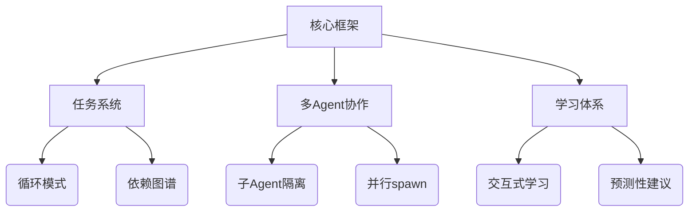

### 三、值得关注的工程实践
1. **证据驱动开发**
   - 所有特性需提供明确的使用场景论证
   - 通过`/task:analyze`等命令实现开发过程量化

2. **配置即代码**
   - 全局安装脚本支持多级profile配置
   - 用户可自定义命令模板和工作流

3. **渐进式复杂度**
   - 学习系统设计为"新手-中级-专家"三阶段
   - 通过`/index --interactive`降低学习曲线

### 四、未来扩展性分析
1. **垂直领域适配**
   - 计划中的DevOps/DataScience等专业persona
   - 可扩展的MCP服务器集成接口

2. **社区共建机制**
   - 清晰的contribution guidelines
   - 专门的enhancement/bug分类标签体系


## 🚀 SuperClaude 系统架构分析

> **生成时间**: 2025年10月25日  
> **版本**: v4.2.0  
> **分析维度**: 命令分类、智能体角色、工作模式、MCP集成

---

### 📊 系统统计概览

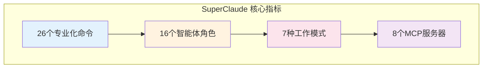

| 维度 | 数量 | 说明 |
|:---:|:---:|:---|
| **斜杠命令** | 26 | 覆盖完整开发生命周期 |
| **智能体** | 16 | 专业领域AI助手 |
| **工作模式** | 7 | 行为指令系统 |
| **MCP集成** | 8 | 扩展能力服务 |

---

### 🎯 26个专业化命令分类

#### 📘 **开发命令** (7个)

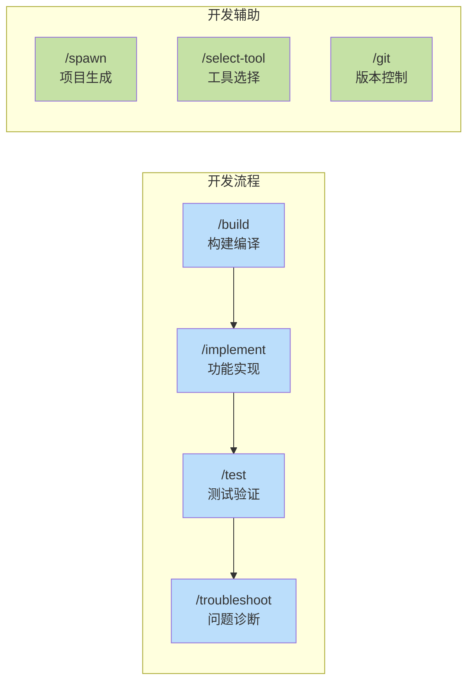

| 命令 | 用途 | 复杂度 |
|:---:|:---|:---:|
| **`/sc:build`** | 构建编译打包系统 | 增强 |
| **`/sc:implement`** | 功能实现与集成 | 标准 |
| **`/sc:test`** | 测试执行与覆盖率 | 标准 |
| **`/sc:troubleshoot`** | 故障诊断与修复 | 标准 |
| **`/sc:spawn`** | 项目脚手架生成 | 基础 |
| **`/sc:select-tool`** | 智能工具选择器 | 基础 |
| **`/sc:git`** | Git操作管理 | 基础 |

---

#### 🟡 **分析与改进命令** (6个)

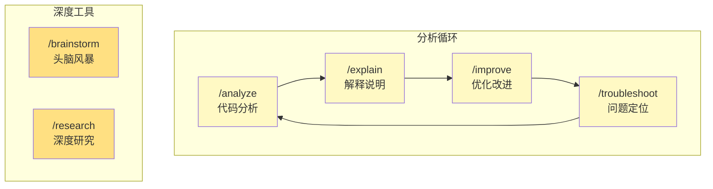

| 命令 | 用途 | MCP集成 |
|:---:|:---|:---:|
| **`/sc:analyze`** | 多维度代码分析 | - |
| **`/sc:explain`** | 代码逻辑解释 | Sequential |
| **`/sc:improve`** | 代码优化建议 | Sequential |
| **`/sc:troubleshoot`** | 根因分析诊断 | Serena |
| **`/sc:brainstorm`** | 创意解决方案 | Sequential |
| **`/sc:research`** | 深度技术研究 | WebFetch |

---

#### 🔴 **运维与部署命令** (6个)

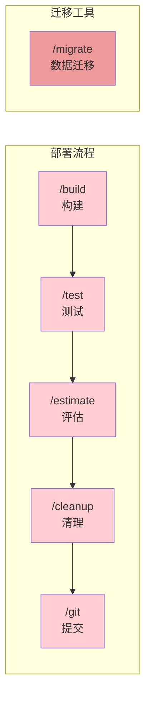

| 命令 | 用途 | 场景 |
|:---:|:---|:---|
| **`/sc:cleanup`** | 代码清理优化 | 重构前 |
| **`/sc:estimate`** | 工作量评估 | 计划阶段 |
| **`/sc:migrate`** | 系统迁移支持 | 升级迁移 |
| **`/sc:git`** | 版本控制操作 | 提交管理 |
| **`/sc:build`** | 部署构建 | CI/CD |
| **`/sc:test`** | 部署前验证 | 质量保证 |

---

#### 🟣 **设计与文档命令** (5个)

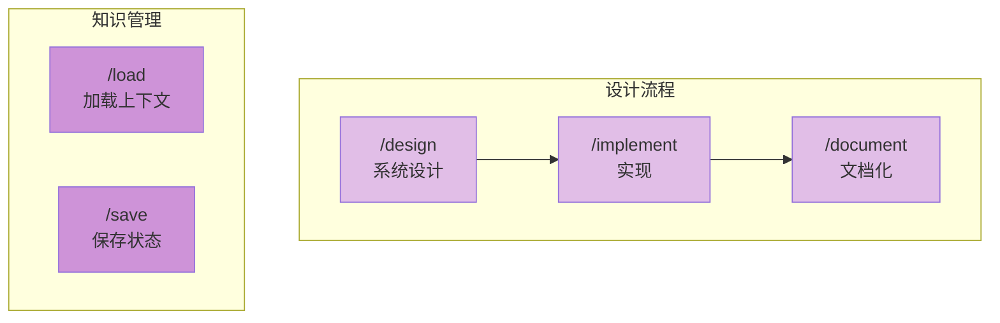

| 命令 | 用途 | 输出格式 |
|:---:|:---|:---|
| **`/sc:design`** | 架构API设计 | 图表/规范 |
| **`/sc:document`** | 文档自动生成 | Markdown |
| **`/sc:load`** | 上下文恢复 | JSON |
| **`/sc:save`** | 状态持久化 | JSON |
| **`/sc:reflect`** | 反思总结 | 报告 |

---

#### 🟢 **项目管理命令** (2个)

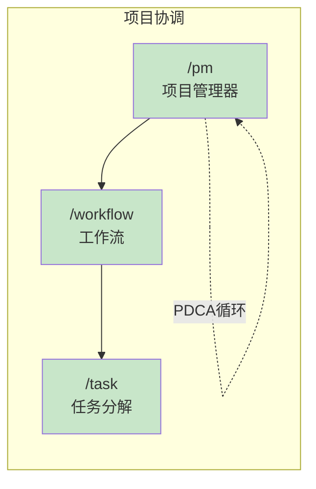

| 命令 | 用途 | 特性 |
|:---:|:---|:---|
| **`/sc:pm`** | PM Agent管理器 | 自动激活、PDCA |
| **`/sc:workflow`** | 工作流编排 | 多步骤协调 |
| **`/sc:task`** | 任务分解追踪 | TodoWrite集成 |

---

### 👥 16个智能体角色

#### 架构设计专家 (3个)

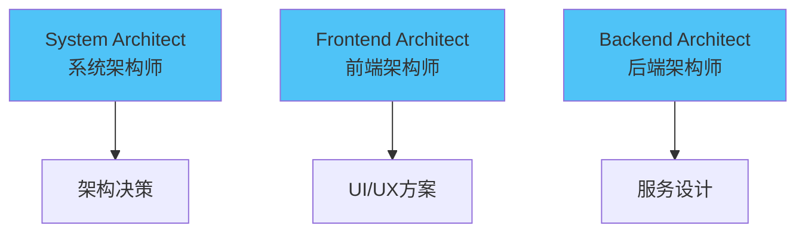

- **System Architect**: 整体系统架构、技术选型、扩展性设计
- **Frontend Architect**: 前端架构、组件设计、状态管理
- **Backend Architect**: 后端服务、API设计、数据架构

#### 质量保障专家 (3个)

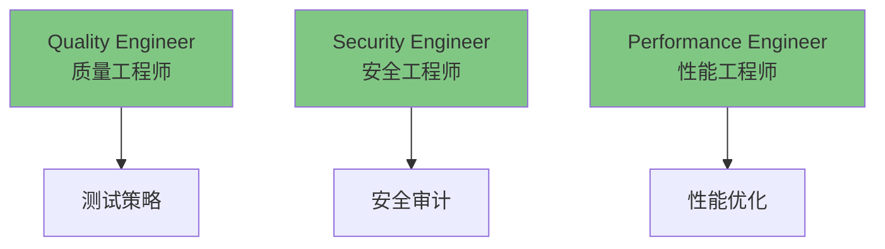

- **Quality Engineer**: 测试策略、质量保证、代码审查
- **Security Engineer**: 安全审计、漏洞扫描、合规检查
- **Performance Engineer**: 性能分析、优化建议、监控方案

#### 专项领域专家 (4个)

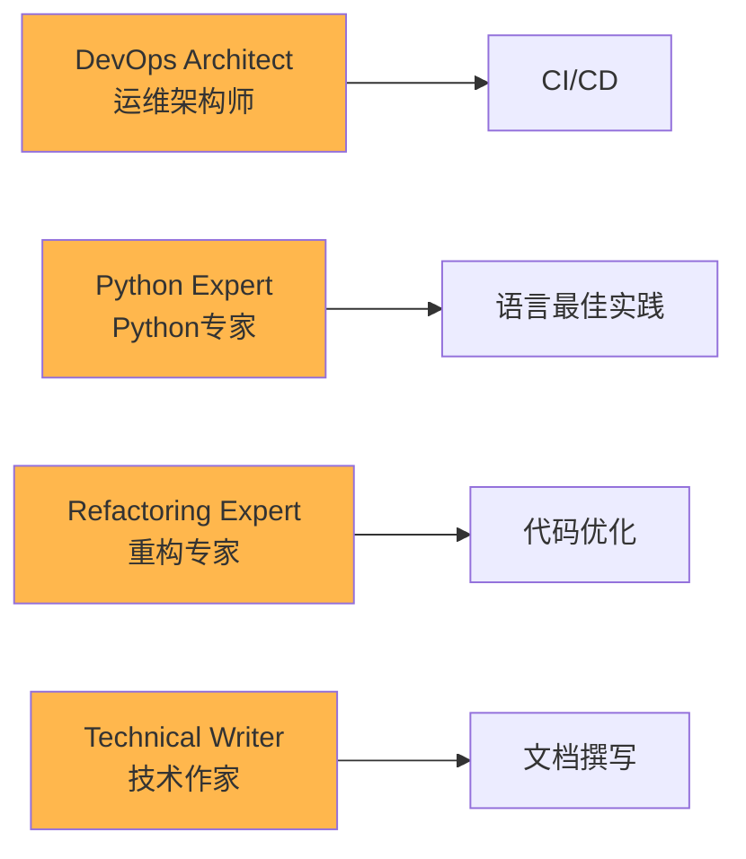

#### 分析与管理专家 (4个)

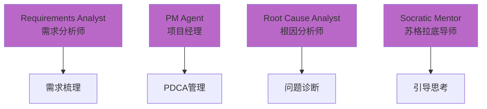

#### 商业专家面板 (2个)

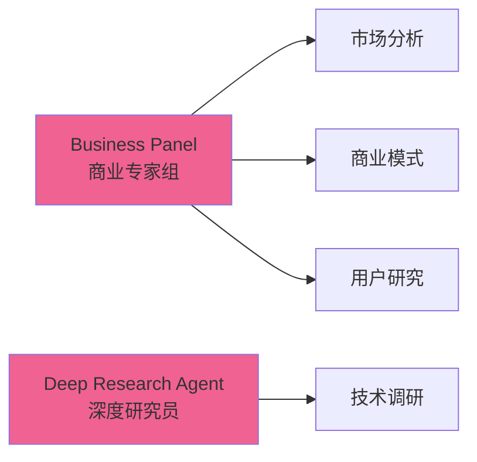

---

### 🎨 7种工作模式

#### 核心行为模式

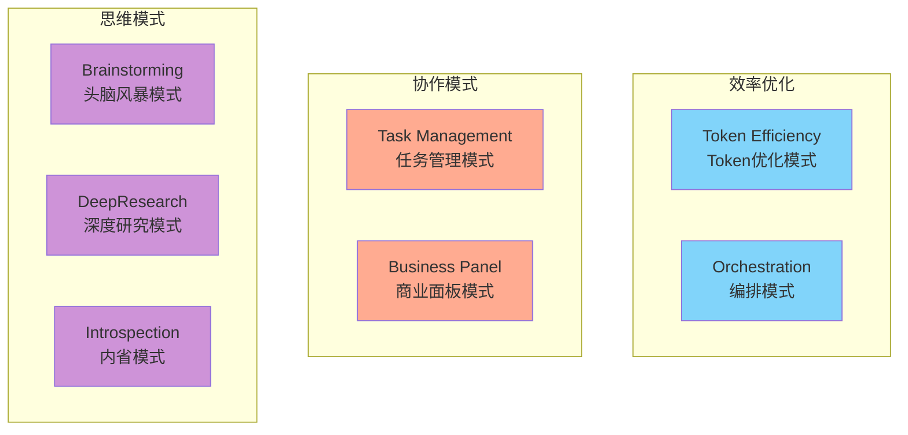

| 模式 | 激活条件 | 核心特性 |
|:---|:---|:---|
| **Token Efficiency** | 上下文>75% | 符号通信、30-50%压缩 |
| **Orchestration** | 多工具协调 | 智能工具选择、并行执行 |
| **Task Management** | 复杂任务 | TodoWrite集成、进度追踪 |
| **Business Panel** | 商业决策 | 多专家协作、市场分析 |
| **Brainstorming** | 创新需求 | 发散思维、创意生成 |
| **DeepResearch** | 深度调研 | 系统分析、知识整合 |
| **Introspection** | 自我评估 | PDCA循环、模式学习 |

---

### 🔧 8个MCP服务器集成

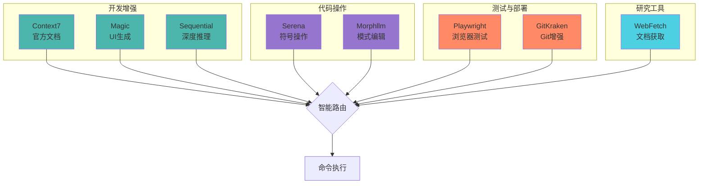

#### MCP服务器职责

| MCP | 用途 | 支持命令 |
|:---|:---|:---|
| **Context7** | React/Vue等框架文档 | implement, design |
| **Magic** | AI驱动UI组件生成 | implement, spawn |
| **Sequential** | 多步骤推理分析 | explain, improve, brainstorm |
| **Serena** | 符号级代码操作 | troubleshoot, analyze |
| **Morphllm** | 批量模式编辑 | improve, cleanup |
| **Playwright** | 浏览器自动化测试 | test, build |
| **GitKraken** | 增强Git工作流 | git, workflow |
| **WebFetch** | 获取技术文档 | research, design |

---

### 🔄 典型工作流程

#### 1️⃣ 企业级功能开发

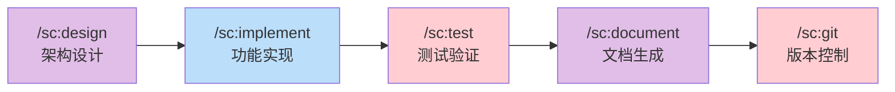

**激活智能体**: System Architect → Frontend/Backend Architect → QA Engineer → Technical Writer

---

#### 2️⃣ 敏捷特性开发

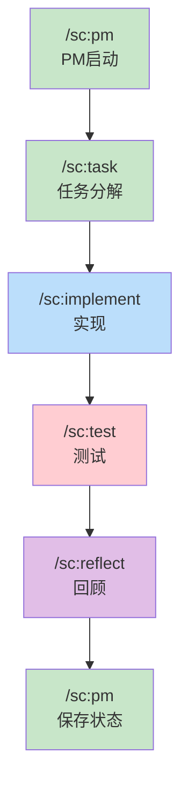

**工作模式**: Task Management → Token Efficiency → Introspection

---

#### 3️⃣ 问题诊断修复

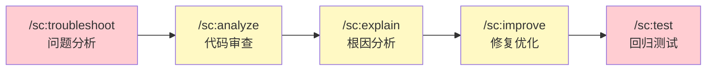

**激活智能体**: Root Cause Analyst → Security Engineer → Refactoring Expert

---

#### 4️⃣ 跨会话项目管理

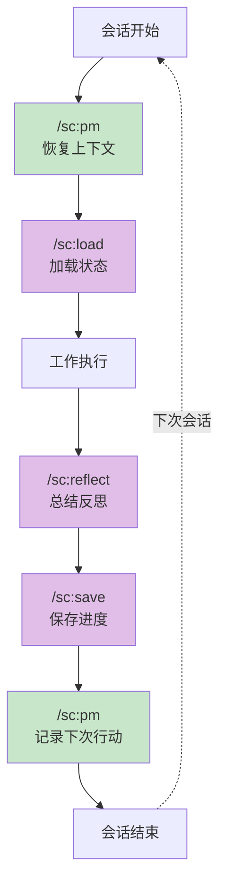

**核心机制**: PM Agent自动激活 → Serena MCP内存管理 → PDCA循环

---

### 🎯 核心特性总结

#### 🔹 9个认知特色

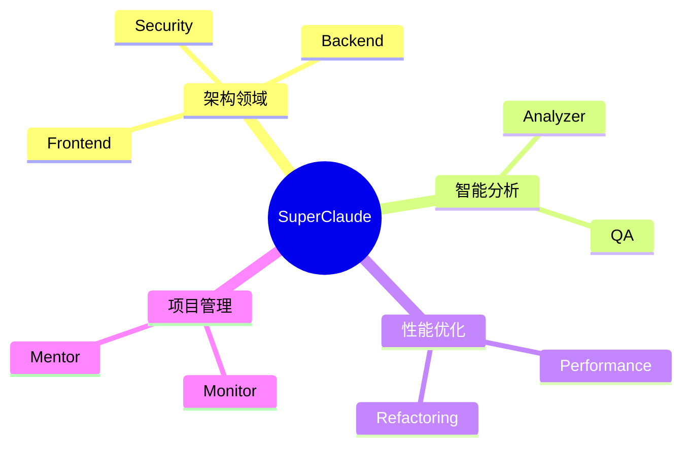

| 特色 | 说明 | 应用场景 |
|:---|:---|:---|
| **前后端分离** | Frontend/Backend架构师独立 | 全栈项目 |
| **安全优先** | Security Engineer内置 | 企业级开发 |
| **质量保证** | QA/Performance双重把关 | 生产环境 |
| **智能路由** | Orchestration模式自动选择工具 | 复杂任务 |
| **Token优化** | 符号通信系统节省30-50% | 大规模项目 |
| **PDCA循环** | PM Agent持续改进 | 长期项目 |
| **MCP扩展** | 8个服务器可选增强 | 灵活配置 |
| **跨会话管理** | Serena内存持久化 | 分阶段开发 |
| **测试驱动** | Playwright集成 | 质量优先 |

---

#### 🔸 MCP集成策略

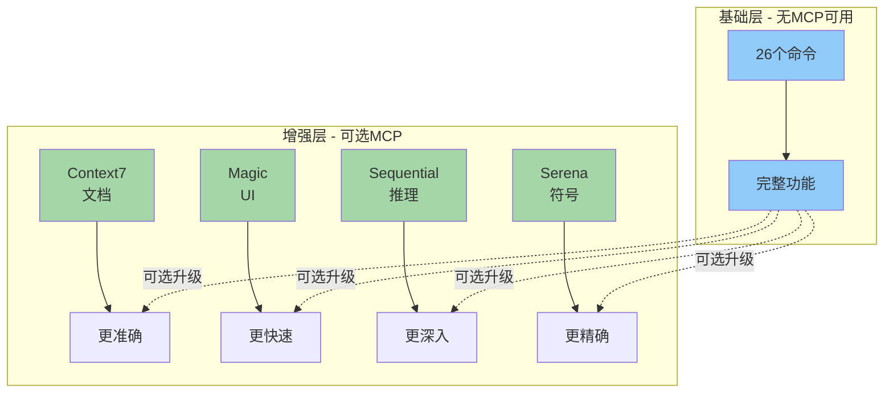

**设计理念**:

- ✅ **基础完备**: 无MCP即可完整使用
- ⚡ **按需增强**: MCP提供专业能力
- 🎯 **智能路由**: Orchestration模式自动选择

---

#### 🔹 Token优化方法

| 方法 | 压缩率 | 适用场景 |
|:---|:---:|:---|
| **符号通信** | 40% | 逻辑流程、状态表示 |
| **缩写系统** | 30% | 技术术语、重复概念 |
| **表格化** | 50% | 数据展示、对比分析 |
| **思维导图** | 45% | 架构设计、关系梳理 |

---

### 🚀 示例工作流

#### 完整企业项目流程

```mermaid
gantt
    title SuperClaude 企业级开发流程
    dateFormat YYYY-MM-DD
    section 规划阶段
    需求分析 :a1, 2025-01-01, 2d
    架构设计 :a2, after a1, 3d
    section 开发阶段
    环境搭建 :b1, after a2, 1d
    功能实现 :b2, after b1, 7d
    代码审查 :b3, after b2, 2d
    section 测试阶段
    单元测试 :c1, after b2, 3d
    集成测试 :c2, after c1, 2d
    性能测试 :c3, after c2, 1d
    section 部署阶段
    构建打包 :d1, after b3, 1d
    部署上线 :d2, after d1, 1d
    文档整理 :d3, after d2, 1d
```

**命令序列**:
```bash
/sc:design --type architecture          # 1. 架构设计
/sc:spawn backend-api                   # 2. 项目生成
/sc:implement user-auth --with-tests    # 3. 功能实现
/sc:test --coverage                     # 4. 测试覆盖
/sc:analyze --focus security            # 5. 安全审计
/sc:improve --type performance          # 6. 性能优化
/sc:build --type prod                   # 7. 生产构建
/sc:document --auto                     # 8. 文档生成
/sc:git "feat: user authentication"     # 9. 版本控制
```

---

### 📈 对比分析

#### SuperClaude vs 传统开发

| 维度 | 传统开发 | SuperClaude |
|:---|:---:|:---:|
| **命令系统** | ❌ 无 | ✅ 26个专业命令 |
| **智能体** | ❌ 无 | ✅ 16个领域专家 |
| **工作流** | 🔧 手动设计 | ⚡ 自动编排 |
| **MCP集成** | ❌ 需手动配置 | ✅ 智能路由 |
| **跨会话** | ❌ 需重新说明 | ✅ 自动恢复 |
| **Token效率** | ➖ 标准 | ⚡ 节省30-50% |
| **质量保证** | 🔧 手动检查 | ✅ 多层验证 |
| **学习曲线** | ⬆️ 陡峭 | ➡️ 渐进式 |

---

### 🎓 学习路径建议

```mermaid
graph TD
    A[🌱 初学者] --> B[掌握基础命令]
    B --> C["/sc:help, /sc:build, /sc:test"]
    
    C --> D[🌿 进阶者]
    D --> E[使用工作流]
    E --> F["/sc:workflow, /sc:task, /sc:implement"]
    
    F --> G[🌳 高级用户]
    G --> H[配置MCP增强]
    H --> I[Context7, Magic, Sequential]
    
    I --> J[🎯 专家级]
    J --> K[自定义智能体]
    K --> L[PM Agent, 跨会话管理]
    
    style A fill:#c8e6c9
    style D fill:#fff9c4
    style G fill:#ffcc80
    style J fill:#ce93d8
```

#### 学习阶段目标

1. **初学者** (1-3天)
   - 安装配置SuperClaude
   - 熟悉基础命令: `help`, `build`, `test`
   - 理解命令分类系统

2. **进阶者** (1周)
   - 掌握工作流命令
   - 使用任务管理系统
   - 理解智能体协作

3. **高级用户** (2周)
   - 配置MCP服务器
   - 优化Token使用
   - 自定义工作流

4. **专家级** (1个月+)
   - PM Agent深度使用
   - 跨会话项目管理
   - 贡献社区模式

---

### 💡 最佳实践

#### ✅ 推荐做法

```mermaid
graph LR
    A[明确需求] --> B[选择命令]
    B --> C[激活智能体]
    C --> D[执行任务]
    D --> E[验证结果]
    E --> F[保存状态]
    
    style A fill:#c8e6c9
    style B fill:#c8e6c9
    style C fill:#fff9c4
    style D fill:#bbdefb
    style E fill:#ffcdd2
    style F fill:#e1bee7
```

1. **使用 `/sc:help`** 快速查找命令
2. **按阶段使用**: 设计 → 实现 → 测试 → 部署
3. **启用PM Agent** 进行长期项目管理
4. **配置常用MCP** 提升效率
5. **定期 `/sc:reflect`** 总结经验

### ⚠️ 避免陷阱

1. ❌ 不要跳过测试阶段
2. ❌ 不要忽视安全审计
3. ❌ 不要混用多个工作流
4. ❌ 不要过度依赖单一命令
5. ❌ 不要忘记保存会话状态

## 版本更新
v2.0.1 引入架构改进，例如模板引用系统、安装器增强（支持更新、备份、平台检测）、模块化设计和统一标志行为。


## 🎉 总结

SuperClaude通过**26个专业命令**、**16个智能体角色**、**7种工作模式**和**8个MCP集成**，构建了一个完整的元编程配置框架，将Claude Code转变为结构化的企业级开发平台。

### 核心优势

1. **🎯 专业化**: 每个命令针对特定场景优化
2. **🤝 协作化**: 智能体自动协作完成复杂任务
3. **⚡ 高效化**: Token优化与并行执行
4. **🔧 灵活化**: MCP可选增强，渐进式配置
5. **📊 系统化**: PM Agent与PDCA循环确保质量

### 适用场景

- ✅ 企业级全栈开发
- ✅ 敏捷迭代项目
- ✅ 跨会话长期项目
- ✅ 质量要求严格的系统
- ✅ 需要多领域协作的复杂项目

---

**🚀 立即开始使用 SuperClaude！**

```bash
pipx install SuperClaude && SuperClaude install
```

## 📚 相关资源

- 📖 [完整文档](https://superclaude.netlify.app/)
- 🐍 [PyPI包](https://pypi.org/project/superclaude/)
- 📦 [NPM包](https://www.npmjs.com/package/@bifrost_inc/superclaude)
- 💬 [GitHub仓库](https://github.com/SuperClaude-Org/SuperClaude)
- 🎯 [用户指南](../user-guide/commands.md)
- [Youtube](https://www.aivi.fyi/aiagents/introduce-SuperClaude)