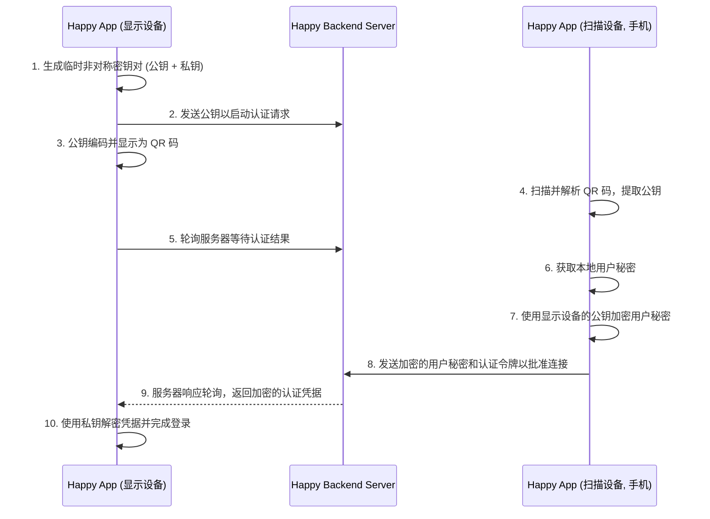
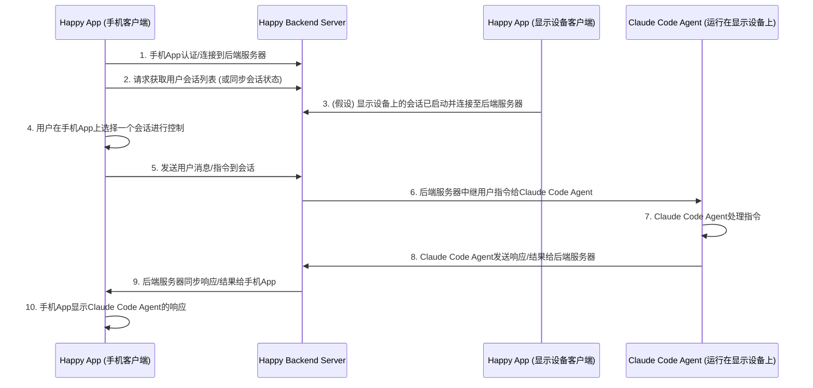

## 简介
Happy是一个可以支持用户用手机app远程控制自己服务器上的AI编程助手（Claude Code, Codex）的工具套件。
它包括：
* happy-cli：用于 Codex 和 Claude Code 的命令行工具。
* happy-server：负责加密同步的后端服务。
* happy-coder：移动客户端app。

在您的电脑上，运行happy-cli而非claude或codex，即可通过我们的封装器启动AI。当您想通过手机控制编程助手时，系统会以远程模式重启会话。要切换回电脑操作，只需按下键盘任意键即可。

目前一个已知的，我觉得不太漂亮的实现是“服务器（后端）”的URL是硬编码的。手机app里面也是写死的。好处是用户只要部署自己的happy cli就可以使用手机app来控制自己服务器上的AI编程助手（Claude Code, Codex）。坏处是如果用户想切换服务器，需要重新编译app。

## 认证流程

**逐步解说**
以下是 Happy App 中通过扫描 QR 码进行账户或终端连接认证的详细步骤解释：

1. 生成临时非对称密钥对（公钥 + 私钥）

    * 解说：在“显示设备”上的 Happy App 启动 QR 码认证流程时，它会利用 generateAuthKeyPair() (sources/auth/authQRStart.ts) 函数，使用 libsodium 和 expo-crypto 库生成一个临时的、唯一的非对称密钥对。这个私钥会安全地保留在“显示设备”上，而公钥将用于后续的交互。这保证了即使公钥被公开，只有持有对应私钥的设备才能解密信息。

2. 发送公钥以启动认证请求

    * 解说：生成密钥对后，authQRStart() (sources/auth/authQRStart.ts) 函数会将这个临时生成的公钥发送到 Happy 后端服务器的 /v1/auth/account/request 端点。服务器会记录下这个公钥，并将其与一个“待授权会话”关联起来，表示有一个客户端正在等待通过这个公钥进行认证。

3. 公钥编码并显示为 QR 码

    * 解说：显示设备上的 Happy App 会将生成的公钥进行编码（例如使用 Base64url），然后嵌入到一个特定的 URL 中，如 happy:///account?。这个完整的 URL 会被转换成一个 QR 码，并显示在“显示设备”的屏幕上 (sources/app/(app)/restore/index.tsx)，等待用户用另一台设备扫描。

4. 扫描并解析 QR 码，提取公钥

    * 解说：用户使用“扫描设备”（例如手机）上的 Happy App 扫描“显示设备”屏幕上的 QR 码。useConnectAccount (sources/hooks/useConnectAccount.ts) 或 useConnectTerminal (sources/hooks/useConnectTerminal.ts) 钩子会监听条形码扫描事件，并从扫描到的 URL 中解析出之前由“显示设备”生成的公钥。

5. 轮询服务器等待认证结果

    * 解说：与此同时，“显示设备”上的 Happy App 不会立即关闭，而是会通过 authQRWait() (sources/auth/authQRWait.ts) 函数持续地向后端服务器轮询，反复查询其在步骤2中启动的那个“待授权会话”的认证状态。它在等待“扫描设备”批准连接的消息。

6. 获取本地用户秘密

    * 解说：扫描设备（手机）在解析出公钥后，会从其本地的安全存储中获取当前用户的敏感信息，即其 auth.credentials!.secret。这是用户身份的凭证，必须安全传输。

7. 使用显示设备的公钥加密用户秘密

    * 解说：扫描设备使用从 QR 码中提取的“显示设备”的公钥，调用 encryptBox() (sources/encryption/libsodium.ts) 函数对本地获取的用户秘密进行非对称加密。这种加密方式保证了只有持有对应私钥的“显示设备”才能解密这个秘密，从而确保了传输过程中的机密性。对于终端连接，可能还会加密 contentDataKey (sources/hooks/useConnectTerminal.ts) 等额外数据。

8. 发送加密的用户秘密和认证令牌以批准连接

    * 解说：扫描设备将加密后的用户秘密（作为 response 参数）以及扫描设备自身的认证令牌，通过 authAccountApprove() (sources/auth/authAccountApprove.ts) 或 authApprove() (sources/auth/authApprove.ts) 函数发送给后端服务器。这表示扫描设备已经批准了连接请求，并将加密后的凭据传递给服务器。服务器会验证此请求，并将加密秘密存储起来，同时将对应的“待授权会话”状态标记为“authorized”。

9. 服务器响应轮询，返回加密的认证凭据

    * 解说：当“显示设备”的轮询请求 (在步骤5中) 发现服务器上对应会话的认证状态已经变为“authorized”时，服务器会响应这个轮询请求。响应中会包含加密后的认证凭据，例如一个令牌 (token) 和从扫描设备接收到的加密秘密 (response)。请注意，服务器本身不会解密这些敏感信息。

10. 使用私钥解密凭据并完成登录

    * 解说：“显示设备”收到服务器返回的加密凭据后，会使用其在步骤1中生成的、独有的私钥来调用 decryptBox() (sources/encryption/libsodium.ts) 函数进行解密。如果解密成功，设备就能获取到用户的真实秘密和认证令牌。随后，“显示设备”会使用这些凭据完成登录流程 (auth.login())，并可能进行页面跳转 (sources/app/(app)/restore/index.tsx)，从而完成整个多设备间的安全认证和连接。

## 运行流程

以下是手机 App 操控运行在“显示设备”上的 Claude Code 的详细步骤解释：

1. 手机 App 认证/连接到后端服务器

    * 解说：手机上的 Happy App 启动后，首先会通过其内置的、预配置的服务器 URL 连接到 Happy 的后端服务器。这一步会涉及用户身份认证，例如通过之前讨论的 QR 码认证流程。成功认证后，手机 App 就能以用户的身份与后端服务器进行安全通信。

2. 请求获取用户会话列表（或同步会话状态）

    * 解说：手机 App 连接并认证后，会向后端服务器请求获取该用户所有的活跃会话列表。这个列表会包含在“显示设备”上（或其他设备上）已经启动的，并由 Happy 后端服务器管理的会话。手机 App 通过 apiSocket (slopus/happy/sources/sync/apiSocket.ts) 接收这些会话更新，并在 [SessionHistory](%2Fslopus%2Fhappy%2Fsources%2Fapp%2F%28app%29%2Fsession%2Frecent.tsx#L12) (slopus/happy/sources/app/(app)/session/recent.tsx) 等组件中展示。

3. (假设) 显示设备上的会话已启动并连接至后端服务器

    * 解说：这是一个前提条件。此时，用户已经在“显示设备”（例如电脑）上运行了 Happy App，并通过其 Wrapper 启动了一个 Claude Code Agent。这个 Agent 实例正在“显示设备”上运行，并且通过 Happy App 客户端与后端服务器保持实时连接，后端服务器也知道这个会话的状态。

4. 用户在手机 App 上选择一个会话进行控制

    * 解说：手机 App 从后端服务器获取的会话列表中，会显示出在“显示设备”上运行的那个 Claude Code 会话。用户可以在手机 App 的“最近会话”界面 (sources/app/(app)/session/recent.tsx) 中点击进入该会话的详细视图，从而选择对其进行控制。

5. 发送用户消息/指令到会话

    * 解说：用户在手机 App 的会话界面中，通过 AgentInput (slopus/happy/sources/components/AgentInput.tsx) 等输入组件输入消息或指令。当用户发送这些消息时，手机 App 会使用 sync.sendMessage(sessionId, message) (slopus/happy/sources/sync/sync.ts) 函数，将消息连同目标会话的唯一 ID 一起发送给 Happy 后端服务器。

6. 后端服务器中继用户指令给 Claude Code Agent

    * 解说：Happy 后端服务器接收到来自手机 App 的消息后，会根据消息中包含的会话 ID，将用户指令实时中继（relay）给运行在“显示设备”上的对应 Claude Code Agent 实例。后端服务器在此过程中也负责管理会话的控制权，例如通过 [agentState](%2Fslopus%2Fhappy%2Fsources%2Fsync%2Fsync.ts#L1597) 中的 [controlledByUser](%2Fslopus%2Fhappy%2Fsources%2Fapp%2F%28app%29%2Fsession%2F%5Bid%5D%2Finfo.tsx#L351) 标志来协调哪个客户端当前拥有控制权。

7. Claude Code Agent 处理指令

    * 解说：运行在“显示设备”上的 Claude Code Agent 实例接收到后端服务器中继过来的用户指令后，会根据其内部逻辑（例如基于 [systemPrompt](%2Fslopus%2Fhappy%2Fsources%2Fsync%2Fprompt/systemPrompt.ts) 的指导）进行处理。这可能包括执行代码、文件操作、运行终端命令，或生成文本回应。

8. Claude Code Agent 发送响应/结果给后端服务器

    * 解说：Claude Code Agent 完成指令处理后，会将其产生的响应（如处理结果、代码输出、文本回复、权限请求等）发送回 Happy 后端服务器。

9. 后端服务器同步响应/结果给手机 App

    * 解说：Happy 后端服务器接收到 Claude Code Agent 的响应后，会实时地将这些响应同步给所有连接到该会话的客户端，包括手机 App。手机 App 通过其 WebSocket 连接 (ApiSocket in slopus/happy/sources/sync/apiSocket.ts) 接收这些实时更新。

10. 手机 App 显示 Claude Code Agent 的响应

    * 解说：手机 App 接收到后端服务器同步过来的 Claude Code Agent 响应后，会立即将其显示在用户界面上。这通常通过 ChatList (slopus/happy/sources/components/ChatList.tsx) 和 MessageView (slopus/happy/sources/components/MessageView.tsx) 等组件来呈现，完成了一次完整的用户通过手机 App 与运行在“显示设备”上的 Claude Code Agent 进行交互的循环。

https://github.com/slopus/happy
