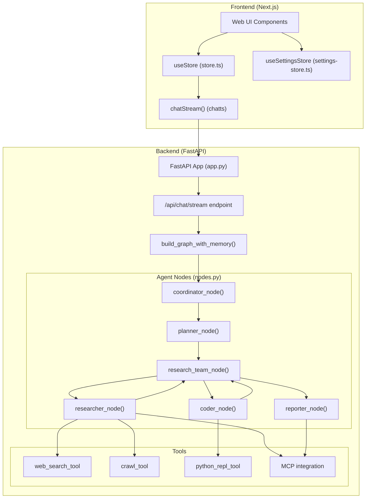
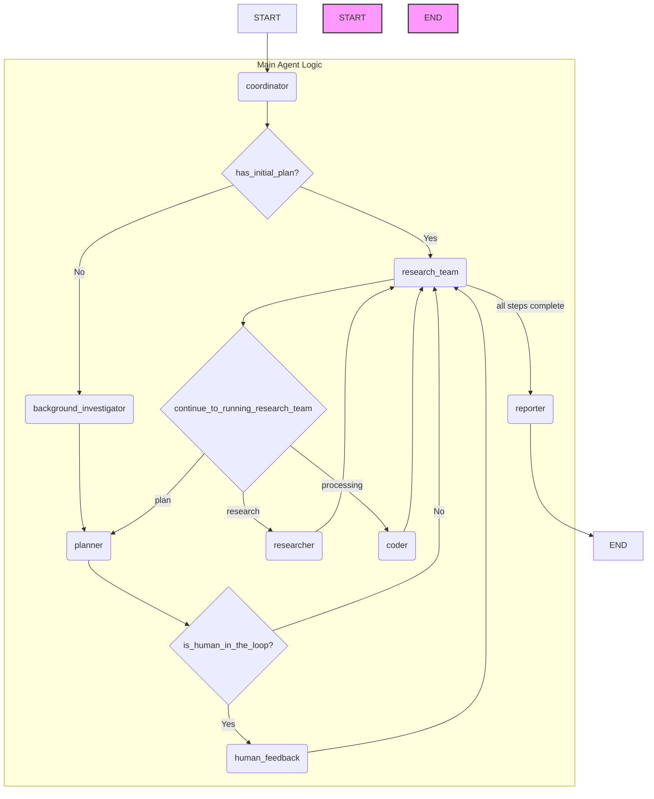

更新历史:

- 2025-06-18: 添加了多Agent和Graph的协同工作设计原理
- 2025-05-21: DeerFlow 项目介绍。

## 介绍

DeerFlow 是一个社区驱动的深度研究框架，由字节跳动开发，结合语言模型与工具（如网页搜索、爬虫、Python 执行），强调开放源码并回馈开源社区。核心功能包括：

1. **LLM 集成**：支持多层级模型集成，用于不同复杂度任务（不同节点可以使用不同的模型）；
2. **工具与搜索能力**：支持 Tavily、DuckDuckGo、Brave、Arxiv 等多种搜索引擎和高级内容提取；
3. **报告生成**：基本研究、报告编辑、PPT 生成及播客脚本制作；
4. **人机协作**：支持自然语言修改研究计划；
5. **TTS 功能**：将研究报告转为高质量的语音。
6. **前后端分离**：前端使用Next.js，后端使用FastAPI + Python LangGraph Workflow
7. **支持MCP**：支持MCP（Modal Context Protocol）协议
8.

项目采用模块化多代理架构，基于 **LangGraph** 的可视化工作流。此外，提供控制台和 Web UI 两种界面，支持 Docker 部署和配置，可快速地进行深度研究和报告生成。项目开源，遵循 MIT 许可协议，官方文档详尽，设置和使用简单易行。

## 架构

### 整体架构图



#### 主LangGraph流程图细节

下面由Gemini 2.5 pro在cursor里基于graph, agent, tools 3个目录的代码生成. 这个 `builder.py` 文件使用 `langgraph` 库定义了一个智能体工作流程的状态图。我们可以通过分析其中的节点和边来理解其工作流程。

以下是根据 `src/graph/builder.py` 文件内容绘制的流程图。

这个图展示了智能体内部不同模块（节点）之间的协作关系和控制流程。



### 流程图解析

1. **START**: 流程起始点。
2. **coordinator**: 协调器节点，是整个流程的入口。它会判断当前是否存在初始计划。
    - 如果**有**，则直接进入 `research_team` 节点开始执行。
    - 如果**没有**，则进入 `background_investigator` 进行背景调查。
3. **background\_investigator**: 背景调查节点，负责收集初始信息。
4. **planner**: 规划器节点，根据背景调查信息或现有状态制定或修正计划。
5. **human\_feedback**: 人工反馈节点。在规划之后，可以选择性地引入人工审核和反馈，然后再将更新后的计划交给 `research_team`。
6. **research\_team**: 这是图的核心部分，一个超级节点（子图），负责管理和执行计划。它本身不直接执行任务，而是根据计划中每个步骤的类型，将任务分发给具体的执行者（`planner`、`researcher` 或 `coder`）。
7. **continue\_to\_running\_research\_team (Conditional Edge)**: 这是一个条件判断。`research_team` 节点执行后，会根据 `continue_to_running_research_team` 函数的逻辑进行跳转：
    - 如果计划中的步骤是 `RESEARCH` 类型，则调用 `researcher` 节点。
    - 如果计划中的步骤是 `PROCESSING` 类型，则调用 `coder` 节点。
    - 如果所有步骤都已完成或需要重新规划，则返回 `planner` 节点。
8. **researcher**: 研究员节点，负责执行研究任务。
9. **coder**: 程序员节点，负责执行代码或数据处理任务。
10. **reporter**: 报告生成器节点。当 `research_team` 的所有计划步骤都执行完毕后，流程会进入此节点，生成最终的报告。
11. **END**: 流程结束点。

这个流程图清晰地展示了一个由"协调-规划-执行-反馈"构成的闭环，其中 `research_team` 是一个核心的调度中心，通过条件边将任务动态地分配给不同的执行单元。

### 多Agent和Graph的协同工作设计原理

deer-flow通过LangGraph框架实现了Agent和Graph的解耦设计，同时通过统一的接口让Agent支持Graph中的不同Node。

#### 解耦与集成的架构设计

#### Graph层面的解耦

Graph的构建完全独立于具体的Agent实现。在`src/graph/builder.py`中，Graph通过节点名称和路由逻辑来定义工作流结构：

```python
def _build_base_graph():
    """Build and return the base state graph with all nodes and edges."""
    builder = StateGraph(State)
    builder.add_edge(START, "coordinator")
    builder.add_node("coordinator", coordinator_node)
    builder.add_node("background_investigator", background_investigation_node)
    builder.add_node("planner", planner_node)
    builder.add_node("reporter", reporter_node)
    builder.add_node("research_team", research_team_node)
    builder.add_node("researcher", researcher_node)
    builder.add_node("coder", coder_node)
    builder.add_node("human_feedback", human_feedback_node)
    builder.add_edge("background_investigator", "planner")
    builder.add_conditional_edges(
        "research_team",
        continue_to_running_research_team,
        ["planner", "researcher", "coder"],
    )
    builder.add_edge("reporter", END)
    return builder
```

Graph只关心节点之间的连接关系和状态流转，不依赖具体的Agent实现细节。

#### Agent的统一接口设计

所有Agent都遵循相同的函数签名模式，接收`State`和`RunnableConfig`参数，返回`Command`对象：

```python
def planner_node(
    state: State, config: RunnableConfig
) -> Command[Literal["human_feedback", "reporter"]]:
    """Planner node that generate the full plan."""
```

```python
async def researcher_node(
    state: State, config: RunnableConfig
) -> Command[Literal["research_team"]]:
    """Researcher node that do research"""
```

#### 通过工具系统实现Agent能力差异化

不同的Agent通过配置不同的工具集来实现专业化分工：

- **researcher_node**使用搜索和爬虫工具：

```python
async def researcher_node(
    state: State, config: RunnableConfig
) -> Command[Literal["research_team"]]:
    """Researcher node that do research"""
    logger.info("Researcher node is researching.")
    configurable = Configuration.from_runnable_config(config)
    tools = [get_web_search_tool(configurable.max_search_results), crawl_tool]
    retriever_tool = get_retriever_tool(state.get("resources", []))
    if retriever_tool:
        tools.insert(0, retriever_tool)
    logger.info(f"Researcher tools: {tools}")
    return await _setup_and_execute_agent_step(
        state,
        config,
        "researcher",
        tools,
    )
```

- **coder_node**使用Python REPL工具：

```python

async def coder_node(
    state: State, config: RunnableConfig
) -> Command[Literal["research_team"]]:
    """Coder node that do code analysis."""
    logger.info("Coder node is coding.")
    return await _setup_and_execute_agent_step(
        state,
        config,
        "coder",
        [python_repl_tool],
    )
```

#### 统一的Agent执行框架

所有Agent的实际执行都通过`_execute_agent_step`函数统一处理，这个函数负责：

1. 从状态中获取当前执行步骤
2. 格式化Agent输入
3. 调用Agent执行
4. 更新状态

```python
async def _execute_agent_step(
    state: State, agent, agent_name: str
) -> Command[Literal["research_team"]]:
    """Helper function to execute a step using the specified agent."""
    current_plan = state.get("current_plan")
    observations = state.get("observations", [])

    # Find the first unexecuted step
    current_step = None
    completed_steps = []
    for step in current_plan.steps:
        if not step.execution_res:
            current_step = step
            break
        else:
            completed_steps.append(step)

    if not current_step:
        logger.warning("No unexecuted step found")
        return Command(goto="research_team")
```

#### 动态路由机制

Graph通过`continue_to_running_research_team`函数根据步骤类型动态路由到不同的Agent：

```python
def continue_to_running_research_team(state: State):
    current_plan = state.get("current_plan")
    if not current_plan or not current_plan.steps:
        return "planner"
    if all(step.execution_res for step in current_plan.steps):
        return "planner"
    for step in current_plan.steps:
        if not step.execution_res:
            break
    if step.step_type and step.step_type == StepType.RESEARCH:
        return "researcher"
    if step.step_type and step.step_type == StepType.PROCESSING:
        return "coder"
    return "planner"
```

#### 核心优势

这种架构设计的核心优势是：

1. **解耦性**：Graph结构与Agent实现完全分离，可以独立修改
2. **可扩展性**：新增Agent只需实现统一接口并注册到Graph中
3. **灵活性**：通过工具配置实现Agent的专业化分工
4. **统一性**：所有Agent共享相同的执行框架和状态管理机制

## 限制

目前报告生成由Reporter完成，但是没有其他角色对其输出进行检查。
目前只支持同时运行一种Search Engine，.env里面只有一个SEARCH_API配置。

## Demo

在本地安装DeerFlow，并使用CLI 或Web UI来运行。

### Step1: Install

```bash
# Clone the repository
git clone https://github.com/bytedance/deer-flow.git
cd deer-flow

# Install dependencies, uv will take care of the python interpreter and venv creation, and install the required packages
uv sync

# Configure .env with your API keys
# Tavily: https://app.tavily.com/home
# Brave_SEARCH: https://brave.com/search/api/
# volcengine TTS: Add your TTS credentials if you have them
cp .env.example .env

# See the 'Supported Search Engines' and 'Text-to-Speech Integration' sections below for all available options

# Configure conf.yaml for your LLM model and API keys
# Please refer to 'docs/configuration_guide.md' for more details
cp conf.yaml.example conf.yaml

# Optionally, install web UI dependencies via pnpm:
cd deer-flow/web
pnpm install
```

### Step 2: 使用一个UI来运行

Console UI

```bash
# Run the project in a bash-like shell
uv run main.py
WebUI
这个目前不是很好用
# Run both the backend and frontend servers in development mode
# On macOS/Linux
./bootstrap.sh -d

# Open your browser and visit http://localhost:3000 to explore the web UI.
```

### 问题

1.如何不同的Agent使用不同的模型？
修给下面的mapping，在config.yaml里面加模型配置信息。

```python
AGENT_LLM_MAP: dict[str, LLMType] = {
    "coordinator": "basic",
    "planner": "basic",
    "researcher": "basic",
    "coder": "basic",
    "reporter": "basic",
    "podcast_script_writer": "basic",
    "ppt_composer": "basic",
    "prose_writer": "basic",
}
```

## 参考

-[deerflow github](https://github.com/bytedance/deer-flow)
-[deepwiki deerflow](https://deepwiki.com/bytedance/deer-flow)
