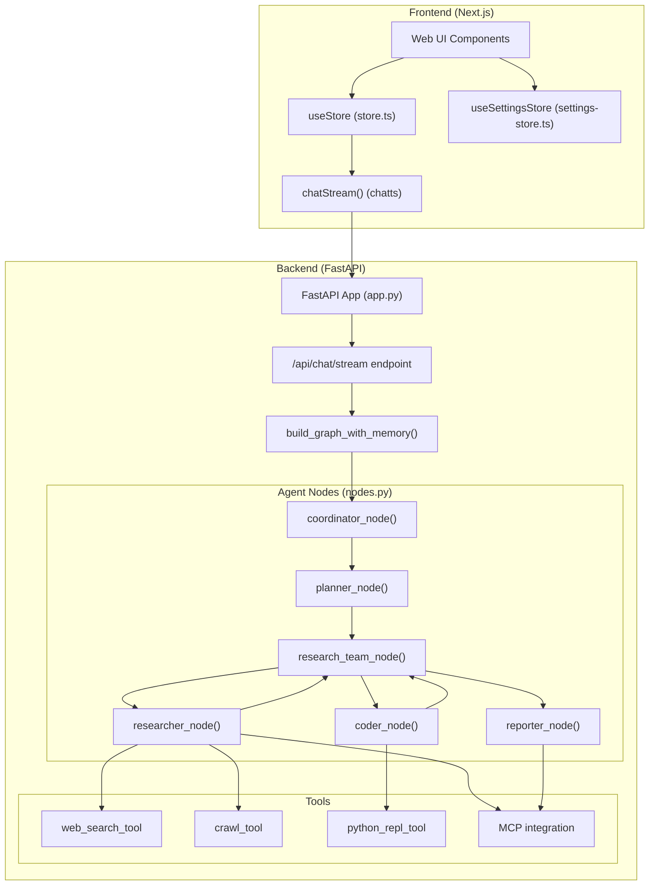
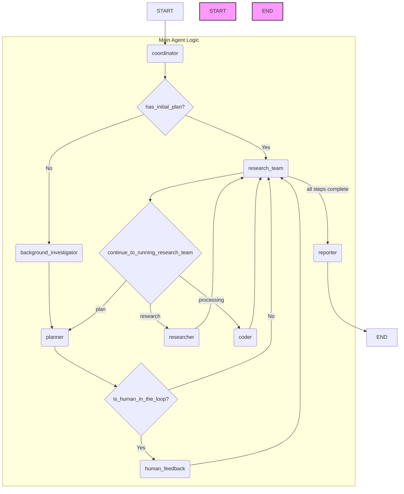

## 介绍

DeerFlow 是一个社区驱动的深度研究框架，由字节跳动开发，结合语言模型与工具（如网页搜索、爬虫、Python 执行），强调开放源码并回馈开源社区。核心功能包括：

1. **LLM 集成**：支持多层级模型集成，用于不同复杂度任务（不同节点可以使用不同的模型）；
2. **工具与搜索能力**：支持 Tavily、DuckDuckGo、Brave、Arxiv 等多种搜索引擎和高级内容提取；
3. **报告生成**：基本研究、报告编辑、PPT 生成及播客脚本制作；
4. **人机协作**：支持自然语言修改研究计划；
5. **TTS 功能**：将研究报告转为高质量的语音。
6. **前后端分离**：前端使用Next.js，后端使用FastAPI + Python LangGraph Workflow
7. **支持MCP**：支持MCP（Modal Context Protocol）协议
8.

项目采用模块化多代理架构，基于 **LangGraph** 的可视化工作流。此外，提供控制台和 Web UI 两种界面，支持 Docker 部署和配置，可快速地进行深度研究和报告生成。项目开源，遵循 MIT 许可协议，官方文档详尽，设置和使用简单易行。

## 架构

### 整体架构图



#### 主LangGraph流程图细节

下面由Gemini 2.5 pro在cursor里基于graph, agent, tools 3个目录的代码生成. 这个 `builder.py` 文件使用 `langgraph` 库定义了一个智能体工作流程的状态图。我们可以通过分析其中的节点和边来理解其工作流程。

以下是根据 `src/graph/builder.py` 文件内容绘制的流程图。

这个图展示了智能体内部不同模块（节点）之间的协作关系和控制流程。



### 流程图解析

1. **START**: 流程起始点。
2. **coordinator**: 协调器节点，是整个流程的入口。它会判断当前是否存在初始计划。
    * 如果**有**，则直接进入 `research_team` 节点开始执行。
    * 如果**没有**，则进入 `background_investigator` 进行背景调查。
3. **background\_investigator**: 背景调查节点，负责收集初始信息。
4. **planner**: 规划器节点，根据背景调查信息或现有状态制定或修正计划。
5. **human\_feedback**: 人工反馈节点。在规划之后，可以选择性地引入人工审核和反馈，然后再将更新后的计划交给 `research_team`。
6. **research\_team**: 这是图的核心部分，一个超级节点（子图），负责管理和执行计划。它本身不直接执行任务，而是根据计划中每个步骤的类型，将任务分发给具体的执行者（`planner`、`researcher` 或 `coder`）。
7. **continue\_to\_running\_research\_team (Conditional Edge)**: 这是一个条件判断。`research_team` 节点执行后，会根据 `continue_to_running_research_team` 函数的逻辑进行跳转：
    * 如果计划中的步骤是 `RESEARCH` 类型，则调用 `researcher` 节点。
    * 如果计划中的步骤是 `PROCESSING` 类型，则调用 `coder` 节点。
    * 如果所有步骤都已完成或需要重新规划，则返回 `planner` 节点。
8. **researcher**: 研究员节点，负责执行研究任务。
9. **coder**: 程序员节点，负责执行代码或数据处理任务。
10. **reporter**: 报告生成器节点。当 `research_team` 的所有计划步骤都执行完毕后，流程会进入此节点，生成最终的报告。
11. **END**: 流程结束点。

这个流程图清晰地展示了一个由"协调-规划-执行-反馈"构成的闭环，其中 `research_team` 是一个核心的调度中心，通过条件边将任务动态地分配给不同的执行单元。

### 多代理工作流

## 限制

目前报告生成由Reporter完成，但是没有其他角色对其输出进行检查。
目前只支持同时运行一种Search Engine，.env里面只有一个SEARCH_API配置。

## Demo

在本地安装DeerFlow，并使用CLI 或Web UI来运行。

### Step1: Install

```bash
# Clone the repository
git clone https://github.com/bytedance/deer-flow.git
cd deer-flow

# Install dependencies, uv will take care of the python interpreter and venv creation, and install the required packages
uv sync

# Configure .env with your API keys
# Tavily: https://app.tavily.com/home
# Brave_SEARCH: https://brave.com/search/api/
# volcengine TTS: Add your TTS credentials if you have them
cp .env.example .env

# See the 'Supported Search Engines' and 'Text-to-Speech Integration' sections below for all available options

# Configure conf.yaml for your LLM model and API keys
# Please refer to 'docs/configuration_guide.md' for more details
cp conf.yaml.example conf.yaml

# Optionally, install web UI dependencies via pnpm:
cd deer-flow/web
pnpm install
```

### Step 2: 使用一个UI来运行

Console UI

```bash
# Run the project in a bash-like shell
uv run main.py
WebUI
这个目前不是很好用
# Run both the backend and frontend servers in development mode
# On macOS/Linux
./bootstrap.sh -d

# Open your browser and visit http://localhost:3000 to explore the web UI.
```

### 问题

1.如何不同的Agent使用不同的模型？
修给下面的mapping，在config.yaml里面加模型配置信息。

```python
AGENT_LLM_MAP: dict[str, LLMType] = {
    "coordinator": "basic",
    "planner": "basic",
    "researcher": "basic",
    "coder": "basic",
    "reporter": "basic",
    "podcast_script_writer": "basic",
    "ppt_composer": "basic",
    "prose_writer": "basic",
}
```

## 参考

-[deerflow github](https://github.com/bytedance/deer-flow)
-[deepwiki deerflow](https://deepwiki.com/bytedance/deer-flow)
