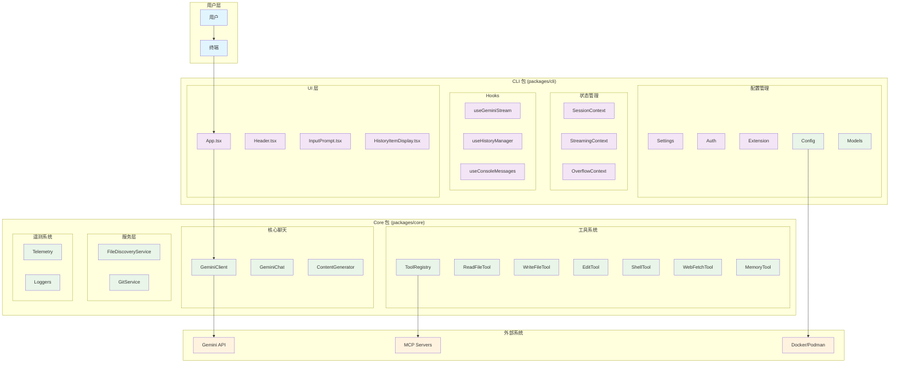
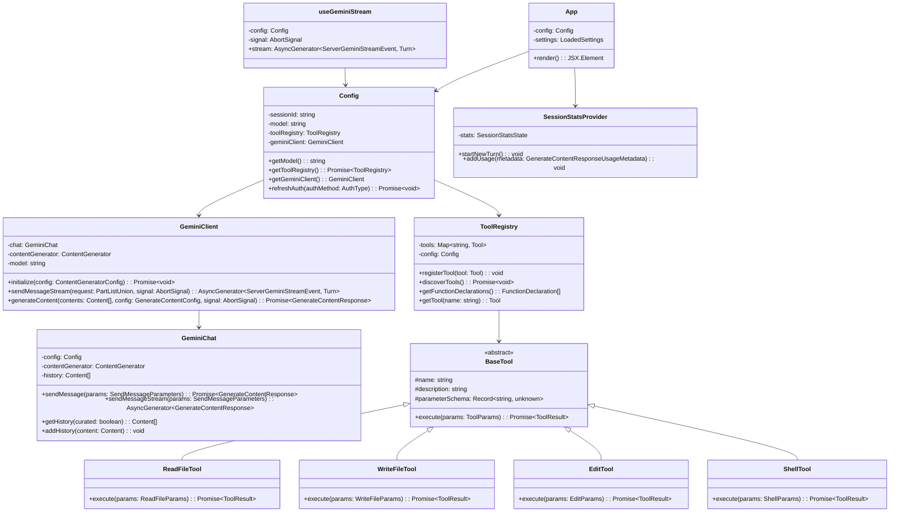
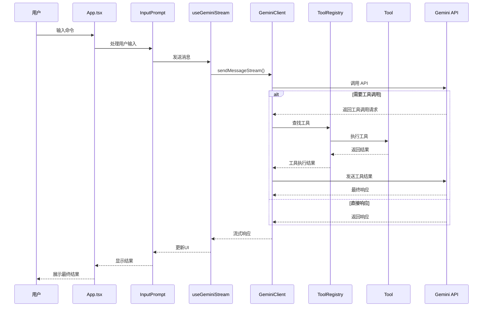
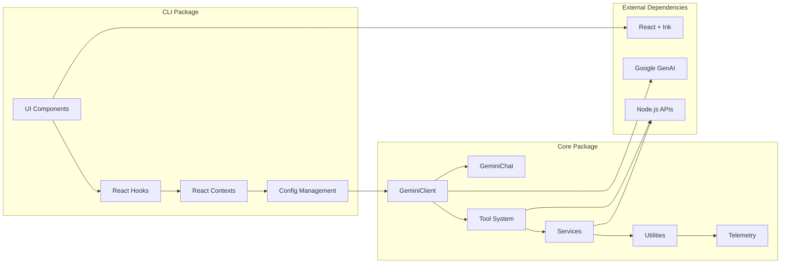
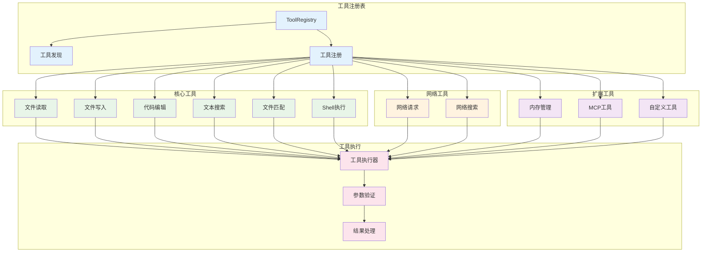
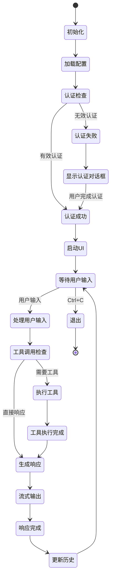
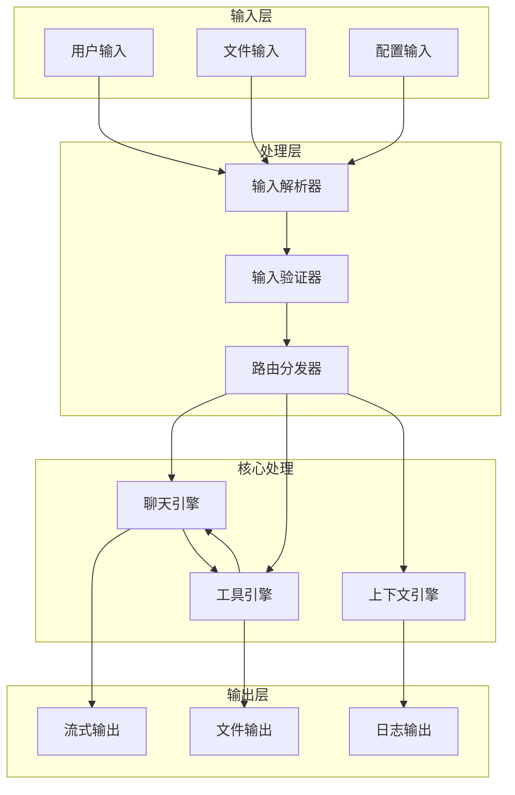

## 项目简介

Gemini CLI 是一个开源的 AI 命令行工具，旨在加速开发者的工作流程并增强代码和工具的交互能力。类似openai CodeX。
主要功能包括：

1. 查询和编辑大型代码库，超出 1M token 上下文窗口。
2. 利用多模态功能生成应用（通过 PDF 或草图）。
3. 自动化操作任务，如 pull request 查询或复杂 rebase 处理。
4. 借助 MCP 服务器连接更多能力，如媒体生成（Imagen、Veo 或 Lyria）。
5. 集成谷歌搜索工具以支持查询。

快速开始：

- 要求安装 Node.js 18 或更高版本。
- 可通过 npx 或 npm 安装运行。
- 使用 Google 账户认证获取免费配额（每分钟 60 次请求，每天 1,000 次请求）。
- 可通过 Google AI Studio 生成 API 密钥以获取更多配额。

应用场景示例包括：探索新代码库、处理现有项目、自动化工作流程及系统交互等。支持 TypeScript 和 JavaScript。

仓库未发布正式版本，使用 Apache-2.0 许可证。

这里使用cursor创建多种 UML 图表来展示 Gemini CLI 系统的架构。先深入分析一些关键组件，然后生成清晰的架构图。

主要代码：

- packages/core/src/core/geminiChat.ts
- packages/cli/src/ui/contexts/SessionContext.tsx

现在我来为您创建多种 UML 图表来展示 Gemini CLI 系统的架构：

## 1. 系统整体架构图 (Mermaid)



## 2. 类图 (Mermaid)



## 3. 组件交互时序图 (Mermaid)



## 4. 包依赖关系图 (Mermaid)



## 5. 工具系统架构图 (Mermaid)



## 6. 状态管理流程图 (Mermaid)



## 7. 数据流图 (Mermaid)



这些图表从不同角度展示了 Gemini CLI 系统的架构：

1. **系统整体架构图** - 展示各层之间的关系
2. **类图** - 显示核心类的结构和关系
3. **时序图** - 展示组件间的交互流程
4. **包依赖关系图** - 显示模块间的依赖
5. **工具系统架构图** - 详细展示工具系统的设计
6. **状态管理流程图** - 展示应用的状态转换
7. **数据流图** - 展示数据在系统中的流动

这些图表帮助从多个维度理解系统的架构设计，包括静态结构、动态交互、数据流向等各个方面。

## 整体架构概览

基于对代码的分析，详细解析 Gemini CLI 项目的代码架构：
Read file: packages/core/src/index.ts
Read file: packages/cli/src/gemini.tsx
Read file: packages/core/src/core/client.ts
Read file: packages/cli/src/ui/App.tsx
Read file: packages/core/src/tools/tool-registry.ts
Read file: package.json
Read file: packages/core/src/config/config.ts

Gemini CLI 是一个基于 Node.js 的命令行工具，采用**模块化设计**和**分层架构**，主要分为两个核心包：

### 1. 包结构设计

```
gemini-cli/
├── packages/
│   ├── core/          # 核心业务逻辑
│   └── cli/           # 命令行界面和用户交互
├── scripts/           # 构建和部署脚本
├── docs/             # 文档
└── integration-tests/ # 集成测试
```

## 2. 核心包 (packages/core)

### 主要模块

#### **核心聊天模块** (`core/`)

- `client.ts` - Gemini API 客户端，处理与 Gemini 模型的通信

- `geminiChat.ts` - 聊天会话管理
- `contentGenerator.ts` - 内容生成器，处理不同类型的认证
- `turn.ts` - 对话轮次管理
- `prompts.ts` - 系统提示词管理

#### **工具系统** (`tools/`)

- `tool-registry.ts` - 工具注册表，管理所有可用工具

- `tools.ts` - 基础工具接口定义
- 具体工具实现：
  - `read-file.ts` / `read-many-files.ts` - 文件读取
  - `write-file.ts` - 文件写入
  - `edit.ts` - 代码编辑
  - `grep.ts` - 文本搜索
  - `shell.ts` - Shell 命令执行
  - `web-fetch.ts` / `web-search.ts` - 网络请求和搜索
  - `memoryTool.ts` - 内存管理
  - `mcp-client.ts` / `mcp-tool.ts` - MCP 协议支持

#### **配置管理** (`config/`)

- `config.ts` - 主配置类，管理所有设置

- `models.ts` - 模型配置
- `flashFallback.ts` - 模型回退机制

#### **服务层** (`services/`)

- `fileDiscoveryService.ts` - 文件发现服务

- `gitService.ts` - Git 集成服务

#### **工具类** (`utils/`)

- `paths.ts` - 路径处理

- `errors.ts` - 错误处理
- `gitUtils.ts` - Git 工具
- `fileUtils.ts` - 文件操作工具

#### **遥测系统** (`telemetry/`)

- 支持多种遥测目标（GCP、本地等）

- 用户行为统计和错误报告

## 3. CLI 包 (packages/cli)

### 主要模块

#### **用户界面** (`ui/`)

- `App.tsx` - 主应用组件

- `components/` - React 组件库
  - `Header.tsx` - 头部组件
  - `InputPrompt.tsx` - 输入提示
  - `HistoryItemDisplay.tsx` - 历史记录显示
  - `DetailedMessagesDisplay.tsx` - 详细消息显示
- `hooks/` - 自定义 React Hooks
- `contexts/` - React Context 状态管理
- `themes/` - 主题系统

#### **配置管理** (`config/`)

- `settings.ts` - 设置管理

- `auth.ts` - 认证配置
- `extension.ts` - 扩展系统

#### **工具类** (`utils/`)

- `sandbox.ts` - 沙箱环境管理

- `startupWarnings.ts` - 启动警告

## 4. 架构特点

### **分层设计**

1. **表示层** - CLI 包负责用户界面和交互
2. **业务逻辑层** - Core 包处理核心业务逻辑
3. **数据访问层** - 工具系统提供各种数据访问能力

### **模块化设计**

- 工具系统采用插件化架构，可以动态注册和发现工具

- 配置系统支持分层配置（用户、项目、全局）
- 主题系统支持多种主题切换

### **扩展性**

- **MCP 协议支持** - 可以集成外部工具服务器

- **扩展系统** - 支持自定义扩展
- **工具发现** - 支持动态发现项目中的工具

### **安全性**

- **沙箱环境** - 支持 Docker/Podman 沙箱隔离

- **权限控制** - 工具执行需要用户确认
- **代理支持** - 支持网络代理配置

### **可观测性**

- **遥测系统** - 完整的用户行为跟踪

- **日志系统** - 详细的调试和错误日志
- **统计信息** - 会话统计和性能指标

## 5. 核心工作流程

1. **启动阶段** - 加载配置、初始化工具、启动沙箱
2. **交互阶段** - 用户输入 → 工具执行 → AI 响应 → 结果展示
3. **工具执行** - 通过工具注册表查找和执行相应工具
4. **状态管理** - 通过 React Context 管理应用状态

这个架构设计非常现代化，采用了 React + TypeScript 的技术栈，具有良好的可维护性和扩展性。
