## TrendRadar

TrendRadar ([github](https://github.com/sansan0/TrendRadar), 38k stars （截止2025-12）) 是一个用于多平台热点聚合和AI智能分析的开源项目，主要功能包括热点新闻监控、智能筛选及推送，同时支持基于MCP协议的深度分析。核心特点：

1. **功能概述**：
   - 聚合35个平台热点（知乎、抖音、B站、华尔街见闻等）。
   - 提供全网热点汇总（每日、当前榜单、增量监控三种模式）。
   - 智能推送：可按关键词筛选热点，并设定时间窗口。
   - 热点趋势分析：实时追踪新闻热度变化，支持跨平台对比。

2. **AI增强**：
   - AI对话分析功能，支持自然语言提问，进行热点趋势追踪、情感分析、相关检索等。
   - 提供本地测试数据，可利用Docker部署MCP服务支持AI使用。

3. **多渠道推送**：
   - 支持飞书、钉钉、企业微信、Telegram、Slack、邮件、Bark 等推送方式。
   - 管理多账号推送功能，适用于多种场景。

4. **便捷部署**：
   - 推荐使用Docker部署，30秒网页生成，1分钟手机通知，无需编程基础。
   - 项目遵循“Use this template”，避免 Fork。

5. **适用人群**：
   - 企业管理者、自媒体人、投资者和普通用户，用于品牌舆情监控、行业动态追踪及时事热点查看。

6. **更新特色**：
   - 新增多账号推送支持、全局过滤关键词、内容顺序配置等功能。
   - 文档优化，提供详细配置教程。

项目提供用户友好的设置选择，可快速高效地追踪和分析热点资讯，同时利用AI工具深度挖掘新闻数据。

## TrendRadar 源码分析

### **架构深度评价**

#### **1. 架构优势**

- **极致轻量与灵活部署**: 同时支持 GitHub Actions (无状态)、Docker (容器化) 和本地运行，通过 `StorageManager` 智能切换 SQLite/S3 存储，极大降低了使用门槛。
- **模块化核心设计**: 核心模块职责边界清晰 (Crawler, Core, Storage, Notification)，新增推送渠道符合开闭原则。
- **前瞻性 AI 融合**: 原生支持 MCP 协议，将传统爬虫转化为 AI Agent 的感知工具，提供自然语言日期解析和趋势分析等高级语义能力。

#### **2. 可扩展性**
- **数据源扩展**: 通用的 `DataFetcher` 接口和 RSS 模块设计证明了对异构数据源的良好兼容性。
- **AI 能力扩展**: FastMCP 2.0 架构使得新增 NLP 工具（如情感分析、摘要生成）非常便捷。

#### **3. 改进方向**
- **并发性能**: `DataFetcher` 目前采用串行抓取，面对大量数据源时 IO 阻塞将成为瓶颈，建议引入异步并发。
- **职责解耦**: `NewsAnalyzer` 类承担了过多编排职责，建议未来拆分为更细粒度的 Pipeline 模式。
- **配置管理**: `config.yaml` 日益庞大，建议引入强类型配置验证 (如 Pydantic) 以减少运行时错误。

---

本文档使用 UML 标准从多角度描述 TrendRadar 的架构设计，包括系统概览、核心组件、数据流、类结构等。

---

### 目录

1. [系统概览](#1-系统概览)
2. [核心功能与创新点](#2-核心功能与创新点)
3. [系统架构图](#3-系统架构图)
4. [组件架构](#4-组件架构)
5. [类图](#5-类图)
6. [时序图](#6-时序图)
7. [数据流图](#7-数据流图)
8. [部署架构](#8-部署架构)
9. [MCP 服务架构](#9-mcp-服务架构)

---

### 1. 系统概览

TrendRadar 是一个**轻量级热点新闻聚合与分析系统**，支持：

- 🔥 **全网热点聚合**：11+ 主流平台热榜数据抓取
- 📰 **RSS 订阅**：支持 RSS/Atom 订阅源
- 🤖 **AI 智能分析**：基于 MCP 协议的 17 种分析工具
- 📱 **多渠道推送**：飞书、钉钉、企业微信、Telegram、Slack、Email 等
- 🌐 **多环境部署**：GitHub Actions、Docker、本地运行

#### 1.2 技术栈

| 层级 | 技术 |
|------|------|
| 语言 | Python 3.8+ |
| 存储 | SQLite (本地) / S3 兼容存储 (远程) |
| MCP 服务 | FastMCP 2.0 |
| 部署 | Docker / GitHub Actions |

---

### 2. 核心功能与创新点

#### 2.1 核心功能

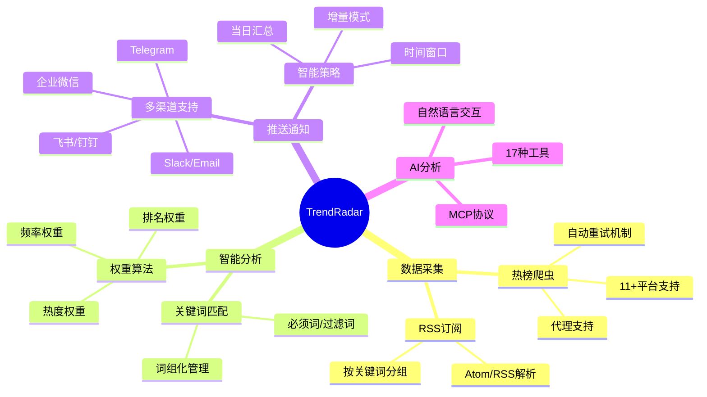

#### 2.2 核心创新点

| 创新点 | 描述 |
|--------|------|
| **统一存储抽象** | `StorageBackend` 抽象层支持本地 SQLite 和远程 S3，无缝切换 |
| **智能推送策略** | 三种模式（daily/current/incremental）+ 时间窗口控制 |
| **权重排序算法** | 基于排名、频率、热度的综合权重计算 |
| **MCP AI 分析** | 基于 Model Context Protocol 的 AI 分析能力，支持多客户端 |
| **多账号推送** | 所有渠道支持多账号配置，用 `;` 分隔 |

---

### 3. 系统架构图

#### 3.1 高层架构

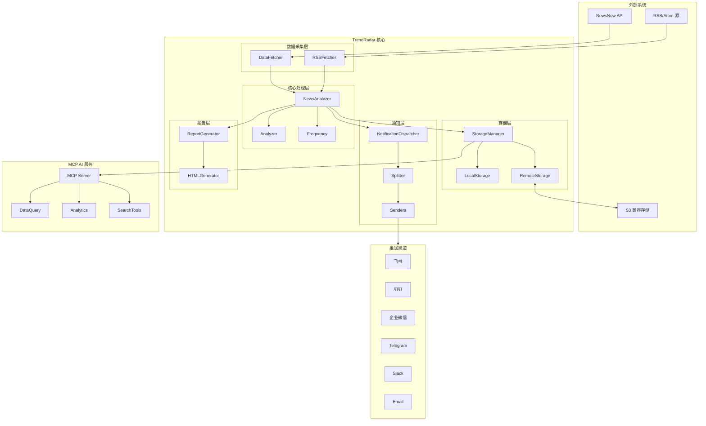

#### 3.2 模块结构

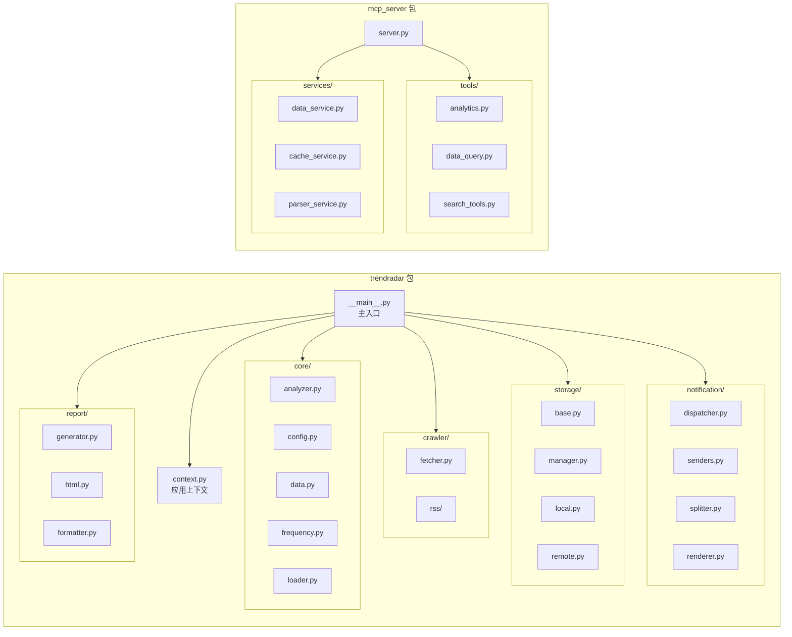

---

### 4. 组件架构

#### 4.1 核心组件职责

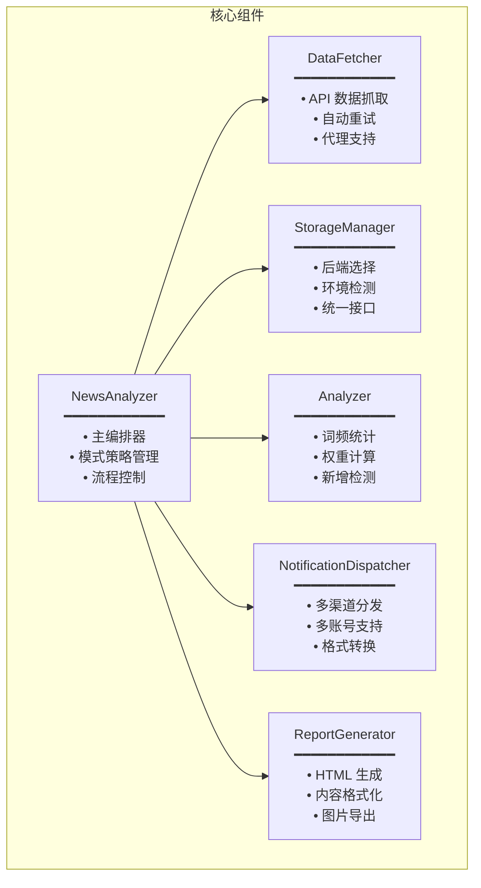

#### 4.2 组件交互

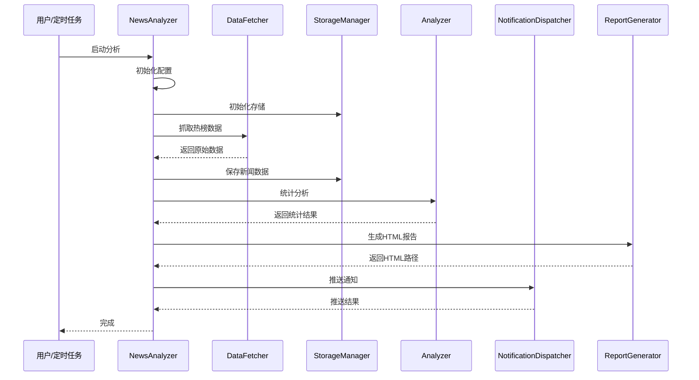

---

### 5. 类图

#### 5.1 数据模型

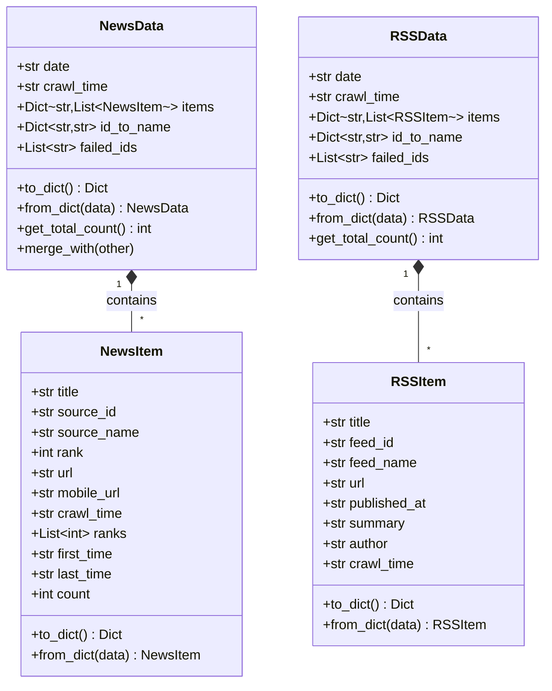

#### 5.2 存储架构

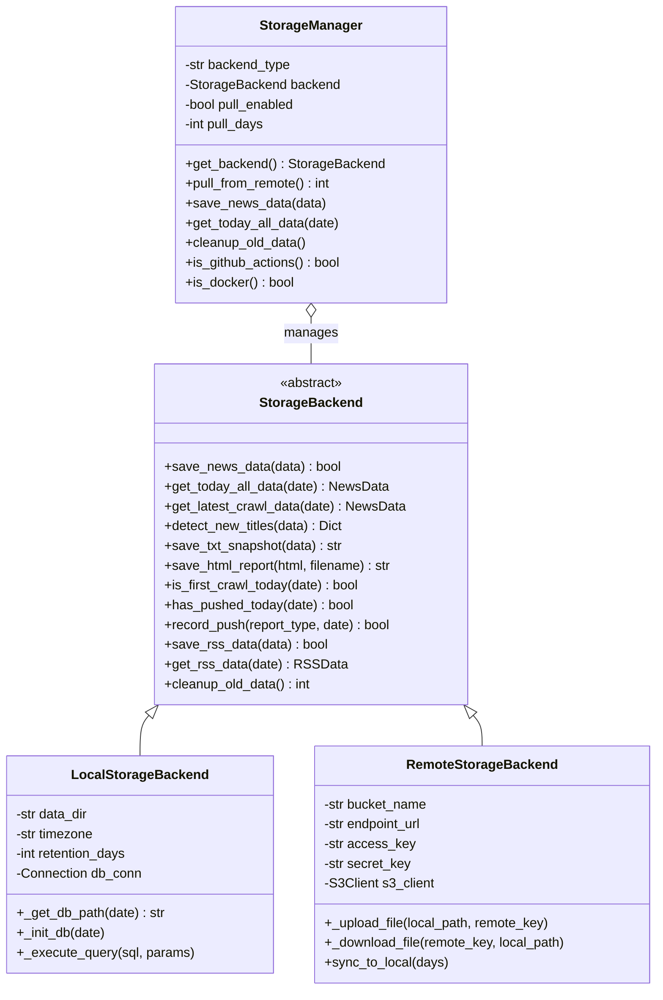

#### 5.3 通知系统

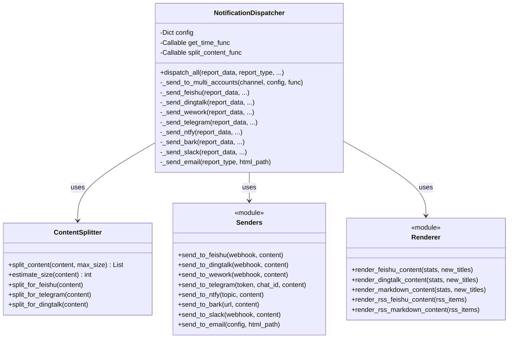

---

### 6. 时序图

#### 6.1 增量模式工作流程

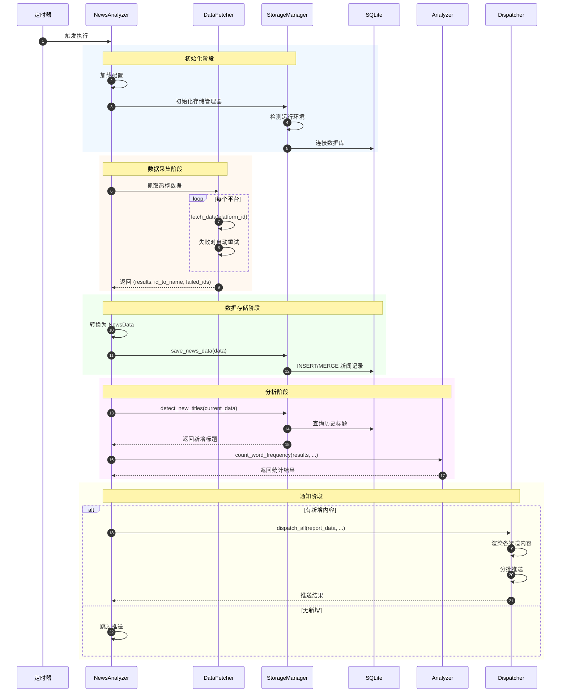

#### 6.2 MCP 查询流程

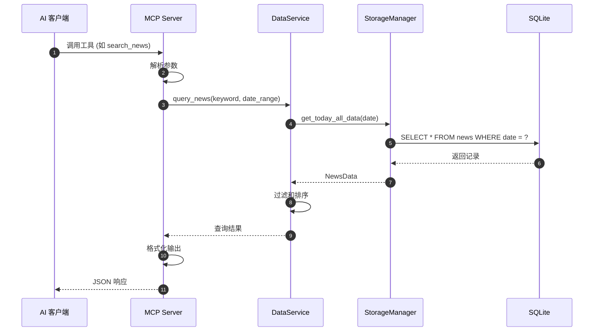

---

### 7. 数据流图

#### 7.1 数据处理流程

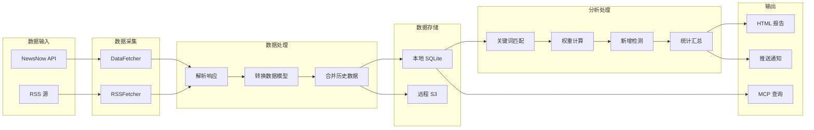

#### 7.2 权重计算公式

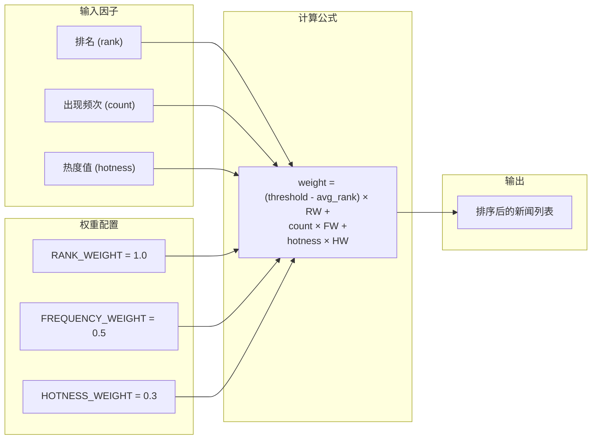

---

### 8. 部署架构

#### 8.1 部署模式

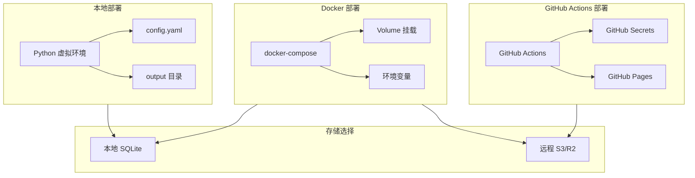

#### 8.2 Docker 架构

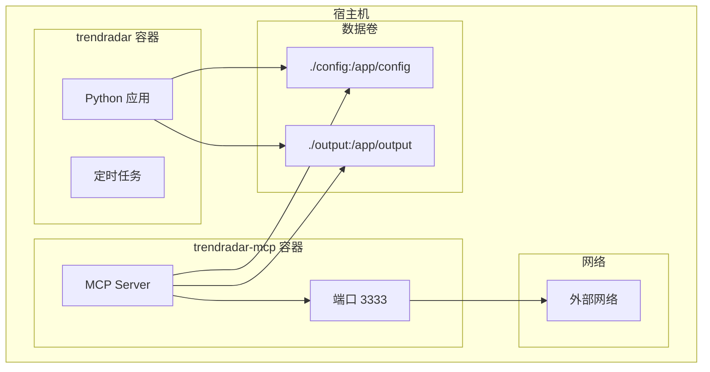

---

### 9. MCP 服务架构

#### 9.1 MCP 工具分类

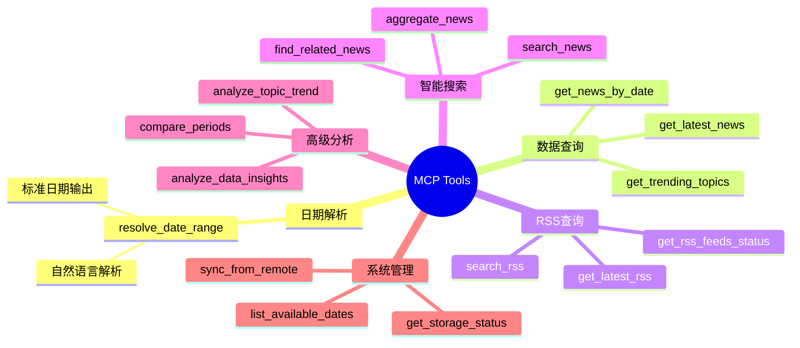

#### 9.2 MCP 服务架构

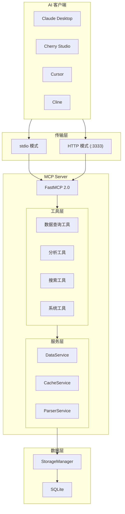

#### 9.3 工具调用示例

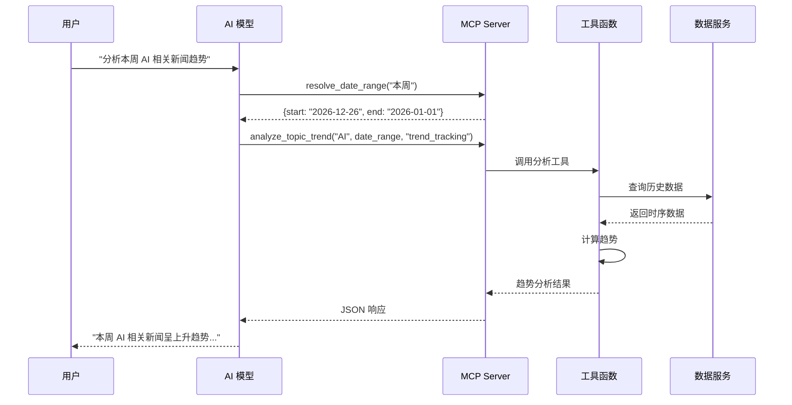

---

### 附录

#### A. 配置文件结构

```yaml
# config/config.yaml 结构概览
app:
  enable_crawler: true
  report_mode: "daily"  # daily/current/incremental
  timezone: "Asia/Shanghai"

report:
  max_news_per_keyword: 10
  display_mode: "keyword"  # keyword/platform

notification:
  feishu_webhook_url: ""
  telegram_bot_token: ""
  # ... 其他渠道配置

storage:
  backend_type: "auto"  # local/remote/auto
  local_retention_days: 30
  remote_config:
    endpoint_url: ""
    bucket_name: ""

platforms:
  - zhihu
  - weibo
  - douyin
  # ... 更多平台

rss:
  enabled: false
  feeds: []
```

#### B. 数据库 Schema

```sql
-- 热榜新闻表
CREATE TABLE IF NOT EXISTS news (
    id INTEGER PRIMARY KEY AUTOINCREMENT,
    source_id TEXT NOT NULL,
    title TEXT NOT NULL,
    url TEXT,
    mobile_url TEXT,
    ranks TEXT,  -- JSON 数组
    first_time TEXT,
    last_time TEXT,
    count INTEGER DEFAULT 1,
    crawl_time TEXT,
    UNIQUE(source_id, title)
);

-- RSS 条目表
CREATE TABLE IF NOT EXISTS rss_items (
    id INTEGER PRIMARY KEY AUTOINCREMENT,
    feed_id TEXT NOT NULL,
    title TEXT NOT NULL,
    url TEXT,
    published_at TEXT,
    summary TEXT,
    author TEXT,
    first_time TEXT,
    last_time TEXT,
    count INTEGER DEFAULT 1,
    crawl_time TEXT,
    UNIQUE(feed_id, title)
);

-- 推送记录表
CREATE TABLE IF NOT EXISTS push_records (
    id INTEGER PRIMARY KEY AUTOINCREMENT,
    report_type TEXT NOT NULL,
    push_time TEXT NOT NULL
);
```

---

*文档版本: v1.0.0 | 更新日期: 2026-01-01*

