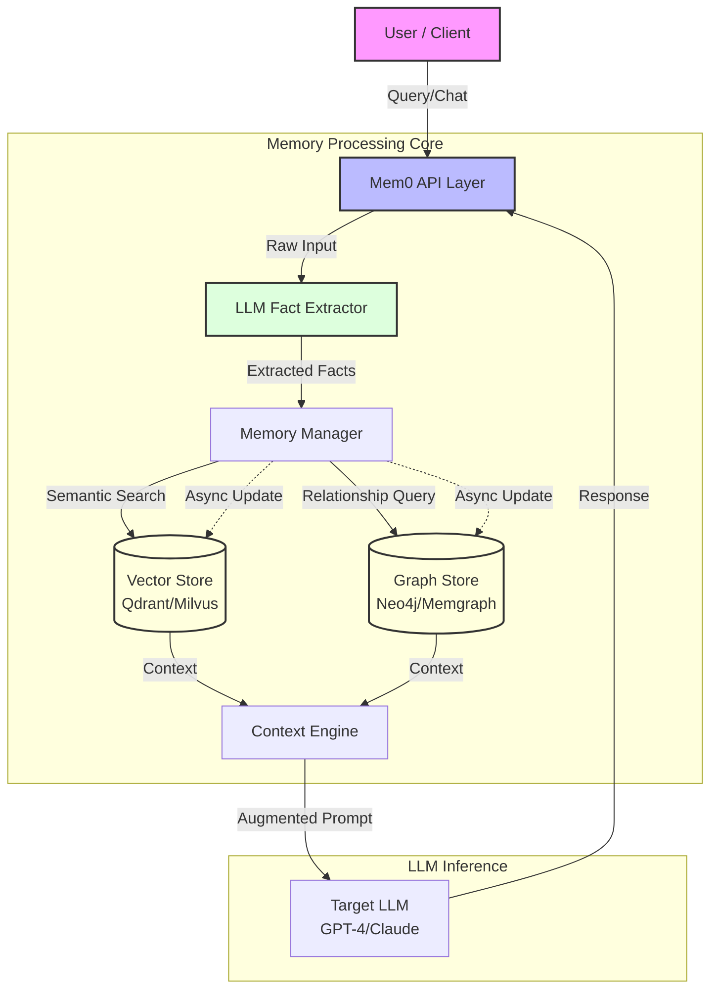
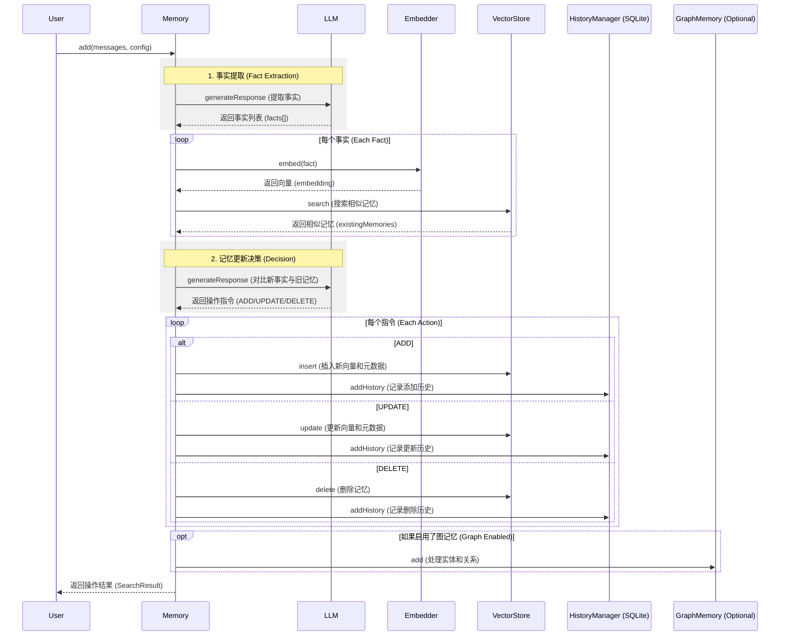
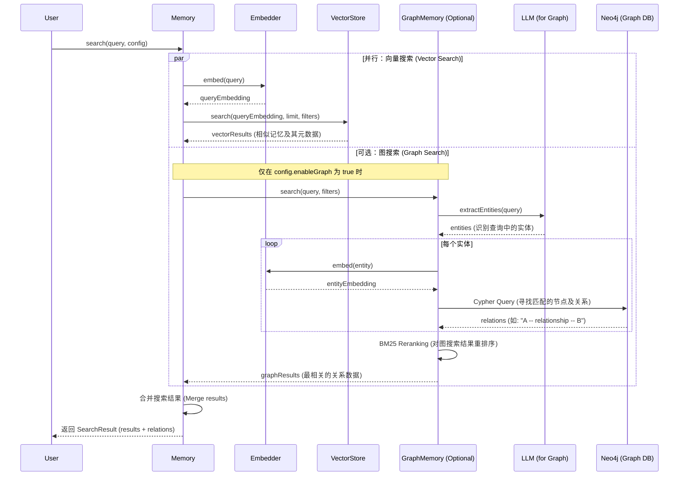

Mem0本质上是试图解决LLM**“无状态”**（Stateless）和**“上下文窗口限制”**这两个核心痛点的**中间件层**。

简单来说，Mem0 就是给 LLM 外挂了一个 **“智能海马体”**。它不仅仅是一个简单的 RAG（检索增强生成），而是一个动态的、自进化的记忆管理系统。

**亮点：**
*   基于 LOCOMO 基准，比 OpenAI Memory 提高 26% 的准确率；
*   响应速度快 91%，适合大规模低延迟场景；
*   减少 90% 的 Token 使用量，从而大幅降低成本。

Mem0 当前已发布 v1.0.0，新增 API 现代化设计、增强的向量存储支持及 GCP 集成。适用于生产环境，可快速通过 pip/npm 安装 SDK 或通过托管平台一键部署。项目采用 Apache 2.0 协议，支持 Python 和 TypeScript，以 AI 长期记忆为核心，是客户支持和个性化应用开发的理想工具。

## Mem0 的核心工作流：从 Input 到 Memory

Mem0 的工作流程可以抽象为四个关键步骤：**提取 (Extraction)** -> **存储 (Storage)** -> **检索 (Retrieval)** -> **更新 (Update)**。

### 1. 记忆提取与结构化 (LLM-Powered Extraction)
当你把用户的 Prompt 发给 Mem0 时，它并不是直接存入数据库，而是先过一遍 LLM（通常是一个轻量级或专门优化的模型）。
*   **动作**：LLM 会分析对话，提取出**“事实” (Facts)**、**“偏好” (Preferences)** 和 **“关系” (Relationships)**。
*   **去噪**：它会过滤掉“你好”、“今天天气不错”这种无效噪音，只保留高价值信息。例如，从“我最近在学Rust，太难了”中提取 `User_Interest: Rust`, `User_Sentiment: Difficult`。
*   **原子化**：将信息拆解为独立的原子记忆单元，方便后续的增删改查。

### 2. 混合存储架构 (Hybrid Storage: Vector + Graph)
这是 Mem0 最性感的地方。它不单单依赖向量数据库，而是采用了**混合架构**：
*   **向量存储 (Vector Store)**：
    *   **作用**：基于语义相似度进行模糊检索。
    *   **场景**：当你问“我上次说的那个难学的语言是啥？”时，向量搜索能快速定位到 `Rust` 相关的 Embedding。
    *   **底层**：通常对接 Qdrant, Milvus, 或者 Redis 等。
*   **图存储 (Graph Memory)（可选的）**：
    *   **作用**：存储实体之间的**关系**。
    *   **场景**：如果你说“鹏哥喜欢Rust”，图数据库会建立 `PengGe --(LIKES)--> Rust` 的边。这对于多跳推理（Multi-hop reasoning）至关重要。
    *   **优势**：解决了向量数据库难以处理的复杂逻辑关联问题。

### 3. 动态检索与上下文注入 (Context Injection)
在 LLM 生成回答之前，Mem0 会拦截请求：
*   **检索**：根据当前的 Query，同时在向量库和图库中检索相关记忆。
*   **重排序 (Reranking)**：对检索到的记忆片段进行评分，选出最相关的几条（Top-K）。
*   **注入**：将这些记忆片段作为 System Prompt 的一部分，塞进 LLM 的上下文窗口中。
    *   *原始 Prompt*：“推荐个项目。”
    *   *Mem0 处理后*：“（系统提示：用户是全栈工程师，喜欢Rust，关注AI Agent）推荐个项目。”

### 4. 记忆的自我进化 (Self-Improving Memory)
这是 Mem0 区别于普通 RAG 的关键。它具备**冲突解决**机制：
*   **状态更新**：如果用户说“我不学Rust了，改学Go了”。Mem0 不会简单地把两条矛盾信息并存，而是会识别出新的事实覆盖了旧的事实，从而**更新**或**标记失效**旧记忆。
*   **时效性管理**：它能理解时间维度的变化，保持记忆的“新鲜度”。

---

## 技术架构图解 (Mermaid)

架构图如下：

## Mem0-ts 核心工作流序列图

下面记录了 `mem0-ts` (开源版) 中保存记忆和搜索记忆的技术流程。

### 1. 保存记忆序列图 (Save Memory)
在 mem0 (开源版本) 中，保存记忆的核心逻辑主要集中在 Memory.add() 方法中。该流程涉及事实提取、冲突检测、记忆更新决策以及最终的持久化。

以下是保存记忆（add 操作且 infer=true 时）的序列图：

**流程核心步骤说明：**
* 1、事实提取 (Fact Extraction): 系统首先将输入的对话内容发送给 LLM，提取出原子化的“事实” (Facts)。
* 2、相似性检索: 对于每一个新提取的事实，系统会调用 Embedder 生成向量，并在VectorStore中检索最相关的旧记忆。
* 3、冲突与更新决策: 系统将“新事实”与检索到的“旧记忆”再次发送给 LLM。LLM 会判断：
    * 这是一个全新的信息吗？（执行 ADD）
    * 这是否更新/纠正了之前的记忆？（执行 UPDATE）
    * 这是否与旧记忆矛盾或使旧记忆失效？（执行 DELETE）
* 4、多层存储:
    * VectorStore: 存储向量和内容，用于语义搜索。
    * HistoryManager (SQLite): 记录记忆的所有版本变更历史（Audit Log）。
    * GraphMemory (可选): 维护实体之间的关系图谱。

---

### 2. 搜索记忆序列图 (Search Memory)
在 mem0 中，搜索记忆的过程结合了向量搜索（语义匹配）和可选的图搜索（关系提取）。

以下是完整的搜索逻辑序列图：

**搜索逻辑关键点：**

* 1、**双路查询**:
    * 向量搜索: 侧重于语义相似度。即使查询词和记忆词不完全一致，只要意思相近（如 "北京" 和 "首都"），就能被搜到。
    * 图搜索: 侧重于结构化关系。它会先从你的查询中提取出实体（Entities），然后在知识图谱（Neo4j）中寻找这些实体的相关关系。
* 2、**图搜索的增强**:
    * 实体识别: 使用 LLM 将自然语言查询转化为具体的实体名。
    * 混合排序: 获取图关系后，使用 BM25 算法根据原始查询对关系结果进行再次排序，确保返回的图关系与你的提问最契合。
    * 过滤器 (Filters): 无论是向量搜索还是图搜索，都会严格遵循 userId, agentId 或 runId 指令，确保数据的隔离性和私密性。

### 对比RAG

1.  **粒度控制**：普通 RAG 是基于 Chunk（文档切片）的，粒度太粗；Mem0 是基于 Fact（事实）的，粒度更细，更像人类的记忆方式。
2.  **用户级个性化**：它天生支持 `user_id` 隔离，非常适合做 ToC 的个性化助手。

---

### 🧠 脑洞时刻：基于 Mem0 的“数字多胞胎”对抗训练场

**建议项目：Project Mirror (镜像计划)**

**核心概念**：
利用 Mem0 构建一个**完全克隆你思维模式**的 Agent，然后用它来训练你自己（或者你的主 Agent）。

**具体玩法**：

*   **数据喂养**：
    * 把你过去所有的代码提交记录、技术博客、甚至聊天记录（脱敏后）全部灌入 Mem0。让 Mem0 形成一个包含你技术偏好（比如“喜欢由简入繁”、“讨厌过度封装”）的 **“个人知识图谱”**。
*   **构建“影子我” (Shadow Agent)**：
    * 创建一个 Agent，System Prompt 设定为：“你就是我，基于 Mem0 中的记忆库进行决策。”
    * 当你向它提问时，它会基于你**过去**的经验回答。
*   **RL 对抗进化**：
    * 引入一个**“挑战者 Agent” (Challenger)**，目标是找到“影子我”代码逻辑中的漏洞或思维定势。
    * **Reward Function**：如果 Challenger 成功让“影子我”承认错误或发现其代码的 Security Hole，Challenger 得分。
*   **闭环**：
    * 当 Challenger 发现你过去的思维漏洞时，不仅仅是 Challenger 变强了，你（真实的你）也能通过观察这场对抗，发现自己潜意识里的思维盲区。

## 参考
* 官网文档：https://docs.mem0.ai
* Github: https://github.com/mem0ai/mem0