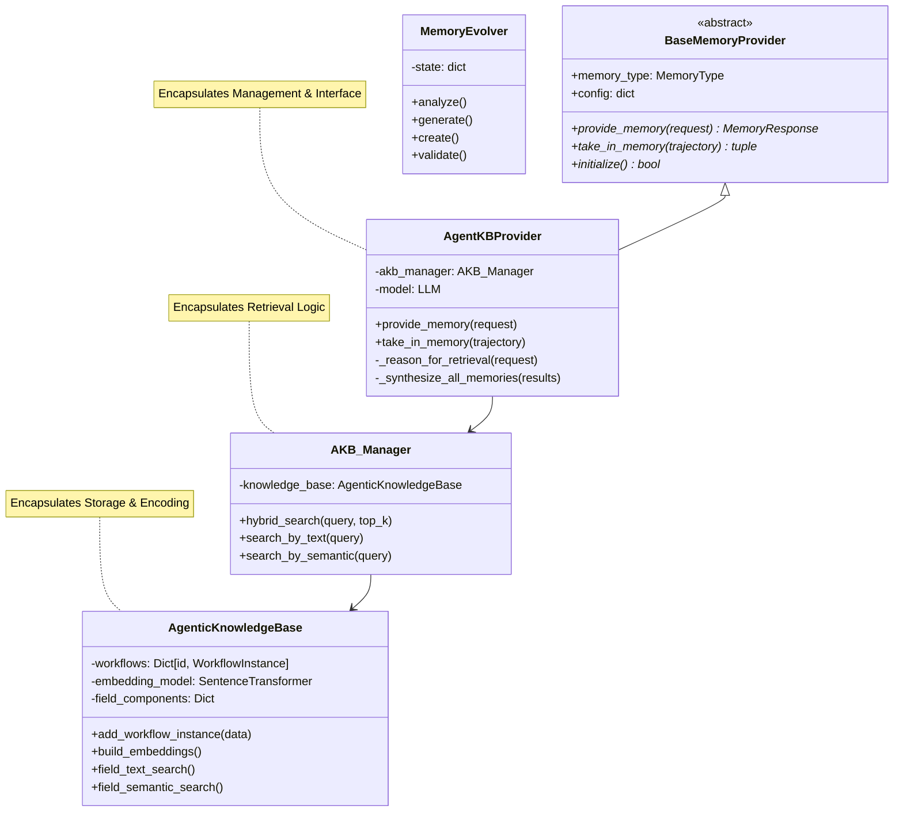
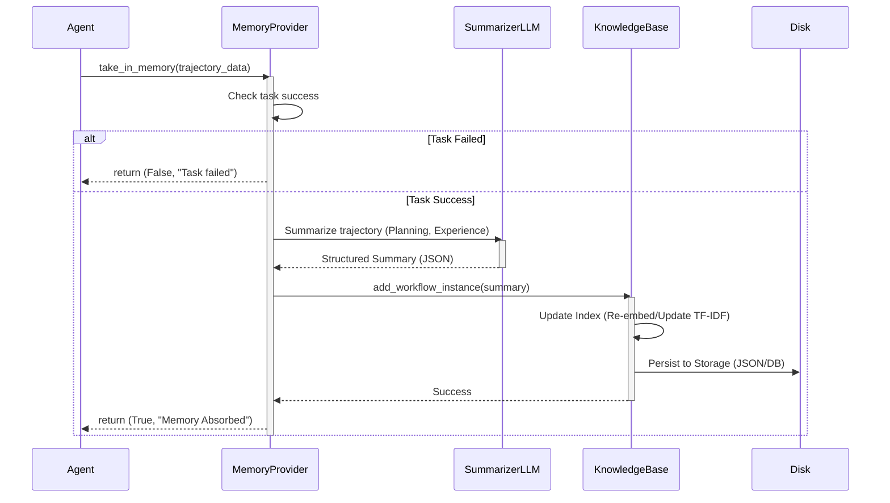
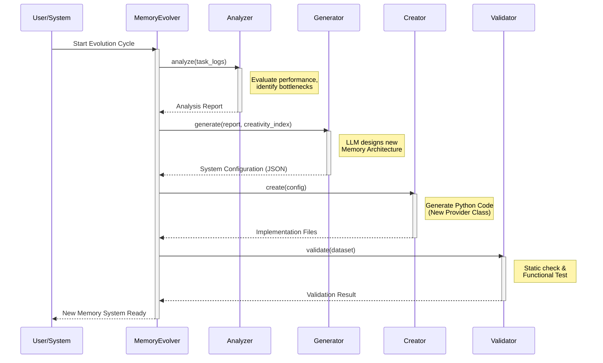

## 概述

MemEvolve是一个旨在实现大语言模型**智能体自我进化的元学习框架**。传统的智能体记忆系统往往采用固定架构，难以适应多变的任务需求，因此他们提出了**双层优化机制**：内环负责积累实践经验，外环则根据性能反馈动态重构记忆架构。
为了支撑这一过程，团队开发了 EvolveLab 代码库，将记忆系统解构为**编码、存储、检索和管理四个模块化组件**。实验证明，该框架能显著提升智能体在复杂任务中的成功率，并展现出卓越的跨模型与跨任务泛化能力。这种从“技能学习者”向“自适应学习者”的转变，为构建更具自主性的通用人工智能提供了新路径。

核心功能包括：  
1. **多种数据集评估支持**（GAIA、WebWalkerQA、xBench等）。  
2. **自动与手动元演化步骤**，支持记忆系统的分析、生成、创建、验证及比赛淘汰流程。  
3. 提供多个基线记忆系统（如Agent-KB、SkillWeaver、ExpeL等）和由MemEvolve生成的记忆系统（如Lightweight Memory、Cerebra Fusion Memory）。  
4. **参数化配置选项**，可调整任务数量、步数、创新性和多目标Pareto优化等。

项目包含详细的环境配置说明、依赖安装以及数据集准备指导，支持进一步的自定义和扩展。研究引用信息和许可证归属基于Apache-2.0。


## MemEvolve 系统架构文档

### 1. 系统概览

MemEvolve 是一个旨在实现大语言模型智能体（LLM Agent）自我进化的元学习框架。该系统致力于解决传统智能体记忆系统架构固定、难以适应动态任务需求的问题。

核心理念是通过**双层优化机制（Dual-level Optimization Mechanism）**实现能够自我进化的记忆体：
1.  **内环（Inner Loop）**：负责智能体在具体任务中的实践与经验积累（通过 EvolveLab 运行时环境实现）。
2.  **外环（Outer Loop）**：基于内环的表现反馈，动态重构和优化记忆系统的架构与策略（通过 MemEvolve 进化引擎实现）。

系统主体代码分为两个核心包：
*   **EvolveLab**：提供记忆系统的运行时底座，定义了标准化的记忆接口和模块化组件（编码、存储、检索、管理）。
*   **MemEvolve**：提供进化引擎，负责分析、生成、创建和验证新的记忆系统架构。

### 2. 组件架构 (Component Architecture)

系统整体采用层次化模块设计。EvolveLab 作为基础设施层，支撑具体的记忆实现；MemEvolve 作为元控制层，驱动 EvolveLab 中组件的迭代。

#### UML 组件图

```mermaid
componentDiagram
    package "MemEvolve (Meta-Learning Layer)" {
        [MemoryEvolver] as Evolver
        [PhaseAnalyzer] as Analyzer
        [PhaseGenerator] as Generator
        [MemorySystemCreator] as Creator
        [PhaseValidator] as Validator
    }

    package "EvolveLab (Runtime Layer)" {
        interface "BaseMemoryProvider" as IMemory
        
        component "Memory System Implementation" as MemImpl {
            [Encoding Module] as Encoding
            [Storage Module] as Storage
            [Retrieval Module] as Retrieval
            [Management Module] as Manager
        }
    }

    [LLM Agent] --> IMemory : Use
    Evolver ..> Analyzer : 1. Analyze Logs
    Evolver ..> Generator : 2. Generate Config
    Evolver ..> Creator : 3. Create System
    Evolver ..> Validator : 4. Validate
    
    Creator ..> MemImpl : Generates/Updates code
    Analyzer ..> [Task Logs] : Reads
    MemImpl ..> IMemory : Implements
```

#### 2.1 模块说明

##### 2.1.1 MemEvolve (进化引擎)
*   **MemoryEvolver**: 核心编排器，协调整个进化周期的四个阶段。
*   **PhaseAnalyzer**: 分析智能体的历史任务轨迹（Trajectory），识别当前记忆系统的瓶颈和改进点。
*   **PhaseGenerator**: 基于分析报告，利用 LLM 生成新的记忆系统配置方案（Configuration）。
*   **MemorySystemCreator**: 将生成的配置转化为实际的 Python 代码实现，即具体的 Memory Provider。
*   **PhaseValidator**: 对新生成的记忆系统进行静态检查和功能验证。

##### 2.2 EvolveLab (记忆运行时)
MemEvolve 生成的记忆系统通常遵循 "四模块" 架构：
*   **Encoding (编码)**: 将非结构化的文本（Query, Context）转化为机器可理解的向量或特征（如使用 SentenceTransformer, TF-IDF）。
*   **Storage (存储)**: 负责记忆条目的持久化。包括向量数据库、JSON 文件系统或内存索引（如 `AgenticKnowledgeBase` 及其持久化机制）。
*   **Retrieval (检索)**: 定义检索策略。支持语义搜索、关键词搜索、混合检索（Hybrid Search）以及重排序（Re-ranking）。
*   **Management (管理)**: 负责记忆的全生命周期管理，包括记忆的写入（Ingestion）、总结（Summarization/Synthesizing）、修剪（Pruning）和初始化（Initialization）。

### 3. 核心类设计 (Core Class Design)

以系统中的典型实现 `AgentKBProvider` 为例，展示类的继承与关联关系。

#### UML 类图



### 4. 关键流程 (Key Workflows)

#### 4.1 记忆存储与编码 (Inner Loop - Ingestion)
当智能体完成一个任务后，其轨迹（Trajectory）会被系统吸收并转化为经验记忆。



#### 4.2 记忆检索 (Inner Loop - Retrieval)
当智能体面临新任务时，请求相关记忆以辅助决策。

```mermaid
sequenceDiagram
    participant Agent
    participant Provider as MemoryProvider
    participant LLM as ReasonerLLM
    participant Manager as AKB_Manager
    participant KB as KnowledgeBase

    Agent->>Provider: provide_memory(request)
    activate Provider
    
    Provider->>LLM: Reason/Refine Query (Student Agent Reason)
    activate LLM
    LLM-->>Provider: Refined Query
    deactivate LLM
    
    Provider->>Manager: hybrid_search(refined_query)
    activate Manager
    parallel Search Execution
        Manager->>KB: field_text_search(BM25/TF-IDF)
        Manager->>KB: field_semantic_search(Vector)
    end
    KB-->>Manager: Raw Results
    Manager->>Manager: Weighted Fusion & Ranking
    Manager-->>Provider: Top-K Results
    deactivate Manager
    
    Provider->>LLM: Synthesize Memories (Student/Teacher Guidance)
    activate LLM
    LLM-->>Provider: Synthesized Guidance
    deactivate LLM
    
    Provider-->>Agent: MemoryResponse (Synthesized Content)
    deactivate Provider
```

#### 4.3 记忆架构进化 (Outer Loop - Evolution)
MemEvolve 引擎优化记忆系统的全过程。



### 5. 评价与展望

#### 5.1 架构优势 (Pros)
1.  **自适应性 (Adaptability)**：打破了静态记忆架构的限制，能够根据任务特性和历史表现动态调整记忆策略（如改变检索算法、调整存储结构）。
2.  **模块化解耦 (Modularity)**：EvolveLab 明确定义了编码、存储、检索、管理四个组件，使得每一部分的进化（如更换更强的 Embedding 模型或更高效的检索引擎）互不干扰且易于实现。
3.  **双层闭环 (Dual-loop)**：内环保证了经验的快速积累，外环保证了系统架构的长期优化，模拟了人类学习中"积累知识"与"优化学习方法"并行的过程。
4.  **高度泛化 (Generalization)**：`BaseMemoryProvider` 接口设计通用，能够兼容从简单的键值对存储到复杂的图数据库或生成式记忆等多种形态。

### 5.2 潜在劣势 (Cons)
1.  **高计算成本 (Computation Cost)**：
    *   **运行时**：每次记忆存取（Encoding/Synthesis）都高度依赖 LLM 调用，导致延迟较高。
    *   **进化时**：生成和验证新代码需要消耗大量 Token 和时间。
2.  **稳定性风险 (Stability Risk)**：由 LLM 生成的代码（Memory System Code）虽然经过验证，但仍可能包含边缘情况下的 Bug 或安全漏洞。
3.  **冷启动问题 (Cold Start)**：新生成的记忆系统通常需要重新构建索引或迁移旧数据，这在数据量大时可能成为瓶颈。

#### 5.3 改进空间 (Future Improvements)
1.  **热更新与无缝迁移**：开发支持"热插拔"的记忆模块更新机制，使新旧记忆系统切换时无需完全停机或重建全量索引。
2.  **轻量化检索路径**：在内环中引入分级检索机制，对于简单查询利用纯向量或缓存响应，减少对昂贵 LLM 总结（Synthesis）的依赖。
3.  **安全沙箱机制**：在外环生成的代码执行环境中引入更严格的沙箱，防止生成的代码执行危险操作，提高系统鲁棒性。
4.  **多模态支持**：扩展 Encoding 模块以更好地支持图像、音频等多模态数据的原生编码与存储，而非仅依赖文本摘要。


## 参考文献
* [MemEvolve: Meta-Evolution of Agent Memory Systems](https://arxiv.org/pdf/2512.18746)
* [MemEvolve Github](https://github.com/bingreeky/MemEvolve)
* [MemEvolve Paper](https://arxiv.org/pdf/2512.18746)
