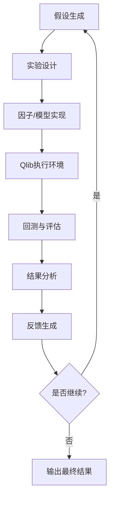

# TLDR

RD-Agent是一个数据驱动的AI研发自动化框架，其核心理念是将研发过程分解为两个关键组件：

- R (Research)：主动探索，提出新想法
- D (Development)：实现想法，将概念转化为可执行的代码
-

qlib

rdagent

# RD-Agent 工作原理与实现架构详解

基于对代码库的深入分析，我来为你详细解释RD-Agent的工作原理和实现架构。

## 🎯 核心设计理念

RD-Agent是一个**数据驱动的AI研发自动化框架**，其核心理念是将研发过程分解为两个关键组件：

- **R (Research)**: 主动探索，提出新想法
- **D (Development)**: 实现想法，将概念转化为可执行的代码

## ��️ 系统架构概览

### 1. 核心框架组件

#### **核心抽象层 (Core Layer)**

- **`Scenario`**: 定义具体应用场景（如量化交易、数据科学、Kaggle竞赛等）
- **`Experiment`**: 表示一个完整的实验，包含假设、任务序列和实现
- **`Hypothesis`**: 表示研究假设，包含想法、原因和观察
- **`Trace`**: 记录实验历史，支持DAG结构的实验追踪
- **`Feedback`**: 实验执行后的反馈信息

#### **进化框架 (Evolving Framework)**

- **`EvolvingStrategy`**: 定义如何基于历史经验进化
- **`RAGEvoAgent`**: 结合RAG（检索增强生成）的进化智能体
- **`EvolvingKnowledgeBase`**: 知识库，存储和检索历史经验

#### **工作流引擎 (Workflow Engine)**

- **`LoopBase`**: 异步工作流基础类，支持并行执行
- **`RDLoop`**: R&D循环的具体实现
- **`Developer`**: 开发者抽象，负责代码实现

## 🔄 R&D循环工作流程

### 主要步骤

1. **假设生成 (Hypothesis Generation)**

   ```python
   hypothesis = self.hypothesis_gen.gen(self.trace)
   ```

   - 基于历史实验记录生成新的研究假设
   - 分析当前问题和数据特征

2. **实验设计 (Experiment Generation)**

   ```python
   exp = self._exp_gen(hypo)
   ```

   - 将假设转化为具体的实验计划
   - 定义任务序列和实现策略

3. **代码实现 (Coding)**

   ```python
   exp = self.coder.develop(exp)
   ```

   - 将实验计划转化为可执行代码
   - 实现特征工程、模型训练等

4. **执行运行 (Running)**

   ```python
   exp = self.runner.develop(exp)
   ```

   - 在指定环境中执行代码
   - 收集执行结果和性能指标

5. **反馈生成 (Feedback)**

   ```python
   feedback = self.summarizer.generate_feedback(exp, self.trace)
   ```

   - 分析执行结果
   - 生成改进建议和新的假设

## �� 支持的应用场景

### 1. **量化交易 (Quantitative Finance)**

- **因子挖掘**: 自动发现和优化交易因子
- **模型开发**: 构建预测模型
- **报告解析**: 从金融报告中提取因子

### 2. **数据科学 (Data Science)**

- **Kaggle竞赛**: 自动化特征工程和模型调优
- **医疗预测**: 医学数据建模
- **通用建模**: 从论文中提取模型结构

### 3. **研究助手 (Research Copilot)**

- **论文阅读**: 自动解析研究论文
- **模型实现**: 将论文中的模型转化为代码
- **知识提取**: 从文档中提取关键信息

## �� 知识管理与学习机制

### RAG (检索增强生成) 策略

```python
class RAGStrategy:
    def query(self, evo, evolving_trace) -> QueriedKnowledge:
        # 基于当前状态和历史经验检索相关知识
    
    def generate_knowledge(self, evolving_trace) -> Knowledge:
        # 从实验历史中生成新知识
```

### 知识库类型

- **向量知识库**: 存储文档和代码的向量表示
- **图知识库**: 存储实体间的关系
- **实验知识库**: 存储历史实验结果

## 🔧 技术实现特点

### 1. **异步并行执行**

- 支持多个实验并行运行
- 使用`asyncio`实现高效的资源利用
- 支持子进程隔离执行

### 2. **状态管理与恢复**

- 支持实验状态的保存和恢复
- 使用`pickle`序列化工作流状态
- 支持断点续传

### 3. **模块化设计**

- 每个组件都是可插拔的
- 支持自定义场景和策略
- 高度可扩展的架构

### 4. **多环境支持**

- 支持Docker容器化执行
- 支持不同的Python环境
- 支持GPU和CPU计算

## �� 性能优势

根据README中的信息，RD-Agent在MLE-bench基准测试中表现优异：

- **R&D-Agent o1-preview**: 22.4% ± 1.1% 成功率
- **R&D-Agent o3(R)+GPT-4.1(D)**: 22.45% ± 2.45% 成功率
- 在量化交易场景中，以不到$10的成本实现了2倍的年化收益率提升

## 🎨 架构优势

1. **自动化程度高**: 从想法到实现的全流程自动化
2. **学习能力强**: 通过历史经验不断改进
3. **适应性强**: 支持多种应用场景
4. **可扩展性好**: 模块化设计便于扩展
5. **实用性强**: 在真实场景中验证有效

RD-Agent代表了AI研发自动化的前沿方向，通过将研究(Research)和开发(Development)有机结合，实现了从想法到产品的全流程自动化，为数据驱动的AI研发提供了强大的工具支持。

# RD-Agent与Qlib协同工作详解

基于对代码库的深入分析，我来详细解释RD-Agent如何与Qlib协同工作，包括完整的工作流程和交互接口。

## 整体架构设计

RD-Agent与Qlib的集成采用了**分层架构设计**，通过专门的Qlib场景模块实现深度集成：

```
RD-Agent Core Framework
    ↓
Qlib Scenario Layer (rdagent/scenarios/qlib/)
    ↓
Qlib Platform Integration
    ↓
Docker/Conda Execution Environment
    ↓
Qlib Backtesting & Evaluation
```

## 🔄 核心工作流程

### 1. **实验类型与分工**

RD-Agent在Qlib场景下支持两种主要实验类型：

#### **因子实验 (QlibFactorExperiment)**

- **目标**: 自动发现和优化量化交易因子
- **工作空间**: `QlibFBWorkspace` + `factor_template`
- **执行器**: `QlibFactorRunner`

#### **模型实验 (QlibModelExperiment)**  

- **目标**: 训练和优化预测模型
- **工作空间**: `QlibFBWorkspace` + `model_template`
- **执行器**: `QlibModelRunner`

### 2. **完整R&D循环流程**



## ��️ 关键交互接口

### 1. **工作空间接口 (QlibFBWorkspace)**

```python
class QlibFBWorkspace(FBWorkspace):
    def execute(self, qlib_config_name: str = "conf.yaml", run_env: dict = {}):
        # 选择执行环境 (Docker/Conda)
        if MODEL_COSTEER_SETTINGS.env_type == "docker":
            qtde = QTDockerEnv()
        elif MODEL_COSTEER_SETTINGS.env_type == "conda":
            qtde = QlibCondaEnv(conf=QlibCondaConf())
        
        # 执行Qlib回测
        execute_qlib_log = qtde.check_output(
            local_path=str(self.workspace_path),
            entry=f"qrun {qlib_config_name}",
            env=run_env,
        )
        
        # 读取实验结果
        execute_log = qtde.check_output(
            local_path=str(self.workspace_path),
            entry="python read_exp_res.py",
            env=run_env,
        )
```

### 2. **因子运行器接口 (QlibFactorRunner)**

```python
class QlibFactorRunner(CachedRunner[QlibFactorExperiment]):
    def develop(self, exp: QlibFactorExperiment) -> QlibFactorExperiment:
        # 1. 处理历史因子数据
        if exp.based_experiments:
            SOTA_factor = process_factor_data(sota_factor_experiments_list)
            new_factors = process_factor_data(exp)
            
            # 2. 因子去重和合并
            new_factors = self.deduplicate_new_factors(SOTA_factor, new_factors)
            combined_factors = pd.concat([SOTA_factor, new_factors], axis=1)
            
            # 3. 保存合并后的因子数据
            combined_factors.to_parquet("combined_factors_df.parquet")
        
        # 4. 执行Qlib实验
        result, stdout = exp.experiment_workspace.execute(
            qlib_config_name="conf_combined_factors.yaml"
        )
```

### 3. **模型运行器接口 (QlibModelRunner)**

```python
class QlibModelRunner(CachedRunner[QlibModelExperiment]):
    def develop(self, exp: QlibModelExperiment) -> QlibModelExperiment:
        # 1. 处理基础因子实验
        if exp.based_experiments and exp.based_experiments[-1].result is None:
            exp.based_experiments[-1] = self.develop(exp.based_experiments[-1])
        
        # 2. 合并SOTA因子
        if exp.based_experiments:
            SOTA_factor = process_factor_data(sota_factor_experiments_list)
            combined_factors = SOTA_factor
            combined_factors.to_parquet("combined_factors_df.parquet")
        
        # 3. 注入模型代码
        exp.experiment_workspace.inject_files(
            **{"model.py": exp.sub_workspace_list[0].file_dict["model.py"]}
        )
        
        # 4. 执行模型训练
        result, stdout = exp.experiment_workspace.execute(
            qlib_config_name="conf_combined_factors_sota_model.yaml",
            run_env=env_to_use
        )
```

## ⚙️ 执行环境配置

### 1. **Docker环境 (QTDockerEnv)**

```python
class QlibDockerConf(DockerConf):
    build_from_dockerfile: bool = True
    dockerfile_folder_path: Path = Path("scenarios/qlib/docker")
    image: str = "local_qlib:latest"
    mount_path: str = "/workspace/qlib_workspace/"
    default_entry: str = "qrun conf.yaml"
    extra_volumes: dict = {
        "~/.qlib/": {"bind": "/root/.qlib/", "mode": "rw"}
    }
    shm_size: str = "16g"
    enable_gpu: bool = True
```

### 2. **Conda环境 (QlibCondaEnv)**

```python
class QlibCondaConf(CondaConf):
    conda_env_name: str = "rdagent4qlib"
    default_entry: str = "qrun conf.yaml"
    enable_cache: bool = False

class QlibCondaEnv(LocalEnv[QlibCondaConf]):
    def prepare(self):
        # 自动创建conda环境并安装Qlib
        subprocess.check_call(f"conda create -y -n {self.conf.conda_env_name} python=3.10")
        subprocess.check_call(f"conda run -n {self.conf.conda_env_name} pip install git+https://github.com/microsoft/qlib.git")
```

## �� Qlib配置文件系统

### 1. **基础配置 (conf_baseline.yaml)**

```yaml
qlib_init:
    provider_uri: "~/.qlib/qlib_data/cn_data"
    region: cn

data_handler_config:
    start_time: 2008-01-01
    end_time: 2020-08-01
    instruments: csi300
    # 基础Alpha158因子

task:
    model:
        class: LGBModel
        module_path: qlib.contrib.model.gbdt
    dataset:
        class: DatasetH
        module_path: qlib.data.dataset
```

### 2. **合并因子配置 (conf_combined_factors.yaml)**

```yaml
data_handler_config:
    data_loader:
        class: NestedDataLoader
        kwargs:
            dataloader_l:
                - class: qlib.contrib.data.loader.Alpha158DL
                - class: qlib.data.dataset.loader.StaticDataLoader
                  kwargs:
                    config: "combined_factors_df.parquet"  # RD-Agent生成的因子
```

### 3. **SOTA模型配置 (conf_combined_factors_sota_model.yaml)**

```yaml
# 结合SOTA因子和SOTA模型的配置
# 支持PyTorch模型和传统ML模型
```

## 🔄 数据流转机制

### 1. **因子数据流**

```
RD-Agent生成因子代码 → 执行生成因子数据 → 保存为parquet → Qlib加载 → 回测评估
```

### 2. **模型数据流**

```
历史因子数据 → 模型训练 → 预测结果 → 组合构建 → 回测分析 → 性能指标
```

### 3. **结果反馈流**

```
Qlib回测结果 → read_exp_res.py解析 → 性能指标提取 → RD-Agent反馈生成 → 下一轮优化
```

## �� 关键特性

### 1. **因子去重机制**

```python
def deduplicate_new_factors(self, SOTA_feature, new_feature):
    # 计算信息系数(IC)相关性
    IC_max = concat_feature.groupby("datetime").parallel_apply(
        lambda x: self.calculate_information_coefficient(x, SOTA_feature.shape[1], new_feature.shape[1])
    ).mean()
    
    # 移除高相关性因子 (IC > 0.99)
    return new_feature.iloc[:, IC_max[IC_max < 0.99].index]
```

### 2. **增量学习支持**

- 支持基于历史实验结果的增量优化
- 自动合并SOTA因子和模型
- 保持实验历史的连续性

### 3. **多环境支持**

- Docker容器化执行（推荐）
- Conda环境执行
- 自动环境准备和依赖管理

### 4. **结果解析机制**

```python
# read_exp_res.py - 自动解析Qlib实验结果
experiments = R.list_experiments()
latest_recorder = R.get_recorder(recorder_id=recorder_id, experiment_name=experiment)
metrics = pd.Series(latest_recorder.list_metrics())
ret_data_frame = latest_recorder.load_object("portfolio_analysis/report_normal_1day.pkl")
```

## �� 使用示例

### 启动因子进化循环

```bash
rdagent fin_factor  # 启动因子自动进化
```

### 启动模型进化循环  

```bash
rdagent fin_model   # 启动模型自动进化
```

### 启动联合优化循环

```bash
rdagent fin_quant   # 启动因子+模型联合优化
```

## �� 核心优势

1. **无缝集成**: 通过专门的工作空间和运行器实现与Qlib的深度集成
2. **自动化流程**: 从因子生成到模型训练再到回测评估的全流程自动化
3. **增量优化**: 支持基于历史结果的持续改进
4. **环境隔离**: 通过Docker/Conda确保执行环境的一致性
5. **结果追踪**: 完整的实验历史和性能指标追踪

这种设计使得RD-Agent能够充分利用Qlib强大的量化投资平台能力，实现真正的端到端量化策略自动化研发。
