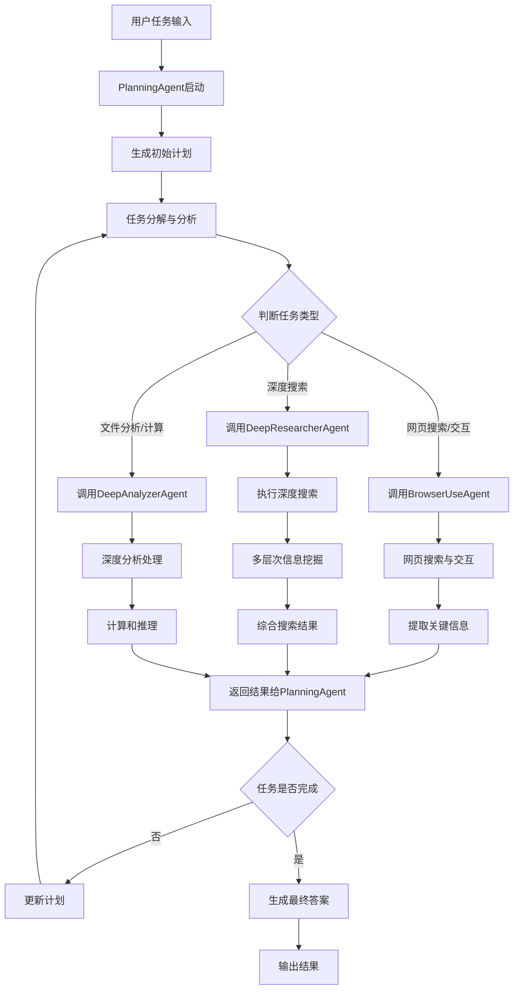

## 概述

DeepResearchAgent是SkyworkAI开发的一款基于DeepSeek大模型的智能研究助手，它能够通过多层次的搜索和分析能力，帮助用户完成复杂的深度研究任务及通用任务解决。其核心架构包括顶层规划智能体和多个专注的底层智能体：

1. **顶层规划智能体**：负责任务分解、规划及协调底层智能体协作。
2. **专注型底层智能体**：
   - **深度分析器**：进行信息深入分析，支持多种数据类型。
   - **深度研究员**：进行全面研究与信息汇总，支持自动生成研究报告。
   - **浏览器工具**：自动化网页操作，支持信息获取和数据收集。

**主要特点**：

- 分层协作，扩展性强。
- 自动化信息分析、研究及网络交互能力。
- 提供安全的 Python 沙盒环境。

项目地址：[SkyworkAI/DeepResearchAgent](https://github.com/SkyworkAI/DeepResearchAgent)

## 代码分析

[deepwiki分析](https://deepwiki.com/search/deepresearchagentplanagentmerm_6e9d1aa2-1fa5-4d39-bb5b-3c835a8c3ef8)
基于对DeepResearchAgent代码的深入分析，我将从实现层面详细阐述其planning机制、agent流转以及深层次信息挖掘的实现方式。

## Planning机制实现

DeepResearchAgent采用分层规划架构，其中**PlanningAgent**作为顶层控制器负责任务分解和调度。 [1](#0-0)

Planning的核心实现包括两个阶段：

1. **初始规划阶段**：系统会根据任务生成初始计划，使用预定义的提示模板引导规划过程
2. **动态更新阶段**：在执行过程中根据planning_interval参数定期更新计划

PlanningAgent通过YAML配置的提示模板进行任务规划，其中包含了详细的任务指令和团队成员调度策略。 [2](#0-1)

## Agent间流转机制

DeepResearchAgent采用**分层多智能体架构**，实现了灵活的agent流转机制： [3](#0-2)

### 1. 架构层次

- **顶层**：PlanningAgent（规划和调度）
- **执行层**：三个专门的子智能体
  - DeepAnalyzerAgent：深度分析
  - BrowserUseAgent：网页交互
  - DeepResearcherAgent：深度搜索

### 2. 流转实现机制

Agent间的流转通过**工具调用机制**实现，PlanningAgent通过`execute_tool_call`方法调度子智能体： [4](#0-3)

关键实现特点：

- 使用`managed_agents`参数管理子智能体
- 通过JSON格式的工具调用参数传递任务
- 子智能体执行完成后返回详细结果给PlanningAgent

## 深层次信息挖掘实现

### 1. 多层次搜索策略

系统配置了多个层次的深度挖掘参数： [5](#0-4)

### 2. 专门化Agent设计

每个子智能体都针对特定类型的深度挖掘任务进行了优化：

- **DeepResearcherAgent**：专门负责深度网络搜索 [6](#0-5)
- **BrowserUseAgent**：负责复杂网页交互和信息提取
- **DeepAnalyzerAgent**：执行深度分析和计算任务

### 3. 迭代探索机制

通过ReAct框架的Action-Observation循环实现深层次挖掘： [7](#0-6)

## 系统流程图

## Notes

DeepResearchAgent通过这种分层架构实现了高效的任务分解和执行，其核心优势在于：

1. **智能调度**：PlanningAgent能够根据任务特点智能选择合适的子智能体
2. **深度挖掘**：每个子智能体都专门优化了特定类型的深度信息获取能力
3. **动态适应**：通过planning_interval实现计划的动态调整
4. **状态管理**：通过state变量在不同agent间共享信息和中间结果

这种设计使得系统能够处理复杂的多步骤研究任务，实现真正的深层次信息挖掘和分析。
