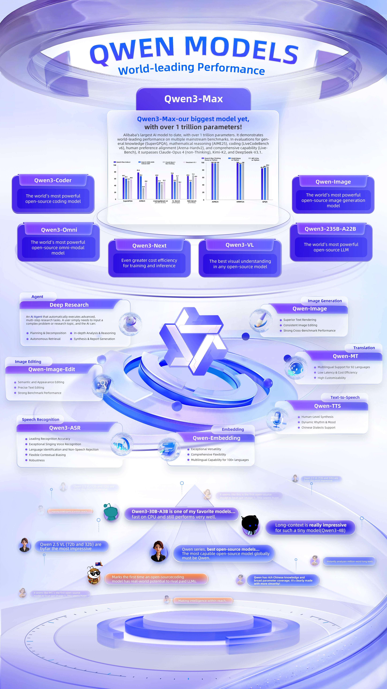

通义千问（Qwen）系列模型展现出全球领先的性能和全面的开源能力，为开发者和企业提供一站式解决方案——从大型语言模型到多模态应用应有尽有。

## 核心亮点

* **旗舰级算力**：拥有超过1万亿参数的Qwen3-Max，在常识、数学推理和编码等关键基准测试中超越了Claude-Opus 4等顶尖竞争对手。
* **开发者工具**：Qwen3-Coder是全球最强大的开源编码模型，专为高效开发而设计。
* **视觉创新**：Qwen-Image（生成）和Qwen-Image-Edit（编辑）具备行业领先的视觉创造力。Qwen3-VL在所有开源模型中拥有最佳的视觉理解能力，能精准解读图像、视频和多模态信息。
* **智能代理**：Qwen深度研究（Qwen Deep Research）能自主执行复杂研究任务的规划、检索、分析和报告生成工作。
* **全球通信**：通义千问3-MT支持92种语言的翻译；通义千问3-TTS可实现接近人类水平的语音合成，包括多种汉语方言。
* **聚焦效率**：通义千问3-Next在训练和推理方面具有极高的成本效益；通义千问3-ASR提供高精度的语音识别。
* **全模态融合**：通义千问3-Omni可处理文本、图像、音频和视频，并以文本和自然语音的形式提供实时流式响应。
从大型模型到紧凑型模型，从文本到图像和语音，通义千问为各种场景提供了全栈式的开源人工智能能力矩阵。

## 参考

* [One-Page Guide: Qwen Models Ecosystem and Use Cases](https://www.alibabacloud.com/blog/infographic-one-page-guide-qwen-models-ecosystem-and-use-cases_602637?spm=a2c65.11461433.0.0.57ed5355XLK8FA)
