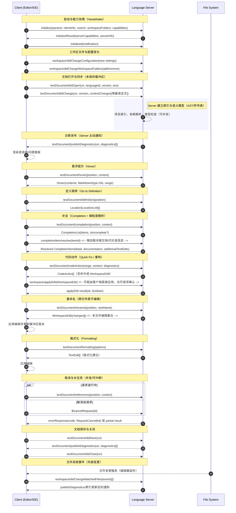

## 背景

你可以把LSP(Language Server Protocol)理解为“让编辑器和语言能力解耦的一套标准化协议”，编辑器是客户端，语言服务器是后端服务，JSON-RPC 是通信协议，文本缓冲是你的数据库状态快照，诊断/补全则是查询与写操作的结果。LSP 通过定义一个通用协议，使得任何编辑器（客户端）只需实现 LSP 协议，就能支持所有实现了 Language Server 的编程语言（服务器）。

而MCP的灵感也是来自LSP，MCP通过定义一个通用协议，使得任何大模型（客户端）只需支持 MCP 协议，就能支持所有实现了 MCP Server 的外部工具。解决了大模型和工具之间的M*N的问题，以至于一出现就火遍全网。
而在AI Coding Assistant的Context Engineering中，LSP 依然是关键的底层技术，用于为大模型提供（通过MCP接口）实现对代码的深度结构化理解，而Serena MCP就是一个典型的实现。具体内容可以参考我的另一个博客[每周一个MCP: Serena MCP](../projects/mcp/serena_mcp.md)

## 一、LSP 想解决的核心问题

- 历史痛点：每个编辑器都要分别为每种语言实现补全、跳转、诊断、重构等能力，维护成本爆炸。
- LSP 的解法：把“语言智能”独立成 Language Server（语言服务器），编辑器/IDE 只需要会跟它说话（遵守统一协议），就能获得同样的语言能力。

## 二、角色分工（两端架构）

- 客户端（Client）：你的编辑器或 IDE（VS Code、Neovim、IntelliJ 里的 LSP 客户端等）。
- 语言服务器（Server）：针对某门语言实现的服务进程（比如 typescript-language-server、pyright、gopls、rust-analyzer）。
- 通信协议：基于 JSON-RPC over stdio/pipe/socket。编辑器发请求，Server 回应；Server 也可主动发通知或请求（如发布诊断）。

## 三、启动与能力协商（握手阶段）

1) 启动进程：编辑器根据配置启动对应语言服务器进程。
2) initialize：客户端发送 initialize 请求，包含自己支持的功能、工作区信息等。
3) initialize result：Server 返回它支持的能力列表（capabilities），例如：
   - **文本补全** completion
   - **定义跳转** go to definition
   - **文档符号** documentSymbol
   - **诊断**（错误/警告）publishDiagnostics
   - **代码动作** codeAction / **重构** rename / **格式化** formatting 等
4) initialized：双方确认，进入工作状态。

## 四、文档同步（让 Server 知道你在编辑什么）

- 文本打开：textDocument/didOpen，发送文件 URI 和全文。
- 文本变更：textDocument/didChange，发送增量 diff 或全文，保持 server 和编辑器的视图一致。
- 文本关闭：textDocument/didClose，Server 可释放资源。
- 目的：Server 拥有最新的缓冲区内容（包括未保存的改动），才能做正确的分析与补全。

## 五、核心交互（高频请求与响应）

以下是常见的用户操作，LSP 下的消息流大致如此：

1) 补全（Completion）

- 触发：你输入点号或按下 Ctrl+Space。
- 客户端 -> Server：textDocument/completion（位置、上下文）。
- Server -> 客户端：返回候选列表（标签、类型、附加信息、snippet）。
- 可包含 resolve 补充信息：选中某项后再发 completionItem/resolve 获取更详细文档或代价较高的信息。

2) 悬浮提示（Hover）

- 触发：鼠标悬停或快捷键。
- 客户端 -> Server：textDocument/hover（光标位置）。
- Server -> 客户端：类型信息、注释、文档片段（Markdown）。

3) 跳转定义/引用（Definition/References）

- 客户端 -> Server：textDocument/definition 或 textDocument/references。
- Server -> 客户端：符号位置列表（文件 URI + 范围）。

4) 诊断（Diagnostics）

- 触发：Server 主动分析（通常在 didOpen/didChange/didSave 之后）。
- Server -> 客户端：textDocument/publishDiagnostics（错误/警告、范围、消息、代码）。
- 客户端负责把红线、波浪线画出来。

5) 代码动作（Code Action）与重构（Rename）

- Code Action：客户端请求当前选区的可用修复/重构；Server 返回操作（如“快速修复导入”“添加缺失的类型”）。
- Rename：客户端请求重命名一个符号；Server 计算多文件的编辑集合（WorkspaceEdit）返回给客户端应用。

6) 格式化（Formatting）

- 客户端 -> Server：textDocument/formatting。
- Server -> 客户端：返回文本编辑列表，客户端应用到缓冲区。

## 六、数据结构与传输细节（工程视角）

- 协议：JSON-RPC 2.0（请求/响应/通知），消息走 stdio 或 TCP/pipe。
- 文本位置：统一使用 UTF-16 code units 的行列位置（Position: line, character），有的实现提供扩展支持 UTF-8，需要协商。
- 文本编辑：TextEdit（范围 + 新文本）；批量更改用 WorkspaceEdit。
- 能力发现：通过服务器 capabilities 精确声明支持的功能与触发条件（如补全的触发字符）。

## 七、增量与性能

- 增量同步：didChange 支持发送增量差异，减少带宽。
- 懒加载信息：completionItem/resolve、hover 延迟补细节，避免每次都返回大 payload。
- 缓存与索引：Server 内部会做项目索引（AST、符号表），持续增量更新。
- 并发：客户端可发多个请求；Server 可按请求 ID 独立响应；某些长任务支持取消（$/cancelRequest）。

## 八、跨编辑器的复用是怎么达成的？

- 把“语言智能”做成独立进程 + 标准协议，任何实现了 LSP 的编辑器都能接入同一个语言服务器。
- 新语言上线成本：只需实现 Language Server；新编辑器上线成本：只需实现 LSP 客户端。
- 生态例子：rust-analyzer、gopls、pyright、typescript-language-server、lua-language-server、clangd 等能在 VS Code、Neovim、Sublime、Emacs 上通用。

## 九、与格式化器/构建系统/测试的协作

- 语言服务器常内置或调用外部工具（tsc、rustc、go list、ruff、eslint、prettier）。
- 通过 LSP 把这些结果结构化返回（诊断、修复建议、格式化 edits），统一呈现到编辑器里。

## 十、常见扩展与生态补充

- LSP Extensions：例如 Inlay Hints、Semantic Tokens（语义高亮）、Call Hierarchy、Type Hierarchy、Inline Completion、Notebook 支持等。
- 多工作区/多根目录（workspaceFolders）支持 monorepo。
- 文件系统事件（workspace/didChangeWatchedFiles）用于响应外部改动。

## 十二、时序图

一张覆盖典型交互的 LSP 时序图（包含初始化、文档同步、补全、诊断、悬浮、跳转、取消与错误处理等）。

图中展示了请求（实线箭头）与通知（虚线箭头）；JSON-RPC 的取消请求用 $/cancelRequest 表示。
你可以根据具体语言服务器扩展节点，例如 Inlay Hints、Semantic Tokens、Call Hierarchy、Inline Completion、Notebook Cells 等。

## 十三、LSP和MCP的关系

MCP 并非凭空出现，其架构和设计理念受到了 LSP 成功的模式和哲学的直接启发。LSP 证明了开放标准在解决技术碎片化方面的巨大价值。MCP 采用了与 LSP 相同的哲学，旨在将 AI 平台的工具集成问题从 **M（模型）乘以 N（工具）** 的模式，转变为 **M + N** 的模式。通过 MCP，任何 AI Agent（客户端）只需支持 MCP 协议，就能自动支持所有实现了 MCP Server 的外部工具。

MCP 的客户端-服务器架构是部分受到 LSP 启发的。LSP 定义了**编辑器（客户端）与 语言服务器（服务端）** 之间的通信。类似地，MCP 定义了 AI 应用程序/LLM（客户端，如 Claude Desktop 或 Claude Code）与 外部工具（服务端，即 MCP Server）之间的通信。两者都使用 JSON-RPC 2.0 作为底层消息标准进行通信。

尽管 MCP 从 LSP 中汲取了灵感，但两者服务于完全不同的目标，并存在以下关键区别：

| 特征             | Language Server Protocol (LSP)                                                | Model Context Protocol (MCP)                                  |
|------------------|-------------------------------------------------------------------------------|---------------------------------------------------------------|
| 解决的核心问题   | 解决 IDE/代码编辑器 对多种编程语言的集成问题（编辑器的碎片化）。              | 解决 LLM/AI Agent 对外部工具和数据源的集成问题（AI 生态的碎片化）。 |
| 关注点           | 语义代码理解（Go to Definition, Find All References, 代码格式化, 错误诊断）。    | 外部上下文和工具访问（Git 仓库、文件系统、数据库、Web 爬虫）。     |
| 客户端/用户      | 人类程序员（在 IDE/编辑器中操作）。                                           | AI Agent 或 LLM（通过工具调用 API 进行编排）。                  |
| 服务器功能       | 专注于对代码进行静态分析和语义理解。                                          | 专注于提供实时数据和外部系统操作能力。                         |

1. **语义理解与外部操作的区别**
LSP 致力于提供语义级理解。语言服务器能够理解变量、函数、类和依赖关系，其解析深度远超简单的文本匹配。例如，LSP 知道 `int foo = bar()` 中 `bar()` 是否返回一个 `int`。
而 MCP 关注的是如何将 LLM 的推理能力与外部的“手和脚”连接起来。MCP 使得 AI Agent 能够查询 MCP 服务器，以了解和使用可用的工具（例如 execute_sql 或 scrape_as_markdown），从而弥补了 LLM 缺乏实时数据和实际操作能力的不足。

2. **LSP 在 MCP 生态中的体现（Serena MCP Server）**
Serena MCP Server 正是这两个协议协同工作的典范：
    • Serena 的架构：Serena 的能力来源于 MCP 与 LSP 的智能整合。

    • LSP 作为底层能力：Serena 将 LSP 作为“大脑”，用于实现对代码库的语义级理解和分析。传统的 AI 编码工具（如基于 RAG 的方法）通常将代码视为文本，而 Serena 利用 LSP 实现了符号级的操作，例如 find_symbol 和 insert_after_symbol。

    • MCP 作为通信桥梁：MCP 则作为“桥梁”，允许 Claude Code 或其他 LLM 客户端通过标准协议（MCP）安全地请求上下文并调用这些基于 LSP 的精确工具。

简而言之，LSP 是一种技术，用于实现对代码的深度结构化理解；而 MCP 是一种协议，用于规范化 AI Agent 如何利用这种理解（以及其他外部工具）来执行任务。Serena MCP Server 通过融合 LSP，克服了AI Coding Assistant传统基于文件系统MCP或纯文本RAG在处理复杂代码库时效率低下和缺乏精确度的限制。
