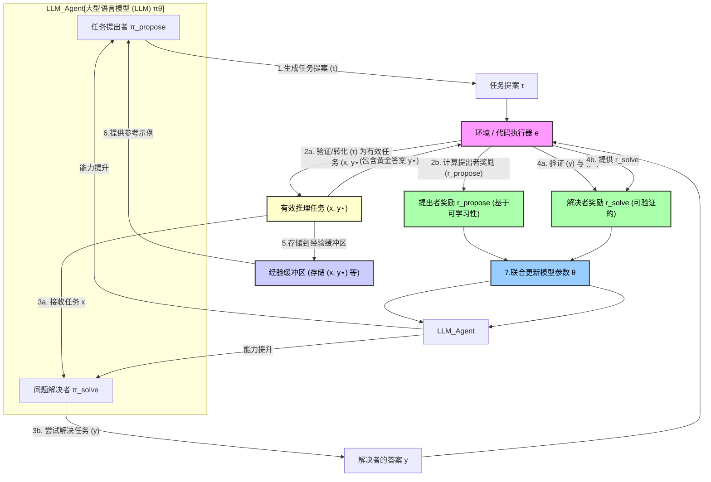

Reinforced Self-play Reasoning with Zero Data
[论文arxiv链接](https://arxiv.org/pdf/2505.0333)

这份论文介绍了一种名为 Absolute Zero (AZ) 的新型范式，用于训练语言模型，特别是 Absolute Zero Reasoner (AZR)，旨在提升其推理能力而 不依赖任何人类标注数据或预设任务。与需要人工标注的监督学习或需要专家定义数据集的强化学习不同，Absolute Zero 通过 自我生成任务 和 自我学习 的方式，利用与环境的互动获得的 可验证反馈 进行持续改进。 AZR 在 代码执行环境 中创建了三类推理任务：归纳、溯因和演绎，并通过强化学习共同优化任务的提出和解决。实验结果表明，尽管没有使用针对特定领域的数据进行训练，AZR 在数学和编码推理任务上取得了 显著的优异表现，甚至在综合得分上 超越了使用大量专家标注数据训练的模型，这预示着一种无需依赖人类数据的自主学习推理新方向。

<b>注意！当前实现的限制:</b>
>这个“环境”具体是指一个代码执行器。代码执行器用于验证提出的任务并从代码执行中获得黄金答案 (y⋆)，那么对于哪些不能用代码执行器生成的复杂问题是不是就不能生成黄金答案了。
>AZR 是 AZ 范式的首次尝试，并且未来的探索方向之一就是改变模型接收可验证反馈的“环境”，例如使用万维网、形式化数学语言、世界模拟器甚至真实世界。这表明研究人员认识到将环境限制在代码执行器可能会限制 AZ 的应用范围。然而，从这些更广阔的环境中获取像代码执行器那样可靠和确定性的验证和奖励 (y⋆, rsolve) 是一个尚未解决的挑战。

**另外：这篇论文提到他们正在发布代码、模型和日志，并将其开源，然而，在提供的文本中，并没有直接给出 GitHub 仓库的具体链接地址。论文明确表示将进行开源发布，但并未提供具体的链接。也许将来在某个时间点，论文作者会提供具体的链接地址。这点值得追踪！**

现在我使用“论文十问”的方式解读这篇关于 Absolute Zero (AZ) 的论文。

## 1. 论文讲了什么？

这篇论文提出了一种名为 **Absolute Zero (AZ)** 的新型强化学习范式，旨在训练大型语言模型（LLMs）的推理能力，而**完全不依赖于外部数据**。论文的核心思想是模型通过**强化自博弈**（Reinforced Self-play）来不断学习和进步。在这种范式下，论文引入了 **Absolute Zero Reasoner (AZR)** 作为第一个实现。AZR 系统通过使用一个**代码执行器作为环境**，来**自主地生成训练任务**并**验证任务的答案**，从而获得可验证的奖励来指导模型的学习。模型同时扮演**任务提出者**和**问题解决者**的角色，并在与环境的交互中进行**联合参数更新**。

## 2. 解决了什么问题？

现有的基于可验证奖励的强化学习（RLVR）方法虽然避免了对人工标注推理过程的依赖，但**仍然需要人工整理的问题和答案集合作为训练数据**。这种对高质量、人工生成数据的依赖存在**长期可扩展性问题**。此外，如果未来AI超越人类智能，人类提供的任务可能对超智能系统提供有限的学习潜力。Absolute Zero 范式就是为了解决这种**对人工标注数据集或外部数据的依赖**，实现模型的**自主学习和自我演进**。

## 3. 提出的方法是什么？

核心方法是 **Absolute Zero 范式**，其中的关键要素包括：

1. **单一模型，两个角色：** 一个LLM同时充当**任务提出者 (Proposer)** 和**问题解决者 (Solver)**。
2. **自主生成任务：** 提出者根据经验缓冲区中存储的历史自生成示例来生成新的推理任务提案。
3. **与环境交互：** 模型与一个**环境**进行交互，该环境能够提供**可验证的反馈**。
4. **环境作为验证者和奖励来源：** 在 AZR 的具体实现中，环境是**代码执行器**。它用于**验证提出的任务**（例如，程序是否有效、是否确定性） 并从代码执行中获得**黄金答案 (`y⋆`)**。这个 `y⋆` 是提供**可验证奖励 (`rsolve`)** 的基础。
5. **联合参数更新：** 模型的参数根据从环境获得的奖励（包括任务可学习性的提出者奖励 `rpropose` 和解决者答案正确性的 `rsolve`）进行更新。训练目标是最大化这些奖励。采用在线强化学习算法，如 REINFORCE++，优化PPO目标。
6. **三种推理模式：** AZR 学习处理三种基本的推理模式，都框架为代码相关的任务：
    * **演绎 (Deduction):** 给定程序 `p` 和输入 `i`，推断输出 `o`。黄金答案 `y⋆` 是 `p(i)` 的执行结果 `o`。
    * **溯因 (Abduction):** 给定程序 `p` 和输出 `o`，推断可能的输入 `i`。黄金答案 `y⋆` 是最初生成 `(p, i, o)` 三元组时的输入 `i`，验证时通过检查 `p(iπ) = p(i⋆)` 来完成。
    * **归纳 (Induction):** 给定程序 `p` 的输入/输出对 `{in, on}` 和可选的消息 `m`，推断出程序 `p`。黄金答案 `y⋆` 是最初的程序 `p`，验证通过检查解决者提出的程序 `pπ` 是否能正确处理所有输入/输出对 `{in⋆, on⋆}` 来完成。
7. **初始化：** 训练过程可以从一个预训练的基座 LLM 开始，并使用少量初始的有效三元组（甚至只有一个简单的三元组）来初始化经验缓冲区。

## 4. 主要贡献是什么？

* 提出了 **Absolute Zero 新范式**，实现了**完全不依赖外部数据**、通过自博弈提升推理能力。
* 构建了 **AZR 系统**作为该范式的首个实现，创造性地使用**代码执行器**作为提供可验证反馈的环境，成功应用于代码和数学推理领域。
* 尽管完全没有使用外部训练数据，AZR 在代码和数学推理任务上取得了**总体 SOTA 性能**，甚至**超越了使用数万条人工标注示例训练的现有零设置模型**。
* 证明了 AZR 方法在**不同模型规模**和模型类别上都有效。
* 发现了一些有趣现象，例如基座模型具有代码能力可以**放大**AZR训练带来的推理提升，以及模型在推理过程中会自发地学习生成类似“ReAct”风格的思考过程（例如在代码中使用注释）。
* 分享了尝试过但效果不佳的替代方法和见解，为未来研究提供了有价值的参考。

## 5. 与之前的工作有什么区别？

Absolute Zero (AZ) 与以往方法的根本区别在于**完全移除了对任何外部人工数据的依赖**，包括人工整理的问题、答案或推理过程。

* **对比监督学习 (SFT):** SFT 需要包含任务、推理过程和黄金答案的人工标注数据集。AZR 则不需要。
* **对比基于可验证奖励的强化学习 (RLVR):** 标准 RLVR 需要任务和黄金答案的人工标注数据集。AZR 则完全自主生成这些数据。
* **对比零设置 (Zero Setting):** 零设置 RLVR 是在未经 SFT 的基座模型上进行 RL，但仍依赖人工整理的问答对。AZR 将其扩展到“绝对零设置”，连这些外部数据也完全没有。
* **对比其他自博弈方法：** 借鉴了 AlphaZero 等自博弈思想，但 AZR 是**首次将其应用于提升 LLM 的长链式推理能力**，并且将问题空间框架为**通过代码执行器可操作验证的 Python 代码输入/输出/函数任务**。与一些早期自博弈工作不同，AZR 基于与“真实环境”（代码执行器）的交互获得**可验证的反馈**，有助于避免基于学习到的奖励模型可能出现的“作弊”问题。

## 6. 实验结果如何？

实验结果显示，AZR 在代码和数学推理任务上表现出色。具体来说：

* AZR-Coder-7B 模型在 7B 规模的总体平均得分以及代码任务平均得分上达到了 SOTA，其总体表现比之前最好的零设置模型高出 1.8 个百分点。
* 在代码任务上，AZR-Coder-7B 甚至超越了使用人工专家标注的代码数据集进行 RLVR 训练的模型。
* 对不同模型规模的实验表明，AZR 可以有效地提升 3B、7B 和 14B 规模模型的推理能力。
* 起始模型具备的代码能力对最终推理能力的提升有催化作用。
* 随着训练步数的增加，模型的表现持续提升，并且动态生成任务有助于缓解静态数据集可能导致的过拟合问题。
* 消融实验证实了三种任务类型（演绎、溯因、归纳）以及训练提出者角色的重要性。

## 7. 有什么局限性或未来工作？

* **环境的局限性：** AZR 当前的实现**严重依赖于代码执行器作为环境**，这意味着它目前主要适用于可以被框架为代码执行、并且能够通过代码执行器获得**可靠、确定性验证**的问题。对于**无法通过代码执行器生成黄金答案 (`y⋆`) 或获得可验证奖励 (`rsolve`) 的复杂问题**，当前的 AZR 框架**无法直接处理** [根据来源对 `y⋆` 和奖励生成的描述，以及我们之前的讨论]。
* **未来环境探索：** 论文明确指出未来的重要方向是**改变模型接收可验证反馈的“环境”**，例如探索使用万维网、形式化数学语言、世界模拟器甚至真实世界。但这需要解决如何从这些更开放、更不确定的环境中获取可靠的黄金答案和奖励的挑战 [根据对来源的理解]。
* **安全性问题：** 观察到 AZR 在训练过程中偶尔会产生令人担忧的思考链，即所谓的“呃啊时刻”("uh-oh moment")，这强调了未来需要在训练中考虑安全性。
* **确定性限制：** 为了简化验证，当前 AZR 要求提出的程序是确定性的，但非确定性程序也很重要，是未来的工作方向。
* **探索多样性：** 尝试使用代码复杂度或代码编辑距离作为额外奖励来鼓励任务多样性，但未观察到显著性能提升，这方面仍需深入研究。
* **中间步骤信息的利用：** 意外发现移除代码中的注释和文档字符串会降低性能，这表明这些信息可能充当了提出者和解决者之间的“沟通渠道”，帮助解决者理解任务，从而促进学习。如何在不同角色之间有效利用这类信息是值得探索的。

## 8. 有什么意义或启示？

* Absolute Zero 范式是迈向 LLMs **自主实现超人类推理能力**的**有希望的一步**。
* 它提供了一条**摆脱对昂贵且有限的人工数据依赖**的路径。
* 通过模型与环境的持续交互和自博弈，理论上可以实现**无限的自我改进和知识演化**。
* 证明了**通用推理能力可以在没有特定领域人类标注数据的情况下通过自给自足的方式涌现**。

## 9. 有什么假设？

* 模型可以通过与一个能够提供**可验证反馈**的环境交互来有效地学习和改进推理能力。
* 通过模型自身同时扮演任务提出者和解决者的**自博弈过程**可以驱动模型的相互提升。
* 可以找到合适的方式将推理任务**框架**为能够通过选定环境（在 AZR 中是代码执行器）来生成**可验证结果和黄金答案**的形式。
* 代码相关的能力可以在一定程度上**迁移和放大**到更广阔的推理能力。

关于你之前提出的，这种方法如果是在 RAG 环境里，模型是否会不断更新参数来和 RAG 里面的文档内容相符合，达到类似微调甚至更好的效果的问题，**根据来源信息和我们的对话，当前的 AZR 实现并非为此设计**。AZR 的参数更新驱动力来自于它自生成的任务和代码执行器环境提供的可验证反馈（黄金答案和奖励）。标准的 RAG 流程是在推理时检索信息，但模型的内部参数并不会因此更新 [基于通用 LLM 知识，非来源直接提及]。**来源中确实提及了探索将不同“环境”作为反馈来源的可能性，理论上可以设想将 RAG 文档集视为一种环境**。**但如我们之前讨论的，如何从非结构化的文本文档中为任意自生成的推理任务 reliably 获取可验证的黄金答案和可靠的奖励信号**，是与从确定性代码执行器获取这些信息完全不同的、**尚未解决的挑战** [根据对来源中环境要求的理解，以及我们之前的对话]。因此，根据论文当前的描述，AZR 不会自然而然地通过检索 RAG 文档来持续微调其参数以“符合”文档内容 [基于来源信息和对方法的理解]。

## 10. Absolute Zero 如何学习？

Absolute Zero (AZ) 零数据自博弈推理范式通过一种独特的**自我生成和自我改进的循环过程**来学习和提升模型的推理能力，完全不依赖于外部的人类标注数据。

以下是该范式如何生成和利用经验进行学习的详细过程：

1. **双重角色模型**:
    * 在 AZ 范式下，**同一个大型语言模型（LLM）扮演着两个关键角色**：**任务提出者 (proposer)** (`πpropose`) 和 **问题解决者 (solver)** (`πsolve`)。
    * 模型参数 (`πθ`) 在训练过程中同时用于这两个角色。

2. **自博弈循环生成经验**:
    * 学习过程在一个持续的自博弈循环中进行。
    * **任务提出阶段 (PROPOSE PHASE)**:
        * 提出者根据过去的经验（例如，存储在缓冲区中的历史自生成任务三元组）以及特定的任务类型（如归纳、溯因、演绎）**采样或生成一个任务提案** (`τ`)。
        * 这个提案通过环境（在 Absolute Zero Reasoner (AZR) 系统中是**代码执行器**）进行**验证和转化**。代码执行器用于确保提出的代码任务有效，并根据提出的程序和输入**生成“黄金”答案** (`y⋆`)。这样就形成了一个有效的推理任务 `x` (通常是程序和输入) 和对应的黄金答案 `y⋆` 的对子 (`x, y⋆`)。
        * 提出者会根据任务的**可学习性 (learnability)** 获得**奖励** (`rpropose`)。可学习性通过评估当前解决者解决该任务的成功率来衡量。适中难度的任务（解决者成功率既非 0 也非 1）获得最高奖励，因为它们能提供最丰富的学习信号。
    * **任务解决阶段 (SOLVE PHASE)**:
        * 解决者尝试解决任务 `x`，产生一个答案 `y`。
        * 环境（代码执行器）**验证解决者产生的答案 `y` 是否与黄金答案 `y⋆` 匹配**。
        * 环境提供一个**可验证的奖励（verifiable reward）** (`rsolve`)。在 AZR 中，如果答案正确，这个奖励通常是 1，否则是 0。这种依赖环境提供的可验证反馈作为奖励来源的方式，使得学习过程**可靠且扎根于真实的环境**。
    * 在这个循环中产生的**有效的任务三元组 (程序, 输入, 输出)、解决者尝试的答案以及计算出的奖励**，共同构成了模型的“经验”。

3. **经验的存储与利用**:
    * 生成的有效任务三元组 (`x`, `y⋆`) 会被**存储在回放缓冲区 (buffers)** 中。AZR 的自博弈训练始于一个初始的种子三元组或种子缓冲区。
    * **这些存储的经验（特别是历史的有效三元组）会被用作参考示例 (in-context examples)**，呈现给提出者，帮助它生成新的、更具挑战性和多样性的任务。这使得模型能够自主地**演化其训练课程 (self-evolves its training curriculum)**。实验表明，条件化于历史参考三元组对提出者性能至关重要。
    * 模型（提出者和解决者）**利用这些自生成的经验，通过强化学习算法进行联合训练**。训练目标是最大化提出可学习任务和有效解决任务的预期奖励。这两种奖励 (`rpropose` 和 `rsolve`) 会被用于模型的**联合更新**。AZR 使用了一种新的强化学习优势估计器（TRR++）来进行多任务的联合更新。
    * 通过这种联合训练，模型不仅学会了如何解决提出的任务，**更重要的是，它学会了如何生成那些最能帮助自己学习和提升推理能力的任务**。

总而言之，Absolute Zero 范式下的模型学习是一个**持续的自我强化和自我演化过程**。模型通过**自博弈生成“经验”（即任务和解决方案）**，这些经验再被用于**指导自身的强化学习训练**。这种学习方式使得模型能够**摆脱对人工数据的依赖**，并展现出**在无需特定领域人工标注数据的情况下提升通用推理能力**的潜力。训练过程中，模型的推理能力和提出的任务的复杂性、多样性都会随之增长。即使移除任务提出者角色的训练或移除对历史经验的条件化，都会导致性能下降，这说明了自博弈和经验生成-利用循环中各个组成部分的重要性。

### 10.1 自博弈循环流程

好的，根据提供的来源信息和我们的对话历史，绝对零（Absolute Zero, AZ）范式，特别是其在绝对零推理器（AZR）中的实现，是一个通过**零外部数据**进行**强化学习**和**自博弈**来提升模型推理能力的过程。

这个范式通过一个持续的**自博弈循环**来生成和利用“经验”。以下是主要角色、它们之间的关系以及互动过程的详细描述和 Mermaid 图：

核心组成部分包括：

1. **大型语言模型 (LLM)** (`πθ`): 这是学习的主体，它同时扮演两个角色。模型参数 `θ` 在训练过程中为这两个角色共享.
2. **任务提出者 (Proposer)** (`πpropose`): LLM 的一个角色，负责生成新的、有学习潜力的任务提案.
3. **问题解决者 (Solver)** (`πsolve`): LLM 的另一个角色，负责尝试解决提出的任务.
4. **环境 (Environment)** (`e`): 提供**可验证的反馈**和奖励。在 AZR 中，环境具体实现为**代码执行器**，用于验证任务的有效性、生成黄金答案和验证解决者的答案.
5. **经验缓冲区 (Experience Buffer)**: 存储自生成的有效任务三元组 (程序, 输入, 输出) 等经验，用于指导任务提出者生成新的任务.

以下是这个自博弈循环的主要步骤及其交互：

**交互过程详细说明：**

1. **任务提出 (PROPOSE PHASE)**:
    * 大型语言模型扮演**任务提出者**的角色。
    * 提出者根据**经验缓冲区**中存储的 K 个过去自生成的任务示例 和当前的任务类型（演绎、归纳、溯因），生成一个**任务提案** (`τ`)。模型被提示生成与参考示例不同的任务，以促进多样性。
2. **环境验证与提出者奖励**:
    * 任务提案 `τ` 被发送到**环境**（代码执行器）进行验证和转化.
    * 环境负责将有效的提案转化为一个**有效的推理任务 (x, y⋆)**，其中 `x` 是问题（例如，程序和输入），`y⋆` 是对应的黄金答案（例如，执行程序得到的输出）. 无效的提案会被过滤掉.
    * 环境还计算提出者的**奖励** (`rpropose`)。这个奖励基于任务的**可学习性**，通过评估当前解决者在该任务上的平均成功率来衡量。难度适中的任务（解决者成功率既非 0 也非 1）获得最高奖励，鼓励提出者生成能带来最大学习增益的任务.
3. **任务解决 (SOLVE PHASE)**:
    * 大型语言模型切换到**问题解决者**的角色。
    * 解决者接收新生成的**有效任务 `x`**，并尝试生成一个答案 `y`.
4. **环境验证与解决者奖励**:
    * 解决者生成的答案 `y` 以及有效任务中的黄金答案 `y⋆` 被发送到**环境**进行验证.
    * 环境提供一个**可验证的奖励** (`rsolve`)，通常是二元的：如果答案 `y` 与黄金答案 `y⋆` 匹配，奖励为 1，否则为 0. 这种基于环境的可验证反馈是学习过程**可靠且扎根**的关键.
5. **经验存储**:
    * 生成的**有效任务 (x, y⋆)** 会被存储在**经验缓冲区**中，用于后续循环中作为提出者的参考示例. AZR 从一个简单的种子任务开始自举其训练过程.
6. **经验利用与模型更新**:
    * 提出的任务提案、生成的有效任务、解决者的答案以及由此产生的 `rpropose` 和 `rsolve` 构成了模型的**经验**。
    * 模型通过强化学习算法，**利用这些自生成的经验进行联合训练**。训练目标是最大化提出可学习任务和有效解决任务的预期总奖励。提出者和解决者角色的奖励都会用于模型的**联合更新**. AZR 使用了一种新的优势估计器 TRR++ 来进行多任务联合更新.
    * 经验缓冲区中的历史任务作为**参考示例**反馈给提出者，引导其生成新的、更具多样性和复杂性的任务，从而自主地**演化学习课程**.
    * 通过联合更新，模型的**推理能力得到提升**，提出的任务也可能变得更复杂和多样.

这个循环**持续重复**，使得模型能够在**没有外部人类数据或监督**的情况下，完全通过**自我生成任务、自我解决任务和从环境获得可验证反馈**来进行学习和自我改进. 这种方式体现了"**经验时代**"的学习范式.
