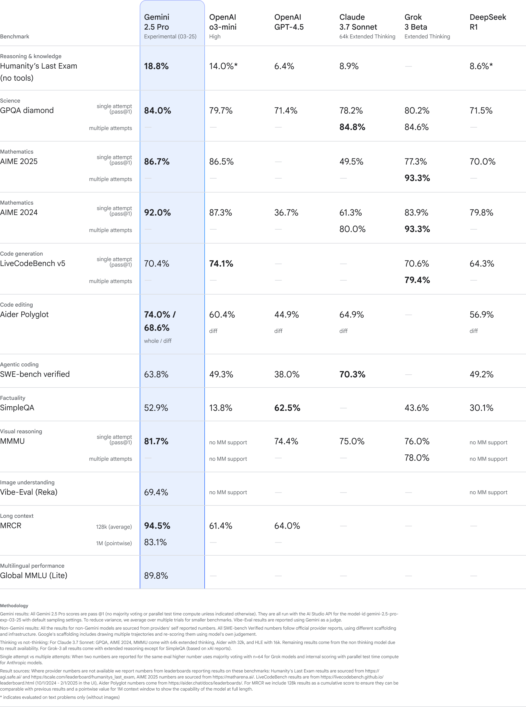

## 编程能力对比分析一撇

下图是Google 在发布2.5 Pro时公布的一个对比数据，在这里作为一个参考来进行编码能力的分析对比。

### 1. **核心编程相关基准**

在该表格里面，编程能力的对比主要看以下三项：

- **LiveCodeBench v5**（代码生成）
- **Aider Polyglot**（代码编辑）
- **SWE-bench verified**（Agentic编码/自动修复真实开源项目）
- （可辅以**SimpleQA**与多模态任务，但这两个主要考查事实问答和视觉推理，不是主力）

#### **LiveCodeBench v5（代码生成）**

| 模型         | 分数（单次尝试） |
|--------------|-----------------|
| Gemini 2.5 Pro | 70.4%          |
| OpenAI o3-mini | 74.1%          |
| Claude 3.7 Sonnet | 70.6%      |
| Grok 3 Beta   | 79.4%           |
| DeepSeek R1   | 64.3%           |

**结论**：Grok 3 Beta > OpenAI o3-mini ≈ Claude 3.7 ≈ Gemini 2.5 > DeepSeek R1

#### **Aider Polyglot（代码编辑）**

| 模型         | 分数（whole/diff） |
|--------------|-------------------|
| Gemini 2.5 Pro | 74.0% / 68.6%   |
| OpenAI o3-mini | 60.4%           |
| Claude 3.7 Sonnet | 64.9%        |
| Grok 3 Beta   | 56.9%            |
| DeepSeek R1   | 无diff分数       |

**结论**：Gemini 2.5 Pro > Claude 3.7 > OpenAI o3-mini > Grok 3 Beta

#### **SWE-bench verified（Agentic自动修复）**

| 模型         | 分数   |
|--------------|--------|
| Gemini 2.5 Pro | 63.8% |
| OpenAI o3-mini | 49.3% |
| OpenAI GPT-4.5 | 38.0% |
| Claude 3.7 Sonnet | 70.3% |
| DeepSeek R1   | 49.2% |

**结论**：Claude 3.7 > Gemini 2.5 > OpenAI o3-mini ≈ DeepSeek R1 > GPT-4.5

### 2. **综合排名与洞察**

#### **综合榜单总结**

- **Grok 3 Beta**：代码生成能力最强（LiveCodeBench v5第一），但代码编辑和Agentic能力一般。
- **Claude 3.7 Sonnet**：Agentic修复能力最强（SWE-bench第一），代码生成和编辑能力也很突出。
- **Gemini 2.5 Pro**：代码编辑能力第一，Agentic修复能力次之，代码生成能力略逊于Grok和Claude。
- **OpenAI o3-mini**：代码生成能力突出，但在代码编辑和Agentic能力上略逊。
- **DeepSeek R1**：整体表现较为均衡，但没有一项拔尖。

#### **领域细分建议**

- **需要自动修复、Agentic能力**：**Claude 3.7 Sonnet**
- **需要多语言代码编辑、交互式代码能力**：**Gemini 2.5 Pro**
- **追求极致代码生成（如竞赛、刷题）**：**Grok 3 Beta**
- **均衡选手**：**Gemini 2.5 Pro** 和 **Claude 3.7 Sonnet**

## 脑洞大开的建议

可以打造**极致AI编程助手**，可以考虑**多模型协作**（Multi-Agent System）：

- **代码生成用Grok 3 Beta**，**代码编辑用Gemini 2.5**，**自动修复用Claude 3.7**，通过API级集成，自动分流任务到最优模型。
- 用**强化学习（RLHF）**训练一个“调度Agent”，动态决定哪个模型处理哪类任务，甚至可以通过小样本微调让调度Agent自适应你的个人编程风格。
- 最后，搞一个跨模型的“代码质量评审Agent”，用多模型投票机制自动甄别和优化生成代码。

这样你不仅能用到各家模型的最强能力，还能打造出远超单一模型的**AI超级编程工作流**！
