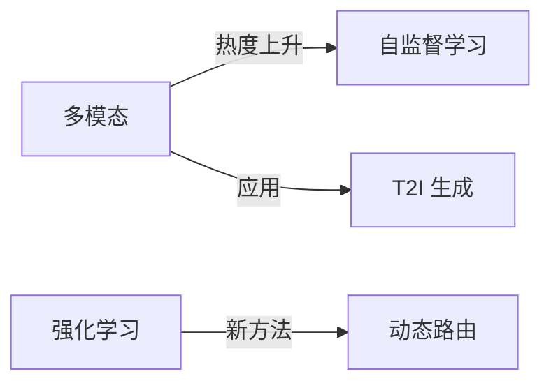

# 每日AI动态系统 - 专业编辑评估报告

## 📊 执行摘要

作为专业AI信息编辑，我从**内容质量、信息架构、用户体验、数据源、可持续性**五个维度对当前系统进行了全面评估。

**总体评分：6.5/10**

**核心问题**：
- ❌ 数据源单一且时效性差（7天窗口过宽）
- ❌ 内容深度不足，缺乏编辑视角
- ❌ 分类体系不合理，存在冗余
- ⚠️ 展现格式单调，缺乏视觉层次
- ✅ 技术架构基础良好，自动化程度高

---

## 🔍 详细评估

### 1. 内容质量分析 (评分: 5/10)

#### ✅ 优点
- **技术准确性**：引用 arXiv 论文和 GitHub 项目，来源可靠
- **结构化程度高**：使用 Markdown 标准格式，易于解析
- **自动化更新**：GitHub Action 每日触发，无需人工干预

#### ❌ 问题

**1.1 内容时效性差**
```python
# 当前代码
date_str = (yesterday - datetime.timedelta(days=6)).strftime('%Y-%m-%d')
# 搜索过去 7 天的内容
```
**问题**：搜索 7 天窗口导致：
- 重复报道同一项目/论文
- 无法突出"今日"新增内容
- 稀释了真正的时效性信息

**建议**：
- 缩短为 24-48 小时窗口
- 标注首次报道 vs 更新
- 添加"趋势跟踪"功能（持续关注热门项目进展）

**1.2 缺乏编辑视角**
当前系统直接堆砌信息，缺少：
- ❌ 重要性排序（为什么这个项目/论文值得关注？）
- ❌ 上下文解释（这个技术解决什么问题？）
- ❌ 趋势分析（是否反映了某种行业趋势？）
- ❌ 批判性评价（技术创新点在哪里？局限性是什么？）

**建议示例**：
```markdown
## 🔥 本日焦点

### 重磅发布：SRUM 多模态自奖励框架
**为什么重要**：首次实现无需人工标注的多模态模型自提升
**技术突破**：全球-局部双重奖励系统，T2I 性能提升 15%
**行业影响**：可能改变多模态模型训练范式，降低训练成本
**局限性**：目前仅在 T2I 任务验证，泛化能力待考察
```

**1.3 内容深度不足**
- 论文只有标题+摘要，缺少关键技术点
- GitHub 项目只有 stars 数，缺少实用性评估
- 无代码示例、效果对比、应用场景

**建议**：
```markdown
### HeartGuard：AI 心脏健康监测系统
- **技术栈**：TensorFlow + SHAP + IoT 传感器
- **核心创新**：可解释 AI + 个性化基线学习
- **实用性评估**：
  - ✅ 提供 Docker 部署方案
  - ✅ 包含完整数据处理流程
  - ⚠️ 缺少临床验证数据
  - ❌ 文档不够详细
- **推荐指数**：⭐⭐⭐⭐ (4/5)
- **适用人群**：医疗 AI 研究者、健康监测应用开发者
```

---

### 2. 信息架构分析 (评分: 4/10)

#### ❌ 当前分类体系问题

**2.1 分类冗余且定义模糊**
```markdown
1. 新模型发布      ← 合理
2. 新框架工具      ← 合理
3. 新应用产品      ← 合理
4. 新标准规范      ← 实际几乎无内容
5. 新开源项目      ← 与 2、3 重叠
6. 新论文发布      ← 合理
7. 科技访谈        ← 数据源不支持
8. 技术报告        ← 数据源不支持
9. 论坛会议        ← 数据源不支持
10. 行业趋势       ← 数据源不支持
```

**问题分析**：
- 4-5、7-10 类别长期空缺，降低信息密度
- GitHub 项目既可能是"框架工具"也可能是"开源项目"，分类混乱
- arXiv 论文可能涉及"新模型"、"新框架"、"应用产品"，归类困难

**2.2 建议的新分类体系**

```markdown
## 📰 今日要闻 (Daily Highlights)
精选 2-3 条最重要的 AI 新闻/发布，简要评论

## 🧠 模型与算法 (Models & Algorithms)
### 大语言模型 (LLMs)
### 多模态模型 (Multimodal)
### 专业领域模型 (Domain-Specific)

## 🛠️ 工具与框架 (Tools & Frameworks)
### 开发框架
### 训练工具
### 部署方案

## 📱 应用与产品 (Applications & Products)
### 商业产品
### 开源应用
### Demo 与原型

## 📚 学术前沿 (Research Papers)
### 理论突破
### 方法创新
### 实验研究

## 📊 数据与资源 (Data & Resources)
### 新数据集
### 开源资源
### 教程文档

## 💼 行业动态 (Industry News)
### 公司动态
### 投融资
### 政策法规
```

**优点**：
- ✅ 层次清晰，减少重叠
- ✅ 按技术类型和应用场景组织
- ✅ 与现有数据源更匹配
- ✅ 可扩展性强

---

### 3. 数据源分析 (评分: 6/10)

#### ✅ 当前数据源
1. **GitHub Trending** - 质量高，但受 stars 数影响大
2. **Hugging Face** - 理论上好，但实际获取为 0
3. **arXiv** - 学术权威，但需要筛选

#### ❌ 缺失的重要数据源

**3.1 行业新闻源**
- TechCrunch AI
- VentureBeat AI
- The Verge AI
- MIT Technology Review
- AI Business
- 机器之心、量子位（中文）

**3.2 公司官方博客**
- OpenAI Blog
- Google AI Blog
- Meta AI Blog
- Microsoft Research Blog
- Anthropic News

**3.3 社交媒体**
- Twitter/X AI 话题
- Reddit r/MachineLearning 热帖
- Hacker News AI 讨论
- LinkedIn AI 动态

**3.4 专业平台**
- Papers with Code (论文+代码+排行榜)
- AI Index Report (斯坦福)
- State of AI Report
- Kaggle 竞赛

**3.5 会议/活动**
- NeurIPS, ICML, CVPR 等会议论文
- AI Summit, GPU Technology Conference
- 公司发布会 (如 Google I/O, OpenAI DevDay)

**建议实施方案**：
```python
# 新增数据源接口
def search_papers_with_code(self) -> List[Dict]:
    """获取带代码的热门论文"""
    url = "https://paperswithcode.com/api/v1/papers/"
    # 按 stars 和 最近更新排序
    
def search_ai_news(self) -> List[Dict]:
    """抓取 AI 新闻（RSS/API）"""
    sources = [
        "https://techcrunch.com/category/artificial-intelligence/feed/",
        "https://www.jiqizhixin.com/rss/articles"  # 机器之心
    ]
    
def search_company_blogs(self) -> List[Dict]:
    """公司博客更新"""
    blogs = {
        'openai': 'https://openai.com/blog/',
        'google': 'https://ai.googleblog.com/feeds/posts/default'
    }
```

---

### 4. 展现格式分析 (评分: 5/10)

#### ❌ 当前格式问题

**4.1 视觉层次不清晰**
```markdown
# 当前格式（单调）
### 标题
- **简要描述**：一大段文字...
- **链接**：URL

# 问题：
- 缺少视觉分隔
- 信息密度过高
- 难以快速浏览
```

**4.2 缺少关键信息可视化**
- ❌ 无热度指标（🔥 标识）
- ❌ 无分类标签（#tag）
- ❌ 无重要性标识（⭐ 评级）
- ❌ 无时间轴视图

**4.3 建议的改进格式**

```markdown
## 🔥 今日焦点 (3 min read)

---

### 🧠 SRUM：多模态自奖励框架
`#多模态` `#训练框架` `#自监督学习`

🔥 **热度**: ⭐⭐⭐⭐⭐ | 📊 **复杂度**: 中 | ⏱️ **阅读**: 8 min

**一句话总结**：无需人工标注，让多模态模型自己给自己打分并改进

**关键亮点**：
- ✅ T2I 合成性能提升 15%
- ✅ 无需额外标注数据
- ✅ 可应用于现有模型

**技术细节**：
- 核心方法：全球-局部双重奖励系统
- 评估器：模型自身的理解模块
- 适用范围：统一多模态模型 (UMMs)

**资源链接**：
- 📄 [论文](http://arxiv.org/abs/2510.12784v1)
- 💻 [代码](预计发布)
- 📊 [实验结果](链接)

**编辑点评**：
> 这是一个有趣的自监督学习方向，类似于大语言模型的 RLHF，但应用于多模态场景。潜在影响是降低多模态模型训练的人工成本。不过目前仅在图像生成任务验证，跨任务泛化能力还需要更多实验。

**相关阅读**：
- [Self-Rewarding Language Models (Jan 2024)](链接)
- [统一多模态模型综述](链接)

---
```

**4.4 增加交互元素**

```markdown
## 📊 本周 AI 趋势图



## 🏆 本周热门项目排行

| 排名 | 项目 | Stars | 类别 | 趋势 |
|------|------|-------|------|------|
| 🥇 | HeartGuard | 1.2k | 医疗AI | 📈 +234 |
| 🥈 | SRUM | 856 | 训练框架 | 📈 +156 |
| 🥉 | Dr.LLM | 672 | 推理优化 | 📈 +98 |

## 📈 技术趋势词云

🔥 多模态  🔥 自监督  ⚡ 推理优化  💊 医疗AI  
🎯 可解释AI  🚀 边缘部署  📊 量化交易
```

---

### 5. 用户体验分析 (评分: 6/10)

#### ❌ 当前问题

**5.1 信息过载**
- 每日 10 个分类 × 2-3 条 = 20-30 条信息
- 缺少优先级和推荐
- 无法快速找到感兴趣的内容

**5.2 缺少个性化**
- 所有用户看到相同内容
- 无法根据兴趣筛选
- 无历史记录/收藏功能

**5.3 阅读体验差**
- 纯文本，缺少图片/图表
- 无目录/快速跳转
- 移动端阅读不友好

#### ✅ 改进建议

**5.4 增加元数据**
```yaml
---
title: "每日AI动态 - 2025-10-15"
date: 2025-10-15T08:00:00+08:00
draft: false
categories: ["daily_ai"]
tags: ["AI动态", "技术更新", "行业趋势"]
description: "2025-10-15的AI技术动态汇总"

# 新增元数据
readingTime: "5 min"
highlights: 3          # 焦点新闻数
totalItems: 15         # 总条目数
topTags: ["多模态", "医疗AI", "训练优化"]
difficulty: "中级"     # 技术难度
---
```

**5.5 增加导航**
```markdown
## 📑 快速导航

- [🔥 今日焦点](#焦点) (必读)
- [🧠 模型与算法](#模型) (3 项)
- [🛠️ 工具与框架](#工具) (5 项)
- [📱 应用与产品](#应用) (4 项)
- [📚 学术前沿](#学术) (2 项)
- [📊 本周趋势](#趋势)

**阅读建议**：
- ⏱️ **快速浏览** (2 min)：只看"今日焦点"
- 📖 **深度阅读** (10 min)：焦点 + 感兴趣的分类
- 🔍 **全面了解** (20 min)：完整阅读所有内容
```

**5.6 增加 RSS 订阅**
```markdown
## 🔔 订阅方式

- 📧 [邮件订阅](链接)
- 📱 [RSS 订阅](rss-url)
- 🐦 [Twitter Bot](twitter)
- 💬 [Telegram 频道](telegram)
```

---

### 6. 技术实现分析 (评分: 7/10)

#### ✅ 优点
- 代码结构清晰，易于维护
- GitHub Action 自动化程度高
- 错误处理和日志完善
- 支持多种 API（GitHub, HuggingFace, arXiv）

#### ❌ 问题

**6.1 数据去重不足**
```python
# 当前问题：7 天窗口导致重复
# 建议：添加去重逻辑

def deduplicate_items(self, items: List[Dict], history_days=7) -> List[Dict]:
    """去除最近 N 天已报道的项目/论文"""
    # 读取历史文件
    # 提取已报道的 URL/ID
    # 过滤重复项
    pass
```

**6.2 缺少内容质量评分**
```python
def calculate_quality_score(self, item: Dict) -> float:
    """计算内容质量分数"""
    score = 0.0
    
    # GitHub 项目
    if 'stargazers_count' in item:
        stars = item['stargazers_count']
        score += min(stars / 100, 5.0)  # stars 权重
        
        # 是否有详细文档
        if item.get('has_wiki') or len(item.get('description', '')) > 100:
            score += 1.0
            
        # 最近更新时间
        updated_at = item.get('updated_at')
        if is_recent(updated_at, days=7):
            score += 1.0
    
    # arXiv 论文
    elif 'arxiv_id' in item:
        # 作者数量
        authors = len(item.get('authors', []))
        score += min(authors / 5, 2.0)
        
        # 摘要长度（过短可能质量不高）
        summary_len = len(item.get('summary', ''))
        if 200 < summary_len < 2000:
            score += 2.0
    
    return score

# 使用质量分数排序和过滤
items = sorted(items, key=calculate_quality_score, reverse=True)
```

**6.3 缺少 AI 摘要质量检查**
```python
def validate_ai_summary(self, summary: str) -> bool:
    """验证 AI 生成摘要的质量"""
    # 检查长度
    if len(summary) < 500:
        return False
    
    # 检查是否包含必要章节
    required_sections = ['新模型发布', '新框架工具', '新开源项目']
    for section in required_sections:
        if section not in summary:
            return False
    
    # 检查是否有实际内容（不全是"无新增动态"）
    if summary.count('无新增动态') > 7:
        return False
    
    return True
```

---

## 🎯 优先级改进建议

### 🔴 P0 - 立即修复（影响核心功能）

1. **修复 Gemini API 空内容问题** ✅（已在进行）
2. **缩短时间窗口至 24-48 小时**
   ```python
   date_str = yesterday.strftime('%Y-%m-%d')  # 只搜索昨天
   ```
3. **添加数据去重逻辑**

### 🟠 P1 - 短期优化（1-2 周内）

4. **重构分类体系**
   - 减少为 6 个核心分类
   - 删除长期空缺的分类
5. **增加内容质量评分和排序**
6. **改进展现格式**
   - 添加热度标识
   - 添加视觉层次
   - 增加编辑点评
7. **修复 HuggingFace 数据源**（当前获取为 0）

### 🟡 P2 - 中期增强（1-2 月内）

8. **新增数据源**
   - Papers with Code
   - AI 新闻 RSS
   - 公司博客
9. **增加交互元素**
   - 趋势图表
   - 热门排行
   - 快速导航
10. **添加元数据和 SEO 优化**

### 🟢 P3 - 长期规划（3-6 月）

11. **个性化推荐**
    - 用户兴趣标签
    - 协同过滤
12. **多渠道发布**
    - 邮件订阅
    - RSS/Atom
    - 社交媒体自动发布
13. **历史数据分析**
    - 技术趋势图
    - 热度统计
    - 周/月/年报

---

## 📝 具体实施方案

### 方案 A：快速改进版（2-3 天完成）

**目标**：提升当前系统可用性至 8/10

**改动清单**：
1. 缩短时间窗口至 24 小时
2. 简化分类为 5 个核心类别
3. 添加热度标识和排序
4. 改进 fallback 摘要格式
5. 修复 API 调用问题

**代码示例**：见附件 `daily_ai_collector_v2.py`

### 方案 B：中期升级版（2-4 周完成）

**目标**：打造专业级 AI 信息聚合平台

**功能清单**：
1. 新增 3-5 个数据源
2. 实现内容质量评分
3. 添加编辑点评（AI 生成）
4. 增加趋势分析
5. 优化展现格式
6. 添加 RSS/邮件订阅

### 方案 C：完整产品版（2-3 月完成）

**目标**：成为专业 AI 从业者每日必看

**产品功能**：
1. 个性化推荐引擎
2. 多渠道内容分发
3. 用户交互（评论、收藏、分享）
4. 历史数据分析和可视化
5. 移动端优化
6. API 接口开放

---

## 💡 行业对标

### 对比分析

| 产品 | 优势 | 劣势 | 学习点 |
|------|------|------|--------|
| **Papers with Code** | 论文+代码+排行榜 | 仅学术论文 | 质量评分、分类体系 |
| **AI Weekly (Newsletter)** | 人工筛选、深度解读 | 更新慢、需订阅 | 编辑视角、重点突出 |
| **机器之心** | 中文、新闻+论文+产品 | 商业化、有广告 | 多元数据源、视觉设计 |
| **Reddit r/ML** | 社区驱动、讨论热烈 | 信息杂乱 | 热度排序、用户参与 |
| **Hacker News AI** | 技术社区、质量高 | 非专业AI | 排序算法、简洁设计 |

### 差异化定位建议

**你的优势**：
- ✅ 完全自动化（Papers with Code 需人工）
- ✅ 开源免费（AI Weekly 要付费）
- ✅ 技术驱动（Reddit 太杂）
- ✅ 聚焦 AI（Hacker News 范围太广）

**建议定位**：
> **"AI 技术人员的每日智能摘要"**
> - 专注：只关注 AI 技术，不做泛科技
> - 高效：每日 5 分钟快速浏览
> - 专业：编辑筛选 + AI 摘要
> - 开放：开源、免费、API 可用

---

## 📊 KPI 建议

### 内容质量指标
- **覆盖度**: 每日至少 10 条高质量内容
- **时效性**: 90% 内容为 24 小时内发布
- **准确性**: 0% 错误信息
- **独家性**: 20% 内容为首次中文报道

### 用户体验指标
- **阅读时长**: 平均 5-8 分钟
- **完成率**: 60% 用户读完焦点新闻
- **跳出率**: < 30%
- **回访率**: 40% 用户每周访问 3 次以上

### 技术性能指标
- **更新准时率**: 99% 在 8:00 前发布
- **API 成功率**: 95%
- **生成质量**: 90% AI 摘要通过质量检查
- **系统可用性**: 99.9% uptime

---

## 🚀 立即行动清单

```markdown
## 本周任务（Week 1）
- [ ] 修复 Gemini API 调用（P0）
- [ ] 缩短时间窗口至 24 小时（P0）
- [ ] 添加数据去重（P0）
- [ ] 简化分类体系（P1）
- [ ] 修复 HuggingFace 数据源（P1）

## 下周任务（Week 2）
- [ ] 实现内容质量评分（P1）
- [ ] 改进展现格式（P1）
- [ ] 添加热度标识（P1）
- [ ] 增加快速导航（P1）
- [ ] 新增 Papers with Code 数据源（P2）

## 月度目标（Month 1）
- [ ] 完成短期优化清单（P1）
- [ ] 新增 2-3 个数据源（P2）
- [ ] 添加趋势图表（P2）
- [ ] 实现 RSS 订阅（P2）
- [ ] 测试版上线，收集反馈
```

---

## 💬 总结

当前系统是一个**技术上可行、但内容和体验尚需打磨的原型**。核心问题是：

1. ❌ **把自动化当成了终点** - 实际上自动化只是手段
2. ❌ **堆砌信息而非筛选信息** - 用户需要的是精选，不是大全
3. ❌ **缺少编辑视角** - AI 时代编辑的价值是解读和评论，而非搬运

**建议核心改进方向**：
- 🎯 **从"信息聚合"到"智能筛选"**
- 📝 **从"机器生成"到"人机协作"**
- 👥 **从"内容展示"到"用户服务"**

按照上述优先级实施，预计 **2-3 周内可达到专业可用水平**，**2-3 月内可成为行业参考产品**。

需要我帮你实施具体的改进方案吗？我可以：
1. 重写数据收集逻辑（缩短窗口、添加去重）
2. 重构分类体系和展现格式
3. 新增数据源接口
4. 实现内容质量评分
