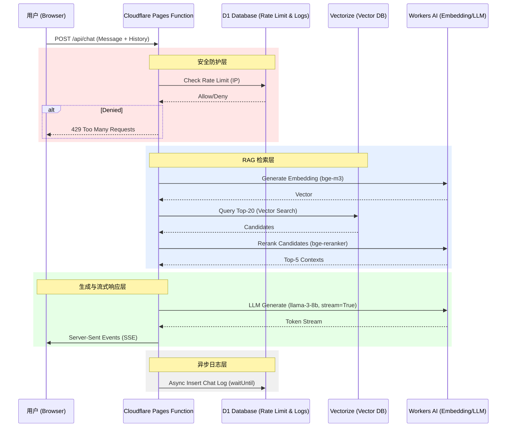

# RAG 数字人架构设计文档 (V2)

**版本**: 2.0
**日期**: 2025-12-14
**状态**: 已实施
**架构师**: Trae AI

---

## 1. 概述

本文档记录了基于 Hugo + Cloudflare Pages 全栈架构的 RAG（检索增强生成）数字人助手的最终实施细节。该版本重点解决了响应延迟、接口安全和数据持久化问题，完全基于 Cloudflare 免费层级 (Free Tier) 构建。

## 2. 系统架构

### 2.1 数据流图



## 3. 核心功能实现细节

### 3.1 流式响应 (Streaming)
为了解决 Llama-3 模型生成延迟高的问题，采用了 Server-Sent Events (SSE) 标准。

*   **协议**: `Content-Type: text/event-stream`
*   **数据格式**: Cloudflare Workers AI 原生流格式 `data: {"response":"token"}`。
*   **引用传递**: 由于 Body 被流占用，RAG 检索到的引用链接通过自定义 Header `X-RAG-References` 在首个响应包中传递给前端。
*   **前端渲染**: 使用 `TextDecoder` 解码流，配合 `marked.js` 实现 Markdown 实时渲染。

### 3.2 免费级限流 (Application-Layer Rate Limiting)
替代收费的 Cloudflare WAF Rate Limiting，使用 D1 数据库实现滑动窗口计数器。

*   **存储**: D1 表 `rate_limits`
    *   `ip`: 客户端 IP (Primary Key)
    *   `count`: 当前窗口内请求次数
    *   `last_reset`: 窗口开始时间戳
*   **策略**:
    *   窗口期: 60秒
    *   限额: 10次请求
*   **容错**: 采用 Fail-open 策略，若数据库连接失败则允许请求，避免阻断正常业务。

### 3.3 数据持久化与审计
记录完整的对话日志，用于后续分析和模型微调。

*   **存储**: D1 表 `chat_logs`
    *   `id`: 自增主键
    *   `ip`: 用户 IP
    *   `user_message`: 用户提问
    *   `ai_response`: AI 完整回复
    *   `created_at`: 时间戳
*   **实现技巧**: 使用 `TransformStream` 在后端拦截流式数据，拼接完整回复后，利用 `context.waitUntil()` 在响应结束后异步写入数据库，不增加用户等待时间。

### 3.4 检索增强 (RAG Core)
*   **模型**:
    *   Embedding: `@cf/baai/bge-m3`
    *   Reranker: `@cf/baai/bge-reranker-base`
    *   LLM: `@cf/meta/llama-3-8b-instruct`
*   **流程**: Vector Search (Top-20) -> Rerank (Top-5) -> Prompt Engineering -> Generation。
*   **索引越界保护**: 修复了 Reranker 返回索引可能超出 Candidates 数组范围的 Bug。

## 4. 数据库 Schema

### `rate_limits`
```sql
CREATE TABLE IF NOT EXISTS rate_limits (
    ip TEXT PRIMARY KEY, 
    count INTEGER, 
    last_reset INTEGER
);
```

### `chat_logs`
```sql
CREATE TABLE IF NOT EXISTS chat_logs (
    id INTEGER PRIMARY KEY AUTOINCREMENT, 
    ip TEXT, 
    user_message TEXT, 
    ai_response TEXT, 
    created_at INTEGER
);
```

## 5. 与初版计划的差异说明

| 功能模块 | 初版计划/诊断建议 | 最终实现 | 差异原因 |
| :--- | :--- | :--- | :--- |
| **限流** | 建议使用 Cloudflare WAF (收费) 或 KV | 使用 **D1 数据库** | D1 免费额度更充裕，且支持更复杂的查询逻辑，成本更低。 |
| **上下文** | 建议实现“跨端/持久化记忆” | 实现了 **服务端日志审计** | 暂未改造前端以从 D1 拉取历史。目前前端仍维持 `history` 数组上传模式，服务端 D1 主要用于后台审计和数据积累。这是一个折中方案，简化了前端复杂度。 |
| **引用展示** | 未详细定义 | 使用 **HTTP Header** 传递 | 适应流式传输的巧妙设计，避免在 SSE 流中混合元数据。 |
| **错误处理** | 简单的 500 错误 | **502/429/400 细分状态码** | 增强了可观测性和客户端错误处理能力。 |

## 6. 后续优化建议 (Next Steps)
1.  **前端重构**: 将会话历史管理移至服务端，前端仅传递 `session_id`。
2.  **混合检索**: 引入关键词检索 (BM25) 以弥补纯向量检索对专有名词的不足。
3.  **管理后台**: 开发一个简单的 Dashboard 查看 `chat_logs` 和限流情况。
